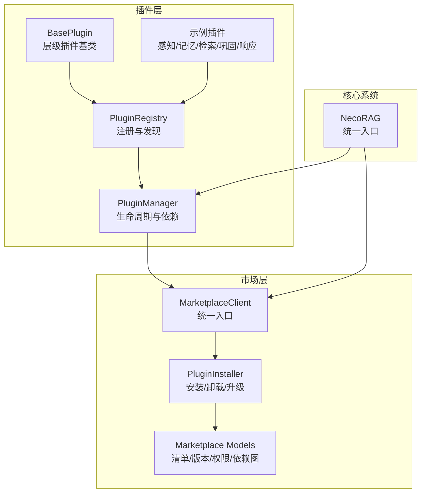
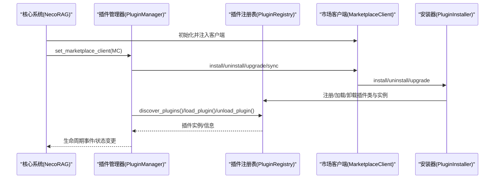
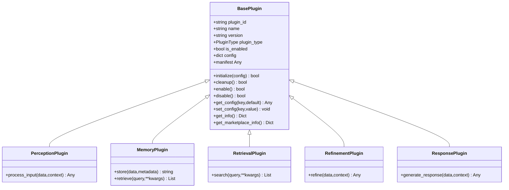
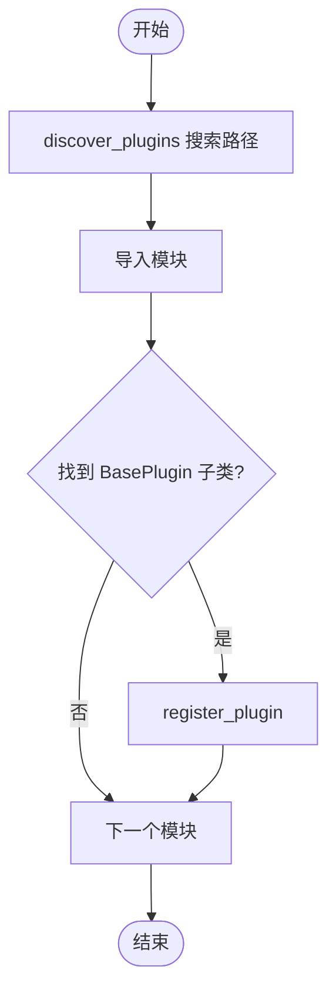
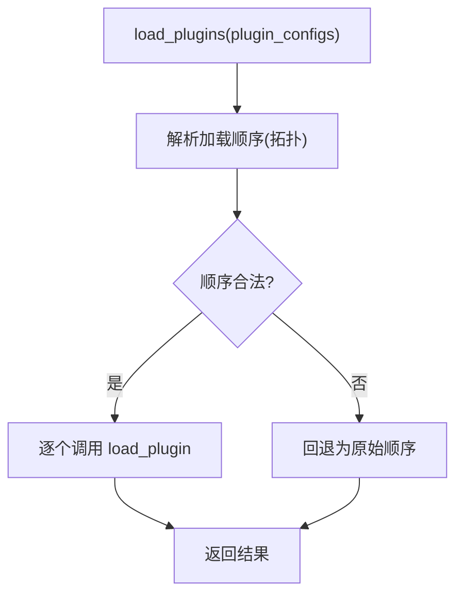
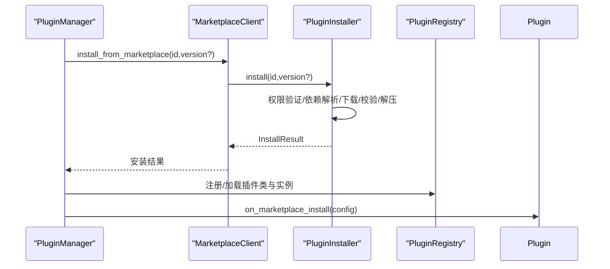
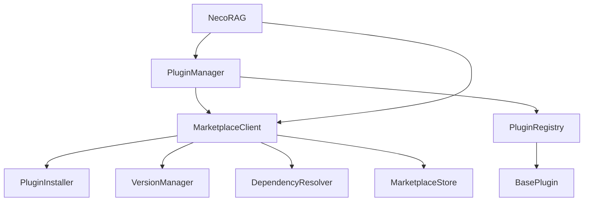

# 插件管理器

<cite>
**本文引用的文件**
- [src/plugins/__init__.py](file://src/plugins/__init__.py)
- [src/plugins/base.py](file://src/plugins/base.py)
- [src/plugins/manager.py](file://src/plugins/manager.py)
- [src/plugins/registry.py](file://src/plugins/registry.py)
- [src/plugins/example_plugins.py](file://src/plugins/example_plugins.py)
- [src/marketplace/__init__.py](file://src/marketplace/__init__.py)
- [src/marketplace/models.py](file://src/marketplace/models.py)
- [src/marketplace/installer.py](file://src/marketplace/installer.py)
- [src/marketplace/client.py](file://src/marketplace/client.py)
- [src/necorag.py](file://src/necorag.py)
</cite>

## 目录
1. [简介](#简介)
2. [项目结构](#项目结构)
3. [核心组件](#核心组件)
4. [架构总览](#架构总览)
5. [详细组件分析](#详细组件分析)
6. [依赖分析](#依赖分析)
7. [性能考虑](#性能考虑)
8. [故障排除指南](#故障排除指南)
9. [结论](#结论)
10. [附录](#附录)

## 简介
本文件为 NecoRAG 插件管理器的全面实现文档，涵盖插件的动态加载、卸载、启用与禁用管理；插件生命周期协调机制（初始化顺序控制与资源清理策略）；插件状态跟踪与监控（健康检查与错误处理）；插件间依赖关系管理与冲突解决；插件管理器的配置选项与扩展接口；以及与核心系统的集成方式与通信协议。文档同时提供实际使用案例与故障排除指南，帮助开发者与运维人员高效、安全地使用与维护插件生态。

## 项目结构
插件系统位于 src/plugins 目录，核心文件包括：
- 插件基类与类型定义：base.py
- 插件注册表：registry.py
- 插件管理器：manager.py
- 插件示例：example_plugins.py
- 插件市场集成：marketplace 子模块（models、installer、client）

此外，核心系统 src/necorag.py 在初始化阶段负责软依赖插件市场模块，并可将 MarketplaceClient 注入到插件管理器，实现“市场驱动”的插件安装、升级与卸载。

图表来源
- [src/plugins/base.py:25-385](file://src/plugins/base.py#L25-L385)
- [src/plugins/registry.py:15-383](file://src/plugins/registry.py#L15-L383)
- [src/plugins/manager.py:14-584](file://src/plugins/manager.py#L14-L584)
- [src/plugins/example_plugins.py:13-332](file://src/plugins/example_plugins.py#L13-L332)
- [src/marketplace/models.py:135-756](file://src/marketplace/models.py#L135-L756)
- [src/marketplace/installer.py:152-800](file://src/marketplace/installer.py#L152-L800)
- [src/marketplace/client.py:47-919](file://src/marketplace/client.py#L47-L919)
- [src/necorag.py:199-220](file://src/necorag.py#L199-L220)

章节来源
- [src/plugins/__init__.py:1-45](file://src/plugins/__init__.py#L1-L45)
- [src/plugins/base.py:15-385](file://src/plugins/base.py#L15-L385)
- [src/plugins/registry.py:15-383](file://src/plugins/registry.py#L15-L383)
- [src/plugins/manager.py:14-584](file://src/plugins/manager.py#L14-L584)
- [src/plugins/example_plugins.py:13-332](file://src/plugins/example_plugins.py#L13-L332)
- [src/marketplace/__init__.py:1-192](file://src/marketplace/__init__.py#L1-L192)
- [src/marketplace/models.py:135-756](file://src/marketplace/models.py#L135-L756)
- [src/marketplace/installer.py:152-800](file://src/marketplace/installer.py#L152-L800)
- [src/marketplace/client.py:47-919](file://src/marketplace/client.py#L47-L919)
- [src/necorag.py:199-220](file://src/necorag.py#L199-L220)

## 核心组件
- 插件基类与类型
  - BasePlugin：定义插件标准接口、生命周期方法（initialize、cleanup）、启用/禁用钩子、配置管理、信息导出与市场元数据兼容。
  - 层级插件基类：PerceptionPlugin、MemoryPlugin、RetrievalPlugin、RefinementPlugin、ResponsePlugin，分别面向不同认知层级。
  - 插件类型枚举：PluginType，统一标识插件所属层级。
- 插件注册表
  - 负责插件类的注册、发现、验证、实例化与卸载；维护已注册与已加载插件集合；提供市场元数据缓存与版本索引。
- 插件管理器
  - 负责批量加载/卸载、启用/禁用、事件处理、依赖解析（拓扑排序）、与市场客户端集成（安装/卸载/升级/同步）。
- 市场集成
  - MarketplaceClient：统一入口，组合 Store、VersionManager、DependencyResolver、PluginInstaller、DiscoveryEngine、GDIAssessor、PluginSandbox、RepositoryManager。
  - PluginInstaller：实现插件安装、卸载、升级、回滚、依赖安装、校验与钩子回调。
  - Marketplace Models：定义插件清单、版本、安装记录、依赖图、权限、GDI 评分等数据结构。

章节来源
- [src/plugins/base.py:15-385](file://src/plugins/base.py#L15-L385)
- [src/plugins/registry.py:15-383](file://src/plugins/registry.py#L15-L383)
- [src/plugins/manager.py:14-584](file://src/plugins/manager.py#L14-L584)
- [src/marketplace/client.py:47-919](file://src/marketplace/client.py#L47-L919)
- [src/marketplace/installer.py:152-800](file://src/marketplace/installer.py#L152-L800)
- [src/marketplace/models.py:135-756](file://src/marketplace/models.py#L135-L756)

## 架构总览
插件管理器通过注册表与管理器协同工作，结合市场客户端实现“发现—注册—加载—启用—事件—监控—卸载”的完整生命周期闭环。核心系统在初始化阶段可注入市场客户端，使插件管理器具备从市场安装、升级与同步的能力。

图表来源
- [src/necorag.py:199-220](file://src/necorag.py#L199-L220)
- [src/plugins/manager.py:288-581](file://src/plugins/manager.py#L288-L581)
- [src/plugins/registry.py:80-131](file://src/plugins/registry.py#L80-L131)
- [src/marketplace/client.py:265-382](file://src/marketplace/client.py#L265-L382)
- [src/marketplace/installer.py:217-402](file://src/marketplace/installer.py#L217-L402)

## 详细组件分析

### 插件基类与层级插件
- 设计要点
  - 统一生命周期：initialize/cleanup；启用/禁用钩子（_enable/_disable），默认实现可覆盖。
  - 配置管理：get_config/set_config；get_info 输出插件基础信息。
  - 市场元数据兼容：manifest 与 get_marketplace_info，支持从 marketplace.models 映射或纯字典导出。
  - 层级约束：各层级插件定义特定接口（如感知层 process_input、记忆层 store/retrieve、检索层 search、巩固层 refine、响应层 generate_response）。
- 错误处理
  - 所有生命周期方法均包裹异常捕获，记录日志并返回布尔结果，便于上层决策。
- 复杂度分析
  - get_info 时间复杂度 O(k)，k 为描述字段数；依赖声明为 O(d)，d 为依赖数量。

图表来源
- [src/plugins/base.py:25-385](file://src/plugins/base.py#L25-L385)

章节来源
- [src/plugins/base.py:15-385](file://src/plugins/base.py#L15-L385)

### 插件注册表
- 职责
  - 注册插件类：register_plugin，验证类是否满足必需方法与可实例化。
  - 发现插件：discover_plugins，扫描路径并导入模块，查找 BasePlugin 子类进行注册。
  - 实例化与生命周期：load_plugin/unload_plugin，调用插件 initialize/cleanup。
  - 市场集成：版本索引 register_version/get_version、元数据缓存 set/get_marketplace_metadata、市场 ID 映射。
- 错误处理
  - 注册失败、加载失败、卸载失败均有日志记录与异常捕获。
- 复杂度分析
  - discover_plugins：O(n) 遍历模块，n 为模块数量；validate 与实例化开销与插件实现相关。

图表来源
- [src/plugins/registry.py:192-248](file://src/plugins/registry.py#L192-L248)

章节来源
- [src/plugins/registry.py:15-383](file://src/plugins/registry.py#L15-L383)

### 插件管理器
- 职责
  - 批量加载/卸载：load_plugins/unload_plugins，按依赖拓扑排序执行。
  - 启用/禁用：enable_plugins/disable_plugins，逐个调用插件 enable/disable。
  - 事件系统：register_event_handler/unregister_event_handler/emit_event，支持事件回调与插件通知。
  - 依赖解析：_resolve_load_order/_resolve_unload_order，拓扑排序，检测环形依赖。
  - 市场集成：install_from_marketplace/uninstall_marketplace_plugin/upgrade_marketplace_plugin/get_marketplace_plugins/sync_with_marketplace，与 MarketplaceClient 协同。
- 生命周期协调
  - 加载顺序：依据依赖图拓扑排序，优先加载无入度节点；若检测环形依赖，回退为原始顺序。
  - 卸载顺序：构建反向依赖图，按依赖逆序卸载，避免破坏依赖。
- 错误处理
  - 事件处理器异常不影响整体流程；依赖解析失败记录警告；市场操作失败记录错误并返回布尔结果。
- 复杂度分析
  - 拓扑排序：O(V+E)，V 为插件数，E 为依赖边数；事件广播为 O(H)（H 为处理器数量）。

图表来源
- [src/plugins/manager.py:26-66](file://src/plugins/manager.py#L26-L66)
- [src/plugins/manager.py:184-219](file://src/plugins/manager.py#L184-L219)

章节来源
- [src/plugins/manager.py:14-584](file://src/plugins/manager.py#L14-L584)

### 市场集成与插件生命周期
- MarketplaceClient
  - 组合 Store、VersionManager、DependencyResolver、PluginInstaller、DiscoveryEngine、GDIAssessor、PluginSandbox、RepositoryManager。
  - 提供 install/uninstall/upgrade/upgrade_all/rollback/check_updates/list_installed 等高级 API。
- PluginInstaller
  - 安装流程：权限验证（沙箱）→依赖解析 →下载/复制包 →校验 checksum →解压安装 →写入 manifest →记录安装记录 →触发钩子。
  - 卸载流程：前置钩子 →清理目录 →移除安装记录 →记录使用事件 →后置钩子。
  - 升级流程：记录旧版本 →调用升级 →更新记录 →触发钩子。
- Marketplace Models
  - 定义 PluginManifest、PluginRelease、PluginInstallation、DependencyGraph、GDIScore 等核心数据结构，支撑市场功能。

图表来源
- [src/plugins/manager.py:289-391](file://src/plugins/manager.py#L289-L391)
- [src/marketplace/client.py:265-294](file://src/marketplace/client.py#L265-L294)
- [src/marketplace/installer.py:217-402](file://src/marketplace/installer.py#L217-L402)
- [src/plugins/registry.py:80-111](file://src/plugins/registry.py#L80-L111)

章节来源
- [src/marketplace/client.py:47-919](file://src/marketplace/client.py#L47-L919)
- [src/marketplace/installer.py:152-800](file://src/marketplace/installer.py#L152-L800)
- [src/marketplace/models.py:135-756](file://src/marketplace/models.py#L135-L756)
- [src/plugins/manager.py:288-581](file://src/plugins/manager.py#L288-L581)
- [src/plugins/registry.py:80-131](file://src/plugins/registry.py#L80-L131)

### 插件状态跟踪与监控
- 状态跟踪
  - 插件信息：get_plugin_info 返回插件基础信息与依赖/反向依赖列表。
  - 已加载/已注册插件：loaded_plugins/registered_plugins 属性。
  - 市场插件状态：get_marketplace_plugins 返回版本、安装路径、加载与启用状态。
- 监控与健康检查
  - 日志记录：初始化、清理、启用/禁用、事件处理、市场操作均记录 INFO/WARNING/ERROR。
  - 依赖图：_build_dependency_graph 维护正向与反向依赖，便于诊断依赖问题。
- 错误处理
  - 生命周期异常捕获与日志输出；事件处理器异常不影响整体流程；市场操作失败返回失败结果并记录错误。

章节来源
- [src/plugins/manager.py:138-167](file://src/plugins/manager.py#L138-L167)
- [src/plugins/manager.py:254-270](file://src/plugins/manager.py#L254-L270)
- [src/plugins/manager.py:114-137](file://src/plugins/manager.py#L114-L137)

### 插件间依赖关系管理与冲突解决
- 依赖解析
  - 加载前：_resolve_load_order，拓扑排序，检测环形依赖并回退。
  - 卸载时：_resolve_unload_order，反向依赖拓扑排序，保证安全卸载。
  - 依赖图构建：_build_dependency_graph，记录正向与反向依赖。
- 冲突解决
  - 市场侧：PluginInstaller 在安装前进行依赖解析与安装；MarketplaceClient 的 DependencyResolver 与 VersionManager 提供冲突检测与升级路径规划。
  - 插件侧：BasePlugin.dependencies 明确声明依赖，避免隐式耦合。

章节来源
- [src/plugins/manager.py:184-270](file://src/plugins/manager.py#L184-L270)
- [src/marketplace/installer.py:403-457](file://src/marketplace/installer.py#L403-L457)
- [src/marketplace/client.py:611-635](file://src/marketplace/client.py#L611-L635)

### 配置选项与扩展接口
- 插件配置
  - BasePlugin.config：通过 set_config/get_config 动态配置；initialize 支持传入配置字典。
- 市场配置
  - MarketplaceConfig：插件市场目录、缓存目录、权限等级、资源配额、GDI 权重、搜索分页等。
- 扩展接口
  - 事件系统：register_event_handler/unregister_event_handler/emit_event。
  - 市场钩子：on_marketplace_install/on_marketplace_uninstall/on_marketplace_upgrade/on_marketplace_enable/on_marketplace_disable。
  - 插件注册：register_plugin/discover_plugins/load_plugin/unload_plugin。

章节来源
- [src/plugins/base.py:152-274](file://src/plugins/base.py#L152-L274)
- [src/plugins/registry.py:28-61](file://src/plugins/registry.py#L28-L61)
- [src/marketplace/client.py:62-104](file://src/marketplace/client.py#L62-L104)

### 实际使用案例
- 动态加载与启用
  - discover_and_register_plugins 搜索路径并注册插件；load_plugins 按依赖顺序加载；enable_plugins 启用指定插件。
- 事件驱动
  - register_event_handler 注册事件处理器；emit_event 触发事件，通知相关插件。
- 市场驱动安装
  - set_marketplace_client 注入客户端；install_from_marketplace 安装并加载；get_marketplace_plugins 查看状态；sync_with_marketplace 同步状态。
- 示例插件
  - 示例插件覆盖感知、记忆、检索、巩固、响应五层，展示 process_input/store/retrieve/search/refine/generate_response 的实现方式。

章节来源
- [src/plugins/manager.py:168-183](file://src/plugins/manager.py#L168-L183)
- [src/plugins/manager.py:90-137](file://src/plugins/manager.py#L90-L137)
- [src/plugins/manager.py:289-581](file://src/plugins/manager.py#L289-L581)
- [src/plugins/example_plugins.py:13-332](file://src/plugins/example_plugins.py#L13-L332)

## 依赖分析
- 组件耦合
  - PluginManager 依赖 PluginRegistry；PluginRegistry 依赖 BasePlugin；MarketplaceClient 组合多个子系统；NecoRAG 在初始化阶段注入 MarketplaceClient。
- 直接与间接依赖
  - 插件管理器通过注册表间接依赖插件实现类；市场客户端通过安装器间接依赖存储与版本管理。
- 外部依赖与集成点
  - marketplace.models：用于 manifest 映射；marketplace/installer：安装/卸载/升级；marketplace/client：统一入口。
- 接口契约
  - 插件必须实现 _initialize/_cleanup/description/dependencies；注册表验证类有效性。

图表来源
- [src/plugins/manager.py:10-11](file://src/plugins/manager.py#L10-L11)
- [src/plugins/registry.py](file://src/plugins/registry.py#L12)
- [src/marketplace/client.py:74-101](file://src/marketplace/client.py#L74-L101)
- [src/necorag.py:205-219](file://src/necorag.py#L205-L219)

章节来源
- [src/plugins/manager.py:10-11](file://src/plugins/manager.py#L10-L11)
- [src/plugins/registry.py](file://src/plugins/registry.py#L12)
- [src/marketplace/client.py:74-101](file://src/marketplace/client.py#L74-L101)
- [src/necorag.py:205-219](file://src/necorag.py#L205-L219)

## 性能考虑
- 加载与卸载
  - 拓扑排序确保最小化依赖等待；卸载按依赖逆序减少破坏风险。
- 事件处理
  - 事件广播为线性复杂度，建议控制处理器数量与单次处理成本。
- 市场操作
  - 安装/升级涉及 I/O 与校验，建议使用缓存目录与原子写入；权限验证与依赖解析在安装前完成，降低运行时开销。
- 日志与可观测性
  - 通过日志级别区分正常与异常路径，便于生产环境监控与定位问题。

## 故障排除指南
- 插件无法加载
  - 检查插件类是否正确继承 BasePlugin 并实现必需方法；确认注册表已注册；查看日志中的验证失败与实例化异常。
- 依赖环或循环加载
  - 管理器会检测环形依赖并回退为原始顺序；建议修正插件 dependencies，避免环。
- 启用/禁用失败
  - 检查插件 _enable/_disable 实现与日志；确认 is_enabled 状态一致性。
- 市场安装失败
  - 检查权限验证（沙箱）与依赖解析；核对下载与校验和；查看 InstallResult 的错误列表。
- 卸载被阻止
  - 检查反向依赖；如需强制卸载，使用 MarketplaceClient 的 force 参数。
- 事件处理异常
  - 单个处理器异常不会影响其他处理器；检查处理器日志与上下文数据。

章节来源
- [src/plugins/registry.py:250-268](file://src/plugins/registry.py#L250-L268)
- [src/plugins/manager.py:214-218](file://src/plugins/manager.py#L214-L218)
- [src/plugins/manager.py:130-136](file://src/plugins/manager.py#L130-L136)
- [src/marketplace/installer.py:290-309](file://src/marketplace/installer.py#L290-L309)
- [src/marketplace/installer.py:694-704](file://src/marketplace/installer.py#L694-L704)

## 结论
插件管理器通过清晰的生命周期划分、严格的依赖解析与事件机制、完善的市场集成，实现了插件的动态加载、安全卸载、启停控制与状态监控。结合核心系统的软依赖注入，形成“发现—注册—加载—启用—事件—监控—卸载”的闭环，既满足开发扩展需求，又保障生产环境的稳定性与安全性。建议在生产环境中配合日志与监控策略，持续优化依赖结构与事件处理性能。

## 附录
- 与核心系统的集成
  - NecoRAG 在初始化阶段尝试导入并初始化 MarketplaceClient，随后注入到插件管理器，实现“市场驱动”的插件管理能力。
- 市场数据模型
  - PluginManifest、PluginRelease、PluginInstallation、DependencyGraph、GDIScore 等模型支撑市场功能与质量评估。

章节来源
- [src/necorag.py:199-220](file://src/necorag.py#L199-L220)
- [src/marketplace/models.py:135-756](file://src/marketplace/models.py#L135-L756)