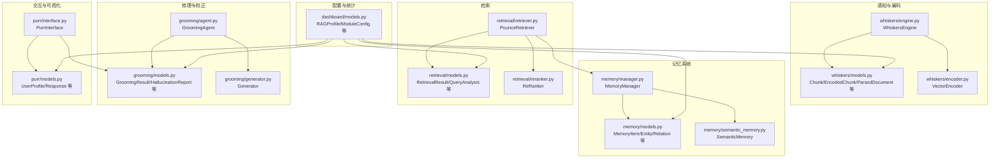
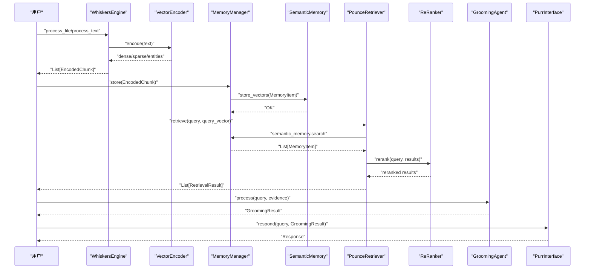
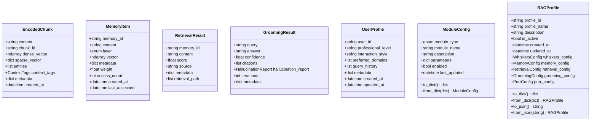
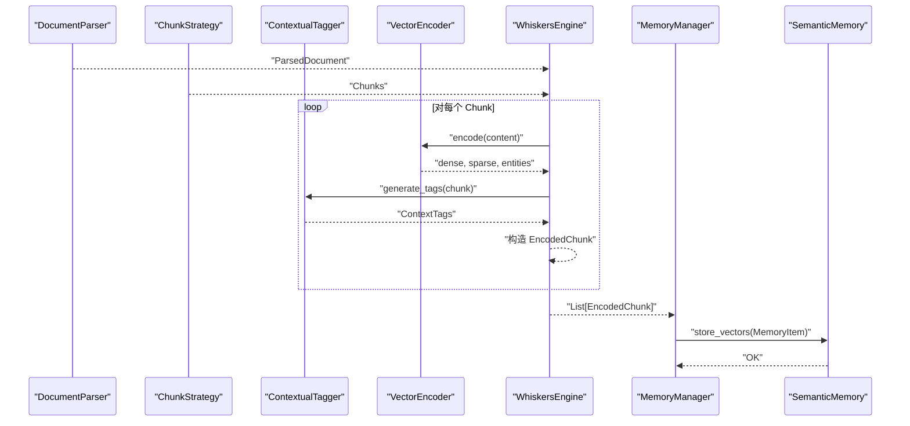
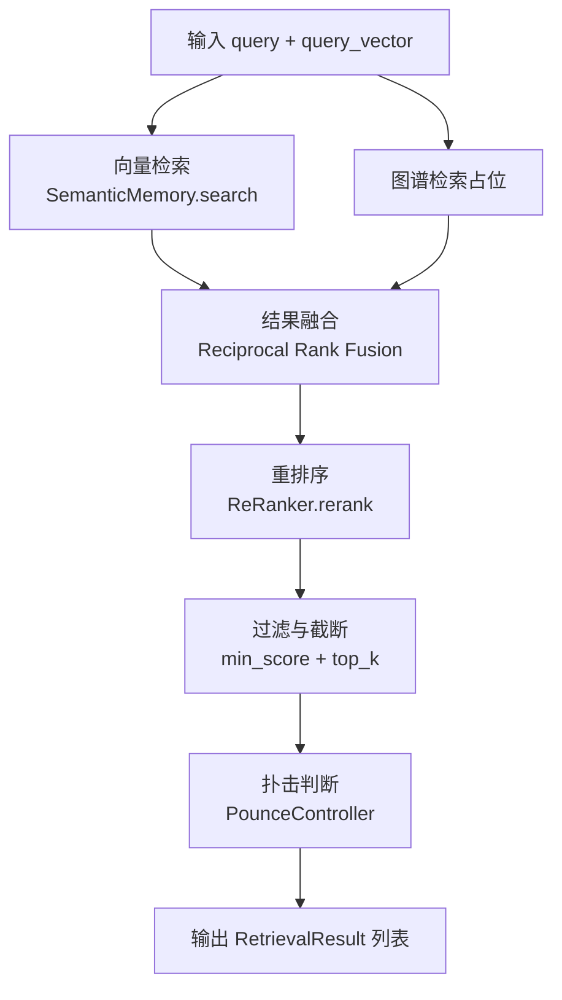
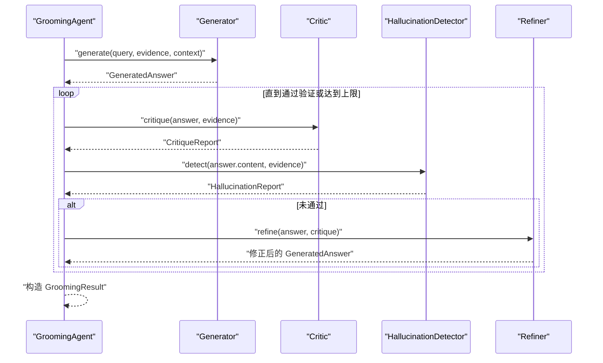
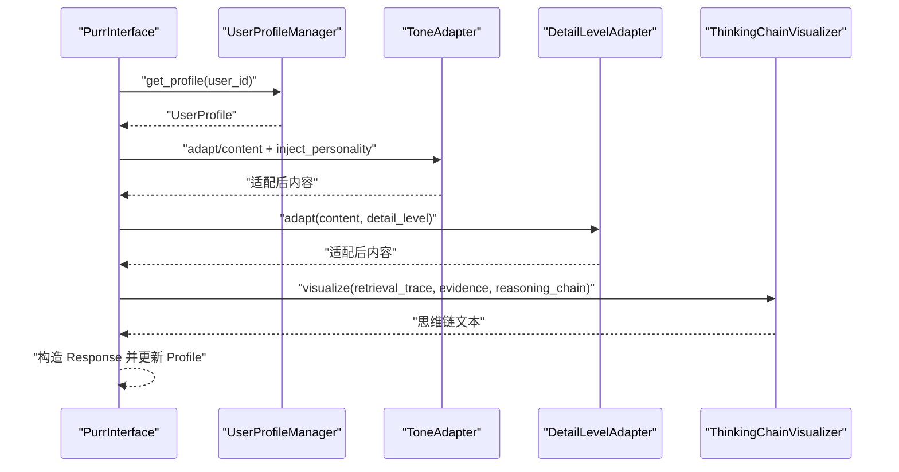
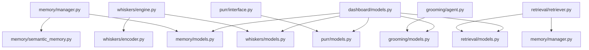

# 数据模型与接口

<cite>
**本文引用的文件**
- [src/whiskers/models.py](file://src/whiskers/models.py)
- [src/memory/models.py](file://src/memory/models.py)
- [src/retrieval/models.py](file://src/retrieval/models.py)
- [src/grooming/models.py](file://src/grooming/models.py)
- [src/purr/models.py](file://src/purr/models.py)
- [src/dashboard/models.py](file://src/dashboard/models.py)
- [src/whiskers/engine.py](file://src/whiskers/engine.py)
- [src/whiskers/encoder.py](file://src/whiskers/encoder.py)
- [src/memory/manager.py](file://src/memory/manager.py)
- [src/memory/semantic_memory.py](file://src/memory/semantic_memory.py)
- [src/retrieval/retriever.py](file://src/retrieval/retriever.py)
- [src/retrieval/reranker.py](file://src/retrieval/reranker.py)
- [src/grooming/agent.py](file://src/grooming/agent.py)
- [src/grooming/generator.py](file://src/grooming/generator.py)
- [src/purr/interface.py](file://src/purr/interface.py)
</cite>

## 目录
1. [简介](#简介)
2. [项目结构](#项目结构)
3. [核心组件](#核心组件)
4. [架构总览](#架构总览)
5. [详细组件分析](#详细组件分析)
6. [依赖分析](#依赖分析)
7. [性能考虑](#性能考虑)
8. [故障排查指南](#故障排查指南)
9. [结论](#结论)
10. [附录](#附录)

## 简介
本文件聚焦 NecoRAG 的数据模型与接口设计，系统性阐述以下关键数据结构的定义、字段含义、关系映射与序列化机制，并给出端到端的数据流转示例与使用模式，帮助开发者正确理解与使用这些模型。

- 编码后的文本块（EncodedChunk）
- 记忆项（MemoryItem）
- 检索结果（RetrievalResult）
- 梳理结果（GroomingResult）
- 用户画像（UserProfile）

同时，文档还覆盖模块配置（如 RAGProfile、各模块 Config）的序列化与反序列化流程，以及各组件之间的接口契约与调用关系。

## 项目结构
围绕数据模型与接口，本项目采用按功能域划分的模块化组织方式，核心数据模型集中在 whiskers、memory、retrieval、grooming、purr 五个子包中；dashboard 提供配置与统计模型；各子包内部以 models.py 定义数据模型，其余文件实现具体处理逻辑。

图表来源
- [src/whiskers/engine.py:14-130](file://src/whiskers/engine.py#L14-L130)
- [src/whiskers/encoder.py:11-98](file://src/whiskers/encoder.py#L11-L98)
- [src/memory/manager.py:16-186](file://src/memory/manager.py#L16-L186)
- [src/memory/semantic_memory.py:21-179](file://src/memory/semantic_memory.py#L21-L179)
- [src/retrieval/retriever.py:108-336](file://src/retrieval/retriever.py#L108-L336)
- [src/retrieval/reranker.py:10-179](file://src/retrieval/reranker.py#L10-L179)
- [src/grooming/agent.py:16-151](file://src/grooming/agent.py#L16-L151)
- [src/grooming/generator.py:9-64](file://src/grooming/generator.py#L9-L64)
- [src/purr/interface.py:16-224](file://src/purr/interface.py#L16-L224)
- [src/dashboard/models.py:12-231](file://src/dashboard/models.py#L12-L231)

章节来源
- [src/whiskers/models.py:11-69](file://src/whiskers/models.py#L11-L69)
- [src/memory/models.py:12-67](file://src/memory/models.py#L12-L67)
- [src/retrieval/models.py:9-29](file://src/retrieval/models.py#L9-L29)
- [src/grooming/models.py:9-66](file://src/grooming/models.py#L9-L66)
- [src/purr/models.py:10-53](file://src/purr/models.py#L10-L53)
- [src/dashboard/models.py:12-231](file://src/dashboard/models.py#L12-L231)

## 核心组件
本节对关键数据模型进行逐项说明，包括字段含义、取值范围、默认值、可空性与典型用途。

- EncodedChunk（编码后的文本块）
  - 字段要点：content、chunk_id、dense_vector、sparse_vector、entities、context_tags、metadata、created_at
  - 类型与约束：dense_vector 为数组；sparse_vector 为键值映射；entities 为三元组列表；context_tags 为上下文标签对象；metadata 为通用扩展字段
  - 用途：作为 Whiskers 编码阶段的产物，承载多模态向量与情境标签，供后续检索与记忆持久化使用

- MemoryItem（记忆项）
  - 字段要点：memory_id、content、layer、vector、metadata、weight、access_count、created_at、last_accessed
  - 类型与约束：layer 为枚举（L1/L2/L3）；vector 可为空（待编码后填充）
  - 用途：统一表示三层记忆中的条目，支持权重衰减与访问统计

- RetrievalResult（检索结果）
  - 字段要点：memory_id、content、score、source、metadata、retrieval_path
  - 类型与约束：score 为相似度或相关性分数；source 标识检索来源（向量/图谱/HyDE）
  - 用途：检索阶段的标准输出，便于后续重排序与融合

- GroomingResult（梳理结果）
  - 字段要点：query、answer、confidence、citations、hallucination_report、iterations、metadata
  - 类型与约束：confidence 为置信度；iterations 为迭代次数；hallucination_report 可空
  - 用途：生成与验证阶段的最终产物，携带证据引用与质量评估

- UserProfile（用户画像）
  - 字段要点：user_id、professional_level、interaction_style、preferred_domains、query_history、metadata、created_at、updated_at
  - 类型与约束：professional_level 与 interaction_style 为预设枚举值；其余为扩展字段
  - 用途：驱动交互式生成的个性化适配（语气、详细程度等）

- 模块配置与配置档案（ModuleConfig/RAGProfile）
  - 字段要点：ModuleConfig 包含 module_type、module_name、description、parameters、enabled、last_updated；RAGProfile 包含 profile_id、profile_name、description、is_active、各模块配置对象及时间戳
  - 序列化：提供 to_dict/from_dict、to_json/from_json 方法，支持 JSON 存储与传输

章节来源
- [src/whiskers/models.py:31-41](file://src/whiskers/models.py#L31-L41)
- [src/memory/models.py:19-31](file://src/memory/models.py#L19-L31)
- [src/retrieval/models.py:10-18](file://src/retrieval/models.py#L10-L18)
- [src/grooming/models.py:38-47](file://src/grooming/models.py#L38-L47)
- [src/purr/models.py:11-21](file://src/purr/models.py#L11-L21)
- [src/dashboard/models.py:22-44](file://src/dashboard/models.py#L22-L44)
- [src/dashboard/models.py:164-219](file://src/dashboard/models.py#L164-L219)

## 架构总览
下图展示从输入到输出的关键数据流：文档经 Whiskers 编码为 EncodedChunk，写入 Memory（L2 语义），检索器从 Memory 检索得到 RetrievalResult，经过重排序与融合，交由 GroomingAgent 生成 GroomingResult，最后由 PurrInterface 基于 UserProfile 生成 Response。

图表来源
- [src/whiskers/engine.py:54-130](file://src/whiskers/engine.py#L54-L130)
- [src/whiskers/encoder.py:28-42](file://src/whiskers/encoder.py#L28-L42)
- [src/memory/manager.py:48-112](file://src/memory/manager.py#L48-L112)
- [src/memory/semantic_memory.py:50-78](file://src/memory/semantic_memory.py#L50-L78)
- [src/retrieval/retriever.py:140-202](file://src/retrieval/retriever.py#L140-L202)
- [src/retrieval/reranker.py:41-70](file://src/retrieval/reranker.py#L41-L70)
- [src/grooming/agent.py:61-129](file://src/grooming/agent.py#L61-L129)
- [src/purr/interface.py:55-132](file://src/purr/interface.py#L55-L132)

## 详细组件分析

### 数据模型类图
该图为实际源码中的数据类及其属性概览，体现字段类型与默认值设置。

图表来源
- [src/whiskers/models.py:31-41](file://src/whiskers/models.py#L31-L41)
- [src/memory/models.py:19-31](file://src/memory/models.py#L19-L31)
- [src/retrieval/models.py:10-18](file://src/retrieval/models.py#L10-L18)
- [src/grooming/models.py:38-47](file://src/grooming/models.py#L38-L47)
- [src/purr/models.py:11-21](file://src/purr/models.py#L11-L21)
- [src/dashboard/models.py:22-44](file://src/dashboard/models.py#L22-L44)
- [src/dashboard/models.py:164-219](file://src/dashboard/models.py#L164-L219)

章节来源
- [src/whiskers/models.py:31-41](file://src/whiskers/models.py#L31-L41)
- [src/memory/models.py:19-31](file://src/memory/models.py#L19-L31)
- [src/retrieval/models.py:10-18](file://src/retrieval/models.py#L10-L18)
- [src/grooming/models.py:38-47](file://src/grooming/models.py#L38-L47)
- [src/purr/models.py:11-21](file://src/purr/models.py#L11-L21)
- [src/dashboard/models.py:22-44](file://src/dashboard/models.py#L22-L44)
- [src/dashboard/models.py:164-219](file://src/dashboard/models.py#L164-L219)

### 编码与存储流程（Whiskers → Memory）
- 输入：ParsedDocument（包含 Chunk 列表）
- 处理：WhiskersEngine 对每个 Chunk 调用 VectorEncoder 生成稠密/稀疏向量与实体三元组，并结合 ContextualTagger 生成 ContextTags
- 输出：EncodedChunk 列表
- 存储：MemoryManager 将 EncodedChunk 转换为 MemoryItem，写入 SemanticMemory（L2），并同步构建 EpisodicGraph（L3）中的实体与关系

图表来源
- [src/whiskers/engine.py:42-130](file://src/whiskers/engine.py#L42-L130)
- [src/whiskers/encoder.py:28-42](file://src/whiskers/encoder.py#L28-L42)
- [src/memory/manager.py:48-112](file://src/memory/manager.py#L48-L112)
- [src/memory/semantic_memory.py:50-78](file://src/memory/semantic_memory.py#L50-L78)

章节来源
- [src/whiskers/engine.py:42-130](file://src/whiskers/engine.py#L42-L130)
- [src/whiskers/encoder.py:28-42](file://src/whiskers/encoder.py#L28-L42)
- [src/memory/manager.py:48-112](file://src/memory/manager.py#L48-L112)
- [src/memory/semantic_memory.py:50-78](file://src/memory/semantic_memory.py#L50-L78)

### 检索与重排序流程（Memory → RetrievalResult → Rerank → Fusion）
- 输入：query 与 query_vector
- 处理：PounceRetriever 先执行向量检索（SemanticMemory.search），再进行 HyDE 增强与图谱检索（占位），随后 Reciprocal Rank Fusion 融合多路结果，ReRanker 应用新颖性惩罚与多样性策略，最后按分数过滤与截断
- 输出：RetrievalResult 列表，包含检索路径 trace

图表来源
- [src/retrieval/retriever.py:140-202](file://src/retrieval/retriever.py#L140-L202)
- [src/retrieval/reranker.py:41-70](file://src/retrieval/reranker.py#L41-L70)

章节来源
- [src/retrieval/retriever.py:140-202](file://src/retrieval/retriever.py#L140-L202)
- [src/retrieval/reranker.py:41-70](file://src/retrieval/reranker.py#L41-L70)

### 梳理与校正流程（Evidence → GroomingResult）
- 输入：query、evidence（检索到的相关内容）、可选 context
- 处理：Generator 基于证据生成初始答案；Critic 进行有效性评估；HallucinationDetector 检测幻觉；Refiner 在必要时修正答案；循环直至通过验证或达到最大迭代次数
- 输出：GroomingResult，包含置信度、证据引用、迭代次数与可选幻觉报告

图表来源
- [src/grooming/agent.py:61-129](file://src/grooming/agent.py#L61-L129)
- [src/grooming/generator.py:25-63](file://src/grooming/generator.py#L25-L63)

章节来源
- [src/grooming/agent.py:61-129](file://src/grooming/agent.py#L61-L129)
- [src/grooming/generator.py:25-63](file://src/grooming/generator.py#L25-L63)

### 交互与个性化（GroomingResult → Response）
- 输入：query、GroomingResult、session_id/tone/detail_level
- 处理：PurrInterface 获取 UserProfile，确定语气与详细程度，进行语气与细节适配，生成思维链可视化，更新用户画像
- 输出：Response，包含内容、思维链、语气、详细程度、证据引用与元数据

图表来源
- [src/purr/interface.py:55-132](file://src/purr/interface.py#L55-L132)

章节来源
- [src/purr/interface.py:55-132](file://src/purr/interface.py#L55-L132)

## 依赖分析
- 模块内依赖
  - whiskers.engine 依赖 whiskers.models、whiskers.encoder、whiskers.parser、whiskers.chunker、whiskers.tagger
  - memory.manager 依赖 memory.models、memory.working_memory、memory.semantic_memory、memory.episodic_graph、memory.decay
  - retrieval.retriever 依赖 retrieval.models、memory.manager、retrieval.hyde、retrieval.reranker、retrieval.fusion
  - grooming.agent 依赖 grooming.models、memory.manager、grooming.generator、grooming.critic、grooming.refiner、grooming.hallucination、grooming.consolidator、grooming.pruner
  - purr.interface 依赖 purr.models、memory.manager、purr.profile_manager、purr.tone_adapter、purr.detail_adapter、purr.visualizer
  - dashboard.models 定义配置与统计模型，提供序列化/反序列化工具

- 跨模块耦合
  - Whiskers 编码产物 EncodedChunk 与 MemoryItem 的 metadata 字段承载上下文标签与稀疏向量，形成检索与记忆的桥接
  - RetrievalResult 与 MemoryItem 的 memory_id 建立检索结果与记忆条目的关联
  - GroomingResult.citations 与 RetrievalResult.memory_id/RetrievalResult.source 构成证据溯源链
  - PurrInterface 读取 UserProfile 与 GroomingResult，形成个性化输出

图表来源
- [src/memory/manager.py:16-186](file://src/memory/manager.py#L16-L186)
- [src/memory/semantic_memory.py:21-179](file://src/memory/semantic_memory.py#L21-L179)
- [src/whiskers/engine.py:14-130](file://src/whiskers/engine.py#L14-L130)
- [src/whiskers/encoder.py:11-98](file://src/whiskers/encoder.py#L11-L98)
- [src/retrieval/retriever.py:108-336](file://src/retrieval/retriever.py#L108-L336)
- [src/retrieval/models.py:9-29](file://src/retrieval/models.py#L9-L29)
- [src/grooming/agent.py:16-151](file://src/grooming/agent.py#L16-L151)
- [src/grooming/models.py:9-66](file://src/grooming/models.py#L9-L66)
- [src/purr/interface.py:16-224](file://src/purr/interface.py#L16-L224)
- [src/purr/models.py:10-53](file://src/purr/models.py#L10-L53)
- [src/dashboard/models.py:12-231](file://src/dashboard/models.py#L12-L231)

章节来源
- [src/memory/manager.py:16-186](file://src/memory/manager.py#L16-L186)
- [src/memory/semantic_memory.py:21-179](file://src/memory/semantic_memory.py#L21-L179)
- [src/whiskers/engine.py:14-130](file://src/whiskers/engine.py#L14-L130)
- [src/whiskers/encoder.py:11-98](file://src/whiskers/encoder.py#L11-L98)
- [src/retrieval/retriever.py:108-336](file://src/retrieval/retriever.py#L108-L336)
- [src/retrieval/models.py:9-29](file://src/retrieval/models.py#L9-L29)
- [src/grooming/agent.py:16-151](file://src/grooming/agent.py#L16-L151)
- [src/grooming/models.py:9-66](file://src/grooming/models.py#L9-L66)
- [src/purr/interface.py:16-224](file://src/purr/interface.py#L16-L224)
- [src/purr/models.py:10-53](file://src/purr/models.py#L10-L53)
- [src/dashboard/models.py:12-231](file://src/dashboard/models.py#L12-L231)

## 性能考虑
- 向量检索与索引
  - SemanticMemory.search 当前为内存模拟，建议在生产环境集成 HNSW 等高效索引与向量数据库（如 Qdrant/Milvus），以降低 O(N) 相似度计算开销
- 重排序与多样性
  - ReRanker 的新颖性惩罚与多样性策略涉及两两相似度计算，复杂度较高；可考虑缓存候选集相似度矩阵或采用近似最近邻方法
- 检索融合与扑击控制
  - PounceRetriever 的融合与扑击阈值可根据查询复杂度动态调整，避免过早终止导致召回不足
- 编码与实体抽取
  - VectorEncoder 的稠密/稀疏向量与实体抽取目前为最小实现，建议接入成熟模型（如 BGE-M3、命名实体识别模型）以提升检索与图谱质量

## 故障排查指南
- 编码阶段
  - 若 EncodedChunk.density_vector 为空或异常，检查 VectorEncoder 的 encode_dense 实现与输入文本
  - 若 entities 为空，确认实体抽取模块是否启用与可用
- 存储阶段
  - MemoryManager.store 返回 memory_id 后，若检索不到对应内容，检查 metadata 中是否正确传递了 context_tags 与 sparse_vector
- 检索阶段
  - 若检索结果为空或分数过低，检查 query_vector 是否正确生成，或尝试增大 top_k 与 min_score
  - 若扑击提前终止，适当降低 pounce_threshold 或 min_gain
- 梳理阶段
  - 若 GroomingResult.confidence 过低，检查 Generator 的证据选择策略与 Refiner 的修正效果
  - 若出现幻觉，关注 HallucinationReport 的指标变化，必要时减少迭代次数或增强证据质量
- 交互阶段
  - 若 Response 的语气或详细程度不符合预期，检查 UserProfile 的 professional_level 与 interaction_style，以及 PurrInterface 的适配逻辑

章节来源
- [src/whiskers/encoder.py:44-98](file://src/whiskers/encoder.py#L44-L98)
- [src/memory/manager.py:48-112](file://src/memory/manager.py#L48-L112)
- [src/retrieval/retriever.py:140-202](file://src/retrieval/retriever.py#L140-L202)
- [src/grooming/agent.py:61-129](file://src/grooming/agent.py#L61-L129)
- [src/purr/interface.py:55-132](file://src/purr/interface.py#L55-L132)

## 结论
本文件系统梳理了 NecoRAG 的核心数据模型与接口，明确了 EncodedChunk、MemoryItem、RetrievalResult、GroomingResult、UserProfile 等关键结构的字段与用途，并通过序列图与流程图展示了从感知编码、记忆存储、检索重排序到梳理校正与交互可视化的完整数据流。模块配置（RAGProfile/ModuleConfig）提供了可序列化的配置管理能力。建议在生产环境中逐步替换最小实现为成熟的模型与索引方案，以获得更好的检索质量与运行效率。

## 附录
- 序列化与反序列化
  - ModuleConfig：to_dict/from_dict
  - RAGProfile：to_dict/from_dict、to_json/from_json
  - 适用场景：配置持久化、跨进程传输、仪表盘展示与编辑

章节来源
- [src/dashboard/models.py:31-44](file://src/dashboard/models.py#L31-L44)
- [src/dashboard/models.py:178-219](file://src/dashboard/models.py#L178-L219)