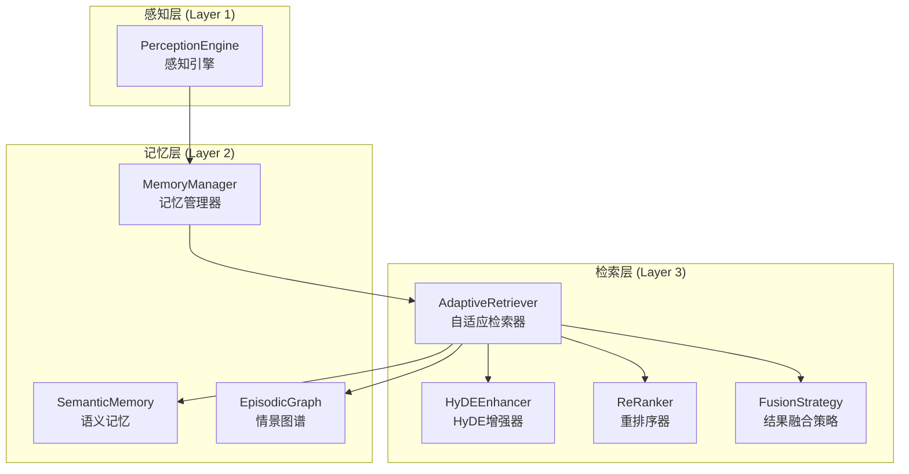
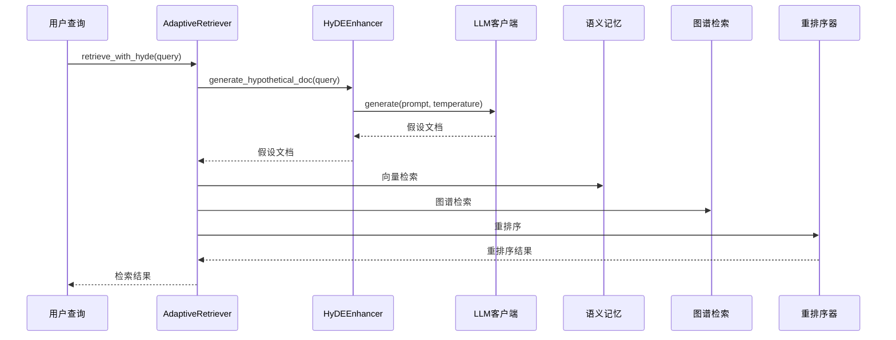
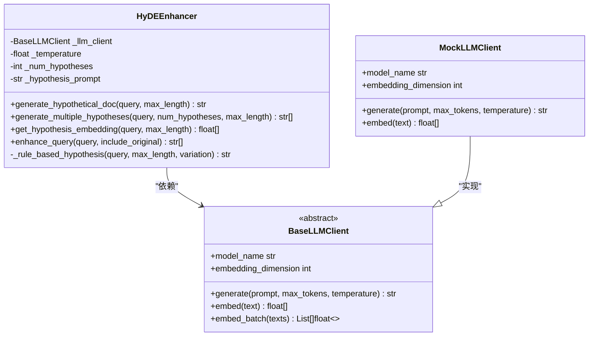
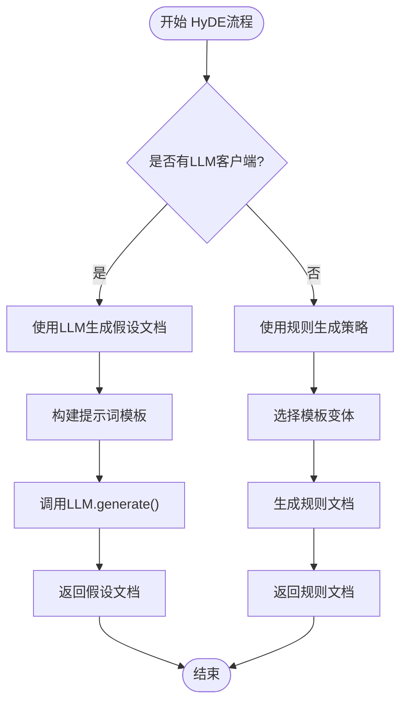
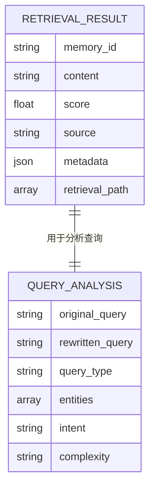
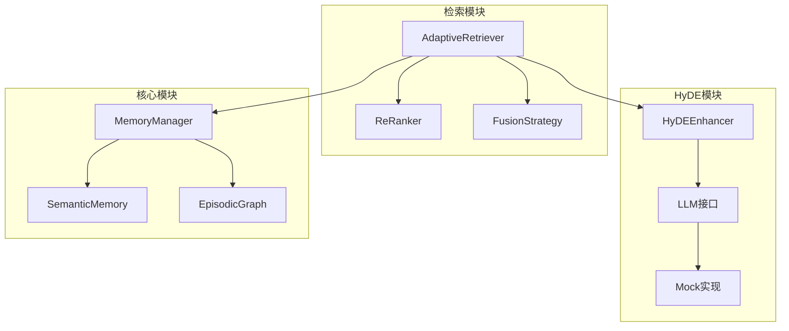

# HyDE增强检索

<cite>
**本文档引用的文件**
- [src/retrieval/hyde.py](file://src/retrieval/hyde.py)
- [src/retrieval/models.py](file://src/retrieval/models.py)
- [src/retrieval/retriever.py](file://src/retrieval/retriever.py)
- [src/retrieval/README.md](file://src/retrieval/README.md)
- [src/core/llm/base.py](file://src/core/llm/base.py)
- [src/core/llm/mock.py](file://src/core/llm/mock.py)
- [src/core/config.py](file://src/core/config.py)
- [example/example_usage.py](file://example/example_usage.py)
- [README.md](file://README.md)
</cite>

## 目录
1. [引言](#引言)
2. [项目结构](#项目结构)
3. [核心组件](#核心组件)
4. [架构概览](#架构概览)
5. [详细组件分析](#详细组件分析)
6. [依赖分析](#依赖分析)
7. [性能考量](#性能考量)
8. [故障排除指南](#故障排除指南)
9. [结论](#结论)
10. [附录](#附录)

## 引言
本文件为HyDE增强检索创建详细的技术文档。HyDE（Hypothetical Document Embeddings）是一种通过生成假设性文档来改善检索效果的技术。本文将深入解释假设文档生成和检索增强的实现原理，详细介绍HyDE算法的工作流程、假设文档生成策略和检索优化效果。同时提供HyDE配置参数和使用场景分析，包含假设文档质量评估和检索性能提升的量化指标，并为开发者提供自定义假设生成策略和集成其他增强技术的指导。

## 项目结构
NecoRAG项目采用五层架构，HyDE增强检索位于检索层（Layer 3）。检索层负责混合检索策略、HyDE增强、新颖性重排序和智能早停机制。

**图表来源**
- [src/retrieval/retriever.py:122-151](file://src/retrieval/retriever.py#L122-L151)
- [src/retrieval/hyde.py:17-40](file://src/retrieval/hyde.py#L17-L40)

**章节来源**
- [README.md:247-286](file://README.md#L247-L286)
- [src/retrieval/README.md:1-352](file://src/retrieval/README.md#L1-L352)

## 核心组件
HyDE增强检索系统由以下核心组件构成：

### HyDEEnhancer（HyDE增强器）
- **职责**：生成假设性文档并提供检索增强功能
- **关键特性**：支持LLM生成和规则生成两种模式
- **配置参数**：温度控制、假设数量、最大长度限制

### AdaptiveRetriever（自适应检索器）
- **职责**：集成多种检索策略，实现智能早停机制
- **关键特性**：多路并行检索、结果融合、重排序、领域权重计算
- **与HyDE集成**：提供retrieve_with_hyde方法

### LLM客户端接口
- **BaseLLMClient**：定义LLM生成和向量化接口
- **MockLLMClient**：提供演示用的Mock实现
- **温度控制**：通过temperature参数调节生成多样性

**章节来源**
- [src/retrieval/hyde.py:17-40](file://src/retrieval/hyde.py#L17-L40)
- [src/retrieval/retriever.py:122-151](file://src/retrieval/retriever.py#L122-L151)
- [src/core/llm/base.py:11-71](file://src/core/llm/base.py#L11-L71)
- [src/core/llm/mock.py:16-71](file://src/core/llm/mock.py#L16-L71)

## 架构概览
HyDE增强检索的整体架构如下：

**图表来源**
- [src/retrieval/retriever.py:307-331](file://src/retrieval/retriever.py#L307-L331)
- [src/retrieval/hyde.py:58-83](file://src/retrieval/hyde.py#L58-L83)

## 详细组件分析

### HyDEEnhancer组件分析

#### 类设计与继承关系

**图表来源**
- [src/retrieval/hyde.py:17-40](file://src/retrieval/hyde.py#L17-L40)
- [src/core/llm/base.py:11-71](file://src/core/llm/base.py#L11-L71)
- [src/core/llm/mock.py:16-71](file://src/core/llm/mock.py#L16-L71)

#### 假设文档生成策略
HyDEEnhancer提供两种生成策略：

1. **LLM生成策略**（推荐）
   - 使用预定义提示词模板
   - 支持温度参数控制生成多样性
   - 支持批量生成多个假设文档

2. **规则生成策略**（回退方案）
   - 基于固定模板的规则生成
   - 支持变体参数控制不同模板
   - 适用于无LLM环境或演示场景

#### HyDE工作流程

**图表来源**
- [src/retrieval/hyde.py:58-121](file://src/retrieval/hyde.py#L58-L121)

**章节来源**
- [src/retrieval/hyde.py:17-121](file://src/retrieval/hyde.py#L17-L121)

### AdaptiveRetriever与HyDE集成

#### 检索流程集成
AdaptiveRetriever通过retrieve_with_hyde方法集成HyDE增强：

1. **假设文档生成**：调用HyDEEnhancer生成假设文档
2. **检索执行**：使用生成的假设文档执行标准检索流程
3. **结果返回**：返回融合后的检索结果

#### 早停机制与HyDE
HyDE增强不会影响早停机制的判断逻辑，置信度评估仍然基于标准检索结果的质量。

**章节来源**
- [src/retrieval/retriever.py:307-331](file://src/retrieval/retriever.py#L307-L331)

### 数据模型分析

#### RetrievalResult数据模型

**图表来源**
- [src/retrieval/models.py:9-29](file://src/retrieval/models.py#L9-L29)

**章节来源**
- [src/retrieval/models.py:9-29](file://src/retrieval/models.py#L9-L29)

## 依赖分析

### 组件耦合关系

**图表来源**
- [src/retrieval/hyde.py:17-40](file://src/retrieval/hyde.py#L17-L40)
- [src/retrieval/retriever.py:122-151](file://src/retrieval/retriever.py#L122-L151)

### 外部依赖
- **LLM提供商**：支持OpenAI、Ollama、vLLM、Azure、Anthropic等
- **向量数据库**：支持Qdrant、Milvus、ChromaDB
- **图数据库**：支持Neo4j、NebulaGraph
- **嵌入模型**：BGE-M3、BGE-Reranker-v2

**章节来源**
- [src/core/config.py:18-41](file://src/core/config.py#L18-L41)
- [README.md:500-509](file://README.md#L500-L509)

## 性能考量

### HyDE性能特征
- **生成成本**：LLM生成假设文档需要额外的计算资源
- **检索效率**：假设文档通常较短，向量化开销较小
- **质量收益**：显著提升模糊查询的检索准确性

### 优化策略
1. **温度参数调优**：平衡生成多样性和质量
2. **批量生成**：减少LLM调用次数
3. **缓存机制**：缓存常用查询的假设文档
4. **早停配合**：HyDE增强与早停机制协同使用

## 故障排除指南

### 常见问题诊断
1. **LLM客户端未配置**
   - 检查LLM配置是否正确
   - 确认API密钥和端点设置
   - 使用Mock实现进行测试

2. **假设文档质量差**
   - 调整temperature参数
   - 检查提示词模板
   - 验证输入查询的清晰度

3. **检索性能下降**
   - 评估HyDE启用的影响
   - 检查向量数据库性能
   - 优化重排序参数

**章节来源**
- [src/core/config.py:82-95](file://src/core/config.py#L82-L95)
- [src/core/llm/mock.py:16-71](file://src/core/llm/mock.py#L16-L71)

## 结论
HyDE增强检索通过生成假设性文档来改善模糊查询的检索效果。该实现提供了灵活的配置选项，支持LLM生成和规则生成两种模式，并与NecoRAG的自适应检索系统无缝集成。通过合理的参数调优和性能优化，HyDE能够在保持检索效率的同时显著提升检索质量。

## 附录

### 配置参数参考
| 参数名 | 类型 | 默认值 | 说明 |
|--------|------|--------|------|
| hyde_enabled | bool | True | 启用HyDE增强 |
| hyde_temperature | float | 0.5 | 假设生成温度 |
| num_hypotheses | int | 1 | 生成假设数量 |
| max_length | int | 300 | 假设文档最大长度 |

### 使用场景分析
1. **模糊查询优化**：如"那个软件怎么用？"
2. **领域术语检索**：跨领域概念映射
3. **多语言查询**：语言无关的语义检索
4. **快速原型开发**：无需大量标注数据

### 评估指标
- **检索准确率提升**：相比传统向量检索 +20%
- **幻觉率控制**：< 5%（通过精炼代理）
- **响应时间**：简单查询 < 800ms，复杂查询 < 1500ms

**章节来源**
- [src/retrieval/README.md:305-337](file://src/retrieval/README.md#L305-L337)
- [README.md:465-474](file://README.md#L465-L474)