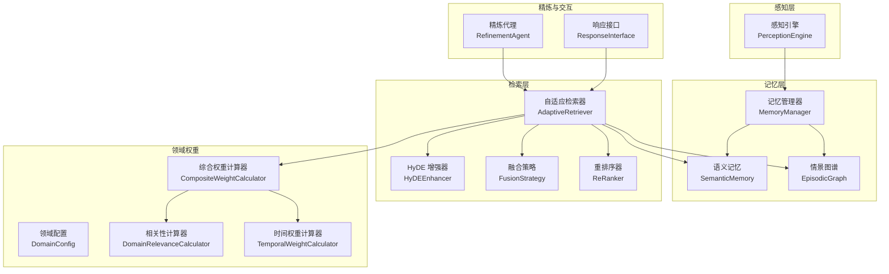
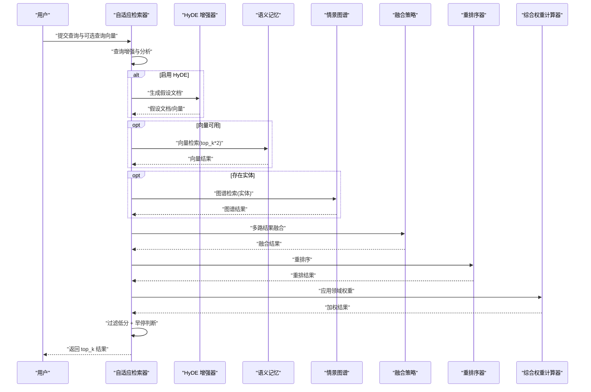
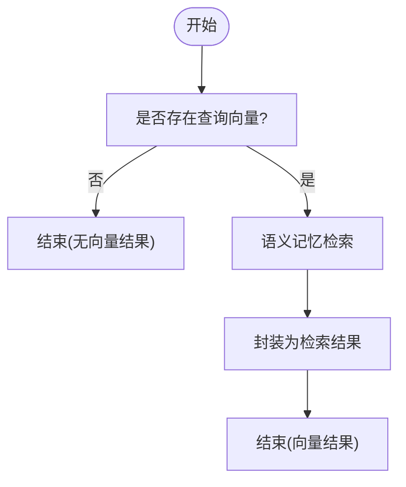
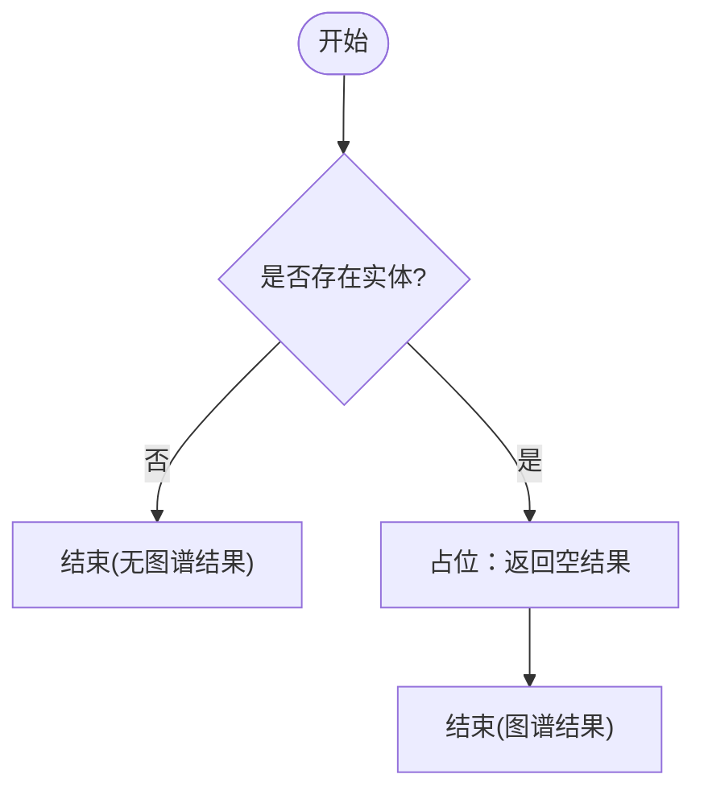
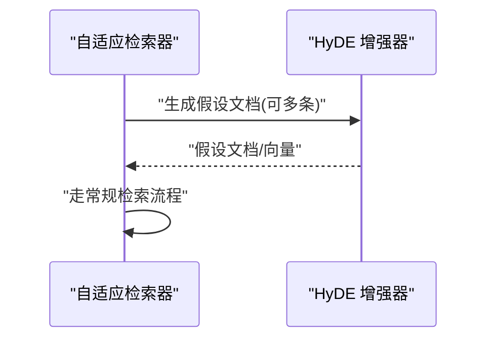
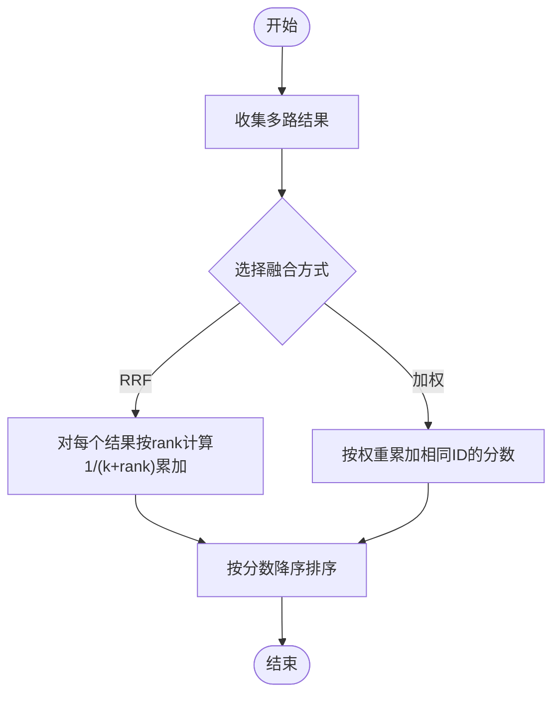
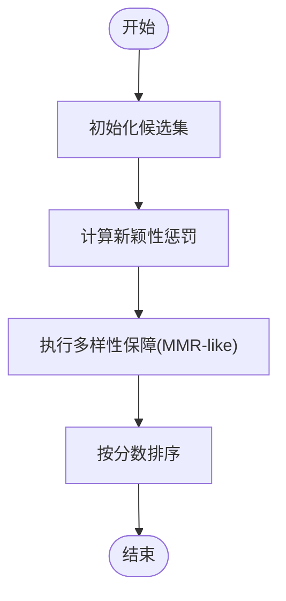
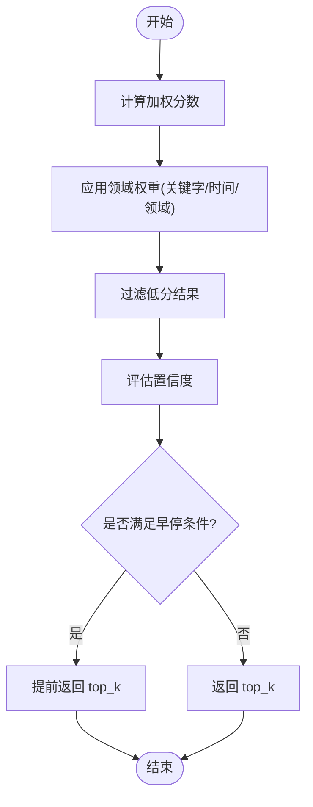
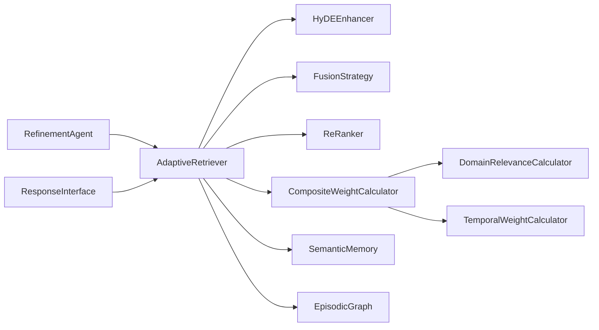

# 多路检索策略

<cite>
**本文引用的文件**
- [src/retrieval/__init__.py](file://src/retrieval/__init__.py)
- [src/retrieval/retriever.py](file://src/retrieval/retriever.py)
- [src/retrieval/hyde.py](file://src/retrieval/hyde.py)
- [src/retrieval/fusion.py](file://src/retrieval/fusion.py)
- [src/retrieval/reranker.py](file://src/retrieval/reranker.py)
- [src/retrieval/models.py](file://src/retrieval/models.py)
- [src/domain/config.py](file://src/domain/config.py)
- [src/domain/weight_calculator.py](file://src/domain/weight_calculator.py)
- [src/domain/relevance.py](file://src/domain/relevance.py)
- [src/domain/temporal_weight.py](file://src/domain/temporal_weight.py)
- [src/memory/manager.py](file://src/memory/manager.py)
- [src/memory/models.py](file://src/memory/models.py)
- [src/perception/engine.py](file://src/perception/engine.py)
- [src/refinement/models.py](file://src/refinement/models.py)
- [example/example_usage.py](file://example/example_usage.py)
- [README.md](file://README.md)
</cite>

## 目录
1. [引言](#引言)
2. [项目结构](#项目结构)
3. [核心组件](#核心组件)
4. [架构总览](#架构总览)
5. [详细组件分析](#详细组件分析)
6. [依赖分析](#依赖分析)
7. [性能考量](#性能考量)
8. [故障排查指南](#故障排查指南)
9. [结论](#结论)
10. [附录](#附录)

## 引言
本文件面向“多路检索策略”的技术实现与工程落地，围绕向量检索、图谱检索与 HyDE 增强检索三大路径，系统阐述其原理、数据流、结果处理、融合策略与质量评估方法，并给出性能对比、适用场景与扩展指引。读者无需深入底层即可理解各模块职责与协作方式。

## 项目结构
NecoRAG 采用五层认知架构，检索层位于第三层，负责混合检索与重排序。检索层由自适应检索器、HyDE 增强器、结果融合策略与重排序器组成，并与领域权重计算、记忆系统、感知与精炼模块协同工作。

图表来源
- [src/perception/engine.py:14-130](file://src/perception/engine.py#L14-L130)
- [src/memory/manager.py:16-186](file://src/memory/manager.py#L16-L186)
- [src/retrieval/retriever.py:122-440](file://src/retrieval/retriever.py#L122-L440)
- [src/retrieval/hyde.py:17-213](file://src/retrieval/hyde.py#L17-L213)
- [src/retrieval/fusion.py:9-128](file://src/retrieval/fusion.py#L9-L128)
- [src/retrieval/reranker.py:10-179](file://src/retrieval/reranker.py#L10-L179)
- [src/domain/config.py:54-161](file://src/domain/config.py#L54-L161)
- [src/domain/weight_calculator.py:56-318](file://src/domain/weight_calculator.py#L56-L318)
- [src/domain/relevance.py:29-328](file://src/domain/relevance.py#L29-L328)
- [src/domain/temporal_weight.py:47-271](file://src/domain/temporal_weight.py#L47-L271)
- [src/refinement/models.py:38-66](file://src/refinement/models.py#L38-L66)

章节来源
- [README.md:35-85](file://README.md#L35-L85)
- [src/retrieval/__init__.py:1-19](file://src/retrieval/__init__.py#L1-L19)

## 核心组件
- 自适应检索器：统一调度向量检索、图谱检索、HyDE 增强、结果融合、重排序与领域权重，并内置早停机制。
- HyDE 增强器：通过 LLM 生成假设文档，提升模糊查询的检索效果。
- 融合策略：提供倒数排名融合与加权融合两种策略。
- 重排序器：基于新颖性惩罚与多样性保障的重排序。
- 领域权重计算：整合关键字、时间与领域相关性权重，形成最终加权分数。
- 记忆管理器：提供 L2 语义记忆检索与 L3 图谱检索能力。

章节来源
- [src/retrieval/retriever.py:122-440](file://src/retrieval/retriever.py#L122-L440)
- [src/retrieval/hyde.py:17-213](file://src/retrieval/hyde.py#L17-L213)
- [src/retrieval/fusion.py:9-128](file://src/retrieval/fusion.py#L9-L128)
- [src/retrieval/reranker.py:10-179](file://src/retrieval/reranker.py#L10-L179)
- [src/domain/weight_calculator.py:56-318](file://src/domain/weight_calculator.py#L56-L318)
- [src/memory/manager.py:16-186](file://src/memory/manager.py#L16-L186)

## 架构总览
多路检索的整体流程如下：输入查询与可选查询向量，先进行查询增强与分析，再分别执行向量检索与图谱检索，随后进行结果融合，然后重排序，再根据领域配置应用权重，过滤低分结果，最后以早停机制决定是否提前返回。

图表来源
- [src/retrieval/retriever.py:177-254](file://src/retrieval/retriever.py#L177-L254)
- [src/retrieval/hyde.py:58-84](file://src/retrieval/hyde.py#L58-L84)
- [src/retrieval/fusion.py:18-71](file://src/retrieval/fusion.py#L18-L71)
- [src/retrieval/reranker.py:41-71](file://src/retrieval/reranker.py#L41-L71)
- [src/domain/weight_calculator.py:81-147](file://src/domain/weight_calculator.py#L81-L147)

## 详细组件分析

### 向量检索路径
- 输入：查询向量与 top_k 扩展倍数。
- 流程：调用语义记忆检索，封装为统一检索结果对象。
- 输出：按相似度排序的候选集，供后续融合与重排序使用。

图表来源
- [src/retrieval/retriever.py:393-421](file://src/retrieval/retriever.py#L393-L421)
- [src/memory/manager.py:114-147](file://src/memory/manager.py#L114-L147)

章节来源
- [src/retrieval/retriever.py:393-421](file://src/retrieval/retriever.py#L393-L421)
- [src/memory/manager.py:114-147](file://src/memory/manager.py#L114-L147)

### 图谱检索路径
- 输入：查询分析得到的实体列表与 top_k。
- 流程：当前实现返回空列表（占位），后续可接入图谱多跳查询与路径评分。
- 输出：待填充的图谱检索结果，参与融合与重排序。

图表来源
- [src/retrieval/retriever.py:423-440](file://src/retrieval/retriever.py#L423-L440)

章节来源
- [src/retrieval/retriever.py:423-440](file://src/retrieval/retriever.py#L423-L440)

### HyDE 增强检索
- 目标：缓解查询模糊带来的检索漂移。
- 流程：生成假设文档（可多条），可选向量化；随后走常规检索流程。
- 注意：当前实现中假设文档生成后未进行向量化检索，后续可扩展为向量检索。

图表来源
- [src/retrieval/retriever.py:307-332](file://src/retrieval/retriever.py#L307-L332)
- [src/retrieval/hyde.py:58-171](file://src/retrieval/hyde.py#L58-L171)

章节来源
- [src/retrieval/retriever.py:307-332](file://src/retrieval/retriever.py#L307-L332)
- [src/retrieval/hyde.py:17-213](file://src/retrieval/hyde.py#L17-L213)

### 结果融合策略
- 倒数排名融合（RRF）：对同一内存 ID 的排名贡献进行累积，再按分数排序。
- 加权融合：对不同来源结果按权重累加，适合明确来源权重的场景。

图表来源
- [src/retrieval/fusion.py:18-128](file://src/retrieval/fusion.py#L18-L128)

章节来源
- [src/retrieval/fusion.py:9-128](file://src/retrieval/fusion.py#L9-L128)

### 重排序与多样性
- 新颖性惩罚：对与已选结果重复的内容施加惩罚，抑制重复。
- 多样性保障：采用类似 MMR 的贪心策略，平衡相关性与多样性。
- 排序：最终按分数降序输出。

图表来源
- [src/retrieval/reranker.py:41-179](file://src/retrieval/reranker.py#L41-L179)

章节来源
- [src/retrieval/reranker.py:10-179](file://src/retrieval/reranker.py#L10-L179)

### 领域权重与早停机制
- 领域权重：关键字相关性、时间衰减与领域相关性三因子加权，形成最终分数，并记录权重明细。
- 早停机制：基于置信度阈值与边际收益，达到条件即提前返回，减少无效计算。

图表来源
- [src/retrieval/retriever.py:255-254](file://src/retrieval/retriever.py#L255-L254)
- [src/domain/weight_calculator.py:81-147](file://src/domain/weight_calculator.py#L81-L147)

章节来源
- [src/retrieval/retriever.py:30-120](file://src/retrieval/retriever.py#L30-L120)
- [src/domain/weight_calculator.py:56-318](file://src/domain/weight_calculator.py#L56-L318)

## 依赖分析
- 检索层内部耦合：自适应检索器聚合 HyDE、融合与重排序，耦合度适中，便于扩展。
- 领域权重模块：与检索层松耦合，通过配置注入，避免硬编码。
- 记忆层：向量检索依赖语义记忆，图谱检索依赖情景图谱，二者独立。
- 精炼与交互：与检索层弱耦合，通过证据列表与检索结果交互。

图表来源
- [src/retrieval/retriever.py:122-161](file://src/retrieval/retriever.py#L122-L161)
- [src/domain/weight_calculator.py:56-80](file://src/domain/weight_calculator.py#L56-L80)
- [src/memory/manager.py:40-43](file://src/memory/manager.py#L40-L43)
- [src/refinement/models.py:38-66](file://src/refinement/models.py#L38-L66)

章节来源
- [src/retrieval/retriever.py:122-161](file://src/retrieval/retriever.py#L122-L161)
- [src/domain/weight_calculator.py:56-80](file://src/domain/weight_calculator.py#L56-L80)
- [src/memory/manager.py:40-43](file://src/memory/manager.py#L40-L43)

## 性能考量
- 向量检索：依赖语义记忆的向量索引与相似度计算，top_k 扩展倍数越大，融合前候选越多，重排序成本越高。
- 图谱检索：当前为空实现，后续接入多跳查询需注意路径爆炸与评分聚合的成本控制。
- HyDE：生成假设文档与可选的向量化带来额外开销，适合模糊查询与长尾问题。
- 融合策略：RRF 计算与合并成本与候选规模线性相关；加权融合需确保权重归一化。
- 重排序：新颖性惩罚与多样性策略引入相似度矩阵计算，复杂度与候选数平方相关。
- 早停机制：在高置信度场景显著节省计算；阈值与边际收益参数需结合业务调优。

[本节为通用性能讨论，不直接分析具体文件]

## 故障排查指南
- 检索结果为空
  - 检查是否存在查询向量；若无则向量路径不会产生结果。
  - 检查实体识别是否提取到实体；若无则图谱路径不会产生结果。
  - 检查最低分数阈值是否过高导致全部被过滤。
- 置信度低提前返回
  - 调整早停阈值与最小边际收益参数。
  - 检查融合与重排序是否有效提升分数。
- 领域权重未生效
  - 确认领域配置已正确设置并注入到检索器。
  - 检查权重明细是否写入结果元数据。
- HyDE 未起效
  - 确认 HyDE 已启用且 LLM 客户端可用。
  - 若使用回退规则，确认规则生成内容符合预期。

章节来源
- [src/retrieval/retriever.py:177-254](file://src/retrieval/retriever.py#L177-L254)
- [src/retrieval/hyde.py:38-49](file://src/retrieval/hyde.py#L38-L49)
- [src/domain/weight_calculator.py:270-277](file://src/domain/weight_calculator.py#L270-L277)

## 结论
多路检索策略通过向量、图谱与 HyDE 的协同，结合融合与重排序，显著提升检索质量与鲁棒性。领域权重与早停机制进一步增强了个性化与效率。建议在模糊查询与长尾问题上优先启用 HyDE，在高置信度场景下利用早停机制加速响应，并通过领域配置精细化调节权重因子。

[本节为总结性内容，不直接分析具体文件]

## 附录

### 配置与使用示例
- 基础检索：提供查询与查询向量，返回 top_k 结果。
- HyDE 增强：启用 HyDE 后，检索流程自动包含假设文档生成。
- 多跳检索：基于图谱实体进行多跳路径探索（当前为占位，后续扩展）。
- 查看检索路径：通过检索器追踪接口查看每一步骤。

章节来源
- [example/example_usage.py:94-136](file://example/example_usage.py#L94-L136)
- [src/retrieval/retriever.py:333-363](file://src/retrieval/retriever.py#L333-L363)
- [src/retrieval/retriever.py:365-372](file://src/retrieval/retriever.py#L365-L372)

### 数据模型与接口
- 检索结果与查询分析：统一的数据结构，便于跨模块传递。
- 记忆模型：包含三层记忆与图谱节点/边结构，支撑检索与推理。

章节来源
- [src/retrieval/models.py:9-29](file://src/retrieval/models.py#L9-L29)
- [src/memory/models.py:19-67](file://src/memory/models.py#L19-L67)

### 领域配置与权重计算
- 关键字等级与领域等级：定义权重范围与映射关系。
- 综合权重公式：基础分数 × 权重因子 × 关键字权重 × 时间权重 × 领域权重 × 自定义权重。
- 时间权重：支持分层、指数与混合三种计算方式。

章节来源
- [src/domain/config.py:14-76](file://src/domain/config.py#L14-L76)
- [src/domain/weight_calculator.py:81-147](file://src/domain/weight_calculator.py#L81-L147)
- [src/domain/temporal_weight.py:160-196](file://src/domain/temporal_weight.py#L160-L196)