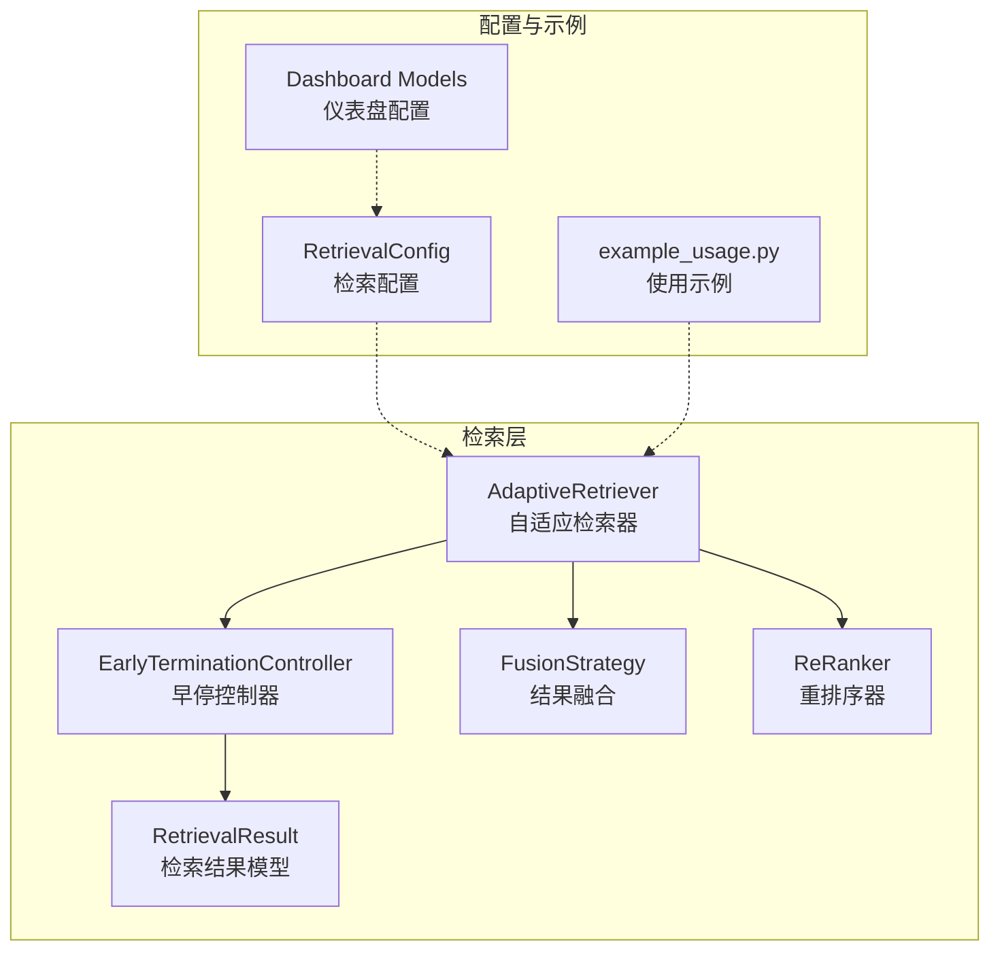
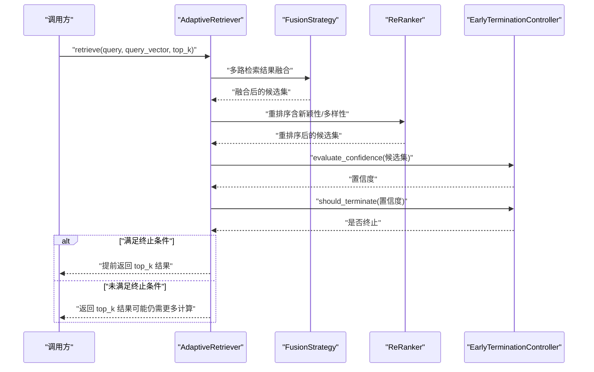
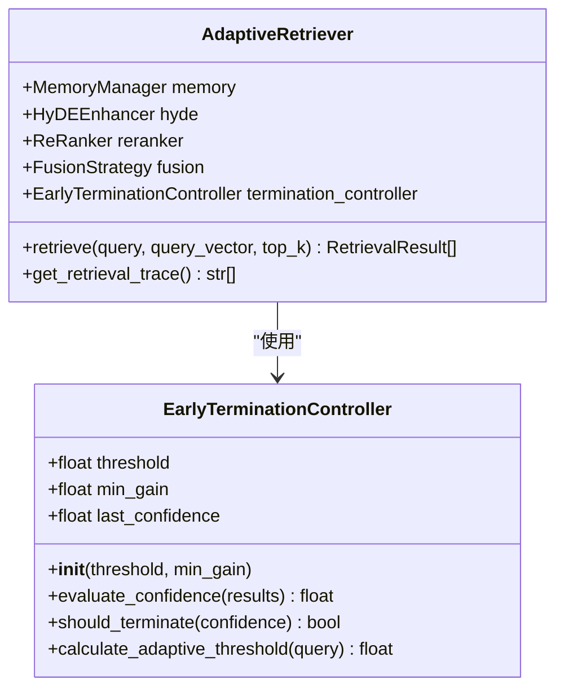
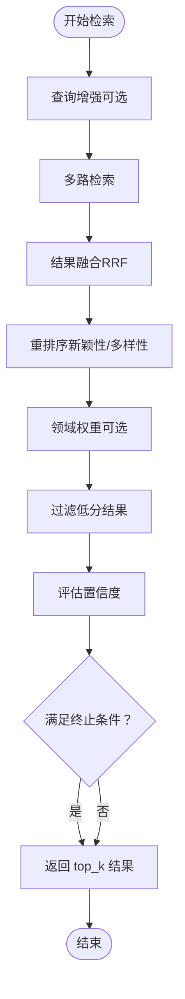
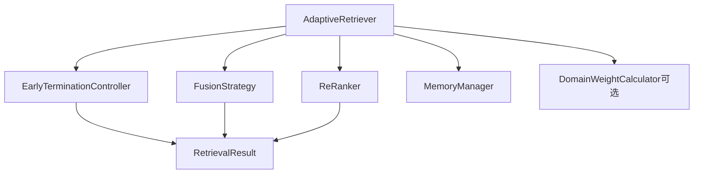

# 早停机制

<cite>
**本文引用的文件**
- [retriever.py](file://src/retrieval/retriever.py)
- [models.py](file://src/retrieval/models.py)
- [config.py](file://src/core/config.py)
- [example_usage.py](file://example/example_usage.py)
- [relevance.py](file://src/domain/relevance.py)
- [protocols.py](file://src/core/protocols.py)
- [fusion.py](file://src/retrieval/fusion.py)
- [reranker.py](file://src/retrieval/reranker.py)
- [models.py](file://src/dashboard/models.py)
</cite>

## 目录
1. [简介](#简介)
2. [项目结构](#项目结构)
3. [核心组件](#核心组件)
4. [架构总览](#架构总览)
5. [详细组件分析](#详细组件分析)
6. [依赖关系分析](#依赖关系分析)
7. [性能考量](#性能考量)
8. [故障排查指南](#故障排查指南)
9. [结论](#结论)
10. [附录](#附录)

## 简介
本技术文档围绕“基于置信度评估的智能检索终止策略”展开，系统阐述早停机制的设计目标、工作原理、阈值设置与边际收益判断逻辑，并提供配置参数、调优建议以及对检索性能与资源消耗的影响分析。同时给出开发者自定义早停策略与扩展终止条件的实践指导，帮助在不同业务场景下平衡检索质量与效率。

## 项目结构
早停机制主要位于检索层，通过“早停控制器”对检索过程中的置信度进行动态评估，在满足终止条件时提前返回结果，避免不必要的后续检索与重排序计算。

图表来源
- [retriever.py:122-254](file://src/retrieval/retriever.py#L122-L254)
- [config.py:151-172](file://src/core/config.py#L151-L172)
- [models.py:9-29](file://src/retrieval/models.py#L9-L29)
- [example_usage.py:94-136](file://example/example_usage.py#L94-L136)
- [models.py:95-115](file://src/dashboard/models.py#L95-L115)

章节来源
- [retriever.py:122-254](file://src/retrieval/retriever.py#L122-L254)
- [config.py:151-172](file://src/core/config.py#L151-L172)
- [models.py:9-29](file://src/retrieval/models.py#L9-L29)
- [example_usage.py:94-136](file://example/example_usage.py#L94-L136)
- [models.py:95-115](file://src/dashboard/models.py#L95-L115)

## 核心组件
- 早停控制器（EarlyTerminationController）
  - 负责评估当前检索阶段的置信度，并根据阈值与边际收益判断是否提前终止。
  - 提供自适应阈值计算能力，以查询复杂度为依据动态调整终止门槛。
- 自适应检索器（AdaptiveRetriever）
  - 将多路检索、结果融合、重排序与早停控制串联起来，形成完整的检索流水线。
  - 在检索完成后，对置信度进行评估并决定是否提前返回。
- 检索结果模型（RetrievalResult）
  - 统一承载检索结果的标识、内容、分数、来源与元数据，为置信度评估提供基础数据。

章节来源
- [retriever.py:30-119](file://src/retrieval/retriever.py#L30-L119)
- [retriever.py:122-254](file://src/retrieval/retriever.py#L122-L254)
- [models.py:9-29](file://src/retrieval/models.py#L9-L29)

## 架构总览
早停机制在检索流水线中的位置如下：

图表来源
- [retriever.py:177-253](file://src/retrieval/retriever.py#L177-L253)
- [fusion.py:18-70](file://src/retrieval/fusion.py#L18-L70)
- [reranker.py:41-70](file://src/retrieval/reranker.py#L41-L70)
- [retriever.py:55-101](file://src/retrieval/retriever.py#L55-L101)

## 详细组件分析

### 早停控制器（EarlyTerminationController）
- 设计目标
  - 在置信度达到较高水平或边际收益显著下降时，提前终止冗余检索，节省计算资源。
- 置信度评估策略
  - 基于 top-1 与 top-2 的分数差距，结合结果数量，综合计算置信度。
  - 当结果数量较少时，置信度会相应下调，避免过早终止。
- 终止判断逻辑
  - 固定阈值策略：当置信度超过设定阈值时立即终止。
  - 边际收益递减策略：若连续两次置信度提升幅度小于最小收益阈值，则认为边际收益不足，提前终止。
- 自适应阈值
  - 基于查询长度进行简单自适应：短查询降低阈值，长查询维持默认阈值。
  - 该实现为可扩展入口，未来可引入查询复杂度、领域难度等更精细的特征。

图表来源
- [retriever.py:30-119](file://src/retrieval/retriever.py#L30-L119)
- [retriever.py:122-176](file://src/retrieval/retriever.py#L122-L176)

章节来源
- [retriever.py:30-119](file://src/retrieval/retriever.py#L30-L119)

### 自适应检索器（AdaptiveRetriever）
- 流水线职责
  - 查询增强（可选）：识别领域关键字并提升查询权重。
  - 多路检索：向量检索与图谱检索（可选）。
  - 结果融合：采用倒数排名融合（RRF）整合多源结果。
  - 重排序：应用新颖性惩罚与多样性策略，提升结果质量。
  - 领域权重（可选）：结合领域配置对分数进行加权。
  - 过滤与早停：过滤低分结果后，评估置信度并决定是否提前终止。
- 早停触发时机
  - 在重排序与领域权重应用之后，对候选集进行置信度评估。
  - 若满足终止条件，直接返回 top_k 结果；否则继续保留更多候选以提升质量。

图表来源
- [retriever.py:177-253](file://src/retrieval/retriever.py#L177-L253)

章节来源
- [retriever.py:122-254](file://src/retrieval/retriever.py#L122-L254)

### 检索结果模型（RetrievalResult）
- 字段说明
  - memory_id：记忆条目标识
  - content：内容文本
  - score：检索分数（用于置信度评估与排序）
  - source：检索来源（向量/图/HYDE/混合）
  - metadata：附加元数据（如领域权重详情）
  - retrieval_path：检索路径（用于可视化）
- 作用
  - 作为置信度评估与早停判断的数据载体，贯穿整个检索流水线。

章节来源
- [models.py:9-29](file://src/retrieval/models.py#L9-L29)

## 依赖关系分析
- 组件耦合
  - AdaptiveRetriever 依赖 EarlyTerminationController、FusionStrategy、ReRanker 与 MemoryManager。
  - EarlyTerminationController 仅依赖检索结果模型，保持低耦合。
- 外部依赖
  - 领域权重模块（可选）：当可用时，AdaptiveRetriever 会在重排序后应用领域权重。
  - 仪表盘配置：提供检索层参数的可视化与持久化。

图表来源
- [retriever.py:122-176](file://src/retrieval/retriever.py#L122-L176)
- [fusion.py:9-70](file://src/retrieval/fusion.py#L9-L70)
- [reranker.py:10-70](file://src/retrieval/reranker.py#L10-L70)
- [models.py:9-29](file://src/retrieval/models.py#L9-L29)

章节来源
- [retriever.py:122-176](file://src/retrieval/retriever.py#L122-L176)
- [fusion.py:9-70](file://src/retrieval/fusion.py#L9-L70)
- [reranker.py:10-70](file://src/retrieval/reranker.py#L10-L70)
- [models.py:9-29](file://src/retrieval/models.py#L9-L29)

## 性能考量
- 早停带来的收益
  - 显著减少重排序与领域权重计算的开销，尤其在大规模候选集上效果明显。
  - 对于高置信度场景（如明确主题、强信号查询），可提前返回高质量结果，缩短端到端延迟。
- 可能的代价
  - 过早终止可能导致遗漏潜在相关但分数较低的证据，影响回答完整性。
  - 边际收益判断依赖历史置信度，若候选集波动较大，可能出现误判。
- 资源消耗优化
  - 通过融合与重排序的早期收敛，降低 GPU/CPU 与内存占用。
  - 适当提高置信度阈值可进一步加速，但需权衡召回质量。

[本节为通用性能讨论，无需特定文件来源]

## 故障排查指南
- 常见问题
  - 早停过于激进导致漏召回：检查置信度阈值与最小收益阈值设置，适当降低阈值或增大最小收益。
  - 早停不生效：确认候选集是否足够大，且置信度评估是否正常；检查融合与重排序是否产生足够区分度。
  - 自适应阈值不合理：短查询场景下默认阈值偏高，可考虑引入更复杂的查询复杂度特征。
- 排查步骤
  - 开启检索路径追踪，观察“Early terminated!”提示与置信度数值。
  - 对比开启/关闭早停时的检索耗时与结果质量。
  - 检查领域权重与重排序参数，确保其不会过度抑制低分但有价值的候选。

章节来源
- [retriever.py:245-253](file://src/retrieval/retriever.py#L245-L253)
- [retriever.py:365-372](file://src/retrieval/retriever.py#L365-L372)

## 结论
早停机制通过“置信度评估 + 阈值 + 边际收益”的三重约束，在保证检索质量的前提下有效降低计算成本。其设计兼顾了确定性（固定阈值）与稳健性（边际收益递减）。建议在生产环境中结合业务场景与数据分布，对阈值与最小收益进行实证调优，并持续监控检索路径与置信度分布，以获得最佳的性能与质量平衡。

[本节为总结性内容，无需特定文件来源]

## 附录

### 配置参数与调优建议
- 检索层配置（RetrievalConfig）
  - enable_early_termination：是否启用早停
  - confidence_threshold：置信度阈值（默认值见示例与仪表盘）
  - min_results：最小返回数量（与早停配合使用）
  - enable_hyde：是否启用 HyDE 增强
  - enable_rerank：是否启用重排序
  - rerank_top_k：重排序候选规模
  - novelty_penalty、diversity_weight、redundancy_penalty：重排序相关参数
- 仪表盘参数
  - retrieval-confidence_threshold：置信度阈值
  - min_gain：最小边际收益
- 示例与默认值
  - 示例脚本中默认置信度阈值为 0.85，可在初始化时传参覆盖。
  - 仪表盘提供参数可视化与持久化，便于运维与调优。

章节来源
- [config.py:151-172](file://src/core/config.py#L151-L172)
- [example_usage.py:102-108](file://example/example_usage.py#L102-L108)
- [models.py:95-115](file://src/dashboard/models.py#L95-L115)

### 自定义早停策略与扩展终止条件
- 策略扩展方向
  - 引入查询复杂度特征（如实体数量、关键词密度、句法复杂度）作为自适应阈值输入。
  - 基于领域难度与历史置信度分布，动态调整阈值与最小收益。
  - 增加“稳定性窗口”：连续 N 次评估均未达到阈值时才允许继续扩展候选集。
- 终止条件扩展
  - 增加“证据强度”指标：当已选证据覆盖关键事实且逻辑一致时提前终止。
  - 引入“幻觉风险”评估：若候选集存在高风险矛盾，推迟终止以获得更多证据。
- 实施建议
  - 保持 EarlyTerminationController 的接口稳定，新增策略通过插件化方式接入。
  - 为每种策略提供独立的评估函数与可视化日志，便于调试与监控。

章节来源
- [retriever.py:103-119](file://src/retrieval/retriever.py#L103-L119)
- [retriever.py:81-101](file://src/retrieval/retriever.py#L81-L101)

### 置信度与相关性评分的关系
- 检索层置信度
  - 基于候选集的分数分布与数量，衡量当前阶段的检索把握程度。
- 领域相关性置信度
  - 领域模块（DomainRelevanceCalculator）计算文本与关键字的匹配程度与密度，给出相关性评分与置信度，可用于辅助早停策略的领域感知。
- 协同机制
  - 可将领域置信度作为早停评估的补充特征，例如在高领域置信度场景下更快终止。

章节来源
- [retriever.py:55-79](file://src/retrieval/retriever.py#L55-L79)
- [relevance.py:198-241](file://src/domain/relevance.py#L198-L241)