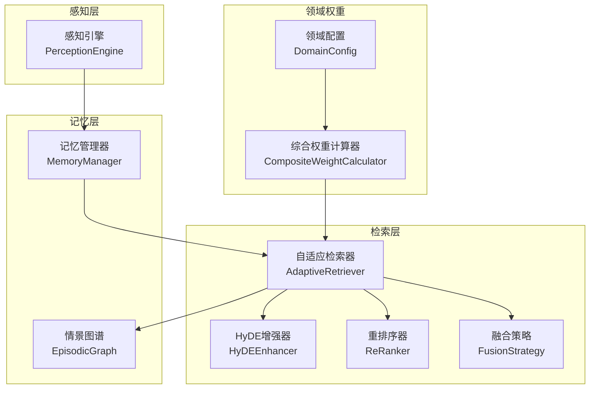
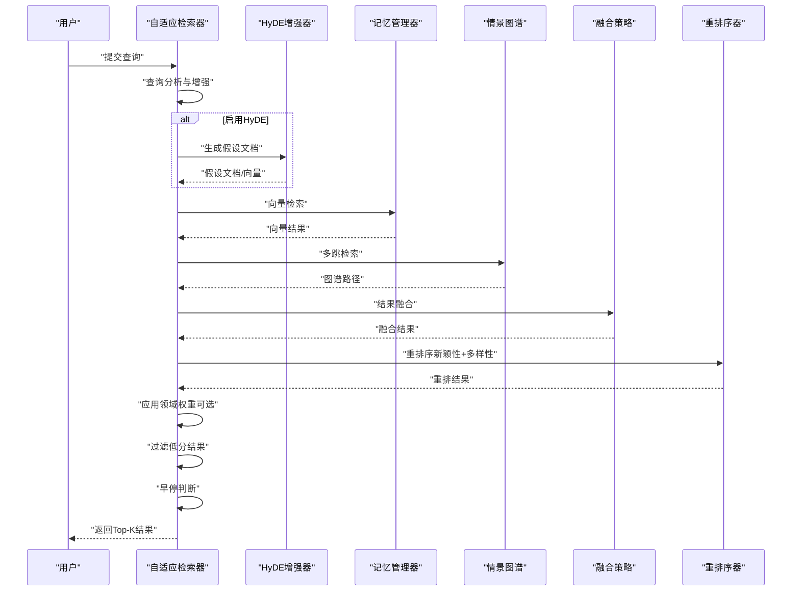
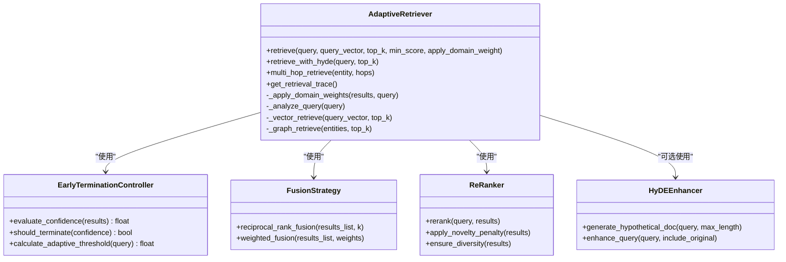
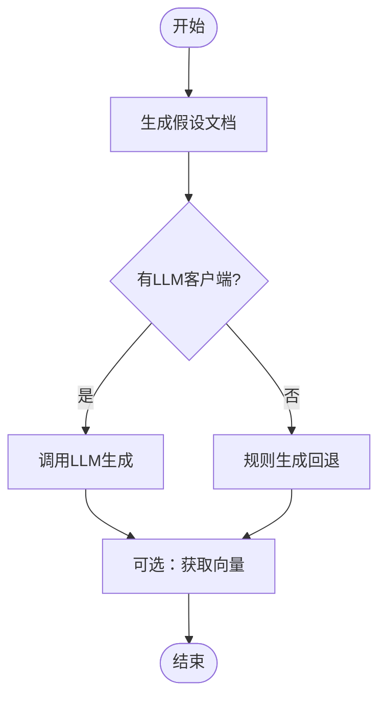
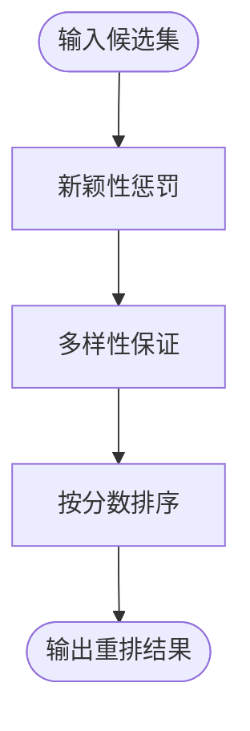
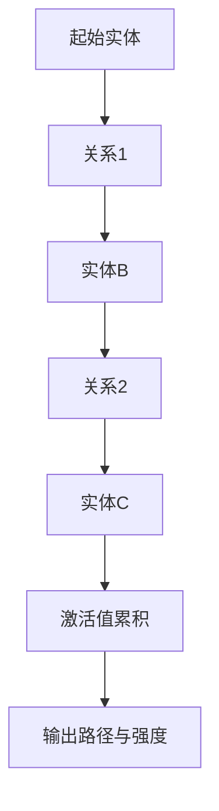
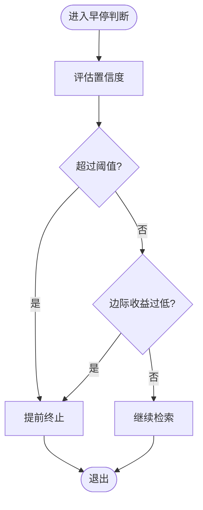
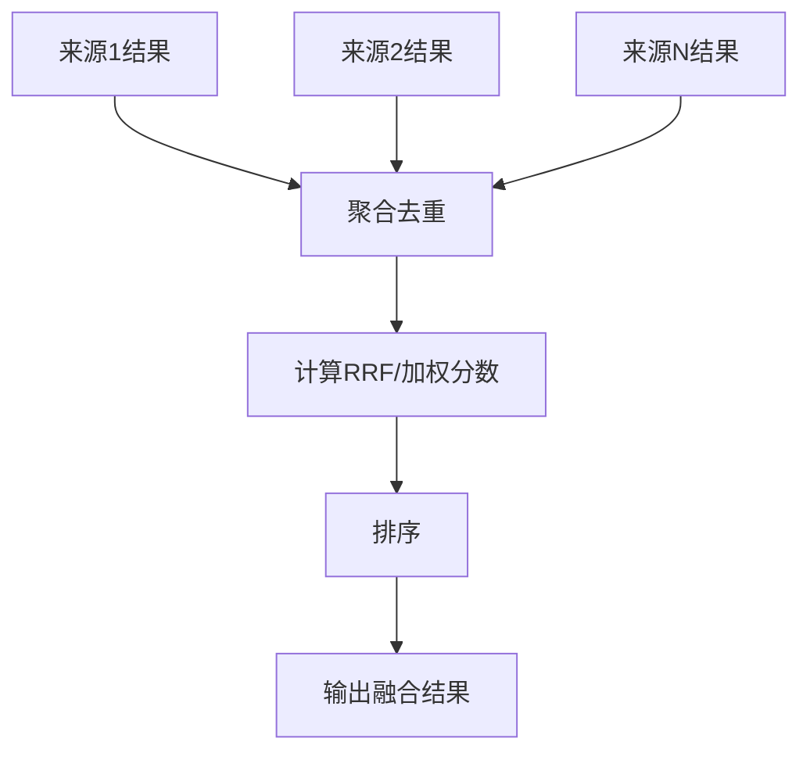
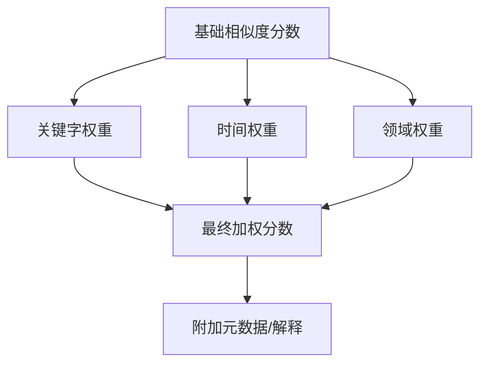
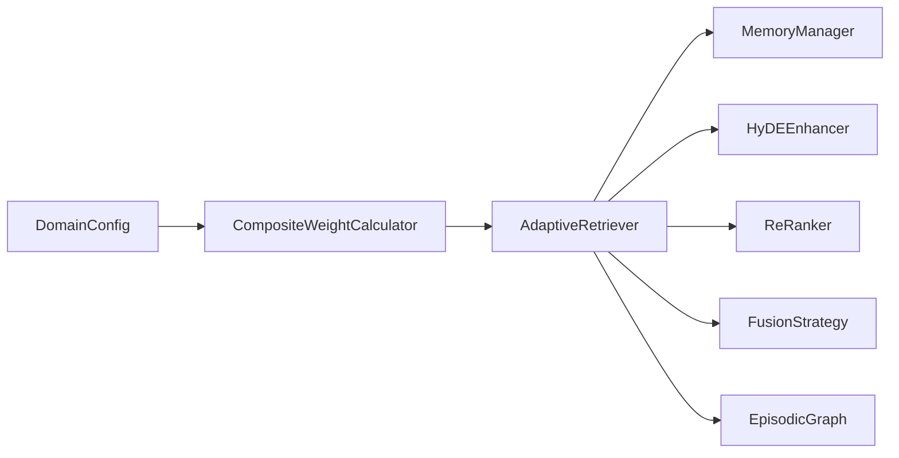

# 智能检索系统

<cite>
**本文引用的文件**
- [src/retrieval/__init__.py](file://src/retrieval/__init__.py)
- [src/retrieval/retriever.py](file://src/retrieval/retriever.py)
- [src/retrieval/hyde.py](file://src/retrieval/hyde.py)
- [src/retrieval/reranker.py](file://src/retrieval/reranker.py)
- [src/retrieval/fusion.py](file://src/retrieval/fusion.py)
- [src/retrieval/models.py](file://src/retrieval/models.py)
- [src/retrieval/README.md](file://src/retrieval/README.md)
- [src/memory/manager.py](file://src/memory/manager.py)
- [src/memory/episodic_graph.py](file://src/memory/episodic_graph.py)
- [src/domain/__init__.py](file://src/domain/__init__.py)
- [src/domain/config.py](file://src/domain/config.py)
- [src/domain/weight_calculator.py](file://src/domain/weight_calculator.py)
- [src/perception/engine.py](file://src/perception/engine.py)
- [src/refinement/models.py](file://src/refinement/models.py)
- [example/example_usage.py](file://example/example_usage.py)
- [README.md](file://README.md)
</cite>

## 目录
1. [简介](#简介)
2. [项目结构](#项目结构)
3. [核心组件](#核心组件)
4. [架构总览](#架构总览)
5. [详细组件分析](#详细组件分析)
6. [依赖分析](#依赖分析)
7. [性能考量](#性能考量)
8. [故障排查指南](#故障排查指南)
9. [结论](#结论)
10. [附录](#附录)

## 简介
本文件面向“智能检索系统”的开发者与使用者，围绕基于扩散激活理论的混合检索与重排序机制展开，系统阐述多跳联想检索、HyDE增强、新颖性重排序与早停机制的实现原理与使用方式，并提供配置选项、性能优化建议、结果融合策略与质量评估方法，帮助读者快速上手并扩展检索功能。

## 项目结构
检索层位于 NecoRAG 五层架构的第三层，负责混合检索、结果融合、重排序与早停控制，同时支持 HyDE 增强与领域权重计算，以提升检索质量与效率。

图表来源
- [src/retrieval/retriever.py:122-440](file://src/retrieval/retriever.py#L122-L440)
- [src/retrieval/hyde.py:17-213](file://src/retrieval/hyde.py#L17-L213)
- [src/retrieval/reranker.py:10-179](file://src/retrieval/reranker.py#L10-L179)
- [src/retrieval/fusion.py:9-128](file://src/retrieval/fusion.py#L9-L128)
- [src/memory/manager.py:16-186](file://src/memory/manager.py#L16-L186)
- [src/memory/episodic_graph.py:10-194](file://src/memory/episodic_graph.py#L10-L194)
- [src/domain/config.py:54-285](file://src/domain/config.py#L54-L285)
- [src/domain/weight_calculator.py:56-318](file://src/domain/weight_calculator.py#L56-L318)

章节来源
- [README.md:35-85](file://README.md#L35-L85)
- [src/retrieval/README.md:1-352](file://src/retrieval/README.md#L1-L352)

## 核心组件
- 自适应检索器（AdaptiveRetriever）：实现混合检索、结果融合、重排序、领域权重与早停控制。
- HyDE增强器（HyDEEnhancer）：通过生成假设文档提升模糊查询的检索效果。
- 重排序器（ReRanker）：基于新颖性惩罚与多样性保证进行重排序。
- 融合策略（FusionStrategy）：支持倒数排名融合（RRF）与加权融合。
- 领域权重（DomainConfig + CompositeWeightCalculator）：整合关键字、时间与领域相关性权重，计算最终加权分数。
- 记忆管理器（MemoryManager）与情景图谱（EpisodicGraph）：提供向量检索与多跳推理能力。

章节来源
- [src/retrieval/__init__.py:6-18](file://src/retrieval/__init__.py#L6-L18)
- [src/retrieval/retriever.py:122-164](file://src/retrieval/retriever.py#L122-L164)
- [src/retrieval/hyde.py:17-50](file://src/retrieval/hyde.py#L17-L50)
- [src/retrieval/reranker.py:10-40](file://src/retrieval/reranker.py#L10-L40)
- [src/retrieval/fusion.py:9-21](file://src/retrieval/fusion.py#L9-L21)
- [src/domain/config.py:54-161](file://src/domain/config.py#L54-L161)
- [src/domain/weight_calculator.py:56-81](file://src/domain/weight_calculator.py#L56-L81)
- [src/memory/manager.py:16-47](file://src/memory/manager.py#L16-L47)
- [src/memory/episodic_graph.py:10-32](file://src/memory/episodic_graph.py#L10-L32)

## 架构总览
检索流程遵循“多路并行检索 → 结果融合 → 重排序 → 领域权重 → 过滤与早停”的闭环，支持 HyDE 增强与多跳联想检索，满足不同复杂度查询的性能与质量需求。

图表来源
- [src/retrieval/retriever.py:177-253](file://src/retrieval/retriever.py#L177-L253)
- [src/retrieval/hyde.py:58-84](file://src/retrieval/hyde.py#L58-L84)
- [src/retrieval/fusion.py:18-70](file://src/retrieval/fusion.py#L18-L70)
- [src/retrieval/reranker.py:41-70](file://src/retrieval/reranker.py#L41-L70)
- [src/memory/manager.py:114-147](file://src/memory/manager.py#L114-L147)
- [src/memory/episodic_graph.py:71-93](file://src/memory/episodic_graph.py#L71-L93)

## 详细组件分析

### 自适应检索器（AdaptiveRetriever）
- 多路检索：向量检索（L2）、图谱检索（L3），可选 HyDE 增强。
- 结果融合：默认使用 RRF，支持加权融合。
- 重排序：新颖性惩罚与多样性保证。
- 领域权重：基于关键字、时间与领域相关性计算加权分数。
- 早停机制：根据置信度阈值与边际收益判断是否提前终止。

图表来源
- [src/retrieval/retriever.py:30-120](file://src/retrieval/retriever.py#L30-L120)
- [src/retrieval/retriever.py:122-440](file://src/retrieval/retriever.py#L122-L440)
- [src/retrieval/fusion.py:9-70](file://src/retrieval/fusion.py#L9-L70)
- [src/retrieval/reranker.py:10-70](file://src/retrieval/reranker.py#L10-L70)
- [src/retrieval/hyde.py:17-50](file://src/retrieval/hyde.py#L17-L50)

章节来源
- [src/retrieval/retriever.py:122-253](file://src/retrieval/retriever.py#L122-L253)
- [src/retrieval/retriever.py:307-363](file://src/retrieval/retriever.py#L307-L363)
- [src/retrieval/README.md:259-287](file://src/retrieval/README.md#L259-L287)

### HyDE增强（Hypothetical Document Embeddings）
- 通过 LLM 生成假设性答案文档，再进行向量化与检索，缓解术语不匹配与模糊查询问题。
- 支持多假设生成与规则回退方案，便于在无 LLM 客户端时仍可运行。

图表来源
- [src/retrieval/hyde.py:58-84](file://src/retrieval/hyde.py#L58-L84)
- [src/retrieval/hyde.py:172-213](file://src/retrieval/hyde.py#L172-L213)

章节来源
- [src/retrieval/hyde.py:17-50](file://src/retrieval/hyde.py#L17-L50)
- [src/retrieval/hyde.py:58-121](file://src/retrieval/hyde.py#L58-L121)
- [src/retrieval/README.md:60-79](file://src/retrieval/README.md#L60-L79)

### 新颖性重排序（Novelty Re-ranker）
- 新颖性惩罚：抑制与已选结果高度重复的内容。
- 多样性保证：基于贪心 MMR-like 策略选择具有代表性的结果。
- 文本相似度：当前实现为 Jaccard 相似度，后续可替换为更精确的度量。

图表来源
- [src/retrieval/reranker.py:41-70](file://src/retrieval/reranker.py#L41-L70)
- [src/retrieval/reranker.py:72-107](file://src/retrieval/reranker.py#L72-L107)
- [src/retrieval/reranker.py:109-153](file://src/retrieval/reranker.py#L109-L153)
- [src/retrieval/reranker.py:155-179](file://src/retrieval/reranker.py#L155-L179)

章节来源
- [src/retrieval/reranker.py:10-40](file://src/retrieval/reranker.py#L10-L40)
- [src/retrieval/reranker.py:41-70](file://src/retrieval/reranker.py#L41-L70)
- [src/retrieval/README.md:80-102](file://src/retrieval/README.md#L80-L102)

### 多跳联想检索（扩散激活理论）
- 基于情景图谱进行多跳查询，模拟扩散激活（Spreading Activation）的路径传播与强度累积。
- 支持 BFS 搜索、关系类型过滤与路径强度简化，后续可引入更精细的权重衰减与循环检测。

图表来源
- [src/retrieval/README.md:43-58](file://src/retrieval/README.md#L43-L58)
- [src/memory/episodic_graph.py:71-93](file://src/memory/episodic_graph.py#L71-L93)
- [src/memory/episodic_graph.py:95-125](file://src/memory/episodic_graph.py#L95-L125)

章节来源
- [src/memory/episodic_graph.py:10-32](file://src/memory/episodic_graph.py#L10-L32)
- [src/memory/episodic_graph.py:71-93](file://src/memory/episodic_graph.py#L71-L93)
- [src/retrieval/README.md:43-58](file://src/retrieval/README.md#L43-L58)

### 早停机制（Early Termination）
- 置信度评估：基于 top-1 与 top-2 分数差、结果数量等综合计算。
- 早停判断：固定阈值与边际收益递减双重策略，支持自适应阈值。
- 作用：在达到足够置信度时立即返回，避免冗余计算。

图表来源
- [src/retrieval/retriever.py:30-101](file://src/retrieval/retriever.py#L30-L101)
- [src/retrieval/retriever.py:245-253](file://src/retrieval/retriever.py#L245-L253)

章节来源
- [src/retrieval/retriever.py:30-120](file://src/retrieval/retriever.py#L30-L120)
- [src/retrieval/retriever.py:245-253](file://src/retrieval/retriever.py#L245-L253)
- [src/retrieval/README.md:103-142](file://src/retrieval/README.md#L103-L142)

### 结果融合策略
- RRF（倒数排名融合）：对同一文档在不同来源中的排名进行融合，兼顾不同检索通道的贡献。
- 加权融合：对不同来源结果赋予权重，适合已知各通道质量差异的场景。

图表来源
- [src/retrieval/fusion.py:18-70](file://src/retrieval/fusion.py#L18-L70)
- [src/retrieval/fusion.py:72-127](file://src/retrieval/fusion.py#L72-L127)

章节来源
- [src/retrieval/fusion.py:9-21](file://src/retrieval/fusion.py#L9-L21)
- [src/retrieval/fusion.py:18-70](file://src/retrieval/fusion.py#L18-L70)
- [src/retrieval/fusion.py:72-127](file://src/retrieval/fusion.py#L72-L127)

### 领域权重计算
- 关键字权重：基于领域配置的关键字等级与权重，结合内容相关性评分。
- 时间权重：基于创建/更新时间与衰减系数，支持常青内容标记。
- 领域权重：根据文档来源领域与相关性等级进行加权。
- 最终分数：综合乘积形式，支持解释性说明与批量重排序。

图表来源
- [src/domain/weight_calculator.py:81-146](file://src/domain/weight_calculator.py#L81-L146)
- [src/domain/weight_calculator.py:162-205](file://src/domain/weight_calculator.py#L162-L205)
- [src/domain/config.py:54-101](file://src/domain/config.py#L54-L101)

章节来源
- [src/domain/config.py:54-101](file://src/domain/config.py#L54-L101)
- [src/domain/weight_calculator.py:56-81](file://src/domain/weight_calculator.py#L56-L81)
- [src/domain/weight_calculator.py:81-146](file://src/domain/weight_calculator.py#L81-L146)
- [src/domain/weight_calculator.py:162-205](file://src/domain/weight_calculator.py#L162-L205)

## 依赖分析
- 检索层依赖记忆层提供的向量检索与图谱检索能力。
- 领域权重模块独立于检索流程，可通过配置开关启用。
- HyDE 增强依赖 LLM 客户端，若未提供则使用规则回退方案。
- 重排序与融合策略为纯函数式组件，便于替换与扩展。

图表来源
- [src/retrieval/retriever.py:122-164](file://src/retrieval/retriever.py#L122-L164)
- [src/domain/weight_calculator.py:56-81](file://src/domain/weight_calculator.py#L56-L81)
- [src/memory/manager.py:16-47](file://src/memory/manager.py#L16-L47)
- [src/memory/episodic_graph.py:10-32](file://src/memory/episodic_graph.py#L10-L32)

章节来源
- [src/retrieval/retriever.py:122-164](file://src/retrieval/retriever.py#L122-L164)
- [src/domain/weight_calculator.py:56-81](file://src/domain/weight_calculator.py#L56-L81)
- [src/memory/manager.py:16-47](file://src/memory/manager.py#L16-L47)
- [src/memory/episodic_graph.py:10-32](file://src/memory/episodic_graph.py#L10-L32)

## 性能考量
- 检索路径裁剪：在简单查询场景可仅执行向量检索，减少图谱与 HyDE 开销。
- 早停策略：在置信度达标时提前返回，显著降低复杂查询的延迟。
- 多样性与新颖性：适度的多样性与新颖性惩罚有助于提升用户体验，但可能增加重排成本，需根据业务目标调节权重。
- 向量与图谱索引：合理设置 top_k 与 min_score，避免过度打散导致的重排负担。
- LLM 依赖：HyDE 增强在无 LLM 客户端时可回退至规则生成，保障可用性。

章节来源
- [src/retrieval/README.md:289-303](file://src/retrieval/README.md#L289-L303)
- [src/retrieval/retriever.py:177-253](file://src/retrieval/retriever.py#L177-L253)
- [src/retrieval/reranker.py:10-40](file://src/retrieval/reranker.py#L10-L40)

## 故障排查指南
- HyDE 未生效：确认是否启用 HyDEEnhancer，以及 LLM 客户端是否正确初始化；若未提供 LLM 客户端，将使用规则回退方案。
- 图谱检索为空：检查实体是否已正确入库，关系是否建立；多跳深度与关系类型过滤可能导致结果为空。
- 重排序异常：若相似度计算不稳定，可调整相似度度量或增大冗余惩罚系数。
- 领域权重未生效：确认 DomainConfig 是否正确加载与设置，且 apply_domain_weight 为 True。
- 早停过早：适当降低置信度阈值或最小边际收益，或在查询复杂度较高时关闭早停。

章节来源
- [src/retrieval/hyde.py:42-49](file://src/retrieval/hyde.py#L42-L49)
- [src/retrieval/retriever.py:158-161](file://src/retrieval/retriever.py#L158-L161)
- [src/memory/episodic_graph.py:71-93](file://src/memory/episodic_graph.py#L71-L93)
- [src/retrieval/reranker.py:155-179](file://src/retrieval/reranker.py#L155-L179)
- [src/retrieval/retriever.py:237-241](file://src/retrieval/retriever.py#L237-L241)

## 结论
本检索系统以扩散激活理论为基础，结合 HyDE 增强、新颖性重排序与早停机制，形成高效稳定的混合检索与重排序闭环。通过领域权重与结果融合策略，系统在准确性与多样性之间取得平衡。开发者可根据业务场景灵活配置参数、扩展检索策略，并利用早停与路径裁剪优化性能。

## 附录

### 配置选项与使用场景
- 检索参数
  - top_k：返回结果数量
  - min_score：最低相关度阈值
  - max_hops：多跳最大跳数
  - hyde_enabled：是否启用 HyDE
- 重排序参数
  - novelty_weight：新颖性权重
  - diversity_weight：多样性权重
  - redundancy_penalty：冗余惩罚
- 早停参数
  - confidence_threshold：置信度阈值
  - min_gain：最小边际收益
- 领域权重参数
  - keyword_factor、temporal_factor、domain_factor：权重因子系数
  - decay_rate：时间衰减系数
  - enable_temporal_decay：是否启用时间衰减

章节来源
- [src/retrieval/README.md:305-328](file://src/retrieval/README.md#L305-L328)
- [src/domain/config.py:62-76](file://src/domain/config.py#L62-L76)
- [src/retrieval/retriever.py:129-151](file://src/retrieval/retriever.py#L129-L151)

### 使用示例与最佳实践
- 基础检索：适用于简单查询，优先向量检索，必要时开启 HyDE。
- 复杂推理：优先图谱检索与多跳，再进行融合与重排。
- 个性化检索：结合领域权重与用户偏好，动态调整权重因子。
- 性能优化：在高并发场景下启用早停与路径裁剪，减少重排成本。

章节来源
- [example/example_usage.py:94-136](file://example/example_usage.py#L94-L136)
- [src/retrieval/README.md:223-257](file://src/retrieval/README.md#L223-L257)