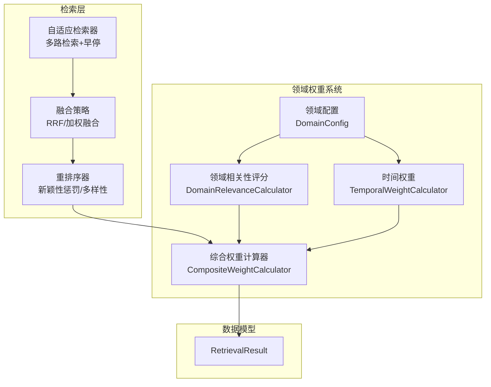
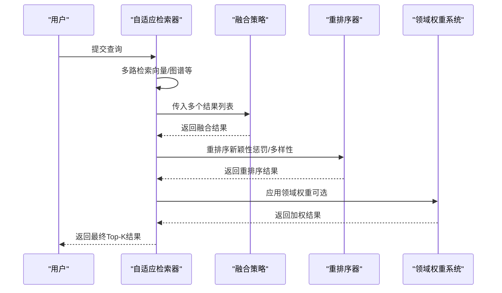
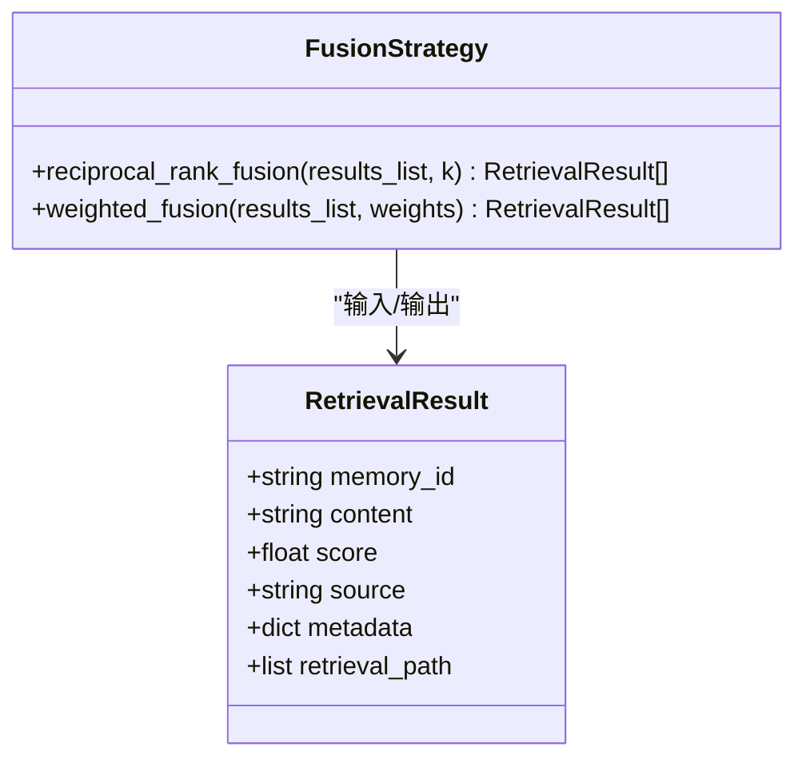
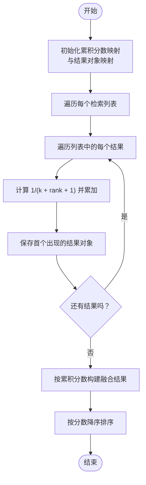
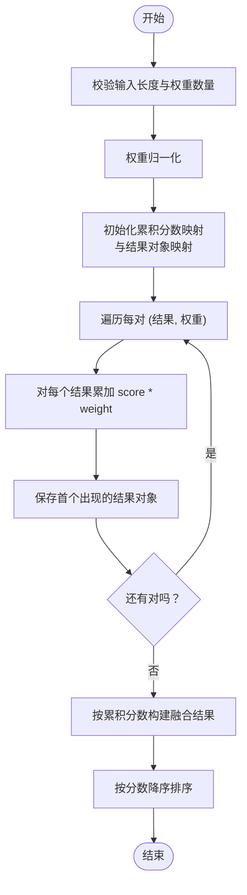
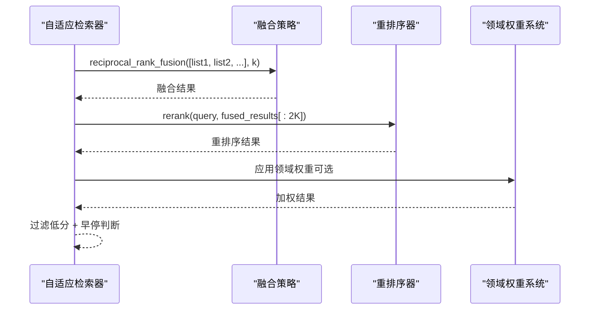
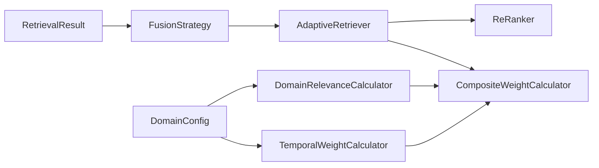

# 结果融合策略

<cite>
**本文引用的文件**
- [fusion.py](file://src/retrieval/fusion.py)
- [models.py](file://src/retrieval/models.py)
- [retriever.py](file://src/retrieval/retriever.py)
- [reranker.py](file://src/retrieval/reranker.py)
- [config.py](file://src/domain/config.py)
- [relevance.py](file://src/domain/relevance.py)
- [weight_calculator.py](file://src/domain/weight_calculator.py)
- [temporal_weight.py](file://src/domain/temporal_weight.py)
- [example_usage.py](file://example/example_usage.py)
- [domain_weight_example.py](file://example/domain_weight_example.py)
</cite>

## 目录
1. [简介](#简介)
2. [项目结构](#项目结构)
3. [核心组件](#核心组件)
4. [架构总览](#架构总览)
5. [详细组件分析](#详细组件分析)
6. [依赖分析](#依赖分析)
7. [性能考量](#性能考量)
8. [故障排查指南](#故障排查指南)
9. [结论](#结论)
10. [附录](#附录)

## 简介
本技术文档聚焦“结果融合策略”，系统阐述检索结果融合算法的实现原理、数学基础、适用场景与效果对比，并提供参数配置、性能优化、质量评估与稳定性分析。文档还给出自定义融合算法与扩展融合策略的实践指导，帮助开发者在 NecoRAG 检索管线中高效集成与调优融合策略。

## 项目结构
融合策略位于检索层，与检索结果数据模型、重排序器、领域权重系统协同工作，形成“多路检索 → 融合 → 重排序 → 领域权重 → 过滤与早停”的完整流程。

图表来源
- [fusion.py:9-128](file://src/retrieval/fusion.py#L9-L128)
- [retriever.py:122-254](file://src/retrieval/retriever.py#L122-L254)
- [reranker.py:10-179](file://src/retrieval/reranker.py#L10-L179)
- [weight_calculator.py:56-206](file://src/domain/weight_calculator.py#L56-L206)
- [config.py:54-161](file://src/domain/config.py#L54-L161)

章节来源
- [fusion.py:1-128](file://src/retrieval/fusion.py#L1-L128)
- [retriever.py:1-440](file://src/retrieval/retriever.py#L1-L440)
- [reranker.py:1-179](file://src/retrieval/reranker.py#L1-L179)
- [weight_calculator.py:1-318](file://src/domain/weight_calculator.py#L1-L318)
- [config.py:1-285](file://src/domain/config.py#L1-L285)

## 核心组件
- 融合策略（FusionStrategy）
  - 倒数秩融合（Reciprocal Rank Fusion, RRF）
  - 加权融合（Weighted Fusion）
- 检索结果数据模型（RetrievalResult）
- 自适应检索器（AdaptiveRetriever）
- 重排序器（ReRanker）
- 领域权重系统（DomainConfig、DomainRelevanceCalculator、CompositeWeightCalculator、TemporalWeightCalculator）

章节来源
- [fusion.py:9-128](file://src/retrieval/fusion.py#L9-L128)
- [models.py:9-29](file://src/retrieval/models.py#L9-L29)
- [retriever.py:122-254](file://src/retrieval/retriever.py#L122-L254)
- [reranker.py:10-179](file://src/retrieval/reranker.py#L10-L179)
- [weight_calculator.py:56-206](file://src/domain/weight_calculator.py#L56-L206)
- [config.py:54-161](file://src/domain/config.py#L54-L161)

## 架构总览
融合策略在检索流程中的位置如下：

图表来源
- [retriever.py:177-254](file://src/retrieval/retriever.py#L177-L254)
- [fusion.py:18-127](file://src/retrieval/fusion.py#L18-L127)
- [reranker.py:41-70](file://src/retrieval/reranker.py#L41-L70)
- [weight_calculator.py:81-146](file://src/domain/weight_calculator.py#L81-L146)

## 详细组件分析

### 融合策略类（FusionStrategy）
- 支持两种融合方式：
  - 倒数秩融合（RRF）
  - 加权融合（Weighted Fusion）
- 输入统一为 List[List[RetrievalResult]]，输出为排序后的融合结果

图表来源
- [fusion.py:9-128](file://src/retrieval/fusion.py#L9-L128)
- [models.py:9-29](file://src/retrieval/models.py#L9-L29)

章节来源
- [fusion.py:9-128](file://src/retrieval/fusion.py#L9-L128)
- [models.py:9-29](file://src/retrieval/models.py#L9-L29)

#### 倒数秩融合（RRF）原理与流程
- 数学原理
  - 对每个候选文档，统计其在各检索列表中的排名 r，累加 1/(k + r + 1)，k 为融合参数，通常取 60。
  - 同一文档在不同列表中出现则累加分值；最终按总分降序排序。
- 适用场景
  - 多路检索结果规模差异较大、需要稳健聚合时。
  - 对极端高分结果不敏感，强调“整体覆盖”。
- 参数与调优
  - k：控制收敛速度与对低秩项的容忍度。k 越大，低秩项贡献越大，融合越“平滑”。
- 复杂度
  - 时间：O(N)，N 为所有候选文档总数。
  - 空间：O(U)，U 为唯一文档集合大小。

图表来源
- [fusion.py:18-70](file://src/retrieval/fusion.py#L18-L70)

章节来源
- [fusion.py:18-70](file://src/retrieval/fusion.py#L18-L70)

#### 加权融合原理与流程
- 数学原理
  - 对每个检索列表赋予权重 w_i，归一化后按结果的 score_i 乘以 w_i 累加。
  - 同一文档跨列表出现则累加加权分数；最终按总分降序排序。
- 适用场景
  - 明确各检索来源的重要性（例如向量检索 vs 图谱检索）。
  - 需要显式控制不同来源的影响力。
- 参数与调优
  - weights：需与结果列表一一对应，且总和为 1。
  - 若权重不一致，应确保来源数量与权重数量匹配。
- 复杂度
  - 时间：O(N)。
  - 空间：O(U)。

图表来源
- [fusion.py:72-127](file://src/retrieval/fusion.py#L72-L127)

章节来源
- [fusion.py:72-127](file://src/retrieval/fusion.py#L72-L127)

### 自适应检索器与融合集成
- 自适应检索器在多路检索后调用融合策略，再进行重排序与领域权重应用。
- 早停机制基于置信度阈值与边际收益判断，避免无效计算。

图表来源
- [retriever.py:227-253](file://src/retrieval/retriever.py#L227-L253)
- [reranker.py:41-70](file://src/retrieval/reranker.py#L41-L70)
- [weight_calculator.py:255-305](file://src/domain/weight_calculator.py#L255-L305)

章节来源
- [retriever.py:177-254](file://src/retrieval/retriever.py#L177-L254)

### 重排序器与融合的衔接
- 重排序器在融合之后进行，通过新颖性惩罚与多样性策略进一步提升结果质量。
- 融合阶段的排序质量直接影响重排序阶段的输入稳定性。

章节来源
- [reranker.py:10-179](file://src/retrieval/reranker.py#L10-L179)

### 领域权重系统与融合的协同
- 领域权重系统在融合之后对结果进行加权，综合关键字相关性、时间衰减与领域权重。
- 融合阶段的“分数”作为基础分参与后续加权计算。

章节来源
- [weight_calculator.py:56-206](file://src/domain/weight_calculator.py#L56-L206)
- [relevance.py:198-241](file://src/domain/relevance.py#L198-L241)
- [temporal_weight.py:160-195](file://src/domain/temporal_weight.py#L160-L195)

## 依赖分析
- 融合策略依赖检索结果数据模型（RetrievalResult）。
- 自适应检索器依赖融合策略、重排序器与领域权重系统。
- 领域权重系统内部依赖领域配置、领域相关性评分与时间权重计算器。

图表来源
- [models.py:9-29](file://src/retrieval/models.py#L9-L29)
- [fusion.py:5-6](file://src/retrieval/fusion.py#L5-L6)
- [retriever.py:11-14](file://src/retrieval/retriever.py#L11-L14)
- [weight_calculator.py:11-13](file://src/domain/weight_calculator.py#L11-L13)
- [config.py:54-161](file://src/domain/config.py#L54-L161)

章节来源
- [models.py:9-29](file://src/retrieval/models.py#L9-L29)
- [fusion.py:5-6](file://src/retrieval/fusion.py#L5-L6)
- [retriever.py:11-14](file://src/retrieval/retriever.py#L11-L14)
- [weight_calculator.py:11-13](file://src/domain/weight_calculator.py#L11-L13)
- [config.py:54-161](file://src/domain/config.py#L54-L161)

## 性能考量
- 时间复杂度
  - RRF：O(N)，N 为候选文档总数。
  - 加权融合：O(N)，权重归一化 O(L)，L 为列表数量。
- 空间复杂度
  - O(U)，U 为唯一文档集合大小。
- 优化建议
  - 控制融合前候选集规模（top_k 扩展倍数），避免 N 过大。
  - 合理设置 k（RRF）与权重（加权融合），减少不必要的高开销重排序。
  - 将融合与重排序合并或缓存中间结果，减少重复计算。
  - 在融合后进行过滤（如最低分数阈值）以缩短后续处理链路。

[本节为通用性能讨论，无需特定文件来源]

## 故障排查指南
- 融合后结果为空
  - 检查多路检索是否返回空列表。
  - 确认融合输入格式为 List[List[RetrievalResult]]。
- 加权融合报错
  - 确保 weights 与 results_list 长度一致且总和非零。
- 融合结果质量不佳
  - 调整 RRF 的 k 值或尝试加权融合并设定合理权重。
  - 在融合后增加重排序与领域权重应用。
- 早停过早导致召回不足
  - 适当降低置信度阈值或放宽边际收益阈值。

章节来源
- [fusion.py:87-88](file://src/retrieval/fusion.py#L87-L88)
- [retriever.py:81-101](file://src/retrieval/retriever.py#L81-L101)

## 结论
- RRF 适合稳健聚合与跨来源覆盖，k 的选择影响融合平滑度与对低秩项的敏感度。
- 加权融合适合明确来源权重的场景，需确保权重归一化与来源数量匹配。
- 融合策略应与重排序和领域权重系统协同，以获得更高质量与稳定性的最终结果。
- 建议在生产环境中结合业务场景与数据分布，动态调整融合参数与阈值，并持续评估融合结果的质量与稳定性。

[本节为总结性内容，无需特定文件来源]

## 附录

### 融合参数配置与调优建议
- RRF
  - k：默认 60；若希望更关注高分，可减小；若希望包含更多低秩项，可增大。
- 加权融合
  - weights：确保与来源数量一致，且总和为 1；根据来源质量与成本设定。
- 重排序
  - novelty_weight、diversity_weight、redundancy_penalty：平衡新颖性与多样性。
- 领域权重
  - keyword_factor、temporal_factor、domain_factor：根据领域特性调整三者权重占比。
  - 时间衰减：根据领域变化速度选择合适的衰减率与层级范围。

章节来源
- [fusion.py:18-127](file://src/retrieval/fusion.py#L18-L127)
- [reranker.py:20-39](file://src/retrieval/reranker.py#L20-L39)
- [weight_calculator.py:207-223](file://src/domain/weight_calculator.py#L207-L223)
- [temporal_weight.py:25-44](file://src/domain/temporal_weight.py#L25-L44)

### 质量评估与稳定性分析
- 评估指标
  - 召回率、精确率、NDCG@K、MAP@K、多样性（如覆盖率、重复率）。
  - 人工评估：相关性、有用性、一致性。
- 稳定性分析
  - 对 k 或权重扰动的鲁棒性。
  - 不同查询类型（事实性、推理性、比较性）下的表现差异。
- 建议
  - 使用 A/B 测试对比不同融合策略与参数组合。
  - 结合领域权重系统进行分层评估（核心/相关/边缘）。

[本节为通用评估与稳定性讨论，无需特定文件来源]

### 自定义融合算法与扩展策略指导
- 设计原则
  - 保持输入输出一致的数据模型（List[RetrievalResult]）。
  - 明确融合目标（覆盖、精度、多样性）与代价（计算、延迟）。
- 扩展步骤
  - 在 FusionStrategy 中新增方法，遵循现有命名与注释规范。
  - 在 AdaptiveRetriever 中接入新融合方法，并在流程中调用。
  - 如需领域权重参与，确保新融合结果可被后续权重系统消费（保留 score 与 metadata）。
- 示例参考
  - RRF 与加权融合的实现路径：[fusion.py:18-127](file://src/retrieval/fusion.py#L18-L127)
  - 融合在检索流程中的调用路径：[retriever.py:227-231](file://src/retrieval/retriever.py#L227-L231)

章节来源
- [fusion.py:9-128](file://src/retrieval/fusion.py#L9-L128)
- [retriever.py:227-231](file://src/retrieval/retriever.py#L227-L231)

### 使用示例参考
- 完整检索流程示例（含融合与重排序）：[example_usage.py:94-136](file://example/example_usage.py#L94-L136)
- 领域权重系统示例（含相关性评分与综合权重）：[domain_weight_example.py:145-202](file://example/domain_weight_example.py#L145-L202)

章节来源
- [example_usage.py:94-136](file://example/example_usage.py#L94-L136)
- [domain_weight_example.py:145-202](file://example/domain_weight_example.py#L145-L202)