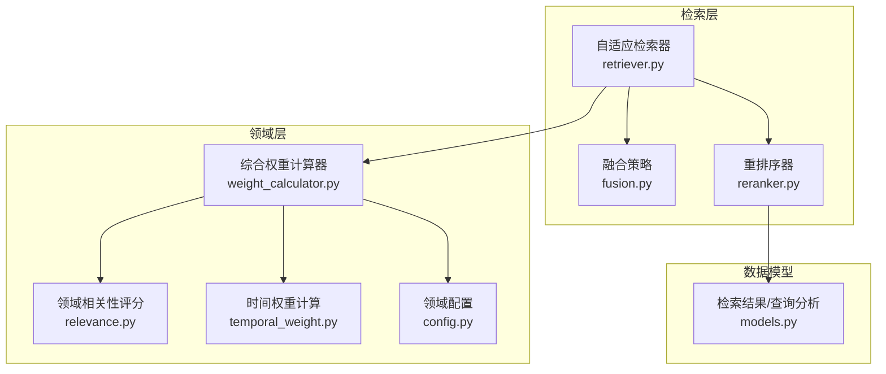
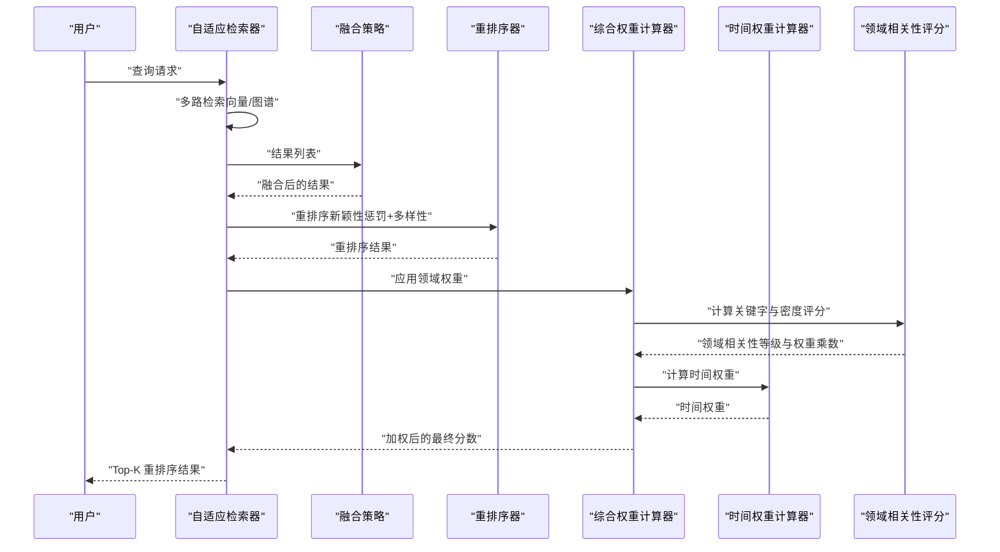
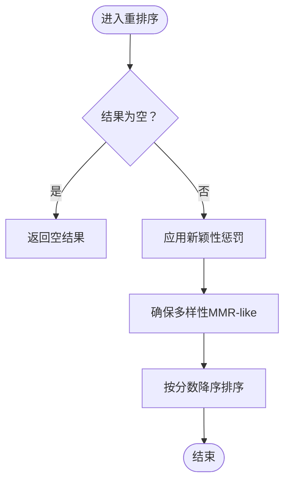
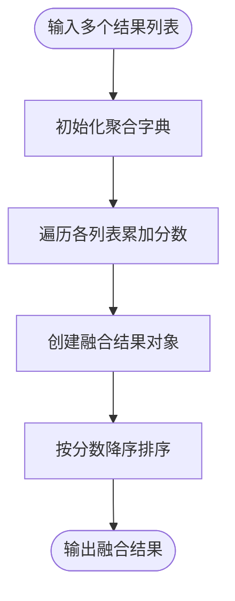
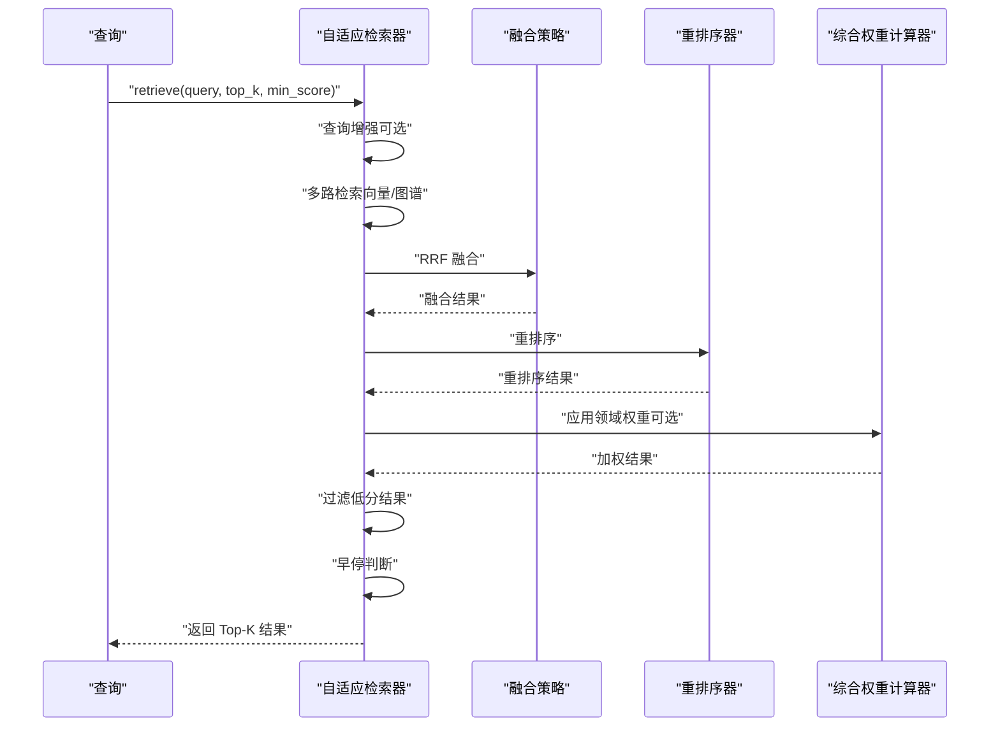
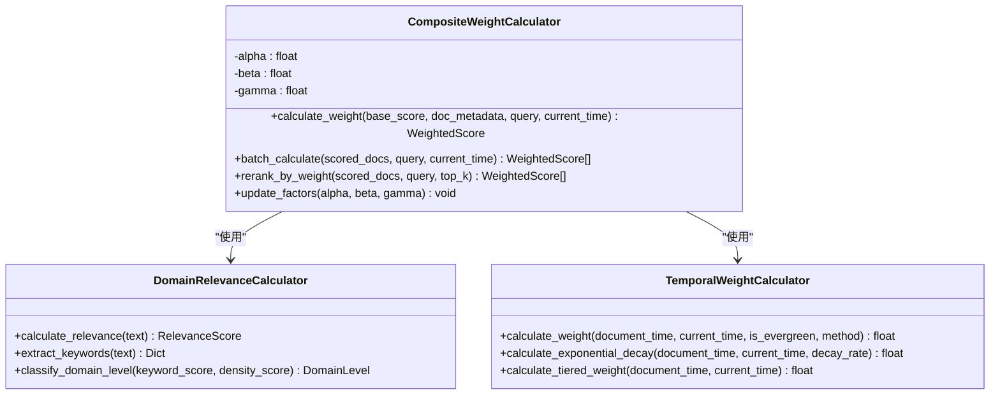
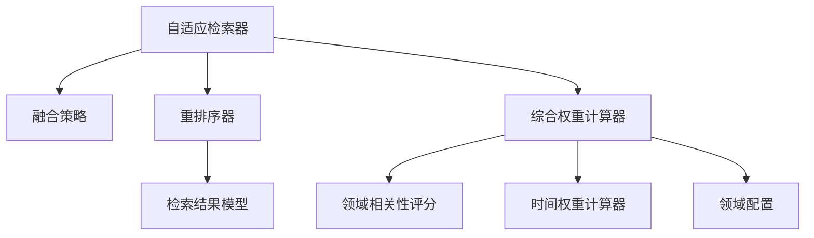

# 重排序系统

<cite>
**本文档引用的文件**
- [reranker.py](file://src/retrieval/reranker.py)
- [fusion.py](file://src/retrieval/fusion.py)
- [retriever.py](file://src/retrieval/retriever.py)
- [models.py](file://src/retrieval/models.py)
- [relevance.py](file://src/domain/relevance.py)
- [weight_calculator.py](file://src/domain/weight_calculator.py)
- [config.py](file://src/domain/config.py)
- [temporal_weight.py](file://src/domain/temporal_weight.py)
- [example_usage.py](file://example/example_usage.py)
- [README.md](file://README.md)
</cite>

## 目录
1. [简介](#简介)
2. [项目结构](#项目结构)
3. [核心组件](#核心组件)
4. [架构概览](#架构概览)
5. [详细组件分析](#详细组件分析)
6. [依赖关系分析](#依赖关系分析)
7. [性能考量](#性能考量)
8. [故障排除指南](#故障排除指南)
9. [结论](#结论)
10. [附录](#附录)

## 简介
本文件为 NecoRAG 重排序系统的详细技术文档，重点阐述基于语义匹配的重排序算法与实现原理，涵盖重排序模型选择、配置与性能优化策略，并提供不同重排序策略的效果对比与适用场景分析。同时，文档包含重排序质量评估指标与调优建议，以及为开发者提供的自定义重排序算法与集成其他排序技术的指导。

## 项目结构
重排序系统位于检索层（Layer 3），与融合策略、领域权重计算、时间权重计算共同构成完整的检索与重排序流水线。主要文件组织如下：
- 检索层：融合策略、重排序器、检索器
- 领域层：领域相关性评分、综合权重计算器、时间权重计算、领域配置
- 数据模型：检索结果与查询分析模型

图表来源
- [retriever.py:122-254](file://src/retrieval/retriever.py#L122-L254)
- [fusion.py:9-128](file://src/retrieval/fusion.py#L9-L128)
- [reranker.py:10-179](file://src/retrieval/reranker.py#L10-L179)
- [weight_calculator.py:56-206](file://src/domain/weight_calculator.py#L56-L206)
- [relevance.py:29-242](file://src/domain/relevance.py#L29-L242)
- [temporal_weight.py:47-196](file://src/domain/temporal_weight.py#L47-L196)
- [models.py:9-29](file://src/retrieval/models.py#L9-L29)

章节来源
- [retriever.py:122-254](file://src/retrieval/retriever.py#L122-L254)
- [fusion.py:9-128](file://src/retrieval/fusion.py#L9-L128)
- [reranker.py:10-179](file://src/retrieval/reranker.py#L10-L179)
- [weight_calculator.py:56-206](file://src/domain/weight_calculator.py#L56-L206)
- [relevance.py:29-242](file://src/domain/relevance.py#L29-L242)
- [temporal_weight.py:47-196](file://src/domain/temporal_weight.py#L47-L196)
- [models.py:9-29](file://src/retrieval/models.py#L9-L29)

## 核心组件
- 自适应检索器（AdaptiveRetriever）：负责多路检索、结果融合、重排序、领域权重应用与早停控制。
- 融合策略（FusionStrategy）：提供 RRF 与加权融合两种策略，统一来自不同检索源的结果。
- 重排序器（ReRanker）：实现新颖性惩罚与多样性保证，当前预留 BGE-Reranker-v2 集成入口。
- 综合权重计算器（CompositeWeightCalculator）：整合关键字权重、时间权重与领域权重，计算最终加权分数。
- 领域相关性评分（DomainRelevanceCalculator）：基于关键字与密度计算领域相关性等级与权重乘数。
- 时间权重计算器（TemporalWeightCalculator）：基于指数衰减与分层权重计算时间权重。
- 领域配置（DomainConfig）：定义关键字词典、权重因子、时间衰减参数与领域权重映射。

章节来源
- [retriever.py:122-254](file://src/retrieval/retriever.py#L122-L254)
- [fusion.py:9-128](file://src/retrieval/fusion.py#L9-L128)
- [reranker.py:10-179](file://src/retrieval/reranker.py#L10-L179)
- [weight_calculator.py:56-206](file://src/domain/weight_calculator.py#L56-L206)
- [relevance.py:29-242](file://src/domain/relevance.py#L29-L242)
- [temporal_weight.py:47-196](file://src/domain/temporal_weight.py#L47-L196)
- [config.py:54-161](file://src/domain/config.py#L54-L161)

## 架构概览
重排序系统在检索流程中的位置与数据流如下：

图表来源
- [retriever.py:177-254](file://src/retrieval/retriever.py#L177-L254)
- [fusion.py:18-71](file://src/retrieval/fusion.py#L18-L71)
- [reranker.py:41-71](file://src/retrieval/reranker.py#L41-L71)
- [weight_calculator.py:81-147](file://src/domain/weight_calculator.py#L81-L147)
- [relevance.py:198-242](file://src/domain/relevance.py#L198-L242)
- [temporal_weight.py:160-196](file://src/domain/temporal_weight.py#L160-L196)

## 详细组件分析

### 重排序器（ReRanker）
- 功能概述
  - 新颖性惩罚：抑制重复内容，通过与已选结果的相似度累加施加惩罚。
  - 多样性保证：采用类似最大相关性最小冗余（MMR）的贪心策略，最大化相关性与最小化与已选结果的最大相似度。
  - 分数排序：按最终分数降序排列。
  - 模型预留：当前预留 BGE-Reranker-v2 集成入口，便于后续替换为真实模型。
- 复杂度分析
  - 新颖性惩罚：对每个候选计算与之前已选结果的相似度，整体复杂度 O(n^2)。
  - 多样性策略：每轮选择最佳候选，整体复杂度 O(n^2)。
- 关键实现要点
  - 相似度计算：当前采用 Jaccard 相似度（词集合交并比），可扩展为向量相似度或语义相似度。
  - 惩罚参数：冗余惩罚系数控制重复抑制强度。
  - 多样性权重：平衡相关性与多样性的权重。
- 优化建议
  - 相似度计算：使用 TF-IDF 或语义嵌入相似度替代 Jaccard，提升准确性。
  - 索引加速：对候选集建立倒排索引或近似最近邻索引以降低复杂度。
  - 并行化：相似度计算与惩罚可并行化处理。

图表来源
- [reranker.py:41-71](file://src/retrieval/reranker.py#L41-L71)
- [reranker.py:72-107](file://src/retrieval/reranker.py#L72-L107)
- [reranker.py:109-153](file://src/retrieval/reranker.py#L109-L153)

章节来源
- [reranker.py:10-179](file://src/retrieval/reranker.py#L10-L179)

### 融合策略（FusionStrategy）
- 功能概述
  - RRF（Reciprocal Rank Fusion）：对同一查询在不同检索源中的排名进行倒数排名融合，k 为融合参数。
  - 加权融合：对不同检索源的分数进行加权累加，权重需归一化。
- 复杂度分析
  - RRF：遍历所有结果列表，复杂度 O(N)，N 为总结果数。
  - 加权融合：同样为 O(N)。
- 关键实现要点
  - 去重与聚合：以 memory_id 作为键聚合来自不同源的结果。
  - 分数更新：创建新的检索结果对象，保留内容与元数据。
- 优化建议
  - 源权重：根据检索源质量动态调整权重，避免固定权重导致的偏差。
  - 排序稳定性：在分数相等时引入随机扰动或额外排序键。

图表来源
- [fusion.py:18-71](file://src/retrieval/fusion.py#L18-L71)
- [fusion.py:72-128](file://src/retrieval/fusion.py#L72-L128)

章节来源
- [fusion.py:9-128](file://src/retrieval/fusion.py#L9-L128)

### 自适应检索器（AdaptiveRetriever）
- 功能概述
  - 多路检索：向量检索与图谱检索（当前图谱检索为占位实现）。
  - 结果融合：采用 RRF 融合。
  - 重排序：调用 ReRanker 进行新颖性惩罚与多样性保证。
  - 领域权重：可选应用关键字、时间与领域权重。
  - 早停机制：基于置信度阈值与边际收益递减策略决定是否提前终止。
- 流程图

图表来源
- [retriever.py:177-254](file://src/retrieval/retriever.py#L177-L254)

章节来源
- [retriever.py:122-440](file://src/retrieval/retriever.py#L122-L440)

### 综合权重计算器（CompositeWeightCalculator）
- 功能概述
  - 关键字权重：基于领域相关性评分计算关键字权重，限制在合理范围。
  - 时间权重：支持指数衰减、分层权重与混合方法。
  - 领域权重：根据领域相关性等级获取权重乘数。
  - 最终分数：按公式综合计算最终加权分数，并生成解释信息。
- 公式说明
  - 最终分数 = 基础分数 × (α × 关键字权重) × (β × 时间权重) × (γ × 领域权重) × 自定义权重
  - 权重因子系数 α、β、γ 可配置
- 复杂度分析
  - 单条记录：O(1)，批量处理为 O(n)。
- 关键实现要点
  - 关键字权重范围约束：确保权重在 [0.5, 2.0] 之间。
  - 解释信息：包含各权重分量与领域评分说明。
- 优化建议
  - 批量计算：利用向量化操作提升关键字匹配与权重计算效率。
  - 缓存：对常用文档的领域相关性评分进行缓存。

图表来源
- [weight_calculator.py:56-206](file://src/domain/weight_calculator.py#L56-L206)
- [relevance.py:29-242](file://src/domain/relevance.py#L29-L242)
- [temporal_weight.py:47-196](file://src/domain/temporal_weight.py#L47-L196)

章节来源
- [weight_calculator.py:56-318](file://src/domain/weight_calculator.py#L56-L318)

### 领域相关性评分（DomainRelevanceCalculator）
- 功能概述
  - 关键字提取：基于正则表达式与别名索引提取匹配关键字。
  - 关键字得分：按权重与频次计算，归一化到合理范围。
  - 关键字密度：按词数计算密度，归一化到 [0, 1]。
  - 领域等级：综合关键字得分与密度判定等级（核心/相关/边缘/领域外）。
  - 权重乘数：根据等级获取对应的权重乘数。
- 复杂度分析
  - 关键字提取：对每个模式执行一次正则匹配，整体 O(m×n)，m 为关键字数，n 为文本长度。
- 关键实现要点
  - 模式构建：转义特殊字符，英文添加单词边界，中文直接匹配。
  - 置信度：基于匹配关键字数量计算，上限为 5 个。
- 优化建议
  - 索引优化：对关键字词典建立 Trie 或 AC 自动机加速匹配。
  - 并行化：对批量文本计算进行并行处理。

章节来源
- [relevance.py:29-328](file://src/domain/relevance.py#L29-L328)

### 时间权重计算器（TemporalWeightCalculator）
- 功能概述
  - 时间层级：按天数划分最近期、近期、中期、远期、历史与常青。
  - 分层权重：在层级范围内线性插值，确保权重连续性。
  - 指数衰减：按 e^(-λt) 计算衰减权重。
  - 混合方法：分层权重与指数衰减取平均。
- 复杂度分析
  - 单次计算：O(1)。
- 关键实现要点
  - 常青内容：不受时间衰减影响，权重恒为 1.0。
  - 方法选择：支持 tiered、exponential、hybrid 三种方法。
- 优化建议
  - 预设配置：针对不同领域提供预设衰减配置，减少调参成本。

章节来源
- [temporal_weight.py:47-271](file://src/domain/temporal_weight.py#L47-L271)

### 领域配置（DomainConfig）
- 功能概述
  - 关键字词典：定义关键字、级别、权重、别名与描述。
  - 权重因子：关键字、时间、领域因子系数。
  - 时间衰减：衰减系数与开关。
  - 领域权重：核心、相关、边缘、领域外的权重乘数。
  - 序列化：支持 JSON 导入导出。
- 关键实现要点
  - 权重范围验证：根据关键字级别自动修正权重范围。
  - 别名索引：为别名建立索引，便于快速匹配。
- 优化建议
  - 动态加载：支持运行时热更新领域配置，无需重启服务。

章节来源
- [config.py:54-285](file://src/domain/config.py#L54-L285)

## 依赖关系分析
重排序系统内部依赖关系如下：

图表来源
- [retriever.py:122-254](file://src/retrieval/retriever.py#L122-L254)
- [reranker.py:10-179](file://src/retrieval/reranker.py#L10-L179)
- [weight_calculator.py:56-206](file://src/domain/weight_calculator.py#L56-L206)
- [relevance.py:29-242](file://src/domain/relevance.py#L29-L242)
- [temporal_weight.py:47-196](file://src/domain/temporal_weight.py#L47-L196)
- [models.py:9-29](file://src/retrieval/models.py#L9-L29)

章节来源
- [retriever.py:122-254](file://src/retrieval/retriever.py#L122-L254)
- [reranker.py:10-179](file://src/retrieval/reranker.py#L10-L179)
- [weight_calculator.py:56-206](file://src/domain/weight_calculator.py#L56-L206)
- [relevance.py:29-242](file://src/domain/relevance.py#L29-L242)
- [temporal_weight.py:47-196](file://src/domain/temporal_weight.py#L47-L196)
- [models.py:9-29](file://src/retrieval/models.py#L9-L29)

## 性能考量
- 时间复杂度
  - 重排序器：新颖性惩罚与多样性策略均为 O(n^2)，适合中小规模结果集；大规模场景建议引入索引加速与近似最近邻。
  - 融合策略：RRF 与加权融合均为 O(N)，适合多源融合。
  - 综合权重计算器：单条记录 O(1)，批量处理 O(n)。
  - 领域相关性评分：O(m×n)，可通过 Trie/AC 自动机优化。
- 空间复杂度
  - 主要消耗在候选集与中间聚合结构，建议在内存受限时限制 top_k 与中间结果缓存。
- 优化建议
  - 相似度计算：使用向量嵌入相似度替代 Jaccard，提升准确性与鲁棒性。
  - 索引加速：对候选集建立倒排索引或 ANN 索引，将重排序复杂度降至 O(n log n)。
  - 并行化：对关键字匹配、相似度计算与权重计算进行并行化处理。
  - 缓存：对常用文档的领域相关性评分与时间权重进行缓存。
  - 模型集成：将 BGE-Reranker-v2 等真实模型集成到重排序器，提升排序质量。

## 故障排除指南
- 重排序结果为空
  - 检查输入结果列表是否为空，确认融合与重排序步骤是否正确执行。
  - 参考路径：[reranker.py:58-60](file://src/retrieval/reranker.py#L58-L60)
- 相似度计算异常
  - 当前采用 Jaccard 相似度，若文本为空或无有效词汇会导致相似度为 0。建议扩展为向量相似度或 TF-IDF。
  - 参考路径：[reranker.py:155-179](file://src/retrieval/reranker.py#L155-L179)
- 融合权重不匹配
  - 加权融合要求结果列表与权重列表长度一致，否则抛出异常。请检查权重配置。
  - 参考路径：[fusion.py:87-89](file://src/retrieval/fusion.py#L87-L89)
- 领域权重未生效
  - 确认领域配置已正确加载且启用领域权重计算。检查 DomainConfigManager 的状态。
  - 参考路径：[retriever.py:158-161](file://src/retrieval/retriever.py#L158-L161)
- 早停机制误判
  - 置信度阈值过高可能导致提前终止。可调低阈值或增加最小边际收益阈值。
  - 参考路径：[retriever.py:39-120](file://src/retrieval/retriever.py#L39-L120)

章节来源
- [reranker.py:58-60](file://src/retrieval/reranker.py#L58-L60)
- [reranker.py:155-179](file://src/retrieval/reranker.py#L155-L179)
- [fusion.py:87-89](file://src/retrieval/fusion.py#L87-L89)
- [retriever.py:158-161](file://src/retrieval/retriever.py#L158-L161)
- [retriever.py:39-120](file://src/retrieval/retriever.py#L39-L120)

## 结论
重排序系统通过融合策略、新颖性惩罚与多样性保证，结合领域权重与时效权重，实现了高质量的检索结果重排序。当前实现为后续集成真实重排序模型（如 BGE-Reranker-v2）提供了清晰的扩展路径。通过索引加速、并行化与缓存等优化手段，可在保证排序质量的同时显著提升性能。开发者可根据业务场景灵活调整权重因子与相似度计算策略，实现定制化的重排序效果。

## 附录
- 使用示例
  - 参考示例脚本中的检索流程，了解重排序系统在完整工作流中的应用。
  - 参考路径：[example_usage.py:94-136](file://example/example_usage.py#L94-L136)
- 性能指标
  - 参考项目 README 中的性能指标，了解系统在召回率、幻觉率与延迟方面的目标。
  - 参考路径：[README.md:465-474](file://README.md#L465-L474)

章节来源
- [example_usage.py:94-136](file://example/example_usage.py#L94-L136)
- [README.md:465-474](file://README.md#L465-L474)