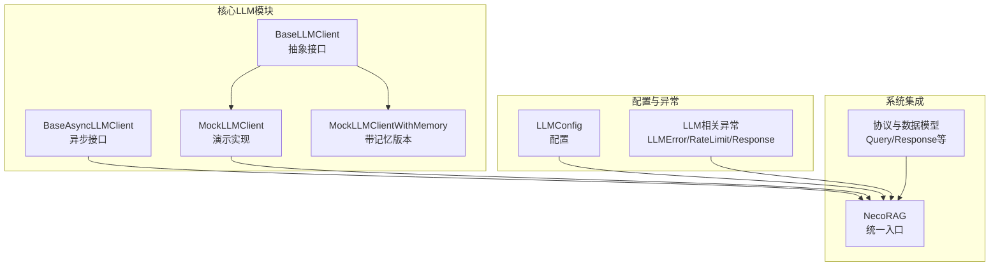
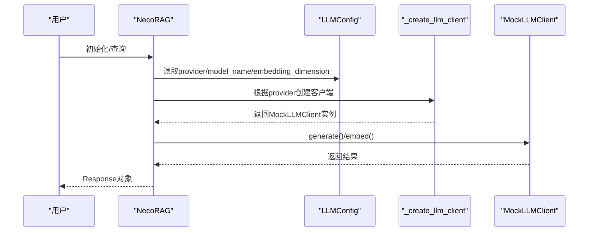
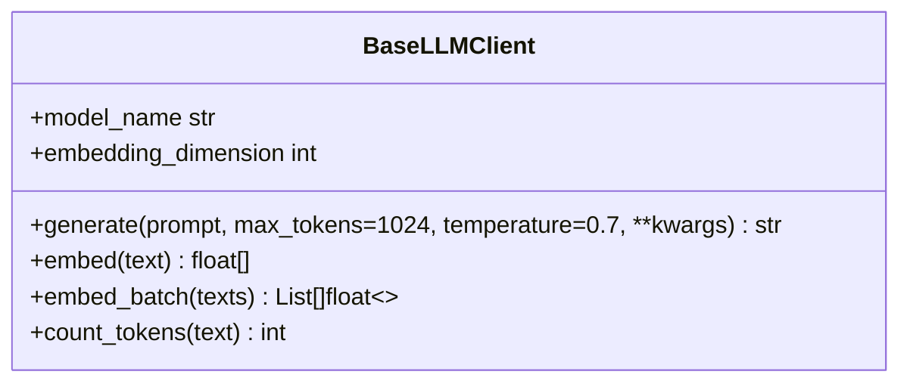
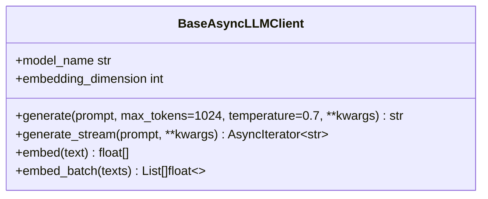
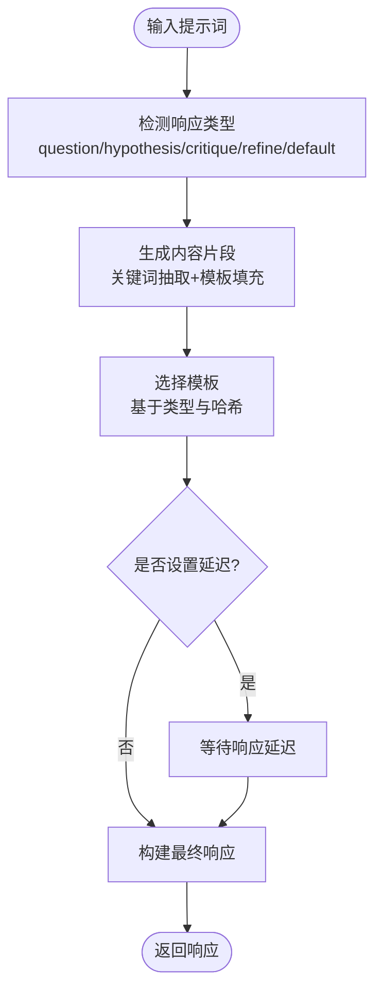
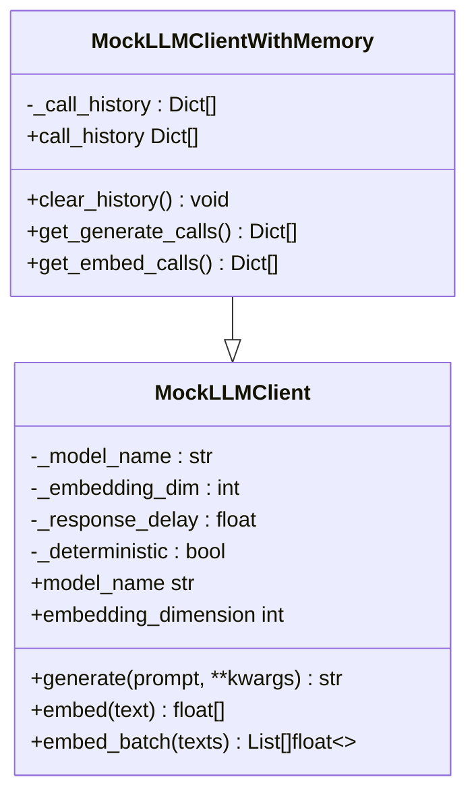
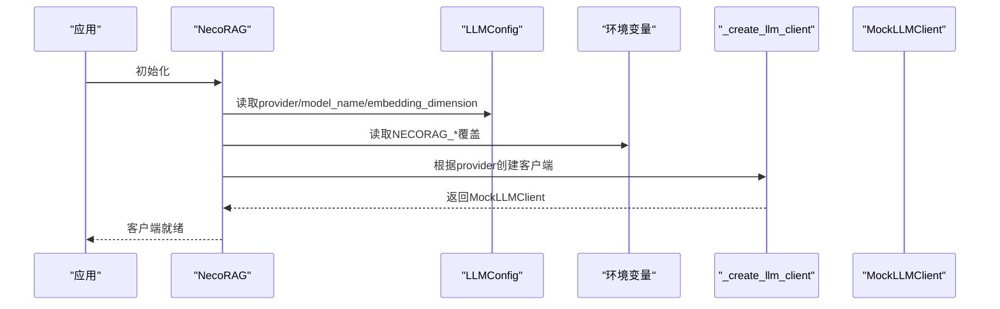
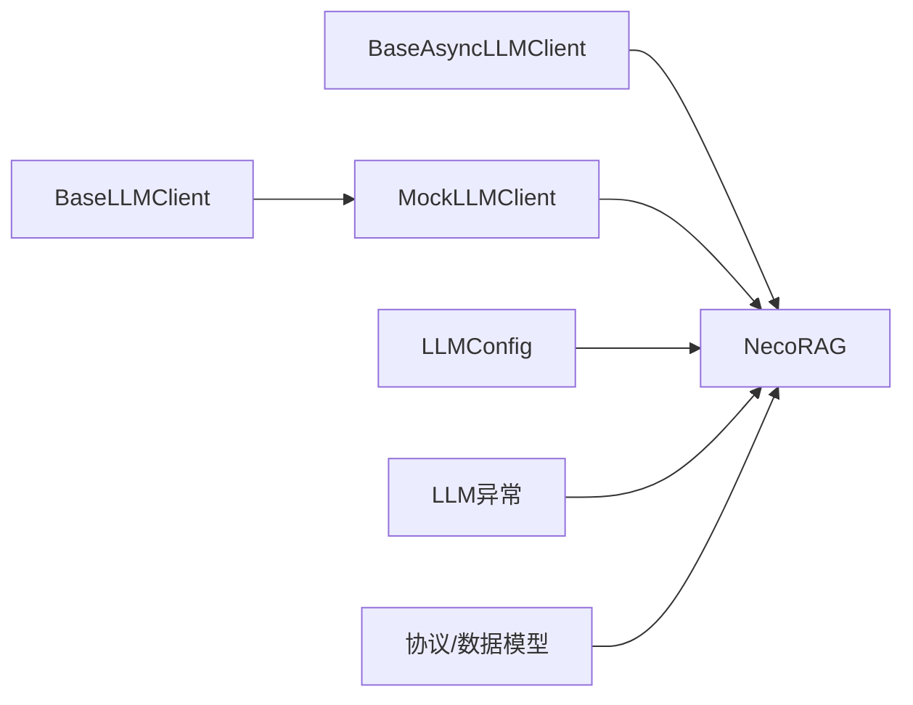

# LLM客户端接口

<cite>
**本文档引用的文件**
- [src/core/llm/base.py](file://src/core/llm/base.py)
- [src/core/llm/mock.py](file://src/core/llm/mock.py)
- [src/core/llm/__init__.py](file://src/core/llm/__init__.py)
- [src/core/config.py](file://src/core/config.py)
- [src/core/exceptions.py](file://src/core/exceptions.py)
- [src/core/protocols.py](file://src/core/protocols.py)
- [src/necorag.py](file://src/necorag.py)
- [README.md](file://README.md)
- [example/example_usage.py](file://example/example_usage.py)
</cite>

## 目录
1. [简介](#简介)
2. [项目结构](#项目结构)
3. [核心组件](#核心组件)
4. [架构总览](#架构总览)
5. [详细组件分析](#详细组件分析)
6. [依赖分析](#依赖分析)
7. [性能考虑](#性能考虑)
8. [故障排查指南](#故障排查指南)
9. [结论](#结论)
10. [附录](#附录)

## 简介
本文件面向NecoRAG的LLM客户端接口，系统性阐述BaseLLMClient抽象接口的设计理念、方法规范与扩展机制；深入解析MockLLMClient的实现原理、测试支持与开发便利性；给出如何实现新的LLM提供商适配器、接口兼容性与性能优化策略；并提供配置方法、调用示例与错误处理指南，涵盖LLM服务集成、API密钥管理、速率限制与成本控制等实践要点。

## 项目结构
围绕LLM客户端接口的关键文件组织如下：
- 抽象接口与工具：src/core/llm/base.py
- Mock实现与带记忆版本：src/core/llm/mock.py
- 模块导出：src/core/llm/__init__.py
- 配置与异常：src/core/config.py、src/core/exceptions.py
- 协议与数据模型：src/core/protocols.py
- 统一入口与集成：src/necorag.py
- 使用示例与说明：README.md、example/example_usage.py

图表来源
- [src/core/llm/base.py:11-134](file://src/core/llm/base.py#L11-L134)
- [src/core/llm/mock.py:16-313](file://src/core/llm/mock.py#L16-L313)
- [src/core/config.py:82-101](file://src/core/config.py#L82-L101)
- [src/core/exceptions.py:205-252](file://src/core/exceptions.py#L205-L252)
- [src/necorag.py:184-196](file://src/necorag.py#L184-L196)
- [src/core/protocols.py:203-278](file://src/core/protocols.py#L203-L278)

章节来源
- [src/core/llm/base.py:1-178](file://src/core/llm/base.py#L1-L178)
- [src/core/llm/mock.py:1-313](file://src/core/llm/mock.py#L1-L313)
- [src/core/llm/__init__.py:1-15](file://src/core/llm/__init__.py#L1-L15)
- [src/core/config.py:1-408](file://src/core/config.py#L1-L408)
- [src/core/exceptions.py:1-455](file://src/core/exceptions.py#L1-L455)
- [src/core/protocols.py:1-298](file://src/core/protocols.py#L1-L298)
- [src/necorag.py:1-902](file://src/necorag.py#L1-L902)
- [README.md:1-678](file://README.md#L1-L678)
- [example/example_usage.py:1-252](file://example/example_usage.py#L1-L252)

## 核心组件
- BaseLLMClient：定义同步LLM客户端的标准接口，包括generate、embed、embed_batch、model_name、embedding_dimension以及count_tokens等通用能力。
- BaseAsyncLLMClient：定义异步LLM客户端的标准接口，包括generate、generate_stream、embed、embed_batch等。
- MockLLMClient：提供无需外部依赖的演示实现，支持确定性响应、延迟模拟、模板化回答与关键词抽取等。
- MockLLMClientWithMemory：在Mock基础上增加调用历史记录，便于测试验证与回归分析。
- LLMConfig：统一管理LLM提供商、模型名、API密钥、温度、最大token、超时、嵌入模型与维度等配置项。
- LLM相关异常：LLMError、LLMConnectionError、LLMRateLimitError、LLMResponseError等，统一错误语义与可追踪字段。
- 协议与数据模型：Query、Response、RetrievalResult等，确保跨模块数据交换一致。

章节来源
- [src/core/llm/base.py:11-134](file://src/core/llm/base.py#L11-L134)
- [src/core/llm/mock.py:16-313](file://src/core/llm/mock.py#L16-L313)
- [src/core/config.py:82-101](file://src/core/config.py#L82-L101)
- [src/core/exceptions.py:205-252](file://src/core/exceptions.py#L205-L252)
- [src/core/protocols.py:203-278](file://src/core/protocols.py#L203-L278)

## 架构总览
NecoRAG通过NecoRAG统一入口类在运行时根据配置创建LLM客户端实例。当前默认使用MockLLMClient进行演示与开发，后续可扩展为OpenAI、Azure、Anthropic等真实提供商。

图表来源
- [src/necorag.py:184-196](file://src/necorag.py#L184-L196)
- [src/core/config.py:82-101](file://src/core/config.py#L82-L101)
- [src/core/llm/mock.py:16-134](file://src/core/llm/mock.py#L16-L134)

## 详细组件分析

### BaseLLMClient抽象接口
- 设计理念
  - 明确职责分离：generate负责文本生成，embed负责向量化，embed_batch提供批量能力。
  - 统一属性：model_name与embedding_dimension便于上层按需选择与显示。
  - 可扩展性：count_tokens提供默认估算，便于替换为更精确的tokenizer。
- 方法规范
  - generate/prompt/max_tokens/temperature/**kwargs：标准化生成参数，便于上层统一调用。
  - embed/text：标准化向量化接口，便于与检索/记忆层对接。
  - embed_batch：默认实现为顺序调用，子类可覆盖为并发实现。
  - model_name/embedding_dimension：只读属性，便于配置与展示。
  - count_tokens：默认估算，子类可覆盖为精确实现。
- 扩展机制
  - 子类必须实现generate、embed、model_name、embedding_dimension。
  - 可选择覆盖embed_batch、count_tokens以提升性能或准确性。

图表来源
- [src/core/llm/base.py:11-84](file://src/core/llm/base.py#L11-L84)

章节来源
- [src/core/llm/base.py:11-84](file://src/core/llm/base.py#L11-L84)

### BaseAsyncLLMClient异步接口
- 设计理念
  - 与BaseLLMClient一一对应，提供异步generate与generate_stream。
  - embed_batch默认使用asyncio.gather实现并发。
- 方法规范
  - generate_async：异步生成文本。
  - generate_stream：默认一次性返回，子类可覆盖实现流式输出。
  - embed_async/embed_batch_async：异步向量化与批量异步向量化。

图表来源
- [src/core/llm/base.py:87-134](file://src/core/llm/base.py#L87-L134)

章节来源
- [src/core/llm/base.py:87-134](file://src/core/llm/base.py#L87-L134)

### MockLLMClient实现原理
- 确定性响应
  - 基于输入哈希选择模板与向量，保证相同输入得到相同输出，便于测试与演示。
- 模板化回答
  - 预定义多种响应模板（question、hypothesis、critique、refine、default），根据提示词类型智能选择。
- 关键词抽取与内容生成
  - 提取中文/英文关键词，结合模板生成结构化内容。
- 嵌入向量生成
  - 确定性向量：以文本哈希为随机种子生成单位向量。
  - 随机向量：在deterministic=False时生成随机向量。
- 延迟与可控性
  - 支持response_delay模拟网络延迟，便于性能测试与用户体验评估。
- 批量与工具函数
  - embed_batch默认顺序实现，可扩展为并发。
  - create_prompt工具函数支持simple/chat/instruct三种格式。

图表来源
- [src/core/llm/mock.py:137-116](file://src/core/llm/mock.py#L137-L116)

章节来源
- [src/core/llm/mock.py:16-264](file://src/core/llm/mock.py#L16-L264)

### MockLLMClientWithMemory测试支持
- 调用历史记录
  - 记录每次generate/embed调用的类型、参数与结果，便于断言与回归测试。
- 历史查询与清理
  - 提供call_history、clear_history、get_generate_calls、get_embed_calls等便捷方法。
- 开发便利性
  - 便于单元测试验证行为一致性与参数传递正确性。

图表来源
- [src/core/llm/mock.py:267-313](file://src/core/llm/mock.py#L267-L313)

章节来源
- [src/core/llm/mock.py:267-313](file://src/core/llm/mock.py#L267-L313)

### LLM客户端配置与集成
- 配置项
  - provider：LLM提供商（mock/openai/ollama/vllm/azure/anthropic）。
  - model_name：模型名称。
  - api_key/api_base：API密钥与基础URL（可从环境变量加载）。
  - temperature/max_tokens：生成参数。
  - timeout：请求超时。
  - embedding_model/embedding_dimension：嵌入模型与维度。
- 环境变量覆盖
  - 通过环境变量前缀NECORAG自动覆盖关键配置。
- 统一入口集成
  - NecoRAG在初始化时根据配置创建LLM客户端，默认使用MockLLMClient。

图表来源
- [src/core/config.py:82-101](file://src/core/config.py#L82-L101)
- [src/core/config.py:326-365](file://src/core/config.py#L326-L365)
- [src/necorag.py:184-196](file://src/necorag.py#L184-L196)

章节来源
- [src/core/config.py:82-101](file://src/core/config.py#L82-L101)
- [src/core/config.py:326-365](file://src/core/config.py#L326-L365)
- [src/necorag.py:184-196](file://src/necorag.py#L184-L196)

### 实现新LLM提供商适配器
- 扩展步骤
  - 继承BaseLLMClient（或BaseAsyncLLMClient）实现generate/embed等方法。
  - 在NecoRAG._create_llm_client中增加provider分支，返回新客户端实例。
  - 在LLMConfig.provider中注册新提供商枚举值。
- 接口兼容性
  - 保持generate/embed参数签名一致，确保上层调用无需修改。
  - 提供embed_batch并发实现以提升吞吐。
- 性能优化策略
  - 使用连接池与超时控制。
  - 实现流式生成（generate_stream）以改善首字延迟。
  - 令牌计数使用精确tokenizer以减少截断。
  - 批量请求合并与去重。
- 错误处理
  - 捕获连接失败、限流、响应异常，映射为LLMConnectionError、LLMRateLimitError、LLMResponseError。
  - 记录provider与model信息，便于定位问题。

章节来源
- [src/necorag.py:184-196](file://src/necorag.py#L184-L196)
- [src/core/exceptions.py:205-252](file://src/core/exceptions.py#L205-L252)

### 调用示例与最佳实践
- 基础使用
  - 通过NecoRAG入口进行文档导入与查询，内部自动创建LLM客户端。
- 配置示例
  - 通过NecoRAGConfig与LLMConfig设置provider、model_name、embedding_dimension等。
- 测试与验证
  - 使用MockLLMClientWithMemory记录调用历史，断言参数与结果。
- 错误处理
  - 捕获LLM相关异常，结合details字段进行日志与告警。

章节来源
- [README.md:103-136](file://README.md#L103-L136)
- [example/example_usage.py:1-252](file://example/example_usage.py#L1-L252)
- [src/necorag.py:351-459](file://src/necorag.py#L351-L459)

## 依赖分析
- 模块耦合
  - BaseLLMClient与MockLLMClient：继承关系，Mock实现抽象接口。
  - NecoRAG与LLMConfig：通过配置创建客户端，耦合度低，便于替换。
  - LLM异常与协议：异常统一由LLMError体系管理，协议数据模型贯穿各层。
- 外部依赖
  - 当前默认使用MockLLMClient，无外部LLM服务依赖。
  - 真实提供商需引入相应SDK或HTTP客户端。

图表来源
- [src/core/llm/base.py:11-134](file://src/core/llm/base.py#L11-L134)
- [src/core/llm/mock.py:16-134](file://src/core/llm/mock.py#L16-L134)
- [src/necorag.py:184-196](file://src/necorag.py#L184-L196)
- [src/core/config.py:82-101](file://src/core/config.py#L82-L101)
- [src/core/exceptions.py:205-252](file://src/core/exceptions.py#L205-L252)
- [src/core/protocols.py:203-278](file://src/core/protocols.py#L203-L278)

章节来源
- [src/core/llm/base.py:11-134](file://src/core/llm/base.py#L11-L134)
- [src/core/llm/mock.py:16-134](file://src/core/llm/mock.py#L16-L134)
- [src/necorag.py:184-196](file://src/necorag.py#L184-L196)
- [src/core/config.py:82-101](file://src/core/config.py#L82-L101)
- [src/core/exceptions.py:205-252](file://src/core/exceptions.py#L205-L252)
- [src/core/protocols.py:203-278](file://src/core/protocols.py#L203-L278)

## 性能考虑
- 令牌计数
  - 默认估算简单高效，建议在真实LLM中使用精确tokenizer以减少截断与重试。
- 批量处理
  - embed_batch与embed_batch_async应使用并发实现，减少RTT与CPU等待。
- 流式生成
  - 实现generate_stream以降低首字延迟，改善用户体验。
- 超时与重试
  - 设置合理timeout与指数退避重试，避免雪崩效应。
- 缓存与去重
  - 对重复请求进行缓存与去重，减少无效调用。
- 速率限制
  - 严格遵守提供商限流策略，必要时使用队列与令牌桶控制并发。

## 故障排查指南
- 常见异常
  - LLMError：通用LLM错误，携带provider与model信息。
  - LLMConnectionError：连接失败，检查网络与凭证。
  - LLMRateLimitError：触发限流，记录retry_after并退避重试。
  - LLMResponseError：响应异常，检查请求格式与参数。
- 排查步骤
  - 检查LLMConfig配置与环境变量覆盖。
  - 验证API密钥有效性与权限范围。
  - 观察MockLLMClientWithMemory的历史记录，确认参数传递。
  - 使用LLM异常details字段定位具体问题。

章节来源
- [src/core/exceptions.py:205-252](file://src/core/exceptions.py#L205-L252)
- [src/core/llm/mock.py:274-313](file://src/core/llm/mock.py#L274-L313)

## 结论
NecoRAG的LLM客户端接口通过抽象基类与Mock实现，提供了清晰的扩展点与开发体验。BaseLLMClient与BaseAsyncLLMClient定义了统一的接口规范，MockLLMClientWithMemory增强了测试与验证能力。通过LLMConfig与NecoRAG统一入口，可以平滑切换至真实提供商，同时保留完善的错误处理与性能优化空间。建议在生产环境中实现真实提供商适配器，并结合流式生成、批量处理与限流策略，确保稳定性与成本控制。

## 附录
- API密钥管理
  - 通过环境变量NECORAG_LLM_API_KEY自动加载，避免硬编码。
- 速率限制与成本控制
  - 严格遵循提供商限流规则，使用队列与退避策略；通过批处理与缓存降低调用次数。
- 配置加载优先级
  - 环境变量 > 配置文件 > 默认值，便于不同环境灵活切换。

章节来源
- [src/core/config.py:326-365](file://src/core/config.py#L326-L365)
- [src/core/exceptions.py:205-252](file://src/core/exceptions.py#L205-L252)