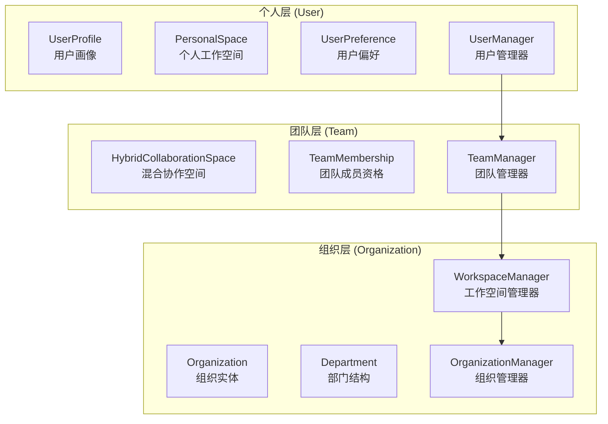
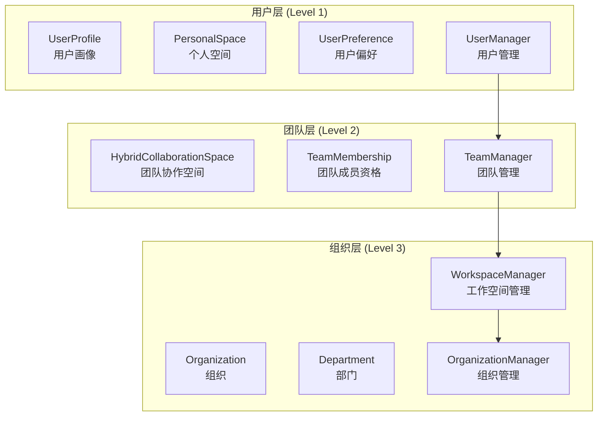
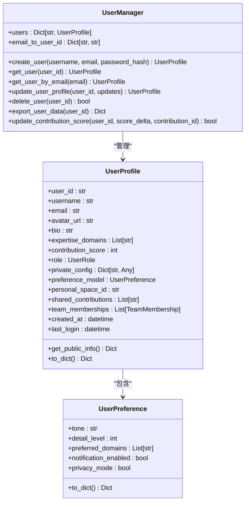
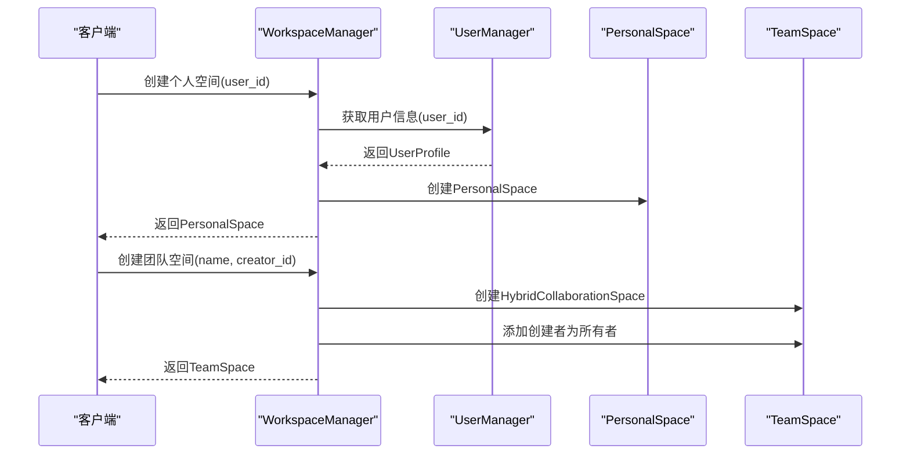
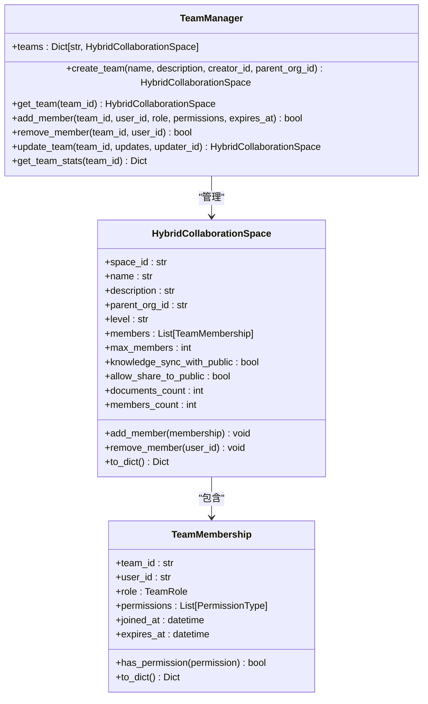
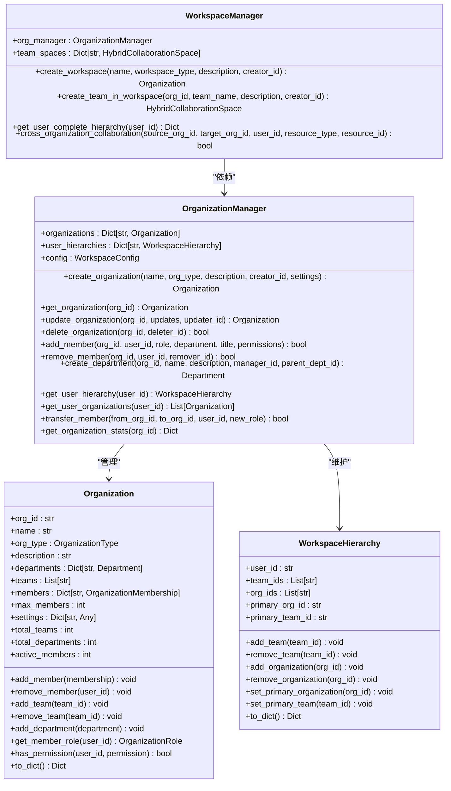
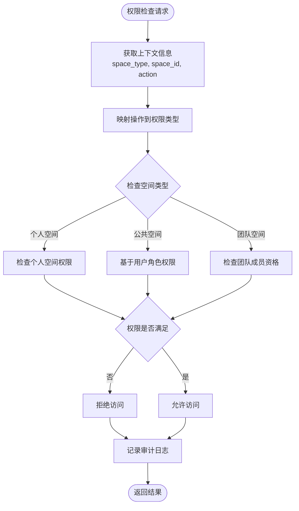
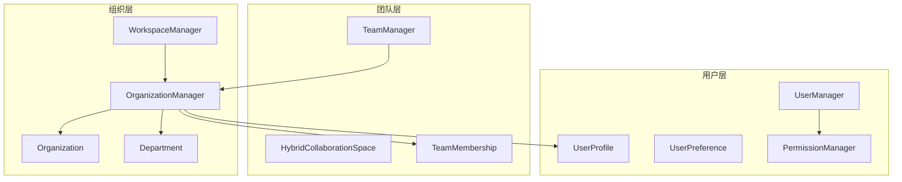

# 三层次用户管理系统

<cite>
**本文档引用的文件**
- [README.md](file://README.md)
- [src/workspace/user/manager.py](file://src/workspace/user/manager.py)
- [src/workspace/user/models.py](file://src/workspace/user/models.py)
- [src/workspace/user/permissions.py](file://src/workspace/user/permissions.py)
- [src/workspace/team/manager.py](file://src/workspace/team/manager.py)
- [src/workspace/team/models.py](file://src/workspace/team/models.py)
- [src/workspace/organization/org_manager.py](file://src/workspace/organization/org_manager.py)
- [src/workspace/organization/org_models.py](file://src/workspace/organization/org_models.py)
- [src/workspace/QUICKREF.md](file://src/workspace/QUICKREF.md)
- [src/workspace/REFACTORING_SUMMARY.md](file://src/workspace/REFACTORING_SUMMARY.md)
- [tests/test_user/test_multi_user_system.py](file://tests/test_user/test_multi_user_system.py)
</cite>

## 目录
1. [简介](#简介)
2. [项目结构](#项目结构)
3. [核心组件](#核心组件)
4. [架构总览](#架构总览)
5. [详细组件分析](#详细组件分析)
6. [依赖关系分析](#依赖关系分析)
7. [性能考虑](#性能考虑)
8. [故障排除指南](#故障排除指南)
9. [结论](#结论)

## 简介
本项目提供了一个完整的三层次用户管理系统，基于 NecoRAG 认知架构，实现了从个人（User）→ 团队（Team）→ 组织（Organization）的完整层级结构。该系统支持用户画像管理、个人工作空间、团队协作、组织架构管理，并集成了 RBAC + ABAC 混合权限控制、GDPR 合规的数据治理、以及跨层级的知识流动与协作能力。

## 项目结构
系统采用分层模块化设计，按层级清晰分离职责：
- **个人层（User Layer）**：用户画像、个人空间、偏好配置、贡献积分
- **团队层（Team Layer）**：团队协作空间、成员管理、权限控制
- **组织层（Organization Layer）**：组织架构、部门管理、跨组织协作

**图表来源**
- [src/workspace/user/manager.py:22-422](file://src/workspace/user/manager.py#L22-L422)
- [src/workspace/team/manager.py:20-143](file://src/workspace/team/manager.py#L20-L143)
- [src/workspace/organization/org_manager.py:31-428](file://src/workspace/organization/org_manager.py#L31-L428)

**章节来源**
- [src/workspace/QUICKREF.md:1-190](file://src/workspace/QUICKREF.md#L1-L190)
- [src/workspace/REFACTORING_SUMMARY.md:12-36](file://src/workspace/REFACTORING_SUMMARY.md#L12-L36)

## 核心组件
系统围绕三大核心组件展开：
- **用户管理器（UserManager）**：负责用户创建、更新、删除、数据导出、贡献积分管理
- **工作空间管理器（WorkspaceManager）**：负责个人空间、公共贡献空间、团队协作空间的创建与管理
- **权限管理器（PermissionManager）**：基于 RBAC + ABAC 的混合权限控制，支持空间级权限检查

**章节来源**
- [src/workspace/user/manager.py:22-148](file://src/workspace/user/manager.py#L22-L148)
- [src/workspace/user/manager.py:150-422](file://src/workspace/user/manager.py#L150-L422)
- [src/workspace/user/permissions.py:29-180](file://src/workspace/user/permissions.py#L29-L180)

## 架构总览
系统采用三层认知架构，每层对应不同的管理职责和权限边界：

**图表来源**
- [src/workspace/user/models.py:153-203](file://src/workspace/user/models.py#L153-L203)
- [src/workspace/team/models.py:56-112](file://src/workspace/team/models.py#L56-L112)
- [src/workspace/organization/org_models.py:97-202](file://src/workspace/organization/org_models.py#L97-L202)

## 详细组件分析

### 用户层组件分析

#### 用户管理器类图

**图表来源**
- [src/workspace/user/manager.py:22-148](file://src/workspace/user/manager.py#L22-L148)
- [src/workspace/user/models.py:153-203](file://src/workspace/user/models.py#L153-L203)
- [src/workspace/user/models.py:46-64](file://src/workspace/user/models.py#L46-L64)

#### 工作空间管理器序列图

**图表来源**
- [src/workspace/user/manager.py:160-177](file://src/workspace/user/manager.py#L160-L177)
- [src/workspace/user/manager.py:286-324](file://src/workspace/user/manager.py#L286-L324)

**章节来源**
- [src/workspace/user/manager.py:22-422](file://src/workspace/user/manager.py#L22-L422)
- [src/workspace/user/models.py:1-336](file://src/workspace/user/models.py#L1-L336)

### 团队层组件分析

#### 团队管理器类图

**图表来源**
- [src/workspace/team/manager.py:20-143](file://src/workspace/team/manager.py#L20-L143)
- [src/workspace/team/models.py:56-112](file://src/workspace/team/models.py#L56-L112)
- [src/workspace/team/models.py:30-53](file://src/workspace/team/models.py#L30-L53)

**章节来源**
- [src/workspace/team/manager.py:20-143](file://src/workspace/team/manager.py#L20-L143)
- [src/workspace/team/models.py:1-112](file://src/workspace/team/models.py#L1-L112)

### 组织层组件分析

#### 组织管理器类图

**图表来源**
- [src/workspace/organization/org_manager.py:31-273](file://src/workspace/organization/org_manager.py#L31-L273)
- [src/workspace/organization/org_manager.py:275-428](file://src/workspace/organization/org_manager.py#L275-L428)
- [src/workspace/organization/org_models.py:97-202](file://src/workspace/organization/org_models.py#L97-L202)
- [src/workspace/organization/org_models.py:205-259](file://src/workspace/organization/org_models.py#L205-L259)

**章节来源**
- [src/workspace/organization/org_manager.py:31-428](file://src/workspace/organization/org_manager.py#L31-L428)
- [src/workspace/organization/org_models.py:1-300](file://src/workspace/organization/org_models.py#L1-L300)

### 权限控制系统分析

#### 权限控制流程图

**图表来源**
- [src/workspace/user/permissions.py:141-180](file://src/workspace/user/permissions.py#L141-L180)
- [src/workspace/user/permissions.py:190-270](file://src/workspace/user/permissions.py#L190-L270)

**章节来源**
- [src/workspace/user/permissions.py:29-368](file://src/workspace/user/permissions.py#L29-L368)

## 依赖关系分析

### 模块依赖图

**图表来源**
- [src/workspace/user/manager.py:12-17](file://src/workspace/user/manager.py#L12-L17)
- [src/workspace/team/manager.py:10-16](file://src/workspace/team/manager.py#L10-L16)
- [src/workspace/organization/org_manager.py:19-27](file://src/workspace/organization/org_manager.py#L19-L27)

### 跨层依赖处理
组织管理器通过动态路径插入的方式导入用户层模型，避免循环依赖：
- 使用 `sys.path.insert` 将工作空间路径添加到模块搜索路径
- 动态导入用户层的数据模型和管理器

**章节来源**
- [src/workspace/organization/org_manager.py:12-27](file://src/workspace/organization/org_manager.py#L12-L27)
- [src/workspace/REFACTORING_SUMMARY.md:160-170](file://src/workspace/REFACTORING_SUMMARY.md#L160-L170)

## 性能考虑
系统在设计时充分考虑了性能优化：
- **延迟初始化**：核心组件采用延迟初始化，减少启动时间
- **缓存配置**：工作空间配置支持缓存 TTL 和启用开关
- **异步操作**：所有管理器方法均支持异步调用
- **内存优化**：个人空间使用 Redis 作为 L1 工作记忆，支持 TTL 自动过期

## 故障排除指南

### 常见问题排查
1. **用户权限不足**
   - 检查用户角色和权限映射
   - 验证空间类型和权限类型匹配
   - 查看审计日志获取详细信息

2. **团队成员管理失败**
   - 确认团队最大成员数限制
   - 检查成员资格的有效期
   - 验证权限检查逻辑

3. **组织架构异常**
   - 检查部门层级关系
   - 验证组织成员角色权限
   - 确认跨组织协作配置

**章节来源**
- [src/workspace/user/permissions.py:141-180](file://src/workspace/user/permissions.py#L141-L180)
- [src/workspace/team/manager.py:94-103](file://src/workspace/team/manager.py#L94-L103)
- [src/workspace/organization/org_manager.py:114-129](file://src/workspace/organization/org_manager.py#L114-L129)

## 结论
三层次用户管理系统通过清晰的分层架构和完善的权限控制，为 NecoRAG 认知架构提供了坚实的用户基础。系统支持从个人到组织的完整协作场景，具备良好的扩展性和可维护性。通过 RBAC + ABAC 混合权限模型和 GDPR 合规设计，确保了系统的安全性与合规性。