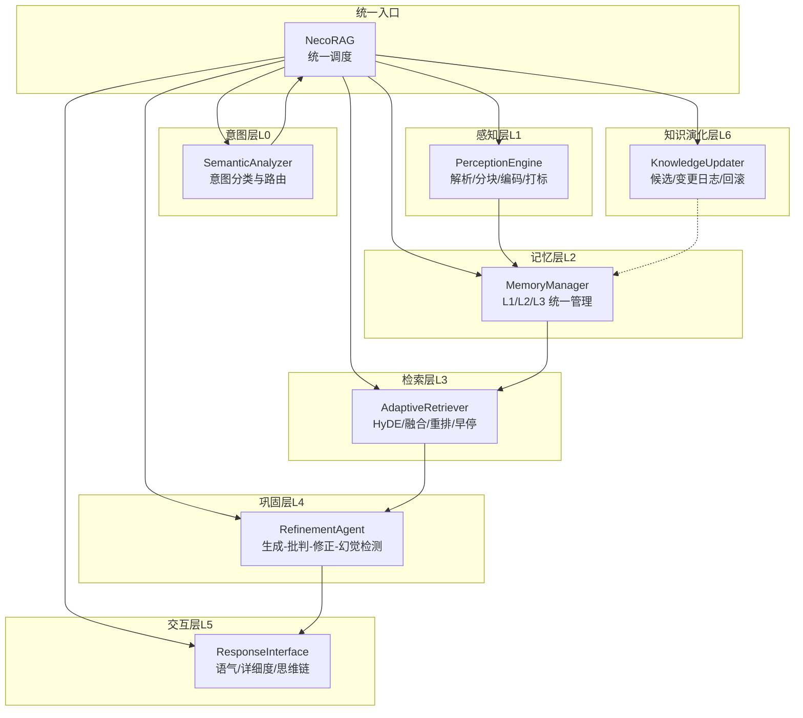
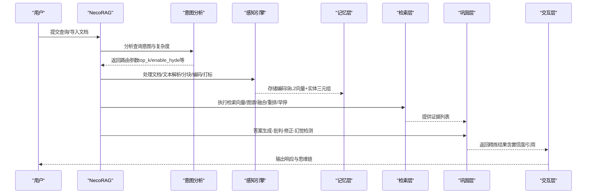
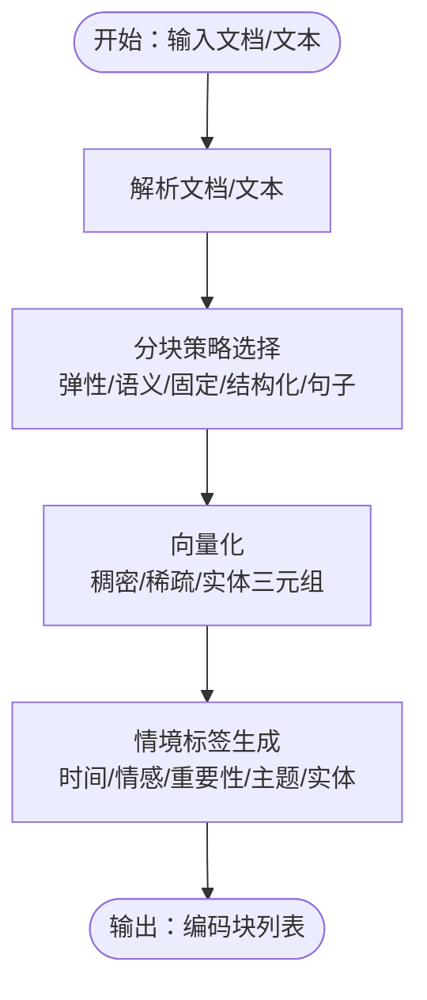
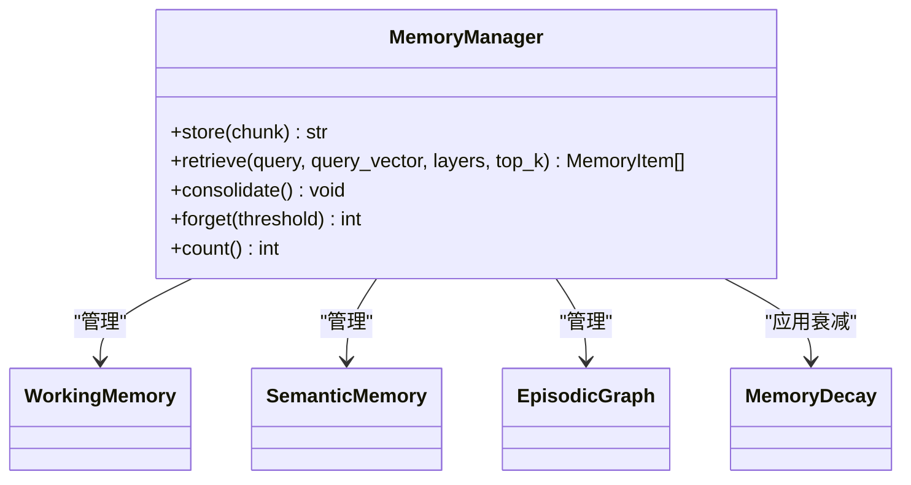
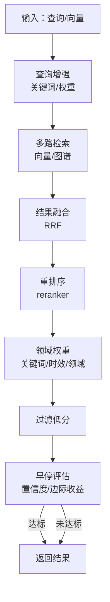
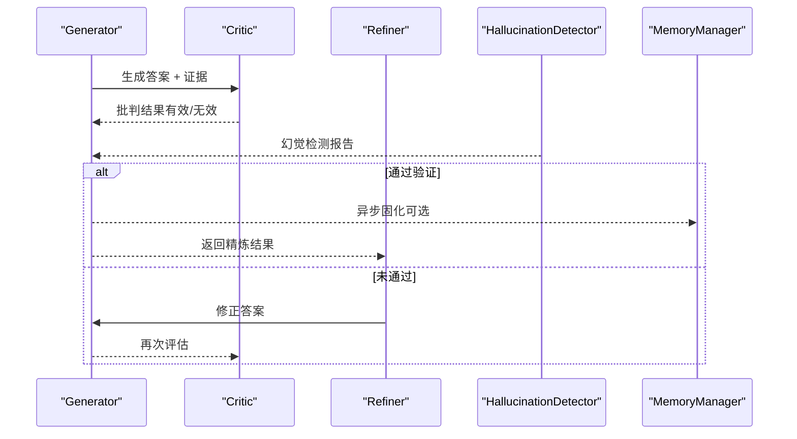
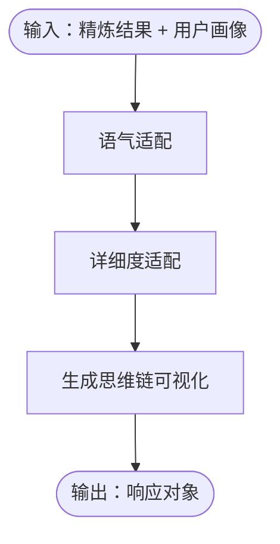
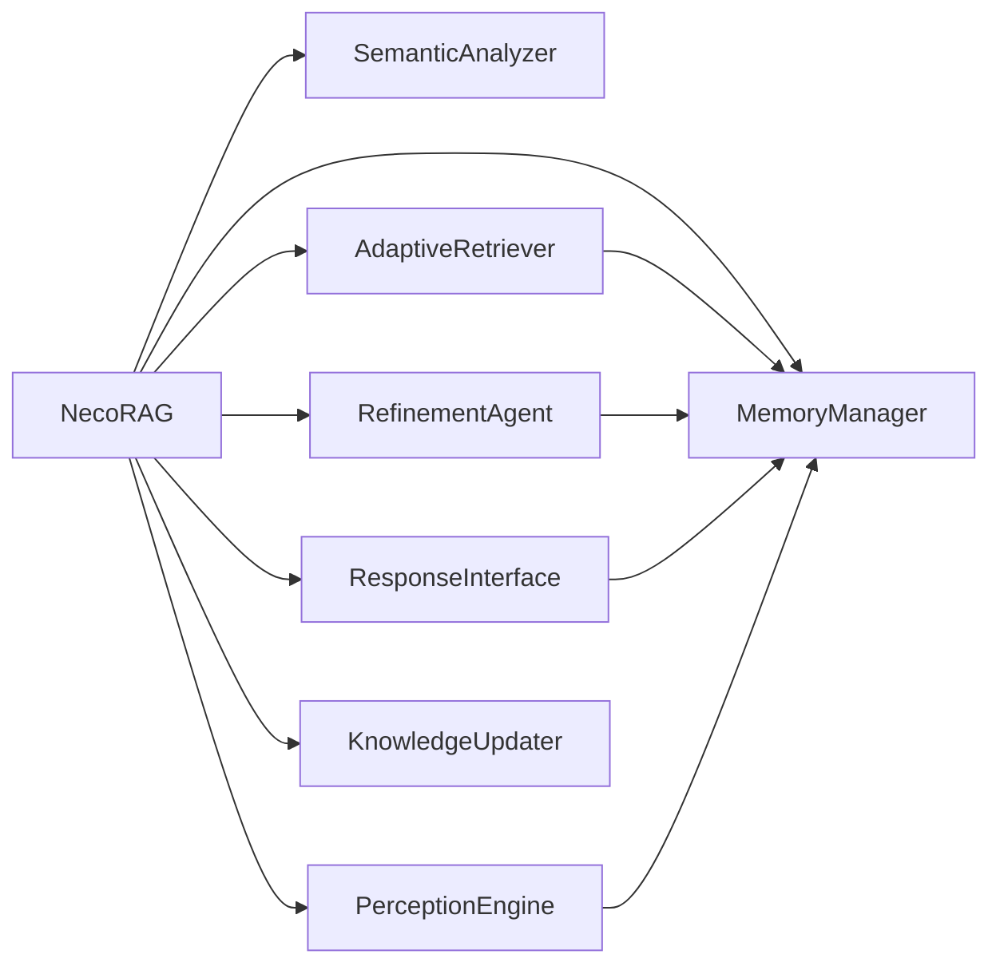

# 五层认知架构

<cite>
**本文引用的文件**
- [README.md](file://README.md)
- [src/necorag.py](file://src/necorag.py)
- [src/core/base.py](file://src/core/base.py)
- [src/core/protocols.py](file://src/core/protocols.py)
- [src/perception/engine.py](file://src/perception/engine.py)
- [src/perception/__init__.py](file://src/perception/__init__.py)
- [src/memory/manager.py](file://src/memory/manager.py)
- [src/memory/__init__.py](file://src/memory/__init__.py)
- [src/retrieval/retriever.py](file://src/retrieval/retriever.py)
- [src/retrieval/__init__.py](file://src/retrieval/__init__.py)
- [src/refinement/agent.py](file://src/refinement/agent.py)
- [src/refinement/__init__.py](file://src/refinement/__init__.py)
- [src/response/interface.py](file://src/response/interface.py)
- [src/response/__init__.py](file://src/response/__init__.py)
- [src/intent/classifier.py](file://src/intent/classifier.py)
- [src/knowledge_evolution/updater.py](file://src/knowledge_evolution/updater.py)
</cite>

## 目录
1. [简介](#简介)
2. [项目结构](#项目结构)
3. [核心组件](#核心组件)
4. [架构总览](#架构总览)
5. [详细组件分析](#详细组件分析)
6. [依赖分析](#依赖分析)
7. [性能考量](#性能考量)
8. [故障排查指南](#故障排查指南)
9. [结论](#结论)
10. [附录](#附录)

## 简介
本文件面向 NecoRAG 五层认知架构，系统阐述从感知层（L1）到交互层（L5）的分层设计、数据流与组件协作关系。同时结合类脑记忆理论，解释工作记忆（L1）、语义记忆（L2）、情景图谱（L3）在系统中的映射与协同；并给出各层的输入输出规范、处理逻辑与性能要点，帮助读者快速理解与高效使用。

## 项目结构
NecoRAG 采用“五层认知”分层架构，围绕统一入口类 NecoRAG 提供文档导入、智能检索、答案精炼与响应生成的完整流程。核心模块包括：
- 感知层（L1）：PerceptionEngine，负责文档解析、分块、向量化与情境标签生成
- 记忆层（L2）：MemoryManager，统一管理 L1/L2/L3 三层记忆与动态权重衰减
- 检索层（L3）：AdaptiveRetriever，混合检索、重排序与早停机制
- 巩固层（L4）：RefinementAgent，答案生成-批判-修正闭环与幻觉检测
- 交互层（L5）：ResponseInterface，情境自适应生成与思维链可视化
- 意图层（L0）：SemanticAnalyzer（意图分类与路由），贯穿 L1-L5 的参数调节
- 知识演化层（L6）：KnowledgeUpdater 等，知识的实时/批量更新与健康度管理

**图表来源**
- [src/necorag.py:102-121](file://src/necorag.py#L102-L121)
- [src/perception/engine.py:15-71](file://src/perception/engine.py#L15-L71)
- [src/memory/manager.py:16-47](file://src/memory/manager.py#L16-L47)
- [src/retrieval/retriever.py:122-164](file://src/retrieval/retriever.py#L122-L164)
- [src/refinement/agent.py:16-60](file://src/refinement/agent.py#L16-L60)
- [src/response/interface.py:16-54](file://src/response/interface.py#L16-L54)
- [src/intent/classifier.py:19-58](file://src/intent/classifier.py#L19-L58)
- [src/knowledge_evolution/updater.py:23-78](file://src/knowledge_evolution/updater.py#L23-L78)

**章节来源**
- [README.md:35-85](file://README.md#L35-L85)
- [src/necorag.py:102-121](file://src/necorag.py#L102-L121)

## 核心组件
- 统一入口 NecoRAG：负责组件初始化、文档导入、查询处理与知识演化回调
- 意图分析 SemanticAnalyzer：对查询进行意图分类与路由，动态调整检索参数
- 感知引擎 PerceptionEngine：文档解析、分块策略、向量化与情境标签生成
- 记忆管理 MemoryManager：三层记忆统一管理与动态权重衰减
- 自适应检索 AdaptiveRetriever：HyDE 增强、多路检索、融合重排与早停
- 精炼代理 RefinementAgent：生成-批判-修正闭环与幻觉检测
- 响应接口 ResponseInterface：语气/详细度适配与思维链可视化
- 知识更新 KnowledgeUpdater：候选池、变更日志、回滚与查询驱动积累

**章节来源**
- [src/necorag.py:61-121](file://src/necorag.py#L61-L121)
- [src/intent/classifier.py:19-58](file://src/intent/classifier.py#L19-L58)
- [src/perception/engine.py:15-71](file://src/perception/engine.py#L15-L71)
- [src/memory/manager.py:16-47](file://src/memory/manager.py#L16-L47)
- [src/retrieval/retriever.py:122-164](file://src/retrieval/retriever.py#L122-L164)
- [src/refinement/agent.py:16-60](file://src/refinement/agent.py#L16-L60)
- [src/response/interface.py:16-54](file://src/response/interface.py#L16-L54)
- [src/knowledge_evolution/updater.py:23-78](file://src/knowledge_evolution/updater.py#L23-L78)

## 架构总览
五层架构自下而上形成“感知-记忆-检索-巩固-交互”的完整认知闭环。统一入口 NecoRAG 协调各层，意图分析根据查询复杂度与领域特征动态调整检索策略；感知层产出多模态编码与情境标签；记忆层提供 L1/L2/L3 分层存储与衰减；检索层执行混合检索与早停；巩固层进行答案质量控制与知识固化；交互层输出情境化响应与思维链。

**图表来源**
- [src/necorag.py:328-422](file://src/necorag.py#L328-L422)
- [src/intent/classifier.py:84-205](file://src/intent/classifier.py#L84-L205)
- [src/perception/engine.py:84-136](file://src/perception/engine.py#L84-L136)
- [src/memory/manager.py:48-112](file://src/memory/manager.py#L48-L112)
- [src/retrieval/retriever.py:177-253](file://src/retrieval/retriever.py#L177-L253)
- [src/refinement/agent.py:61-128](file://src/refinement/agent.py#L61-L128)
- [src/response/interface.py:55-132](file://src/response/interface.py#L55-L132)

## 详细组件分析

### 感知层（L1）：PerceptionEngine
- 核心职责
  - 文档解析：支持多种格式，抽取结构化内容
  - 文本分块：弹性/语义/固定/结构化/句子级策略
  - 向量化：稠密向量、稀疏向量、实体三元组
  - 情境标签：时间、情感、重要性、主题、实体
- 输入输出
  - 输入：文件路径或纯文本、元数据
  - 输出：编码块列表（包含稠密/稀疏向量、实体、情境标签、元数据）
- 设计要点
  - 统一入口 process_file/process_text，内部调用解析-分块-编码-打标流水线
  - 支持多种分块策略，便于在不同场景下平衡语义完整性与检索效率
- 性能考虑
  - 向量化与标签生成可并行化；分块策略影响后续检索粒度与召回

**图表来源**
- [src/perception/engine.py:84-136](file://src/perception/engine.py#L84-L136)

**章节来源**
- [src/perception/engine.py:15-174](file://src/perception/engine.py#L15-L174)
- [src/perception/__init__.py:1-23](file://src/perception/__init__.py#L1-L23)

### 记忆层（L2）：MemoryManager
- 核心职责
  - 统一管理三层记忆：L1 工作记忆（Redis）、L2 语义记忆（Qdrant/Milvus）、L3 情景图谱（Neo4j/NebulaGraph）
  - 动态权重衰减：模拟生物记忆巩固与遗忘
  - 记忆巩固与主动遗忘：周期性归档低权重记忆
- 输入输出
  - 存储：EncodedChunk → MemoryItem（L2向量+元数据；L3实体/关系）
  - 检索：Query/QueryVector → MemoryItem 列表（强化访问权重）
  - 工具：consolidate()/forget() 控制记忆生命周期
- 类脑映射
  - L1 对应工作记忆（短期、易失、高通透）
  - L2 对应语义记忆（长期、向量检索、模糊匹配）
  - L3 对应情景图谱（实体关系、多跳推理）
- 性能考虑
  - 向量检索与图谱遍历的代价差异较大，需结合查询类型选择检索路径

**图表来源**
- [src/memory/manager.py:16-195](file://src/memory/manager.py#L16-L195)

**章节来源**
- [src/memory/manager.py:16-195](file://src/memory/manager.py#L16-L195)
- [src/memory/__init__.py:1-22](file://src/memory/__init__.py#L1-L22)

### 检索层（L3）：AdaptiveRetriever
- 核心职责
  - 多路检索：向量检索 + 图谱检索（实体多跳）
  - HyDE 增强：生成假设文档提升检索质量
  - 结果融合：RRF（Reciprocal Rank Fusion）
  - 重排序：BGE-Reranker-v2
  - 早停机制：基于置信度阈值与边际收益
  - 领域权重：关键词/时效/领域加权
- 输入输出
  - 输入：Query/QueryVector、top_k、min_score、是否应用领域权重
  - 输出：RetrievalResult 列表（含分数、来源、检索路径）
- 设计要点
  - EarlyTerminationController：阈值与边际收益双重早停
  - QueryRelevanceEnhancer：识别领域关键词并增强查询
  - FusionStrategy：多源结果融合提升稳健性
- 性能考虑
  - 早停显著减少无效检索；融合与重排成本可控；图谱检索适合实体密集场景

**图表来源**
- [src/retrieval/retriever.py:177-253](file://src/retrieval/retriever.py#L177-L253)

**章节来源**
- [src/retrieval/retriever.py:122-440](file://src/retrieval/retriever.py#L122-L440)
- [src/retrieval/__init__.py:1-19](file://src/retrieval/__init__.py#L1-L19)

### 巩固层（L4）：RefinementAgent
- 核心职责
  - 生成-批判-修正闭环：Generator → Critic → Refiner
  - 幻觉检测：事实一致性、证据支撑度、逻辑连贯性
  - 异步知识固化与记忆修剪：与 MemoryManager 协同
- 输入输出
  - 输入：Query + Evidence
  - 输出：RefinementResult（答案、置信度、引用、迭代次数、幻觉报告）
- 设计要点
  - 多轮迭代：若未通过验证则修正，直至达标或达到最大迭代
  - 幻觉惩罚：降低置信度，避免错误传播
- 性能考虑
  - LLM 调用成本较高，可通过早停与迭代上限控制

**图表来源**
- [src/refinement/agent.py:61-128](file://src/refinement/agent.py#L61-L128)

**章节来源**
- [src/refinement/agent.py:16-151](file://src/refinement/agent.py#L16-L151)
- [src/refinement/__init__.py:1-26](file://src/refinement/__init__.py#L1-L26)

### 交互层（L5）：ResponseInterface
- 核心职责
  - 用户画像适配：专业水平、交互风格、偏好领域
  - 语气与详细度适配：四档详细程度
  - 思维链可视化：检索路径、证据来源、推理过程
- 输入输出
  - 输入：RefinementResult + session_id/tone/detail_level
  - 输出：Response（含内容、思维链、引用、元数据）
- 设计要点
  - 基于用户画像动态确定详细程度
  - 将检索路径与证据来源转化为可解释的思维链文本
- 性能考虑
  - 适配与可视化为轻量计算，主要开销在生成环节

**图表来源**
- [src/response/interface.py:55-132](file://src/response/interface.py#L55-L132)

**章节来源**
- [src/response/interface.py:16-224](file://src/response/interface.py#L16-L224)
- [src/response/__init__.py:1-23](file://src/response/__init__.py#L1-L23)

### 意图层（L0）与知识演化层（L6）
- 意图分析（L0）：基于规则/ML的意图分类，输出主/次要意图、关键词与实体，用于动态调整检索参数
- 知识演化（L6）：候选池管理、变更日志、回滚、查询驱动积累、健康度报告与调度

**章节来源**
- [src/intent/classifier.py:19-487](file://src/intent/classifier.py#L19-L487)
- [src/knowledge_evolution/updater.py:23-800](file://src/knowledge_evolution/updater.py#L23-L800)

## 依赖分析
- 组件耦合
  - NecoRAG 作为统一入口，依赖各层组件并协调其生命周期
  - 检索层依赖记忆层提供的 L2/L3 存储
  - 巩固层依赖记忆层进行知识固化与修剪
  - 交互层依赖记忆层与巩固层的结果
  - 意图层贯穿全链路，影响检索参数与用户体验
- 外部依赖
  - 向量数据库（Qdrant/Milvus）、图数据库（Neo4j/NebulaGraph）、缓存（Redis）
  - LLM 客户端（Mock/可扩展）

**图表来源**
- [src/necorag.py:102-121](file://src/necorag.py#L102-L121)

**章节来源**
- [src/necorag.py:102-121](file://src/necorag.py#L102-L121)

## 性能考量
- 检索性能
  - 早停机制显著降低无效检索成本，提升首字延迟
  - 多路检索与融合重排在保证质量的同时控制召回范围
- 记忆与衰减
  - 动态权重衰减减少无效存储，提升检索效率
  - 定期巩固与主动遗忘保持知识库新鲜度
- 生成与适配
  - 交互层的语气/详细度适配为轻量计算，主要成本在 LLM 生成
  - 可通过迭代上限与幻觉检测避免无效生成

[本节为通用性能讨论，无需列出具体文件来源]

## 故障排查指南
- 检索无结果或命中率低
  - 检查 EarlyTerminationController 阈值设置与查询增强是否生效
  - 确认领域权重与重排序是否开启
- 答案质量不稳定
  - 调整巩固层迭代上限与幻觉检测阈值
  - 检查证据来源数量与质量
- 记忆膨胀或检索变慢
  - 启用记忆巩固与主动遗忘，调整衰减参数
  - 优化分块策略与向量维度
- 响应不符合预期语气/详细度
  - 检查用户画像与偏好设置
  - 调整详细度映射与语气适配策略

**章节来源**
- [src/retrieval/retriever.py:30-120](file://src/retrieval/retriever.py#L30-L120)
- [src/refinement/agent.py:27-60](file://src/refinement/agent.py#L27-L60)
- [src/memory/manager.py:149-185](file://src/memory/manager.py#L149-L185)
- [src/response/interface.py:134-165](file://src/response/interface.py#L134-L165)

## 结论
NecoRAG 通过五层认知架构，将类脑记忆理论与现代检索增强技术深度融合：感知层负责高质量编码与情境标记，记忆层提供分层存储与动态衰减，检索层实现混合检索与早停，巩固层保障答案质量与知识固化，交互层提供情境化与可解释输出。配合意图分析与知识演化机制，系统在准确性、效率与可解释性之间取得良好平衡，适用于复杂知识问答与持续演化的智能应用。

[本节为总结性内容，无需列出具体文件来源]

## 附录
- 统一数据协议与枚举
  - 文档/分块/向量/记忆/查询/响应/用户画像等统一数据结构
  - 记忆层级（L1/L2/L3）、检索来源、响应语气、详细程度、意图类型等枚举

**章节来源**
- [src/core/protocols.py:14-290](file://src/core/protocols.py#L14-L290)