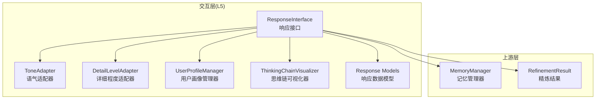
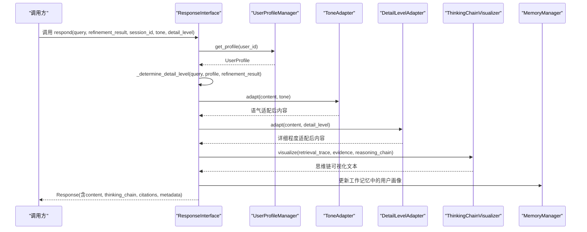
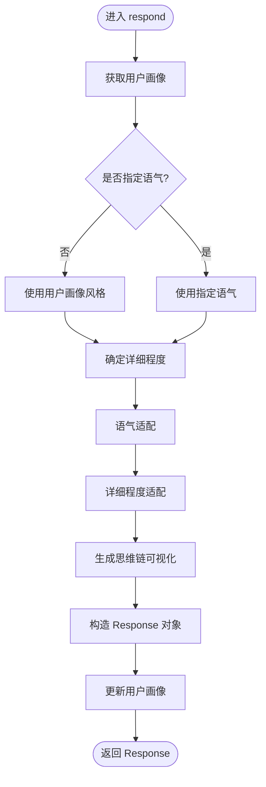
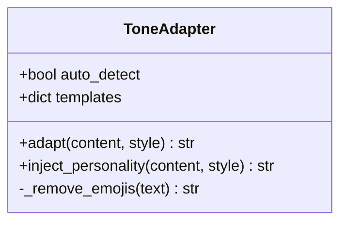
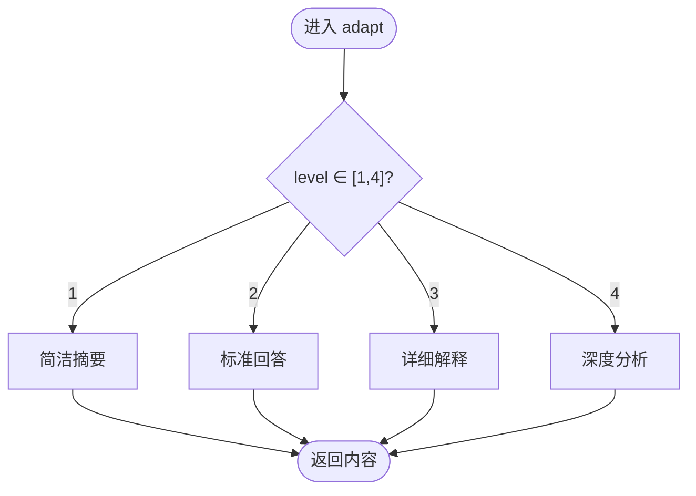
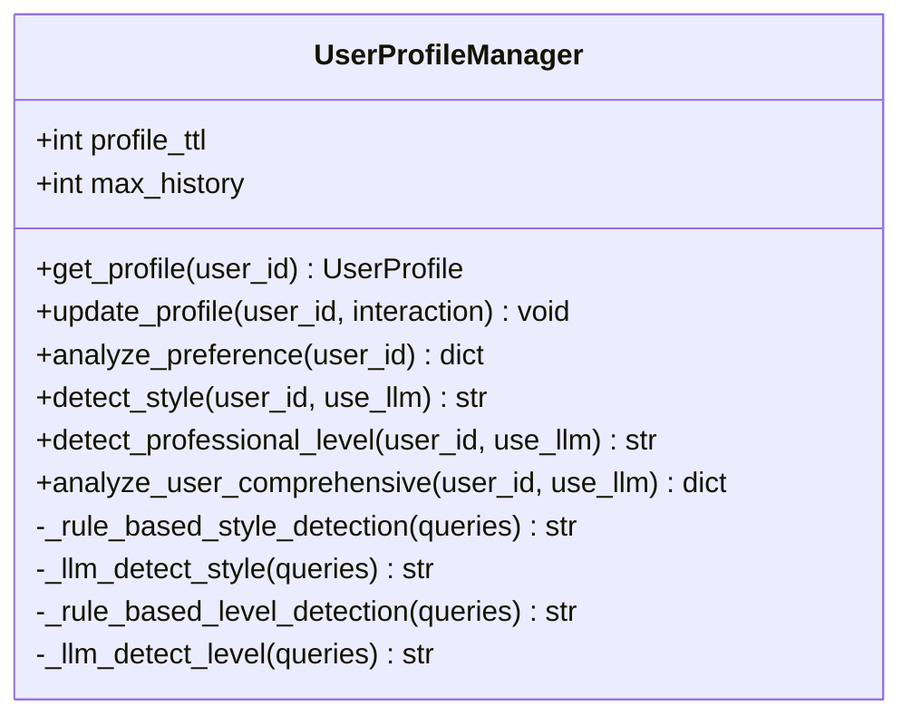
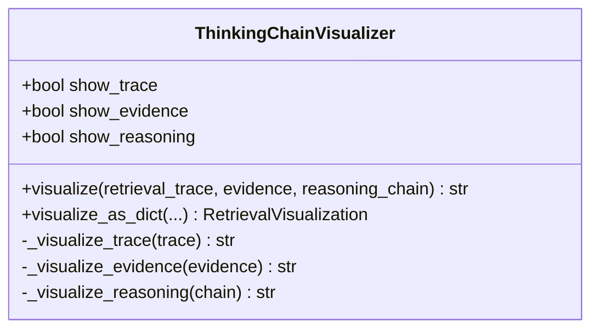
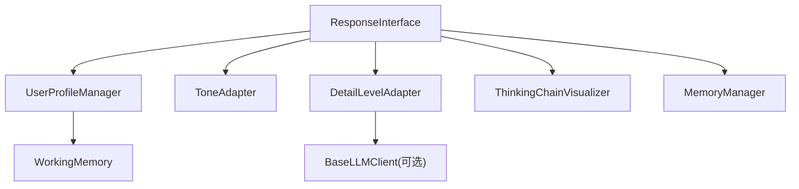

# 交互层 (L5)

<cite>
**本文档引用的文件**
- [src/response/interface.py](file://src/response/interface.py)
- [src/response/tone_adapter.py](file://src/response/tone_adapter.py)
- [src/response/detail_adapter.py](file://src/response/detail_adapter.py)
- [src/response/profile_manager.py](file://src/response/profile_manager.py)
- [src/response/visualizer.py](file://src/response/visualizer.py)
- [src/response/models.py](file://src/response/models.py)
- [src/refinement/models.py](file://src/refinement/models.py)
- [src/memory/manager.py](file://src/memory/manager.py)
- [src/core/protocols.py](file://src/core/protocols.py)
- [src/necorag.py](file://src/necorag.py)
- [example/example_usage.py](file://example/example_usage.py)
- [src/dashboard/static/index.html](file://src/dashboard/static/index.html)
</cite>

## 目录
1. [简介](#简介)
2. [项目结构](#项目结构)
3. [核心组件](#核心组件)
4. [架构总览](#架构总览)
5. [详细组件分析](#详细组件分析)
6. [依赖关系分析](#依赖关系分析)
7. [性能考量](#性能考量)
8. [故障排查指南](#故障排查指南)
9. [结论](#结论)
10. [附录](#附录)

## 简介
交互层（L5）是 NecoRAG 的最终输出层，负责将上游精炼结果转化为面向用户的可解释、可感知的响应。其设计理念围绕“情境自适应”展开：通过语气适配器根据用户画像调整回答风格，通过详细程度控制器平衡信息丰富度与可读性，通过思维链可视化展示推理过程，通过用户画像管理实现个性化交互。该层还提供多模态输出支持（文本为主），并通过统一的数据协议保证与其他层的兼容性。

## 项目结构
交互层位于 src/response 目录，包含响应接口、语气适配器、详细程度适配器、用户画像管理器、思维链可视化器以及相关数据模型。整体采用“接口 + 子组件”的组合设计，便于扩展与替换。

图表来源
- [src/response/interface.py:20-140](file://src/response/interface.py#L20-L140)
- [src/response/tone_adapter.py:8-76](file://src/response/tone_adapter.py#L8-L76)
- [src/response/detail_adapter.py:18-94](file://src/response/detail_adapter.py#L18-L94)
- [src/response/profile_manager.py:20-141](file://src/response/profile_manager.py#L20-L141)
- [src/response/visualizer.py:9-71](file://src/response/visualizer.py#L9-L71)
- [src/response/models.py:13-31](file://src/response/models.py#L13-L31)
- [src/memory/manager.py:20-51](file://src/memory/manager.py#L20-L51)
- [src/refinement/models.py:38-47](file://src/refinement/models.py#L38-L47)

章节来源
- [src/response/interface.py:1-232](file://src/response/interface.py#L1-L232)
- [src/response/__init__.py:1-28](file://src/response/__init__.py#L1-L28)

## 核心组件
- 响应接口（ResponseInterface）：协调各子组件，生成最终响应，并维护用户画像更新与偏好分析。
- 语气适配器（ToneAdapter）：支持正式、友好、幽默三种风格，注入连接词与个性化元素，控制表情符号。
- 详细程度适配器（DetailLevelAdapter）：支持简洁摘要、标准回答、详细解释、深度分析四个层级；可退化为规则处理。
- 用户画像管理器（UserProfileManager）：检测用户专业水平与交互风格，跟踪查询历史，支持 LLM 增强与规则退化。
- 思维链可视化器（ThinkingChainVisualizer）：将检索路径、证据来源、推理过程结构化展示。
- 响应数据模型：统一响应结构，包含内容、置信度、引用、思维链等。

章节来源
- [src/response/interface.py:20-140](file://src/response/interface.py#L20-L140)
- [src/response/tone_adapter.py:8-138](file://src/response/tone_adapter.py#L8-L138)
- [src/response/detail_adapter.py:18-417](file://src/response/detail_adapter.py#L18-L417)
- [src/response/profile_manager.py:20-505](file://src/response/profile_manager.py#L20-L505)
- [src/response/visualizer.py:9-150](file://src/response/visualizer.py#L9-L150)
- [src/response/models.py:13-31](file://src/response/models.py#L13-L31)

## 架构总览
交互层在 NecoRAG 中承担“情境自适应生成与可解释性输出”的职责。其控制流如下：
- 输入：查询文本、精炼结果（包含答案、置信度、引用、迭代次数等）、可选的会话标识。
- 处理：获取用户画像 → 确定语气风格 → 确定详细程度 → 语气适配 → 详细程度适配 → 生成思维链可视化 → 构造响应对象。
- 输出：统一响应对象，包含内容、思维链、引用、元数据等。

图表来源
- [src/response/interface.py:59-140](file://src/response/interface.py#L59-L140)
- [src/response/profile_manager.py:115-174](file://src/response/profile_manager.py#L115-L174)
- [src/response/tone_adapter.py:49-76](file://src/response/tone_adapter.py#L49-L76)
- [src/response/detail_adapter.py:64-94](file://src/response/detail_adapter.py#L64-L94)
- [src/response/visualizer.py:37-71](file://src/response/visualizer.py#L37-L71)
- [src/memory/manager.py:124-173](file://src/memory/manager.py#L124-L173)

## 详细组件分析

### 响应接口（ResponseInterface）
- 职责：协调子组件，生成最终响应；根据用户画像与精炼结果动态确定语气与详细程度；生成思维链可视化；更新用户画像。
- 关键流程：
  - 获取用户画像：若无 session_id，默认匿名用户。
  - 确定语气：若未指定，则使用用户画像中的交互风格。
  - 确定详细程度：基于用户专业水平与精炼迭代次数综合判定。
  - 适配内容：先语气适配，再详细程度适配。
  - 生成思维链：基于查询、引用数量、置信度、迭代次数、幻觉检测结果构建。
  - 构造响应：填充内容、思维链、引用、元数据（置信度、迭代次数、用户ID）。
  - 更新画像：记录交互记录，写回工作记忆。
- 交互参数：
  - tone：可选，覆盖用户画像风格。
  - detail_level：可选，覆盖自动推断级别。
  - session_id：用于画像与偏好分析。
- 偏好分析：提供 get_user_preference，返回用户画像中的交互风格与专业水平，以及查询历史关键词统计。

图表来源
- [src/response/interface.py:59-140](file://src/response/interface.py#L59-L140)
- [src/response/interface.py:142-174](file://src/response/interface.py#L142-L174)
- [src/response/interface.py:175-220](file://src/response/interface.py#L175-L220)

章节来源
- [src/response/interface.py:20-140](file://src/response/interface.py#L20-L140)
- [src/response/interface.py:221-232](file://src/response/interface.py#L221-L232)

### 语气适配器（ToneAdapter）
- 支持风格：正式（formal）、友好（friendly）、幽默（humorous）。
- 适配机制：
  - 前缀/后缀注入：根据风格添加修饰语。
  - 连接词注入：在段落之间插入连接词，增强连贯性。
  - 表情符号控制：正式风格移除表情符号，其他风格保留。
- 设计要点：模板驱动，易于扩展新的风格；连接词注入提升阅读流畅度。

图表来源
- [src/response/tone_adapter.py:8-138](file://src/response/tone_adapter.py#L8-L138)

章节来源
- [src/response/tone_adapter.py:8-138](file://src/response/tone_adapter.py#L8-L138)

### 详细程度适配器（DetailLevelAdapter）
- 四级适配：
  - Level 1：简洁摘要（1-2句话）。
  - Level 2：标准回答（1段要点）。
  - Level 3：详细解释（多段落+案例）。
  - Level 4：深度分析（完整报告）。
- LLM 增强与退化：
  - 若存在 LLM 客户端，使用 LLM 生成摘要、扩展、深度分析。
  - 若 LLM 不可用，退化为规则处理（提取首句、添加结构化框架）。
- 自动调整：支持根据内容长度与查询复杂度自动选择级别。

图表来源
- [src/response/detail_adapter.py:64-94](file://src/response/detail_adapter.py#L64-L94)
- [src/response/detail_adapter.py:95-168](file://src/response/detail_adapter.py#L95-L168)
- [src/response/detail_adapter.py:169-195](file://src/response/detail_adapter.py#L169-L195)
- [src/response/detail_adapter.py:196-273](file://src/response/detail_adapter.py#L196-L273)
- [src/response/detail_adapter.py:274-372](file://src/response/detail_adapter.py#L274-L372)

章节来源
- [src/response/detail_adapter.py:18-417](file://src/response/detail_adapter.py#L18-L417)

### 用户画像管理器（UserProfileManager）
- 功能：
  - 获取/更新用户画像：从工作记忆加载，缓存于内存，更新时写回。
  - 专业水平检测：基于关键词匹配与查询长度/复杂度，支持 LLM 与规则两种模式。
  - 交互风格检测：基于查询模式（简洁/详细/技术/通俗）与长度统计，支持 LLM 与规则两种模式。
  - 偏好分析：统计查询历史关键词，返回前 N 个高频词与统计信息。
- 设计要点：支持 LLM 增强与规则退化，避免强依赖外部模型；提供默认风格与默认级别保障可用性。

图表来源
- [src/response/profile_manager.py:20-505](file://src/response/profile_manager.py#L20-L505)

章节来源
- [src/response/profile_manager.py:20-505](file://src/response/profile_manager.py#L20-L505)

### 思维链可视化器（ThinkingChainVisualizer）
- 展示内容：
  - 检索路径：查询理解 → 语义检索 → 引用数量等。
  - 证据来源：证据 ID 与相关度。
  - 推理过程：置信度、迭代次数、幻觉检测结果等。
- 可配置项：是否显示检索路径、证据来源、推理过程。
- 输出格式：结构化文本；同时提供结构化对象（RetrievalVisualization）以便前端渲染。

图表来源
- [src/response/visualizer.py:9-150](file://src/response/visualizer.py#L9-L150)

章节来源
- [src/response/visualizer.py:9-150](file://src/response/visualizer.py#L9-L150)

### 响应数据模型与统一协议
- 统一响应结构：包含响应 ID、查询 ID、内容、置信度、来源、思维链、语气、详细程度、引用、元数据等。
- 用户画像与枚举：统一的 ResponseTone（专业/友好/幽默）、DetailLevel（简洁/标准/详细/全面）等枚举类型，确保跨层一致性。
- 交互记录：用于记录每次交互的查询、响应、满意度等，支持画像更新与偏好分析。

章节来源
- [src/response/models.py:13-31](file://src/response/models.py#L13-L31)
- [src/core/protocols.py:51-64](file://src/core/protocols.py#L51-L64)
- [src/core/protocols.py:265-278](file://src/core/protocols.py#L265-L278)

## 依赖关系分析
- ResponseInterface 依赖：
  - MemoryManager：获取工作记忆上下文，写回用户画像。
  - UserProfileManager：获取/更新用户画像。
  - ToneAdapter：语气适配。
  - DetailLevelAdapter：详细程度适配。
  - ThinkingChainVisualizer：思维链可视化。
  - RefinementResult：精炼结果（答案、置信度、引用、迭代次数、幻觉报告）。
- UserProfileManager 依赖：
  - 工作记忆（WorkingMemory）：上下文读取与写入。
  - 可选 LLM 客户端：用于高级检测（风格与专业水平）。
- DetailLevelAdapter 与 ThinkingChainVisualizer 依赖：
  - 无外部依赖，纯逻辑组件。

图表来源
- [src/response/interface.py:31-58](file://src/response/interface.py#L31-L58)
- [src/response/profile_manager.py:77-96](file://src/response/profile_manager.py#L77-L96)
- [src/response/detail_adapter.py:35-48](file://src/response/detail_adapter.py#L35-L48)
- [src/memory/manager.py:44-46](file://src/memory/manager.py#L44-L46)

章节来源
- [src/response/interface.py:31-58](file://src/response/interface.py#L31-L58)
- [src/response/profile_manager.py:77-96](file://src/response/profile_manager.py#L77-L96)
- [src/response/detail_adapter.py:35-48](file://src/response/detail_adapter.py#L35-L48)
- [src/memory/manager.py:44-46](file://src/memory/manager.py#L44-L46)

## 性能考量
- 适配器退化策略：当 LLM 不可用时，详细程度适配器采用规则处理（如提取首句、添加结构化框架），避免阻塞主流程。
- 缓存与上下文：用户画像在内存中缓存，减少重复计算；工作记忆作为上下文存储，降低 IO 开销。
- 可视化开销：思维链可视化为纯文本拼接，开销极低；结构化对象仅在需要时生成。
- 日志与可观测性：接口层记录关键事件（开始/结束、风格/详细程度、更新画像），便于性能监控与问题定位。

## 故障排查指南
- 语气适配异常：
  - 现象：表情符号未按预期移除或保留。
  - 排查：确认风格模板中 avoid_emojis 标志；检查表情符号范围映射。
- 详细程度适配异常：
  - 现象：摘要过短或过长，扩展无效。
  - 排查：检查内容长度阈值；确认 LLM 客户端可用性；查看退化逻辑是否触发。
- 用户画像不更新：
  - 现象：偏好分析结果未变化。
  - 排查：确认交互记录已写回工作记忆；检查最大历史长度限制；确认 session_id 正确传递。
- 思维链为空：
  - 现象：思维链可视化为空。
  - 排查：确认精炼结果包含置信度、迭代次数、引用数量；检查可视化开关（show_trace/show_evidence/show_reasoning）。

章节来源
- [src/response/tone_adapter.py:111-138](file://src/response/tone_adapter.py#L111-L138)
- [src/response/detail_adapter.py:117-145](file://src/response/detail_adapter.py#L117-L145)
- [src/response/profile_manager.py:143-174](file://src/response/profile_manager.py#L143-L174)
- [src/response/visualizer.py:37-71](file://src/response/visualizer.py#L37-L71)

## 结论
交互层（L5）通过“情境自适应”实现了高度个性化的响应生成：语气适配器确保表达风格贴合用户偏好，详细程度适配器在信息密度与可读性之间取得平衡，思维链可视化增强了可解释性，用户画像管理器提供了持续学习与优化的基础。整体设计兼顾灵活性与稳定性，既支持 LLM 增强，也具备规则退化能力，适合在不同部署环境下灵活使用。

## 附录

### 响应生成流程（从证据整合到最终输出）
- 输入：查询文本、精炼结果（答案、置信度、引用、迭代次数、幻觉报告）。
- 步骤：
  1) 获取用户画像并确定语气风格。
  2) 基于专业水平与迭代次数确定详细程度。
  3) 语气适配与详细程度适配。
  4) 生成思维链可视化。
  5) 构造统一响应对象并更新用户画像。
- 输出：包含内容、思维链、引用、元数据的响应对象。

章节来源
- [src/response/interface.py:59-140](file://src/response/interface.py#L59-L140)
- [src/response/interface.py:175-220](file://src/response/interface.py#L175-L220)

### 交互参数配置与个性化设置
- 仪表盘配置项（默认语气、默认详细程度）：
  - 默认语气：专业严谨、亲切友好、幽默轻松。
  - 默认详细程度：简洁摘要、标准回答、详细解释、深度分析。
- 个性化设置指导：
  - tone：覆盖用户画像风格，适用于临时调整。
  - detail_level：覆盖自动推断级别，适用于特定场景。
  - session_id：用于持久化用户画像与偏好分析。
- 示例参考：
  - 完整交互示例：[example/example_usage.py:176-215](file://example/example_usage.py#L176-L215)

章节来源
- [src/dashboard/static/index.html:647-667](file://src/dashboard/static/index.html#L647-L667)
- [example/example_usage.py:176-215](file://example/example_usage.py#L176-L215)

### 多模态输出支持
- 当前实现：以文本为主，支持表情符号控制（正式风格移除）。
- 扩展建议：在响应接口中增加多媒体内容（图片、音频、视频）的结构化输出，结合前端渲染器实现多模态展示。

[本节为通用建议，无需特定文件来源]