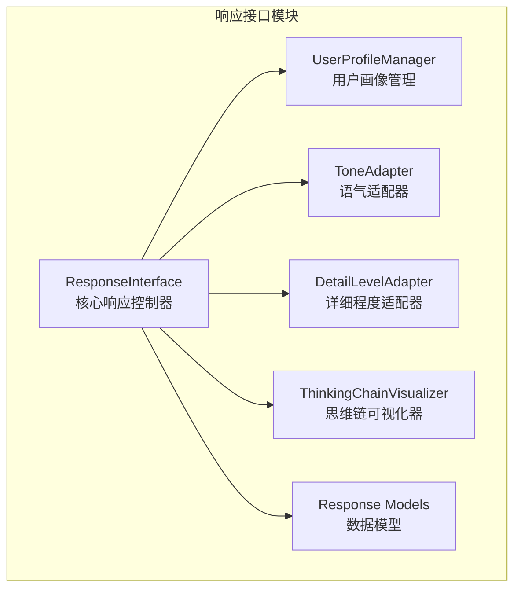
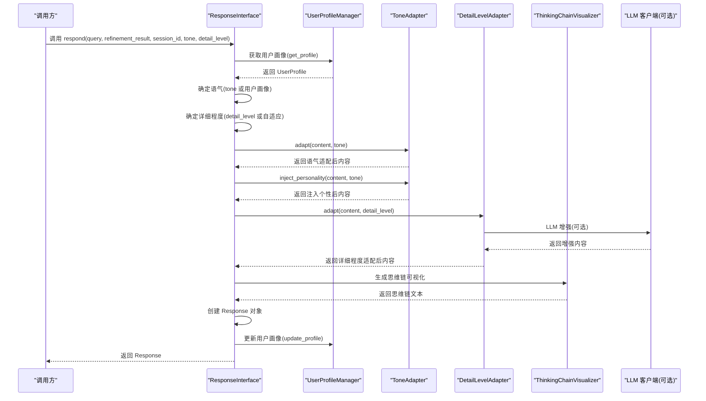
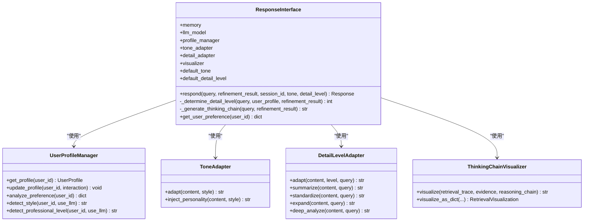
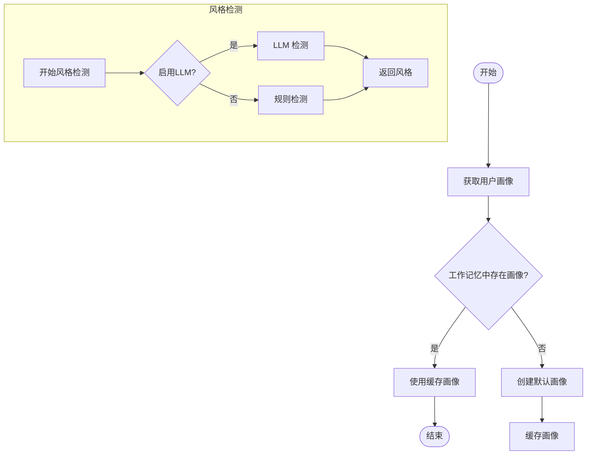
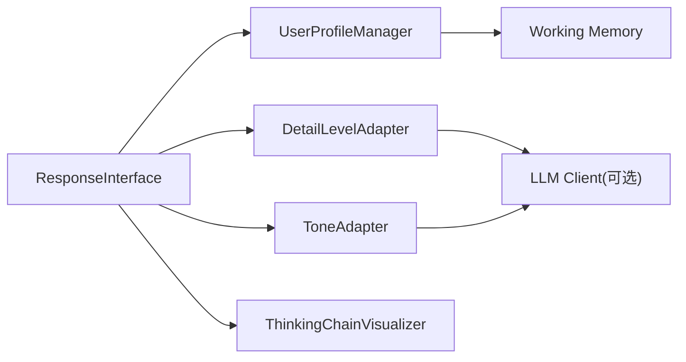

# 响应接口

<cite>
**本文引用的文件**
- [src/response/interface.py](file://src/response/interface.py)
- [src/response/models.py](file://src/response/models.py)
- [src/response/profile_manager.py](file://src/response/profile_manager.py)
- [src/response/detail_adapter.py](file://src/response/detail_adapter.py)
- [src/response/tone_adapter.py](file://src/response/tone_adapter.py)
- [src/response/visualizer.py](file://src/response/visualizer.py)
- [src/core/protocols.py](file://src/core/protocols.py)
- [example/example_usage.py](file://example/example_usage.py)
- [README.md](file://README.md)
</cite>

## 目录
1. [简介](#简介)
2. [项目结构](#项目结构)
3. [核心组件](#核心组件)
4. [架构总览](#架构总览)
5. [详细组件分析](#详细组件分析)
6. [依赖关系分析](#依赖关系分析)
7. [性能考量](#性能考量)
8. [故障排查指南](#故障排查指南)
9. [结论](#结论)
10. [附录](#附录)

## 简介
本章节面向 NecoRAG 交互层（Response Interface）模块，系统阐述响应接口的设计理念与实现细节，重点覆盖：
- 情境自适应生成机制：基于用户画像与查询复杂度的语气与详细程度动态适配
- 多模态输出支持：文本内容、思维链可视化、引用来源等
- 会话管理功能：用户画像缓存、偏好分析与交互历史追踪
- respond 方法完整执行流程：从用户画像获取到最终响应生成的各步骤
- 响应参数配置选项：语气风格、详细程度、会话ID的处理逻辑
- 响应对象数据结构：content、thinking_chain、citations 等字段的作用与格式
- 使用示例与最佳实践

## 项目结构
响应接口位于 src/response 目录，围绕 ResponseInterface 核心类组织多个子组件：
- 用户画像管理：UserProfileManager
- 语气适配：ToneAdapter
- 详细程度适配：DetailLevelAdapter
- 思维链可视化：ThinkingChainVisualizer
- 数据模型：UserProfile、Response、Interaction、RetrievalVisualization

图表来源
- [src/response/interface.py:20-140](file://src/response/interface.py#L20-L140)
- [src/response/profile_manager.py:20-174](file://src/response/profile_manager.py#L20-L174)
- [src/response/tone_adapter.py:8-109](file://src/response/tone_adapter.py#L8-L109)
- [src/response/detail_adapter.py:18-94](file://src/response/detail_adapter.py#L18-L94)
- [src/response/visualizer.py:9-71](file://src/response/visualizer.py#L9-L71)
- [src/response/models.py:13-31](file://src/response/models.py#L13-L31)

章节来源
- [src/response/interface.py:1-232](file://src/response/interface.py#L1-L232)
- [src/response/profile_manager.py:1-505](file://src/response/profile_manager.py#L1-L505)
- [src/response/tone_adapter.py:1-138](file://src/response/tone_adapter.py#L1-L138)
- [src/response/detail_adapter.py:1-417](file://src/response/detail_adapter.py#L1-L417)
- [src/response/visualizer.py:1-150](file://src/response/visualizer.py#L1-L150)
- [src/response/models.py:1-31](file://src/response/models.py#L1-L31)

## 核心组件
- ResponseInterface：响应主控制器，负责整合用户画像、语气与详细程度适配、思维链可视化，并生成最终响应对象
- UserProfileManager：用户画像管理与偏好分析，支持规则与 LLM 增强两种检测模式
- ToneAdapter：语气风格适配，支持正式、友好、幽默三种风格
- DetailLevelAdapter：详细程度适配，支持 1-4 级别，支持 LLM 增强与退化模式
- ThinkingChainVisualizer：思维链可视化，输出检索路径、证据来源与推理过程
- 数据模型：UserProfile、Response、Interaction、RetrievalVisualization

章节来源
- [src/response/interface.py:20-140](file://src/response/interface.py#L20-L140)
- [src/response/profile_manager.py:20-174](file://src/response/profile_manager.py#L20-L174)
- [src/response/tone_adapter.py:8-109](file://src/response/tone_adapter.py#L8-L109)
- [src/response/detail_adapter.py:18-94](file://src/response/detail_adapter.py#L18-L94)
- [src/response/visualizer.py:9-71](file://src/response/visualizer.py#L9-L71)
- [src/response/models.py:13-31](file://src/response/models.py#L13-L31)

## 架构总览
响应接口在 NecoRAG 五层架构的交互层，承接上游精炼结果，结合用户画像与偏好，生成情境自适应的响应与可解释性输出。

图表来源
- [src/response/interface.py:59-140](file://src/response/interface.py#L59-L140)
- [src/response/profile_manager.py:115-174](file://src/response/profile_manager.py#L115-L174)
- [src/response/tone_adapter.py:49-109](file://src/response/tone_adapter.py#L49-L109)
- [src/response/detail_adapter.py:64-94](file://src/response/detail_adapter.py#L64-L94)
- [src/response/visualizer.py:37-71](file://src/response/visualizer.py#L37-L71)

## 详细组件分析

### ResponseInterface：情境自适应响应控制器
- 初始化参数
  - memory: 记忆管理器（工作记忆用于上下文）
  - llm_model: LLM 模型标识
  - default_tone: 默认语气风格
  - default_detail_level: 默认详细程度级别
- 关键方法
  - respond：主流程入口，整合用户画像、语气与详细程度适配、思维链可视化与响应对象创建
  - _determine_detail_level：基于用户专业水平与查询复杂度确定详细程度
  - _generate_thinking_chain：构建检索路径、证据来源与推理过程的可视化文本
  - get_user_preference：分析用户偏好（关键词、交互风格、专业水平）

图表来源
- [src/response/interface.py:20-140](file://src/response/interface.py#L20-L140)
- [src/response/profile_manager.py:20-174](file://src/response/profile_manager.py#L20-L174)
- [src/response/tone_adapter.py:8-109](file://src/response/tone_adapter.py#L8-L109)
- [src/response/detail_adapter.py:18-94](file://src/response/detail_adapter.py#L18-L94)
- [src/response/visualizer.py:9-71](file://src/response/visualizer.py#L9-L71)

章节来源
- [src/response/interface.py:20-140](file://src/response/interface.py#L20-L140)

### 用户画像管理：UserProfileManager
- 功能
  - 获取与缓存用户画像
  - 基于查询历史分析交互风格（简洁/详细/技术/通俗）
  - 基于关键词与复杂度估计专业水平（初学者/中级/专家）
  - 更新交互历史与画像元数据
  - 综合分析用户偏好（关键词、交互风格、专业水平）
- 特性
  - 支持规则检测与 LLM 增强检测
  - 支持 TTL 缓存与最大历史条数限制
  - 与工作记忆集成，持久化用户画像

图表来源
- [src/response/profile_manager.py:115-174](file://src/response/profile_manager.py#L115-L174)
- [src/response/profile_manager.py:210-332](file://src/response/profile_manager.py#L210-L332)
- [src/response/profile_manager.py:340-467](file://src/response/profile_manager.py#L340-L467)

章节来源
- [src/response/profile_manager.py:20-174](file://src/response/profile_manager.py#L20-L174)
- [src/response/profile_manager.py:210-332](file://src/response/profile_manager.py#L210-L332)
- [src/response/profile_manager.py:340-467](file://src/response/profile_manager.py#L340-L467)

### 语气适配：ToneAdapter
- 支持风格
  - formal：正式严谨，避免表情符号
  - friendly：亲切友好，带后缀“~”
  - humorous：幽默轻松，带前缀“哈哈，”与表情符号
- 适配流程
  - adapt：添加前后缀与表情符号控制
  - inject_personality：在段落间注入连接词，增强个性化表达

章节来源
- [src/response/tone_adapter.py:8-109](file://src/response/tone_adapter.py#L8-L109)

### 详细程度适配：DetailLevelAdapter
- 详细程度级别
  - Level 1：简洁摘要（1-2 句话）
  - Level 2：标准回答（1 段话 + 要点）
  - Level 3：详细解释（多段落 + 案例）
  - Level 4：深度分析（完整报告）
- 适配策略
  - adapt：根据级别选择摘要、标准化、扩展或深度分析
  - LLM 增强：在有 LLM 客户端时，使用提示词驱动生成；失败时退化为规则处理
  - 退化模式：无 LLM 时采用简单截断、结构化框架等方式保证输出质量

章节来源
- [src/response/detail_adapter.py:18-94](file://src/response/detail_adapter.py#L18-L94)
- [src/response/detail_adapter.py:95-167](file://src/response/detail_adapter.py#L95-L167)
- [src/response/detail_adapter.py:169-272](file://src/response/detail_adapter.py#L169-L272)
- [src/response/detail_adapter.py:274-371](file://src/response/detail_adapter.py#L274-L371)

### 思维链可视化：ThinkingChainVisualizer
- 可视化内容
  - 检索路径：查询理解、语义检索、证据数量等
  - 证据来源：证据 ID 与相关度评分
  - 推理过程：置信度、迭代次数、幻觉检测状态等
- 输出形式
  - 文本可视化：适合直接展示
  - 结构化对象：RetrievalVisualization，便于前端渲染或二次处理

章节来源
- [src/response/visualizer.py:9-71](file://src/response/visualizer.py#L9-L71)
- [src/response/visualizer.py:127-150](file://src/response/visualizer.py#L127-L150)

### 响应对象数据结构：Response
- 字段说明
  - response_id：响应唯一标识
  - query_id：查询唯一标识
  - content：最终生成的文本内容
  - confidence：置信度
  - sources：检索结果列表（用于溯源）
  - thinking_chain：思维链可视化文本
  - tone：语气风格枚举
  - detail_level：详细程度枚举
  - citations：引用来源列表
  - metadata：附加元数据（如迭代次数、用户ID、置信度等）
  - created_at：创建时间
- 数据来源
  - 统一协议定义：Response
  - 模块内模型：UserProfile、Interaction、RetrievalVisualization

章节来源
- [src/core/protocols.py:265-278](file://src/core/protocols.py#L265-L278)
- [src/response/models.py:13-31](file://src/response/models.py#L13-L31)

## 依赖关系分析
- 组件耦合
  - ResponseInterface 依赖 UserProfileManager、ToneAdapter、DetailLevelAdapter、ThinkingChainVisualizer
  - UserProfileManager 依赖工作记忆与可选 LLM 客户端
  - DetailLevelAdapter 与 ToneAdapter 支持 LLM 增强与退化模式，降低对外部依赖的耦合
- 外部依赖
  - LLM 客户端（可选）：用于风格检测、专业水平检测与内容增强
  - 工作记忆：用于用户画像与上下文持久化

图表来源
- [src/response/interface.py:31-58](file://src/response/interface.py#L31-L58)
- [src/response/profile_manager.py:77-96](file://src/response/profile_manager.py#L77-L96)
- [src/response/detail_adapter.py:35-48](file://src/response/detail_adapter.py#L35-L48)
- [src/response/tone_adapter.py:18-25](file://src/response/tone_adapter.py#L18-L25)

章节来源
- [src/response/interface.py:31-58](file://src/response/interface.py#L31-L58)
- [src/response/profile_manager.py:77-96](file://src/response/profile_manager.py#L77-L96)
- [src/response/detail_adapter.py:35-48](file://src/response/detail_adapter.py#L35-L48)
- [src/response/tone_adapter.py:18-25](file://src/response/tone_adapter.py#L18-L25)

## 性能考量
- 适配器退化策略
  - 当 LLM 不可用或调用失败时，自动降级为规则处理，保证响应稳定性
- 缓存与上下文
  - 用户画像缓存减少重复分析开销；工作记忆上下文提升个性化准确性
- 输出长度控制
  - 详细程度适配器根据内容长度阈值决定是否扩展或摘要，平衡信息密度与性能
- 日志与可观测性
  - 关键步骤记录日志，便于定位性能瓶颈与异常

[本节为通用性能讨论，不直接分析具体文件]

## 故障排查指南
- LLM 调用失败
  - 现象：风格检测、专业水平检测或内容增强失败
  - 处理：自动退化为规则处理；检查 LLM 客户端配置与网络连接
- 用户画像为空
  - 现象：未识别到用户画像或偏好
  - 处理：确认 session_id 正确；检查工作记忆上下文；必要时手动初始化默认画像
- 详细程度异常
  - 现象：输出过于简洁或冗长
  - 处理：调整 default_detail_level 或显式传入 detail_level；检查 refine 结果的迭代次数与置信度
- 思维链缺失
  - 现象：thinking_chain 为空
  - 处理：确认 refinement_result 包含 citations 与 confidence；检查可视化开关

章节来源
- [src/response/profile_manager.py:285-332](file://src/response/profile_manager.py#L285-L332)
- [src/response/detail_adapter.py:117-144](file://src/response/detail_adapter.py#L117-L144)
- [src/response/detail_adapter.py:218-247](file://src/response/detail_adapter.py#L218-L247)
- [src/response/detail_adapter.py:294-330](file://src/response/detail_adapter.py#L294-L330)

## 结论
ResponseInterface 通过“用户画像 + 语气适配 + 详细程度适配 + 思维链可视化”的组合拳，实现了情境自适应的高质量响应生成。其模块化设计与 LLM 增强/退化策略兼顾了灵活性与鲁棒性，适用于多样化的应用场景。配合统一协议与数据模型，确保了跨模块的数据一致性与可扩展性。

[本节为总结性内容，不直接分析具体文件]

## 附录

### 使用示例与最佳实践
- 基本使用
  - 初始化 ResponseInterface，传入 MemoryManager
  - 调用 respond，传入 query、RefinementResult 与可选参数（session_id、tone、detail_level）
  - 获取 content、thinking_chain 与 citations
- 最佳实践
  - 明确会话ID：使用稳定的 session_id 以便持续个性化
  - 语气与详细程度：优先使用用户画像推断，必要时显式覆盖
  - LLM 增强：在需要高质量内容时启用 LLM 客户端
  - 可解释性：充分利用 thinking_chain 辅助用户理解与信任

章节来源
- [example/example_usage.py:176-215](file://example/example_usage.py#L176-L215)
- [README.md:333-377](file://README.md#L333-L377)