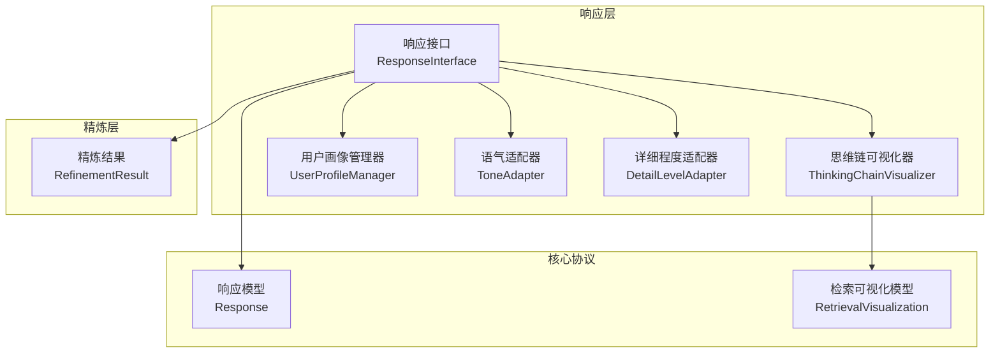
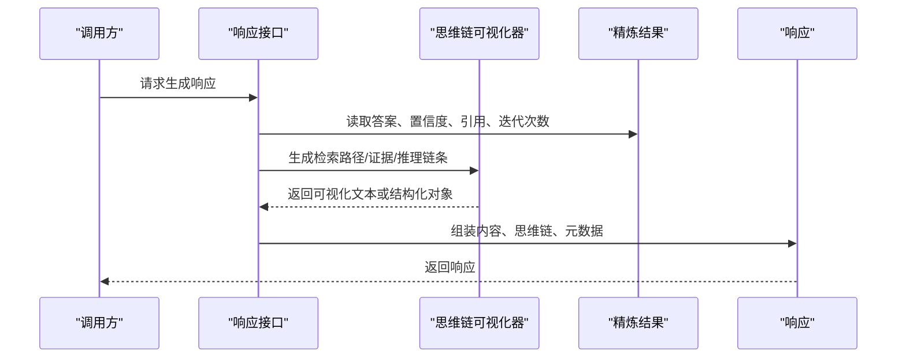
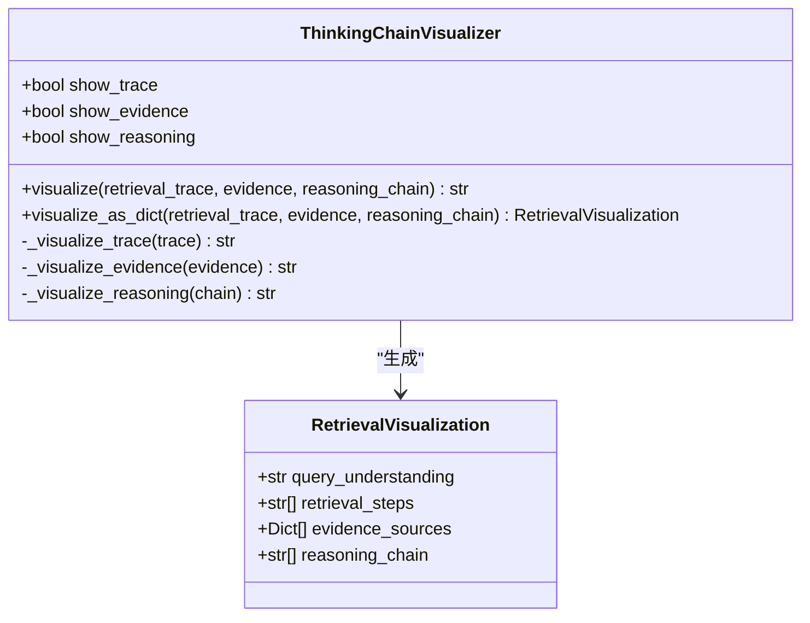
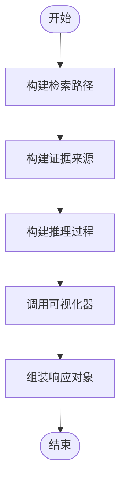
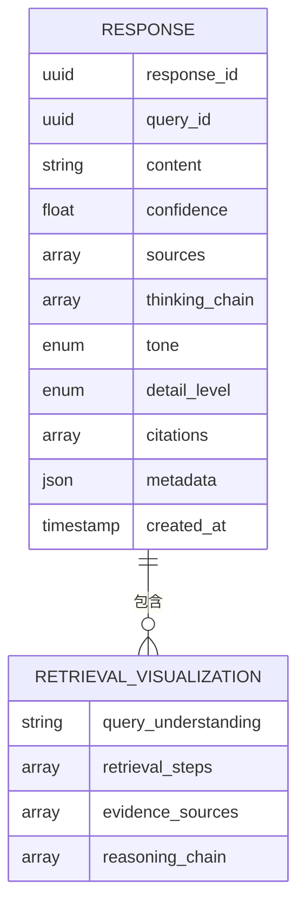
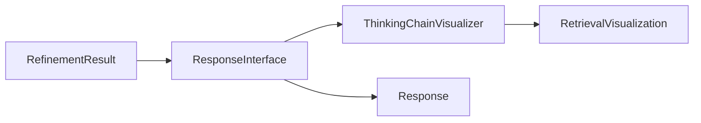

# 思维链可视化器

<cite>
**本文引用的文件**
- [src/response/visualizer.py](file://src/response/visualizer.py)
- [src/response/models.py](file://src/response/models.py)
- [src/response/interface.py](file://src/response/interface.py)
- [src/refinement/models.py](file://src/refinement/models.py)
- [src/core/protocols.py](file://src/core/protocols.py)
- [src/response/README.md](file://src/response/README.md)
- [example/example_usage.py](file://example/example_usage.py)
</cite>

## 目录
1. [简介](#简介)
2. [项目结构](#项目结构)
3. [核心组件](#核心组件)
4. [架构总览](#架构总览)
5. [详细组件分析](#详细组件分析)
6. [依赖分析](#依赖分析)
7. [性能考量](#性能考量)
8. [故障排查指南](#故障排查指南)
9. [结论](#结论)
10. [附录](#附录)

## 简介
本文件面向 NecoRAG 的“思维链可视化器”模块，系统性阐述 ThinkingChainVisualizer 如何将复杂的检索与推理过程转化为可理解的可视化文本。文档聚焦三大可视化组成部分：检索路径（retrieval_trace）、证据来源（evidence）、推理链条（reasoning_chain），并解释其模板设计原则、格式规范（时间线展示、证据评分与置信度标注）。同时提供可视化输出的解读指南、自定义模板实现方法，以及不同查询类型的可视化示例与效果对比。

## 项目结构
思维链可视化器位于响应层（Response Layer），与用户画像、语气适配、详细程度适配共同构成情境自适应交互的核心。其输入来源于精炼结果（RefinementResult），由响应接口在生成最终响应时调用可视化器，拼接成可解释的“思维链”。

**图表来源**
- [src/response/interface.py:20-140](file://src/response/interface.py#L20-L140)
- [src/response/visualizer.py:9-149](file://src/response/visualizer.py#L9-L149)
- [src/response/models.py:24-31](file://src/response/models.py#L24-L31)
- [src/refinement/models.py:37-47](file://src/refinement/models.py#L37-L47)
- [src/core/protocols.py:264-278](file://src/core/protocols.py#L264-L278)

**章节来源**
- [src/response/README.md:150-196](file://src/response/README.md#L150-L196)
- [src/response/interface.py:20-140](file://src/response/interface.py#L20-L140)

## 核心组件
- 思维链可视化器（ThinkingChainVisualizer）
  - 职责：将检索路径、证据来源、推理过程三部分组织为结构化文本；同时提供结构化对象（RetrievalVisualization）以便下游使用。
  - 关键方法：
    - visualize：按配置拼接三部分输出
    - _visualize_trace：时间线式展示检索步骤
    - _visualize_evidence：展示证据来源与相关度
    - _visualize_reasoning：展示推理过程
    - visualize_as_dict：生成结构化可视化对象
- 响应接口（ResponseInterface）
  - 职责：整合用户画像、语气与详细程度适配，调用可视化器生成思维链文本，并封装至 Response。
  - 关键方法：
    - _generate_thinking_chain：构造检索路径、证据来源、推理链条
- 数据模型
  - RetrievalVisualization：结构化可视化载体
  - Response：最终响应，包含思维链列表（字典序列）

**章节来源**
- [src/response/visualizer.py:9-149](file://src/response/visualizer.py#L9-L149)
- [src/response/interface.py:175-219](file://src/response/interface.py#L175-L219)
- [src/response/models.py:24-31](file://src/response/models.py#L24-L31)
- [src/core/protocols.py:264-278](file://src/core/protocols.py#L264-L278)

## 架构总览
思维链可视化器在响应接口内部被调用，输入来自精炼结果，输出为字符串或结构化对象，最终进入 Response 的 thinking_chain 字段。

**图表来源**
- [src/response/interface.py:59-140](file://src/response/interface.py#L59-L140)
- [src/response/visualizer.py:37-71](file://src/response/visualizer.py#L37-L71)

**章节来源**
- [src/response/interface.py:59-140](file://src/response/interface.py#L59-L140)
- [src/response/visualizer.py:37-71](file://src/response/visualizer.py#L37-L71)

## 详细组件分析

### 思维链可视化器（ThinkingChainVisualizer）
- 设计目标
  - 将检索路径、证据来源、推理过程三部分清晰呈现，帮助用户理解 AI 的思考过程。
- 输出结构
  - 检索路径：时间线式步骤，强调“查询理解—检索—融合”的顺序。
  - 证据来源：最多展示若干条证据，标注来源与相关度（浮点数，保留两位小数）。
  - 推理过程：展示置信度、迭代次数、幻觉检测等关键指标。
- 可配置项
  - show_trace：是否显示检索路径
  - show_evidence：是否显示证据来源
  - show_reasoning：是否显示推理过程
- 结构化输出
  - visualize_as_dict：返回 RetrievalVisualization，便于前端渲染或二次加工。

**图表来源**
- [src/response/visualizer.py:9-149](file://src/response/visualizer.py#L9-L149)
- [src/response/models.py:24-31](file://src/response/models.py#L24-L31)

**章节来源**
- [src/response/visualizer.py:9-149](file://src/response/visualizer.py#L9-L149)
- [src/response/models.py:24-31](file://src/response/models.py#L24-L31)

### 响应接口中的思维链生成
- 输入来源
  - RefinementResult：包含答案、置信度、引用、迭代次数、幻觉检测报告等。
- 生成逻辑
  - 检索路径：基于查询与检索结果数量构造步骤。
  - 证据来源：将引用映射为证据条目，使用置信度作为相关度。
  - 推理过程：包含置信度、迭代次数，若存在幻觉检测报告则追加检测结论。
- 输出封装
  - 调用 ThinkingChainVisualizer.visualize 生成文本，写入 Response.thinking_chain。

**图表来源**
- [src/response/interface.py:175-219](file://src/response/interface.py#L175-L219)
- [src/response/visualizer.py:37-71](file://src/response/visualizer.py#L37-L71)

**章节来源**
- [src/response/interface.py:175-219](file://src/response/interface.py#L175-L219)
- [src/refinement/models.py:37-47](file://src/refinement/models.py#L37-L47)

### 数据模型与协议
- RetrievalVisualization
  - 字段：query_understanding、retrieval_steps、evidence_sources、reasoning_chain
  - 用途：承载结构化思维链，便于前端渲染或日志记录
- Response
  - 字段：content、thinking_chain（列表，字典序列）、citations、metadata 等
  - 用途：最终对外输出，包含可解释性信息

**图表来源**
- [src/core/protocols.py:264-278](file://src/core/protocols.py#L264-L278)
- [src/response/models.py:24-31](file://src/response/models.py#L24-L31)

**章节来源**
- [src/core/protocols.py:264-278](file://src/core/protocols.py#L264-L278)
- [src/response/models.py:24-31](file://src/response/models.py#L24-L31)

## 依赖分析
- 组件耦合
  - ThinkingChainVisualizer 仅依赖数据模型（RetrievalVisualization），耦合度低，便于独立测试与替换。
  - ResponseInterface 依赖 ThinkingChainVisualizer 与 RefinementResult，形成“适配—可视化—封装”的清晰流水线。
- 外部依赖
  - 无外部库依赖，纯 Python 实现，部署简单。
- 循环依赖
  - 未发现循环依赖，模块职责边界清晰。

**图表来源**
- [src/response/interface.py:175-219](file://src/response/interface.py#L175-L219)
- [src/response/visualizer.py:127-149](file://src/response/visualizer.py#L127-L149)
- [src/response/models.py:24-31](file://src/response/models.py#L24-L31)
- [src/core/protocols.py:264-278](file://src/core/protocols.py#L264-L278)

**章节来源**
- [src/response/interface.py:175-219](file://src/response/interface.py#L175-L219)
- [src/response/visualizer.py:127-149](file://src/response/visualizer.py#L127-L149)

## 性能考量
- 时间复杂度
  - 可视化过程为线性遍历与拼接，时间复杂度 O(n)，n 为步骤数或证据条数。
- 空间复杂度
  - 输出字符串长度与输入规模线性相关，空间开销可控。
- 优化建议
  - 证据来源限制展示数量（当前最多 5 条），避免长列表影响可读性。
  - 可视化器支持按需开关各部分输出，减少冗余渲染。

[本节为通用性能讨论，不直接分析具体文件]

## 故障排查指南
- 常见问题
  - 可视化为空：确认输入参数非空且对应开关已启用。
  - 证据来源缺失：检查 evidence 是否为字典列表，包含 source 与 score 键。
  - 推理过程异常：确认 reasoning_chain 为字符串列表，必要字段（如置信度、迭代次数）已正确填充。
- 调试建议
  - 在 ResponseInterface 中打印中间产物（检索路径、证据、推理链条），定位问题来源。
  - 使用 visualize_as_dict 生成结构化对象，便于前端调试与日志分析。

**章节来源**
- [src/response/visualizer.py:37-71](file://src/response/visualizer.py#L37-L71)
- [src/response/interface.py:175-219](file://src/response/interface.py#L175-L219)

## 结论
ThinkingChainVisualizer 通过简洁直观的模板设计，将检索路径、证据来源与推理过程三部分有机整合，显著提升了系统的可解释性与用户信任度。其低耦合、可配置的特性使其易于扩展与定制，适用于多种查询类型与交互场景。

[本节为总结性内容，不直接分析具体文件]

## 附录

### 可视化模板设计与格式规范
- 检索路径（retrieval_trace）
  - 形式：有序步骤列表，强调“查询理解—检索—融合”的时间线。
  - 建议：每步描述尽量简洁明确，突出关键动作与结果。
- 证据来源（evidence）
  - 形式：列表，每条包含来源标识与相关度评分（浮点数，保留两位小数）。
  - 建议：控制展示数量（默认最多 5 条），优先展示高相关度证据。
- 推理链条（reasoning_chain）
  - 形式：指标与结论列表，包含置信度、迭代次数、幻觉检测等。
  - 建议：使用统一的标签与数值格式，便于快速扫描与理解。

**章节来源**
- [src/response/visualizer.py:73-125](file://src/response/visualizer.py#L73-L125)
- [src/response/README.md:174-195](file://src/response/README.md#L174-L195)

### 可视化输出解读指南
- 检索路径
  - 用于理解 AI 如何从查询出发，逐步定位与融合证据。
- 证据来源
  - 用于判断答案依据的可靠性与覆盖面，关注相关度评分。
- 推理过程
  - 用于评估答案的可信度与生成过程的合理性，关注置信度与迭代次数。

**章节来源**
- [src/response/README.md:150-196](file://src/response/README.md#L150-L196)

### 自定义模板实现方法
- 方法一：继承与覆盖
  - 继承 ThinkingChainVisualizer，重写 _visualize_trace/_visualize_evidence/_visualize_reasoning，以适配特定格式。
- 方法二：策略模式
  - 将各部分渲染逻辑抽象为策略，通过配置切换不同模板风格。
- 方法三：结构化对象扩展
  - 使用 visualize_as_dict 返回的 RetrievalVisualization，配合前端渲染器实现多样化展示。

**章节来源**
- [src/response/visualizer.py:73-149](file://src/response/visualizer.py#L73-L149)

### 不同查询类型的可视化示例与效果对比
- 示例参考
  - 完整使用示例展示了从感知、记忆、检索、精炼到交互响应的全流程，其中包含思维链可视化的输出片段。
- 对比维度
  - 简单查询 vs 复杂查询：复杂查询通常包含更多推理步骤与证据来源，思维链更长。
  - 专家用户 vs 普通用户：专家用户可能更关注推理链条与证据来源，普通用户更关注检索路径与结论。
- 建议
  - 根据查询复杂度与用户画像动态调整展示重点（例如仅展示检索路径或仅展示推理过程）。

**章节来源**
- [example/example_usage.py:176-215](file://example/example_usage.py#L176-L215)
- [src/response/interface.py:142-173](file://src/response/interface.py#L142-L173)