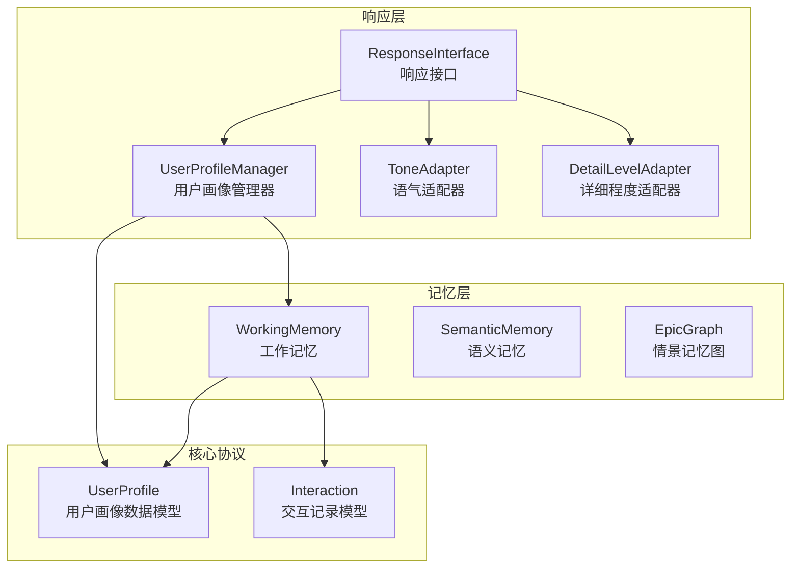
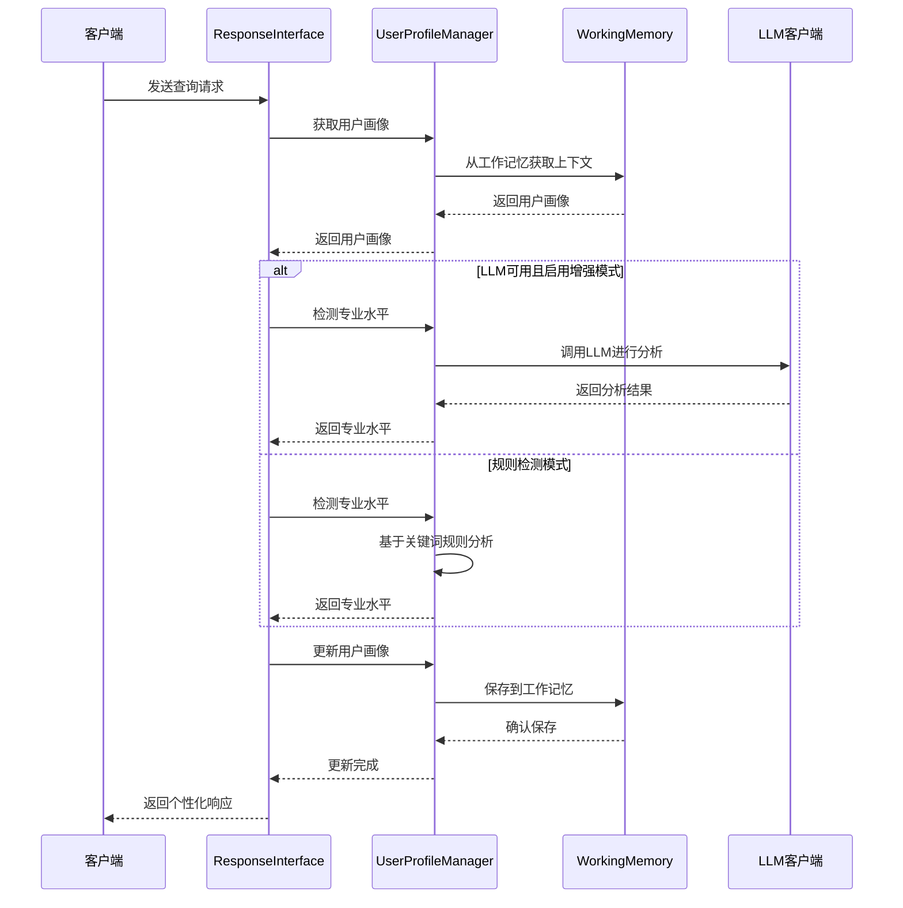
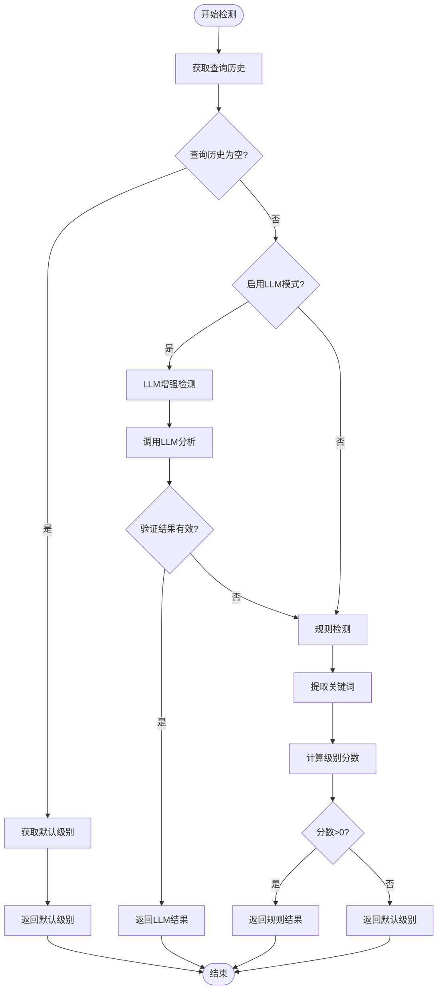
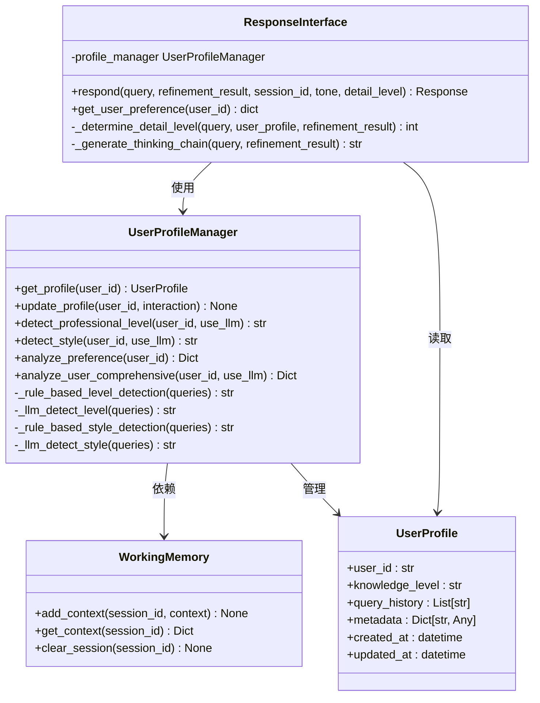
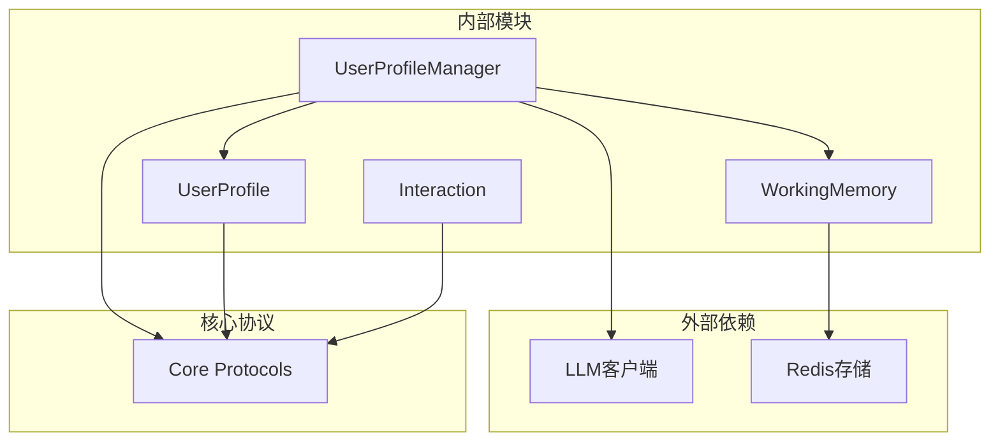

# 用户画像管理器

<cite>
**本文档引用的文件**
- [profile_manager.py](file://src/response/profile_manager.py)
- [models.py](file://src/response/models.py)
- [interface.py](file://src/response/interface.py)
- [working_memory.py](file://src/memory/working_memory.py)
- [protocols.py](file://src/core/protocols.py)
- [example_usage.py](file://example/example_usage.py)
</cite>

## 目录
1. [简介](#简介)
2. [项目结构](#项目结构)
3. [核心组件](#核心组件)
4. [架构概览](#架构概览)
5. [详细组件分析](#详细组件分析)
6. [依赖关系分析](#依赖关系分析)
7. [性能考虑](#性能考虑)
8. [故障排除指南](#故障排除指南)
9. [结论](#结论)

## 简介

用户画像管理器（UserProfileManager）是NecoRAG系统中的关键组件，负责维护和管理用户交互历史以及个人偏好信息。该模块通过分析用户的查询历史、交互风格和专业水平，为系统提供个性化的响应适配能力。

该管理器采用双模式检测机制：既支持基于规则的传统检测方法，也支持基于LLM的增强检测模式。这种设计确保了系统的鲁棒性和可扩展性，即使在LLM不可用的情况下也能正常运行。

## 项目结构

用户画像管理器位于响应层（Response Layer），与记忆管理器紧密协作，形成完整的用户状态管理系统：

**图表来源**
- [profile_manager.py:1-505](file://src/response/profile_manager.py#L1-L505)
- [interface.py:1-232](file://src/response/interface.py#L1-L232)
- [working_memory.py:1-120](file://src/memory/working_memory.py#L1-L120)

**章节来源**
- [profile_manager.py:1-505](file://src/response/profile_manager.py#L1-L505)
- [interface.py:1-232](file://src/response/interface.py#L1-L232)

## 核心组件

### 用户画像数据结构

用户画像管理器基于统一的用户画像数据模型，包含以下关键字段：

| 字段名 | 类型 | 描述 | 默认值 |
|--------|------|------|--------|
| user_id | str | 用户唯一标识符 | 自动生成 |
| name | Optional[str] | 用户姓名 | None |
| profession | Optional[str] | 职业信息 | None |
| knowledge_level | str | 专业水平 | "intermediate" |
| preferred_tone | ResponseTone | 偏好语气 | ResponseTone.PROFESSIONAL |
| preferred_detail | DetailLevel | 偏好详细程度 | DetailLevel.STANDARD |
| interests | List[str] | 兴趣领域 | [] |
| preferred_domains | List[str] | 偏好领域 | [] |
| query_history | List[str] | 查询历史 | [] |
| interaction_count | int | 交互次数 | 0 |
| metadata | Dict[str, Any] | 元数据 | {} |
| created_at | datetime | 创建时间 | 当前时间 |
| updated_at | datetime | 更新时间 | 当前时间 |

### 交互记录模型

交互记录用于捕获每次用户交互的关键信息：

| 字段名 | 类型 | 描述 |
|--------|------|------|
| interaction_id | str | 交互唯一标识符 |
| user_id | str | 用户标识符 |
| query | str | 用户查询内容 |
| response | str | 系统响应内容 |
| satisfaction | Optional[float] | 用户满意度 (0-1) |
| timestamp | datetime | 交互时间戳 |

**章节来源**
- [protocols.py:282-298](file://src/core/protocols.py#L282-L298)
- [models.py:13-31](file://src/response/models.py#L13-L31)

## 架构概览

用户画像管理器采用分层架构设计，实现了从数据采集到智能分析的完整流程：

**图表来源**
- [interface.py:59-140](file://src/response/interface.py#L59-L140)
- [profile_manager.py:143-174](file://src/response/profile_manager.py#L143-L174)

## 详细组件分析

### UserProfileManager 类

UserProfileManager是用户画像管理的核心类，提供了完整的用户画像生命周期管理：

#### 主要功能特性

1. **用户画像获取与缓存**
   - 支持本地缓存机制减少重复查询
   - 从工作记忆中恢复用户状态
   - 自动创建新用户画像

2. **专业水平检测**
   - 基于关键词匹配的规则检测
   - LLM增强的智能检测
   - 支持初学者、中级、专家三个级别

3. **交互风格分析**
   - 简洁风格（concise）
   - 详细风格（detailed）
   - 技术风格（technical）
   - 通俗风格（popular）

#### 关键算法实现

##### 专业水平检测算法

**图表来源**
- [profile_manager.py:340-467](file://src/response/profile_manager.py#L340-L467)

##### 交互风格检测算法

风格检测采用多模式匹配策略：

| 模式类型 | 检测特征 | 匹配规则 |
|----------|----------|----------|
| 简洁模式 | 短查询、直接要求 | 1-20字符查询，包含"简要"、"直接"等关键词 |
| 详细模式 | 完整解释需求 | 包含"详细"、"全面"、"深入"等关键词 |
| 技术模式 | 技术细节要求 | 包含"技术"、"实现"、"代码"等关键词 |
| 通俗模式 | 易懂表达需求 | 包含"通俗"、"易懂"、"举例"等关键词 |

**章节来源**
- [profile_manager.py:20-505](file://src/response/profile_manager.py#L20-L505)

### 与响应接口的集成

用户画像管理器与响应接口紧密集成，实现了完整的个性化响应流程：

**图表来源**
- [interface.py:20-140](file://src/response/interface.py#L20-L140)
- [profile_manager.py:20-100](file://src/response/profile_manager.py#L20-L100)

**章节来源**
- [interface.py:1-232](file://src/response/interface.py#L1-L232)
- [working_memory.py:1-120](file://src/memory/working_memory.py#L1-L120)

### 用户偏好分析机制

用户偏好分析通过多层次的数据挖掘实现：

#### 关键词分析
- 统计查询历史中的高频词汇
- 过滤短词和停用词
- 计算词频权重

#### 交互模式识别
- 查询长度分布分析
- 关键词组合模式
- 时间序列变化趋势

#### 个性化推荐策略

基于用户画像的个性化推荐策略：

1. **内容推荐**
   - 根据兴趣领域推荐相关文档
   - 基于查询历史相似度推荐内容

2. **风格适配**
   - 专业水平决定详细程度
   - 交互风格决定表达方式
   - 语气偏好决定语言风格

3. **动态调整**
   - 基于满意度反馈调整推荐
   - 实时更新用户偏好模型
   - 学习长期行为模式

**章节来源**
- [profile_manager.py:175-209](file://src/response/profile_manager.py#L175-L209)

## 依赖关系分析

用户画像管理器的依赖关系体现了清晰的分层架构：

**图表来源**
- [profile_manager.py:16-18](file://src/response/profile_manager.py#L16-L18)
- [working_memory.py:32-34](file://src/memory/working_memory.py#L32-L34)

### 关键依赖关系

1. **工作记忆依赖**
   - 通过WorkingMemory实现用户状态持久化
   - 支持TTL过期机制
   - 实现LRU淘汰策略

2. **LLM集成**
   - 可选的LLM增强模式
   - 退化模式保证系统稳定性
   - 支持温度参数控制输出质量

3. **协议层集成**
   - 统一的数据模型定义
   - 标准化的枚举类型
   - 类型安全的接口设计

**章节来源**
- [profile_manager.py:77-114](file://src/response/profile_manager.py#L77-L114)
- [protocols.py:1-298](file://src/core/protocols.py#L1-L298)

## 性能考虑

### 缓存策略

用户画像管理器采用了多层缓存机制：

1. **内存缓存**
   - 本地字典缓存用户画像
   - 支持TTL过期控制
   - 避免重复的磁盘I/O操作

2. **工作记忆缓存**
   - 基于会话的上下文存储
   - 支持批量操作
   - 实现快速状态恢复

### 性能优化技术

1. **查询历史限制**
   - 最大历史记录数控制
   - 自动截断机制
   - 内存使用优化

2. **算法复杂度控制**
   - 关键词匹配采用集合操作
   - 分数计算优化
   - 正则表达式预编译

3. **异步处理支持**
   - LLM调用异步化
   - 批量更新机制
   - 并发访问控制

## 故障排除指南

### 常见问题及解决方案

#### LLM调用失败
**问题症状**: LLM增强模式无法使用，系统回退到规则模式

**解决步骤**:
1. 检查LLM客户端配置
2. 验证API密钥有效性
3. 确认网络连接状态
4. 检查模型可用性

#### 用户画像丢失
**问题症状**: 用户状态在会话间不一致

**解决步骤**:
1. 检查工作记忆配置
2. 验证TTL设置合理性
3. 确认会话ID正确传递
4. 检查存储后端状态

#### 性能问题
**问题症状**: 用户画像获取响应缓慢

**解决步骤**:
1. 检查缓存命中率
2. 优化查询历史长度
3. 调整最大历史记录数
4. 监控内存使用情况

### 调试工具

用户画像管理器提供了丰富的调试功能：

1. **日志记录**
   - 详细的执行流程日志
   - 错误堆栈跟踪
   - 性能指标监控

2. **状态检查**
   - 用户画像完整性验证
   - 查询历史统计分析
   - 缓存使用情况监控

**章节来源**
- [profile_manager.py:329-331](file://src/response/profile_manager.py#L329-L331)
- [working_memory.py:97-107](file://src/memory/working_memory.py#L97-L107)

## 结论

用户画像管理器作为NecoRAG系统的重要组成部分，通过智能化的用户状态管理和个性化适配机制，显著提升了系统的用户体验。其双模式检测架构确保了系统的鲁棒性和可扩展性，而完善的缓存策略和性能优化技术保证了系统的高效运行。

该模块的成功实施为后续的个性化推荐、智能路由和用户行为预测奠定了坚实基础，是构建真正智能对话系统的关键基础设施。

通过持续的优化和扩展，用户画像管理器将继续在提升AI助手智能化水平方面发挥重要作用，为用户提供更加个性化和高质量的服务体验。