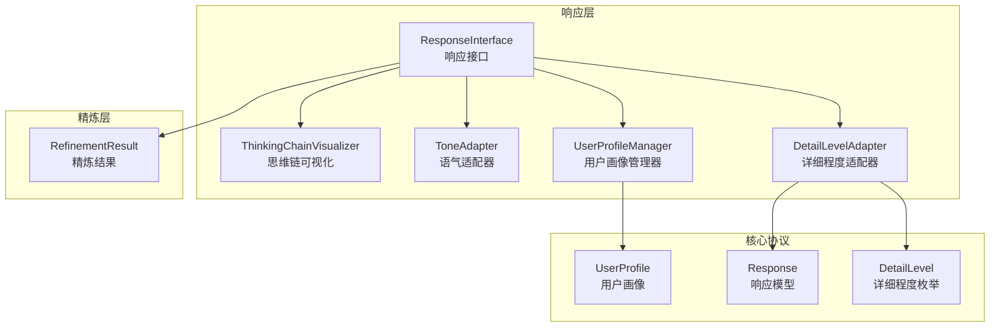
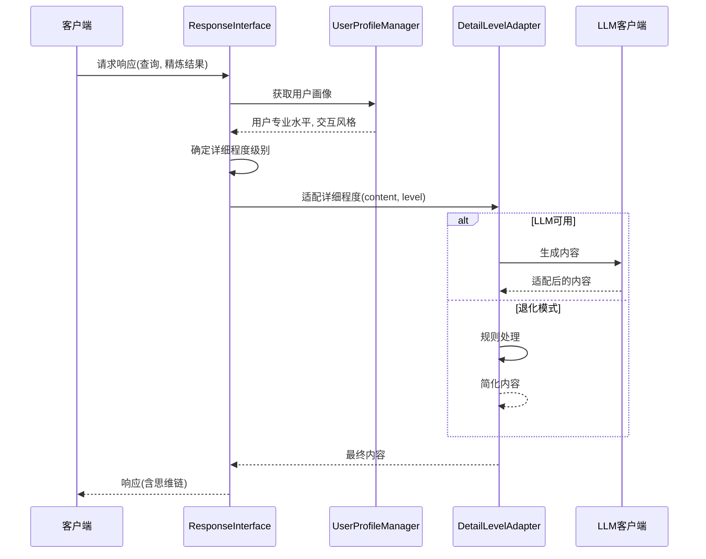
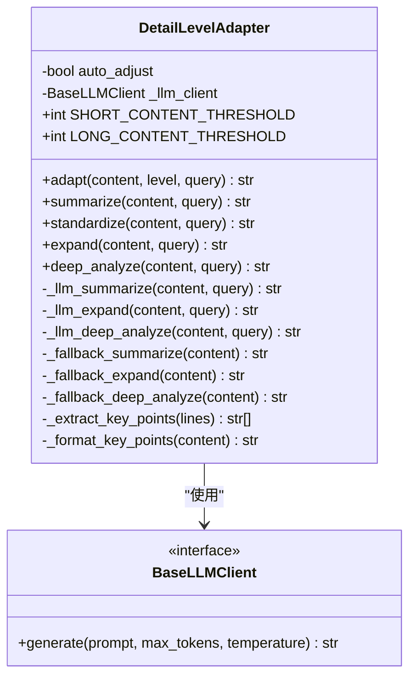
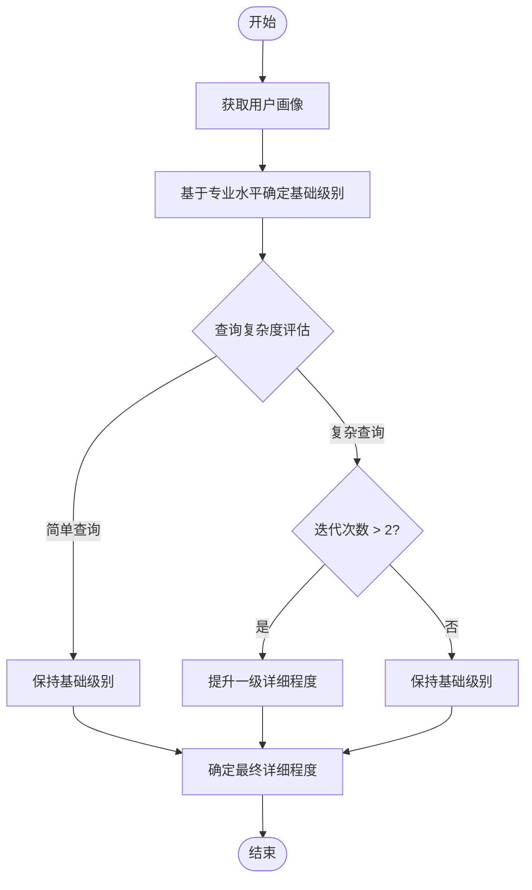
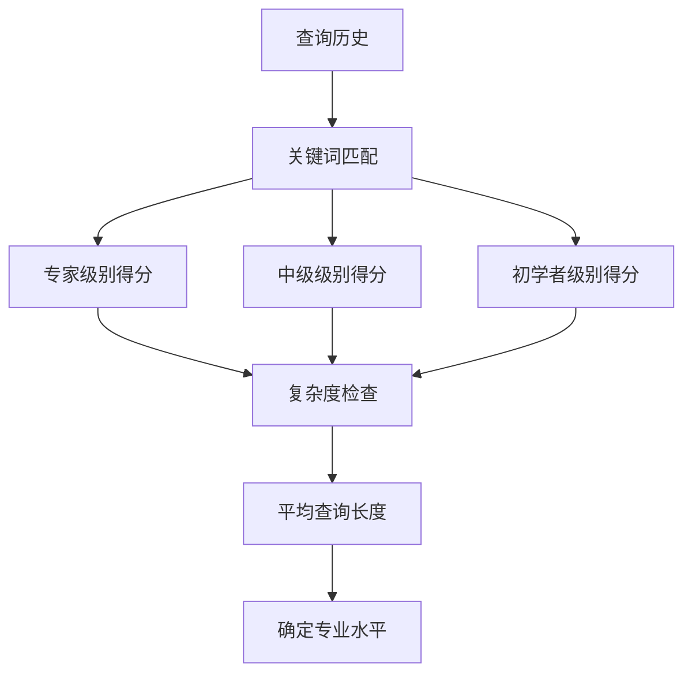
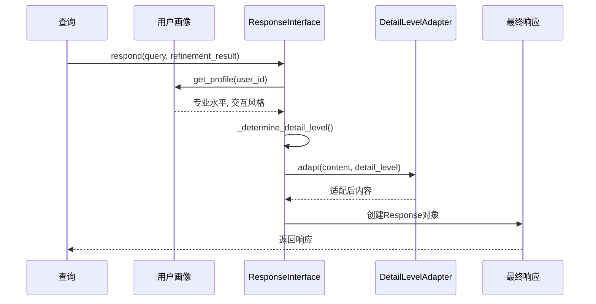
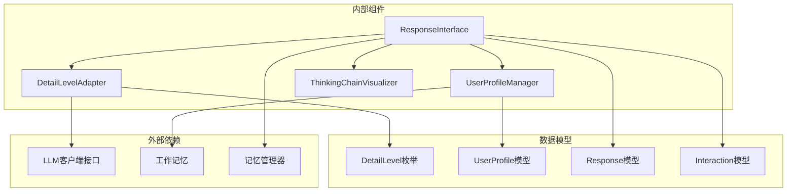

# 详细程度控制器

<cite>
**本文档引用的文件**
- [src/response/detail_adapter.py](file://src/response/detail_adapter.py)
- [src/response/profile_manager.py](file://src/response/profile_manager.py)
- [src/response/interface.py](file://src/response/interface.py)
- [src/response/models.py](file://src/response/models.py)
- [src/core/protocols.py](file://src/core/protocols.py)
- [src/refinement/models.py](file://src/refinement/models.py)
- [example/example_usage.py](file://example/example_usage.py)
</cite>

## 目录
1. [简介](#简介)
2. [项目结构](#项目结构)
3. [核心组件](#核心组件)
4. [架构概览](#架构概览)
5. [详细组件分析](#详细组件分析)
6. [依赖关系分析](#依赖关系分析)
7. [性能考量](#性能考量)
8. [故障排除指南](#故障排除指南)
9. [结论](#结论)
10. [附录](#附录)

## 简介

详细程度控制器是NecoRAG系统中的关键组件，负责根据用户专业水平和查询复杂度动态调整回答的详细程度。该模块实现了从简洁摘要到专家级深度分析的四层级内容适配机制，为不同用户群体提供个性化的信息呈现体验。

该控制器的核心价值在于：
- **智能化内容适配**：根据用户画像自动调整回答详细程度
- **多层级内容策略**：提供从Level 1到Level 4的完整内容层次
- **LLM增强与退化模式**：支持AI增强和传统规则处理两种模式
- **查询复杂度感知**：基于迭代次数和查询难度动态调整

## 项目结构

详细程度控制器位于响应层的核心位置，与用户画像管理、响应接口和其他系统组件紧密协作：

**图表来源**
- [src/response/interface.py:20-58](file://src/response/interface.py#L20-L58)
- [src/response/detail_adapter.py:18-29](file://src/response/detail_adapter.py#L18-L29)
- [src/response/profile_manager.py:20-31](file://src/response/profile_manager.py#L20-L31)

**章节来源**
- [src/response/__init__.py:1-28](file://src/response/__init__.py#L1-L28)
- [src/response/interface.py:20-58](file://src/response/interface.py#L20-L58)

## 核心组件

详细程度控制器由三个核心组件构成：

### DetailLevelAdapter类
负责具体的详细程度适配逻辑，支持四种详细程度级别：
- Level 1：简洁摘要（1-2句话）
- Level 2：标准回答（1段话 + 要点）
- Level 3：详细解释（多段落 + 案例）
- Level 4：深度分析（完整报告）

### UserProfileManager类
分析用户专业水平和交互风格，为详细程度选择提供依据：
- 专业水平检测：初学者、中级用户、专家级别
- 风格偏好分析：简洁、详细、技术性、通俗化

### ResponseInterface类
协调整个详细程度控制流程，实现智能决策：
- 基于用户画像的详细程度映射
- 查询复杂度评估
- 迭代次数影响因子

**章节来源**
- [src/response/detail_adapter.py:18-94](file://src/response/detail_adapter.py#L18-L94)
- [src/response/profile_manager.py:20-141](file://src/response/profile_manager.py#L20-L141)
- [src/response/interface.py:20-173](file://src/response/interface.py#L20-L173)

## 架构概览

详细程度控制器采用分层架构设计，实现了从用户需求到内容输出的完整适配流程：

**图表来源**
- [src/response/interface.py:59-140](file://src/response/interface.py#L59-L140)
- [src/response/detail_adapter.py:64-94](file://src/response/detail_adapter.py#L64-L94)

## 详细组件分析

### DetailLevelAdapter类详解

DetailLevelAdapter是详细程度控制器的核心实现，提供了完整的四层级内容适配能力：

#### 类结构设计

**图表来源**
- [src/response/detail_adapter.py:18-417](file://src/response/detail_adapter.py#L18-L417)

#### 四级详细程度特点

##### Level 1：简洁摘要（1-2句话）
- **适用场景**：快速信息获取、移动端浏览、紧急查询
- **特点**：高度概括，去除冗余信息，保留核心要点
- **实现策略**：内容长度阈值判断 + LLM摘要生成 + 退化模式处理

##### Level 2：标准回答（1段话 + 要点）
- **适用场景**：日常咨询、一般性问题、平衡信息密度
- **特点**：完整但不过度详细，包含关键要点列表
- **实现策略**：内容分析 + 要点提取 + 结构化组织

##### Level 3：详细解释（多段落 + 案例）
- **适用场景**：学习场景、需要理解背景、复杂概念解释
- **特点**：包含背景说明、具体示例、注意事项
- **实现策略**：LLM扩展 + 结构化框架 + 补充说明

##### Level 4：深度分析（完整报告）
- **适用场景**：研究分析、决策支持、学术探讨
- **特点**：多角度分析、潜在问题识别、延伸思考
- **实现策略**：完整分析框架 + 多维度思考 + 结构化报告

#### 详细程度确定算法

**图表来源**
- [src/response/interface.py:142-173](file://src/response/interface.py#L142-L173)

算法核心要素：
1. **用户专业水平映射**：初学者→Level 3，中级→Level 2，专家→Level 1
2. **查询复杂度评估**：基于精炼迭代次数和查询长度
3. **迭代次数影响因子**：每次迭代增加0.5级详细程度，最多+1级

**章节来源**
- [src/response/detail_adapter.py:95-417](file://src/response/detail_adapter.py#L95-L417)
- [src/response/interface.py:142-173](file://src/response/interface.py#L142-L173)

### UserProfileManager类分析

UserProfileManager负责用户画像分析和偏好检测：

#### 专业水平检测机制

**图表来源**
- [src/response/profile_manager.py:366-420](file://src/response/profile_manager.py#L366-L420)

检测特征：
- **专家关键词**：架构、分布式、微服务、可扩展性等
- **中级关键词**：API、数据库、框架、函数等  
- **初学者关键词**：什么是、怎么、如何、基础等
- **复杂度指标**：查询长度、问号数量、语法复杂度

#### 风格偏好检测

风格检测基于查询模式匹配：
- **简洁风格**：短查询、直接要求、快速答案
- **详细风格**：要求详细、全面、完整解释
- **技术风格**：技术实现、代码、原理、底层
- **通俗风格**：通俗易懂、简单说明、举例

**章节来源**
- [src/response/profile_manager.py:20-505](file://src/response/profile_manager.py#L20-L505)

### ResponseInterface集成

ResponseInterface协调详细程度控制的完整流程：

#### 决策流程

**图表来源**
- [src/response/interface.py:59-140](file://src/response/interface.py#L59-L140)

**章节来源**
- [src/response/interface.py:20-232](file://src/response/interface.py#L20-L232)

## 依赖关系分析

详细程度控制器与其他系统组件的依赖关系：

**图表来源**
- [src/response/detail_adapter.py:12-16](file://src/response/detail_adapter.py#L12-L16)
- [src/response/profile_manager.py:14-17](file://src/response/profile_manager.py#L14-L17)
- [src/response/interface.py:7-14](file://src/response/interface.py#L7-L14)

**章节来源**
- [src/core/protocols.py:58-64](file://src/core/protocols.py#L58-L64)
- [src/response/models.py:13-31](file://src/response/models.py#L13-L31)

## 性能考量

详细程度控制器在性能方面具有以下特点：

### 计算复杂度
- **Level 1**：O(n) - 简单字符串处理
- **Level 2**：O(n) - 内容分析 + 要点提取
- **Level 3**：O(n log n) - LLM调用 + 内容扩展
- **Level 4**：O(n log n) - LLM调用 + 深度分析

### 内存使用
- **内容适配**：按需处理，内存占用与内容长度线性相关
- **用户画像**：缓存机制，支持TTL过期
- **LLM调用**：异步处理，避免阻塞主线程

### 优化策略
- **阈值优化**：合理设置内容长度阈值，减少不必要的LLM调用
- **缓存机制**：用户画像和LLM响应结果缓存
- **降级处理**：LLM不可用时的规则处理模式

## 故障排除指南

### 常见问题及解决方案

#### LLM调用失败
**症状**：详细程度适配器抛出异常或返回错误内容
**解决方案**：
1. 检查LLM客户端连接状态
2. 验证API密钥和权限
3. 实施退化模式处理

#### 用户画像为空
**症状**：专业水平检测返回默认值
**解决方案**：
1. 确认用户ID正确传递
2. 检查工作记忆配置
3. 验证查询历史记录

#### 详细程度不匹配
**症状**：用户期望与实际输出不符
**解决方案**：
1. 调整默认详细程度参数
2. 优化专业水平检测算法
3. 增加用户反馈机制

**章节来源**
- [src/response/detail_adapter.py:142-144](file://src/response/detail_adapter.py#L142-L144)
- [src/response/profile_manager.py:329-331](file://src/response/profile_manager.py#L329-L331)

## 结论

详细程度控制器通过智能化的四层级内容适配机制，为NecoRAG系统提供了强大的个性化响应能力。其核心优势包括：

1. **智能适应性**：基于用户画像和查询复杂度的动态调整
2. **多层级策略**：从简洁到深度的完整内容层次覆盖
3. **鲁棒性设计**：LLM增强与退化模式的双重保障
4. **可扩展性**：模块化设计便于功能扩展和维护

该控制器不仅提升了用户体验，还为后续的功能扩展奠定了坚实基础。

## 附录

### 不同用户群体的详细程度配置建议

#### 初学者用户
- **推荐级别**：Level 3-4
- **配置建议**：降低专业水平映射，增加详细程度
- **个性化设置**：启用详细解释，提供背景说明

#### 中级用户  
- **推荐级别**：Level 2-3
- **配置建议**：平衡信息密度和可读性
- **个性化设置**：标准回答 + 关键要点

#### 专家用户
- **推荐级别**：Level 1-2
- **配置建议**：提高专业水平映射，减少冗余信息
- **个性化设置**：简洁摘要，直接进入核心内容

### 个性化设置指导

#### 用户画像配置
1. **专业水平检测**：定期更新用户查询历史
2. **风格偏好分析**：监控用户对不同类型回答的反馈
3. **动态调整**：基于用户满意度调整推荐策略

#### 系统参数优化
- **阈值调整**：根据内容类型调整长短内容阈值
- **温度参数**：控制LLM输出的创造性程度
- **最大令牌数**：平衡内容质量和响应速度

**章节来源**
- [src/response/profile_manager.py:475-504](file://src/response/profile_manager.py#L475-L504)
- [src/response/interface.py:142-173](file://src/response/interface.py#L142-L173)