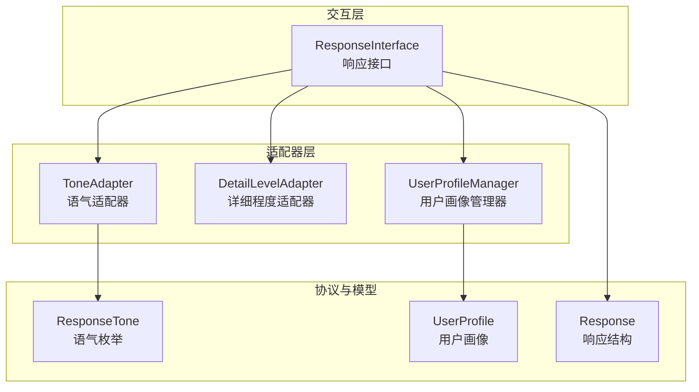
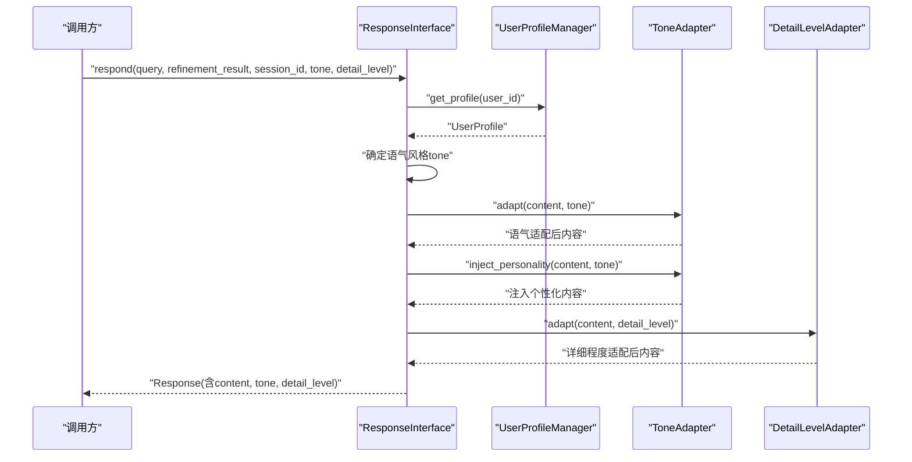
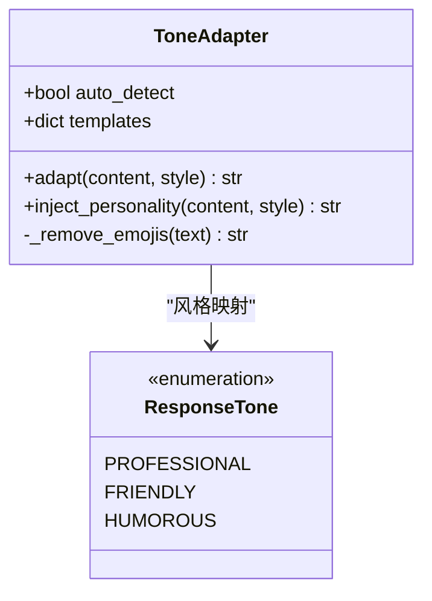
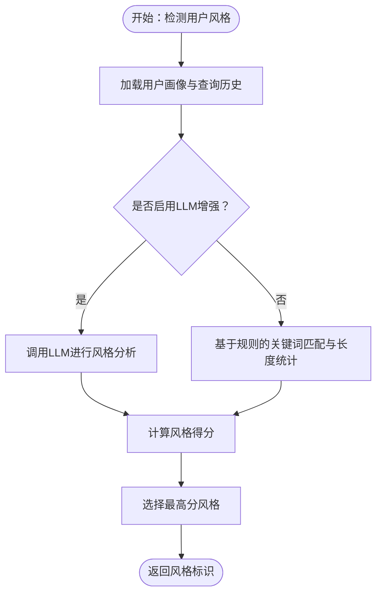
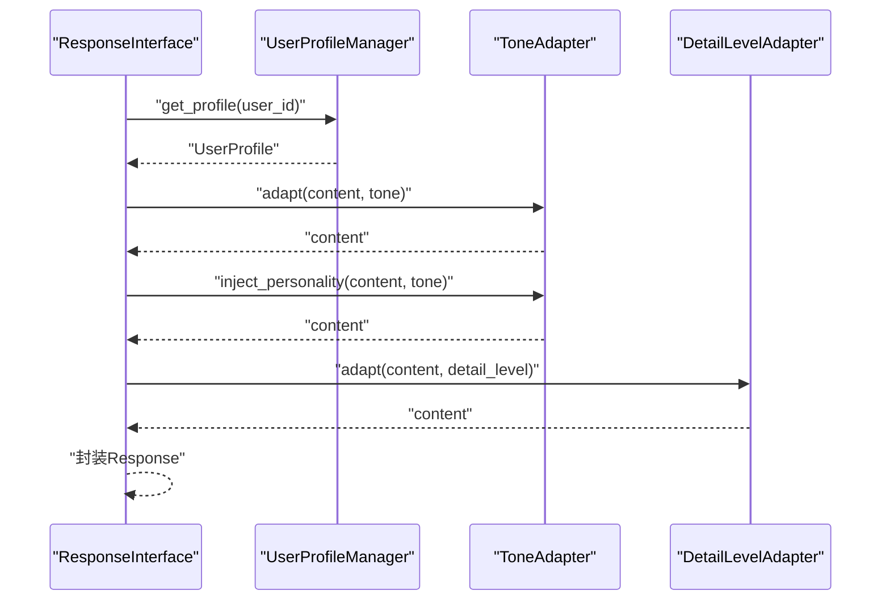
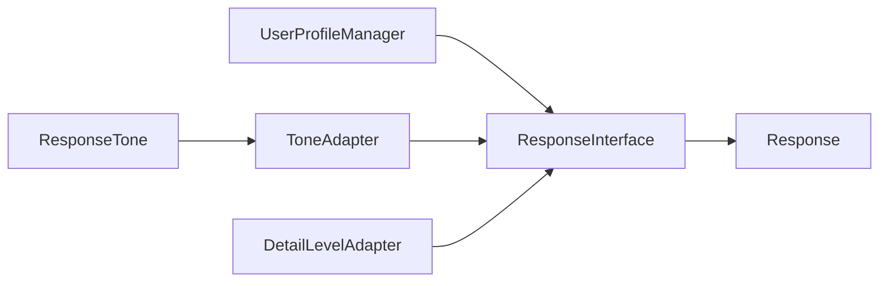

# 语气适配器

<cite>
**本文引用的文件**
- [tone_adapter.py](file://src/response/tone_adapter.py)
- [profile_manager.py](file://src/response/profile_manager.py)
- [interface.py](file://src/response/interface.py)
- [models.py](file://src/response/models.py)
- [protocols.py](file://src/core/protocols.py)
- [detail_adapter.py](file://src/response/detail_adapter.py)
- [example_usage.py](file://example/example_usage.py)
</cite>

## 目录
1. [简介](#简介)
2. [项目结构](#项目结构)
3. [核心组件](#核心组件)
4. [架构总览](#架构总览)
5. [详细组件分析](#详细组件分析)
6. [依赖关系分析](#依赖关系分析)
7. [性能考量](#性能考量)
8. [故障排查指南](#故障排查指南)
9. [结论](#结论)
10. [附录](#附录)

## 简介
本文件面向NecoRAG的“语气适配器”模块，系统性阐述ToneAdapter类如何依据用户画像与交互场景，对标准回答进行语气风格调整。文档覆盖支持的语气风格类型、实现机制（词汇选择、句式结构、表达方式）、语气注入功能的使用方法，并提供不同场景下的适配示例与配置指导，帮助开发者与使用者高效落地情境化对话体验。

## 项目结构
围绕“语气适配器”的相关模块组织如下：
- 交互层响应接口：负责整合用户画像、语气与详细程度适配，并生成最终响应。
- 语气适配器：提供风格模板与注入策略，实现前缀/后缀、连接词与表情符号控制。
- 用户画像管理器：分析用户偏好与专业水平，为语气决策提供依据。
- 协议与数据模型：统一语气枚举、用户画像与响应结构，保证跨模块一致性。

图表来源
- [interface.py:20-140](file://src/response/interface.py#L20-L140)
- [tone_adapter.py:8-47](file://src/response/tone_adapter.py#L8-L47)
- [profile_manager.py:20-100](file://src/response/profile_manager.py#L20-L100)
- [protocols.py:51-64](file://src/core/protocols.py#L51-L64)

章节来源
- [interface.py:20-140](file://src/response/interface.py#L20-L140)
- [tone_adapter.py:8-47](file://src/response/tone_adapter.py#L8-L47)
- [profile_manager.py:20-100](file://src/response/profile_manager.py#L20-L100)
- [protocols.py:51-64](file://src/core/protocols.py#L51-L64)

## 核心组件
- ToneAdapter：提供三种预设语气风格（专业严谨、亲切友好、幽默轻松），通过模板驱动的前缀/后缀、连接词与表情符号策略，实现对回答的语气适配与个性化注入。
- UserProfileManager：基于查询历史与规则/LLM检测，识别用户交互风格（简洁/详细/技术性/通俗化）与专业水平（初学者/中级/专家），为语气决策提供依据。
- ResponseInterface：在生成响应时，先确定语气风格（优先使用用户画像），再依次执行语气适配与详细程度适配，最后封装为统一响应结构。
- 协议与模型：ResponseTone枚举统一语气类型；UserProfile与Response结构承载用户画像与响应元数据，确保跨模块一致。

章节来源
- [tone_adapter.py:8-47](file://src/response/tone_adapter.py#L8-L47)
- [profile_manager.py:20-100](file://src/response/profile_manager.py#L20-L100)
- [interface.py:20-140](file://src/response/interface.py#L20-L140)
- [protocols.py:51-64](file://src/core/protocols.py#L51-L64)
- [models.py:13-31](file://src/response/models.py#L13-L31)

## 架构总览
交互层在respond流程中，按顺序调用用户画像管理、语气适配与详细程度适配，最终产出包含语气与详细程度的响应对象。ToneAdapter的模板机制与注入策略贯穿其中，确保输出既符合用户偏好，又保持表达的一致性与可解释性。

图表来源
- [interface.py:59-140](file://src/response/interface.py#L59-L140)
- [tone_adapter.py:49-109](file://src/response/tone_adapter.py#L49-L109)
- [detail_adapter.py:64-94](file://src/response/detail_adapter.py#L64-L94)

章节来源
- [interface.py:59-140](file://src/response/interface.py#L59-L140)

## 详细组件分析

### ToneAdapter：语气风格与注入策略
- 支持的语气风格
  - 专业严谨（对应ResponseTone枚举中的专业风格）
  - 亲切友好（默认风格之一）
  - 幽默轻松（带前缀与表情符号）
- 模板机制
  - 每种风格包含前缀、后缀、连接词集合与是否避免表情符号的标志位。
  - adapt方法负责添加前后缀与表情符号处理；inject_personality方法在多段内容中注入连接词，提升表达连贯性。
- 适用场景
  - 面向不同用户群体（学生、工程师、管理者）的差异化表达。
  - 不同交互目标（教学、咨询、娱乐）的风格切换。
- 使用建议
  - 优先通过用户画像自动推断语气风格；必要时显式指定以覆盖默认行为。
  - 在需要强调连贯性与可读性的长文本中，配合inject_personality使用。

图表来源
- [tone_adapter.py:8-138](file://src/response/tone_adapter.py#L8-L138)
- [protocols.py:51-56](file://src/core/protocols.py#L51-L56)

章节来源
- [tone_adapter.py:8-138](file://src/response/tone_adapter.py#L8-L138)
- [protocols.py:51-56](file://src/core/protocols.py#L51-L56)

### UserProfileManager：用户画像与风格偏好
- 专业水平检测
  - 基于关键词权重与查询复杂度，识别初学者/中级/专家。
  - 支持规则检测与LLM增强两种模式。
- 交互风格检测
  - 识别简洁/详细/技术性/通俗化偏好，支持规则与LLM两种模式。
- 画像更新与缓存
  - 维护查询历史、更新时间与缓存，便于后续决策。
- 与语气适配的关系
  - ResponseInterface在生成响应时，若未显式指定语气，则优先采用用户画像中的交互风格。

图表来源
- [profile_manager.py:210-332](file://src/response/profile_manager.py#L210-L332)
- [profile_manager.py:340-467](file://src/response/profile_manager.py#L340-L467)

章节来源
- [profile_manager.py:210-332](file://src/response/profile_manager.py#L210-L332)
- [profile_manager.py:340-467](file://src/response/profile_manager.py#L340-L467)

### ResponseInterface：响应生成与适配编排
- 生成流程
  - 获取用户画像，确定语气风格（优先使用画像风格）。
  - 语气适配：先adapt，再inject_personality。
  - 详细程度适配：根据用户专业水平与查询复杂度自动确定。
  - 生成思维链可视化，封装为统一响应对象。
- 与ToneAdapter的协作
  - adapt与inject_personality在respond中被连续调用，确保语气与个性化表达同时生效。

图表来源
- [interface.py:59-140](file://src/response/interface.py#L59-L140)

章节来源
- [interface.py:59-140](file://src/response/interface.py#L59-L140)

### 与详细程度适配的协同
- DetailLevelAdapter提供四档详细程度（简洁/标准/详细/深度分析），与ToneAdapter共同决定最终输出的可读性与信息密度。
- 在交互层中，先进行语气适配，再进行详细程度适配，确保语气与信息密度的双重适配。

章节来源
- [detail_adapter.py:18-94](file://src/response/detail_adapter.py#L18-L94)

## 依赖关系分析
- ToneAdapter依赖ResponseTone枚举，确保风格标识与协议一致。
- ResponseInterface依赖UserProfileManager与ToneAdapter，形成“画像→语气→内容”的适配链。
- UserProfileManager内部使用规则与可选LLM进行风格与专业水平检测，为语气决策提供输入。
- ResponseInterface依赖DetailLevelAdapter，实现详细程度的二次适配。

图表来源
- [protocols.py:51-64](file://src/core/protocols.py#L51-L64)
- [tone_adapter.py:8-47](file://src/response/tone_adapter.py#L8-L47)
- [interface.py:20-140](file://src/response/interface.py#L20-L140)
- [detail_adapter.py:18-94](file://src/response/detail_adapter.py#L18-L94)

章节来源
- [protocols.py:51-64](file://src/core/protocols.py#L51-L64)
- [interface.py:20-140](file://src/response/interface.py#L20-L140)

## 性能考量
- ToneAdapter的emoji移除与连接词注入均为轻量字符串处理，开销极低。
- UserProfileManager的风格检测在无LLM时为O(n)规则扫描；启用LLM时受外部模型调用影响，需关注延迟与稳定性。
- ResponseInterface在生成响应时串行执行语气与详细程度适配，适合大多数交互场景；若需更高吞吐，可考虑并行化LLM调用（需评估资源与稳定性）。

## 故障排查指南
- 语气未生效
  - 检查是否显式指定了tone参数；若未指定，将回退至用户画像中的交互风格。
  - 确认ToneAdapter模板中对应风格是否存在，以及是否正确传入风格标识。
- 表情符号异常
  - 某些风格（如专业严谨）会移除表情符号；若期望保留，请确认所选风格与模板设置。
- 个性化注入无效
  - inject_personality仅在多段文本中生效；单段文本不会注入连接词。
- LLM增强不可用
  - UserProfileManager在LLM客户端缺失或调用失败时会退化为规则检测；检查外部模型配置与网络状态。

章节来源
- [tone_adapter.py:111-138](file://src/response/tone_adapter.py#L111-L138)
- [profile_manager.py:285-332](file://src/response/profile_manager.py#L285-L332)
- [interface.py:86-104](file://src/response/interface.py#L86-L104)

## 结论
ToneAdapter通过简洁而强大的模板机制，将“专业严谨/亲切友好/幽默轻松”三种风格无缝融入标准回答，配合UserProfileManager的画像分析与ResponseInterface的编排，实现了面向不同用户与场景的自适应语气输出。结合详细程度适配，可进一步平衡信息密度与可读性，满足多样化交互需求。

## 附录

### 支持的语气风格类型
- 专业严谨：适用于正式场合、技术文档、咨询场景，强调准确性与条理性。
- 亲切友好：适用于日常交流、教学场景，强调亲和力与可理解性。
- 幽默轻松：适用于娱乐、社交场景，强调趣味性与互动感。

章节来源
- [tone_adapter.py:12-16](file://src/response/tone_adapter.py#L12-L16)
- [protocols.py:51-56](file://src/core/protocols.py#L51-L56)

### 语气注入功能使用方法
- 适用场景
  - 需要在多段回答中增加过渡与连贯性时，调用inject_personality以注入连接词。
- 使用步骤
  - 先调用adapt进行基础语气适配。
  - 再调用inject_personality进行个性化注入。
  - 若内容为单段文本，注入效果有限，可直接使用adapt。

章节来源
- [tone_adapter.py:77-109](file://src/response/tone_adapter.py#L77-L109)

### 不同场景下的语气适配示例与配置指导
- 场景一：学生提问基础概念
  - 建议风格：亲切友好
  - 配置：未显式指定时，UserProfileManager可识别“简单/基础”关键词，倾向友好风格；或在调用时显式传入友好风格。
- 场景二：技术咨询与方案讨论
  - 建议风格：专业严谨
  - 配置：通过UserProfileManager识别“技术/实现/原理”等关键词，倾向专业风格；或显式指定专业风格。
- 场景三：社区问答与闲聊
  - 建议风格：幽默轻松
  - 配置：通过UserProfileManager识别“通俗/易懂/举例”等关键词，倾向友好风格；或显式指定幽默风格。
- 场景四：复杂问题的逐步解释
  - 建议风格：亲切友好 + 详细解释
  - 配置：先进行语气适配，再通过DetailLevelAdapter将内容扩展为详细解释，提升可读性与理解度。

章节来源
- [profile_manager.py:56-75](file://src/response/profile_manager.py#L56-L75)
- [profile_manager.py:236-284](file://src/response/profile_manager.py#L236-L284)
- [interface.py:86-107](file://src/response/interface.py#L86-L107)

### 代码示例路径参考
- 完整使用示例（包含响应接口与语气适配）
  - [example_usage.py:176-215](file://example/example_usage.py#L176-L215)

章节来源
- [example_usage.py:176-215](file://example/example_usage.py#L176-L215)