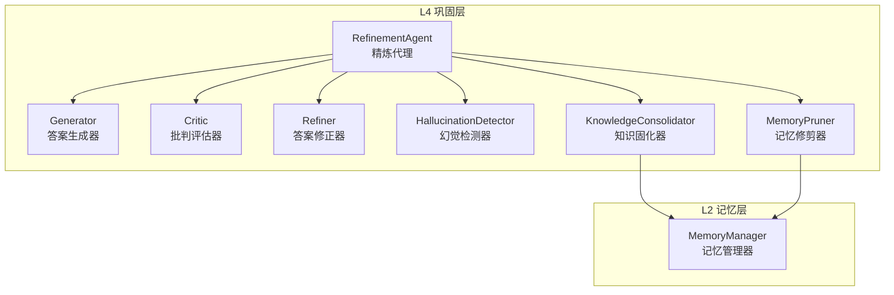
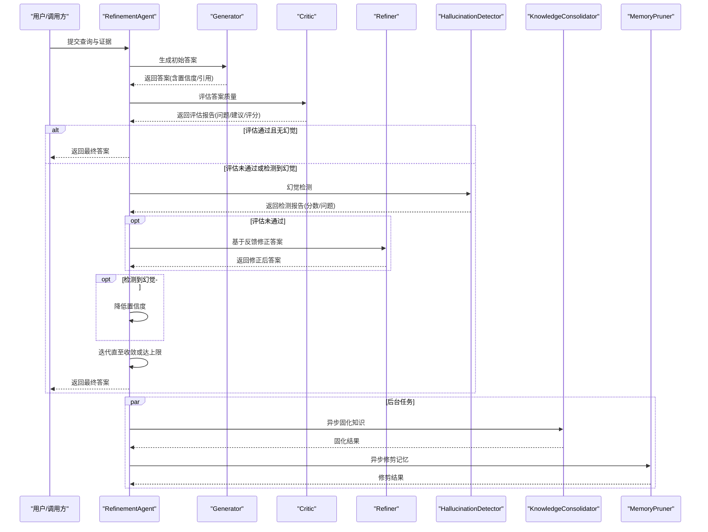
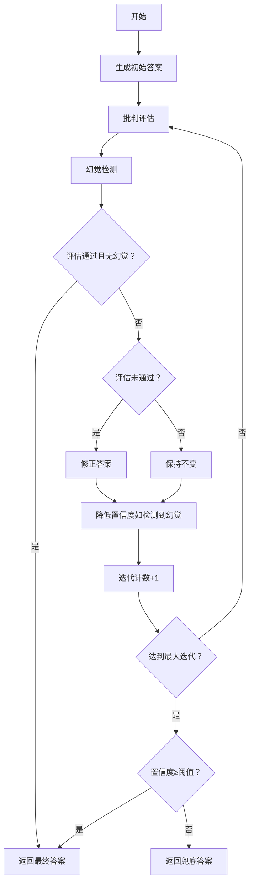
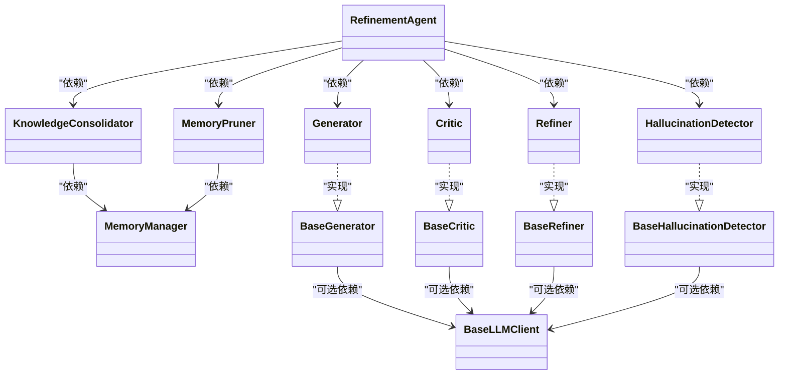

# 巩固层 (L4)

<cite>
**本文引用的文件**
- [src/refinement/agent.py](file://src/refinement/agent.py)
- [src/refinement/generator.py](file://src/refinement/generator.py)
- [src/refinement/critic.py](file://src/refinement/critic.py)
- [src/refinement/refiner.py](file://src/refinement/refiner.py)
- [src/refinement/hallucination.py](file://src/refinement/hallucination.py)
- [src/refinement/consolidator.py](file://src/refinement/consolidator.py)
- [src/refinement/pruner.py](file://src/refinement/pruner.py)
- [src/refinement/models.py](file://src/refinement/models.py)
- [src/memory/manager.py](file://src/memory/manager.py)
- [src/core/base.py](file://src/core/base.py)
- [src/necorag.py](file://src/necorag.py)
- [example/example_usage.py](file://example/example_usage.py)
- [README.md](file://README.md)
</cite>

## 目录
1. [简介](#简介)
2. [项目结构](#项目结构)
3. [核心组件](#核心组件)
4. [架构总览](#架构总览)
5. [详细组件分析](#详细组件分析)
6. [依赖分析](#依赖分析)
7. [性能考量](#性能考量)
8. [故障排查指南](#故障排查指南)
9. [结论](#结论)
10. [附录](#附录)

## 简介
巩固层（L4）是 NecoRAG 的“反思与巩固”中枢，负责在答案生成后进行质量评估与迭代优化，并通过幻觉检测保障事实准确性。同时，它承担“异步知识固化”和“记忆修剪”的职责，将临时检索证据与生成答案转化为结构化、可复用的长期知识，维持知识库的健康与高效。

- 核心闭环：Generator → Critic → Refiner
- 质量保障：幻觉检测（事实一致性、逻辑连贯性、证据支撑度）
- 知识管理：知识固化（去重、合并、持久化）、记忆修剪（噪声清理、过时淘汰）

## 项目结构
围绕 L4 的关键文件组织如下：
- 精炼代理与子组件：RefinementAgent、Generator、Critic、Refiner、HallucinationDetector
- 知识管理：KnowledgeConsolidator、MemoryPruner、MemoryManager
- 数据模型：RefinementResult、GeneratedAnswer、CritiqueReport、HallucinationReport、KnowledgeGap、QueryPattern
- 统一入口与示例：NecoRAG、example_usage.py

图表来源
- [src/refinement/agent.py:20-164](file://src/refinement/agent.py#L20-L164)
- [src/refinement/generator.py:16-209](file://src/refinement/generator.py#L16-L209)
- [src/refinement/critic.py:18-309](file://src/refinement/critic.py#L18-L309)
- [src/refinement/refiner.py:18-371](file://src/refinement/refiner.py#L18-L371)
- [src/refinement/hallucination.py:18-507](file://src/refinement/hallucination.py#L18-L507)
- [src/refinement/consolidator.py:41-659](file://src/refinement/consolidator.py#L41-L659)
- [src/refinement/pruner.py:10-157](file://src/refinement/pruner.py#L10-L157)
- [src/memory/manager.py:20-212](file://src/memory/manager.py#L20-L212)

章节来源
- [src/refinement/agent.py:20-164](file://src/refinement/agent.py#L20-L164)
- [src/refinement/consolidator.py:41-659](file://src/refinement/consolidator.py#L41-L659)
- [src/refinement/pruner.py:10-157](file://src/refinement/pruner.py#L10-L157)
- [src/memory/manager.py:20-212](file://src/memory/manager.py#L20-L212)

## 核心组件
- 精炼代理（RefinementAgent）：协调 Generator、Critic、Refiner、HallucinationDetector 的执行，控制迭代与收敛，触发后台知识固化与修剪任务。
- 答案生成器（Generator）：基于检索证据生成答案，支持 LLM 与规则两种策略，估算置信度。
- 批判评估器（Critic）：多维度评估答案（事实性、完整性、相关性），输出质量评分与问题清单。
- 答案修正器（Refiner）：依据批判反馈迭代修正答案，融合补充证据，动态调整置信度。
- 幻觉检测器（HallucinationDetector）：检测事实一致性、逻辑连贯性与证据支撑度，识别潜在幻觉。
- 知识固化器（KnowledgeConsolidator）：识别知识缺口、去重合并、持久化 QA 对、更新图谱连接。
- 记忆修剪器（MemoryPruner）：识别噪声、低质量与过时记忆，执行修剪与强化。

章节来源
- [src/refinement/agent.py:20-164](file://src/refinement/agent.py#L20-L164)
- [src/refinement/generator.py:16-209](file://src/refinement/generator.py#L16-L209)
- [src/refinement/critic.py:18-309](file://src/refinement/critic.py#L18-L309)
- [src/refinement/refiner.py:18-371](file://src/refinement/refiner.py#L18-L371)
- [src/refinement/hallucination.py:18-507](file://src/refinement/hallucination.py#L18-L507)
- [src/refinement/consolidator.py:41-659](file://src/refinement/consolidator.py#L41-L659)
- [src/refinement/pruner.py:10-157](file://src/refinement/pruner.py#L10-L157)

## 架构总览
L4 的工作机制以“生成-评估-修正-检测-固化-修剪”为主线，形成闭环与异步维护：

图表来源
- [src/refinement/agent.py:65-164](file://src/refinement/agent.py#L65-L164)
- [src/refinement/generator.py:68-141](file://src/refinement/generator.py#L68-L141)
- [src/refinement/critic.py:90-193](file://src/refinement/critic.py#L90-L193)
- [src/refinement/refiner.py:98-244](file://src/refinement/refiner.py#L98-L244)
- [src/refinement/hallucination.py:136-193](file://src/refinement/hallucination.py#L136-L193)
- [src/refinement/consolidator.py:105-160](file://src/refinement/consolidator.py#L105-L160)
- [src/refinement/pruner.py:41-69](file://src/refinement/pruner.py#L41-L69)

## 详细组件分析

### 精炼代理（RefinementAgent）
- 职责：协调生成、评估、修正、检测与后台任务；控制最大迭代次数与最低置信度阈值；在迭代中根据评估与幻觉检测结果决定是否继续。
- 决策逻辑：
  - 若评估通过且无幻觉，直接返回；
  - 若评估未通过，调用 Refiner 修正；
  - 若检测到幻觉，降低置信度；
  - 达到最大迭代次数后，若置信度仍低于阈值则返回兜底答案。
- 后台任务：运行 KnowledgeConsolidator 与 MemoryPruner，异步完成知识固化与记忆修剪。

图表来源
- [src/refinement/agent.py:65-141](file://src/refinement/agent.py#L65-L141)

章节来源
- [src/refinement/agent.py:31-164](file://src/refinement/agent.py#L31-L164)

### 答案生成器（Generator）
- 职责：基于检索证据生成答案，支持 LLM 与规则两种策略；估算置信度（考虑证据数量、答案长度、关键词覆盖）。
- 规则策略：简单拼接证据要点，给出基础置信度。
- LLM 策略：构造提示词，调用 LLM 生成，再估算置信度。

章节来源
- [src/refinement/generator.py:16-209](file://src/refinement/generator.py#L16-L209)

### 批判评估器（Critic）
- 职责：多维度评估答案质量，输出质量评分与问题清单。
- 评估维度：事实性、完整性、相关性，加权综合评分。
- 评估流程：先尝试 LLM 评估，失败则退化到规则评估（基于证据引用、置信度、答案长度、关键词重叠等）。

章节来源
- [src/refinement/critic.py:18-309](file://src/refinement/critic.py#L18-L309)

### 答案修正器（Refiner）
- 职责：根据批判反馈迭代修正答案，融合补充证据，动态调整置信度。
- 修正流程：构造提示词，调用 LLM 生成修正答案；若 LLM 失败则退化为规则修正（扩展答案、融合证据要点）。
- 置信度调整：基于原置信度与质量评分进行微调，避免过度乐观。

章节来源
- [src/refinement/refiner.py:18-371](file://src/refinement/refiner.py#L18-L371)

### 幻觉检测器（HallucinationDetector）
- 职责：检测事实一致性、逻辑连贯性与证据支撑度，识别潜在幻觉。
- 检测流程：先尝试 LLM 三类检测，失败则退化到规则检测（关键词重叠、否定冲突、逻辑连接词、声明覆盖度等）。
- 结果：输出是否幻觉及各项分数与问题列表。

章节来源
- [src/refinement/hallucination.py:18-507](file://src/refinement/hallucination.py#L18-L507)

### 知识固化器（KnowledgeConsolidator）
- 职责：识别高频未命中查询（知识缺口），自动补充知识，去重合并碎片化知识，持久化高质量 QA 对，更新图谱连接。
- 关键步骤：分析查询模式 → 识别知识缺口 → 填补缺口 → 处理待固化 QA 对（去重、存储）→ 合并碎片 → 更新图谱 → 返回统计结果。
- 统计指标：存储数量、去重数量、合并数量、识别缺口数、耗时等。

章节来源
- [src/refinement/consolidator.py:41-659](file://src/refinement/consolidator.py#L41-L659)

### 记忆修剪器（MemoryPruner）
- 职责：模拟“猫舔毛”行为，清理噪声、强化重要连接、保持知识“光泽”。
- 识别标准：噪声（低权重且低访问）、低质量（短内容且低权重）、过时（超出时间阈值）。
- 处理动作：移除、强化权重。

章节来源
- [src/refinement/pruner.py:10-157](file://src/refinement/pruner.py#L10-L157)

### 数据模型
- RefinementResult：精炼结果，包含查询、答案、置信度、引用、幻觉报告、迭代次数等。
- GeneratedAnswer：生成的答案，包含内容、引用、置信度与元数据。
- CritiqueReport：批判报告，包含有效性、问题、建议、质量评分。
- HallucinationReport：幻觉报告，包含是否幻觉、各项分数与问题列表。
- KnowledgeGap、QueryPattern：知识缺口与查询模式的数据结构。

章节来源
- [src/refinement/models.py:9-66](file://src/refinement/models.py#L9-L66)

## 依赖分析
- 组件耦合：
  - RefinementAgent 依赖 Generator、Critic、Refiner、HallucinationDetector、KnowledgeConsolidator、MemoryPruner。
  - KnowledgeConsolidator 与 MemoryPruner 依赖 MemoryManager 进行持久化与图谱操作。
  - 各组件均实现 BaseGenerator、BaseCritic、BaseRefiner、BaseHallucinationDetector 抽象接口，便于替换与扩展。
- 外部依赖：
  - LLM 客户端（BaseLLMClient）用于生成与评估；在未提供时使用 Mock 实现。
  - 记忆层（MemoryManager）提供统一存储与检索接口。

图表来源
- [src/refinement/agent.py:5-14](file://src/refinement/agent.py#L5-L14)
- [src/refinement/generator.py:10-13](file://src/refinement/generator.py#L10-L13)
- [src/refinement/critic.py:12-15](file://src/refinement/critic.py#L12-L15)
- [src/refinement/refiner.py:12-15](file://src/refinement/refiner.py#L12-L15)
- [src/refinement/hallucination.py:12-15](file://src/refinement/hallucination.py#L12-L15)
- [src/refinement/consolidator.py:12-15](file://src/refinement/consolidator.py#L12-L15)
- [src/refinement/pruner.py:6-7](file://src/refinement/pruner.py#L6-L7)
- [src/memory/manager.py:9-13](file://src/memory/manager.py#L9-L13)
- [src/core/base.py:438-528](file://src/core/base.py#L438-L528)

章节来源
- [src/core/base.py:438-528](file://src/core/base.py#L438-L528)

## 性能考量
- 迭代次数与收敛：通过 max_iterations 控制，避免无限循环；min_confidence 作为兜底阈值，防止低质量答案输出。
- LLM 调用成本：在 LLM 失败时自动退化到规则策略，保证稳定性与性能。
- 异步任务：知识固化与记忆修剪在后台执行，不影响主流程响应时间。
- 置信度估计：生成与修正过程均考虑证据数量、答案长度与关键词覆盖，减少无效迭代。
- 建议：
  - 根据业务场景调整 max_iterations 与 min_confidence。
  - 在高并发场景下，优先启用规则策略以降低 LLM 调用开销。
  - 定期运行后台任务，保持知识库新鲜度与一致性。

## 故障排查指南
- 幻觉频繁出现
  - 检查 HallucinationDetector 的阈值设置与证据质量。
  - 增加 Refiner 的迭代次数或补充证据。
- 评估分数偏低
  - 检查 Critic 的权重配置与证据引用是否充分。
  - 优化提示词与温度参数。
- 精炼效率低
  - 适当降低 max_iterations 或提高 min_confidence。
  - 确认 Refiner 的规则修正是否有效。
- 知识固化/修剪异常
  - 检查 MemoryManager 的存储接口与权限。
  - 关注 ConsolidationResult 与 Pruning 结果中的统计信息。

章节来源
- [src/refinement/hallucination.py:136-193](file://src/refinement/hallucination.py#L136-L193)
- [src/refinement/critic.py:90-193](file://src/refinement/critic.py#L90-L193)
- [src/refinement/refiner.py:98-175](file://src/refinement/refiner.py#L98-L175)
- [src/refinement/consolidator.py:105-160](file://src/refinement/consolidator.py#L105-L160)
- [src/refinement/pruner.py:41-69](file://src/refinement/pruner.py#L41-L69)

## 结论
L4 巩固层通过“生成-评估-修正-检测-固化-修剪”的闭环与异步维护，显著提升了答案的准确性与知识库的可持续演进能力。其模块化设计与抽象接口便于在不同场景下灵活替换与扩展，同时提供了完善的性能与稳定性保障。

## 附录

### 幻觉检测算法实现要点
- LLM 三类检测：事实一致性、逻辑连贯性、证据支撑度；失败时回退到规则检测。
- 规则检测：关键词重叠、否定冲突、逻辑连接词、声明覆盖度等。
- 输出：是否幻觉、各项分数与问题列表。

章节来源
- [src/refinement/hallucination.py:136-339](file://src/refinement/hallucination.py#L136-L339)

### 精炼参数调优策略
- max_iterations：根据复杂度与 SLA 调整，避免过长或过短。
- min_confidence：结合业务容忍度设定兜底阈值。
- 评估权重：factuality_weight、completeness_weight、relevance_weight，依据领域特点平衡。
- 温度参数：Generator 与 Refiner 的 temperature 控制创造性与稳定性。

章节来源
- [src/refinement/agent.py:31-50](file://src/refinement/agent.py#L31-L50)
- [src/refinement/critic.py:28-47](file://src/refinement/critic.py#L28-L47)
- [src/refinement/generator.py:26-42](file://src/refinement/generator.py#L26-L42)
- [src/refinement/refiner.py:28-44](file://src/refinement/refiner.py#L28-L44)

### 性能监控方案
- 统计指标：迭代次数、置信度分布、幻觉检测比例、固化/修剪数量与耗时。
- 后台任务监控：ConsolidationResult 与 Pruning 结果的元数据与耗时。
- 日志与告警：关键节点日志与异常捕获，结合外部监控系统。

章节来源
- [src/refinement/consolidator.py:150-160](file://src/refinement/consolidator.py#L150-L160)
- [src/refinement/pruner.py:63-69](file://src/refinement/pruner.py#L63-L69)
- [src/refinement/agent.py:143-164](file://src/refinement/agent.py#L143-L164)

### 精炼流程示例（基于示例代码）
- 使用 RefinementAgent 处理查询，传入检索证据，查看最终答案、置信度与幻觉报告。
- 可选：调用 run_background_tasks 执行异步知识固化与记忆修剪。

章节来源
- [example/example_usage.py:139-173](file://example/example_usage.py#L139-L173)
- [src/refinement/agent.py:143-164](file://src/refinement/agent.py#L143-L164)