# 批评家 (Critic)

<cite>
**本文档引用的文件**
- [critic.py](file://src/refinement/critic.py)
- [models.py](file://src/refinement/models.py)
- [agent.py](file://src/refinement/agent.py)
- [generator.py](file://src/refinement/generator.py)
- [hallucination.py](file://src/refinement/hallucination.py)
- [refiner.py](file://src/refinement/refiner.py)
- [base.py](file://src/core/base.py)
- [base.py](file://src/core/llm/base.py)
- [example_usage.py](file://example/example_usage.py)
- [README.md](file://README.md)
</cite>

## 目录
1. [简介](#简介)
2. [项目结构](#项目结构)
3. [核心组件](#核心组件)
4. [架构概览](#架构概览)
5. [详细组件分析](#详细组件分析)
6. [依赖分析](#依赖分析)
7. [性能考虑](#性能考虑)
8. [故障排除指南](#故障排除指南)
9. [结论](#结论)
10. [附录](#附录)

## 简介

批评家(Critic)是 NecoRAG 精炼代理系统中的关键质量控制组件，负责对生成的答案进行全面的质量评估。作为"Generator → Critic → Refiner"闭环中的核心环节，批评家承担着以下关键职责：

- **多维度质量评估**：对答案的准确性、完整性、相关性进行综合评判
- **事实性验证**：检查答案与证据的一致性，识别事实性错误
- **完整性分析**：评估答案是否完整回答了用户问题
- **相关性评估**：判断答案内容与问题的相关程度
- **问题识别与改进建议**：自动识别潜在问题并提供具体的改进建议
- **质量评分机制**：建立标准化的质量评分体系，支持自动化决策

批评家的设计体现了认知科学中的"反思"机制，通过多层次的评估确保生成答案的可靠性，为后续的幻觉检测和答案修正提供坚实基础。

## 项目结构

NecoRAG 采用五层认知架构，批评家位于第四层"巩固层"，与生成器、修正器、幻觉检测器形成完整的质量控制闭环：

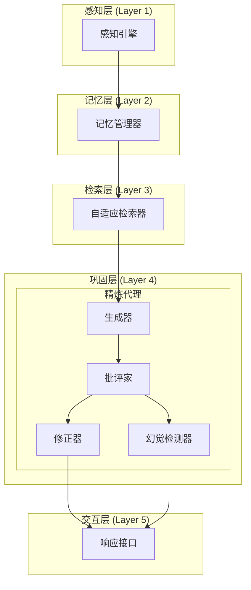

**图表来源**
- [README.md:35-85](file://README.md#L35-L85)
- [agent.py:20-30](file://src/refinement/agent.py#L20-L30)

**章节来源**
- [README.md:25-85](file://README.md#L25-L85)
- [agent.py:20-30](file://src/refinement/agent.py#L20-L30)

## 核心组件

批评家系统由多个核心组件构成，每个组件都有明确的职责分工：

### 主要组件架构

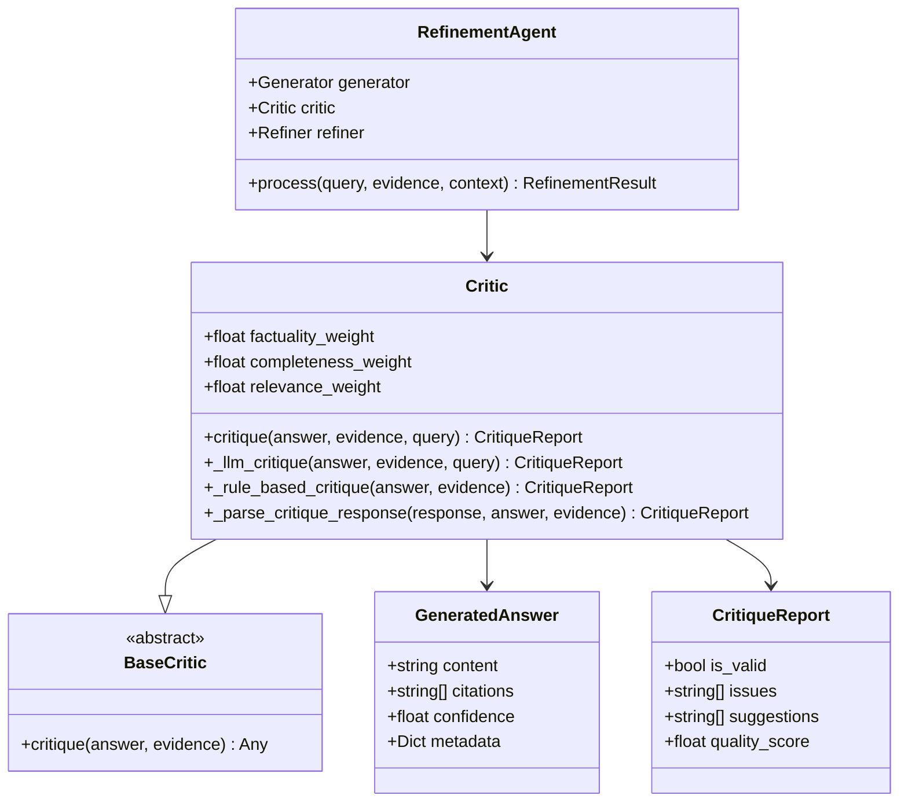

**图表来源**
- [critic.py:18-56](file://src/refinement/critic.py#L18-L56)
- [models.py:19-35](file://src/refinement/models.py#L19-L35)
- [base.py:462-482](file://src/core/base.py#L462-L482)
- [agent.py:20-64](file://src/refinement/agent.py#L20-L64)

### 评估维度设计

批评家采用三维度评估模型，每个维度都有明确的权重分配和评估标准：

| 评估维度 | 权重系数 | 评估重点 | 判定标准 |
|---------|---------|---------|---------|
| 事实性 (Factuality) | 0.4 | 事实准确性、证据一致性 | 与证据无矛盾，陈述准确 |
| 完整性 (Completeness) | 0.3 | 问题回答完整性、信息覆盖度 | 全面回答核心问题 |
| 相关性 (Relevance) | 0.3 | 内容相关性、避免无关信息 | 紧扣问题主题 |

**章节来源**
- [critic.py:18-56](file://src/refinement/critic.py#L18-L56)
- [models.py:29-35](file://src/refinement/models.py#L29-L35)

## 架构概览

批评家在整个 NecoRAG 系统中的位置和作用可以通过以下序列图来说明：

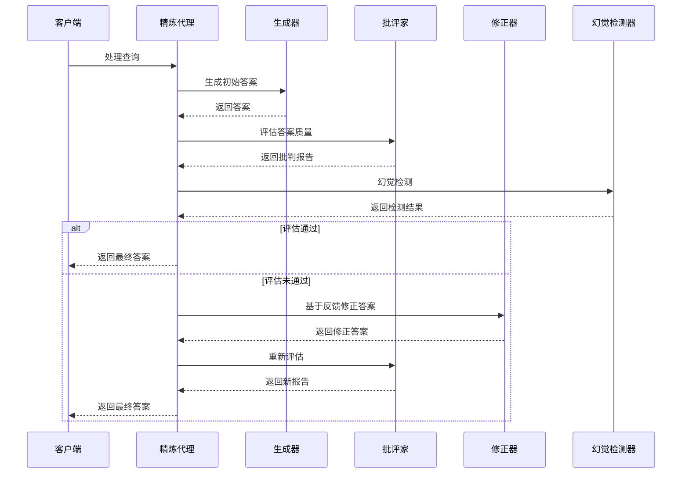

**图表来源**
- [agent.py:65-141](file://src/refinement/agent.py#L65-L141)
- [critic.py:90-113](file://src/refinement/critic.py#L90-L113)

### 评估流程详解

批评家的评估流程包含三个主要阶段：

1. **LLM 评估阶段**：使用大型语言模型进行深度分析
2. **规则评估阶段**：在 LLM 不可用时的降级方案
3. **回退解析阶段**：从 LLM 响应中提取关键信息

**章节来源**
- [agent.py:65-141](file://src/refinement/agent.py#L65-L141)
- [critic.py:90-309](file://src/refinement/critic.py#L90-L309)

## 详细组件分析

### 批评家核心算法

批评家的核心算法基于多层评估策略，确保在不同条件下都能提供可靠的评估结果：

#### LLM 评估算法

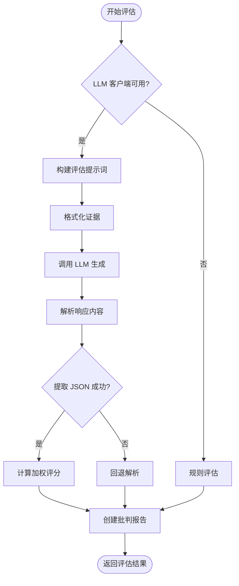

**图表来源**
- [critic.py:114-193](file://src/refinement/critic.py#L114-L193)

#### 规则评估算法

当 LLM 客户端不可用时，批评家会自动切换到规则评估模式：

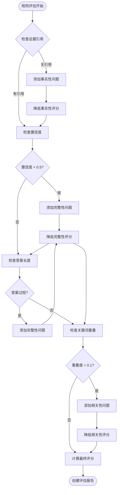

**图表来源**
- [critic.py:232-309](file://src/refinement/critic.py#L232-L309)

### 评估标准与评分机制

#### 质量评分计算

批评家采用加权平均的方式计算最终质量评分：

```
质量总分 = 事实性评分 × 0.4 + 完整性评分 × 0.3 + 相关性评分 × 0.3
```

评分范围：0.0 - 1.0，其中：
- **优秀**：≥ 0.8
- **良好**：0.6 - 0.8
- **一般**：0.4 - 0.6
- **较差**：< 0.4

#### 有效性判定标准

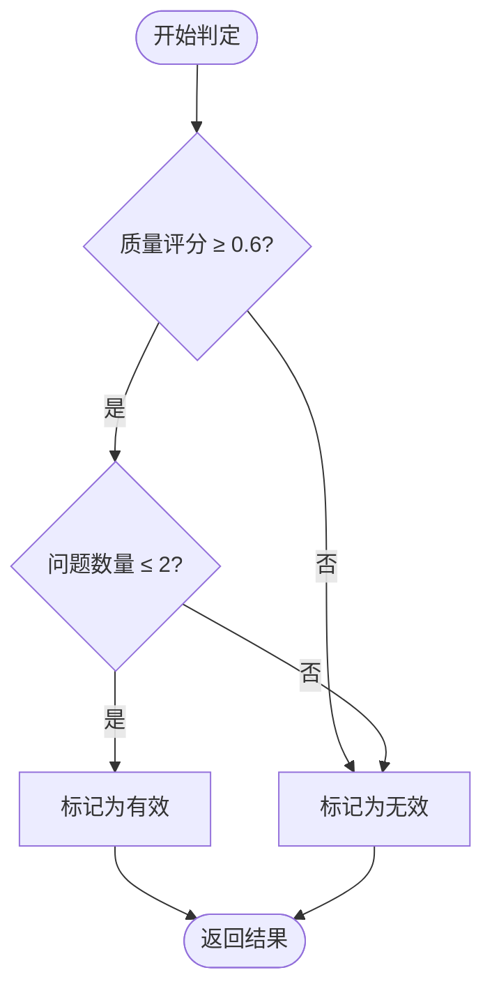

**图表来源**
- [critic.py:182-187](file://src/refinement/critic.py#L182-L187)

### 错误类型分类

批评家能够识别和分类多种类型的答案质量问题：

#### 事实性错误类型

| 错误类型 | 描述 | 识别特征 | 改进建议 |
|---------|------|---------|---------|
| 事实性错误 | 答案包含与证据矛盾的事实 | 明确的证据冲突 | 根据证据修正事实陈述 |
| 逻辑矛盾 | 答案内部存在逻辑冲突 | 自相矛盾的表述 | 检查并统一逻辑表述 |
| 时间错误 | 事实的时间信息不准确 | 过时或未来的信息 | 更新为准确的时间信息 |

#### 完整性问题类型

| 问题类型 | 描述 | 识别特征 | 改进建议 |
|---------|------|---------|---------|
| 信息缺失 | 答案遗漏关键信息 | 重要细节未提及 | 补充相关背景信息 |
| 结构不完整 | 答案结构混乱 | 缺少必要的组织结构 | 重新组织答案结构 |
| 方法不完整 | 缺少必要的步骤说明 | 操作指导不完整 | 补充详细的操作步骤 |

#### 相关性问题类型

| 问题类型 | 描述 | 识别特征 | 改进建议 |
|---------|------|---------|---------|
| 跑题 | 答案偏离主题 | 与问题无关的内容 | 紧扣问题核心重新组织 |
| 冗余信息 | 包含不必要的信息 | 大量无关内容 | 精简无关信息，突出重点 |
| 重复内容 | 答案中存在重复表述 | 相同信息多次出现 | 合并重复内容，提高效率 |

**章节来源**
- [critic.py:143-193](file://src/refinement/critic.py#L143-L193)
- [critic.py:232-309](file://src/refinement/critic.py#L232-L309)

### 改进建议生成机制

批评家不仅识别问题，还能自动生成针对性的改进建议：

#### 建议生成策略

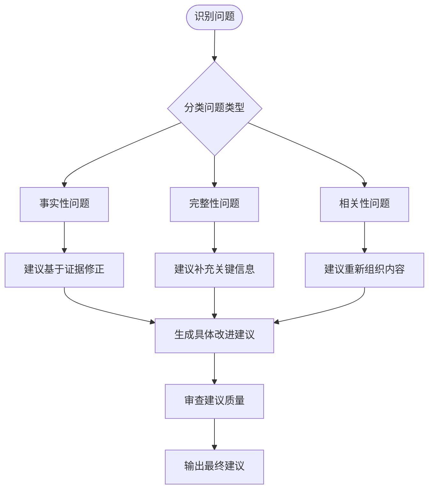

**图表来源**
- [critic.py:177-181](file://src/refinement/critic.py#L177-L181)

### 处理不同类型证据的能力

批评家能够处理多种类型的证据，并根据不同证据特点调整评估策略：

#### 证据类型处理

| 证据类型 | 处理方式 | 评估重点 |
|---------|---------|---------|
| 结构化数据 | 直接引用验证 | 数据准确性、完整性 |
| 非结构化文本 | 关键词匹配分析 | 内容相关性、信息提取 |
| 多媒体内容 | 跨模态验证 | 视觉/文本一致性 |
| 外部链接 | 链接有效性验证 | 来源可信度、内容一致性 |

#### 证据质量评估

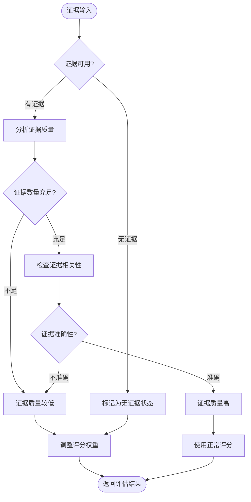

**图表来源**
- [critic.py:123-127](file://src/refinement/critic.py#L123-L127)
- [critic.py:276-294](file://src/refinement/critic.py#L276-L294)

### 主观判断与客观标准的平衡

批评家在评估过程中需要平衡主观判断和客观标准：

#### 评估标准矩阵

| 评估维度 | 主观因素 | 客观因素 | 平衡策略 |
|---------|---------|---------|---------|
| 事实性 | 语义理解、上下文推断 | 事实核查、证据对比 | LLM 分析 + 规则验证 |
| 完整性 | 问题理解、需求分析 | 信息覆盖度、结构完整性 | 多角度检查 + 交叉验证 |
| 相关性 | 语义相似度、主题匹配 | 关键词重叠、语义距离 | 统计分析 + 专家判断 |

#### 质量控制机制

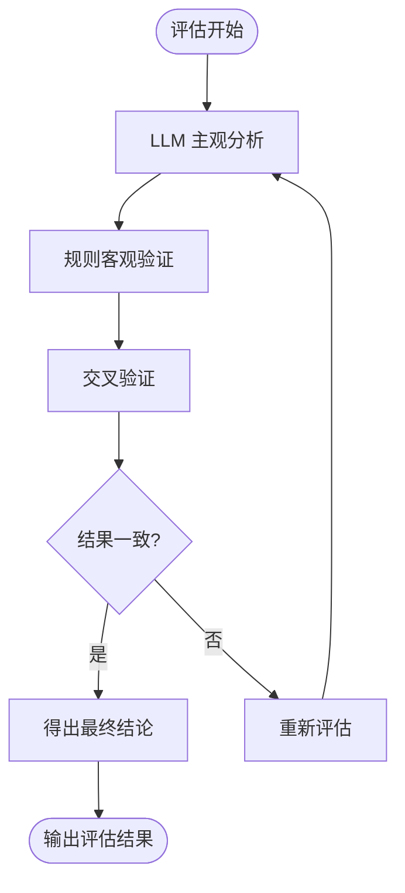

**图表来源**
- [critic.py:136-142](file://src/refinement/critic.py#L136-L142)
- [critic.py:194-231](file://src/refinement/critic.py#L194-L231)

### 可操作反馈的生成

批评家生成的反馈具有高度的可操作性：

#### 反馈结构化输出

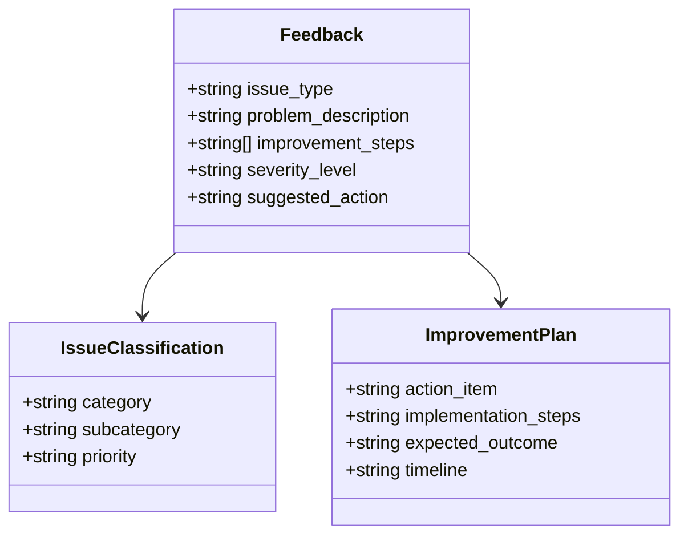

**图表来源**
- [critic.py:171-181](file://src/refinement/critic.py#L171-L181)

## 依赖分析

批评家系统的依赖关系相对简单，主要依赖于核心抽象层和数据模型：

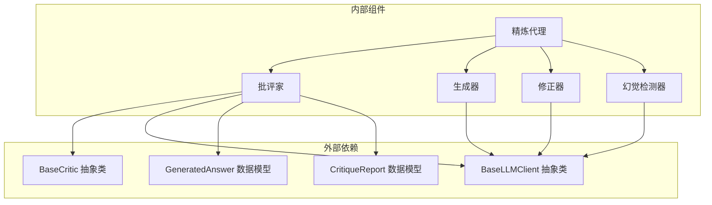

**图表来源**
- [critic.py:11-15](file://src/refinement/critic.py#L11-L15)
- [base.py:462-594](file://src/core/base.py#L462-L594)
- [models.py:19-35](file://src/refinement/models.py#L19-L35)

### 组件耦合度分析

批评家系统展现了良好的内聚性和低耦合性：

- **内聚性**：批评家专注于单一职责——质量评估，内聚性高
- **耦合度**：与核心抽象层耦合，与具体实现解耦
- **可替换性**：通过抽象接口支持不同 LLM 实现的替换

**章节来源**
- [base.py:462-594](file://src/core/base.py#L462-L594)
- [critic.py:11-15](file://src/refinement/critic.py#L11-L15)

## 性能考虑

### 评估性能优化

批评家在设计时充分考虑了性能优化：

#### LLM 调用优化

- **温度参数控制**：使用较低的温度值(0.3)确保评估结果的稳定性
- **提示词优化**：精心设计的提示词模板减少不必要的 token 消耗
- **错误处理**：完善的异常处理机制避免评估中断

#### 规则评估优化

- **快速路径**：在证据不足时快速返回评估结果
- **启发式规则**：基于经验的快速判断减少计算开销
- **缓存机制**：对常见模式的识别结果进行缓存

### 内存使用优化

- **证据处理**：只处理必要的证据片段，避免内存溢出
- **响应解析**：使用正则表达式进行高效解析
- **数据结构**：使用高效的 Python 数据结构存储中间结果

## 故障排除指南

### 常见问题及解决方案

#### LLM 客户端问题

**问题症状**：
- 评估结果不稳定
- 评估时间过长
- 评估失败异常

**解决方案**：
1. 检查 LLM 客户端配置
2. 验证 API 密钥和权限
3. 调整温度参数
4. 实施重试机制

#### 评估结果异常

**问题症状**：
- 评分过高或过低
- 问题识别不准确
- 建议不相关

**解决方案**：
1. 调整权重系数
2. 优化提示词模板
3. 增加规则验证
4. 实施人工复核

#### 性能问题

**问题症状**：
- 评估延迟过高
- 内存使用过多
- 并发处理能力不足

**解决方案**：
1. 实施批处理优化
2. 添加缓存机制
3. 使用异步处理
4. 实施资源池管理

**章节来源**
- [critic.py:136-142](file://src/refinement/critic.py#L136-L142)
- [critic.py:194-231](file://src/refinement/critic.py#L194-L231)

## 结论

批评家作为 NecoRAG 精炼代理系统的核心组件，在保证答案质量方面发挥着至关重要的作用。通过多维度评估、智能化的错误识别和可操作的改进建议，批评家为整个系统的可靠性提供了坚实保障。

### 主要优势

1. **全面性**：涵盖事实性、完整性、相关性三个维度的综合评估
2. **灵活性**：支持 LLM 评估和规则评估两种模式，适应不同场景
3. **可解释性**：提供详细的问题描述和改进建议
4. **自动化**：减少人工干预，提高评估效率
5. **可扩展性**：基于抽象接口设计，易于扩展和定制

### 应用价值

批评家不仅提升了 NecoRAG 系统的整体性能，还为其他 RAG 系统提供了可借鉴的质量控制模式。通过持续的优化和改进，批评家将继续在人工智能问答系统的质量保证中发挥重要作用。

## 附录

### 配置选项参考

#### 批评家配置参数

| 参数名称 | 类型 | 默认值 | 说明 |
|---------|------|--------|------|
| factuality_weight | float | 0.4 | 事实性评估权重 |
| completeness_weight | float | 0.3 | 完整性评估权重 |
| relevance_weight | float | 0.3 | 相关性评估权重 |
| temperature | float | 0.3 | LLM 评估温度参数 |
| quality_threshold | float | 0.6 | 质量判定阈值 |
| max_issues | int | 2 | 问题数量阈值 |

#### 使用示例

```python
# 基础使用
critic = Critic()

# 自定义权重
critic = Critic(
    factuality_weight=0.5,
    completeness_weight=0.25,
    relevance_weight=0.25
)

# 使用自定义 LLM 客户端
critic = Critic(custom_llm_client)
```

**章节来源**
- [critic.py:28-56](file://src/refinement/critic.py#L28-L56)
- [example_usage.py:147-173](file://example/example_usage.py#L147-L173)