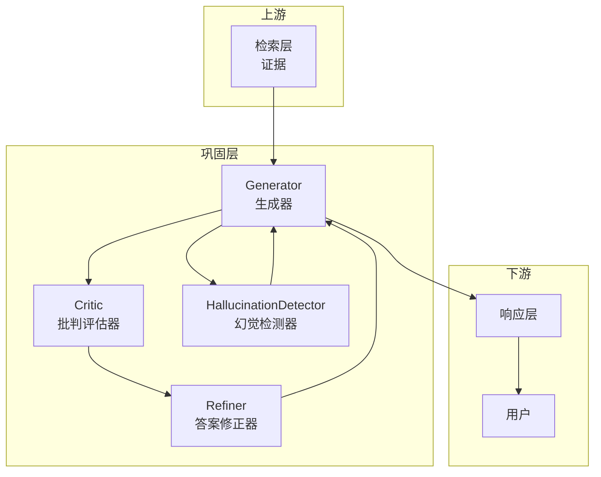
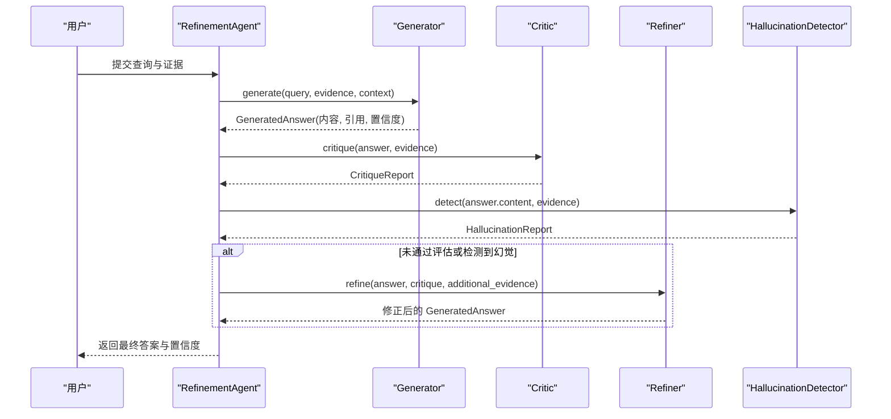
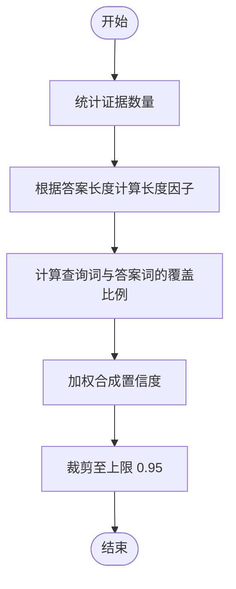
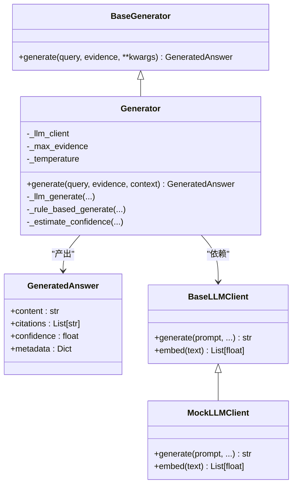

# 生成器（Generator）

<cite>
**本文档引用的文件**
- [src/refinement/generator.py](file://src/refinement/generator.py)
- [src/refinement/models.py](file://src/refinement/models.py)
- [src/refinement/agent.py](file://src/refinement/agent.py)
- [src/refinement/critic.py](file://src/refinement/critic.py)
- [src/refinement/refiner.py](file://src/refinement/refiner.py)
- [src/refinement/hallucination.py](file://src/refinement/hallucination.py)
- [src/core/base.py](file://src/core/base.py)
- [src/core/llm/base.py](file://src/core/llm/base.py)
- [src/core/llm/mock.py](file://src/core/llm/mock.py)
- [src/core/config.py](file://src/core/config.py)
- [src/necorag.py](file://src/necorag.py)
- [example/example_usage.py](file://example/example_usage.py)
</cite>

## 目录
1. [简介](#简介)
2. [项目结构](#项目结构)
3. [核心组件](#核心组件)
4. [架构总览](#架构总览)
5. [详细组件分析](#详细组件分析)
6. [依赖关系分析](#依赖关系分析)
7. [性能考虑](#性能考虑)
8. [故障排查指南](#故障排查指南)
9. [结论](#结论)
10. [附录](#附录)

## 简介
本文件聚焦 NecoRAG 的“生成器（Generator）”组件，系统阐述其在答案生成过程中的核心职责与工作机制，包括：
- 如何基于检索证据生成初始答案
- 置信度计算机制与引用标注规则
- 提示工程策略与上下文利用方式
- 多轮对话与证据类型处理能力
- 平衡信息完整性与准确性、避免信息泄露的策略
- 配置参数、性能调优方法与常见问题解决方案

## 项目结构
生成器位于“巩固层（Refinement）”中，与“批判（Critic）”、“修正（Refiner）”、“幻觉检测（HallucinationDetector）”共同构成“生成-评估-修正-验证”的闭环。其上游为检索层提供的证据，下游为响应层与最终用户。

图表来源
- [src/refinement/generator.py](file://src/refinement/generator.py)
- [src/refinement/critic.py](file://src/refinement/critic.py)
- [src/refinement/refiner.py](file://src/refinement/refiner.py)
- [src/refinement/hallucination.py](file://src/refinement/hallucination.py)

章节来源
- [src/refinement/generator.py](file://src/refinement/generator.py)
- [src/refinement/agent.py](file://src/refinement/agent.py)

## 核心组件
- 生成器（Generator）：基于检索证据生成答案，支持 LLM 客户端依赖注入，具备规则回退与置信度估算能力。
- 数据模型（GeneratedAnswer）：统一的答案数据结构，包含内容、引用标识与置信度。
- 评估与修正链路：与 Critic、Refiner、HallucinationDetector 协同，形成“生成-评估-修正-验证”的闭环。

章节来源
- [src/refinement/generator.py](file://src/refinement/generator.py)
- [src/refinement/models.py](file://src/refinement/models.py)

## 架构总览
生成器在整体流程中的位置与交互如下：

图表来源
- [src/refinement/agent.py](file://src/refinement/agent.py)
- [src/refinement/generator.py](file://src/refinement/generator.py)
- [src/refinement/critic.py](file://src/refinement/critic.py)
- [src/refinement/refiner.py](file://src/refinement/refiner.py)
- [src/refinement/hallucination.py](file://src/refinement/hallucination.py)

## 详细组件分析

### 生成器（Generator）核心职责
- 输入：查询文本、证据列表、可选上下文
- 输出：GeneratedAnswer（内容、引用、置信度）
- 策略：优先使用 LLM 生成；若不可用则回退到规则生成
- 证据选择：限制最大证据数量，避免上下文过载
- 置信度：综合证据数量、答案长度、关键词覆盖度进行估算

章节来源
- [src/refinement/generator.py](file://src/refinement/generator.py)
- [src/refinement/models.py](file://src/refinement/models.py)

### 提示工程与上下文利用
- 提示词模板强调“基于证据作答”“明确说明证据不足”“清晰专业语言”“在答案中引用证据”
- 上下文信息以“上下文信息：...”形式拼接到提示词前部，便于模型在生成时遵循上下文约束
- 温度参数用于控制生成多样性，默认值兼顾创造性与稳定性

章节来源
- [src/refinement/generator.py](file://src/refinement/generator.py)

### 置信度计算机制
- 基于证据数量：证据越多，置信度越高，上限为 0.95
- 答案长度：在 100–500 字之间最佳，50–800 字次之
- 关键词覆盖：查询词与答案词的交集占比越高，置信度越高
- 最终置信度经裁剪，确保不超过上限

图表来源
- [src/refinement/generator.py](file://src/refinement/generator.py)

章节来源
- [src/refinement/generator.py](file://src/refinement/generator.py)

### 引用标注生成规则
- 引用 ID：按证据顺序生成“evidence_0”、“evidence_1”，…，用于标识答案中引用的证据来源
- 规则回退：即使无 LLM，也保证引用标识的存在，便于后续评估与溯源

章节来源
- [src/refinement/generator.py](file://src/refinement/generator.py)

### 多轮对话与证据类型处理
- 多轮对话：通过上下文参数传递历史信息，生成器在提示词中显式纳入上下文，使答案具备连贯性
- 证据类型：生成器接受字符串列表作为证据，不区分证据来源类型；在评估与修正阶段由 Critic/Refiner/HallucinationDetector 进一步处理

章节来源
- [src/refinement/generator.py](file://src/refinement/generator.py)
- [src/refinement/critic.py](file://src/refinement/critic.py)
- [src/refinement/refiner.py](file://src/refinement/refiner.py)
- [src/refinement/hallucination.py](file://src/refinement/hallucination.py)

### 与巩固层的协作
- RefinementAgent 调用生成器生成初始答案，随后进行批判评估与幻觉检测；若未通过，则进入修正阶段，直至满足质量阈值或达到最大迭代次数

章节来源
- [src/refinement/agent.py](file://src/refinement/agent.py)
- [src/refinement/generator.py](file://src/refinement/generator.py)

### 与 LLM 客户端的集成
- 依赖注入：可通过构造函数注入任意 BaseLLMClient 实现；若未提供，则自动降级为 MockLLMClient
- 统一抽象：BaseLLMClient 定义 generate/embed 接口，确保实现一致性
- MockLLMClient：提供确定性响应与向量，便于开发与测试

章节来源
- [src/refinement/generator.py](file://src/refinement/generator.py)
- [src/core/base.py](file://src/core/base.py)
- [src/core/llm/base.py](file://src/core/llm/base.py)
- [src/core/llm/mock.py](file://src/core/llm/mock.py)

## 依赖关系分析

图表来源
- [src/core/base.py](file://src/core/base.py)
- [src/core/llm/base.py](file://src/core/llm/base.py)
- [src/core/llm/mock.py](file://src/core/llm/mock.py)
- [src/refinement/generator.py](file://src/refinement/generator.py)
- [src/refinement/models.py](file://src/refinement/models.py)

章节来源
- [src/core/base.py](file://src/core/base.py)
- [src/core/llm/base.py](file://src/core/llm/base.py)
- [src/core/llm/mock.py](file://src/core/llm/mock.py)
- [src/refinement/generator.py](file://src/refinement/generator.py)
- [src/refinement/models.py](file://src/refinement/models.py)

## 性能考虑
- 证据数量控制：通过 max_evidence 限制输入证据数量，避免上下文过载与生成成本上升
- 温度参数：temperature 控制生成多样性，较低温度提升一致性，适合问答场景
- 规则回退：在 LLM 不可用时仍可生成结构化答案，保障系统可用性
- 置信度裁剪：防止过度乐观的置信度影响后续决策

章节来源
- [src/refinement/generator.py](file://src/refinement/generator.py)
- [src/core/llm/base.py](file://src/core/llm/base.py)

## 故障排查指南
- 无证据返回：当 evidence 为空时，生成器返回固定兜底内容与零置信度，确认检索层是否正常工作
- 置信度异常：若置信度始终偏低，检查证据质量与数量、提示词模板是否被正确拼接、关键词覆盖度是否足够
- LLM 不可用：若 LLM 客户端未注入，将自动使用 MockLLMClient；如需真实 LLM，请在构造时注入有效客户端
- 评估与修正循环：若答案反复修正仍未达标，检查 Critic/Refiner/HallucinationDetector 的阈值与权重配置

章节来源
- [src/refinement/generator.py](file://src/refinement/generator.py)
- [src/refinement/critic.py](file://src/refinement/critic.py)
- [src/refinement/refiner.py](file://src/refinement/refiner.py)
- [src/refinement/hallucination.py](file://src/refinement/hallucination.py)
- [src/core/llm/mock.py](file://src/core/llm/mock.py)

## 结论
生成器作为 NecoRAG 巩固层的核心组件，承担“基于证据生成高质量答案”的关键职责。通过提示工程、上下文利用、置信度估算与引用标注，结合批判评估与幻觉检测的闭环机制，生成器在保证准确性的同时兼顾信息完整性，并提供规则回退与性能调优手段，适用于多种部署场景。

## 附录

### 配置参数与调优建议
- 生成器参数
  - max_evidence：控制每次生成使用的证据数量，建议依据上下文窗口与性能目标设定
  - temperature：控制生成多样性，问答场景建议 0.1–0.7
- 巩固层配置（影响生成器行为）
  - max_iterations：最大迭代次数，影响生成-评估-修正的收敛速度
  - confidence_threshold：质量阈值，决定是否继续修正
  - factual_threshold/logical_threshold/evidence_threshold：幻觉检测阈值，影响最终答案的可靠性
- 响应层配置
  - enable_thinking_chain/show_retrieval_path/show_evidence_sources：影响最终响应的可解释性展示

章节来源
- [src/core/config.py](file://src/core/config.py)
- [src/refinement/generator.py](file://src/refinement/generator.py)
- [src/refinement/agent.py](file://src/refinement/agent.py)

### 使用示例参考
- 完整工作流示例展示了从感知、记忆、检索到生成与响应的端到端流程，可对照理解生成器在整体链路中的位置与调用方式

章节来源
- [example/example_usage.py](file://example/example_usage.py)
- [src/necorag.py](file://src/necorag.py)