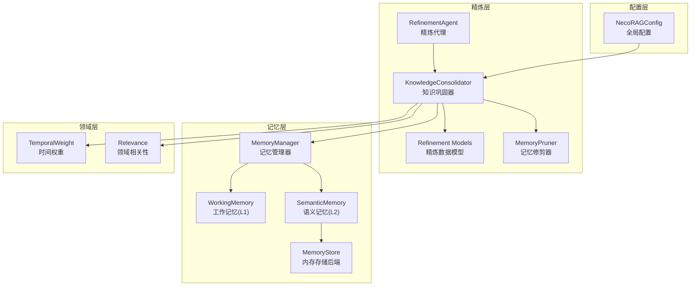
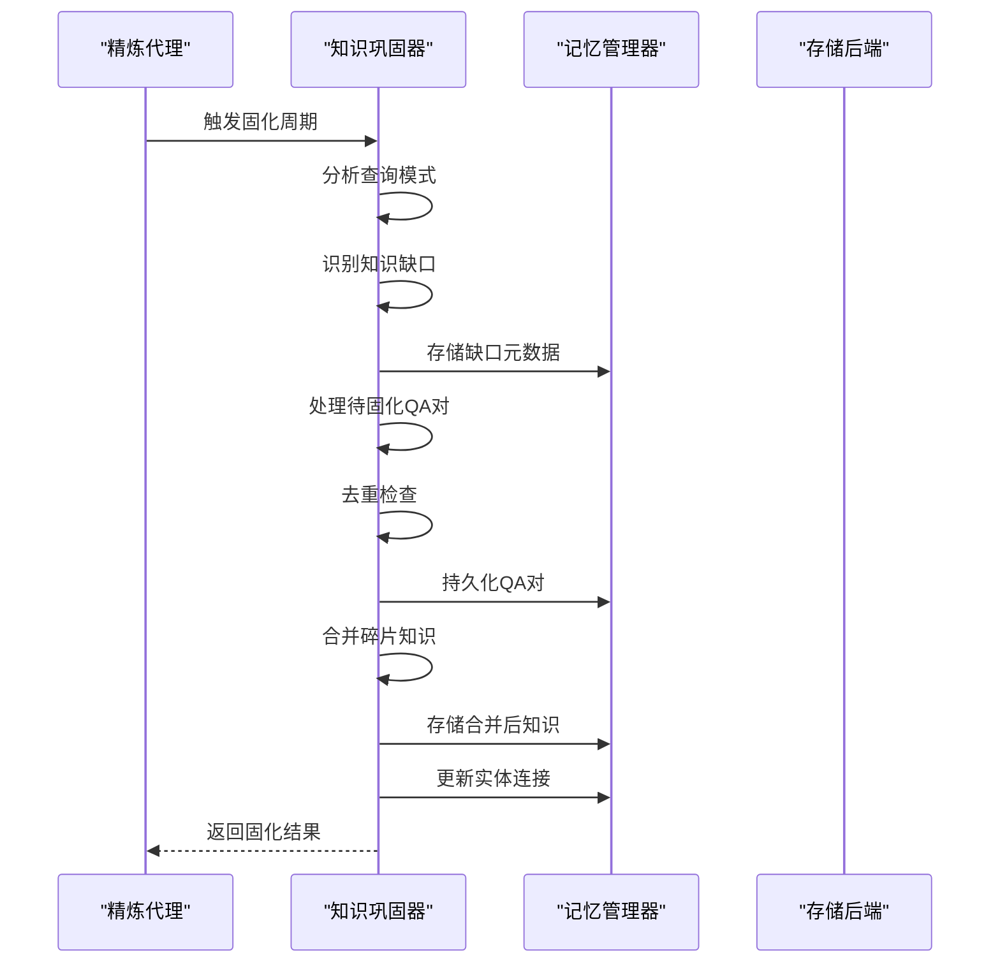
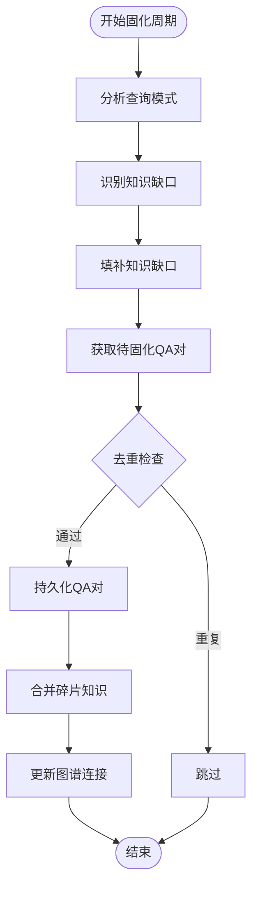
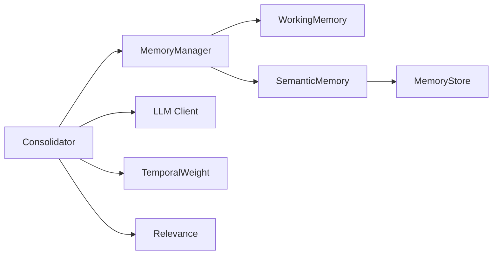

# 知识巩固器 (KnowledgeConsolidator)

<cite>
**本文档引用的文件**
- [consolidator.py](file://src/refinement/consolidator.py)
- [models.py](file://src/refinement/models.py)
- [manager.py](file://src/memory/manager.py)
- [memory_store.py](file://src/memory/backends/memory_store.py)
- [config.py](file://src/core/config.py)
- [temporal_weight.py](file://src/domain/temporal_weight.py)
- [relevance.py](file://src/domain/relevance.py)
- [pruner.py](file://src/refinement/pruner.py)
- [working_memory.py](file://src/memory/working_memory.py)
- [semantic_memory.py](file://src/memory/semantic_memory.py)
- [example_usage.py](file://example/example_usage.py)
</cite>

## 目录
1. [简介](#简介)
2. [项目结构](#项目结构)
3. [核心组件](#核心组件)
4. [架构总览](#架构总览)
5. [详细组件分析](#详细组件分析)
6. [依赖关系分析](#依赖关系分析)
7. [性能考量](#性能考量)
8. [故障排查指南](#故障排查指南)
9. [结论](#结论)
10. [附录](#附录)

## 简介
知识巩固器（KnowledgeConsolidator）是 NecoRAG 精炼层的核心组件之一，负责将高质量问答对（QA）进行持久化、去重与合并，识别知识缺口并自动补充，同时维护知识图谱的连接关系。其目标是将临时信息转化为长期稳定的知识，并建立知识之间的关联，从而提升检索与推理的准确性与时效性。

## 项目结构
围绕知识巩固器的相关模块分布如下：
- 精炼层：consolidator.py、models.py、agent.py、pruner.py
- 记忆层：manager.py、working_memory.py、semantic_memory.py、backends/memory_store.py
- 领域层：temporal_weight.py、relevance.py
- 配置层：core/config.py
- 示例：example/example_usage.py

**图表来源**
- [consolidator.py:41-160](file://src/refinement/consolidator.py#L41-L160)
- [models.py:49-66](file://src/refinement/models.py#L49-L66)
- [pruner.py:10-70](file://src/refinement/pruner.py#L10-L70)
- [manager.py:20-51](file://src/memory/manager.py#L20-L51)
- [working_memory.py:11-35](file://src/memory/working_memory.py#L11-L35)
- [semantic_memory.py:21-49](file://src/memory/semantic_memory.py#L21-L49)
- [memory_store.py:20-38](file://src/memory/backends/memory_store.py#L20-L38)
- [temporal_weight.py:47-52](file://src/domain/temporal_weight.py#L47-L52)
- [relevance.py:29-41](file://src/domain/relevance.py#L29-L41)
- [config.py:266-282](file://src/core/config.py#L266-L282)

**章节来源**
- [consolidator.py:1-659](file://src/refinement/consolidator.py#L1-L659)
- [models.py:1-66](file://src/refinement/models.py#L1-L66)
- [manager.py:1-212](file://src/memory/manager.py#L1-L212)
- [memory_store.py:1-381](file://src/memory/backends/memory_store.py#L1-L381)
- [config.py:1-408](file://src/core/config.py#L1-L408)
- [temporal_weight.py:1-271](file://src/domain/temporal_weight.py#L1-L271)
- [relevance.py:1-328](file://src/domain/relevance.py#L1-L328)
- [pruner.py:1-157](file://src/refinement/pruner.py#L1-L157)
- [working_memory.py:1-120](file://src/memory/working_memory.py#L1-L120)
- [semantic_memory.py:1-179](file://src/memory/semantic_memory.py#L1-L179)
- [example_usage.py:1-252](file://example/example_usage.py#L1-L252)

## 核心组件
- 知识巩固器（KnowledgeConsolidator）
  - 负责分析高频未命中查询、识别知识缺口、补充缺口、去重与合并碎片化知识、更新图谱连接。
  - 关键参数：最小查询频率、质量阈值、相似度阈值；支持异步运行固化周期。
- 精炼数据模型（Refinement Models）
  - 定义 QA 对、查询模式、知识缺口等数据结构，支撑巩固器的数据流转。
- 记忆管理器（MemoryManager）
  - 统一管理 L1/L2/L3 三层记忆，提供向量检索、图谱存储与记忆巩固/遗忘能力。
- 时间权重与领域相关性
  - 时间权重用于控制知识的时效性衰减；领域相关性用于评估文本与领域的契合度，辅助知识筛选与排序。
- 记忆修剪器（MemoryPruner）
  - 与巩固器配合，清理噪声、低质量与过时知识，强化重要连接，维持知识库健康度。

**章节来源**
- [consolidator.py:41-160](file://src/refinement/consolidator.py#L41-L160)
- [models.py:49-66](file://src/refinement/models.py#L49-L66)
- [manager.py:20-51](file://src/memory/manager.py#L20-L51)
- [temporal_weight.py:47-52](file://src/domain/temporal_weight.py#L47-L52)
- [relevance.py:29-41](file://src/domain/relevance.py#L29-L41)
- [pruner.py:10-70](file://src/refinement/pruner.py#L10-L70)

## 架构总览
知识巩固器在精炼代理（RefinementAgent）的协调下，与记忆管理器协作，形成“生成-批判-精炼-固化”的闭环。巩固器通过查询日志分析高频未命中模式，识别知识缺口并补充，随后对高质量 QA 对进行去重与合并，最终更新知识图谱连接。

**图表来源**
- [consolidator.py:105-160](file://src/refinement/consolidator.py#L105-L160)
- [consolidator.py:250-281](file://src/refinement/consolidator.py#L250-L281)
- [consolidator.py:401-441](file://src/refinement/consolidator.py#L401-L441)
- [consolidator.py:282-322](file://src/refinement/consolidator.py#L282-L322)
- [consolidator.py:323-357](file://src/refinement/consolidator.py#L323-L357)
- [manager.py:52-123](file://src/memory/manager.py#L52-L123)

**章节来源**
- [consolidator.py:105-160](file://src/refinement/consolidator.py#L105-L160)
- [manager.py:52-123](file://src/memory/manager.py#L52-L123)

## 详细组件分析

### 知识巩固器（KnowledgeConsolidator）
- 主要职责
  - 分析查询模式：统计查询频率与命中率，提取模式并排序。
  - 识别知识缺口：对低命中率且高频的模式标记缺口。
  - 填补知识缺口：将缺口记录持久化，便于后续处理。
  - 去重与合并：基于缓存与相似度阈值去重，对相似片段进行合并。
  - 更新图谱连接：从答案中抽取实体，更新图谱连接强度。
- 关键流程
  - 运行固化周期：串行执行模式分析、缺口识别、QA固化、碎片合并、图谱更新。
  - 记录查询：将命中且高置信度的回答加入待固化队列。
  - 存储QA对：若满足质量阈值且非重复，则持久化。
- 算法要点
  - 查询模式提取：去除停用词与标点，提取关键词组合作为模式。
  - 去重策略：以查询哈希为键，缓存中保留更高置信度的版本。
  - 合并策略：优先使用 LLM 合并，失败时采用规则合并（保留高置信度内容并附加补充信息）。
  - 实体抽取：中文连续汉字与英文首字母大写短语作为候选实体。

**图表来源**
- [consolidator.py:105-160](file://src/refinement/consolidator.py#L105-L160)
- [consolidator.py:162-216](file://src/refinement/consolidator.py#L162-L216)
- [consolidator.py:217-248](file://src/refinement/consolidator.py#L217-L248)
- [consolidator.py:250-281](file://src/refinement/consolidator.py#L250-L281)
- [consolidator.py:401-441](file://src/refinement/consolidator.py#L401-L441)
- [consolidator.py:282-322](file://src/refinement/consolidator.py#L282-L322)
- [consolidator.py:323-357](file://src/refinement/consolidator.py#L323-L357)

**章节来源**
- [consolidator.py:41-160](file://src/refinement/consolidator.py#L41-L160)
- [consolidator.py:162-216](file://src/refinement/consolidator.py#L162-L216)
- [consolidator.py:217-248](file://src/refinement/consolidator.py#L217-L248)
- [consolidator.py:250-281](file://src/refinement/consolidator.py#L250-L281)
- [consolidator.py:282-322](file://src/refinement/consolidator.py#L282-L322)
- [consolidator.py:323-357](file://src/refinement/consolidator.py#L323-L357)
- [consolidator.py:401-441](file://src/refinement/consolidator.py#L401-L441)

### 精炼数据模型（Refinement Models）
- 数据结构
  - KnowledgeGap：知识缺口，包含缺口ID、主题、描述、频率与元数据。
  - QueryPattern：查询模式，包含模式、计数、命中率与示例。
  - QAPair：问答对，包含ID、查询、答案、置信度、证据、时间戳与元数据。
  - ConsolidationResult：固化结果，包含存储数量、去重数量、合并数量、识别缺口数、耗时与元数据。
- 作用
  - 为巩固器提供标准化的数据载体，确保流程各阶段的数据一致性。

**章节来源**
- [models.py:49-66](file://src/refinement/models.py#L49-L66)
- [consolidator.py:18-40](file://src/refinement/consolidator.py#L18-L40)

### 记忆管理器（MemoryManager）
- 统一管理三层记忆：工作记忆（L1）、语义记忆（L2）、情景图谱（L3）。
- 能力
  - 存储：将编码块存入语义记忆与图谱，统一存储便于跨层检索。
  - 检索：基于向量检索并强化访问记忆权重。
  - 巩固：应用衰减、归档低价值记忆。
  - 遗忘：主动遗忘低价值记忆。
- 与巩固器的关系
  - 巩固器通过记忆管理器提供的接口进行 QA 对与合并知识的持久化，以及图谱连接的更新。

**章节来源**
- [manager.py:20-51](file://src/memory/manager.py#L20-L51)
- [manager.py:52-123](file://src/memory/manager.py#L52-L123)
- [manager.py:161-183](file://src/memory/manager.py#L161-L183)
- [manager.py:184-202](file://src/memory/manager.py#L184-L202)

### 时间权重与领域相关性
- 时间权重（TemporalWeight）
  - 提供指数衰减、分层权重与混合方法，支持常青内容与不同领域的时间衰减策略。
  - 与巩固器结合，用于评估知识的时效性与优先级。
- 领域相关性（DomainRelevance）
  - 基于关键字与密度评分，判定文本所属领域等级并给出权重乘数。
  - 与巩固器结合，辅助筛选与排序高质量知识。

**章节来源**
- [temporal_weight.py:47-52](file://src/domain/temporal_weight.py#L47-L52)
- [temporal_weight.py:160-196](file://src/domain/temporal_weight.py#L160-L196)
- [relevance.py:29-41](file://src/domain/relevance.py#L29-L41)
- [relevance.py:198-242](file://src/domain/relevance.py#L198-L242)

### 记忆修剪器（MemoryPruner）
- 与巩固器互补，负责清理噪声、低质量与过时知识，强化重要连接。
- 关键指标
  - 噪声阈值、质量阈值、过时天数。
- 与巩固器的协作
  - 巩固器专注于高质量知识的固化与合并，修剪器负责知识库的整体健康度维护。

**章节来源**
- [pruner.py:10-70](file://src/refinement/pruner.py#L10-L70)
- [pruner.py:41-69](file://src/refinement/pruner.py#L41-L69)

## 依赖关系分析
- 组件耦合
  - 巩固器依赖记忆管理器进行持久化与图谱更新；依赖 LLM 客户端进行知识合并（可选）。
  - 记忆管理器内部依赖工作记忆与语义记忆，语义记忆依赖内存存储后端。
  - 时间权重与领域相关性为巩固过程提供时效性与领域权重支持。
- 外部依赖
  - LLM 客户端（可为 Mock 实现）。
  - 向量存储与图存储后端（内存实现用于开发测试）。

**图表来源**
- [consolidator.py:53-84](file://src/refinement/consolidator.py#L53-L84)
- [manager.py:44-47](file://src/memory/manager.py#L44-L47)
- [semantic_memory.py:21-49](file://src/memory/semantic_memory.py#L21-L49)
- [memory_store.py:20-38](file://src/memory/backends/memory_store.py#L20-L38)
- [temporal_weight.py:47-52](file://src/domain/temporal_weight.py#L47-L52)
- [relevance.py:29-41](file://src/domain/relevance.py#L29-L41)

**章节来源**
- [consolidator.py:53-84](file://src/refinement/consolidator.py#L53-L84)
- [manager.py:44-47](file://src/memory/manager.py#L44-L47)
- [semantic_memory.py:21-49](file://src/memory/semantic_memory.py#L21-L49)
- [memory_store.py:20-38](file://src/memory/backends/memory_store.py#L20-L38)
- [temporal_weight.py:47-52](file://src/domain/temporal_weight.py#L47-L52)
- [relevance.py:29-41](file://src/domain/relevance.py#L29-L41)

## 性能考量
- 缓存与内存
  - 巩固器内置 QA 缓存，限制缓存大小并淘汰低置信度条目，减少重复处理与存储压力。
- 检索与存储
  - 记忆管理器的语义记忆采用内存向量存储，适合小规模场景；生产环境建议替换为外部向量数据库。
- 时间权重
  - 合理设置衰减率与分层权重，平衡知识时效性与稳定性。
- 并发与异步
  - 巩固器支持异步运行固化周期，可在后台任务中执行，避免阻塞主线程。

**章节来源**
- [consolidator.py:482-502](file://src/refinement/consolidator.py#L482-L502)
- [manager.py:44-47](file://src/memory/manager.py#L44-L47)
- [temporal_weight.py:211-227](file://src/domain/temporal_weight.py#L211-L227)

## 故障排查指南
- 巩固结果为空
  - 检查查询日志是否足够，确认最小查询频率阈值设置是否合理。
  - 确认质量阈值与相似度阈值是否过高导致 QA 被过滤。
- 无法持久化
  - 检查记忆管理器是否正确初始化，存储后端是否可用。
  - 确认 QA 对的置信度是否满足质量阈值。
- 图谱连接未更新
  - 检查实体抽取逻辑是否正确，确认记忆管理器具备更新图谱连接的接口。
- 性能问题
  - 关注缓存大小与淘汰策略，适当调整缓存上限与淘汰数量。
  - 评估向量存储后端的性能瓶颈，必要时迁移至外部数据库。

**章节来源**
- [consolidator.py:105-160](file://src/refinement/consolidator.py#L105-L160)
- [consolidator.py:516-536](file://src/refinement/consolidator.py#L516-L536)
- [consolidator.py:323-357](file://src/refinement/consolidator.py#L323-L357)
- [manager.py:52-123](file://src/memory/manager.py#L52-L123)

## 结论
知识巩固器通过查询模式分析、知识缺口识别、QA 去重与合并、图谱连接更新等机制，实现了从临时信息到长期知识的转化。结合时间权重与领域相关性，巩固器能够有效维护知识的时效性与准确性，并通过与记忆修剪器的协作，持续优化知识库的整体质量。在工程实践中，建议根据业务场景调整阈值与策略，并结合外部存储后端提升性能与可靠性。

## 附录

### 巩固器配置参数与策略
- 巩固器初始化参数
  - memory_manager：记忆管理器实例（可选）
  - llm_client：LLM 客户端（可选，无则使用 Mock）
  - min_query_frequency：最小查询频率阈值
  - quality_threshold：质量阈值（高于此值的 QA 才会被固化）
  - similarity_threshold：相似度阈值（用于去重）
- 存储策略
  - QA 对持久化：调用记忆管理器的存储接口。
  - 合并知识持久化：调用记忆管理器的合并存储接口。
  - 图谱连接更新：调用记忆管理器的实体连接更新接口。
- 性能监控
  - 固化周期耗时（毫秒）、存储数量、去重数量、合并数量、识别缺口数等指标可通过 ConsolidationResult 获取。

**章节来源**
- [consolidator.py:53-84](file://src/refinement/consolidator.py#L53-L84)
- [consolidator.py:150-160](file://src/refinement/consolidator.py#L150-L160)
- [manager.py:52-123](file://src/memory/manager.py#L52-L123)

### 使用示例与集成
- 示例脚本展示了从感知层到记忆层、检索层、精炼层与交互层的完整流程，巩固器作为精炼层的一部分参与答案生成与验证，并在后台执行固化任务。

**章节来源**
- [example_usage.py:1-252](file://example/example_usage.py#L1-L252)