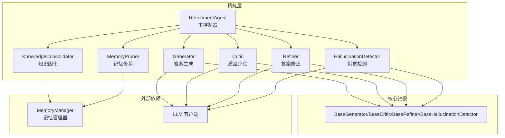
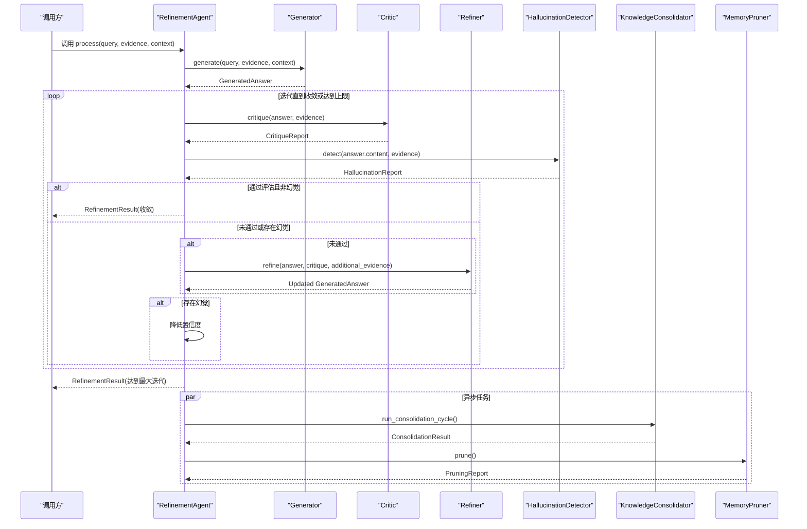
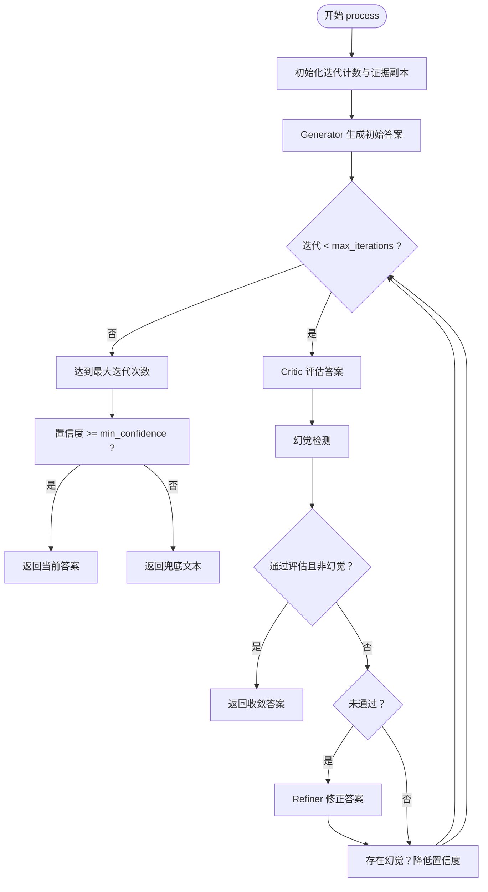
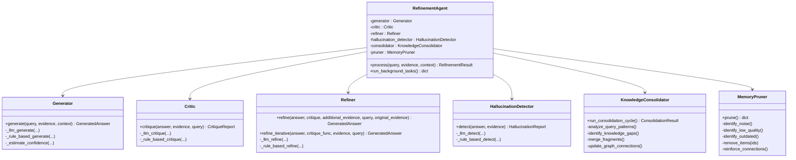

# 精炼代理 (RefinementAgent)

<cite>
**本文引用的文件**
- [agent.py](file://src/refinement/agent.py)
- [generator.py](file://src/refinement/generator.py)
- [critic.py](file://src/refinement/critic.py)
- [refiner.py](file://src/refinement/refiner.py)
- [hallucination.py](file://src/refinement/hallucination.py)
- [consolidator.py](file://src/refinement/consolidator.py)
- [pruner.py](file://src/refinement/pruner.py)
- [models.py](file://src/refinement/models.py)
- [base.py](file://src/core/base.py)
- [example_usage.py](file://example/example_usage.py)
- [necorag.py](file://src/necorag.py)
</cite>

## 目录
1. [简介](#简介)
2. [项目结构](#项目结构)
3. [核心组件](#核心组件)
4. [架构总览](#架构总览)
5. [详细组件分析](#详细组件分析)
6. [依赖关系分析](#依赖关系分析)
7. [性能考量](#性能考量)
8. [故障排查指南](#故障排查指南)
9. [结论](#结论)
10. [附录](#附录)

## 简介
精炼代理（RefinementAgent）是 NecoRAG 的核心闭环组件，负责在“生成-批判-修正”的循环中持续提升答案质量，并集成幻觉检测、异步知识固化与记忆修剪等能力。它通过与记忆管理器（MemoryManager）协作，实现高质量 QA 对的持久化、知识缺口识别与自动补充、知识去重与合并，以及对过时/噪声/低质量记忆的修剪，从而维持知识库的健康与高效。

## 项目结构
围绕精炼代理的关键文件组织如下：
- 精炼代理主类：src/refinement/agent.py
- 子组件：src/refinement/generator.py、critic.py、refiner.py、hallucination.py、consolidator.py、pruner.py
- 数据模型：src/refinement/models.py
- 抽象基类：src/core/base.py
- 使用示例：example/example_usage.py
- 统一入口：src/necorag.py

图表来源
- [agent.py:20-164](file://src/refinement/agent.py#L20-L164)
- [generator.py:16-209](file://src/refinement/generator.py#L16-L209)
- [critic.py:18-309](file://src/refinement/critic.py#L18-L309)
- [refiner.py:18-371](file://src/refinement/refiner.py#L18-L371)
- [hallucination.py:18-507](file://src/refinement/hallucination.py#L18-L507)
- [consolidator.py:41-659](file://src/refinement/consolidator.py#L41-L659)
- [pruner.py:10-157](file://src/refinement/pruner.py#L10-L157)
- [base.py:438-527](file://src/core/base.py#L438-L527)

章节来源
- [agent.py:1-164](file://src/refinement/agent.py#L1-L164)
- [example_usage.py:139-173](file://example/example_usage.py#L139-L173)

## 核心组件
- 精炼代理（RefinementAgent）：协调 Generator、Critic、Refiner、HallucinationDetector、KnowledgeConsolidator、MemoryPruner，执行迭代精炼与最终结果输出。
- 答案生成器（Generator）：基于证据生成答案，支持 LLM 与规则回退，估算置信度。
- 批判评估器（Critic）：多维度评估答案质量（事实性、完整性、相关性），支持 LLM 与规则回退。
- 答案修正器（Refiner）：根据批判反馈迭代修正答案，支持 LLM 与规则修正，融合补充证据。
- 幻觉检测器（HallucinationDetector）：检测事实一致性、逻辑连贯性、证据支撑度，支持 LLM 与规则回退。
- 知识固化器（KnowledgeConsolidator）：分析查询模式、识别知识缺口、合并碎片知识、持久化高质量 QA 对。
- 记忆修剪器（MemoryPruner）：识别噪声、低质量、过时记忆并修剪，强化重要连接。

章节来源
- [models.py:9-66](file://src/refinement/models.py#L9-L66)
- [base.py:438-527](file://src/core/base.py#L438-L527)

## 架构总览
精炼代理的运行流程遵循“生成-批判-修正-幻觉检测-收敛/输出”的闭环，同时在后台异步执行知识固化与记忆修剪。

图表来源
- [agent.py:65-164](file://src/refinement/agent.py#L65-L164)
- [generator.py:68-102](file://src/refinement/generator.py#L68-L102)
- [critic.py:90-113](file://src/refinement/critic.py#L90-L113)
- [refiner.py:98-131](file://src/refinement/refiner.py#L98-L131)
- [hallucination.py:136-157](file://src/refinement/hallucination.py#L136-L157)
- [consolidator.py:105-161](file://src/refinement/consolidator.py#L105-L161)
- [pruner.py:41-69](file://src/refinement/pruner.py#L41-L69)

## 详细组件分析

### 精炼代理（RefinementAgent）
- 职责
  - 协调 Generator、Critic、Refiner、HallucinationDetector 的执行顺序与数据传递。
  - 控制迭代次数与收敛条件（评估通过且非幻觉）。
  - 管理子组件生命周期：在构造时实例化，按需启用知识固化与记忆修剪。
  - 异步执行后台任务：知识固化与记忆修剪。
- 关键参数
  - llm_model：LLM 模型标识（用于子组件初始化）。
  - memory：MemoryManager 实例（若为空，则跳过知识固化与修剪）。
  - max_iterations：最大迭代次数。
  - min_confidence：最低置信度阈值，超过阈值才输出答案。
- 迭代控制与停止条件
  - 每次迭代先进行批判评估与幻觉检测，若通过则收敛；否则根据评估结果修正答案或降低置信度。
  - 达到最大迭代次数仍未收敛时，仍返回当前答案，但低于最小置信度时返回兜底文本。
- 后台任务
  - run_background_tasks：异步运行知识固化与记忆修剪，返回执行结果字典。

图表来源
- [agent.py:65-141](file://src/refinement/agent.py#L65-L141)

章节来源
- [agent.py:31-164](file://src/refinement/agent.py#L31-L164)

### 答案生成器（Generator）
- 功能
  - 基于检索证据生成答案，支持 LLM 与规则回退两种路径。
  - 限制最大证据数量，控制生成温度。
  - 估算置信度，综合证据数量、答案长度、关键词覆盖等因素。
- 关键点
  - 若无证据，直接返回兜底答案与零置信度。
  - LLM 路径：格式化提示词，调用 LLM 生成，再评估置信度。
  - 规则回退：基于证据摘要与长度估算置信度。

章节来源
- [generator.py:26-209](file://src/refinement/generator.py#L26-L209)

### 批判评估器（Critic）
- 功能
  - 多维度评估答案：事实性、完整性、相关性。
  - 支持 LLM 与规则回退：LLM 时解析 JSON 结果，失败则退化到规则解析。
  - 计算加权质量分数，判定是否通过。
- 关键点
  - LLM 解析失败时，基于关键词统计质量分数。
  - 规则评估：检查证据引用、置信度、答案长度、与证据关键词重叠度。

章节来源
- [critic.py:28-309](file://src/refinement/critic.py#L28-L309)

### 答案修正器（Refiner）
- 功能
  - 基于批判反馈修正答案，支持 LLM 与规则修正。
  - 迭代修正直到质量达标或达到最大迭代次数。
  - 融合补充证据，更新引用与置信度。
- 关键点
  - LLM 修正：格式化提示词，调用 LLM 生成修正答案，清理响应，计算新置信度。
  - 规则修正：扩展过短答案、融合补充证据、提取关键要点。
  - 迭代修正：refine_iterative 提供统一迭代流程。

章节来源
- [refiner.py:28-371](file://src/refinement/refiner.py#L28-L371)

### 幻觉检测器（HallucinationDetector）
- 功能
  - 检测三类问题：事实一致性、逻辑连贯性、证据支撑度。
  - 支持 LLM 与规则回退：LLM 时解析 JSON，失败则退化到规则检测。
- 关键点
  - LLM 检测：分别调用三项检测，综合阈值判断是否存在幻觉。
  - 规则检测：基于关键词重叠、逻辑连接词、证据覆盖度等启发式规则。

章节来源
- [hallucination.py:28-507](file://src/refinement/hallucination.py#L28-L507)

### 知识固化器（KnowledgeConsolidator）
- 功能
  - 分析查询模式，识别知识缺口，自动补充。
  - 去重与合并碎片知识，持久化高质量 QA 对，更新图谱连接。
- 关键点
  - 查询模式分析：统计频率与命中率，识别低命中高频模式。
  - 碎片合并：按主题分组，使用 LLM 或规则合并。
  - 去重：基于查询哈希与置信度缓存，避免重复存储。
  - 异步：run_consolidation_cycle 返回 ConsolidationResult。

章节来源
- [consolidator.py:53-659](file://src/refinement/consolidator.py#L53-L659)

### 记忆修剪器（MemoryPruner）
- 功能
  - 识别噪声、低质量、过时记忆并删除。
  - 强化高频访问的重要连接。
- 关键点
  - 噪声：低权重且访问次数少。
  - 低质量：内容过短且权重低。
  - 过时：超过设定天数未访问。
  - 强化：访问次数多的记忆权重提升。

章节来源
- [pruner.py:20-157](file://src/refinement/pruner.py#L20-L157)

### 数据模型
- HallucinationReport：幻觉检测报告，包含是否幻觉、三项分数与问题列表。
- GeneratedAnswer：生成的答案，包含内容、引用、置信度与元数据。
- CritiqueReport：批判报告，包含是否有效、问题列表、建议与质量评分。
- RefinementResult：精炼结果，包含查询、答案、置信度、引用、幻觉报告、迭代次数与元数据。
- KnowledgeGap、QueryPattern：知识缺口与查询模式的数据结构。

章节来源
- [models.py:9-66](file://src/refinement/models.py#L9-L66)

### 抽象基类
- BaseGenerator、BaseCritic、BaseRefiner、BaseHallucinationDetector：定义各组件的抽象接口，确保实现的一致性与可替换性。

章节来源
- [base.py:438-527](file://src/core/base.py#L438-L527)

## 依赖关系分析
- RefinementAgent 依赖各子组件的实现类，通过构造函数注入。
- 子组件均继承自对应抽象基类，确保接口一致性。
- KnowledgeConsolidator 与 MemoryPruner 依赖 MemoryManager，若未提供则跳过相关功能。
- LLM 客户端可注入，若未提供则使用 Mock 实现，保证系统在无 LLM 环境下仍可运行。

图表来源
- [agent.py:20-64](file://src/refinement/agent.py#L20-L64)
- [generator.py:16-52](file://src/refinement/generator.py#L16-L52)
- [critic.py:18-56](file://src/refinement/critic.py#L18-L56)
- [refiner.py:18-53](file://src/refinement/refiner.py#L18-L53)
- [hallucination.py:18-56](file://src/refinement/hallucination.py#L18-L56)
- [consolidator.py:41-84](file://src/refinement/consolidator.py#L41-L84)
- [pruner.py:10-40](file://src/refinement/pruner.py#L10-L40)

章节来源
- [agent.py:20-64](file://src/refinement/agent.py#L20-L64)
- [base.py:438-527](file://src/core/base.py#L438-L527)

## 性能考量
- 迭代上限与置信度阈值：通过 max_iterations 与 min_confidence 控制收敛速度与输出质量，避免无限循环与低质量输出。
- 证据数量限制：Generator 的 max_evidence 限制每次生成使用的证据数量，减少上下文长度与 LLM 调用成本。
- 温度参数：各组件的 temperature 控制生成多样性，建议在评估与修正阶段使用较低温度以提升稳定性。
- 异步任务：run_background_tasks 采用异步执行知识固化与修剪，避免阻塞主流程。
- 规则回退：当 LLM 不可用或失败时，自动降级到规则实现，保证系统可用性。

[本节为通用指导，无需特定文件来源]

## 故障排查指南
- LLM 调用失败
  - 现象：Critic、Refiner、HallucinationDetector 的 LLM 路径抛出异常。
  - 处理：自动降级到规则路径；检查 LLM 客户端配置与网络状态。
- 无证据或证据不足
  - 现象：Generator 返回兜底答案与零置信度。
  - 处理：确认检索层返回的证据是否充足；调整检索参数。
- 幻觉检测触发
  - 现象：HallucinationDetector 标记为幻觉，置信度下降。
  - 处理：检查证据与答案一致性；必要时增加补充证据或调整提示词。
- 知识固化/修剪未生效
  - 现象：run_background_tasks 返回跳过状态。
  - 处理：确认 RefinementAgent 初始化时传入了 MemoryManager；检查内存存储接口实现。

章节来源
- [critic.py:136-142](file://src/refinement/critic.py#L136-L142)
- [refiner.py:242-245](file://src/refinement/refiner.py#L242-L245)
- [hallucination.py:215-220](file://src/refinement/hallucination.py#L215-L220)
- [agent.py:150-151](file://src/refinement/agent.py#L150-L151)

## 结论
精炼代理通过“生成-批判-修正-幻觉检测”的闭环，结合异步知识固化与记忆修剪，实现了高质量、可解释、可持续演进的答案生成与知识维护。其模块化设计与抽象基类确保了可插拔性与可扩展性，适合在不同场景下灵活部署与优化。

[本节为总结，无需特定文件来源]

## 附录

### 使用示例
- 基本用法：参考 example/example_usage.py 中的示例4，展示如何初始化 RefinementAgent 并对检索到的证据进行精炼。
- 统一入口：参考 src/necorag.py 的 query 方法，展示 NecoRAG 如何在整体流程中调用精炼代理。

章节来源
- [example_usage.py:139-173](file://example/example_usage.py#L139-L173)
- [necorag.py:354-470](file://src/necorag.py#L354-L470)

### 参数配置说明
- RefinementAgent
  - llm_model：LLM 模型标识（用于子组件初始化）。
  - memory：MemoryManager 实例（可选）。
  - max_iterations：最大迭代次数（默认值见实现）。
  - min_confidence：最低置信度阈值（默认值见实现）。
- Generator
  - max_evidence：最大使用证据数量。
  - temperature：生成温度。
- Critic
  - factuality_weight、completeness_weight、relevance_weight：评估维度权重。
- Refiner
  - max_iterations：最大迭代次数。
  - quality_threshold：质量阈值。
- HallucinationDetector
  - fact_threshold、logic_threshold、support_threshold：三类检测阈值。
- KnowledgeConsolidator
  - min_query_frequency、quality_threshold、similarity_threshold：查询模式分析与去重合并阈值。
- MemoryPruner
  - noise_threshold、quality_threshold、outdated_days：噪声、低质量、过时判定阈值。

章节来源
- [agent.py:31-64](file://src/refinement/agent.py#L31-L64)
- [generator.py:26-43](file://src/refinement/generator.py#L26-L43)
- [critic.py:28-48](file://src/refinement/critic.py#L28-L48)
- [refiner.py:28-45](file://src/refinement/refiner.py#L28-L45)
- [hallucination.py:28-48](file://src/refinement/hallucination.py#L28-L48)
- [consolidator.py:53-76](file://src/refinement/consolidator.py#L53-L76)
- [pruner.py:20-40](file://src/refinement/pruner.py#L20-L40)

### 性能优化建议
- 合理设置 max_iterations 与 quality_threshold，平衡质量与延迟。
- 控制 max_evidence，避免过长上下文影响 LLM 性能。
- 在评估与修正阶段使用较低 temperature，提升稳定性。
- 使用异步 run_background_tasks，避免阻塞主流程。
- 在无 LLM 环境下，确保规则实现具备足够的鲁棒性。

[本节为通用指导，无需特定文件来源]