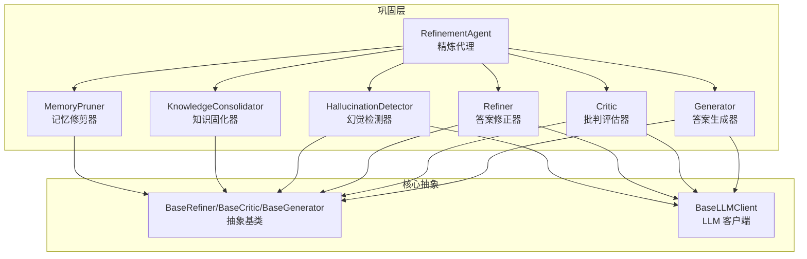
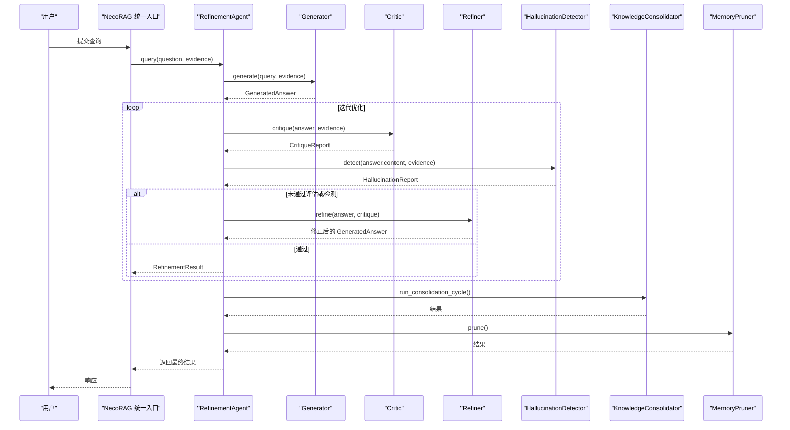
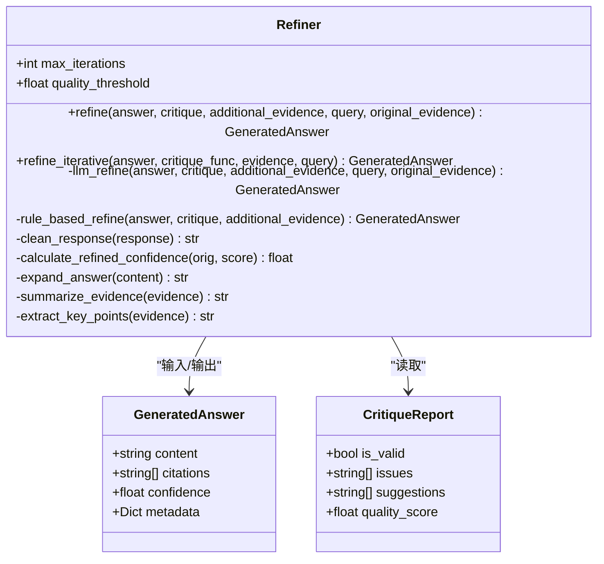
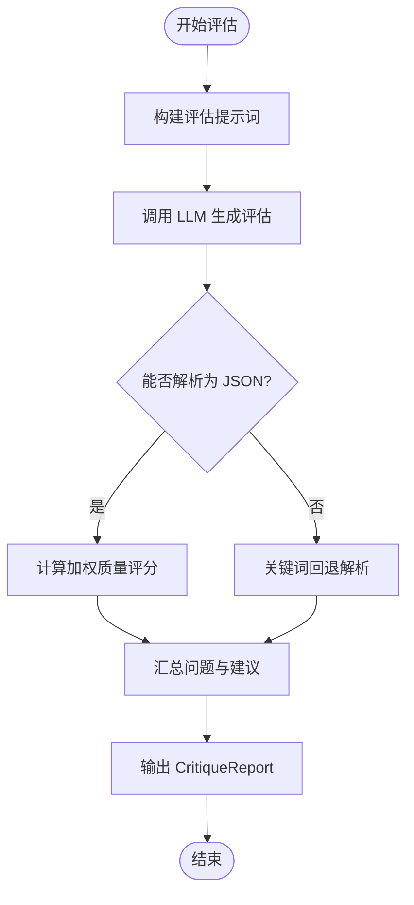
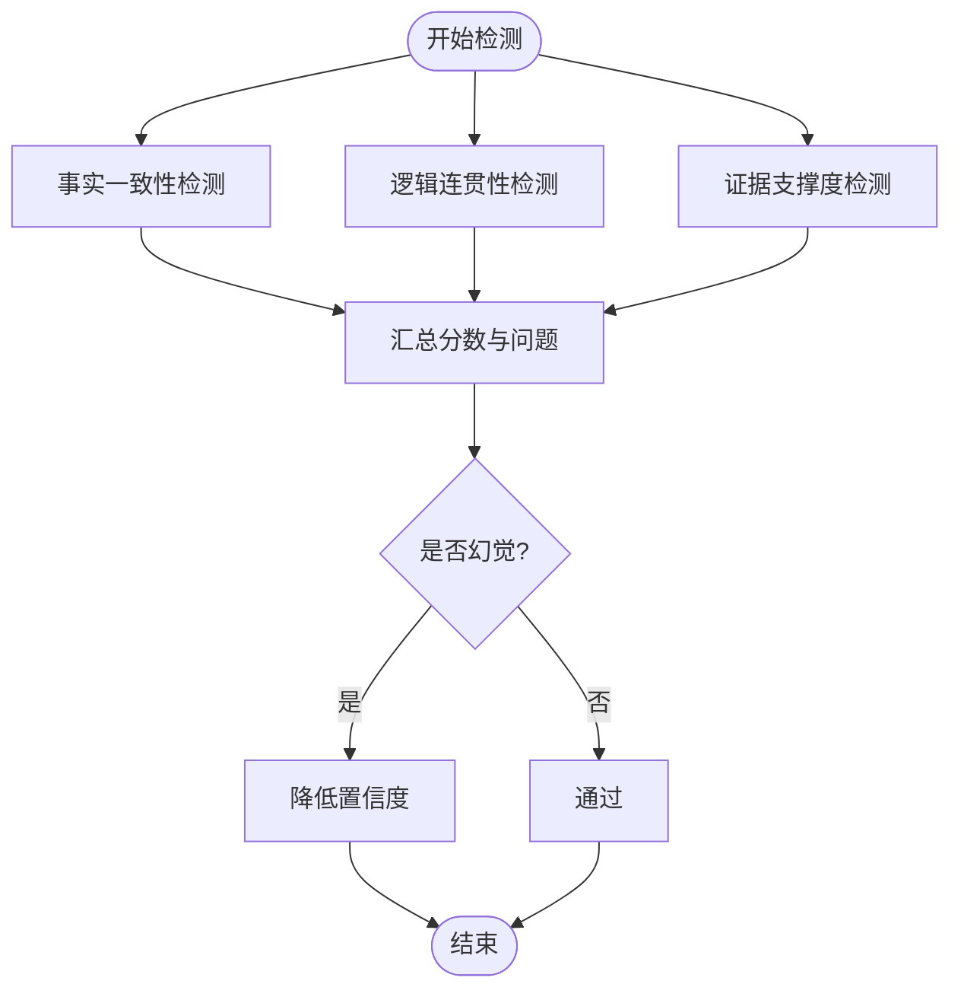
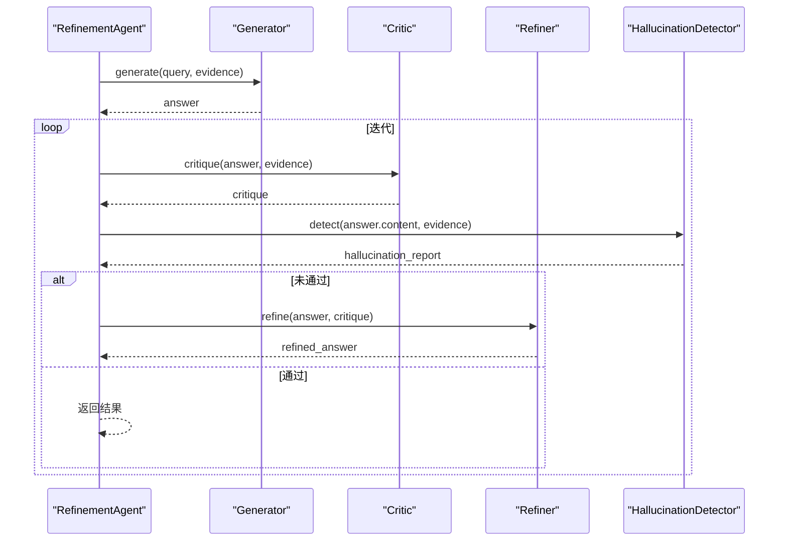
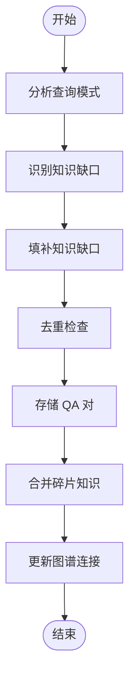
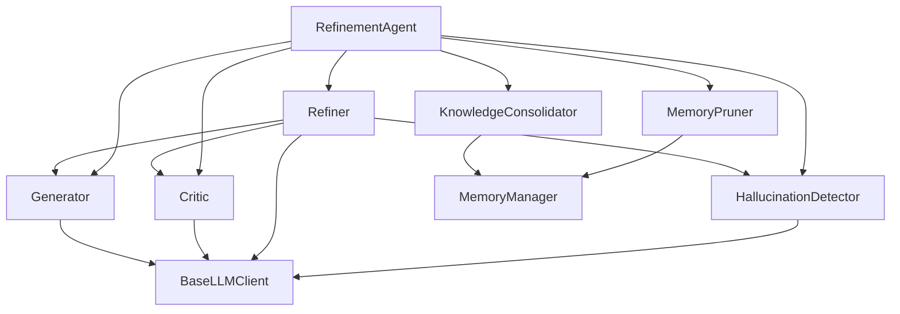

# 精炼器 (Refiner)

<cite>
**本文引用的文件**
- [refiner.py](file://src/refinement/refiner.py)
- [models.py](file://src/refinement/models.py)
- [critic.py](file://src/refinement/critic.py)
- [generator.py](file://src/refinement/generator.py)
- [agent.py](file://src/refinement/agent.py)
- [consolidator.py](file://src/refinement/consolidator.py)
- [pruner.py](file://src/refinement/pruner.py)
- [hallucination.py](file://src/refinement/hallucination.py)
- [base.py](file://src/core/base.py)
- [base_llm.py](file://src/core/llm/base.py)
- [example_usage.py](file://example/example_usage.py)
- [necorag.py](file://src/necorag.py)
</cite>

## 目录
1. [简介](#简介)
2. [项目结构](#项目结构)
3. [核心组件](#核心组件)
4. [架构总览](#架构总览)
5. [详细组件分析](#详细组件分析)
6. [依赖关系分析](#依赖关系分析)
7. [性能考量](#性能考量)
8. [故障排查指南](#故障排查指南)
9. [结论](#结论)
10. [附录](#附录)

## 简介
本文件系统性阐述 NecoRAG 精炼器（Refiner）在答案优化过程中的核心职责与工作机制，重点覆盖以下方面：
- 如何依据批评意见改进答案
- 如何整合新的证据信息
- 如何维护答案的一致性与连贯性
- 精炼策略、迭代改进机制与多轮精炼的协调
- 冲突信息处理、不同批评意见的平衡与避免过度修改
- 配置参数、优化算法说明与效果评估方法

精炼器位于“巩固层”（Refinement Layer），与生成器（Generator）、批判器（Critic）、幻觉检测器（HallucinationDetector）以及知识固化器（KnowledgeConsolidator）共同构成答案质量闭环。

## 项目结构
围绕精炼器的关键文件组织如下：
- 精炼器主体：src/refinement/refiner.py
- 数据模型：src/refinement/models.py
- 生成器：src/refinement/generator.py
- 批判器：src/refinement/critic.py
- 幻觉检测器：src/refinement/hallucination.py
- 精炼代理：src/refinement/agent.py
- 知识固化器：src/refinement/consolidator.py
- 记忆修剪器：src/refinement/pruner.py
- 抽象基类与 LLM 客户端：src/core/base.py、src/core/llm/base.py
- 使用示例：example/example_usage.py
- 统一入口与工作流：src/necorag.py

图表来源
- [agent.py:20-64](file://src/refinement/agent.py#L20-L64)
- [generator.py:16-51](file://src/refinement/generator.py#L16-L51)
- [critic.py:18-56](file://src/refinement/critic.py#L18-L56)
- [refiner.py:18-53](file://src/refinement/refiner.py#L18-L53)
- [hallucination.py:18-56](file://src/refinement/hallucination.py#L18-L56)
- [consolidator.py:41-86](file://src/refinement/consolidator.py#L41-L86)
- [pruner.py:10-40](file://src/refinement/pruner.py#L10-L40)
- [base.py:448-538](file://src/core/base.py#L448-L538)
- [base_llm.py:16-78](file://src/core/llm/base.py#L16-L78)

章节来源
- [refiner.py:18-53](file://src/refinement/refiner.py#L18-L53)
- [models.py:9-66](file://src/refinement/models.py#L9-L66)
- [agent.py:20-64](file://src/refinement/agent.py#L20-L64)

## 核心组件
- 精炼代理（RefinementAgent）：协调生成、评估、修正与检测，形成闭环；支持后台知识固化与记忆修剪。
- 答案生成器（Generator）：基于证据生成答案，并估算置信度。
- 批判评估器（Critic）：多维度评估答案质量，输出质量评分与问题清单。
- 答案修正器（Refiner）：依据批判反馈与证据修正答案，支持 LLM 与规则两种修正路径。
- 幻觉检测器（HallucinationDetector）：检测事实一致性、逻辑连贯性与证据支撑度。
- 知识固化器（KnowledgeConsolidator）：识别知识缺口、合并碎片知识、持久化高质量 QA 对。
- 记忆修剪器（MemoryPruner）：清理噪声、低质量与过时信息，强化重要连接。

章节来源
- [agent.py:20-142](file://src/refinement/agent.py#L20-L142)
- [generator.py:16-102](file://src/refinement/generator.py#L16-L102)
- [critic.py:18-113](file://src/refinement/critic.py#L18-L113)
- [refiner.py:18-131](file://src/refinement/refiner.py#L18-L131)
- [hallucination.py:18-157](file://src/refinement/hallucination.py#L18-L157)
- [consolidator.py:41-161](file://src/refinement/consolidator.py#L41-L161)
- [pruner.py:10-70](file://src/refinement/pruner.py#L10-L70)

## 架构总览
精炼器在整体工作流中的位置与交互如下：

图表来源
- [necorag.py:354-471](file://src/necorag.py#L354-L471)
- [agent.py:65-142](file://src/refinement/agent.py#L65-L142)
- [generator.py:68-102](file://src/refinement/generator.py#L68-L102)
- [critic.py:90-113](file://src/refinement/critic.py#L90-L113)
- [refiner.py:98-131](file://src/refinement/refiner.py#L98-L131)
- [hallucination.py:136-157](file://src/refinement/hallucination.py#L136-L157)
- [consolidator.py:105-161](file://src/refinement/consolidator.py#L105-L161)
- [pruner.py:41-70](file://src/refinement/pruner.py#L41-L70)

## 详细组件分析

### 答案修正器（Refiner）核心能力
- 基于批判反馈修正答案：根据质量评分、问题清单与改进建议进行针对性修正。
- 整合补充证据：在修正过程中融合新证据，确保答案与证据一致。
- 维护一致性与连贯性：通过提示词约束与规则校验，保证答案与证据不矛盾、逻辑连贯。
- 多轮迭代与阈值控制：支持最大迭代次数与质量阈值，避免无限循环与过度修正。
- LLM 与规则双路径：当 LLM 不可用时自动降级为规则修正，保障系统鲁棒性。

图表来源
- [refiner.py:18-371](file://src/refinement/refiner.py#L18-L371)
- [models.py:19-35](file://src/refinement/models.py#L19-L35)

章节来源
- [refiner.py:98-245](file://src/refinement/refiner.py#L98-L245)
- [models.py:19-35](file://src/refinement/models.py#L19-L35)

### 批判评估器（Critic）与精炼器的协作
- 评估维度：事实性、完整性、相关性，分别赋予权重并综合计算质量评分。
- LLM 与规则双路径：LLM 解析 JSON 结果，失败时回退到规则解析与评分。
- 输出结构：包含问题清单、改进建议与质量评分，供精炼器决策。

图表来源
- [critic.py:90-193](file://src/refinement/critic.py#L90-L193)

章节来源
- [critic.py:90-193](file://src/refinement/critic.py#L90-L193)

### 幻觉检测器（HallucinationDetector）与精炼器的协同
- 三类检测：事实一致性、逻辑连贯性、证据支撑度，分别给出分数并汇总问题。
- LLM 与规则双路径：LLM 解析 JSON 或分数，失败时回退规则检测。
- 与精炼器配合：若检测到幻觉，降低答案置信度，促使进一步修正。

图表来源
- [hallucination.py:136-194](file://src/refinement/hallucination.py#L136-L194)

章节来源
- [hallucination.py:136-194](file://src/refinement/hallucination.py#L136-L194)

### 精炼代理（RefinementAgent）的迭代优化流程
- 生成初始答案 → 批判评估 → 幻觉检测 → 未通过则修正 → 重复直至达标或达到最大迭代次数。
- 支持后台任务：知识固化与记忆修剪，持续优化知识库质量。

图表来源
- [agent.py:65-142](file://src/refinement/agent.py#L65-L142)

章节来源
- [agent.py:65-142](file://src/refinement/agent.py#L65-L142)

### 知识固化器与记忆修剪器的协同
- 知识固化器：识别知识缺口、补充知识、合并碎片、持久化 QA 对、更新图谱连接。
- 记忆修剪器：识别噪声、低质量与过时信息并删除，强化重要连接。

图表来源
- [consolidator.py:105-161](file://src/refinement/consolidator.py#L105-L161)

章节来源
- [consolidator.py:105-161](file://src/refinement/consolidator.py#L105-L161)
- [pruner.py:41-70](file://src/refinement/pruner.py#L41-L70)

## 依赖关系分析
- 组件耦合与内聚
  - Refiner 与 Critic、Generator、HallucinationDetector 通过数据模型（GeneratedAnswer、CritiqueReport、HallucinationReport）解耦，便于替换实现。
  - RefinementAgent 作为编排者，聚合多个组件，形成稳定的闭环。
- 外部依赖
  - LLM 客户端抽象（BaseLLMClient）统一生成与嵌入接口，支持 Mock 降级。
  - 记忆管理器（MemoryManager）为知识固化与修剪提供持久化能力。

图表来源
- [agent.py:52-64](file://src/refinement/agent.py#L52-L64)
- [refiner.py:42-53](file://src/refinement/refiner.py#L42-L53)
- [critic.py:44-56](file://src/refinement/critic.py#L44-L56)
- [generator.py:40-51](file://src/refinement/generator.py#L40-L51)
- [hallucination.py:44-56](file://src/refinement/hallucination.py#L44-L56)
- [consolidator.py:71-84](file://src/refinement/consolidator.py#L71-L84)
- [pruner.py:36-40](file://src/refinement/pruner.py#L36-L40)
- [base_llm.py:16-78](file://src/core/llm/base.py#L16-L78)

章节来源
- [base.py:448-538](file://src/core/base.py#L448-L538)
- [base_llm.py:16-78](file://src/core/llm/base.py#L16-L78)

## 性能考量
- LLM 调用成本控制
  - 通过温度参数与提示词设计减少不必要的 token 消耗。
  - 在 LLM 失败时快速回退到规则路径，避免阻塞。
- 置信度估计与迭代上限
  - 置信度随迭代与质量评分动态调整，避免无效迭代。
  - 最大迭代次数与质量阈值防止无限循环。
- 知识固化与修剪
  - 合理的去重与合并策略降低存储与检索开销。
  - 修剪过时与噪声数据，维持知识库健康度。

[本节为通用指导，无需特定文件来源]

## 故障排查指南
- LLM 客户端不可用
  - 现象：精炼器回退到规则修正。
  - 排查：确认 LLM 客户端初始化与可用性；Mock 客户端仅用于测试。
- 批判评估失败
  - 现象：回退到规则解析，质量评分基于关键词计算。
  - 排查：检查提示词格式与 JSON 输出稳定性。
- 幻觉检测触发
  - 现象：答案置信度下降。
  - 排查：核对证据与答案一致性，必要时增加证据或调整提示词。
- 知识固化与修剪异常
  - 现象：后台任务未执行或结果为空。
  - 排查：确认 MemoryManager 初始化与权限；检查日志输出。

章节来源
- [refiner.py:242-245](file://src/refinement/refiner.py#L242-L245)
- [critic.py:136-142](file://src/refinement/critic.py#L136-L142)
- [hallucination.py:152-157](file://src/refinement/hallucination.py#L152-L157)
- [consolidator.py:150-161](file://src/refinement/consolidator.py#L150-L161)
- [pruner.py:120-138](file://src/refinement/pruner.py#L120-L138)

## 结论
精炼器通过“生成—评估—修正—检测”的闭环，结合证据融合与置信度动态调整，有效提升了答案的质量、一致性与可信度。其 LLM 与规则双路径设计增强了系统的鲁棒性；与知识固化器、记忆修剪器的协同，使知识库持续进化，从而在长期运行中保持高质量与高效率。

[本节为总结性内容，无需特定文件来源]

## 附录

### 配置参数与优化算法说明
- 精炼器（Refiner）
  - 参数
    - max_iterations：最大迭代次数
    - quality_threshold：质量阈值
  - 算法
    - 置信度调整：基于原始置信度与质量评分，适度提升或限制上限
    - 规则扩展：对过短答案进行扩展，补充证据摘要与关键要点
    - 响应清理：去除代码块标记与解释性前缀，保证纯答案输出
- 批判器（Critic）
  - 参数
    - factuality_weight、completeness_weight、relevance_weight：评估维度权重
  - 算法
    - 加权总分计算；问题与建议汇总；JSON 解析失败时关键词回退
- 幻觉检测器（HallucinationDetector）
  - 参数
    - fact_threshold、logic_threshold、support_threshold：三类检测阈值
  - 算法
    - 事实一致性、逻辑连贯性、证据支撑度分别打分；汇总问题并判断是否幻觉
- 精炼代理（RefinementAgent）
  - 参数
    - max_iterations、min_confidence
  - 算法
    - 迭代优化：生成→评估→检测→修正→重复；未达阈值则降低置信度
- 知识固化器（KnowledgeConsolidator）
  - 参数
    - min_query_frequency、quality_threshold、similarity_threshold
  - 算法
    - 查询模式分析、知识缺口识别、碎片合并、去重与持久化
- 记忆修剪器（MemoryPruner）
  - 参数
    - noise_threshold、quality_threshold、outdated_days
  - 算法
    - 噪声、低质量、过时识别与删除；强化高频访问记忆

章节来源
- [refiner.py:28-44](file://src/refinement/refiner.py#L28-L44)
- [refiner.py:316-331](file://src/refinement/refiner.py#L316-L331)
- [refiner.py:332-371](file://src/refinement/refiner.py#L332-L371)
- [critic.py:28-47](file://src/refinement/critic.py#L28-L47)
- [critic.py:164-169](file://src/refinement/critic.py#L164-L169)
- [hallucination.py:28-47](file://src/refinement/hallucination.py#L28-L47)
- [agent.py:31-50](file://src/refinement/agent.py#L31-L50)
- [consolidator.py:53-76](file://src/refinement/consolidator.py#L53-L76)
- [pruner.py:20-40](file://src/refinement/pruner.py#L20-L40)

### 效果评估方法
- 质量指标
  - 质量评分（CritiqueReport.quality_score）
  - 置信度（GeneratedAnswer.confidence）
  - 幻觉检测报告（HallucinationReport）
- 迭代次数与收敛性
  - 记录 total_iterations 与 iterations，评估收敛速度
- 知识库健康度
  - 知识缺口识别数量、合并数量、去重数量、修剪数量
- 使用示例参考
  - 参考示例脚本中的 RefinementAgent 使用流程与输出字段

章节来源
- [models.py:37-47](file://src/refinement/models.py#L37-L47)
- [consolidator.py:150-161](file://src/refinement/consolidator.py#L150-L161)
- [example_usage.py:139-173](file://example/example_usage.py#L139-L173)