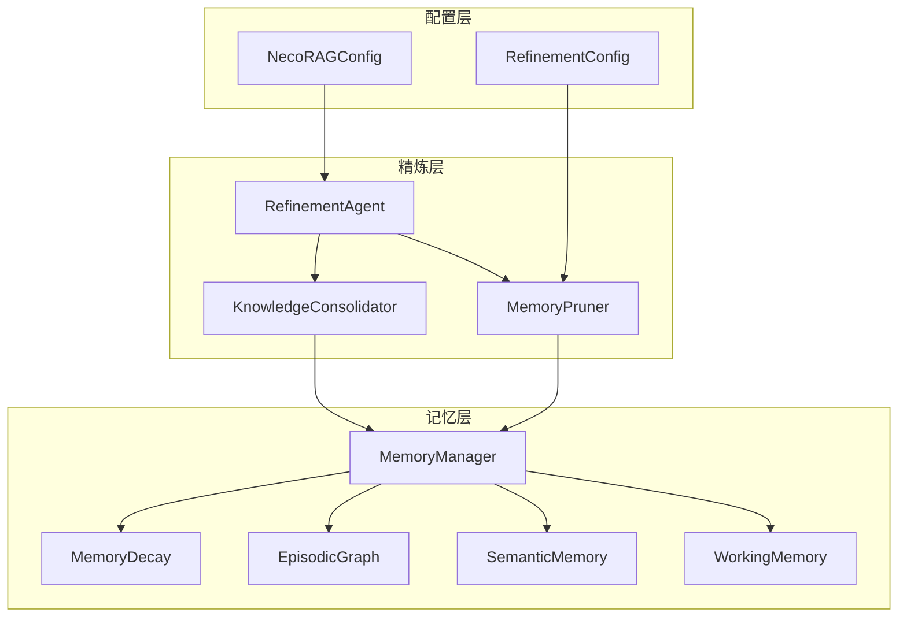
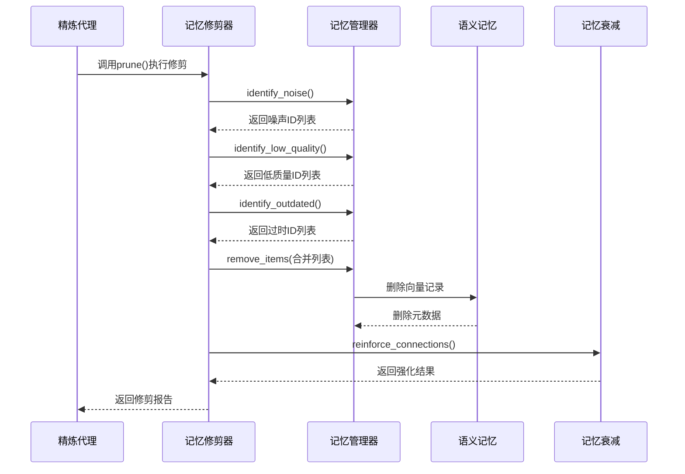
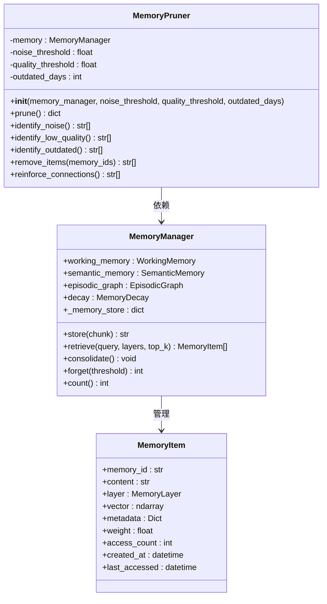
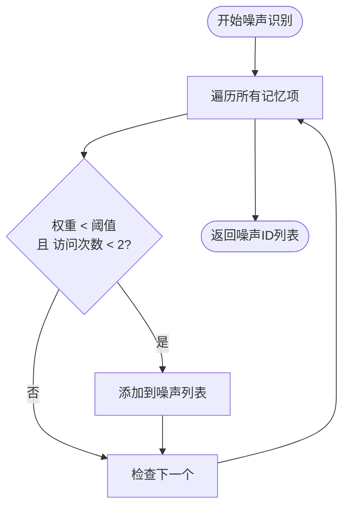
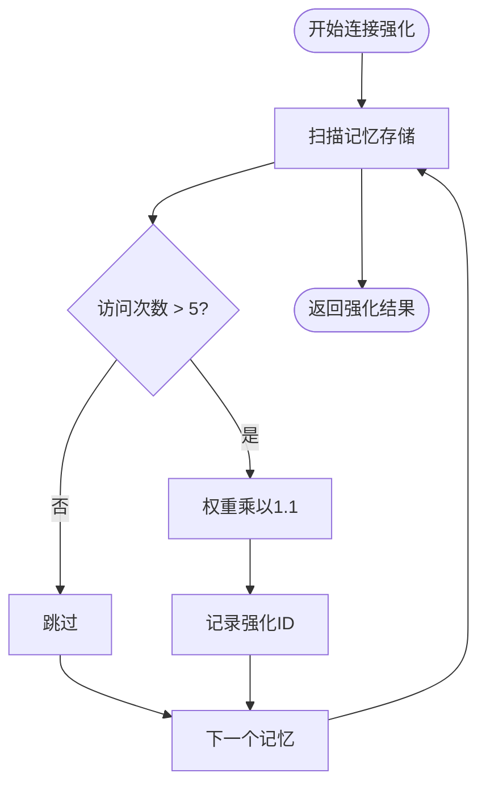
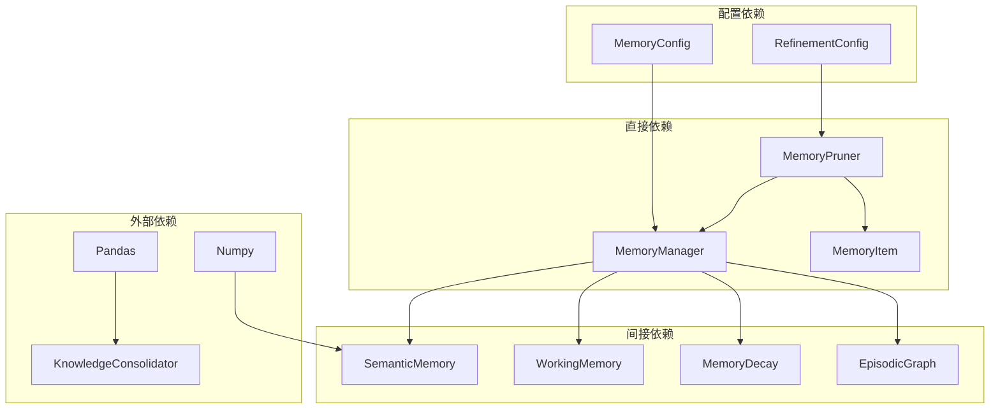

# 记忆修剪器 (MemoryPruner)

<cite>
**本文档引用的文件**
- [src/refinement/pruner.py](file://src/refinement/pruner.py)
- [src/memory/manager.py](file://src/memory/manager.py)
- [src/memory/models.py](file://src/memory/models.py)
- [src/memory/semantic_memory.py](file://src/memory/semantic_memory.py)
- [src/memory/working_memory.py](file://src/memory/working_memory.py)
- [src/memory/decay.py](file://src/memory/decay.py)
- [src/refinement/agent.py](file://src/refinement/agent.py)
- [src/core/config.py](file://src/core/config.py)
- [src/necorag.py](file://src/necorag.py)
</cite>

## 目录
1. [简介](#简介)
2. [项目结构](#项目结构)
3. [核心组件](#核心组件)
4. [架构概览](#架构概览)
5. [详细组件分析](#详细组件分析)
6. [依赖分析](#依赖分析)
7. [性能考虑](#性能考虑)
8. [故障排除指南](#故障排除指南)
9. [结论](#结论)

## 简介
记忆修剪器(MemoryPruner)是NecoRAG框架中负责维护和优化记忆系统的关键组件。它模拟猫的"舔毛梳理"行为，通过识别和清除噪声数据、低质量知识和过时信息，同时强化重要的连接，来维持记忆系统的高效运行。

## 项目结构
记忆修剪器位于精炼层(refinement)中，与记忆管理层紧密协作：

**图表来源**
- [src/refinement/agent.py:20-64](file://src/refinement/agent.py#L20-L64)
- [src/refinement/pruner.py:10-39](file://src/refinement/pruner.py#L10-L39)
- [src/memory/manager.py:20-47](file://src/memory/manager.py#L20-L47)

## 核心组件
记忆修剪器包含以下核心功能模块：

### 主要特征
- **噪声识别**：基于权重和访问频率识别无用数据
- **质量评估**：通过内容长度和权重判断知识质量
- **时效性检查**：基于最后访问时间识别过时信息
- **智能删除**：安全地移除低价值记忆项
- **连接强化**：提升高频访问记忆的权重

### 配置参数
- `noise_threshold`：噪声判定阈值，默认0.1
- `quality_threshold`：质量判定阈值，默认0.3  
- `outdated_days`：过时天数判定，默认90天

**章节来源**
- [src/refinement/pruner.py:20-39](file://src/refinement/pruner.py#L20-L39)
- [src/core/config.py:198-204](file://src/core/config.py#L198-L204)

## 架构概览
记忆修剪器在整个NecoRAG系统中的位置和作用：

**图表来源**
- [src/refinement/agent.py:143-163](file://src/refinement/agent.py#L143-L163)
- [src/refinement/pruner.py:41-69](file://src/refinement/pruner.py#L41-L69)

## 详细组件分析

### MemoryPruner类设计
记忆修剪器采用面向对象的设计模式，实现了清晰的职责分离：

**图表来源**
- [src/refinement/pruner.py:10-157](file://src/refinement/pruner.py#L10-L157)
- [src/memory/manager.py:20-212](file://src/memory/manager.py#L20-L212)
- [src/memory/models.py:14-26](file://src/memory/models.py#L14-L26)

### 修剪策略实现
记忆修剪器采用多层评估策略：

#### 噪声识别算法

**图表来源**
- [src/refinement/pruner.py:71-85](file://src/refinement/pruner.py#L71-L85)

#### 质量评估算法
低质量知识识别基于双重标准：
- 内容长度小于20字符
- 权重小于质量阈值

#### 时效性检查算法
过时信息识别使用时间窗口：
- 计算最后访问时间与当前时间的差值
- 超过outdated_days天的视为过时

### 连接强化机制
记忆修剪器实现了智能的连接强化策略：

**图表来源**
- [src/refinement/pruner.py:139-156](file://src/refinement/pruner.py#L139-L156)

**章节来源**
- [src/refinement/pruner.py:71-156](file://src/refinement/pruner.py#L71-L156)

## 依赖分析
记忆修剪器的依赖关系和耦合度分析：

**图表来源**
- [src/refinement/pruner.py:6-39](file://src/refinement/pruner.py#L6-L39)
- [src/memory/manager.py:8-47](file://src/memory/manager.py#L8-L47)
- [src/core/config.py:136-156](file://src/core/config.py#L136-L156)

### 耦合度评估
- **内聚性**：高 - 专注于记忆修剪功能
- **耦合度**：中等 - 与MemoryManager紧密耦合但保持接口抽象
- **循环依赖**：无 - 依赖方向单一

**章节来源**
- [src/refinement/pruner.py:1-157](file://src/refinement/pruner.py#L1-L157)
- [src/memory/manager.py:1-212](file://src/memory/manager.py#L1-L212)

## 性能考虑
记忆修剪器的性能特性和优化建议：

### 时间复杂度
- **噪声识别**：O(n) - 遍历所有记忆项
- **质量评估**：O(n) - 单次扫描
- **时效性检查**：O(n) - 时间比较
- **整体复杂度**：O(n) - n为记忆项数量

### 空间复杂度
- **内存使用**：O(n) - 存储ID列表和临时数据
- **缓存策略**：无外部缓存，依赖内存存储

### 优化建议
1. **批量操作**：对删除操作进行批处理
2. **索引优化**：为访问时间和权重建立索引
3. **异步处理**：支持异步修剪操作
4. **增量修剪**：实现增量式修剪而非全量扫描

## 故障排除指南
常见问题和解决方案：

### 修剪效果不佳
**症状**：修剪后内存使用量无明显变化
**可能原因**：
- 阈值设置过于严格
- 记忆项权重异常
- 访问统计信息缺失

**解决方法**：
1. 检查配置参数设置
2. 验证MemoryItem的权重计算
3. 确认访问统计功能正常

### 性能问题
**症状**：修剪操作耗时过长
**可能原因**：
- 记忆项数量过多
- 向量存储性能瓶颈
- 内存不足

**解决方法**：
1. 实施分批处理策略
2. 优化向量删除操作
3. 增加系统内存

### 数据完整性问题
**症状**：重要信息被误删
**可能原因**：
- 阈值设置过低
- 评估标准过于严格
- 强制删除逻辑错误

**解决方法**：
1. 调整阈值参数
2. 实施二次确认机制
3. 添加备份恢复功能

**章节来源**
- [src/refinement/pruner.py:120-137](file://src/refinement/pruner.py#L120-L137)
- [src/memory/semantic_memory.py:164-179](file://src/memory/semantic_memory.py#L164-L179)

## 结论
记忆修剪器作为NecoRAG框架的重要组成部分，通过智能化的记忆维护机制，有效解决了知识库膨胀和质量下降的问题。其设计体现了以下优势：

1. **多维度评估**：结合噪声、质量和时效性三个维度
2. **智能强化**：自动识别和强化重要连接
3. **可配置性**：支持灵活的参数调整
4. **高效性**：线性时间复杂度，适合大规模应用

未来可以进一步增强的功能包括：增量修剪、智能阈值调整、备份恢复机制等，以提供更加完善的记忆管理系统。