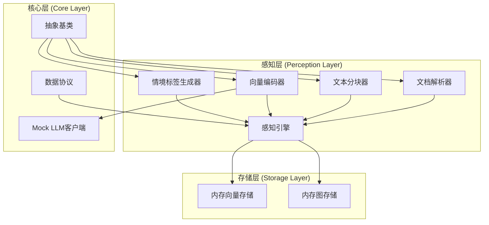
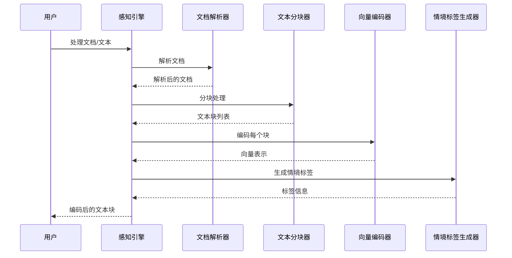
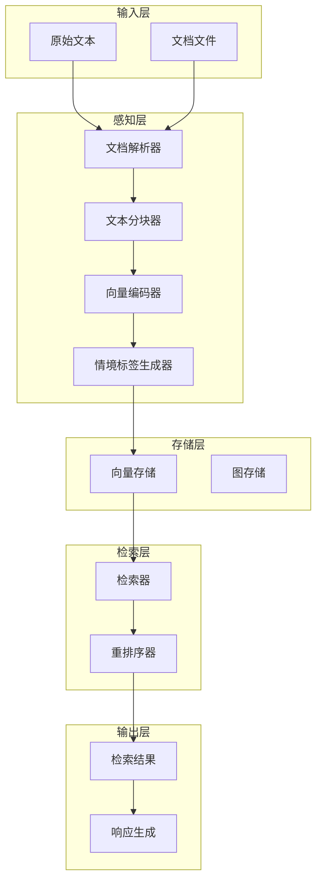
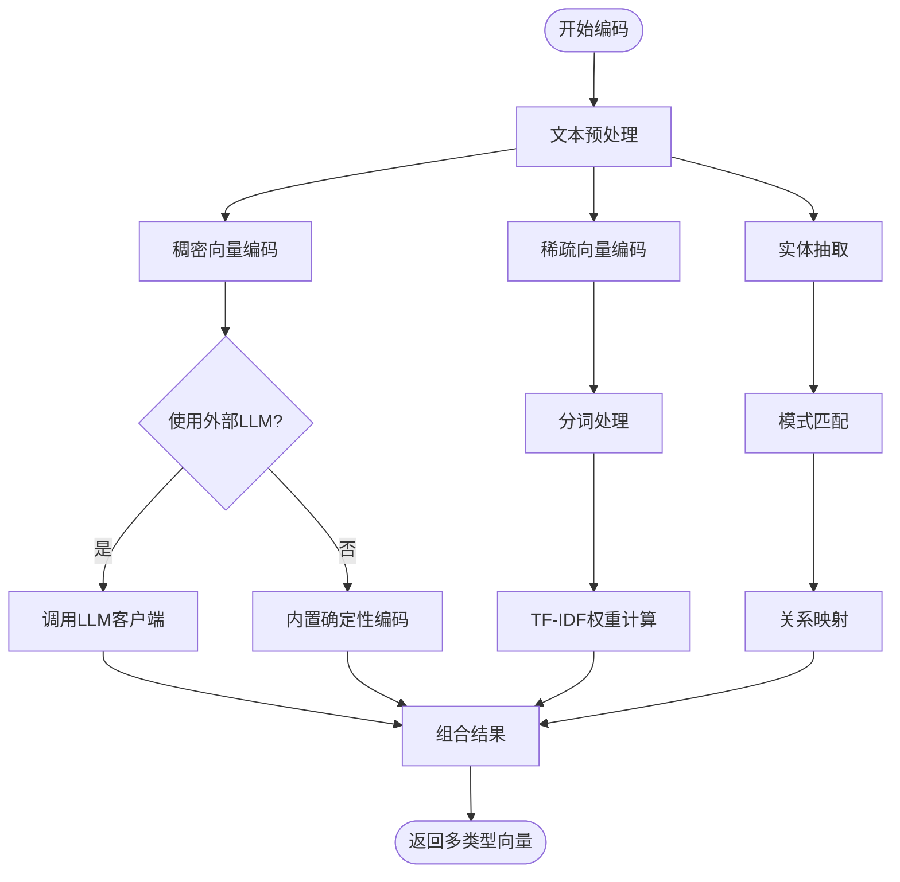
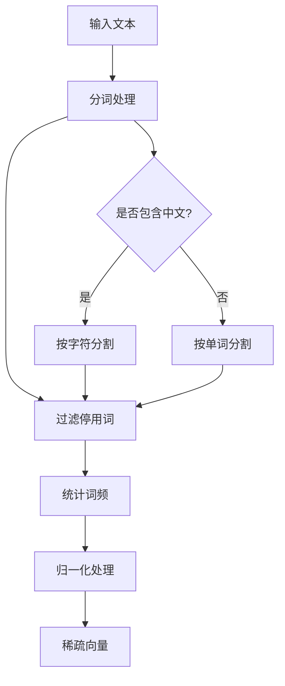
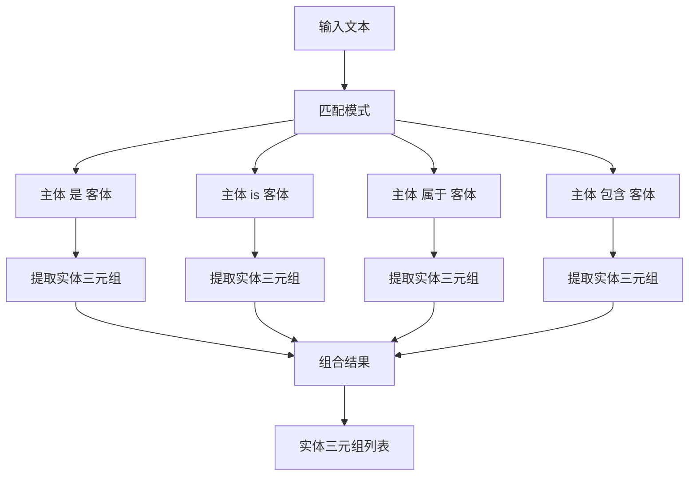
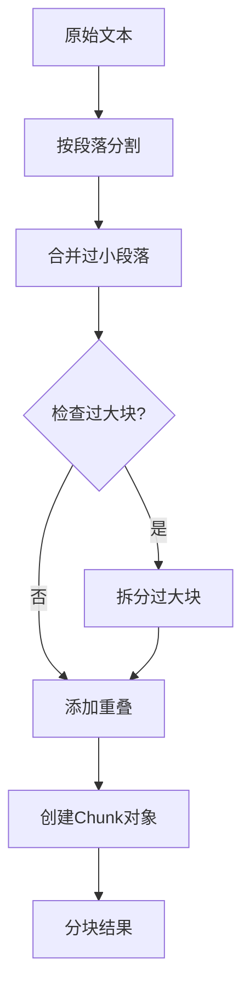
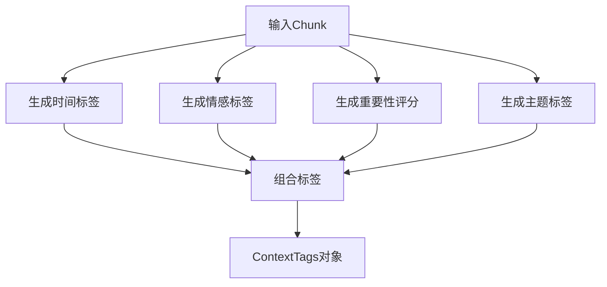
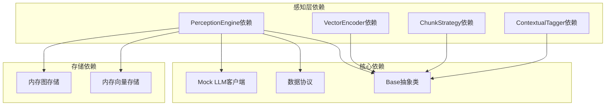
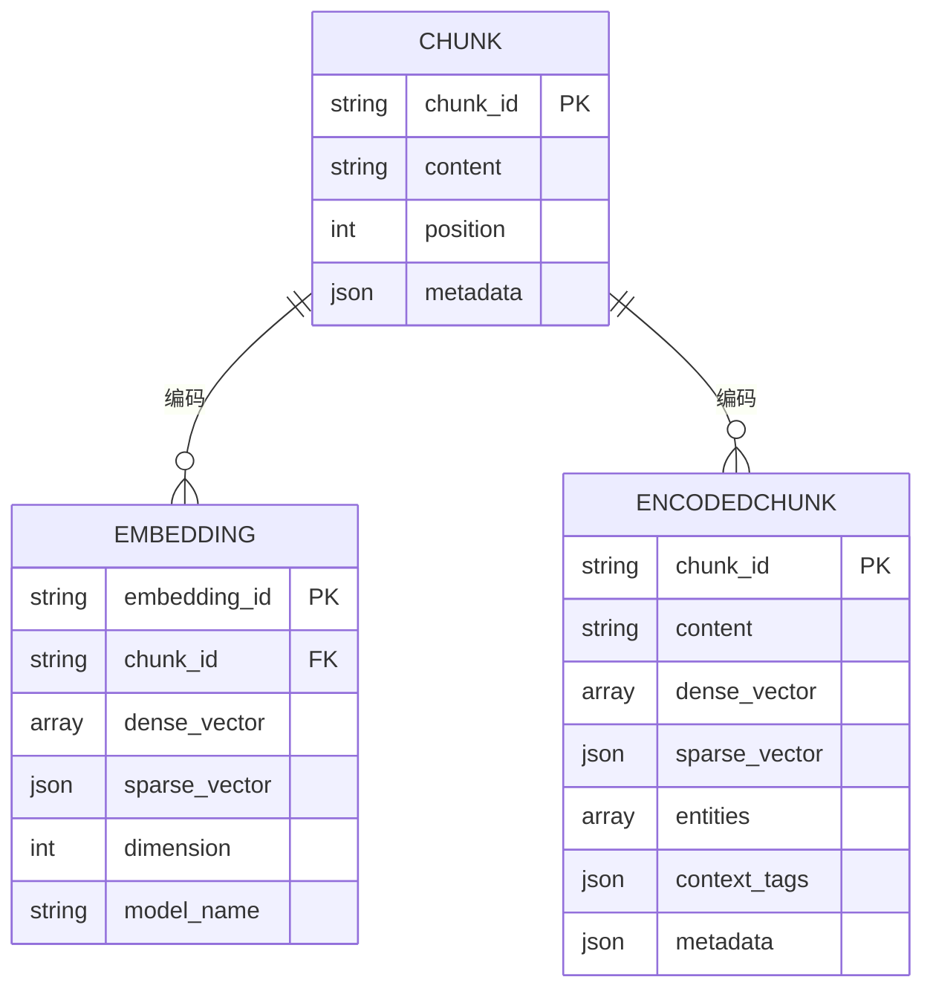

# 向量编码器

<cite>
**本文档引用的文件**
- [encoder.py](file://src/perception/encoder.py)
- [engine.py](file://src/perception/engine.py)
- [models.py](file://src/perception/models.py)
- [tagger.py](file://src/perception/tagger.py)
- [chunker.py](file://src/perception/chunker.py)
- [parser.py](file://src/perception/parser.py)
- [base.py](file://src/core/base.py)
- [protocols.py](file://src/core/protocols.py)
- [mock.py](file://src/core/llm/mock.py)
- [memory_store.py](file://src/memory/backends/memory_store.py)
- [example_usage.py](file://example/example_usage.py)
</cite>

## 目录
1. [简介](#简介)
2. [项目结构](#项目结构)
3. [核心组件](#核心组件)
4. [架构概览](#架构概览)
5. [详细组件分析](#详细组件分析)
6. [依赖关系分析](#依赖关系分析)
7. [性能考虑](#性能考虑)
8. [故障排除指南](#故障排除指南)
9. [结论](#结论)

## 简介

NecoRAG向量编码器是一个多模态向量编码系统，专门设计用于生成文本的多类型向量表示。该系统支持稠密向量、稀疏向量和实体三元组的生成，为后续的检索、记忆和推理提供丰富的语义表示。

系统的核心特点包括：
- **多类型向量生成**：同时生成稠密向量和稀疏向量
- **实体抽取**：识别和抽取文本中的实体关系
- **灵活的模型集成**：支持外部LLM客户端和内置实现
- **标准化的数据结构**：使用统一的协议和数据模型

## 项目结构

NecoRAG采用模块化的架构设计，向量编码器位于感知层（Perception Layer），主要包含以下核心模块：



**图表来源**
- [engine.py:20-76](file://src/perception/engine.py#L20-L76)
- [base.py:30-150](file://src/core/base.py#L30-L150)

**章节来源**
- [engine.py:20-76](file://src/perception/engine.py#L20-L76)
- [base.py:30-150](file://src/core/base.py#L30-L150)

## 核心组件

### 向量编码器 (VectorEncoder)

向量编码器是系统的核心组件，负责将文本转换为多类型的向量表示。它实现了BaseEncoder抽象基类，提供了完整的向量编码功能。

#### 主要功能特性

1. **多类型向量生成**：
   - 稠密向量：用于语义相似度计算
   - 稀疏向量：用于关键词权重表示
   - 实体三元组：用于知识图谱构建

2. **灵活的实现策略**：
   - 支持外部LLM客户端集成
   - 提供内置的确定性实现
   - 自动降级机制

3. **智能分词和预处理**：
   - 支持中英文混合文本
   - 智能停用词过滤
   - 词频统计和归一化

**章节来源**
- [encoder.py:25-87](file://src/perception/encoder.py#L25-L87)
- [encoder.py:89-148](file://src/perception/encoder.py#L89-L148)

### 感知引擎 (PerceptionEngine)

感知引擎是向量编码器的协调者，负责组织整个编码流程，包括文档解析、文本分块、向量编码和情境标记。

#### 核心流程



**图表来源**
- [engine.py:96-138](file://src/perception/engine.py#L96-L138)

**章节来源**
- [engine.py:20-155](file://src/perception/engine.py#L20-L155)

### 数据模型和协议

系统使用统一的数据模型确保各组件间的数据一致性：

#### 核心数据结构

1. **Chunk**：统一分块类型
2. **EncodedChunk**：编码后的分块
3. **ContextTags**：情境标签
4. **Embedding**：向量表示

**章节来源**
- [models.py:14-62](file://src/perception/models.py#L14-L62)
- [protocols.py:100-156](file://src/core/protocols.py#L100-L156)

## 架构概览

### 整体架构设计



**图表来源**
- [engine.py:20-155](file://src/perception/engine.py#L20-L155)
- [memory_store.py:20-141](file://src/memory/backends/memory_store.py#L20-L141)

### 向量编码流程



**图表来源**
- [encoder.py:73-190](file://src/perception/encoder.py#L73-L190)

## 详细组件分析

### 向量编码器实现详解

#### 稠密向量编码

向量编码器支持两种稠密向量生成方式：

1. **外部LLM客户端集成**：
   ```python
   # 优先使用外部LLM客户端
   if self._llm_client is not None:
       return self._llm_client.embed(text)
   ```

2. **内置确定性编码**：
   ```python
   def _builtin_dense_encode(self, text: str) -> List[float]:
       # 基于文本哈希生成确定性向量
       seed = int(hashlib.md5(text.encode()).hexdigest(), 16) % (2**32)
       rng = random.Random(seed)
       # 生成单位向量并归一化
   ```

**章节来源**
- [encoder.py:89-120](file://src/perception/encoder.py#L89-L120)
- [encoder.py:192-213](file://src/perception/encoder.py#L192-L213)

#### 稀疏向量编码

稀疏向量采用TF-IDF风格的词频统计：



**图表来源**
- [encoder.py:121-148](file://src/perception/encoder.py#L121-L148)

**章节来源**
- [encoder.py:121-148](file://src/perception/encoder.py#L121-L148)

#### 实体抽取算法

系统实现了基于规则的实体抽取机制：



**图表来源**
- [encoder.py:149-190](file://src/perception/encoder.py#L149-L190)

**章节来源**
- [encoder.py:149-190](file://src/perception/encoder.py#L149-L190)

### 文本分块策略

系统提供了多种文本分块策略，支持不同场景的需求：

#### 弹性分块算法



**图表来源**
- [chunker.py:89-141](file://src/perception/chunker.py#L89-L141)

**章节来源**
- [chunker.py:87-141](file://src/perception/chunker.py#L87-L141)

### 情境标签生成

情境标签生成器为每个文本块提供丰富的上下文信息：

#### 标签生成流程



**图表来源**
- [tagger.py:33-48](file://src/perception/tagger.py#L33-L48)

**章节来源**
- [tagger.py:33-163](file://src/perception/tagger.py#L33-L163)

## 依赖关系分析

### 组件依赖图



**图表来源**
- [engine.py:9-14](file://src/perception/engine.py#L9-L14)
- [base.py:11-17](file://src/core/base.py#L11-L17)

### 数据流依赖

系统采用统一的数据协议确保各组件间的数据一致性：



**图表来源**
- [protocols.py:100-156](file://src/core/protocols.py#L100-L156)

**章节来源**
- [protocols.py:100-156](file://src/core/protocols.py#L100-L156)

## 性能考虑

### 向量相似度计算

系统使用余弦相似度进行向量相似度计算：

```python
def _cosine_similarity(self, vec1: List[float], vec2: List[float]) -> float:
    """计算余弦相似度"""
    dot_product = sum(a * b for a, b in zip(vec1, vec2))
    norm1 = math.sqrt(sum(a * a for a in vec1))
    norm2 = math.sqrt(sum(b * b for b in vec2))
    
    if norm1 == 0 or norm2 == 0:
        return 0.0
    
    return dot_product / (norm1 * norm2)
```

**章节来源**
- [memory_store.py:116-125](file://src/memory/backends/memory_store.py#L116-L125)

### 批量处理优化

向量编码器支持批量处理以提高效率：

```python
def encode_dense_batch(self, texts: List[str]) -> List[List[float]]:
    """批量生成稠密向量"""
    if self._llm_client is not None:
        return self._llm_client.embed_batch(texts)
    
    return [self._builtin_dense_encode(text) for text in texts]
```

**章节来源**
- [encoder.py:106-119](file://src/perception/encoder.py#L106-L119)

### 内存管理

系统采用内存存储方案，适合开发和测试场景：

- **InMemoryVectorStore**：基于字典的向量存储
- **InMemoryGraphStore**：基于邻接表的图存储
- **自动清理机制**：支持清空和删除操作

**章节来源**
- [memory_store.py:20-141](file://src/memory/backends/memory_store.py#L20-L141)

## 故障排除指南

### 常见问题及解决方案

#### 1. 向量维度不匹配

**问题描述**：向量维度与存储器期望的维度不一致

**解决方案**：
- 确保编码器的向量维度与存储器初始化时指定的维度一致
- 检查LLM客户端的embedding_dimension属性

#### 2. 文本编码失败

**问题描述**：向量编码过程中出现异常

**排查步骤**：
1. 检查输入文本是否为空
2. 验证LLM客户端连接状态
3. 确认Mock LLM客户端的确定性设置

#### 3. 实体抽取不准确

**问题描述**：实体三元组抽取结果不符合预期

**优化建议**：
- 调整正则表达式模式
- 扩展关系映射表
- 考虑集成更强大的NLP库

**章节来源**
- [encoder.py:149-190](file://src/perception/encoder.py#L149-L190)

### 调试技巧

#### 启用详细日志

```python
import logging
logging.basicConfig(level=logging.DEBUG)
```

#### 性能监控

```python
import time
start_time = time.time()
# 执行编码操作
end_time = time.time()
print(f"编码耗时: {end_time - start_time}秒")
```

## 结论

NecoRAG向量编码器提供了一个完整、灵活且高效的多模态向量编码解决方案。系统的主要优势包括：

1. **模块化设计**：清晰的组件分离和职责划分
2. **灵活集成**：支持外部LLM客户端和内置实现
3. **标准化协议**：统一的数据模型确保系统一致性
4. **丰富功能**：同时支持稠密向量、稀疏向量和实体抽取
5. **性能优化**：批处理支持和内存存储方案

该系统为后续的检索、记忆和推理提供了坚实的基础，是构建智能问答系统的重要组成部分。通过合理的配置和优化，可以满足不同规模和复杂度的应用需求。