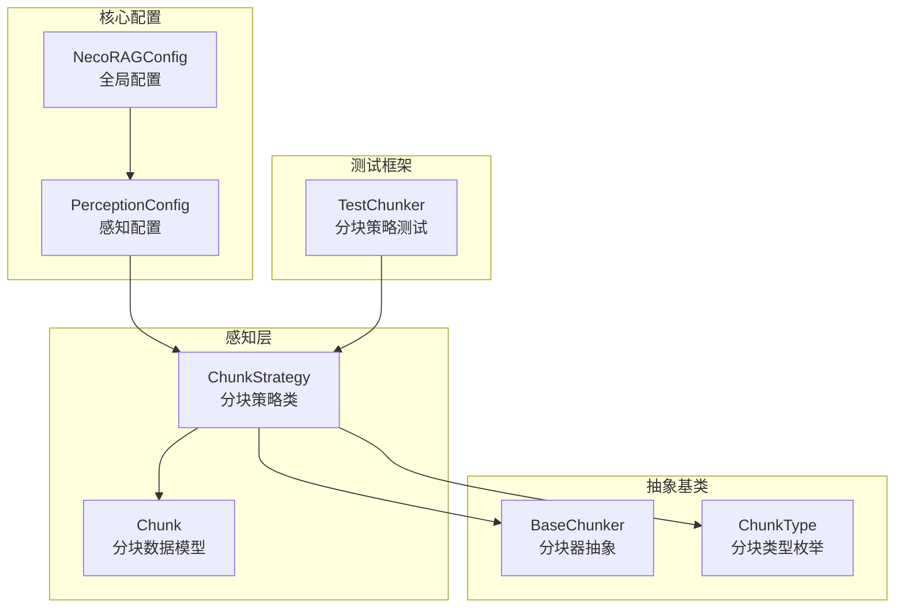
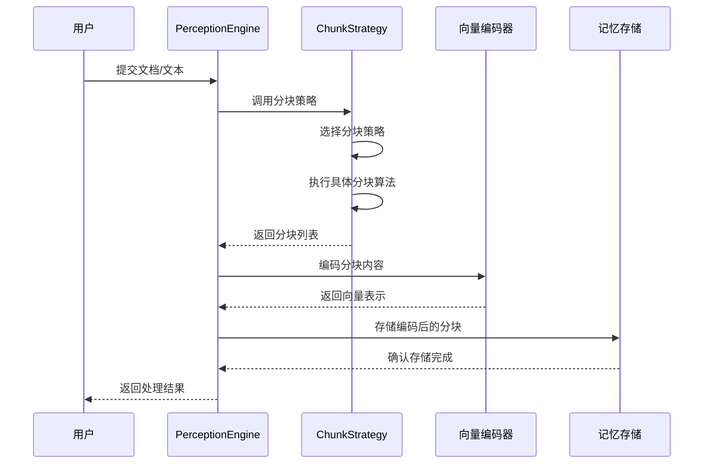
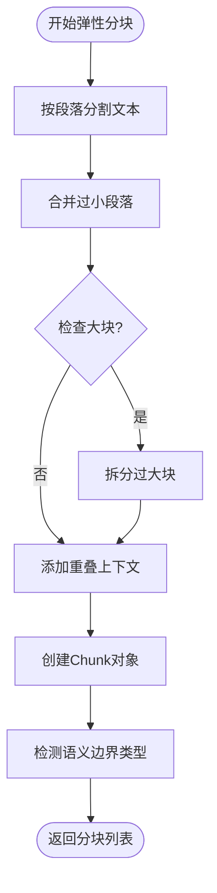
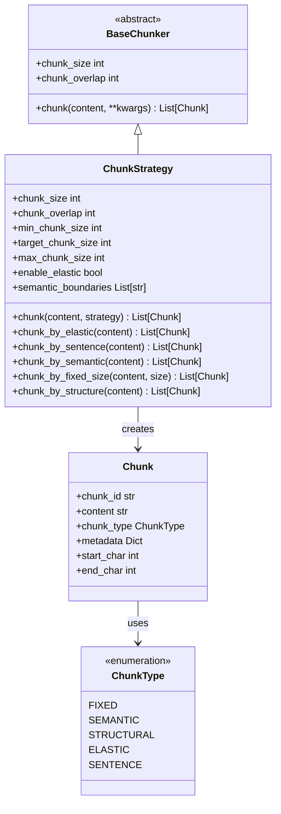
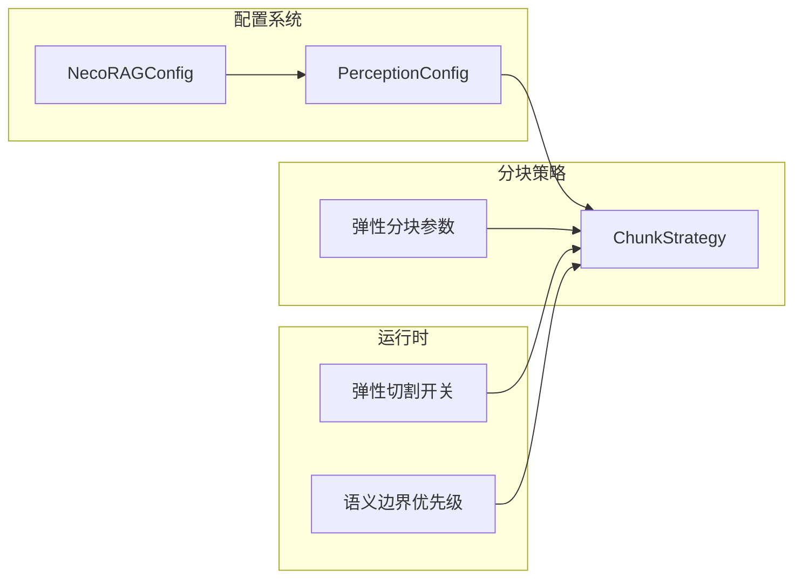

# 弹性分块策略

<cite>
**本文档引用的文件**
- [src/perception/chunker.py](file://src/perception/chunker.py)
- [src/perception/models.py](file://src/perception/models.py)
- [src/core/config.py](file://src/core/config.py)
- [src/core/base.py](file://src/core/base.py)
- [src/core/protocols.py](file://src/core/protocols.py)
- [tests/test_perception/test_chunker.py](file://tests/test_perception/test_chunker.py)
- [example/example_usage.py](file://example/example_usage.py)
</cite>

## 目录
1. [简介](#简介)
2. [项目结构](#项目结构)
3. [核心组件](#核心组件)
4. [架构概览](#架构概览)
5. [详细组件分析](#详细组件分析)
6. [依赖关系分析](#依赖关系分析)
7. [性能考量](#性能考量)
8. [故障排除指南](#故障排除指南)
9. [结论](#结论)
10. [附录](#附录)

## 简介

NecoRAG的弹性分块策略是一个高度智能化的文本分割系统，旨在为下游的向量检索和知识管理提供最优的文本块划分方案。该系统支持五种不同的分块策略：弹性分块、语义分块、固定大小分块、结构化分块和句子级分块，每种策略都有其特定的适用场景和性能特征。

弹性分块策略是整个系统的核心创新，它通过智能调整块大小、保持语义完整性、动态边界检测和重叠上下文管理等机制，实现了比传统固定大小分块更优的检索效果和内存使用效率。

## 项目结构

NecoRAG采用模块化的架构设计，弹性分块策略位于感知层的perception模块中，与配置管理、数据模型和测试框架紧密集成。



**图表来源**
- [src/perception/chunker.py:12-86](file://src/perception/chunker.py#L12-L86)
- [src/core/config.py:105-132](file://src/core/config.py#L105-L132)
- [src/core/base.py:66-92](file://src/core/base.py#L66-L92)
- [src/core/protocols.py:27-34](file://src/core/protocols.py#L27-L34)

**章节来源**
- [src/perception/chunker.py:1-567](file://src/perception/chunker.py#L1-L567)
- [src/core/config.py:105-132](file://src/core/config.py#L105-L132)

## 核心组件

### ChunkStrategy 类

ChunkStrategy是弹性分块策略的核心实现，继承自BaseChunker抽象基类，提供了统一的分块入口方法和多种分块策略的具体实现。

#### 主要特性
- **多策略支持**：支持弹性、语义、固定大小、结构化和句子级五种分块策略
- **智能边界检测**：自动识别段落、句子和子句边界
- **动态大小调整**：根据内容特征动态调整块大小
- **重叠上下文管理**：智能添加前后文重叠以保持语义连贯性

#### 核心参数配置
- `chunk_size`: 固定分块大小（兼容模式使用）
- `chunk_overlap`: 分块重叠长度
- `min_chunk_size`: 弹性分块最小块大小（字符）
- `target_chunk_size`: 弹性分块目标块大小（字符）
- `max_chunk_size`: 弹性分块最大块大小（字符）
- `enable_elastic`: 是否启用弹性切割
- `semantic_boundaries`: 语义边界优先级列表

**章节来源**
- [src/perception/chunker.py:19-47](file://src/perception/chunker.py#L19-L47)
- [src/core/config.py:108-121](file://src/core/config.py#L108-L121)

### 分块数据模型

系统使用统一的Chunk数据模型来表示分块结果，确保不同模块间的数据一致性。

#### Chunk 数据模型
- `chunk_id`: 分块唯一标识符
- `content`: 分块内容文本
- `doc_id`: 所属文档标识符
- `chunk_type`: 分块类型（FIXED、SEMANTIC、STRUCTURAL、ELASTIC、SENTENCE）
- `position`: 在文档中的位置
- `metadata`: 分块元数据
- `start_char`、`end_char`: 字符位置信息
- `prev_chunk_id`、`next_chunk_id`: 上下文关联

**章节来源**
- [src/core/protocols.py:101-117](file://src/core/protocols.py#L101-L117)
- [src/perception/models.py:53-62](file://src/perception/models.py#L53-L62)

## 架构概览

弹性分块策略在整个NecoRAG系统中扮演着关键角色，它直接影响向量检索的效果和内存使用效率。



**图表来源**
- [src/perception/chunker.py:49-85](file://src/perception/chunker.py#L49-L85)
- [src/perception/models.py:53-62](file://src/perception/models.py#L53-L62)

## 详细组件分析

### 弹性分块策略

弹性分块是NecoRAG最具创新性的功能，它通过智能算法实现了比传统方法更优的文本分割效果。

#### 核心算法流程



**图表来源**
- [src/perception/chunker.py:89-141](file://src/perception/chunker.py#L89-L141)

#### 动态大小调整机制

弹性分块的核心在于其动态调整机制，该机制通过三个关键参数实现智能控制：

1. **最小块大小（min_chunk_size）**: 避免产生过小的碎片化块
2. **目标块大小（target_chunk_size）**: 理想的块大小范围
3. **最大块大小（max_chunk_size）**: 超过此大小时强制切割

#### 边界检测优先级

系统实现了多层次的语义边界检测，按照以下优先级顺序：

1. **句子边界**：优先在句号、感叹号、问号处分割
2. **子句边界**：其次在逗号、分号、顿号处分割  
3. **词边界**：最后在空格处分割（英文）或按字符分割（中文）

**章节来源**
- [src/perception/chunker.py:89-141](file://src/perception/chunker.py#L89-L141)
- [src/perception/chunker.py:381-433](file://src/perception/chunker.py#L381-L433)

### 语义分块策略

语义分块基于段落级别的分割，保持每个分块的语义完整性，适用于需要保持上下文连贯性的场景。

#### 实现特点
- 使用双换行符作为段落分隔符
- 保持原始段落内容的完整性
- 自动计算字符位置信息
- 适用于学术论文、技术文档等结构化文本

**章节来源**
- [src/perception/chunker.py:185-216](file://src/perception/chunker.py#L185-L216)

### 固定大小分块策略

固定大小分块采用传统的滑动窗口方法，简单直接但缺乏语义智能性。

#### 参数配置
- `chunk_size`: 每个块的固定大小
- `chunk_overlap`: 块间的重叠字符数
- 适用于大规模文本处理和批处理场景

**章节来源**
- [src/perception/chunker.py:218-248](file://src/perception/chunker.py#L218-L248)

### 结构化分块策略

结构化分块基于文档的标题、段落等结构信息进行分割，特别适合HTML、Markdown等标记语言文档。

#### 实现方式
- 复用语义分块的基础实现
- 更新元数据中的分块策略标识
- 保持文档的层次结构信息

**章节来源**
- [src/perception/chunker.py:250-265](file://src/perception/chunker.py#L250-L265)

### 句子级分块策略

句子级分块将文本按句子边界进行分割，每个句子作为一个独立的分块。

#### 支持的语言
- **中文**：句号（。）、感叹号（！）、问号（？）
- **英文**：句号（.）、感叹号（!）、问号（?）
- **混合文本**：自动识别中英文标点

**章节来源**
- [src/perception/chunker.py:143-183](file://src/perception/chunker.py#L143-L183)

## 依赖关系分析

弹性分块策略与系统的其他组件存在密切的依赖关系，形成了完整的数据处理链路。



**图表来源**
- [src/core/base.py:66-92](file://src/core/base.py#L66-L92)
- [src/perception/chunker.py:12-86](file://src/perception/chunker.py#L12-L86)
- [src/core/protocols.py:27-34](file://src/core/protocols.py#L27-L34)

### 配置依赖关系

弹性分块策略与配置系统紧密集成，通过PerceptionConfig提供灵活的参数定制能力。



**图表来源**
- [src/core/config.py:105-121](file://src/core/config.py#L105-L121)
- [src/perception/chunker.py:19-47](file://src/perception/chunker.py#L19-L47)

**章节来源**
- [src/core/config.py:105-121](file://src/core/config.py#L105-L121)
- [src/perception/chunker.py:19-47](file://src/perception/chunker.py#L19-L47)

## 性能考量

弹性分块策略在设计时充分考虑了性能优化，通过多种机制平衡了准确性和效率。

### 时间复杂度分析

| 算法步骤 | 时间复杂度 | 空间复杂度 | 说明 |
|---------|-----------|-----------|------|
| 段落分割 | O(n) | O(k) | n为文本长度，k为段落数 |
| 小块合并 | O(k) | O(k) | k为段落数 |
| 大块拆分 | O(m) | O(m) | m为需要拆分的块数 |
| 重叠添加 | O(m) | O(m) | m为最终块数 |
| 总体复杂度 | O(n+m) | O(n+m) | 线性时间复杂度 |

### 内存使用优化

1. **流式处理**：支持大文本的分块处理，避免一次性加载到内存
2. **增量构建**：分块结果按需构建，减少中间对象的创建
3. **重叠优化**：智能重叠计算，避免不必要的内存复制

### 参数调优建议

#### 弹性分块参数调优
- **min_chunk_size**: 建议设置为1000-2000字符，避免过度碎片化
- **target_chunk_size**: 建议设置为2000-4000字符，平衡检索精度和效率
- **max_chunk_size**: 建议设置为4000-8000字符，防止超大块影响检索性能

#### 不同场景的推荐配置

| 场景类型 | min_chunk_size | target_chunk_size | max_chunk_size | 重叠比例 |
|---------|---------------|-------------------|---------------|----------|
| 学术论文 | 1500 | 3000 | 6000 | 10-15% |
| 技术文档 | 1000 | 2500 | 5000 | 15-20% |
| 新闻文章 | 800 | 2000 | 4000 | 20-25% |
| 社交媒体 | 500 | 1500 | 3000 | 25-30% |

**章节来源**
- [src/perception/chunker.py:89-141](file://src/perception/chunker.py#L89-L141)
- [src/core/config.py:113-121](file://src/core/config.py#L113-L121)

## 故障排除指南

### 常见问题及解决方案

#### 问题1：分块结果质量不佳
**症状**：分块过于碎片化或过大
**解决方案**：
1. 调整min_chunk_size参数，避免过小的块
2. 优化target_chunk_size，使其更符合内容特征
3. 检查semantic_boundaries设置是否合理

#### 问题2：内存使用过高
**症状**：处理大文本时内存溢出
**解决方案**：
1. 增加max_chunk_size限制
2. 减少chunk_overlap设置
3. 考虑使用固定大小分块策略

#### 问题3：中文文本分块异常
**症状**：中文标点识别错误
**解决方案**：
1. 确认文本编码格式正确
2. 检查标点符号的Unicode编码
3. 调整语义边界检测逻辑

**章节来源**
- [tests/test_perception/test_chunker.py:297-366](file://tests/test_perception/test_chunker.py#L297-L366)

### 单元测试覆盖

系统提供了全面的单元测试，涵盖各种边界情况和异常处理：

#### 测试覆盖范围
- **初始化测试**：验证默认参数和自定义参数
- **策略切换测试**：验证不同分块策略的正确性
- **边界情况测试**：空文本、超长文本、特殊字符
- **参数有效性测试**：min/target/max大小参数的约束
- **元数据完整性测试**：位置信息和策略标识的正确性

**章节来源**
- [tests/test_perception/test_chunker.py:17-116](file://tests/test_perception/test_chunker.py#L17-L116)

## 结论

NecoRAG的弹性分块策略通过智能化的算法设计和灵活的参数配置，为现代AI应用提供了高效、准确的文本分割解决方案。该策略不仅在技术上具有创新性，更重要的是能够显著提升下游向量检索的效果和内存使用效率。

### 主要优势
1. **智能边界检测**：自动识别段落、句子和子句边界
2. **动态大小调整**：根据内容特征自适应调整块大小
3. **多策略支持**：满足不同应用场景的需求
4. **性能优化**：线性时间复杂度，内存使用高效
5. **配置灵活**：丰富的参数调节选项

### 应用前景
弹性分块策略为构建高质量的RAG系统奠定了坚实基础，通过合理的参数调优和策略选择，可以在保证检索精度的同时最大化系统性能。

## 附录

### 使用示例

以下是如何在实际项目中使用弹性分块策略的示例：

#### 基本使用方法
```python
# 创建分块器实例
chunker = ChunkStrategy(
    chunk_size=512,
    chunk_overlap=50,
    min_chunk_size=1024,
    target_chunk_size=2048,
    max_chunk_size=5120
)

# 执行分块
chunks = chunker.chunk(text_content)
```

#### 配置文件设置
```yaml
perception:
  chunk_strategy: "elastic"
  chunk_size: 512
  chunk_overlap: 50
  min_chunk_size: 1024
  target_chunk_size: 2048
  max_chunk_size: 5120
  enable_elastic_chunking: true
```

**章节来源**
- [example/example_usage.py:20-47](file://example/example_usage.py#L20-L47)
- [src/core/config.py:108-121](file://src/core/config.py#L108-L121)