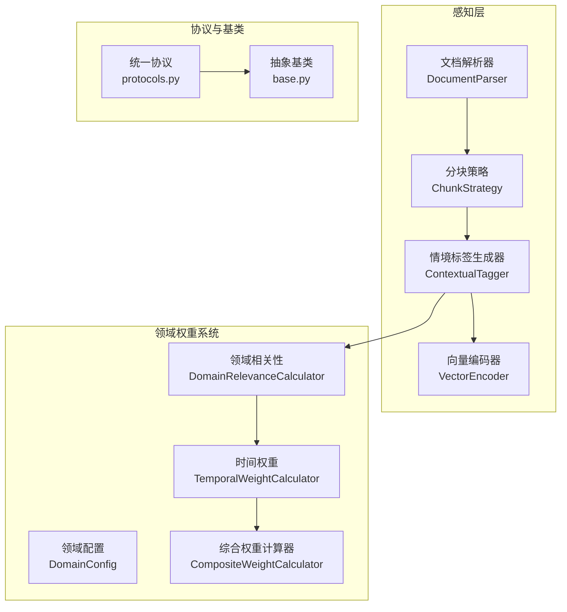
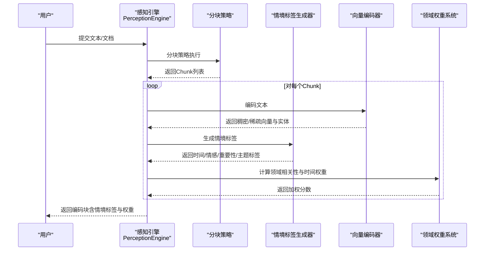
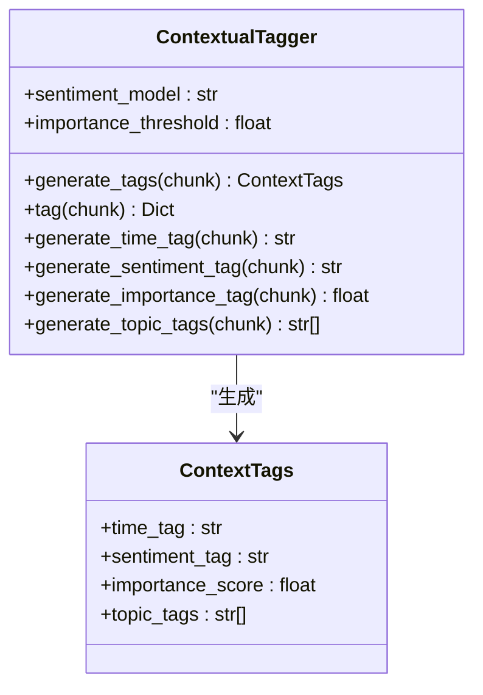
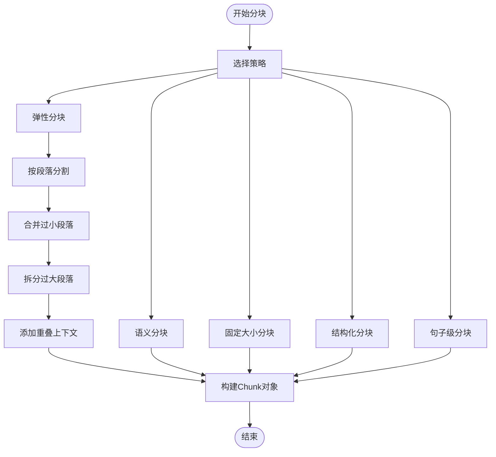
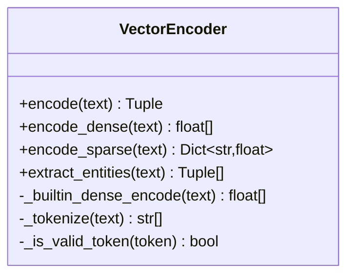
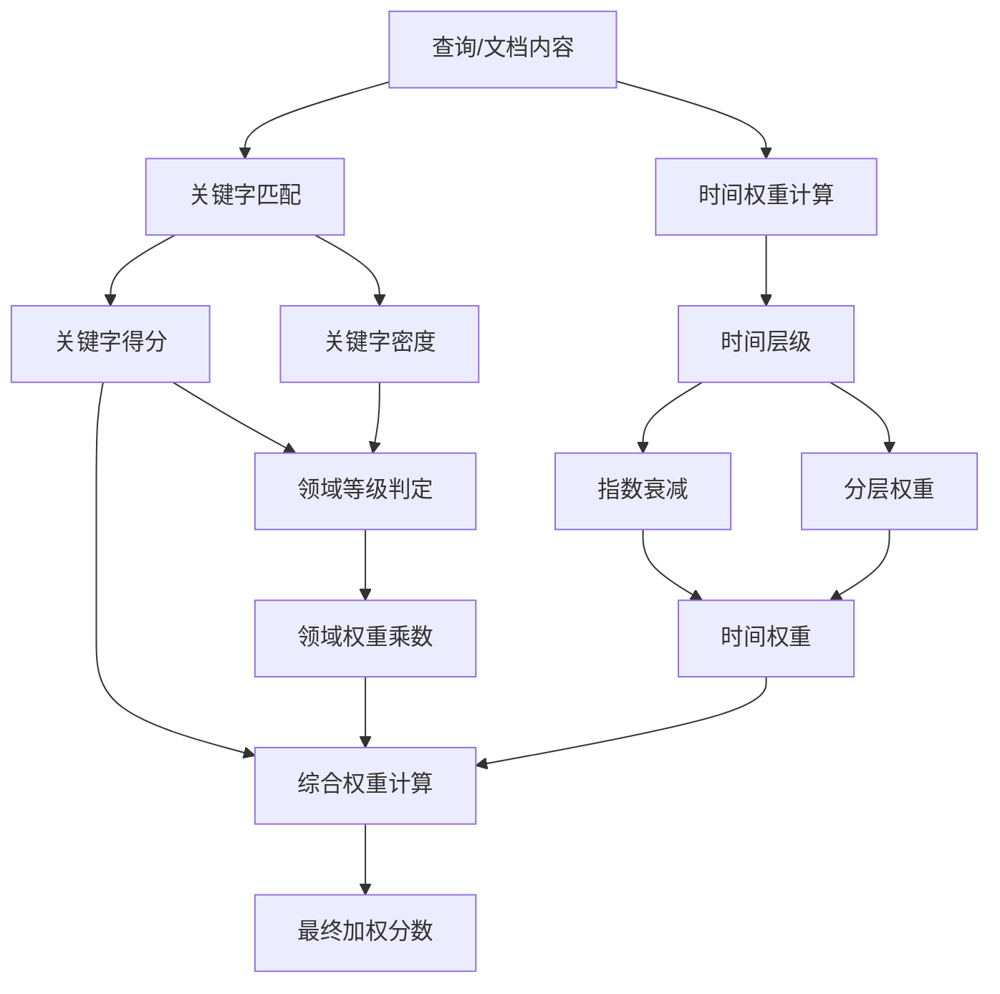
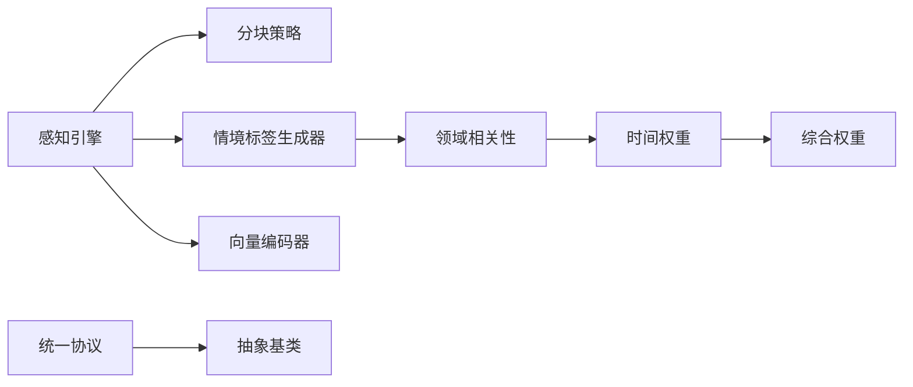

# 情境标签生成器

<cite>
**本文档引用的文件**
- [src/perception/tagger.py](file://src/perception/tagger.py)
- [src/perception/engine.py](file://src/perception/engine.py)
- [src/perception/models.py](file://src/perception/models.py)
- [src/perception/chunker.py](file://src/perception/chunker.py)
- [src/perception/encoder.py](file://src/perception/encoder.py)
- [src/core/base.py](file://src/core/base.py)
- [src/core/protocols.py](file://src/core/protocols.py)
- [src/domain/relevance.py](file://src/domain/relevance.py)
- [src/domain/temporal_weight.py](file://src/domain/temporal_weight.py)
- [src/domain/weight_calculator.py](file://src/domain/weight_calculator.py)
- [src/domain/config.py](file://src/domain/config.py)
- [example/example_usage.py](file://example/example_usage.py)
- [example/domain_weight_example.py](file://example/domain_weight_example.py)
</cite>

## 目录
1. [简介](#简介)
2. [项目结构](#项目结构)
3. [核心组件](#核心组件)
4. [架构总览](#架构总览)
5. [详细组件分析](#详细组件分析)
6. [依赖关系分析](#依赖关系分析)
7. [性能考量](#性能考量)
8. [故障排查指南](#故障排查指南)
9. [结论](#结论)
10. [附录](#附录)

## 简介
本文件面向NecoRAG情境标签生成器，系统性阐述情境标签的生成算法、特征工程与应用场景，覆盖时间标签、情感标签、主题标签与重要性评分的识别机制；解释TF-IDF权重计算、词向量聚合与上下文建模；梳理标签系统的层次结构与标签传播机制；并通过具体代码示例展示标签生成流程，包括输入文本处理、标签预测与置信度评估；最后说明情境标签在后续检索与排序中的应用价值。

## 项目结构
NecoRAG采用模块化设计，情境标签生成位于感知层（perception），与分块、编码、领域权重系统协同工作，形成“解析-分块-编码-打标-权重融合”的完整流水线。

图表来源
- [src/perception/engine.py:20-76](file://src/perception/engine.py#L20-L76)
- [src/perception/tagger.py:11-48](file://src/perception/tagger.py#L11-L48)
- [src/domain/relevance.py:29-41](file://src/domain/relevance.py#L29-L41)
- [src/domain/temporal_weight.py:47-52](file://src/domain/temporal_weight.py#L47-L52)
- [src/domain/weight_calculator.py:56-80](file://src/domain/weight_calculator.py#L56-L80)
- [src/core/protocols.py:101-117](file://src/core/protocols.py#L101-L117)
- [src/core/base.py:135-149](file://src/core/base.py#L135-L149)

章节来源
- [src/perception/engine.py:20-76](file://src/perception/engine.py#L20-L76)
- [src/perception/tagger.py:11-48](file://src/perception/tagger.py#L11-L48)
- [src/domain/relevance.py:29-41](file://src/domain/relevance.py#L29-L41)
- [src/domain/temporal_weight.py:47-52](file://src/domain/temporal_weight.py#L47-L52)
- [src/domain/weight_calculator.py:56-80](file://src/domain/weight_calculator.py#L56-L80)
- [src/core/protocols.py:101-117](file://src/core/protocols.py#L101-L117)
- [src/core/base.py:135-149](file://src/core/base.py#L135-L149)

## 核心组件
- 情境标签生成器（ContextualTagger）：负责为每个Chunk生成时间、情感、重要性与主题标签。
- 分块策略（ChunkStrategy）：提供弹性、语义、固定大小、结构化、句子级等分块方式。
- 向量编码器（VectorEncoder）：生成稠密向量、稀疏向量与实体三元组。
- 领域相关性计算器（DomainRelevanceCalculator）：基于关键字与密度计算领域相关性与置信度。
- 时间权重计算器（TemporalWeightCalculator）：按时间层级与指数衰减计算权重。
- 综合权重计算器（CompositeWeightCalculator）：融合关键字、时间与领域权重，输出最终加权分数。

章节来源
- [src/perception/tagger.py:11-48](file://src/perception/tagger.py#L11-L48)
- [src/perception/chunker.py:12-86](file://src/perception/chunker.py#L12-L86)
- [src/perception/encoder.py:25-88](file://src/perception/encoder.py#L25-L88)
- [src/domain/relevance.py:29-41](file://src/domain/relevance.py#L29-L41)
- [src/domain/temporal_weight.py:47-52](file://src/domain/temporal_weight.py#L47-L52)
- [src/domain/weight_calculator.py:56-80](file://src/domain/weight_calculator.py#L56-L80)

## 架构总览
情境标签生成器在感知引擎中承担“打标”角色，与分块与编码紧密协作，同时与领域权重系统对接，为后续检索与排序提供高质量的上下文信号。

图表来源
- [src/perception/engine.py:96-138](file://src/perception/engine.py#L96-L138)
- [src/perception/tagger.py:33-66](file://src/perception/tagger.py#L33-L66)
- [src/perception/encoder.py:73-87](file://src/perception/encoder.py#L73-L87)
- [src/domain/weight_calculator.py:81-146](file://src/domain/weight_calculator.py#L81-L146)

## 详细组件分析

### 情境标签生成器（ContextualTagger）
- 功能职责
  - 生成时间标签：从Chunk元数据中提取创建时间，若无则标记为未知。
  - 生成情感标签：基于关键词集合进行简单统计，输出积极/消极/中性。
  - 生成重要性评分：基于文本长度与词汇多样性，归一化得到0-1区间分数。
  - 生成主题标签：统计高频词（过滤短词），返回前若干个高频词作为主题标签。
- 特征工程要点
  - 情感标签：关键词集合（中英文混合），通过计数比较决定极性。
  - 重要性评分：信息密度（独特词占比）与长度因子的加权平均。
  - 主题标签：基于词频统计，过滤短词以减少噪声。
- 置信度评估
  - 情感标签：基于匹配到的关键词数量与分布，提供置信度说明（可扩展）。
  - 重要性评分：基于密度与长度的稳定性，提供相对置信度。
- 应用场景
  - 检索前筛选：高重要性块优先参与检索。
  - 排序加权：结合领域权重与时间权重，提升相关高价值内容的排名。

图表来源
- [src/perception/tagger.py:11-48](file://src/perception/tagger.py#L11-L48)
- [src/perception/models.py:14-21](file://src/perception/models.py#L14-L21)

章节来源
- [src/perception/tagger.py:33-163](file://src/perception/tagger.py#L33-L163)
- [src/perception/models.py:14-21](file://src/perception/models.py#L14-L21)

### 分块策略（ChunkStrategy）
- 分块模式
  - 弹性分块：按段落合并小块、拆分大块，保证语义完整性与大小平衡。
  - 语义分块：按段落边界保持语义单元。
  - 固定大小分块：滑动窗口固定长度，带重叠。
  - 结构化分块：基于标题、段落等结构信息。
  - 句子级分块：按中英文句号、感叹号、问号等标点分割。
- 边界检测与重叠
  - 支持句子、子句、词边界优先级查找，确保在合适位置切割。
  - 相邻块添加重叠上下文，提升语义连贯性。
- 适用性
  - 弹性分块适合长文档，兼顾语义与效率。
  - 句子级分块适合需要严格句内语义的场景。

图表来源
- [src/perception/chunker.py:49-141](file://src/perception/chunker.py#L49-L141)
- [src/perception/chunker.py:143-183](file://src/perception/chunker.py#L143-L183)
- [src/perception/chunker.py:185-216](file://src/perception/chunker.py#L185-L216)
- [src/perception/chunker.py:218-248](file://src/perception/chunker.py#L218-L248)
- [src/perception/chunker.py:250-265](file://src/perception/chunker.py#L250-L265)

章节来源
- [src/perception/chunker.py:49-265](file://src/perception/chunker.py#L49-L265)

### 向量编码器（VectorEncoder）
- 多类型向量生成
  - 稠密向量：优先使用LLM客户端，回退至内置确定性向量生成。
  - 稀疏向量：基于TF-IDF风格的词频统计，归一化为权重字典。
  - 实体三元组：基于规则提取“主体-关系-客体”三元组。
- 特征工程
  - TF-IDF权重：统计词频并归一化，过滤停用词与短词。
  - 分词策略：中英文混合处理，中文按双字词切分，英文按单词。
- 应用价值
  - 为检索提供稠密向量表示。
  - 为主题标签提供词频权重，辅助主题聚类与传播。

图表来源
- [src/perception/encoder.py:25-88](file://src/perception/encoder.py#L25-L88)
- [src/perception/encoder.py:121-148](file://src/perception/encoder.py#L121-L148)
- [src/perception/encoder.py:149-190](file://src/perception/encoder.py#L149-L190)

章节来源
- [src/perception/encoder.py:25-255](file://src/perception/encoder.py#L25-L255)

### 领域相关性与时间权重
- 领域相关性评分
  - 关键字得分：加权匹配计数，归一化到[0,2]区间。
  - 关键字密度：匹配次数与总词数比值，归一化到[0,1]。
  - 综合评分：加权组合关键字得分与密度，映射到[0,1]。
  - 置信度：基于匹配关键字数量，阈值化到[0,1]。
- 时间权重
  - 时间层级：最近、近期、中期、远期、历史、常青。
  - 指数衰减：权重随天数呈指数下降。
  - 分层权重：在各层级范围内线性插值。
  - 混合方法：分层权重与指数衰减的均值。
- 综合权重
  - 公式：最终分数 = 基础分数 × (α×关键字权重) × (β×时间权重) × (γ×领域权重) × 自定义权重。
  - 说明：支持批量计算与重排序，便于检索后精排。

图表来源
- [src/domain/relevance.py:95-241](file://src/domain/relevance.py#L95-L241)
- [src/domain/temporal_weight.py:84-195](file://src/domain/temporal_weight.py#L84-L195)
- [src/domain/weight_calculator.py:81-146](file://src/domain/weight_calculator.py#L81-L146)

章节来源
- [src/domain/relevance.py:95-241](file://src/domain/relevance.py#L95-L241)
- [src/domain/temporal_weight.py:84-195](file://src/domain/temporal_weight.py#L84-L195)
- [src/domain/weight_calculator.py:81-205](file://src/domain/weight_calculator.py#L81-L205)

### 标签系统层次结构与传播机制
- 层次结构
  - 时间标签：文档元数据驱动，体现时效性。
  - 情感标签：基于关键词统计，反映文本倾向。
  - 重要性评分：基于信息密度与长度，衡量内容价值。
  - 主题标签：基于高频词统计，形成主题指纹。
- 传播机制
  - 通过Chunk边界重叠，相邻块共享上下文，提升主题一致性。
  - 通过实体三元组（编码器提取）建立实体-关系-实体的轻量知识图谱，辅助主题传播。
  - 通过领域权重系统，将高价值主题与高时效内容在排序阶段进一步放大。

章节来源
- [src/perception/chunker.py:502-538](file://src/perception/chunker.py#L502-L538)
- [src/perception/encoder.py:149-190](file://src/perception/encoder.py#L149-L190)
- [src/domain/weight_calculator.py:122-146](file://src/domain/weight_calculator.py#L122-L146)

### 标签生成流程示例（代码路径）
- 完整工作流示例
  - 文档解析与编码：参见[example_usage.py:12-47](file://example/example_usage.py#L12-L47)
  - 记忆存储与检索：参见[example_usage.py:50-91](file://example/example_usage.py#L50-L91)
  - 智能检索与重排序：参见[example_usage.py:94-136](file://example/example_usage.py#L94-L136)
  - 答案生成与幻觉检测：参见[example_usage.py:139-173](file://example/example_usage.py#L139-L173)
  - 响应生成与偏好分析：参见[example_usage.py:176-215](file://example/example_usage.py#L176-L215)
- 领域权重系统示例
  - 领域配置与持久化：参见[domain_weight_example.py:22-73](file://example/domain_weight_example.py#L22-L73)
  - 时间权重计算：参见[domain_weight_example.py:76-112](file://example/domain_weight_example.py#L76-L112)
  - 领域相关性评分：参见[domain_weight_example.py:114-143](file://example/domain_weight_example.py#L114-L143)
  - 综合权重计算：参见[domain_weight_example.py:145-202](file://example/domain_weight_example.py#L145-L202)

章节来源
- [example/example_usage.py:12-215](file://example/example_usage.py#L12-L215)
- [example/domain_weight_example.py:22-202](file://example/domain_weight_example.py#L22-L202)

## 依赖关系分析
- 模块耦合
  - 感知引擎将分块、编码、打标串联，耦合度适中，便于替换与扩展。
  - 领域权重系统通过DomainConfig与DomainRelevanceCalculator解耦，支持多领域配置。
- 外部依赖
  - 向量编码器优先依赖LLM客户端，回退至内置实现，保证可运行性。
  - jieba（关键词抽取与实体抽取）为可选依赖，未安装时使用简单规则实现。
- 接口契约
  - 抽象基类（BaseTagger、BaseChunker、BaseEncoder）确保实现一致性与可替换性。

图表来源
- [src/perception/engine.py:57-71](file://src/perception/engine.py#L57-L71)
- [src/core/protocols.py:101-117](file://src/core/protocols.py#L101-L117)
- [src/core/base.py:66-81](file://src/core/base.py#L66-L81)

章节来源
- [src/perception/engine.py:57-71](file://src/perception/engine.py#L57-L71)
- [src/core/protocols.py:101-117](file://src/core/protocols.py#L101-L117)
- [src/core/base.py:66-81](file://src/core/base.py#L66-L81)

## 性能考量
- 分块策略
  - 弹性分块在保证语义完整性的同时控制块大小，避免过小碎片化与过大块导致的上下文丢失。
  - 句子级分块适合严格句内检索，但可能增加块数量。
- 编码性能
  - 向量编码器支持批量编码，建议在实际部署中使用LLM客户端以获得更优稠密向量。
  - TF-IDF稀疏向量计算复杂度与词汇表规模相关，建议在预处理阶段做词干化或词形还原。
- 权重计算
  - 综合权重计算为O(n)线性操作，适合在线重排序。
  - 指数衰减与分层权重计算开销较小，可按需选择方法。

## 故障排查指南
- 情感标签异常
  - 症状：情感标签恒为中性或极端偏向某一极。
  - 排查：检查关键词集合是否覆盖目标领域；确认文本是否包含足够关键词。
- 重要性评分偏低
  - 症状：所有块重要性评分接近阈值。
  - 排查：确认文本长度与词汇多样性；调整重要性阈值。
- 主题标签不稳定
  - 症状：主题标签频繁变化。
  - 排查：调整高频词过滤阈值；考虑引入词干化或同义词归并。
- 时间权重不符合预期
  - 症状：历史内容权重过高或过低。
  - 排查：检查时间层级划分与衰减系数；确认文档创建/更新时间字段。
- 领域权重不生效
  - 症状：关键字权重与领域权重未显著影响最终分数。
  - 排查：核对DomainConfig中的权重因子（α、β、γ）与领域权重乘数；确认内容与关键字匹配情况。

章节来源
- [src/perception/tagger.py:85-163](file://src/perception/tagger.py#L85-L163)
- [src/domain/relevance.py:198-241](file://src/domain/relevance.py#L198-L241)
- [src/domain/temporal_weight.py:160-195](file://src/domain/temporal_weight.py#L160-L195)
- [src/domain/weight_calculator.py:207-223](file://src/domain/weight_calculator.py#L207-L223)

## 结论
情境标签生成器通过时间、情感、重要性与主题四个维度对Chunk进行上下文标注，结合向量编码与领域权重系统，为检索与排序提供高质量的信号。弹性分块与实体三元组增强了语义连贯性与主题传播能力。在实际应用中，建议根据业务领域定制关键词集合与权重因子，并结合时间衰减策略动态调整内容优先级。

## 附录
- 关键实现路径
  - 情境标签生成：[src/perception/tagger.py:33-163](file://src/perception/tagger.py#L33-L163)
  - 分块策略：[src/perception/chunker.py:49-265](file://src/perception/chunker.py#L49-L265)
  - 向量编码：[src/perception/encoder.py:73-255](file://src/perception/encoder.py#L73-L255)
  - 领域相关性：[src/domain/relevance.py:95-241](file://src/domain/relevance.py#L95-L241)
  - 时间权重：[src/domain/temporal_weight.py:84-195](file://src/domain/temporal_weight.py#L84-L195)
  - 综合权重：[src/domain/weight_calculator.py:81-205](file://src/domain/weight_calculator.py#L81-L205)
  - 协议与基类：[src/core/protocols.py:101-117](file://src/core/protocols.py#L101-L117), [src/core/base.py:135-149](file://src/core/base.py#L135-L149)
  - 使用示例：[example/example_usage.py:12-215](file://example/example_usage.py#L12-L215), [example/domain_weight_example.py:22-202](file://example/domain_weight_example.py#L22-L202)