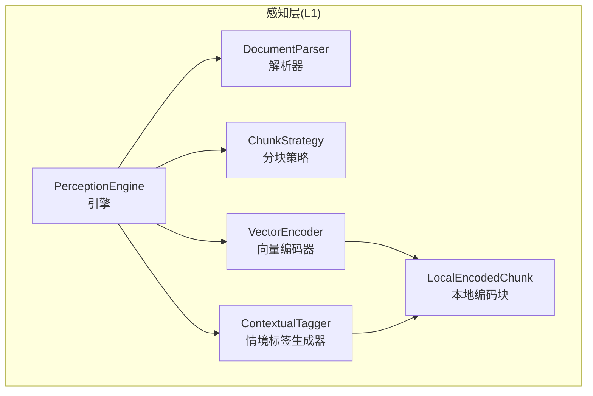
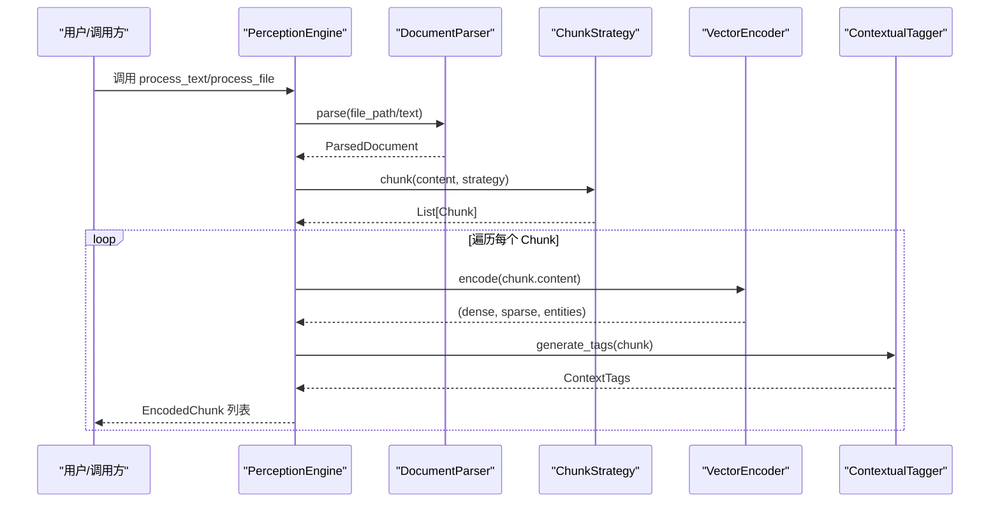
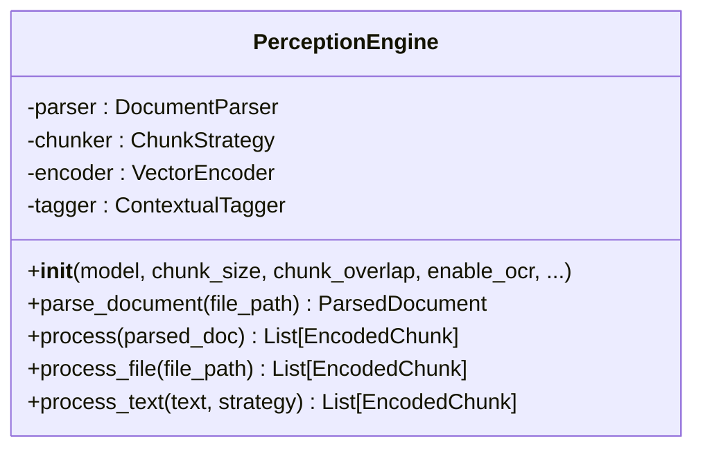
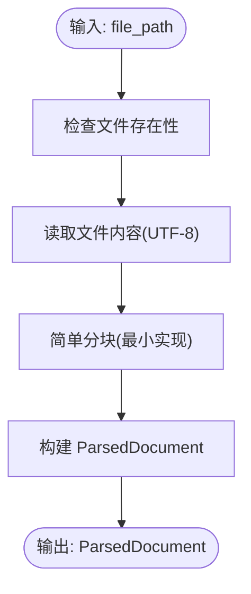
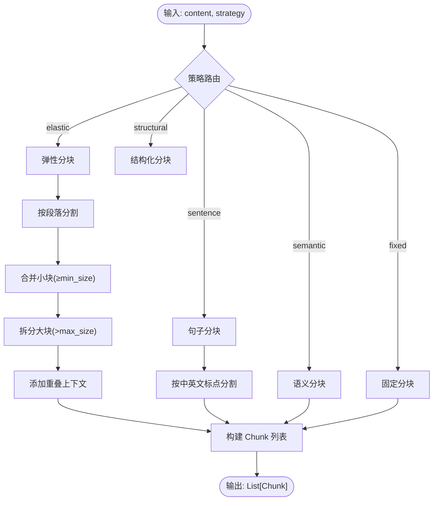
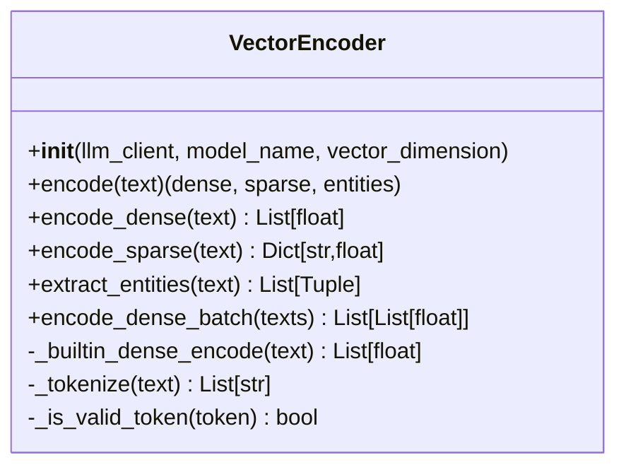
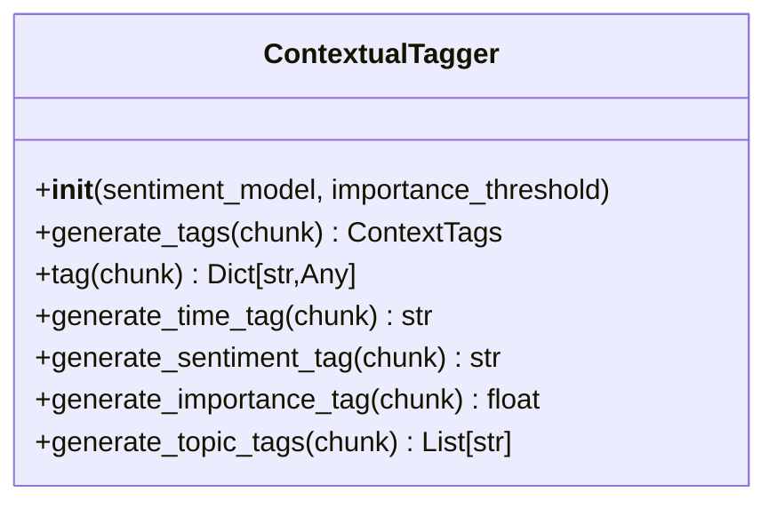
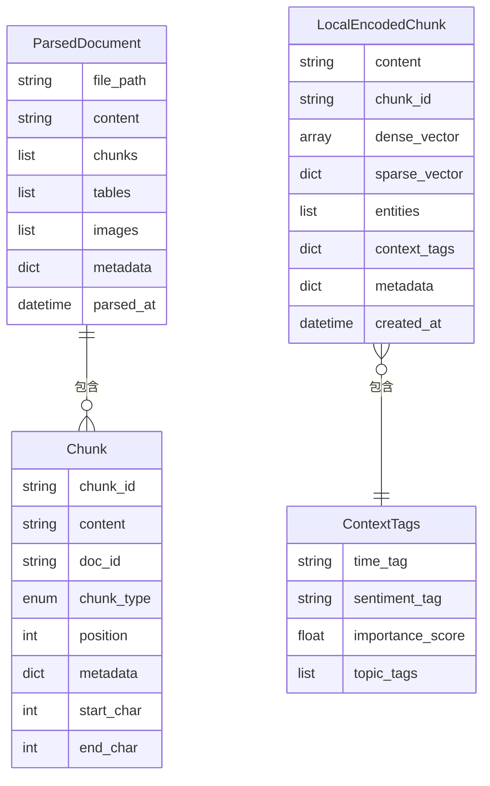
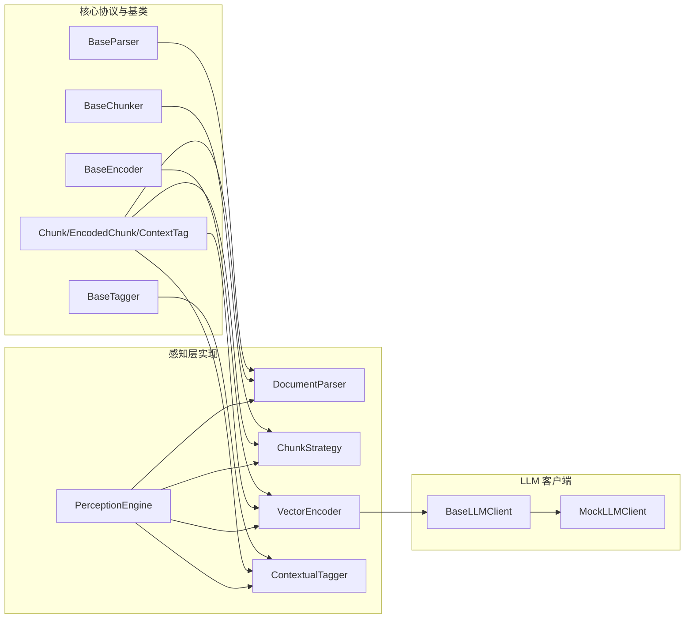

# 感知层 (L1)

<cite>
**本文引用的文件**
- [src/perception/__init__.py](file://src/perception/__init__.py)
- [src/perception/engine.py](file://src/perception/engine.py)
- [src/perception/parser.py](file://src/perception/parser.py)
- [src/perception/chunker.py](file://src/perception/chunker.py)
- [src/perception/encoder.py](file://src/perception/encoder.py)
- [src/perception/tagger.py](file://src/perception/tagger.py)
- [src/perception/models.py](file://src/perception/models.py)
- [src/perception/README.md](file://src/perception/README.md)
- [src/core/base.py](file://src/core/base.py)
- [src/core/protocols.py](file://src/core/protocols.py)
- [src/core/llm/base.py](file://src/core/llm/base.py)
- [src/core/llm/mock.py](file://src/core/llm/mock.py)
- [src/necorag.py](file://src/necorag.py)
- [example/example_usage.py](file://example/example_usage.py)
</cite>

## 目录
1. [简介](#简介)
2. [项目结构](#项目结构)
3. [核心组件](#核心组件)
4. [架构总览](#架构总览)
5. [详细组件分析](#详细组件分析)
6. [依赖关系分析](#依赖关系分析)
7. [性能考量](#性能考量)
8. [故障排查指南](#故障排查指南)
9. [结论](#结论)
10. [附录](#附录)

## 简介
感知层（L1）是 NecoRAG 的“触觉与视觉”前端，负责将多模态输入数据（文本、表格、图片等）转化为可检索、可存储、可推理的编码块。它遵循类脑记忆理论，将原始信息在进入更高层记忆之前，转换为“可存储的编码块”，并赋予情境标签（时间、情感、重要性、主题等）。感知层的核心职责包括：
- 文档解析：统一多格式输入为结构化文档表示
- 弹性分块：在语义边界处智能切分，避免碎片化与过度切分
- 向量编码：生成稠密向量、稀疏向量与实体三元组
- 情境标签：为每个编码块生成时间、情感、重要性与主题标签

## 项目结构
感知层位于 src/perception/ 目录，包含以下关键文件：
- engine.py：感知引擎主类，协调解析、分块、编码与打标
- parser.py：文档解析器，负责将文件解析为统一结构
- chunker.py：分块策略，支持弹性、语义、固定、结构化、句子级分块
- encoder.py：向量编码器，生成稠密/稀疏向量与实体三元组
- tagger.py：情境标签生成器，为每个块生成情境标签
- models.py：感知层专用数据模型（本地编码块、表格、图片等）
- README.md：感知层功能与使用说明

图表来源
- [src/perception/engine.py:20-195](file://src/perception/engine.py#L20-L195)
- [src/perception/parser.py:12-113](file://src/perception/parser.py#L12-L113)
- [src/perception/chunker.py:12-567](file://src/perception/chunker.py#L12-L567)
- [src/perception/encoder.py:25-255](file://src/perception/encoder.py#L25-L255)
- [src/perception/tagger.py:11-163](file://src/perception/tagger.py#L11-L163)
- [src/perception/models.py:24-62](file://src/perception/models.py#L24-L62)

章节来源
- [src/perception/__init__.py:1-27](file://src/perception/__init__.py#L1-L27)
- [src/perception/README.md:1-158](file://src/perception/README.md#L1-L158)

## 核心组件
- PerceptionEngine：感知引擎主类，组合解析器、分块策略、编码器与标签生成器，提供一站式处理接口（process/process_text/process_file）
- DocumentParser：文档解析器，负责将文件解析为统一结构化文档对象（含内容、分块、元数据）
- ChunkStrategy：分块策略，支持弹性、语义、固定、结构化、句子级分块，并提供边界检测与重叠上下文
- VectorEncoder：向量编码器，生成稠密向量、稀疏向量与实体三元组，支持 LLM 客户端注入与内置回退
- ContextualTagger：情境标签生成器，为每个块生成时间、情感、重要性与主题标签
- LocalEncodedChunk：感知层本地编码块数据模型，包含内容、向量、实体与情境标签

章节来源
- [src/perception/engine.py:20-195](file://src/perception/engine.py#L20-L195)
- [src/perception/parser.py:12-113](file://src/perception/parser.py#L12-L113)
- [src/perception/chunker.py:12-567](file://src/perception/chunker.py#L12-L567)
- [src/perception/encoder.py:25-255](file://src/perception/encoder.py#L25-L255)
- [src/perception/tagger.py:11-163](file://src/perception/tagger.py#L11-L163)
- [src/perception/models.py:24-62](file://src/perception/models.py#L24-L62)

## 架构总览
感知层采用“流水线式”处理：解析 → 分块 → 编码 → 打标 → 输出编码块。引擎通过统一入口提供便捷 API，同时允许按步骤细粒度控制。

图表来源
- [src/perception/engine.py:77-195](file://src/perception/engine.py#L77-L195)
- [src/perception/parser.py:28-60](file://src/perception/parser.py#L28-L60)
- [src/perception/chunker.py:49-86](file://src/perception/chunker.py#L49-L86)
- [src/perception/encoder.py:73-88](file://src/perception/encoder.py#L73-L88)
- [src/perception/tagger.py:33-48](file://src/perception/tagger.py#L33-L48)

## 详细组件分析

### PerceptionEngine（感知引擎）
- 职责：编排解析、分块、编码与打标，提供统一入口
- 关键方法：
  - parse_document：解析文档为 ParsedDocument
  - process：对解析后的文档进行编码与打标，产出 EncodedChunk 列表
  - process_file：一站式处理（解析 + 编码 + 打标）
  - process_text：对纯文本进行分块、编码与打标
- 配置项：模型名、分块大小、重叠长度、弹性分块参数、默认策略等

图表来源
- [src/perception/engine.py:20-195](file://src/perception/engine.py#L20-L195)

章节来源
- [src/perception/engine.py:28-195](file://src/perception/engine.py#L28-L195)

### DocumentParser（文档解析器）
- 职责：将文件解析为统一结构化文档对象
- 当前实现：读取文本文件，简单分块（最小实现），预留表格与图片提取接口
- 扩展点：集成 RAGFlow 进行深度解析、OCR、表格还原、图片提取

图表来源
- [src/perception/parser.py:28-60](file://src/perception/parser.py#L28-L60)
- [src/perception/parser.py:92-113](file://src/perception/parser.py#L92-L113)

章节来源
- [src/perception/parser.py:12-113](file://src/perception/parser.py#L12-L113)

### ChunkStrategy（分块策略）
- 职责：提供多种分块策略，保证语义完整性与块大小合理性
- 支持策略：
  - elastic：弹性分块（智能调整块大小，按段落合并/拆分，添加重叠）
  - semantic：语义分块（按段落）
  - fixed：固定大小分块（滑动窗口）
  - structural：结构化分块（基于标题/段落）
  - sentence：句子级分块（中英文标点分割）
- 辅助算法：段落/句子/子句边界检测、合并小块、拆分大块、词边界强制切割、重叠上下文

图表来源
- [src/perception/chunker.py:49-86](file://src/perception/chunker.py#L49-L86)
- [src/perception/chunker.py:89-142](file://src/perception/chunker.py#L89-L142)
- [src/perception/chunker.py:143-184](file://src/perception/chunker.py#L143-L184)
- [src/perception/chunker.py:185-217](file://src/perception/chunker.py#L185-L217)
- [src/perception/chunker.py:218-249](file://src/perception/chunker.py#L218-L249)
- [src/perception/chunker.py:250-266](file://src/perception/chunker.py#L250-L266)

章节来源
- [src/perception/chunker.py:12-567](file://src/perception/chunker.py#L12-L567)

### VectorEncoder（向量编码器）
- 职责：生成稠密向量、稀疏向量与实体三元组
- 特性：
  - 优先使用注入的 LLM 客户端进行向量化
  - 若无客户端，使用内置确定性伪向量生成
  - 稀疏向量：TF-IDF 风格词频归一化
  - 实体抽取：基于规则的简单三元组提取
- 批量支持：encode_batch

图表来源
- [src/perception/encoder.py:25-255](file://src/perception/encoder.py#L25-L255)

章节来源
- [src/perception/encoder.py:25-255](file://src/perception/encoder.py#L25-L255)

### ContextualTagger（情境标签生成器）
- 职责：为每个 Chunk 生成情境标签（时间、情感、重要性、主题）
- 当前实现：最小实现（时间标签、简单情感检测、重要性评分、主题标签）
- 扩展点：集成情感分析模型、主题分类器、实体识别器

图表来源
- [src/perception/tagger.py:11-163](file://src/perception/tagger.py#L11-L163)

章节来源
- [src/perception/tagger.py:11-163](file://src/perception/tagger.py#L11-L163)

### 数据模型与协议
- 本地模型（感知层特有）：LocalEncodedChunk、ParsedDocument、Table、Image
- 协议模型（统一协议层）：Chunk、EncodedChunk、ContextTag、ChunkType 等

图表来源
- [src/perception/models.py:53-62](file://src/perception/models.py#L53-L62)
- [src/core/protocols.py:101-117](file://src/core/protocols.py#L101-L117)
- [src/perception/models.py:14-34](file://src/perception/models.py#L14-L34)

章节来源
- [src/perception/models.py:14-62](file://src/perception/models.py#L14-L62)
- [src/core/protocols.py:101-156](file://src/core/protocols.py#L101-L156)

## 依赖关系分析
- 抽象基类与协议：感知层组件均继承自 core.base 的抽象类，并遵循 core.protocols 的统一数据协议
- LLM 客户端注入：VectorEncoder 支持注入 BaseLLMClient，若未提供则使用 MockLLMClient 作为回退
- 组件耦合：PerceptionEngine 将解析、分块、编码、打标解耦为独立组件，通过统一数据模型连接

图表来源
- [src/core/base.py:32-150](file://src/core/base.py#L32-L150)
- [src/core/protocols.py:101-156](file://src/core/protocols.py#L101-L156)
- [src/perception/engine.py:57-71](file://src/perception/engine.py#L57-L71)
- [src/perception/encoder.py:33-62](file://src/perception/encoder.py#L33-L62)
- [src/core/llm/base.py:16-78](file://src/core/llm/base.py#L16-L78)
- [src/core/llm/mock.py:16-313](file://src/core/llm/mock.py#L16-L313)

章节来源
- [src/core/base.py:32-150](file://src/core/base.py#L32-L150)
- [src/core/protocols.py:101-156](file://src/core/protocols.py#L101-L156)
- [src/perception/engine.py:57-71](file://src/perception/engine.py#L57-L71)
- [src/perception/encoder.py:33-62](file://src/perception/encoder.py#L33-L62)
- [src/core/llm/base.py:16-78](file://src/core/llm/base.py#L16-L78)
- [src/core/llm/mock.py:16-313](file://src/core/llm/mock.py#L16-L313)

## 性能考量
- 分块策略
  - 弹性分块：通过段落合并与大块拆分减少碎片化，提升检索质量
  - 重叠上下文：在相邻块间添加重叠，缓解跨块语义断裂
- 向量编码
  - 批量接口：VectorEncoder.encode_batch 可减少调用开销
  - 内置回退：无 LLM 客户端时使用确定性伪向量，保证可用性
- 日志与计时：PerceptionEngine 在关键步骤记录耗时，便于性能分析
- 建议
  - 根据业务场景选择合适分块策略（弹性/语义/句子级）
  - 合理设置 chunk_overlap，平衡召回与冗余
  - 使用 encode_batch 批量处理以提升吞吐

[本节为通用性能讨论，无需列出章节来源]

## 故障排查指南
- 文件不存在或路径错误
  - 现象：解析阶段抛出 FileNotFoundError
  - 处理：确认文件路径正确，权限可读
- 分块策略异常
  - 现象：分块结果为空或异常
  - 处理：检查策略参数（min/target/max chunk size、重叠长度），确认输入文本非空
- 向量编码失败
  - 现象：encode/encode_dense 抛错
  - 处理：确认 LLM 客户端可用或允许使用 Mock 回退
- 情境标签生成异常
  - 现象：标签字段缺失或为空
  - 处理：检查 chunk.metadata 与内容，必要时扩展标签生成逻辑

章节来源
- [src/perception/parser.py:42-44](file://src/perception/parser.py#L42-L44)
- [src/perception/chunker.py:89-142](file://src/perception/chunker.py#L89-L142)
- [src/perception/encoder.py:99-105](file://src/perception/encoder.py#L99-L105)
- [src/perception/tagger.py:68-84](file://src/perception/tagger.py#L68-L84)

## 结论
感知层（L1）通过“解析—分块—编码—打标”的流水线，将多模态输入转化为可检索、可存储的编码块，并赋予情境标签。其设计遵循类脑记忆理论，强调语义完整性与可存储性。通过抽象基类与统一协议，感知层具备良好的扩展性与可替换性，便于后续集成更强大的解析器、分块策略、向量模型与标签生成器。

[本节为总结性内容，无需列出章节来源]

## 附录

### 使用示例与数据流
- 示例脚本展示了如何使用 PerceptionEngine 处理文本，生成编码块并查看情境标签
- 数据流：process_text → 分块 → 编码 → 打标 → EncodedChunk 列表

章节来源
- [example/example_usage.py:12-47](file://example/example_usage.py#L12-L47)

### 类脑记忆理论中的角色
- 将原始信息转换为“可存储的编码块”，并赋予情境标签，模拟猫胡须对环境微变化的感知
- 为后续记忆层（工作记忆/语义记忆/情景记忆）提供高质量输入

章节来源
- [src/perception/README.md:22-28](file://src/perception/README.md#L22-L28)

### 统一入口与集成
- NecoRAG 统一入口类在 ingest/query 等流程中调用感知层，实现端到端工作流

章节来源
- [src/necorag.py:268-275](file://src/necorag.py#L268-L275)
- [src/necorag.py:354-471](file://src/necorag.py#L354-L471)