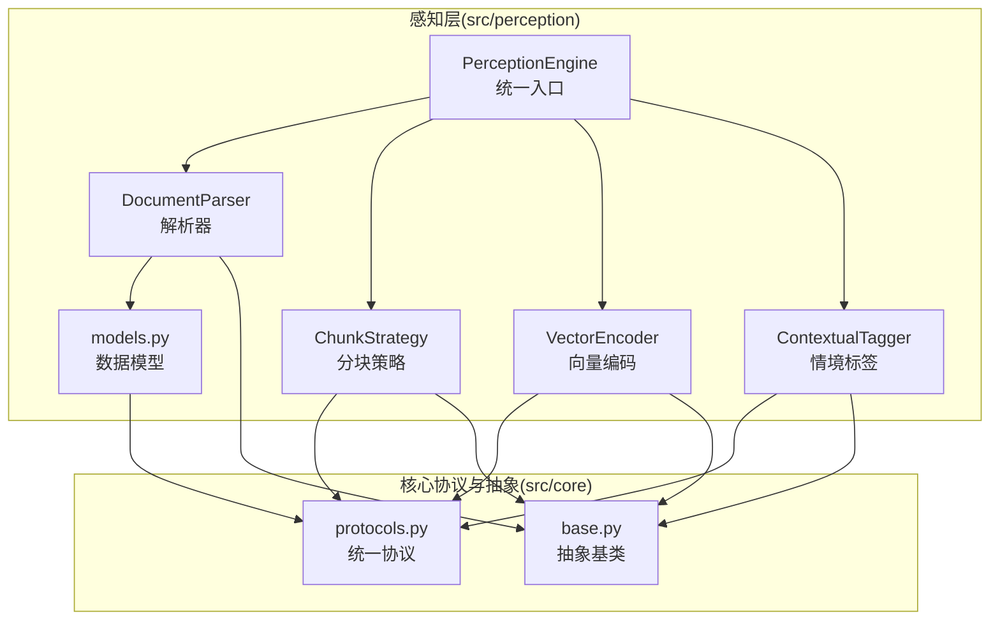
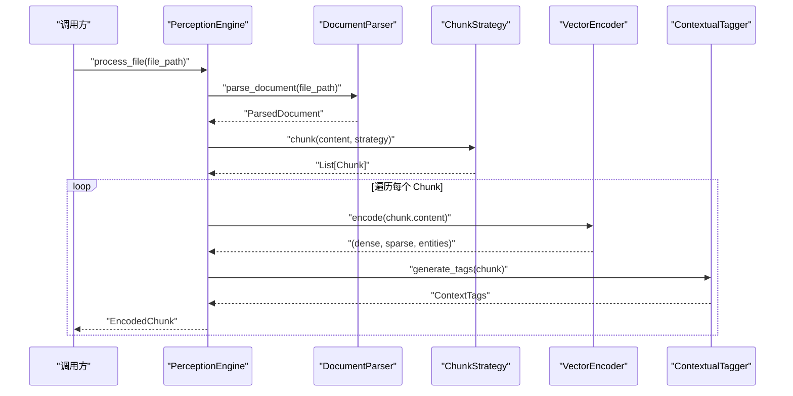
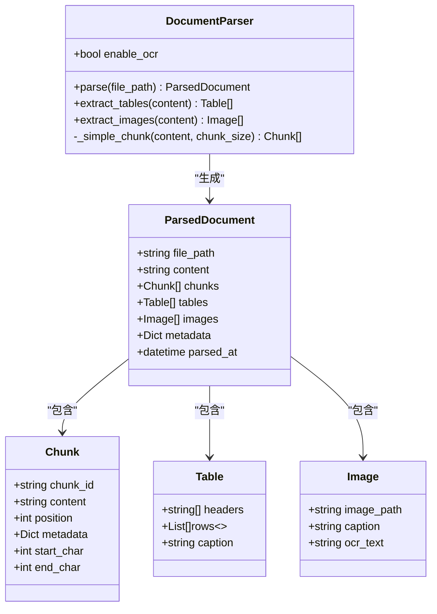
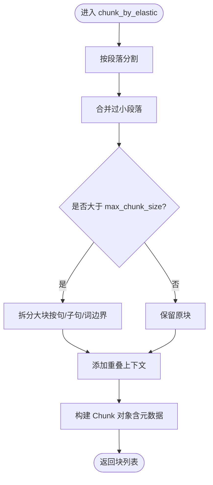
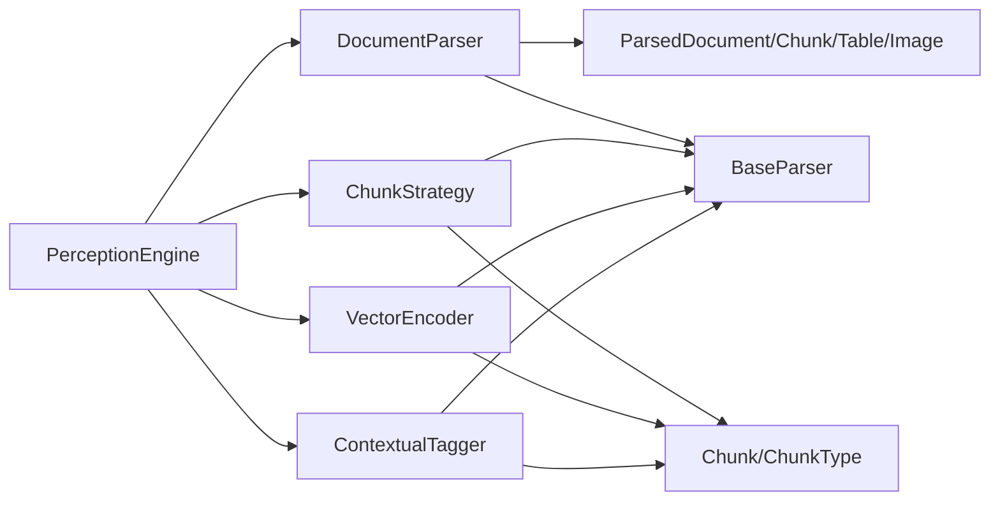

# 文档解析器

<cite>
**本文引用的文件**
- [src/perception/parser.py](file://src/perception/parser.py)
- [src/perception/models.py](file://src/perception/models.py)
- [src/perception/chunker.py](file://src/perception/chunker.py)
- [src/perception/engine.py](file://src/perception/engine.py)
- [src/perception/encoder.py](file://src/perception/encoder.py)
- [src/perception/tagger.py](file://src/perception/tagger.py)
- [src/perception/README.md](file://src/perception/README.md)
- [src/perception/__init__.py](file://src/perception/__init__.py)
- [src/core/base.py](file://src/core/base.py)
- [src/core/protocols.py](file://src/core/protocols.py)
- [example/example_usage.py](file://example/example_usage.py)
</cite>

## 目录
1. [简介](#简介)
2. [项目结构](#项目结构)
3. [核心组件](#核心组件)
4. [架构总览](#架构总览)
5. [详细组件分析](#详细组件分析)
6. [依赖分析](#依赖分析)
7. [性能考虑](#性能考虑)
8. [故障排查指南](#故障排查指南)
9. [结论](#结论)
10. [附录](#附录)

## 简介
本文件面向 NecoRAG 的“感知层”文档解析器，系统性阐述其如何处理多种文件格式（PDF、Word、Markdown、HTML 等），以及在当前实现中对 OCR 文本识别、元数据提取、结构化信息解析的支持现状与扩展路径。同时，文档给出解析器的配置选项（如 OCR 开关、分块策略、弹性分块参数等），并通过序列图与流程图展示典型解析流程与复杂场景处理思路。

## 项目结构
感知层位于 src/perception 目录，核心文件包括：
- 解析器：DocumentParser
- 分块策略：ChunkStrategy
- 向量编码：VectorEncoder
- 情境标签：ContextualTagger
- 统一入口：PerceptionEngine
- 数据模型：ParsedDocument、Chunk、Table、Image 等
- 协议与抽象：src/core/protocols.py、src/core/base.py

图表来源
- [src/perception/engine.py:20-76](file://src/perception/engine.py#L20-L76)
- [src/perception/parser.py:12-26](file://src/perception/parser.py#L12-L26)
- [src/perception/chunker.py:12-47](file://src/perception/chunker.py#L12-L47)
- [src/perception/encoder.py:25-62](file://src/perception/encoder.py#L25-L62)
- [src/perception/tagger.py:11-32](file://src/perception/tagger.py#L11-L32)
- [src/perception/models.py:36-61](file://src/perception/models.py#L36-L61)
- [src/core/protocols.py:101-117](file://src/core/protocols.py#L101-L117)
- [src/core/base.py:32-150](file://src/core/base.py#L32-L150)

章节来源
- [src/perception/README.md:1-158](file://src/perception/README.md#L1-L158)
- [src/perception/__init__.py:1-27](file://src/perception/__init__.py#L1-L27)

## 核心组件
- 文档解析器（DocumentParser）
  - 支持多格式文档（声明支持 PDF、Word、Markdown、HTML 等），当前实现为最小读取文本文件并简单分块。
  - 提供表格与图片提取接口（当前返回空列表，预留扩展点）。
  - 支持 OCR 开关配置（enable_ocr）。
- 分块策略（ChunkStrategy）
  - 支持弹性分块、语义分块、固定大小分块、结构化分块、句子分块等策略。
  - 弹性分块具备最小/目标/最大块大小与重叠上下文等参数。
- 向量编码（VectorEncoder）
  - 生成稠密向量、稀疏向量与实体三元组；可注入 LLM 客户端或使用内置实现。
- 情境标签（ContextualTagger）
  - 生成时间标签、情感标签、重要性评分与主题标签（当前为最小实现，预留扩展）。
- 统一入口（PerceptionEngine）
  - 组装解析、分块、编码、打标流程，提供一站式处理接口。

章节来源
- [src/perception/parser.py:12-112](file://src/perception/parser.py#L12-L112)
- [src/perception/chunker.py:12-86](file://src/perception/chunker.py#L12-L86)
- [src/perception/encoder.py:25-120](file://src/perception/encoder.py#L25-L120)
- [src/perception/tagger.py:11-66](file://src/perception/tagger.py#L11-L66)
- [src/perception/engine.py:20-76](file://src/perception/engine.py#L20-L76)

## 架构总览
感知引擎采用“解析-分块-编码-打标”的流水线式架构，统一通过 PerceptionEngine 协调各组件。

图表来源
- [src/perception/engine.py:77-154](file://src/perception/engine.py#L77-L154)
- [src/perception/parser.py:28-60](file://src/perception/parser.py#L28-L60)
- [src/perception/chunker.py:49-85](file://src/perception/chunker.py#L49-L85)
- [src/perception/encoder.py:73-87](file://src/perception/encoder.py#L73-L87)
- [src/perception/tagger.py:33-48](file://src/perception/tagger.py#L33-L48)

## 详细组件分析

### 文档解析器（DocumentParser）
- 职责
  - 将多种格式文档统一解析为 ParsedDocument，包含 content、chunks、metadata 等字段。
  - 当前实现为最小读取文本文件并按固定大小分块；表格与图片提取接口返回空列表，预留 OCR 开关。
- 关键配置
  - enable_ocr：是否启用 OCR（当前未生效，为预留位）。
- 输出数据结构
  - ParsedDocument：包含文件路径、原始文本、文本块列表、表格列表、图片列表、元数据与解析时间戳。

图表来源
- [src/perception/parser.py:12-112](file://src/perception/parser.py#L12-L112)
- [src/perception/models.py:52-61](file://src/perception/models.py#L52-L61)
- [src/core/protocols.py:101-117](file://src/core/protocols.py#L101-L117)

章节来源
- [src/perception/parser.py:12-112](file://src/perception/parser.py#L12-L112)
- [src/perception/models.py:36-61](file://src/perception/models.py#L36-L61)

### 分块策略（ChunkStrategy）
- 职责
  - 提供多种分块策略：弹性分块、语义分块、固定大小分块、结构化分块、句子分块。
  - 弹性分块通过“段落合并 + 大块拆分 + 重叠上下文”保证语义完整性与块大小可控。
- 关键配置
  - chunk_size、chunk_overlap、min_chunk_size、target_chunk_size、max_chunk_size、enable_elastic、semantic_boundaries。
- 复杂度与性能
  - 弹性分块整体复杂度近似 O(n)，其中 n 为文本长度；重叠与边界检测带来常数倍开销。

图表来源
- [src/perception/chunker.py:89-141](file://src/perception/chunker.py#L89-L141)
- [src/perception/chunker.py:381-433](file://src/perception/chunker.py#L381-L433)
- [src/perception/chunker.py:502-538](file://src/perception/chunker.py#L502-L538)

章节来源
- [src/perception/chunker.py:12-86](file://src/perception/chunker.py#L12-L86)
- [src/perception/chunker.py:89-141](file://src/perception/chunker.py#L89-L141)
- [src/perception/chunker.py:218-248](file://src/perception/chunker.py#L218-L248)
- [src/perception/chunker.py:250-265](file://src/perception/chunker.py#L250-L265)
- [src/perception/chunker.py:143-183](file://src/perception/chunker.py#L143-L183)

### 向量编码（VectorEncoder）
- 职责
  - 生成稠密向量、稀疏向量与实体三元组；支持通过 LLM 客户端注入外部向量化能力。
- 特性
  - 若未提供 LLM 客户端，回退到内置确定性向量生成（基于文本哈希）。
  - 稀疏向量采用词频归一化；实体抽取为简单规则匹配。
- 性能
  - 批量编码提供默认逐个实现，子类可覆盖以提升吞吐。

章节来源
- [src/perception/encoder.py:25-120](file://src/perception/encoder.py#L25-L120)
- [src/perception/encoder.py:121-190](file://src/perception/encoder.py#L121-L190)
- [src/perception/encoder.py:192-241](file://src/perception/encoder.py#L192-L241)

### 情境标签（ContextualTagger）
- 职责
  - 为每个 Chunk 生成时间标签、情感标签、重要性评分与主题标签。
- 当前实现
  - 时间标签：基于元数据（最小实现）。
  - 情感标签：基于关键词计数（最小实现）。
  - 重要性评分：基于长度与词汇多样性（最小实现）。
  - 主题标签：基于高频词（最小实现）。
- 扩展建议
  - 集成情感分析模型、主题分类器与实体识别器。

章节来源
- [src/perception/tagger.py:11-66](file://src/perception/tagger.py#L11-L66)
- [src/perception/tagger.py:68-111](file://src/perception/tagger.py#L68-L111)
- [src/perception/tagger.py:113-138](file://src/perception/tagger.py#L113-L138)
- [src/perception/tagger.py:140-162](file://src/perception/tagger.py#L140-L162)

### 统一入口（PerceptionEngine）
- 职责
  - 组装解析、分块、编码、打标流程；提供 process_file 与 process_text 两种入口。
- 配置项
  - model、chunk_size、chunk_overlap、enable_ocr、min_chunk_size、target_chunk_size、max_chunk_size、enable_elastic_chunking、chunk_strategy、semantic_boundaries。
- 错误处理
  - 解析阶段捕获异常并记录日志。

章节来源
- [src/perception/engine.py:20-76](file://src/perception/engine.py#L20-L76)
- [src/perception/engine.py:77-94](file://src/perception/engine.py#L77-L94)
- [src/perception/engine.py:140-154](file://src/perception/engine.py#L140-L154)
- [src/perception/engine.py:156-194](file://src/perception/engine.py#L156-L194)

## 依赖分析
- 组件耦合
  - PerceptionEngine 依赖 DocumentParser、ChunkStrategy、VectorEncoder、ContextualTagger。
  - 各组件均实现对应的抽象基类，遵循 src/core/base.py 的统一接口。
- 数据契约
  - 统一数据模型与枚举由 src/core/protocols.py 定义，确保跨模块一致性。
- 外部依赖
  - 向量化可注入 LLM 客户端；若不可用则回退至内置实现。
  - numpy 为可选依赖，缺失时仍可运行。

图表来源
- [src/perception/engine.py:57-71](file://src/perception/engine.py#L57-L71)
- [src/perception/parser.py:8-9](file://src/perception/parser.py#L8-L9)
- [src/perception/chunker.py:8-9](file://src/perception/chunker.py#L8-L9)
- [src/perception/encoder.py:18-19](file://src/perception/encoder.py#L18-L19)
- [src/perception/tagger.py:7-8](file://src/perception/tagger.py#L7-L8)
- [src/core/protocols.py:101-117](file://src/core/protocols.py#L101-L117)
- [src/core/base.py:32-150](file://src/core/base.py#L32-L150)

章节来源
- [src/core/base.py:32-150](file://src/core/base.py#L32-L150)
- [src/core/protocols.py:101-117](file://src/core/protocols.py#L101-L117)

## 性能考虑
- 分块策略
  - 弹性分块在保证语义完整性的同时控制块大小，适合大规模文档；重叠参数影响召回与上下文连续性。
- 向量编码
  - 批量编码可显著提升吞吐；若使用外部 LLM 客户端，需关注网络延迟与并发限制。
- 情境标签
  - 基于规则的标签生成开销较低，可扩展为模型驱动以提升质量。
- I/O 与内存
  - 大文件解析建议分块流式处理，避免一次性加载过大数据。

## 故障排查指南
- 常见问题
  - 文件不存在：解析器会抛出 FileNotFoundError，检查文件路径与权限。
  - 解析异常：PerceptionEngine 在解析阶段捕获异常并记录日志，检查输入格式与依赖。
- 排查步骤
  - 确认文件存在且可读。
  - 检查分块策略参数（如 chunk_size、chunk_overlap、min_chunk_size、max_chunk_size）是否合理。
  - 若启用 OCR，确认 enable_ocr 配置与后续扩展实现一致。
  - 观察日志输出定位异常环节。

章节来源
- [src/perception/parser.py:42-43](file://src/perception/parser.py#L42-L43)
- [src/perception/engine.py:87-94](file://src/perception/engine.py#L87-L94)

## 结论
当前文档解析器提供了统一的解析、分块、编码与打标能力，支持多格式声明与弹性分块策略。OCR、表格与图片提取等功能处于预留状态，建议结合业务需求逐步完善。通过统一的抽象与协议，解析器具备良好的扩展性与可维护性。

## 附录

### 配置选项一览
- 解析器配置
  - enable_ocr：是否启用 OCR（当前为预留位）
- 分块策略配置
  - chunk_size：固定分块大小（兼容模式）
  - chunk_overlap：分块重叠长度
  - min_chunk_size：弹性分块最小块大小
  - target_chunk_size：弹性分块目标块大小
  - max_chunk_size：弹性分块最大块大小
  - enable_elastic：是否启用弹性切割
  - semantic_boundaries：语义边界优先级列表
- 编码与打标
  - model：向量化模型名称
  - chunk_strategy：默认分块策略（elastic/semantic/fixed/structural/sentence）

章节来源
- [src/perception/engine.py:28-56](file://src/perception/engine.py#L28-L56)
- [src/perception/chunker.py:19-47](file://src/perception/chunker.py#L19-L47)

### 典型使用示例（路径参考）
- 使用 PerceptionEngine 处理文本
  - [example/example_usage.py:12-47](file://example/example_usage.py#L12-L47)
- 处理文本并获取编码块
  - [example/example_usage.py:34-46](file://example/example_usage.py#L34-L46)

### 复杂场景处理建议
- 混合内容（文本+图像）
  - 当前解析器返回空的图片列表；建议在解析阶段集成 OCR，并在 ParsedDocument 中填充 Image 数据。
- 表格识别
  - 当前解析器返回空的表格列表；建议在解析阶段集成表格结构还原，并在 ParsedDocument 中填充 Table 数据。
- 公式提取
  - 当前未实现；可在解析阶段引入公式识别模块，并在元数据中标注公式位置与内容。

章节来源
- [src/perception/parser.py:62-90](file://src/perception/parser.py#L62-L90)
- [src/perception/models.py:36-49](file://src/perception/models.py#L36-L49)