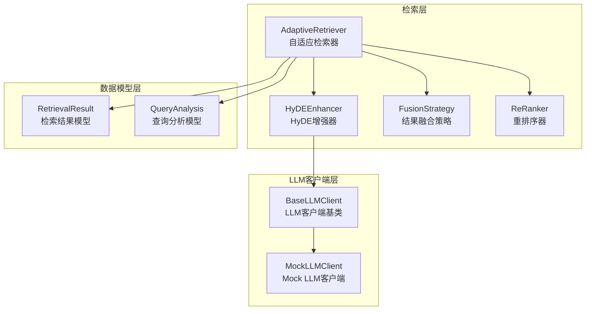
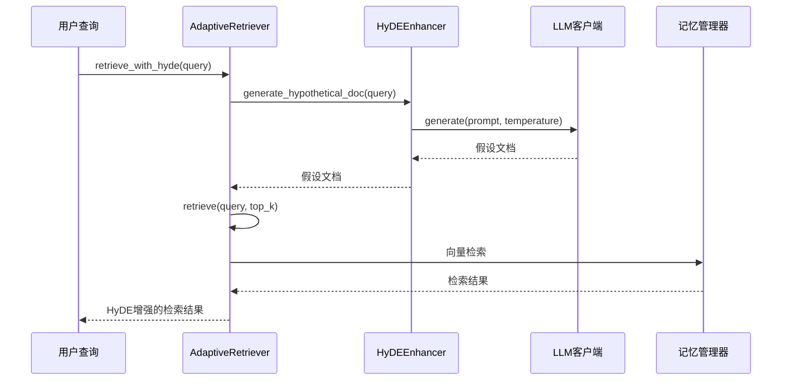
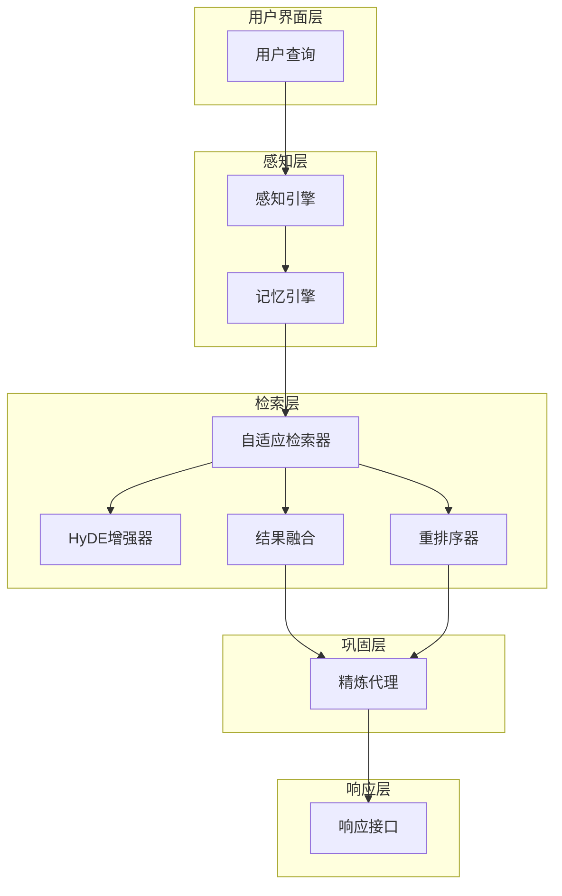
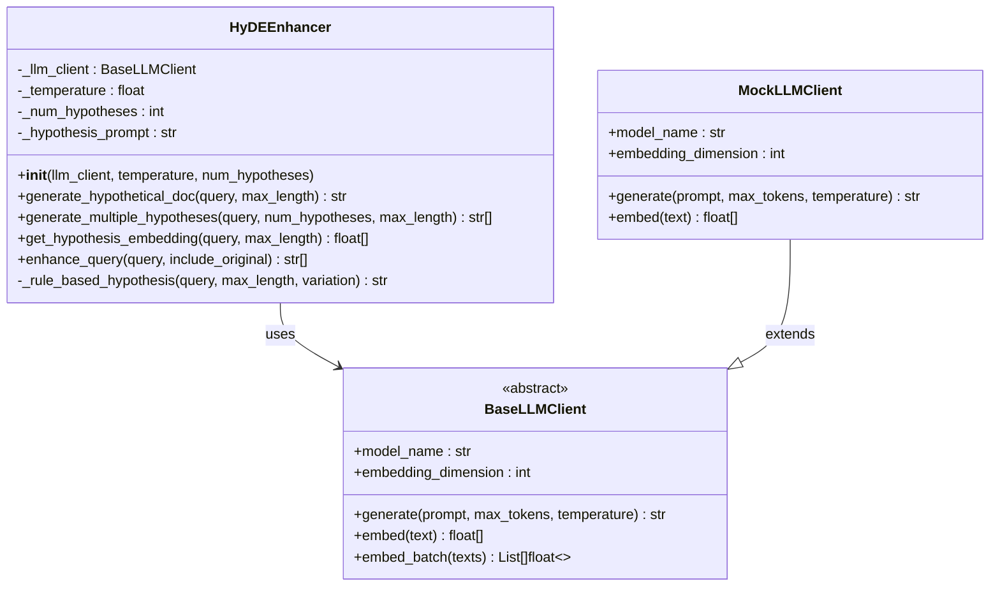
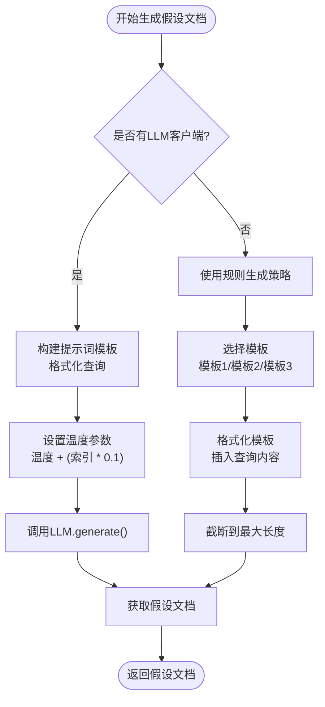
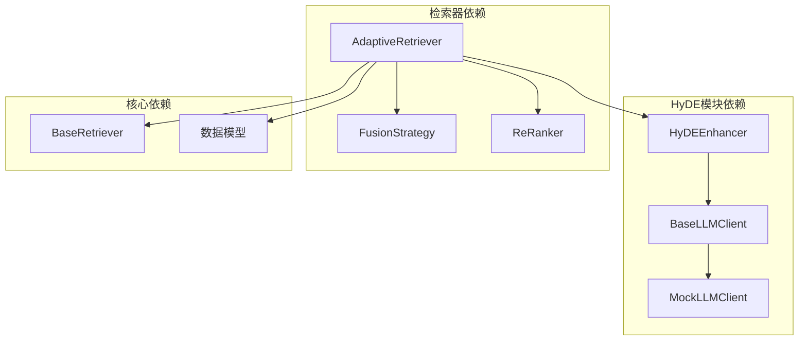
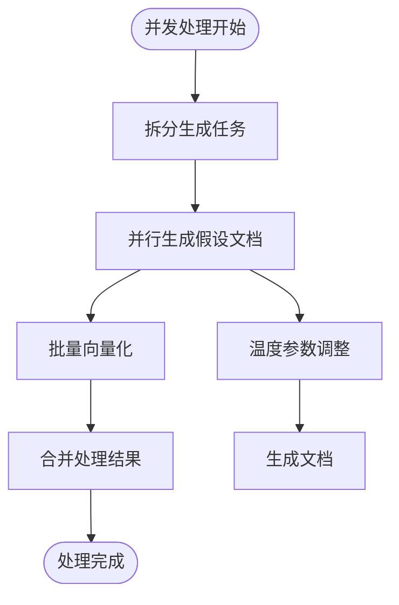

# HyDE增强技术

<cite>
**本文档引用的文件**
- [src/retrieval/hyde.py](file://src/retrieval/hyde.py)
- [src/retrieval/retriever.py](file://src/retrieval/retriever.py)
- [src/core/llm/base.py](file://src/core/llm/base.py)
- [src/core/llm/mock.py](file://src/core/llm/mock.py)
- [src/core/base.py](file://src/core/base.py)
- [src/retrieval/models.py](file://src/retrieval/models.py)
- [example/example_usage.py](file://example/example_usage.py)
- [tests/test_retrieval/test_retriever.py](file://tests/test_retrieval/test_retrieval/test_retriever.py)
</cite>

## 目录
1. [简介](#简介)
2. [项目结构](#项目结构)
3. [核心组件](#核心组件)
4. [架构概览](#架构概览)
5. [详细组件分析](#详细组件分析)
6. [依赖关系分析](#依赖关系分析)
7. [性能考虑](#性能考虑)
8. [故障排除指南](#故障排除指南)
9. [结论](#结论)
10. [附录](#附录)

## 简介

NecoRAG的HyDE增强技术模块实现了假设文档驱动检索（Hypothetical Document Embeddings）的核心原理和实现机制。HyDE技术通过生成假设性文档来增强检索效果，解决了传统检索中提问模糊、语义漂移等问题。

该技术的核心思想是：不是直接用用户的模糊查询进行检索，而是先生成一个假设性的、包含完整答案的文档，然后用这个假设文档的向量表示来进行检索。这种方法能够：

- **提高检索准确性**：通过假设文档的完整语义结构，减少语义歧义
- **减少噪声干扰**：假设文档通常更加精确和具体
- **增强语义理解**：利用LLM的推理能力生成更符合语境的答案
- **改善检索质量**：特别是在处理模糊或简短查询时效果显著

## 项目结构

HyDE增强技术模块位于NecoRAG项目的检索层，与核心LLM客户端、记忆管理和重排序组件紧密集成。



**图表来源**
- [src/retrieval/retriever.py:128-170](file://src/retrieval/retriever.py#L128-L170)
- [src/retrieval/hyde.py:17-49](file://src/retrieval/hyde.py#L17-L49)
- [src/core/llm/base.py:16-22](file://src/core/llm/base.py#L16-L22)

**章节来源**
- [src/retrieval/hyde.py:1-213](file://src/retrieval/hyde.py#L1-L213)
- [src/retrieval/retriever.py:1-458](file://src/retrieval/retriever.py#L1-L458)

## 核心组件

### HyDEEnhancer类

HyDEEnhancer是HyDE技术的核心实现类，负责生成假设性文档并进行向量化处理。

#### 主要特性

1. **智能回退机制**：当未提供LLM客户端时，自动使用规则生成策略
2. **多样化假设生成**：支持生成多个不同温度参数的假设文档
3. **向量化支持**：直接获取假设文档的向量表示
4. **查询增强**：生成包含原始查询和假设文档的查询列表

#### 关键参数

- `temperature`: 控制生成的创造性，默认0.5
- `num_hypotheses`: 生成假设文档的数量，默认1
- `max_length`: 假设文档的最大长度，默认300字符

**章节来源**
- [src/retrieval/hyde.py:24-49](file://src/retrieval/hyde.py#L24-L49)

### AdaptiveRetriever集成

AdaptiveRetriever将HyDE增强器无缝集成到整个检索流程中，提供了完整的HyDE检索管道。

#### 检索流程



**图表来源**
- [src/retrieval/retriever.py:321-347](file://src/retrieval/retriever.py#L321-L347)
- [src/retrieval/hyde.py:58-84](file://src/retrieval/hyde.py#L58-L84)

**章节来源**
- [src/retrieval/retriever.py:321-347](file://src/retrieval/retriever.py#L321-L347)

## 架构概览

HyDE增强技术在整个NecoRAG系统中的位置和作用：



**图表来源**
- [src/retrieval/retriever.py:128-170](file://src/retrieval/retriever.py#L128-L170)
- [src/retrieval/hyde.py:17-22](file://src/retrieval/hyde.py#L17-L22)

## 详细组件分析

### HyDEEnhancer类详细分析

#### 类结构设计



**图表来源**
- [src/retrieval/hyde.py:17-213](file://src/retrieval/hyde.py#L17-L213)
- [src/core/llm/base.py:16-50](file://src/core/llm/base.py#L16-L50)
- [src/core/llm/mock.py:16-70](file://src/core/llm/mock.py#L16-L70)

#### 假设文档生成流程



**图表来源**
- [src/retrieval/hyde.py:85-121](file://src/retrieval/hyde.py#L85-L121)
- [src/retrieval/hyde.py:172-213](file://src/retrieval/hyde.py#L172-L213)

**章节来源**
- [src/retrieval/hyde.py:58-121](file://src/retrieval/hyde.py#L58-L121)

### LLM客户端集成

#### BaseLLMClient抽象层

BaseLLMClient定义了LLM客户端的标准接口，确保HyDEEnhancer可以与不同的LLM实现兼容。

#### MockLLMClient实现

MockLLMClient提供了演示和测试用的LLM实现，具有以下特点：

- **确定性响应**：相同输入总是产生相同输出
- **向量化支持**：能够生成确定性的向量表示
- **模板化响应**：根据输入内容选择合适的响应模板
- **可配置参数**：支持自定义模型名称、向量维度等

**章节来源**
- [src/core/llm/base.py:16-50](file://src/core/llm/base.py#L16-L50)
- [src/core/llm/mock.py:16-134](file://src/core/llm/mock.py#L16-L134)

### 数据模型支持

#### RetrievalResult模型

RetrievalResult数据类支持HyDE增强的检索结果，包含：

- `memory_id`: 记忆ID
- `content`: 内容文本
- `score`: 相关性分数
- `source`: 检索来源（vector/graph/hyde）
- `metadata`: 元数据信息
- `retrieval_path`: 检索路径（用于可视化）

**章节来源**
- [src/retrieval/models.py:9-18](file://src/retrieval/models.py#L9-L18)

## 依赖关系分析

### 组件依赖图



**图表来源**
- [src/retrieval/hyde.py:13-14](file://src/retrieval/hyde.py#L13-L14)
- [src/retrieval/retriever.py:13-17](file://src/retrieval/retriever.py#L13-L17)

### 外部依赖分析

HyDE增强技术的主要外部依赖包括：

1. **LLM客户端接口**：通过BaseLLMClient抽象层实现
2. **向量存储**：与记忆管理器的SemanticMemory集成
3. **配置管理**：支持运行时配置和参数调整

**章节来源**
- [src/retrieval/retriever.py:13-17](file://src/retrieval/retriever.py#L13-L17)

## 性能考虑

### 生成效率优化

1. **温度参数调节**：通过逐步增加温度参数生成多样化的假设文档
2. **批量处理**：支持批量生成和向量化处理
3. **缓存策略**：可以考虑实现假设文档的缓存机制

### 内存管理

1. **向量维度控制**：通过embedding_dimension参数控制向量大小
2. **文本长度限制**：max_length参数防止过长文本影响性能
3. **批量操作**：使用embed_batch方法提高向量化效率

### 并发处理



**图表来源**
- [src/retrieval/hyde.py:105-119](file://src/retrieval/hyde.py#L105-L119)
- [src/core/llm/base.py:24-36](file://src/core/llm/base.py#L24-L36)

## 故障排除指南

### 常见问题及解决方案

#### 1. LLM客户端未正确初始化

**问题症状**：
- HyDE增强器无法生成假设文档
- 返回空结果或错误

**解决方案**：
- 确保正确传入BaseLLMClient实例
- 检查LLM客户端的model_name和embedding_dimension属性
- 验证generate和embed方法的实现

#### 2. 向量维度不匹配

**问题症状**：
- 向量计算时报维度错误
- 检索结果异常

**解决方案**：
- 确保HyDEEnhancer使用的LLM客户端与记忆管理器期望的维度一致
- 检查embedding_dimension配置

#### 3. 性能问题

**问题症状**：
- 假设文档生成速度慢
- 检索响应时间过长

**解决方案**：
- 调整temperature参数，平衡生成质量和速度
- 适当减少num_hypotheses数量
- 实现适当的缓存机制

**章节来源**
- [tests/test_retrieval/test_retriever.py:231-248](file://tests/test_retrieval/test_retriever.py#L231-L248)

## 结论

NecoRAG的HyDE增强技术模块通过实现假设文档驱动检索，显著提升了检索系统的准确性和鲁棒性。该模块的设计具有以下优势：

1. **模块化设计**：HyDEEnhancer独立于具体LLM实现，易于扩展和替换
2. **智能回退**：在缺少LLM客户端时自动使用规则生成策略
3. **性能优化**：支持批量处理和参数调节，适应不同性能需求
4. **无缝集成**：与AdaptiveRetriever完美集成，形成完整的检索管道

HyDE技术特别适用于处理模糊、简短或复杂的查询，能够有效减少语义歧义，提高检索质量。随着LLM能力的提升，HyDE技术将在未来的检索系统中发挥越来越重要的作用。

## 附录

### 使用示例

#### 基本配置示例

```python
# 初始化HyDE增强器
from src.retrieval.hyde import HyDEEnhancer
from src.core.llm import MockLLMClient

# 使用Mock LLM客户端进行演示
llm_client = MockLLMClient(
    model_name="mock-llm-v1",
    embedding_dim=768,
    deterministic=True
)

hyde_enhancer = HyDEEnhancer(
    llm_client=llm_client,
    temperature=0.7,
    num_hypotheses=3
)
```

#### 生成假设文档

```python
# 生成单个假设文档
query = "什么是深度学习？"
hypothesis = hyde_enhancer.generate_hypothetical_doc(query, max_length=300)
print(f"假设文档: {hypothesis}")

# 生成多个假设文档
hypotheses = hyde_enhancer.generate_multiple_hypotheses(
    query, 
    num_hypotheses=3, 
    max_length=300
)
print(f"假设文档数量: {len(hypotheses)}")
```

#### 获取向量表示

```python
# 获取假设文档的向量表示
embedding = hyde_enhancer.get_hypothesis_embedding(query, max_length=300)
if embedding:
    print(f"向量维度: {len(embedding)}")
```

#### 与检索器集成

```python
# 在AdaptiveRetriever中启用HyDE
from src.retrieval.retriever import AdaptiveRetriever

retriever = AdaptiveRetriever(
    memory=memory_manager,
    enable_hyde=True,
    confidence_threshold=0.85
)

# 执行HyDE增强检索
results = retriever.retrieve_with_hyde(
    query="深度学习的应用领域",
    top_k=10
)
```

**章节来源**
- [example/example_usage.py:102-136](file://example/example_usage.py#L102-L136)
- [src/retrieval/hyde.py:58-170](file://src/retrieval/hyde.py#L58-L170)