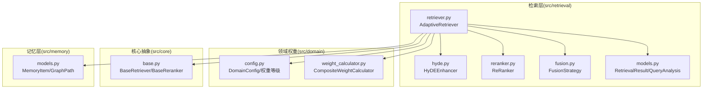
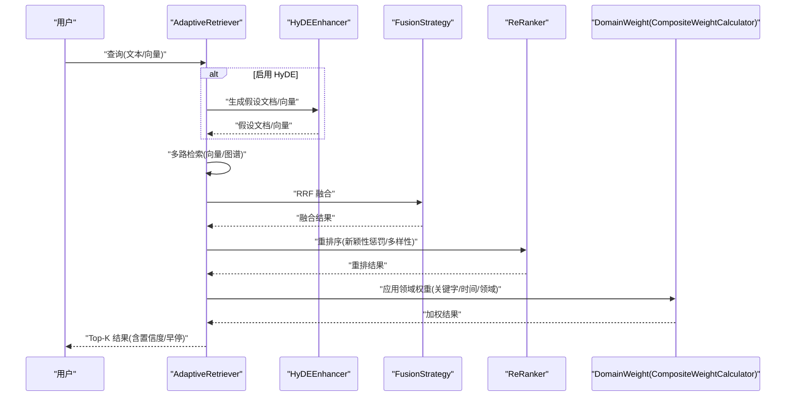
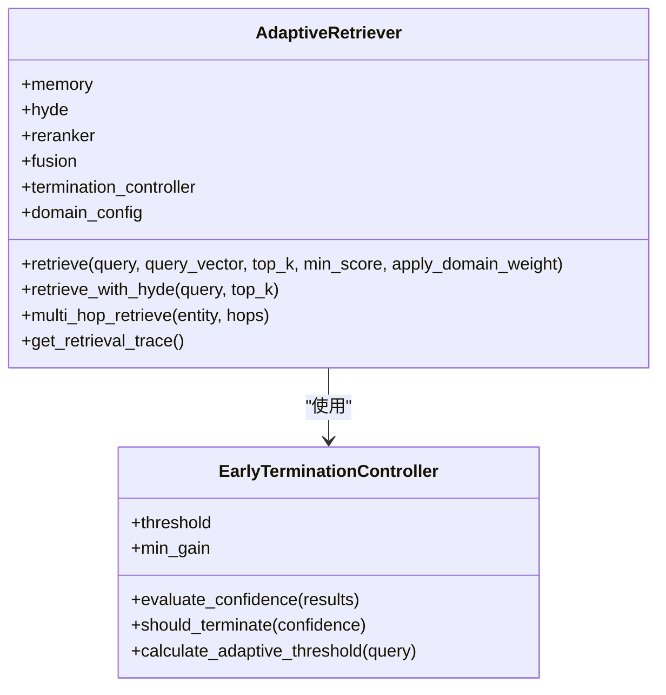
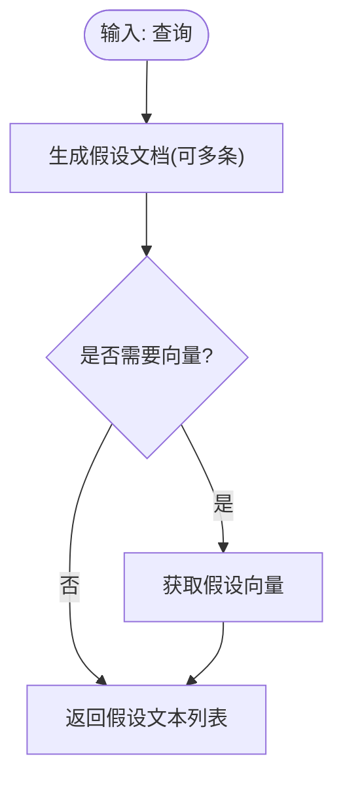
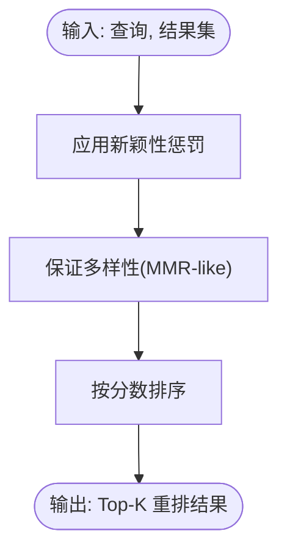
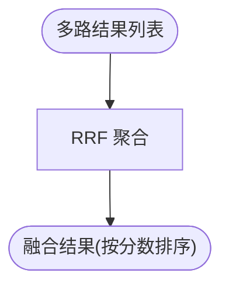
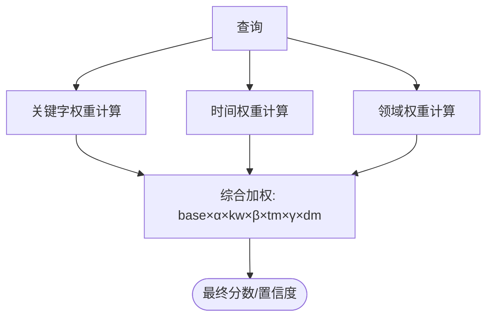
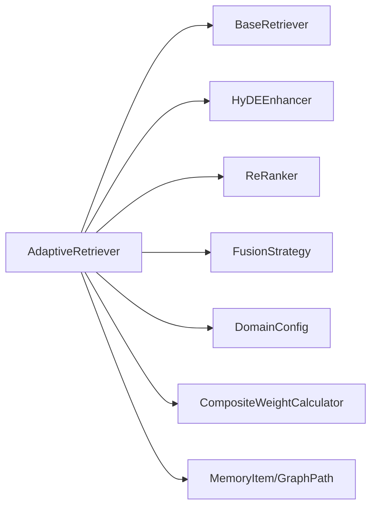

# 检索层 (L3)

<cite>
**本文引用的文件**
- [src/retrieval/__init__.py](file://src/retrieval/__init__.py)
- [src/retrieval/retriever.py](file://src/retrieval/retriever.py)
- [src/retrieval/hyde.py](file://src/retrieval/hyde.py)
- [src/retrieval/reranker.py](file://src/retrieval/reranker.py)
- [src/retrieval/fusion.py](file://src/retrieval/fusion.py)
- [src/retrieval/models.py](file://src/retrieval/models.py)
- [src/core/base.py](file://src/core/base.py)
- [src/memory/models.py](file://src/memory/models.py)
- [src/domain/config.py](file://src/domain/config.py)
- [src/domain/weight_calculator.py](file://src/domain/weight_calculator.py)
- [src/retrieval/README.md](file://src/retrieval/README.md)
- [example/example_usage.py](file://example/example_usage.py)
- [src/necorag.py](file://src/necorag.py)
</cite>

## 目录
1. [简介](#简介)
2. [项目结构](#项目结构)
3. [核心组件](#核心组件)
4. [架构总览](#架构总览)
5. [详细组件分析](#详细组件分析)
6. [依赖关系分析](#依赖关系分析)
7. [性能考量](#性能考量)
8. [故障排查指南](#故障排查指南)
9. [结论](#结论)
10. [附录](#附录)

## 简介
本文件面向 NecoRAG 检索层（L3），系统性阐述自适应检索算法的设计与实现，重点包括：
- HyDE 假设答案驱动的检索增强
- 基于新颖性惩罚与多样性的重排序机制
- 多跳检索与结果融合策略
- 类脑扩散激活理论在检索中的应用（多层证据提取与早期停止）
- 参数配置、性能调优与错误处理最佳实践
- 具体检索流程示例与算法实现细节

## 项目结构
检索层位于 src/retrieval 目录，围绕 AdaptiveRetriever 核心类组织，辅以 HyDE 增强器、重排序器、融合策略与数据模型，并通过领域权重模块实现“类脑扩散激活”的多层证据提取与置信度评估。

图表来源
- [src/retrieval/retriever.py:128-458](file://src/retrieval/retriever.py#L128-L458)
- [src/retrieval/hyde.py:17-213](file://src/retrieval/hyde.py#L17-L213)
- [src/retrieval/reranker.py:11-186](file://src/retrieval/reranker.py#L11-L186)
- [src/retrieval/fusion.py:9-128](file://src/retrieval/fusion.py#L9-L128)
- [src/retrieval/models.py:9-29](file://src/retrieval/models.py#L9-L29)
- [src/domain/config.py:14-285](file://src/domain/config.py#L14-L285)
- [src/domain/weight_calculator.py:56-318](file://src/domain/weight_calculator.py#L56-L318)
- [src/core/base.py:388-434](file://src/core/base.py#L388-L434)
- [src/memory/models.py:14-43](file://src/memory/models.py#L14-L43)

章节来源
- [src/retrieval/__init__.py:1-19](file://src/retrieval/__init__.py#L1-L19)
- [src/retrieval/README.md:1-352](file://src/retrieval/README.md#L1-L352)

## 核心组件
- AdaptiveRetriever：自适应检索器，集成多路检索、融合、重排序、领域权重与早停控制，提供标准检索与 HyDE 增强检索、多跳检索等能力。
- HyDEEnhancer：假设答案驱动的检索增强器，生成假设文档并可提供向量表示，提升模糊查询与术语不匹配场景的检索效果。
- ReRanker：重排序器，基于新颖性惩罚与多样性策略优化最终结果的相关性与多样性。
- FusionStrategy：结果融合策略，支持 RRF 与加权融合，聚合多路检索结果。
- RetrievalResult/QueryAnalysis：检索结果与查询分析的数据模型。
- DomainConfig/CompositeWeightCalculator：领域配置与综合权重计算器，实现类脑扩散激活的多层证据提取与置信度评估。

章节来源
- [src/retrieval/retriever.py:128-458](file://src/retrieval/retriever.py#L128-L458)
- [src/retrieval/hyde.py:17-213](file://src/retrieval/hyde.py#L17-L213)
- [src/retrieval/reranker.py:11-186](file://src/retrieval/reranker.py#L11-L186)
- [src/retrieval/fusion.py:9-128](file://src/retrieval/fusion.py#L9-L128)
- [src/retrieval/models.py:9-29](file://src/retrieval/models.py#L9-L29)
- [src/domain/config.py:14-285](file://src/domain/config.py#L14-L285)
- [src/domain/weight_calculator.py:56-318](file://src/domain/weight_calculator.py#L56-L318)

## 架构总览
检索层采用“多路并行检索 + 结果融合 + 精排 + 早停”的流水线式设计，结合 HyDE 增强与领域权重，实现高质量、低延迟的智能检索。

图表来源
- [src/retrieval/retriever.py:183-267](file://src/retrieval/retriever.py#L183-L267)
- [src/retrieval/hyde.py:58-143](file://src/retrieval/hyde.py#L58-L143)
- [src/retrieval/fusion.py:18-70](file://src/retrieval/fusion.py#L18-L70)
- [src/retrieval/reranker.py:42-77](file://src/retrieval/reranker.py#L42-L77)
- [src/domain/weight_calculator.py:81-146](file://src/domain/weight_calculator.py#L81-L146)

## 详细组件分析

### AdaptiveRetriever（自适应检索器）
- 多路检索：向量检索与图谱检索（实体识别与关系强度）并行执行，结果通过 RRF 融合。
- HyDE 增强：可选启用，生成假设文档并用于检索（向量检索路径预留）。
- 重排序：使用 ReRanker 对融合结果进行新颖性惩罚与多样性保证。
- 领域权重：可选启用，基于关键字、时间与领域相关性计算加权分数。
- 早停控制：基于置信度阈值与边际收益递减策略，达到阈值即终止，避免冗余计算。

图表来源
- [src/retrieval/retriever.py:128-458](file://src/retrieval/retriever.py#L128-L458)

章节来源
- [src/retrieval/retriever.py:128-458](file://src/retrieval/retriever.py#L128-L458)

### HyDEEnhancer（假设答案驱动检索）
- 功能：生成假设性答案文档，支持多假设生成与向量化，作为检索锚点提升模糊查询效果。
- 回退：当无可用 LLM 客户端时，使用规则模板生成假设文档。
- 应用：在检索前生成假设向量，或生成多条假设文本参与检索。

图表来源
- [src/retrieval/hyde.py:58-143](file://src/retrieval/hyde.py#L58-L143)

章节来源
- [src/retrieval/hyde.py:17-213](file://src/retrieval/hyde.py#L17-L213)

### ReRanker（重排序器）
- 新颖性惩罚：对与已选结果重复度高的候选施加惩罚，抑制重复。
- 多样性保证：采用类似 MMR 的贪心策略，最大化相关性同时最小化与已选结果的最大相似度。
- 排序：按最终分数降序输出 Top-K 结果。

图表来源
- [src/retrieval/reranker.py:42-160](file://src/retrieval/reranker.py#L42-L160)

章节来源
- [src/retrieval/reranker.py:11-186](file://src/retrieval/reranker.py#L11-L186)

### FusionStrategy（结果融合）
- RRF：基于倒数排名融合，聚合多路检索结果，保留检索路径与元数据。
- 加权融合：支持按权重对不同来源结果进行加权求和。

图表来源
- [src/retrieval/fusion.py:18-70](file://src/retrieval/fusion.py#L18-L70)

章节来源
- [src/retrieval/fusion.py:9-128](file://src/retrieval/fusion.py#L9-L128)

### 领域权重与类脑扩散激活（多层证据提取）
- 关键字权重：基于 DomainConfig 的关键字等级与权重，计算查询与文档的关键字相关性。
- 时间权重：基于文档创建/更新时间与衰减系数，评估时效性。
- 领域权重：基于文档来源领域与相关性等级，计算领域匹配度。
- 多层证据提取：通过扩散激活理论，将激活值沿关系链传播，形成多跳证据路径，结合强度衰减与动态剪枝，实现“类脑”推理与证据累积。

图表来源
- [src/domain/weight_calculator.py:81-146](file://src/domain/weight_calculator.py#L81-L146)
- [src/domain/config.py:14-285](file://src/domain/config.py#L14-L285)

章节来源
- [src/domain/weight_calculator.py:56-318](file://src/domain/weight_calculator.py#L56-L318)
- [src/domain/config.py:14-285](file://src/domain/config.py#L14-L285)

### 数据模型
- RetrievalResult：检索结果，包含 memory_id、content、score、source、metadata、retrieval_path。
- QueryAnalysis：查询分析，包含原始查询、改写查询、查询类型、实体、意图与复杂度。

章节来源
- [src/retrieval/models.py:9-29](file://src/retrieval/models.py#L9-L29)

## 依赖关系分析
- AdaptiveRetriever 依赖：
  - BaseRetriever 抽象接口
  - HyDEEnhancer（可选）
  - ReRanker
  - FusionStrategy
  - DomainConfig 与 CompositeWeightCalculator（可选）
  - MemoryItem/GraphPath（用于向量与图谱检索）
- HyDEEnhancer 依赖 LLM 客户端（可为 Mock），提供生成与嵌入能力。
- ReRanker 依赖文本相似度计算与 MMR-like 策略。
- FusionStrategy 依赖 RetrievalResult 数据模型。
- 领域权重依赖 DomainConfig 与 TemporalWeightCalculator/DomainRelevanceCalculator。

图表来源
- [src/retrieval/retriever.py:128-170](file://src/retrieval/retriever.py#L128-L170)
- [src/core/base.py:388-434](file://src/core/base.py#L388-L434)
- [src/domain/weight_calculator.py:56-80](file://src/domain/weight_calculator.py#L56-L80)
- [src/memory/models.py:14-43](file://src/memory/models.py#L14-L43)

章节来源
- [src/retrieval/retriever.py:128-170](file://src/retrieval/retriever.py#L128-L170)
- [src/core/base.py:388-434](file://src/core/base.py#L388-L434)
- [src/domain/weight_calculator.py:56-80](file://src/domain/weight_calculator.py#L56-L80)
- [src/memory/models.py:14-43](file://src/memory/models.py#L14-L43)

## 性能考量
- 早停机制：通过置信度阈值与边际收益递减策略，在达到满意结果时立即终止，显著降低计算开销。
- 多路并行：向量检索与图谱检索并行执行，融合后再重排，兼顾召回与效率。
- 重排优化：新颖性惩罚与多样性策略在保持相关性的同时减少重复，提升用户体验。
- 参数调优建议：
  - confidence_threshold：根据业务目标调整，简单查询可适当降低以提升速度。
  - novelty_weight/diversity_weight/redundancy_penalty：平衡相关性、新颖性与多样性，避免过度惩罚导致召回下降。
  - top_k/min_score：根据下游应用的准确性与速度需求进行权衡。
  - apply_domain_weight：在领域知识丰富且权重因子合理时启用，可显著提升相关性。

章节来源
- [src/retrieval/retriever.py:36-126](file://src/retrieval/retriever.py#L36-L126)
- [src/retrieval/reranker.py:21-41](file://src/retrieval/reranker.py#L21-L41)
- [src/retrieval/README.md:305-328](file://src/retrieval/README.md#L305-L328)

## 故障排查指南
- HyDE 未生效：
  - 检查是否启用 enable_hyde，以及 LLM 客户端是否可用；若不可用将回退到规则生成。
  - 章节来源
    - [src/retrieval/retriever.py:154-156](file://src/retrieval/retriever.py#L154-L156)
    - [src/retrieval/hyde.py:38-49](file://src/retrieval/hyde.py#L38-L49)
- 重排结果为空：
  - 检查输入 results 是否为空；确认融合与重排步骤是否正确执行。
  - 章节来源
    - [src/retrieval/reranker.py:61-62](file://src/retrieval/reranker.py#L61-L62)
- 领域权重未生效：
  - 确认 DomainConfig 是否正确设置，且 apply_domain_weight 为 True。
  - 章节来源
    - [src/retrieval/retriever.py:246-248](file://src/retrieval/retriever.py#L246-L248)
    - [src/domain/config.py:54-130](file://src/domain/config.py#L54-L130)
- 多跳检索无结果：
  - 检查图谱实体是否存在、关系强度与最大跳数设置是否合理。
  - 章节来源
    - [src/retrieval/retriever.py:349-381](file://src/retrieval/retriever.py#L349-L381)

## 结论
检索层通过 HyDE 增强、重排序与融合策略，结合类脑扩散激活的多层证据提取与早停机制，实现了高质量、低延迟的智能检索。合理的参数配置与性能调优可进一步提升用户体验与系统吞吐。建议在生产环境中结合业务场景对置信度阈值、重排权重与领域权重因子进行持续优化。

## 附录

### 检索流程示例（HyDE 增强 + 重排序 + 早停）
- 输入：查询文本与可选查询向量
- 步骤：
  1) 可选：生成假设文档/向量
  2) 并行：向量检索与图谱检索
  3) 融合：RRF 聚合
  4) 重排：新颖性惩罚 + 多样性保证
  5) 领域权重：关键字/时间/领域加权
  6) 过滤与早停：按阈值与边际收益判断是否终止
- 输出：Top-K 检索结果与检索路径追踪

章节来源
- [src/retrieval/retriever.py:183-267](file://src/retrieval/retriever.py#L183-L267)
- [src/retrieval/hyde.py:58-143](file://src/retrieval/hyde.py#L58-L143)
- [src/retrieval/reranker.py:42-77](file://src/retrieval/reranker.py#L42-L77)
- [src/retrieval/fusion.py:18-70](file://src/retrieval/fusion.py#L18-L70)

### 使用示例（参考）
- 完整工作流示例展示了感知、记忆、检索、精炼与交互的端到端流程，便于理解检索层在整体系统中的位置与作用。
- 章节来源
  - [example/example_usage.py:94-136](file://example/example_usage.py#L94-L136)
  - [src/necorag.py:354-470](file://src/necorag.py#L354-L470)