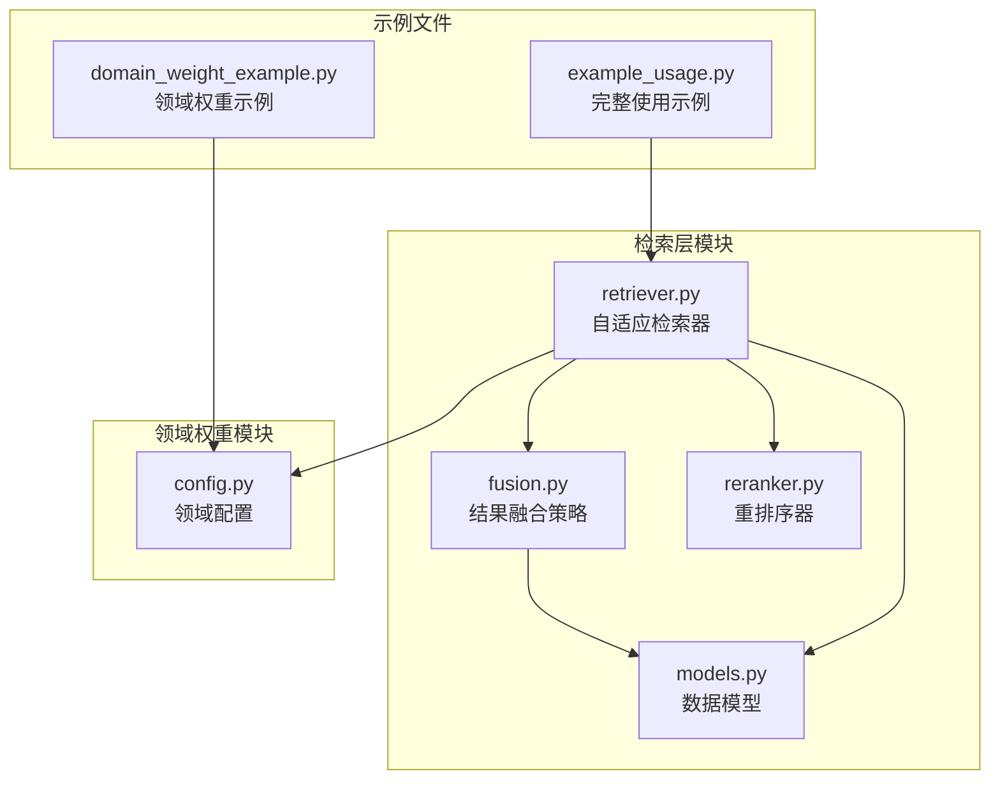
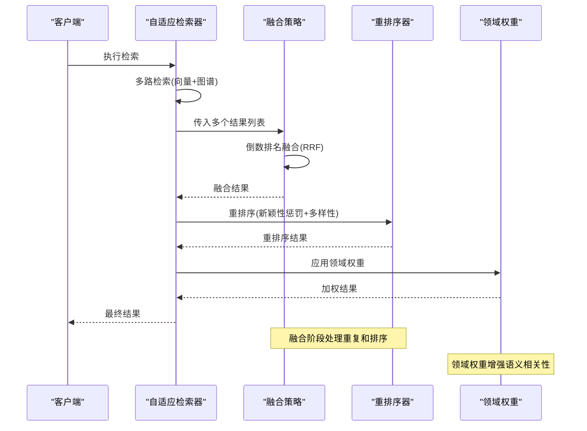
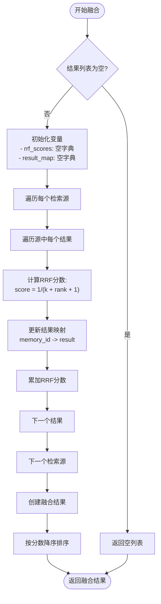
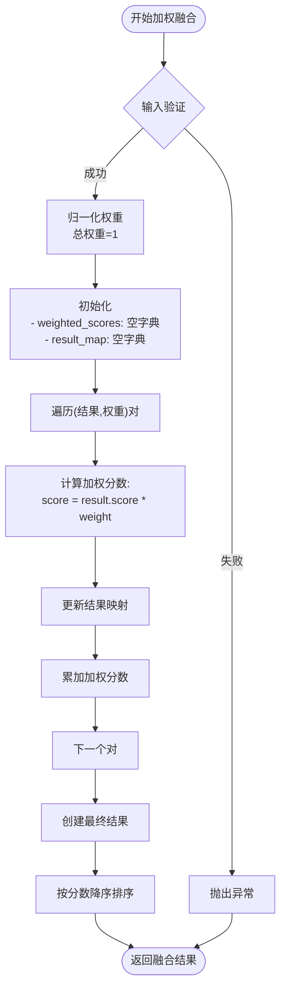
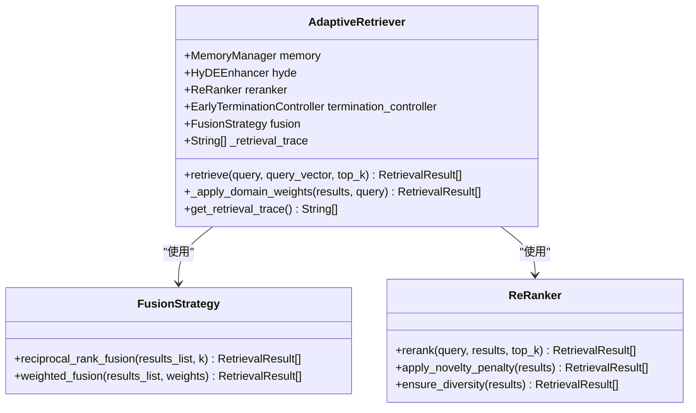
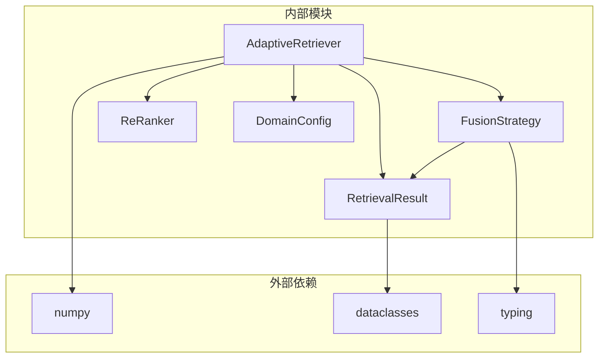
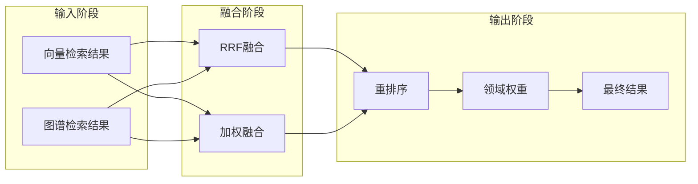

# 结果融合策略

<cite>
**本文档引用的文件**
- [fusion.py](file://src/retrieval/fusion.py)
- [models.py](file://src/retrieval/models.py)
- [retriever.py](file://src/retrieval/retriever.py)
- [reranker.py](file://src/retrieval/reranker.py)
- [config.py](file://src/domain/config.py)
- [example_usage.py](file://example/example_usage.py)
- [domain_weight_example.py](file://example/domain_weight_example.py)
</cite>

## 目录
1. [简介](#简介)
2. [项目结构](#项目结构)
3. [核心组件](#核心组件)
4. [架构概览](#架构概览)
5. [详细组件分析](#详细组件分析)
6. [依赖关系分析](#依赖关系分析)
7. [性能考虑](#性能考虑)
8. [故障排除指南](#故障排除指南)
9. [结论](#结论)

## 简介

NecoRAG的结果融合策略模块实现了多源检索结果的有效整合，主要采用倒数排名融合(RRF)技术和加权融合策略。该模块能够将来自不同检索源（向量检索、图谱检索）的结果进行统一排序，确保最终输出既保持了各源的优势，又避免了重复内容的干扰。

## 项目结构

结果融合策略模块位于`src/retrieval/`目录下，主要包含以下文件：



**图表来源**
- [fusion.py:1-128](file://src/retrieval/fusion.py#L1-L128)
- [models.py:1-29](file://src/retrieval/models.py#L1-L29)
- [retriever.py:1-458](file://src/retrieval/retriever.py#L1-L458)

**章节来源**
- [fusion.py:1-128](file://src/retrieval/fusion.py#L1-L128)
- [models.py:1-29](file://src/retrieval/models.py#L1-L29)
- [retriever.py:1-200](file://src/retrieval/retriever.py#L1-L200)

## 核心组件

### FusionStrategy类

FusionStrategy类是结果融合策略的核心实现，提供了两种主要的融合方法：

1. **倒数排名融合(RRF)**：基于rank归一化的统计方法
2. **加权融合**：基于权重分配的线性组合方法

### RetrievalResult数据模型

RetrievalResult是所有检索结果的统一数据结构，包含：
- `memory_id`：记忆ID
- `content`：内容文本
- `score`：相关性分数
- `source`：结果来源（vector/graph/hyde）
- `metadata`：元数据信息
- `retrieval_path`：检索路径（用于可视化）

**章节来源**
- [fusion.py:9-128](file://src/retrieval/fusion.py#L9-L128)
- [models.py:9-29](file://src/retrieval/models.py#L9-L29)

## 架构概览

结果融合策略在整个检索流程中扮演着关键角色，与重排序器和领域权重系统协同工作：



**图表来源**
- [retriever.py:235-267](file://src/retrieval/retriever.py#L235-L267)
- [fusion.py:18-70](file://src/retrieval/fusion.py#L18-L70)
- [reranker.py:42-77](file://src/retrieval/reranker.py#L42-L77)

## 详细组件分析

### 倒数排名融合(RRF)算法

RRF是NecoRAG采用的主要融合技术，其数学基础如下：

#### 数学原理

RRF的核心公式为：
```
RRF = Σ(1/(k + rank))
```

其中：
- `k` 是平滑参数，默认值为60
- `rank` 是结果在各检索源中的排名位置
- `Σ` 表示对所有检索源的分数求和

#### 算法实现细节



**图表来源**
- [fusion.py:18-70](file://src/retrieval/fusion.py#L18-L70)

#### RRF参数配置

| 参数 | 默认值 | 作用 | 调优建议 |
|------|--------|------|----------|
| `k` | 60 | 平滑参数，控制排名衰减速度 | 小于60: 更重视高排名；大于60: 更重视整体排名 |
| `results_list` | 必需 | 多个检索结果列表 | 确保列表非空且有序 |

#### 重复结果处理

RRF算法通过`memory_id`作为键来自动去重：
- 每个`memory_id`只保留第一次出现的结果
- 对相同ID的结果分数进行累加
- 确保融合后不会出现重复内容

**章节来源**
- [fusion.py:18-70](file://src/retrieval/fusion.py#L18-L70)

### 加权融合算法

加权融合提供了更灵活的融合方式，允许为不同检索源分配不同的权重：

#### 算法流程



**图表来源**
- [fusion.py:72-127](file://src/retrieval/fusion.py#L72-L127)

#### 权重分配策略

| 权重类型 | 作用 | 典型配置 |
|----------|------|----------|
| 向量检索权重 | 基于语义相似度 | 0.6-0.8 |
| 图谱检索权重 | 基于结构化关系 | 0.2-0.4 |
| HyDE增强权重 | 基于假设文档 | 0.1-0.3 |

**章节来源**
- [fusion.py:72-127](file://src/retrieval/fusion.py#L72-L127)

### 在自适应检索器中的集成

自适应检索器将融合策略集成到完整的检索流程中：



**图表来源**
- [retriever.py:128-170](file://src/retrieval/retriever.py#L128-L170)
- [fusion.py:9-16](file://src/retrieval/fusion.py#L9-L16)
- [reranker.py:11-19](file://src/retrieval/reranker.py#L11-L19)

**章节来源**
- [retriever.py:128-170](file://src/retrieval/retriever.py#L128-L170)
- [retriever.py:235-267](file://src/retrieval/retriever.py#L235-L267)

## 依赖关系分析

### 组件耦合度



**图表来源**
- [fusion.py:5-6](file://src/retrieval/fusion.py#L5-L6)
- [models.py:5-6](file://src/retrieval/models.py#L5-L6)
- [retriever.py:6-17](file://src/retrieval/retriever.py#L6-L17)

### 数据流分析



**图表来源**
- [retriever.py:220-243](file://src/retrieval/retriever.py#L220-L243)
- [fusion.py:18-127](file://src/retrieval/fusion.py#L18-L127)

**章节来源**
- [retriever.py:220-243](file://src/retrieval/retriever.py#L220-L243)
- [fusion.py:18-127](file://src/retrieval/fusion.py#L18-L127)

## 性能考虑

### 时间复杂度分析

| 算法 | 时间复杂度 | 空间复杂度 | 说明 |
|------|------------|------------|------|
| RRF融合 | O(N×M) | O(N) | N=结果总数, M=检索源数量 |
| 加权融合 | O(N×M) | O(N) | N=结果总数, M=检索源数量 |
| 重排序 | O(N²) | O(N) | N=结果数量，受新颖性惩罚影响 |

### 优化建议

1. **参数调优**
   - `k`值：对于较小的检索集合，可适当减小k值以提高高排名的重要性
   - `top_k`：在融合前扩大搜索范围，融合后再截取最终结果

2. **内存优化**
   - 使用生成器模式处理大量结果
   - 及时清理临时结果映射

3. **并行处理**
   - 对不同检索源的结果可以并行处理
   - 融合过程中的去重操作可使用哈希表优化

## 故障排除指南

### 常见问题及解决方案

| 问题类型 | 症状 | 可能原因 | 解决方案 |
|----------|------|----------|----------|
| 融合结果为空 | 返回空列表 | 输入列表为空或格式错误 | 检查检索结果是否正确生成 |
| 重复结果过多 | 融合后仍有重复 | memory_id不一致 | 确保memory_id生成规则一致 |
| 排序异常 | 结果顺序不符合预期 | 分数计算错误 | 检查RRF参数设置 |
| 性能问题 | 融合耗时过长 | 结果数量过大 | 调整top_k参数或启用早停机制 |

### 调试技巧

1. **启用检索追踪**
   ```python
   retriever = AdaptiveRetriever(memory)
   results = retriever.retrieve(query, query_vector, top_k=5)
   trace = retriever.get_retrieval_trace()
   ```

2. **检查中间结果**
   - 验证每个检索源的输出质量
   - 确认融合前后的分数变化

3. **参数敏感性测试**
   - 逐步调整k值观察效果
   - 测试不同权重组合的影响

**章节来源**
- [retriever.py:383-390](file://src/retrieval/retriever.py#L383-L390)
- [retriever.py:254-267](file://src/retrieval/retriever.py#L254-L267)

## 结论

NecoRAG的结果融合策略模块通过RRF和加权融合技术，为多源检索提供了强大的整合能力。该模块具有以下特点：

1. **算法稳健性**：RRF算法对噪声和异常值具有良好的鲁棒性
2. **实现简洁性**：代码结构清晰，易于理解和维护
3. **扩展性强**：支持多种融合策略和参数配置
4. **性能优化**：通过合理的数据结构和算法设计确保高效运行

通过合理配置融合参数和与其他模块的协同工作，NecoRAG能够在保证检索质量的同时，显著提升系统的整体性能和用户体验。