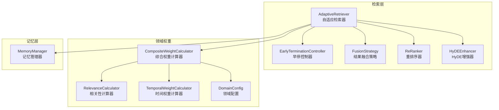
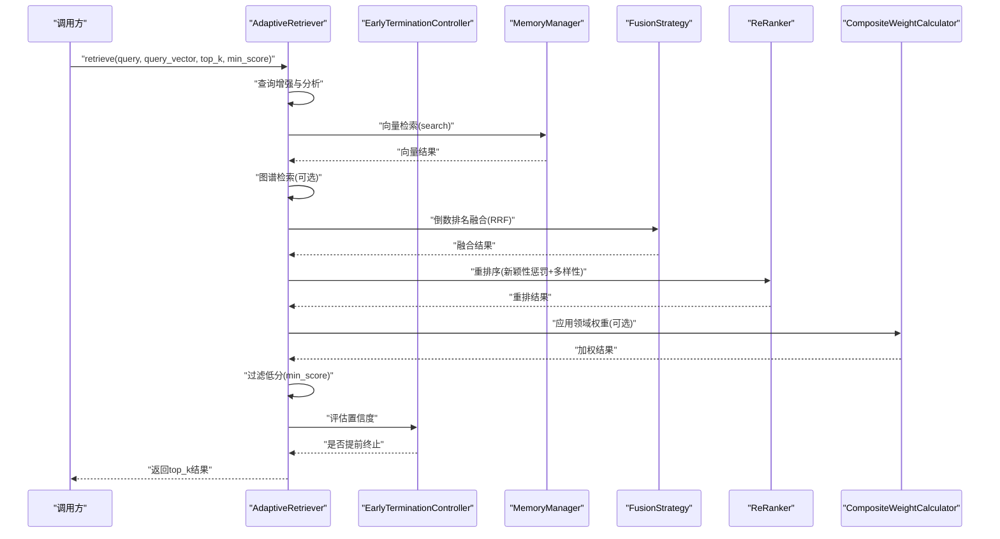
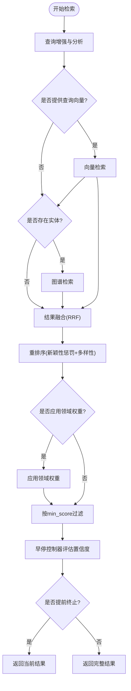
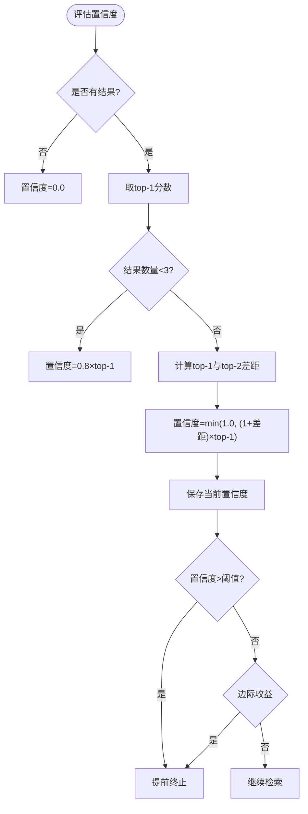
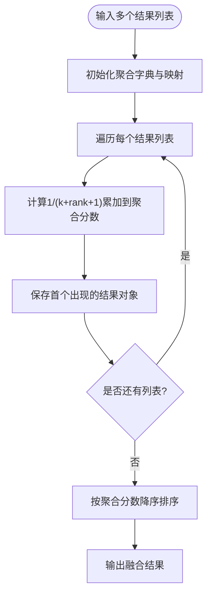
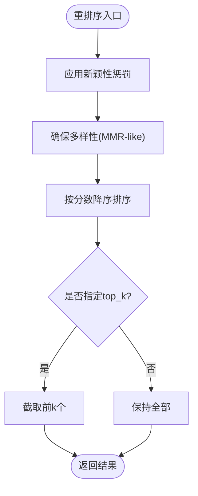
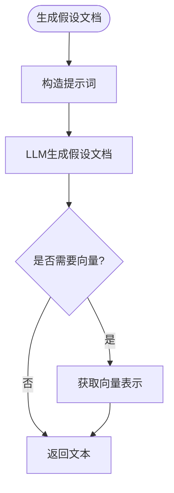
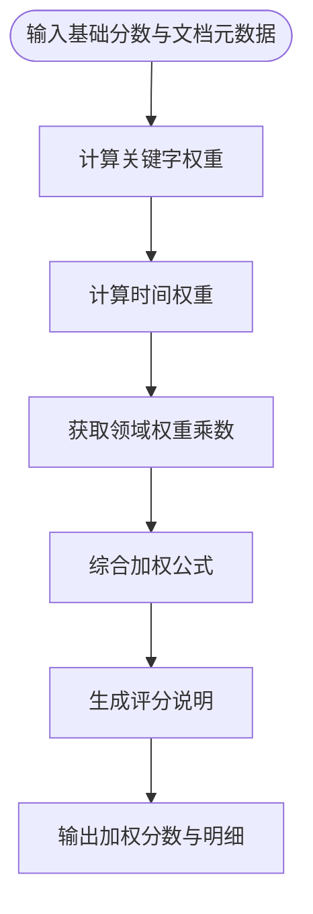
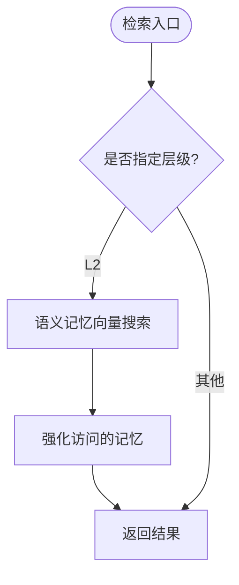
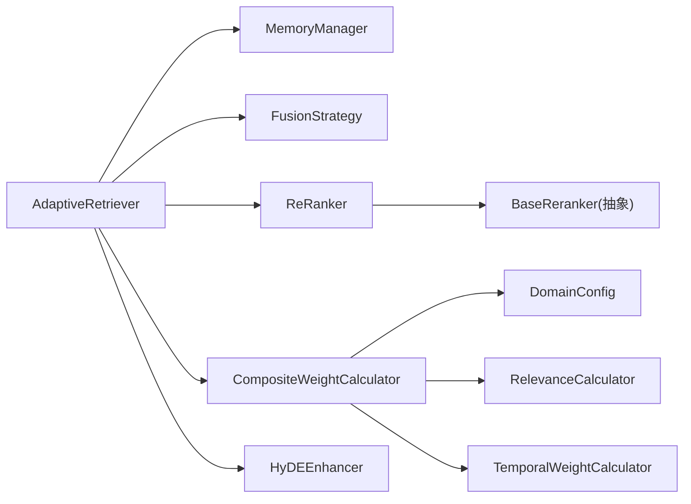

# 自适应检索核心

<cite>
**本文引用的文件**
- [retriever.py](file://src/retrieval/retriever.py)
- [fusion.py](file://src/retrieval/fusion.py)
- [reranker.py](file://src/retrieval/reranker.py)
- [models.py](file://src/retrieval/models.py)
- [base.py](file://src/core/base.py)
- [weight_calculator.py](file://src/domain/weight_calculator.py)
- [config.py](file://src/domain/config.py)
- [relevance.py](file://src/domain/relevance.py)
- [temporal_weight.py](file://src/domain/temporal_weight.py)
- [manager.py](file://src/memory/manager.py)
- [hyde.py](file://src/retrieval/hyde.py)
- [example_usage.py](file://example/example_usage.py)
</cite>

## 目录
1. [简介](#简介)
2. [项目结构](#项目结构)
3. [核心组件](#核心组件)
4. [架构总览](#架构总览)
5. [详细组件分析](#详细组件分析)
6. [依赖关系分析](#依赖关系分析)
7. [性能考量](#性能考量)
8. [故障排查指南](#故障排查指南)
9. [结论](#结论)
10. [附录](#附录)

## 简介
本文件聚焦于NecoRAG自适应检索核心模块，系统阐述AdaptiveRetriever类的设计架构与实现细节，包括多路检索策略（向量检索、图谱检索）、查询分析机制、检索流程控制与早停策略。同时深入解析早停控制器EarlyTerminationController的工作原理，涵盖置信度评估算法、边际收益计算与自适应阈值调整。文档还解释了检索路径追踪机制在调试与性能优化中的作用，并提供检索参数配置示例与最佳实践，帮助读者高效调优top_k、min_score、confidence_threshold等关键参数。

## 项目结构
自适应检索核心位于src/retrieval目录，围绕检索器、融合策略、重排序器与HyDE增强器构建；领域权重计算位于src/domain，与检索器解耦集成；记忆管理器位于src/memory，为向量检索提供底层存储与查询能力。

图表来源
- [retriever.py:128-458](file://src/retrieval/retriever.py#L128-L458)
- [fusion.py:9-128](file://src/retrieval/fusion.py#L9-L128)
- [reranker.py:11-186](file://src/retrieval/reranker.py#L11-L186)
- [weight_calculator.py:56-318](file://src/domain/weight_calculator.py#L56-L318)
- [config.py:54-285](file://src/domain/config.py#L54-L285)
- [manager.py:20-212](file://src/memory/manager.py#L20-L212)

章节来源
- [retriever.py:1-458](file://src/retrieval/retriever.py#L1-L458)
- [fusion.py:1-128](file://src/retrieval/fusion.py#L1-L128)
- [reranker.py:1-186](file://src/retrieval/reranker.py#L1-L186)
- [weight_calculator.py:1-318](file://src/domain/weight_calculator.py#L1-L318)
- [config.py:1-285](file://src/domain/config.py#L1-L285)
- [manager.py:1-212](file://src/memory/manager.py#L1-L212)

## 核心组件
- AdaptiveRetriever：自适应检索器，负责多路检索、结果融合、重排序、领域权重应用、早停控制与检索路径追踪。
- EarlyTerminationController：早停控制器，基于置信度与边际收益动态决定是否提前终止检索。
- FusionStrategy：结果融合策略，支持RRF与加权融合。
- ReRanker：重排序器，基于BGE-Reranker范式与新颖性惩罚、多样性保障。
- HyDEEnhancer：HyDE增强器，生成假设文档以提升检索质量。
- MemoryManager：记忆管理器，提供向量检索与图谱检索的底层支持。
- 领域权重模块：包含DomainConfig、CompositeWeightCalculator、RelevanceCalculator、TemporalWeightCalculator，实现关键字权重、时间权重与领域权重的综合计算。

章节来源
- [retriever.py:128-458](file://src/retrieval/retriever.py#L128-L458)
- [fusion.py:9-128](file://src/retrieval/fusion.py#L9-L128)
- [reranker.py:11-186](file://src/retrieval/reranker.py#L11-L186)
- [weight_calculator.py:56-318](file://src/domain/weight_calculator.py#L56-L318)
- [config.py:54-285](file://src/domain/config.py#L54-L285)
- [manager.py:20-212](file://src/memory/manager.py#L20-L212)

## 架构总览
下图展示AdaptiveRetriever的端到端检索流程，包括查询增强、多路检索、融合、重排序、领域权重、过滤与早停决策。

图表来源
- [retriever.py:183-267](file://src/retrieval/retriever.py#L183-L267)
- [fusion.py:18-70](file://src/retrieval/fusion.py#L18-L70)
- [reranker.py:42-77](file://src/retrieval/reranker.py#L42-L77)
- [weight_calculator.py:81-146](file://src/domain/weight_calculator.py#L81-L146)
- [manager.py:124-159](file://src/memory/manager.py#L124-L159)

## 详细组件分析

### AdaptiveRetriever 类设计与流程控制
- 多路检索策略
  - 向量检索：基于MemoryManager的语义记忆向量搜索，返回RetrievalResult列表。
  - 图谱检索：基于查询分析识别出的实体，执行图谱查询（当前实现返回空列表，预留扩展空间）。
- 结果融合：采用RRF（Reciprocal Rank Fusion），对来自不同来源的结果进行分数聚合与重排。
- 重排序：基于BGE-Reranker范式，实施新颖性惩罚与多样性保障，提升结果质量。
- 领域权重：可选应用，结合关键字权重、时间权重与领域权重，对基础分数进行加权并输出权重明细。
- 过滤与早停：根据min_score过滤低分结果，使用EarlyTerminationController评估置信度，若达到阈值或边际收益过低则提前终止。
- 检索路径追踪：记录每一步操作，便于调试与性能分析。

图表来源
- [retriever.py:183-267](file://src/retrieval/retriever.py#L183-L267)

章节来源
- [retriever.py:128-458](file://src/retrieval/retriever.py#L128-L458)
- [models.py:9-29](file://src/retrieval/models.py#L9-L29)
- [base.py:388-410](file://src/core/base.py#L388-L410)

### EarlyTerminationController 工作原理
- 置信度评估
  - 基于top-1分数与top-1与top-2的分数差距，结合结果数量进行归一化，得到置信度。
- 边际收益计算
  - 计算当前置信度与上次置信度的差值，若低于阈值min_gain，则认为边际收益递减，触发早停。
- 自适应阈值调整
  - 基于查询长度动态调整阈值，短查询降低阈值以避免过早终止，长查询维持默认阈值。

图表来源
- [retriever.py:61-107](file://src/retrieval/retriever.py#L61-L107)

章节来源
- [retriever.py:36-126](file://src/retrieval/retriever.py#L36-L126)

### 结果融合策略（FusionStrategy）
- RRF（Reciprocal Rank Fusion）
  - 对每个memory_id的rank位置进行倒数求和，再按聚合分数排序，实现跨来源的公平融合。
- 加权融合
  - 对各来源结果按权重累加分数，适合有明确来源权重的场景。

图表来源
- [fusion.py:18-70](file://src/retrieval/fusion.py#L18-L70)

章节来源
- [fusion.py:9-128](file://src/retrieval/fusion.py#L9-L128)

### 重排序器（ReRanker）
- 新颖性惩罚：对候选与已选结果的重复度进行惩罚，减少冗余。
- 多样性保障：采用类似MMR的策略，最大化相关性与最小化与已选结果的最大相似度。
- 排序：按最终分数降序输出，支持截断top_k。

图表来源
- [reranker.py:42-77](file://src/retrieval/reranker.py#L42-L77)

章节来源
- [reranker.py:11-186](file://src/retrieval/reranker.py#L11-L186)

### HyDE 增强器（HyDEEnhancer）
- 生成假设文档：通过LLM生成与查询相关的假设性答案，作为检索锚点。
- 多假设生成：支持多变体生成以提升多样性。
- 增强查询：可返回包含原始查询与假设文档的查询列表，便于后续检索。

图表来源
- [hyde.py:58-143](file://src/retrieval/hyde.py#L58-L143)

章节来源
- [hyde.py:17-213](file://src/retrieval/hyde.py#L17-L213)

### 领域权重计算（CompositeWeightCalculator）
- 关键字权重：基于DomainRelevanceCalculator计算关键字得分与密度，映射到权重区间。
- 时间权重：基于TemporalWeightCalculator计算指数衰减或分层权重，支持常青内容。
- 领域权重：根据领域相关性等级映射到权重乘数。
- 综合公式：final_score = base_score × (α×keyword_weight) × (β×temporal_weight) × (γ×domain_weight) × custom_weight

图表来源
- [weight_calculator.py:81-146](file://src/domain/weight_calculator.py#L81-L146)

章节来源
- [weight_calculator.py:56-318](file://src/domain/weight_calculator.py#L56-L318)
- [relevance.py:198-241](file://src/domain/relevance.py#L198-L241)
- [temporal_weight.py:160-195](file://src/domain/temporal_weight.py#L160-L195)
- [config.py:54-161](file://src/domain/config.py#L54-L161)

### 记忆管理器（MemoryManager）
- 向量检索：基于语义记忆存储，返回MemoryItem列表。
- 图谱检索：预留接口，当前返回空列表，便于后续扩展。
- 存储与巩固：支持知识存储、衰减与主动遗忘。

图表来源
- [manager.py:124-159](file://src/memory/manager.py#L124-L159)

章节来源
- [manager.py:20-212](file://src/memory/manager.py#L20-L212)

## 依赖关系分析
- AdaptiveRetriever依赖MemoryManager进行向量检索，依赖FusionStrategy进行结果融合，依赖ReRanker进行重排序，依赖CompositeWeightCalculator进行领域权重应用，依赖HyDEEnhancer进行查询增强。
- 领域权重模块内部依赖DomainConfig、RelevanceCalculator与TemporalWeightCalculator。
- 重排序器依赖BaseReranker抽象接口，确保可替换性。

图表来源
- [retriever.py:128-170](file://src/retrieval/retriever.py#L128-L170)
- [weight_calculator.py:56-80](file://src/domain/weight_calculator.py#L56-L80)
- [base.py:412-433](file://src/core/base.py#L412-L433)

章节来源
- [retriever.py:1-458](file://src/retrieval/retriever.py#L1-L458)
- [weight_calculator.py:1-318](file://src/domain/weight_calculator.py#L1-L318)
- [base.py:412-433](file://src/core/base.py#L412-L433)

## 性能考量
- 早停策略显著降低计算开销：当置信度达到阈值或边际收益过低时提前终止，避免不必要的重排序与领域权重计算。
- RRF融合与重排序的复杂度与来源数量呈线性关系，建议合理设置top_k与融合来源数量。
- 领域权重计算在重排序后进行，对结果规模较小的集合影响有限，但需注意权重因子的平衡。
- 多假设生成会增加LLM调用成本，建议在需要高质量检索时启用，并控制假设数量。

## 故障排查指南
- 检索路径追踪
  - 使用AdaptiveRetriever.get_retrieval_trace()查看每一步骤，定位瓶颈与异常。
- 置信度过低导致提前终止
  - 调整confidence_threshold或min_gain，或检查查询增强与融合策略是否有效。
- 重排序结果质量不佳
  - 调整novelty_weight、diversity_weight与redundancy_penalty，观察对重复与多样性的影响。
- 领域权重未生效
  - 确认DomainConfig正确加载且apply_domain_weight为True，检查权重因子与时间衰减配置。
- 图谱检索为空
  - 检查查询分析是否识别到实体，确认图谱存储与查询接口可用。

章节来源
- [retriever.py:383-390](file://src/retrieval/retriever.py#L383-L390)

## 结论
AdaptiveRetriever通过多路检索、智能融合、重排序与领域权重计算，结合早停控制器实现高效的自适应检索。检索路径追踪机制为调试与优化提供了清晰的线索。合理配置top_k、min_score、confidence_threshold等参数，可在准确性与性能之间取得良好平衡。

## 附录

### 检索参数配置示例与调优建议
- top_k
  - 建议：向量检索阶段扩大至2倍以上，融合与重排序后再截断，避免信息丢失。
- min_score
  - 建议：根据数据分布设定，如0.3~0.5之间，确保返回结果具备一定相关性。
- confidence_threshold
  - 建议：默认0.85，短查询可降至0.7~0.8，长查询维持0.85~0.9。
- min_gain
  - 建议：默认0.05，若希望更早停止可适当提高，反之降低以获得更充分的重排序。
- novelty_weight、diversity_weight、redundancy_penalty
  - 建议：novelty_weight≈0.3，diversity_weight≈0.2，redundancy_penalty≈0.4，按结果重复度与多样性反馈微调。
- apply_domain_weight
  - 建议：开启以提升领域相关性，关闭以对比性能差异。
- reranker_model
  - 建议：默认"BGE-Reranker-v2"，可根据部署环境选择合适模型。

### 完整检索流程代码示例路径
- AdaptiveRetriever.retrieve
  - [retriever.py:183-267](file://src/retrieval/retriever.py#L183-L267)
- AdaptiveRetriever._apply_domain_weights
  - [retriever.py:269-319](file://src/retrieval/retriever.py#L269-L319)
- FusionStrategy.reciprocal_rank_fusion
  - [fusion.py:18-70](file://src/retrieval/fusion.py#L18-L70)
- ReRanker.rerank
  - [reranker.py:42-77](file://src/retrieval/reranker.py#L42-L77)
- HyDEEnhancer.generate_hypothetical_doc
  - [hyde.py:58-83](file://src/retrieval/hyde.py#L58-L83)
- MemoryManager.retrieve
  - [manager.py:124-159](file://src/memory/manager.py#L124-L159)
- 领域权重计算
  - [weight_calculator.py:81-146](file://src/domain/weight_calculator.py#L81-L146)
  - [relevance.py:198-241](file://src/domain/relevance.py#L198-L241)
  - [temporal_weight.py:160-195](file://src/domain/temporal_weight.py#L160-L195)

### 最佳实践指南
- 查询增强优先：启用QueryRelevanceEnhancer以提升检索相关性。
- 多路检索互补：向量检索与图谱检索结合，融合策略选择RRF以平衡来源贡献。
- 早停策略配合：根据业务SLA调整阈值与边际收益，兼顾吞吐与质量。
- 领域权重精细化：依据领域特性调整权重因子与时间衰减策略。
- 性能监控：利用检索路径追踪与日志，持续优化参数与流程。