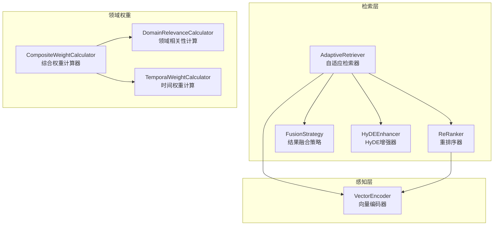
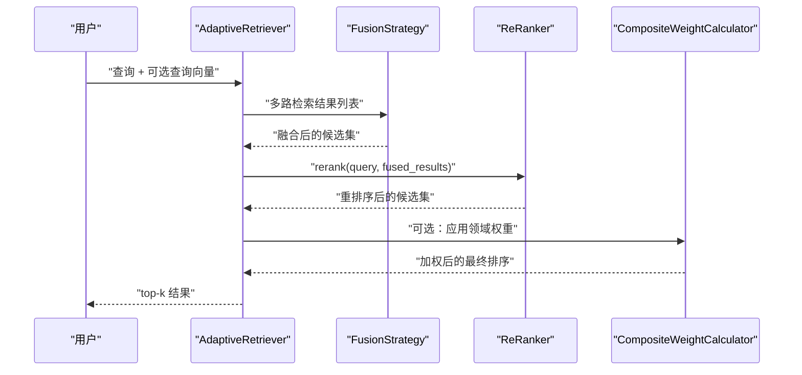
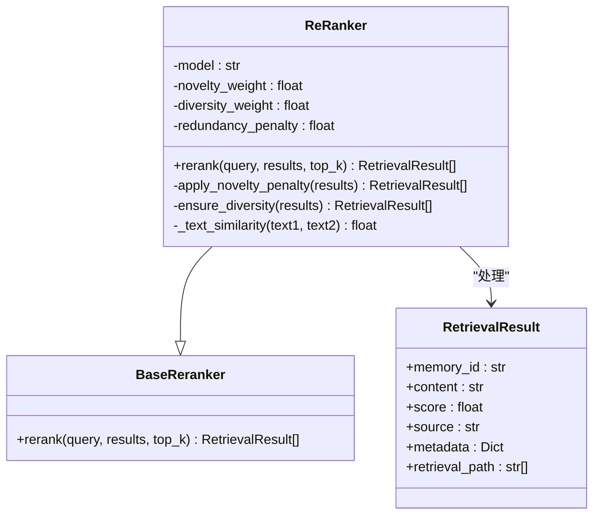
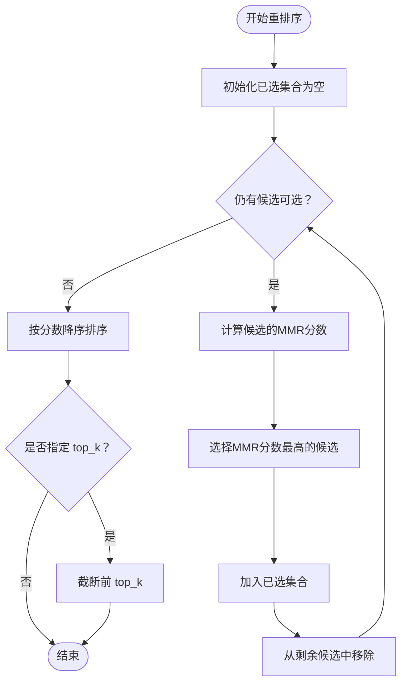
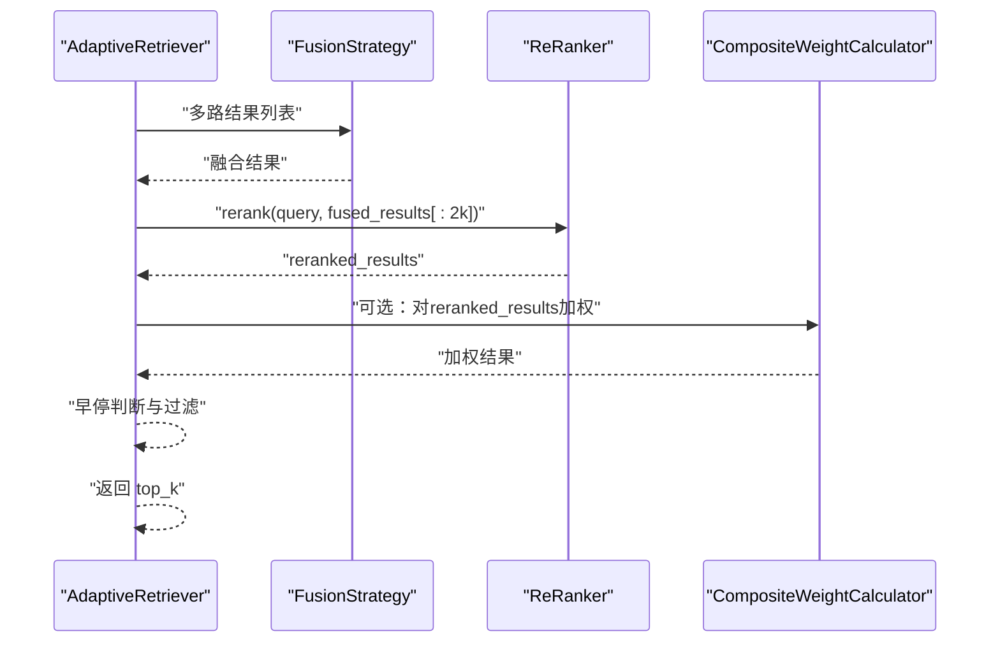
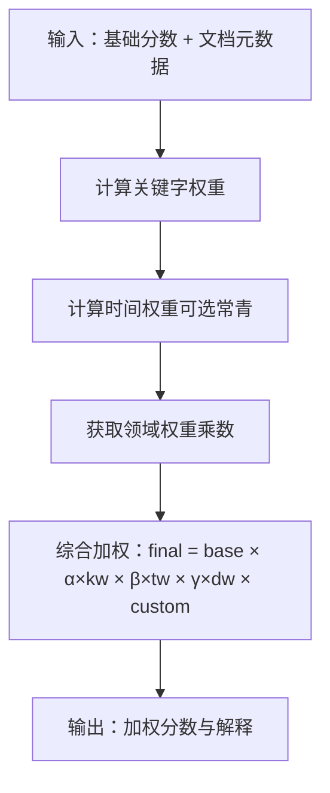
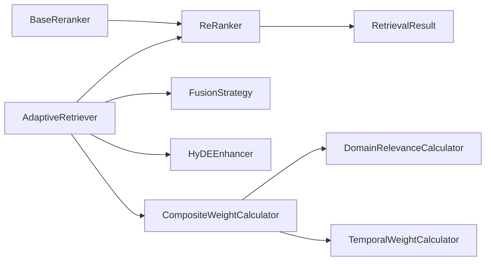

# 重排序系统

<cite>
**本文引用的文件**
- [src/retrieval/reranker.py](file://src/retrieval/reranker.py)
- [src/retrieval/models.py](file://src/retrieval/models.py)
- [src/retrieval/fusion.py](file://src/retrieval/fusion.py)
- [src/retrieval/retriever.py](file://src/retrieval/retriever.py)
- [src/retrieval/hyde.py](file://src/retrieval/hyde.py)
- [src/core/base.py](file://src/core/base.py)
- [src/domain/relevance.py](file://src/domain/relevance.py)
- [src/domain/weight_calculator.py](file://src/domain/weight_calculator.py)
- [src/domain/temporal_weight.py](file://src/domain/temporal_weight.py)
- [src/perception/encoder.py](file://src/perception/encoder.py)
- [example/example_usage.py](file://example/example_usage.py)
</cite>

## 目录
1. [简介](#简介)
2. [项目结构](#项目结构)
3. [核心组件](#核心组件)
4. [架构总览](#架构总览)
5. [详细组件分析](#详细组件分析)
6. [依赖分析](#依赖分析)
7. [性能考量](#性能考量)
8. [故障排查指南](#故障排查指南)
9. [结论](#结论)
10. [附录](#附录)

## 简介
本章节面向NecoRAG的重排序系统模块，聚焦ReRanker类的实现与工作机制，系统阐述以下内容：
- 基于上下文的相关性评分与领域权重融合
- 语义匹配优化与BM25风格相似度的结合
- 多模态信息（稠密向量、稀疏向量、实体三元组）在检索与重排序中的利用思路
- 重排序模型选择与配置（以BGE-Reranker-v2为例）
- 重排序过程中的分数计算机制（新颖性惩罚、多样性保障、领域权重）
- 参数调优指南与性能优化技巧
- 具体示例与效果对比分析

## 项目结构
重排序系统位于检索层，与融合策略、HyDE增强、领域权重计算共同构成自适应检索管线。下图展示与重排序相关的主要模块与依赖关系。

**图表来源**
- [src/retrieval/retriever.py:128-268](file://src/retrieval/retriever.py#L128-L268)
- [src/retrieval/reranker.py:11-77](file://src/retrieval/reranker.py#L11-L77)
- [src/retrieval/fusion.py:9-71](file://src/retrieval/fusion.py#L9-L71)
- [src/retrieval/hyde.py:17-84](file://src/retrieval/hyde.py#L17-L84)
- [src/domain/weight_calculator.py:56-146](file://src/domain/weight_calculator.py#L56-L146)
- [src/domain/relevance.py:29-241](file://src/domain/relevance.py#L29-L241)
- [src/domain/temporal_weight.py:47-195](file://src/domain/temporal_weight.py#L47-L195)
- [src/perception/encoder.py:25-120](file://src/perception/encoder.py#L25-L120)

**章节来源**
- [src/retrieval/retriever.py:128-268](file://src/retrieval/retriever.py#L128-L268)
- [src/retrieval/reranker.py:11-77](file://src/retrieval/reranker.py#L11-L77)
- [src/retrieval/fusion.py:9-71](file://src/retrieval/fusion.py#L9-L71)
- [src/retrieval/hyde.py:17-84](file://src/retrieval/hyde.py#L17-L84)
- [src/domain/weight_calculator.py:56-146](file://src/domain/weight_calculator.py#L56-L146)
- [src/domain/relevance.py:29-241](file://src/domain/relevance.py#L29-L241)
- [src/domain/temporal_weight.py:47-195](file://src/domain/temporal_weight.py#L47-L195)
- [src/perception/encoder.py:25-120](file://src/perception/encoder.py#L25-L120)

## 核心组件
- ReRanker：重排序器，负责对融合后的候选结果进行精排，引入新颖性惩罚与多样性保障，并预留BGE-Reranker-v2等模型集成入口。
- AdaptiveRetriever：自适应检索器，串联向量检索、图谱检索、结果融合、重排序、领域权重应用与早停控制。
- FusionStrategy：结果融合策略，支持RRF与加权融合，提升跨来源检索的鲁棒性。
- HyDEEnhancer：假设文档嵌入增强器，通过LLM生成假设性答案文档，改善检索质量。
- 领域权重系统：DomainRelevanceCalculator（关键字与密度评分）、TemporalWeightCalculator（时间衰减）、CompositeWeightCalculator（综合加权）。

**章节来源**
- [src/retrieval/reranker.py:11-77](file://src/retrieval/reranker.py#L11-L77)
- [src/retrieval/retriever.py:128-268](file://src/retrieval/retriever.py#L128-L268)
- [src/retrieval/fusion.py:9-71](file://src/retrieval/fusion.py#L9-L71)
- [src/retrieval/hyde.py:17-84](file://src/retrieval/hyde.py#L17-L84)
- [src/domain/relevance.py:29-241](file://src/domain/relevance.py#L29-L241)
- [src/domain/weight_calculator.py:56-146](file://src/domain/weight_calculator.py#L56-L146)
- [src/domain/temporal_weight.py:47-195](file://src/domain/temporal_weight.py#L47-L195)

## 架构总览
下图展示从查询到重排序再到最终结果的完整流程，突出重排序阶段的输入输出与处理步骤。

**图表来源**
- [src/retrieval/retriever.py:183-267](file://src/retrieval/retriever.py#L183-L267)
- [src/retrieval/fusion.py:18-70](file://src/retrieval/fusion.py#L18-L70)
- [src/retrieval/reranker.py:42-77](file://src/retrieval/reranker.py#L42-L77)
- [src/domain/weight_calculator.py:81-146](file://src/domain/weight_calculator.py#L81-L146)

**章节来源**
- [src/retrieval/retriever.py:183-267](file://src/retrieval/retriever.py#L183-L267)
- [src/retrieval/fusion.py:18-70](file://src/retrieval/fusion.py#L18-L70)
- [src/retrieval/reranker.py:42-77](file://src/retrieval/reranker.py#L42-L77)
- [src/domain/weight_calculator.py:81-146](file://src/domain/weight_calculator.py#L81-L146)

## 详细组件分析

### ReRanker 类分析
ReRanker继承自BaseReranker，提供以下能力：
- 新颖性惩罚：通过候选与已选集合的相似度累计，对重复内容施加惩罚，抑制检索结果中的冗余。
- 多样性保障：采用类似MMR的贪心策略，最大化相关性与最小化与已选集合的最大相似度的加权差，提升多样性。
- 排序与截断：按最终分数降序排列，并可按top_k截断输出。

**图表来源**
- [src/core/base.py:412-433](file://src/core/base.py#L412-L433)
- [src/retrieval/reranker.py:11-186](file://src/retrieval/reranker.py#L11-L186)
- [src/retrieval/models.py:9-18](file://src/retrieval/models.py#L9-L18)

**章节来源**
- [src/retrieval/reranker.py:11-186](file://src/retrieval/reranker.py#L11-L186)
- [src/core/base.py:412-433](file://src/core/base.py#L412-L433)
- [src/retrieval/models.py:9-18](file://src/retrieval/models.py#L9-L18)

#### 新颖性惩罚与多样性策略
- 新颖性惩罚：对每个候选，计算其与已选集合的相似度总和，再按候选序号平均化，乘以惩罚系数，对候选分数进行缩放。
- 多样性策略：贪心地选择使相关性与与已选集合最大相似度之间的加权差最大的候选，逐步扩展已选集合，从而在相关性与多样性之间取得平衡。

**图表来源**
- [src/retrieval/reranker.py:116-160](file://src/retrieval/reranker.py#L116-L160)
- [src/retrieval/reranker.py:79-114](file://src/retrieval/reranker.py#L79-L114)

**章节来源**
- [src/retrieval/reranker.py:79-160](file://src/retrieval/reranker.py#L79-L160)

#### 文本相似度计算
当前实现采用Jaccard相似度（基于词集合），作为候选间重复度的衡量。后续可替换为更精确的语义相似度（例如基于向量余弦相似度或专用嵌入模型）。

**章节来源**
- [src/retrieval/reranker.py:162-186](file://src/retrieval/reranker.py#L162-L186)

### AdaptiveRetriever 与重排序集成
AdaptiveRetriever在完成多路检索与融合后，调用ReRanker进行精排，并可选地应用领域权重与早停控制，最终输出top-k结果。

**图表来源**
- [src/retrieval/retriever.py:236-267](file://src/retrieval/retriever.py#L236-L267)
- [src/retrieval/reranker.py:42-77](file://src/retrieval/reranker.py#L42-L77)
- [src/domain/weight_calculator.py:81-146](file://src/domain/weight_calculator.py#L81-L146)

**章节来源**
- [src/retrieval/retriever.py:183-267](file://src/retrieval/retriever.py#L183-L267)
- [src/retrieval/reranker.py:42-77](file://src/retrieval/reranker.py#L42-L77)
- [src/domain/weight_calculator.py:81-146](file://src/domain/weight_calculator.py#L81-L146)

### 领域相关性与时间权重融合
- 关键字与密度评分：DomainRelevanceCalculator根据关键字权重与密度计算领域相关性等级与权重乘数。
- 时间权重：TemporalWeightCalculator提供指数衰减、分层权重与混合方法，支持常青内容与不同领域变化速率。
- 综合权重：CompositeWeightCalculator将关键字权重、时间权重与领域权重相乘，得到最终加权分数，并记录详细解释。

**图表来源**
- [src/domain/weight_calculator.py:81-146](file://src/domain/weight_calculator.py#L81-L146)
- [src/domain/relevance.py:198-241](file://src/domain/relevance.py#L198-L241)
- [src/domain/temporal_weight.py:160-195](file://src/domain/temporal_weight.py#L160-L195)

**章节来源**
- [src/domain/weight_calculator.py:56-146](file://src/domain/weight_calculator.py#L56-L146)
- [src/domain/relevance.py:198-241](file://src/domain/relevance.py#L198-L241)
- [src/domain/temporal_weight.py:160-195](file://src/domain/temporal_weight.py#L160-L195)

### 多模态信息融合思路
- 稠密向量：用于向量检索与相似度计算，适合语义匹配。
- 稀疏向量：TF-IDF风格的词频权重，适合关键词匹配与BM25风格的相似度。
- 实体三元组：抽取文档中的实体关系，辅助图谱检索与上下文增强。
- 融合策略：RRF与加权融合可有效整合多模态检索信号，提升召回稳定性。

**章节来源**
- [src/perception/encoder.py:73-190](file://src/perception/encoder.py#L73-L190)
- [src/retrieval/fusion.py:18-70](file://src/retrieval/fusion.py#L18-L70)

## 依赖分析
- ReRanker依赖BaseReranker接口与RetrievalResult数据模型。
- AdaptiveRetriever依赖FusionStrategy、ReRanker、HyDEEnhancer以及领域权重计算器。
- 领域权重系统内部依赖DomainRelevanceCalculator与TemporalWeightCalculator。

**图表来源**
- [src/core/base.py:412-433](file://src/core/base.py#L412-L433)
- [src/retrieval/reranker.py:6-8](file://src/retrieval/reranker.py#L6-L8)
- [src/retrieval/models.py:9-18](file://src/retrieval/models.py#L9-L18)
- [src/retrieval/retriever.py:15-17](file://src/retrieval/retriever.py#L15-L17)
- [src/domain/weight_calculator.py:56-80](file://src/domain/weight_calculator.py#L56-L80)

**章节来源**
- [src/core/base.py:412-433](file://src/core/base.py#L412-L433)
- [src/retrieval/reranker.py:6-8](file://src/retrieval/reranker.py#L6-L8)
- [src/retrieval/models.py:9-18](file://src/retrieval/models.py#L9-L18)
- [src/retrieval/retriever.py:15-17](file://src/retrieval/retriever.py#L15-L17)
- [src/domain/weight_calculator.py:56-80](file://src/domain/weight_calculator.py#L56-L80)

## 性能考量
- 复杂度分析
  - 新颖性惩罚：对每个候选计算与已选集合的相似度，整体复杂度约为O(N^2)，建议在候选规模较大时限制top_k或采用近似相似度。
  - 多样性策略：MMR贪心选择，每轮需计算与已选集合的最大相似度，整体复杂度约O(N^2)。
  - 文本相似度：当前实现为Jaccard，时间复杂度较低；若替换为向量余弦相似度，需考虑向量维度与归一化开销。
- 早停机制：AdaptiveRetriever通过置信度阈值与边际收益策略减少不必要的重排序计算，显著降低尾部候选的处理成本。
- 融合策略：RRF与加权融合均能在多路检索后稳定提升质量，且计算开销可控。

**章节来源**
- [src/retrieval/retriever.py:36-108](file://src/retrieval/retriever.py#L36-L108)
- [src/retrieval/reranker.py:79-160](file://src/retrieval/reranker.py#L79-L160)

## 故障排查指南
- 重排序结果为空
  - 检查输入results是否为空，确认融合与重排序前的数据链路是否正确。
  - 参考：[src/retrieval/reranker.py:61-62](file://src/retrieval/reranker.py#L61-L62)
- 新颖性惩罚导致分数过低
  - 调整redundancy_penalty与novelty_weight，避免过度惩罚。
  - 参考：[src/retrieval/reranker.py:21-40](file://src/retrieval/reranker.py#L21-L40)
- 多样性不足或过度
  - 调整diversity_weight，平衡相关性与多样性。
  - 参考：[src/retrieval/reranker.py:21-40](file://src/retrieval/reranker.py#L21-L40)
- 语义相似度不准确
  - 替换_text_similarity为基于向量余弦相似度或专用嵌入模型。
  - 参考：[src/retrieval/reranker.py:162-186](file://src/retrieval/reranker.py#L162-L186)
- 领域权重未生效
  - 确认DomainConfig与CompositeWeightCalculator已正确初始化，并在检索流程中调用加权逻辑。
  - 参考：[src/retrieval/retriever.py:246-248](file://src/retrieval/retriever.py#L246-L248)

**章节来源**
- [src/retrieval/reranker.py:21-40](file://src/retrieval/reranker.py#L21-L40)
- [src/retrieval/reranker.py:61-62](file://src/retrieval/reranker.py#L61-L62)
- [src/retrieval/reranker.py:162-186](file://src/retrieval/reranker.py#L162-L186)
- [src/retrieval/retriever.py:246-248](file://src/retrieval/retriever.py#L246-L248)

## 结论
NecoRAG的重排序系统通过ReRanker实现了新颖性惩罚与多样性保障，结合融合策略与可选的领域权重，形成稳健的精排流程。当前实现预留了BGE-Reranker-v2等模型的集成空间，同时提供了基于Jaccard相似度的文本匹配与向量编码器的多模态能力。通过合理的参数调优与早停机制，可在准确性与效率之间取得良好平衡。

## 附录

### 重排序模型选择与配置（以BGE-Reranker-v2为例）
- 模型特点
  - 专为语义匹配设计，支持query-document pair评分，具备良好的跨领域泛化能力。
  - 适合在重排序阶段替代当前基于文本相似度的简单策略，进一步提升相关性评分精度。
- 配置要点
  - 模型名称：BGE-Reranker-v2
  - 集成方式：在ReRanker中预留模型参数与调用入口，按需替换相似度计算与语义评分逻辑。
- 适用场景
  - 需要高质量语义匹配的问答与检索任务。
  - 对重复与冗余敏感的长文档检索。

**章节来源**
- [src/retrieval/reranker.py:21-40](file://src/retrieval/reranker.py#L21-L40)
- [src/retrieval/reranker.py](file://src/retrieval/reranker.py#L59)

### 重排序分数计算机制
- BM25风格相似度
  - 通过稀疏向量（TF-IDF风格词频）与关键词匹配实现，适合关键词密集场景。
  - 参考：[src/perception/encoder.py:121-147](file://src/perception/encoder.py#L121-L147)
- 语义相似度
  - 基于向量余弦相似度或专用嵌入模型，适合语义匹配场景。
  - 参考：[src/perception/encoder.py:89-119](file://src/perception/encoder.py#L89-L119)
- 混合评分策略
  - 将BM25与语义相似度按权重融合，兼顾关键词与语义信息。
  - 参考：[src/retrieval/fusion.py:72-127](file://src/retrieval/fusion.py#L72-L127)

**章节来源**
- [src/perception/encoder.py:89-147](file://src/perception/encoder.py#L89-L147)
- [src/retrieval/fusion.py:72-127](file://src/retrieval/fusion.py#L72-L127)

### 重排序参数调优指南
- 新颖性惩罚（redundancy_penalty）
  - 建议范围：0.1–0.8；过高会抑制重复内容，过低可能导致结果冗余。
- 多样性权重（diversity_weight）
  - 建议范围：0.1–0.5；与novelty_weight协同调节。
- 模型选择
  - 若语义匹配更重要，优先选择BGE-Reranker-v2等语义模型。
  - 若关键词匹配更重要，可结合BM25风格稀疏向量与领域权重。
- 阈值与早停
  - confidence_threshold建议设置在0.8–0.95区间，结合min_gain避免过早停止。
  - 参考：[src/retrieval/retriever.py:45-107](file://src/retrieval/retriever.py#L45-L107)

**章节来源**
- [src/retrieval/reranker.py:21-40](file://src/retrieval/reranker.py#L21-L40)
- [src/retrieval/retriever.py:45-107](file://src/retrieval/retriever.py#L45-L107)

### 示例与效果对比
- 示例入口
  - 完整工作流示例展示了从感知、记忆、检索到回答的端到端流程，其中包含重排序环节的调用与结果展示。
  - 参考：[example/example_usage.py:94-136](file://example/example_usage.py#L94-L136)
- 效果对比建议
  - 对比项：仅BM25、仅语义模型、BM25+语义混合、加入新颖性惩罚与多样性策略。
  - 指标：准确率、多样性、覆盖率、响应时间、早停命中率。
  - 方法：在相同查询集上分别运行各策略，统计Top-k命中与人工评估。

**章节来源**
- [example/example_usage.py:94-136](file://example/example_usage.py#L94-L136)