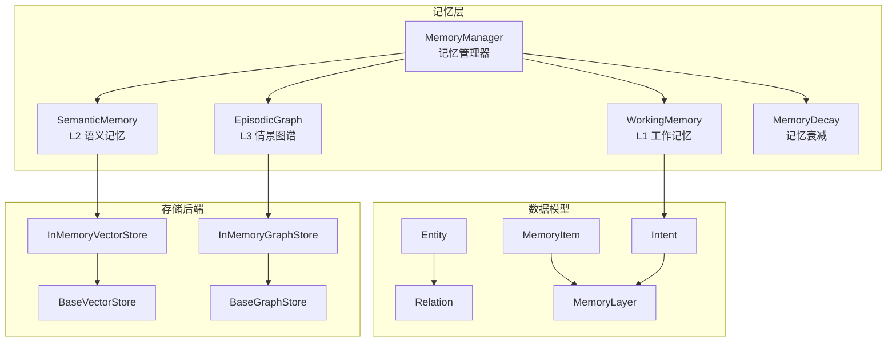
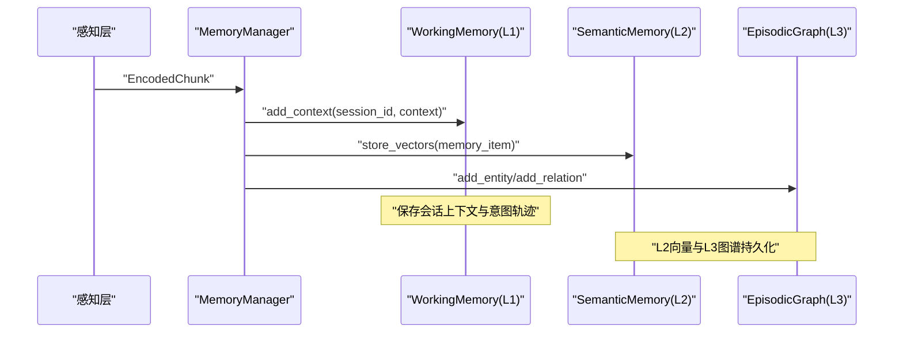
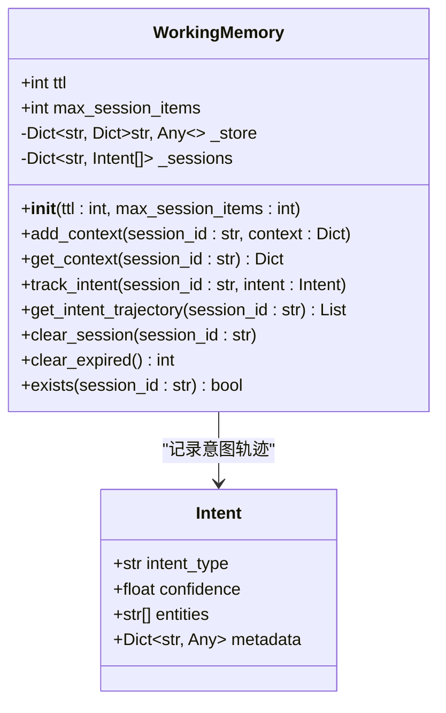
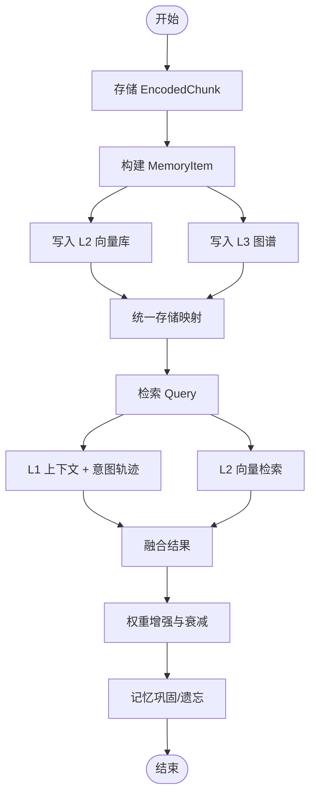
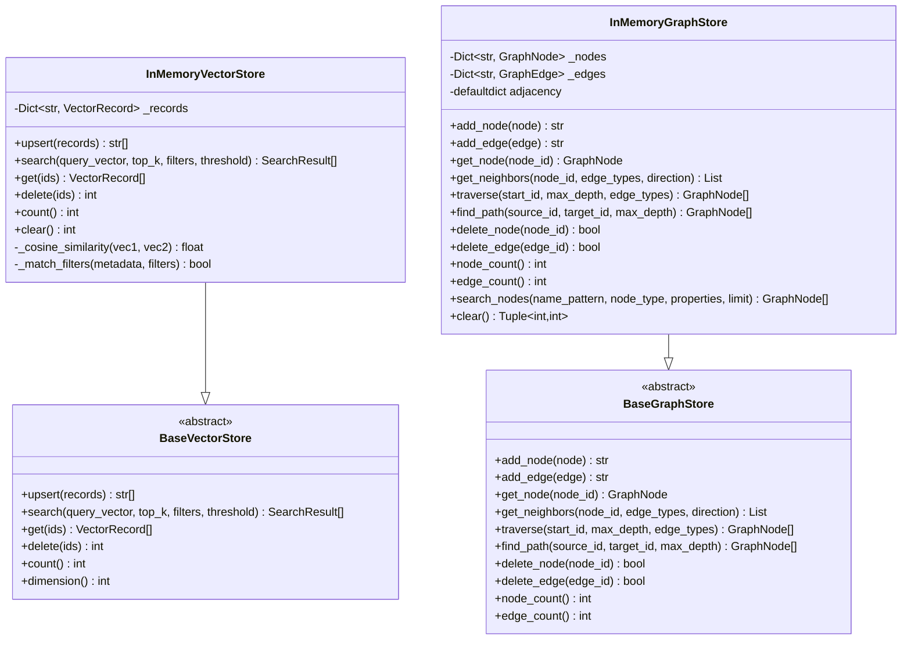
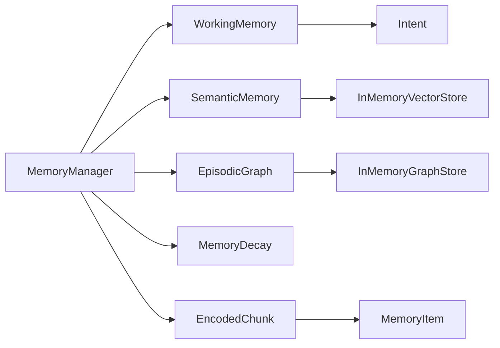

# 工作记忆 (L1)

<cite>
**本文引用的文件**
- [working_memory.py](file://src/memory/working_memory.py)
- [models.py](file://src/memory/models.py)
- [manager.py](file://src/memory/manager.py)
- [memory_store.py](file://src/memory/backends/memory_store.py)
- [base.py](file://src/memory/backends/base.py)
- [decay.py](file://src/memory/decay.py)
- [protocols.py](file://src/core/protocols.py)
- [README.md](file://src/memory/README.md)
- [example_usage.py](file://example/example_usage.py)
- [__init__.py](file://src/memory/__init__.py)
</cite>

## 目录
1. [简介](#简介)
2. [项目结构](#项目结构)
3. [核心组件](#核心组件)
4. [架构总览](#架构总览)
5. [详细组件分析](#详细组件分析)
6. [依赖分析](#依赖分析)
7. [性能考虑](#性能考虑)
8. [故障排除指南](#故障排除指南)
9. [结论](#结论)
10. [附录](#附录)

## 简介
本节面向“工作记忆（L1）”的完整文档化目标，围绕短期记忆存储的设计理念展开，重点阐述：
- Redis缓存的高速读写机制与内存数据结构组织方式
- 如何模拟人类大脑中快速信息处理的特点（瞬时遗忘、意图轨迹、上下文）
- 生命周期管理、数据过期策略与与其他记忆层的协调机制
- 工作记忆操作接口、性能优化方案与故障排除指南
- 实际使用示例与最佳实践建议

工作记忆（L1）在NecoRAG中承担“当前会话上下文与用户意图轨迹”的短期存储职责，通过极低延迟访问、TTL自动过期、LRU淘汰策略与“瞬时遗忘”模拟，实现接近人类大脑的快速信息处理能力。

## 项目结构
与工作记忆（L1）直接相关的模块与文件如下：
- 记忆层核心：MemoryManager、WorkingMemory、SemanticMemory、EpisodicGraph、MemoryDecay
- 数据模型：MemoryItem、Intent、Entity、Relation、MemoryLayer等
- 存储后端：内存向量存储与图存储（InMemoryVectorStore、InMemoryGraphStore）
- 示例与入口：example_usage.py、src/memory/__init__.py

图表来源
- [manager.py:20-51](file://src/memory/manager.py#L20-L51)
- [working_memory.py:11-35](file://src/memory/working_memory.py#L11-L35)
- [memory_store.py:20-381](file://src/memory/backends/memory_store.py#L20-L381)
- [base.py:61-314](file://src/memory/backends/base.py#L61-L314)
- [models.py:14-43](file://src/memory/models.py#L14-L43)
- [protocols.py:36-41](file://src/core/protocols.py#L36-L41)

章节来源
- [README.md:1-244](file://src/memory/README.md#L1-L244)
- [__init__.py:1-29](file://src/memory/__init__.py#L1-L29)

## 核心组件
- WorkingMemory（L1）：负责会话上下文与意图轨迹的短期存储，提供添加、获取、清理、存在性检查等接口；当前最小实现采用内存字典模拟Redis行为，预留TTL与LRU等扩展点。
- MemoryManager：统一管理三层记忆，协调L1/L2/L3之间的数据流转与整合。
- MemoryDecay：实现记忆权重衰减与主动遗忘，配合L1/L2/L3进行知识巩固与归档。
- 存储后端：InMemoryVectorStore与InMemoryGraphStore提供内存级向量与图存储能力，便于开发与测试。

章节来源
- [working_memory.py:11-120](file://src/memory/working_memory.py#L11-L120)
- [manager.py:20-51](file://src/memory/manager.py#L20-L51)
- [decay.py:11-155](file://src/memory/decay.py#L11-L155)
- [memory_store.py:20-381](file://src/memory/backends/memory_store.py#L20-L381)

## 架构总览
工作记忆（L1）在整体架构中的定位与交互如下：
- 输入：感知层编码后的文本块（EncodedChunk），经由MemoryManager进入L2/L3持久化；同时L1保留当前会话上下文与意图轨迹。
- 输出：检索阶段优先从L1获取上下文，再结合L2向量检索与L3图谱推理，形成融合结果。
- 协调：MemoryManager在存储、检索、巩固与遗忘过程中，统一调度各层组件。

图表来源
- [manager.py:52-122](file://src/memory/manager.py#L52-L122)
- [working_memory.py:36-95](file://src/memory/working_memory.py#L36-L95)

## 详细组件分析

### WorkingMemory（L1）类设计与接口
- 设计理念：以“极低延迟访问、TTL自动过期、LRU淘汰策略、瞬时遗忘”为核心特性，模拟人类大脑的快速信息处理与短期记忆。
- 数据结构：
  - 会话上下文存储：字典映射session_id到上下文字典，附加“最后更新时间戳”字段。
  - 意图轨迹存储：字典映射session_id到Intent对象列表。
- 关键方法：
  - add_context(session_id, context)：合并上下文并更新时间戳
  - get_context(session_id)：获取上下文
  - track_intent(session_id, intent)：记录用户意图
  - get_intent_trajectory(session_id)：获取意图序列
  - clear_session(session_id)：清除会话数据（模拟遗忘）
  - clear_expired()：当前最小实现返回0，预留TTL过期检测
  - exists(session_id)：检查会话是否存在

图表来源
- [working_memory.py:11-120](file://src/memory/working_memory.py#L11-L120)
- [models.py:37-43](file://src/memory/models.py#L37-L43)

章节来源
- [working_memory.py:11-120](file://src/memory/working_memory.py#L11-L120)
- [models.py:37-43](file://src/memory/models.py#L37-L43)

### MemoryManager（三层记忆统一管理）
- 职责：初始化L1/L2/L3组件，协调存储、检索、巩固与遗忘流程。
- 存储流程：将EncodedChunk封装为MemoryItem，写入L2向量库与L3图谱，同时在统一存储中维护映射。
- 检索流程：默认检索L1与L2，结合MemoryDecay对检索结果进行权重增强。
- 巩固与遗忘：应用衰减、归档低权重记忆，主动遗忘低价值知识。

图表来源
- [manager.py:52-202](file://src/memory/manager.py#L52-L202)
- [decay.py:72-142](file://src/memory/decay.py#L72-L142)

章节来源
- [manager.py:20-212](file://src/memory/manager.py#L20-L212)
- [decay.py:11-155](file://src/memory/decay.py#L11-L155)

### 存储后端（内存向量与图存储）
- InMemoryVectorStore：提供向量记录的增删改查、相似度搜索、元数据过滤与阈值筛选，适合开发与测试场景。
- InMemoryGraphStore：提供节点/边的增删改查、邻居查询、图遍历与路径查找，支持方向与类型过滤。
- BaseVectorStore/BaseGraphStore：定义统一接口，便于替换为Redis、Qdrant、Neo4j等生产级后端。

图表来源
- [base.py:61-314](file://src/memory/backends/base.py#L61-L314)
- [memory_store.py:20-381](file://src/memory/backends/memory_store.py#L20-L381)

章节来源
- [base.py:61-314](file://src/memory/backends/base.py#L61-L314)
- [memory_store.py:20-381](file://src/memory/backends/memory_store.py#L20-L381)

### 数据模型与协议
- MemoryLayer：定义L1/L2/L3三层记忆枚举，用于检索与存储选择。
- MemoryItem：统一记忆项，包含内容、向量、权重、访问计数、时间戳与元数据。
- Intent：用户意图，包含类型、置信度、实体与元数据。
- Entity/Relation：知识图谱实体与关系，用于L3情景图谱。

章节来源
- [protocols.py:36-41](file://src/core/protocols.py#L36-L41)
- [models.py:14-43](file://src/memory/models.py#L14-L43)

## 依赖分析
- WorkingMemory依赖Intent数据模型，用于记录用户意图轨迹。
- MemoryManager依赖WorkingMemory、SemanticMemory、EpisodicGraph与MemoryDecay，统一调度三层记忆。
- SemanticMemory与EpisodicGraph依赖内存存储实现（InMemoryVectorStore、InMemoryGraphStore），在生产环境可替换为Redis/Qdrant/Neo4j等。
- MemoryManager还依赖感知层的EncodedChunk，将其转换为MemoryItem并写入L2/L3。

图表来源
- [working_memory.py:8-8](file://src/memory/working_memory.py#L8-L8)
- [manager.py:9-13](file://src/memory/manager.py#L9-L13)
- [memory_store.py:13-17](file://src/memory/backends/memory_store.py#L13-L17)
- [models.py:11-11](file://src/memory/models.py#L11-L11)

章节来源
- [working_memory.py:8-8](file://src/memory/working_memory.py#L8-L8)
- [manager.py:9-13](file://src/memory/manager.py#L9-L13)
- [memory_store.py:13-17](file://src/memory/backends/memory_store.py#L13-L17)
- [models.py:11-11](file://src/memory/models.py#L11-L11)

## 性能考虑
- L1（工作记忆）：内存字典访问，O(1)平均时间复杂度；TTL与LRU策略预留扩展点，当前最小实现未实现TTL过期检测与LRU淘汰，建议在生产环境中接入Redis以获得真正的TTL与LRU能力。
- L2（语义记忆）：InMemoryVectorStore采用余弦相似度与全量扫描，适合小规模场景；大规模场景建议使用Qdrant/Milvus等向量数据库，支持HNSW索引与向量加速。
- L3（情景图谱）：InMemoryGraphStore基于邻接表与BFS/路径查找，适合小规模图谱；大规模场景建议使用Neo4j/NebulaGraph等图数据库。
- 记忆衰减：MemoryDecay通过指数衰减与访问频率因子控制权重，避免低价值知识占用资源。

章节来源
- [working_memory.py:15-20](file://src/memory/working_memory.py#L15-L20)
- [memory_store.py:55-91](file://src/memory/backends/memory_store.py#L55-L91)
- [README.md:225-229](file://src/memory/README.md#L225-L229)

## 故障排除指南
- L1过期策略未生效
  - 现象：clear_expired()返回0，会话数据未被清理
  - 原因：当前最小实现未实现TTL过期检测
  - 建议：接入Redis后启用TTL与过期回调，或在应用层定时触发清理
- L1数据未隔离
  - 现象：多会话数据互相影响
  - 原因：内存字典共享，需确保session_id唯一且正确传递
  - 建议：在调用add_context/track_intent/get_context时严格使用同一session_id
- L1容量问题
  - 现象：内存增长过快
  - 原因：未实现LRU淘汰
  - 建议：接入Redis并设置maxmemory与淘汰策略，或在应用层实现LRU队列
- 检索结果为空
  - 现象：retrieve返回空列表
  - 原因：L2向量库为空或查询向量维度不匹配
  - 建议：确认EncodedChunk的dense_vector维度与向量库一致，或在生产环境使用Qdrant/Milvus

章节来源
- [working_memory.py:97-107](file://src/memory/working_memory.py#L97-L107)
- [memory_store.py:41-53](file://src/memory/backends/memory_store.py#L41-L53)

## 结论
工作记忆（L1）在NecoRAG中承担“当前会话上下文与用户意图轨迹”的短期存储职责，通过极低延迟访问与“瞬时遗忘”模拟，实现接近人类大脑的快速信息处理。当前最小实现采用内存字典模拟Redis，具备良好的可扩展性：在生产环境中接入Redis可获得TTL与LRU能力；在检索与推理阶段，L1与L2/L3协同工作，形成高效的知识检索与生成闭环。

## 附录

### 实际使用示例
- 完整工作流程示例展示了从感知层到交互层的端到端使用，其中MemoryManager负责知识存储与检索，工作记忆用于会话上下文与意图轨迹的短期保存。

章节来源
- [example_usage.py:50-91](file://example/example_usage.py#L50-L91)

### 最佳实践建议
- L1接入Redis：启用TTL与LRU，设置合理的maxmemory与淘汰策略，保障稳定性与性能
- 会话隔离：确保每个会话使用独立的session_id，避免数据串扰
- 上下文最小化：仅存储必要的上下文键值，减少内存占用
- 意图轨迹聚合：定期清理或聚合历史意图，避免无限增长
- 检索优先级：在检索阶段优先从L1获取上下文，再结合L2向量与L3图谱推理
- 记忆巩固：定期执行consolidate与forget，维持知识库的健康状态

章节来源
- [README.md:196-222](file://src/memory/README.md#L196-L222)
- [manager.py:161-202](file://src/memory/manager.py#L161-L202)