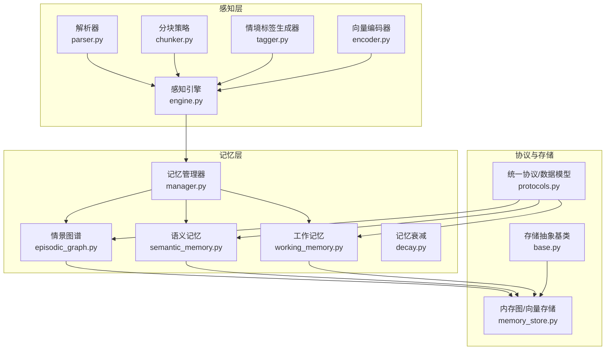
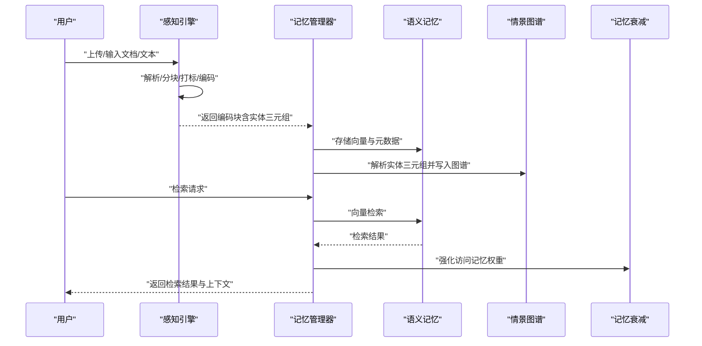
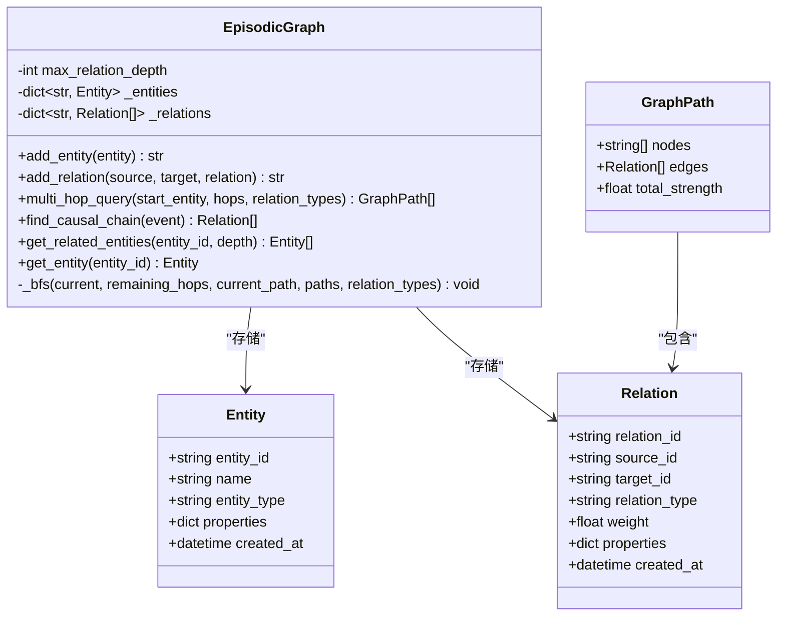
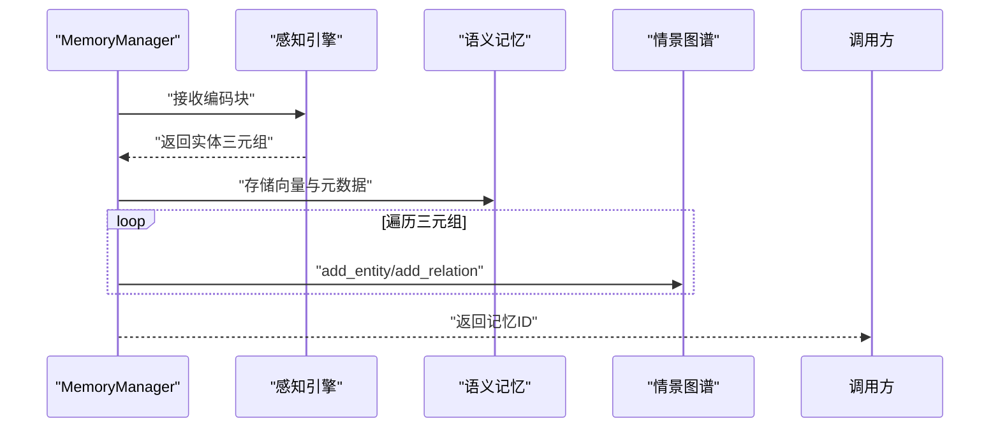
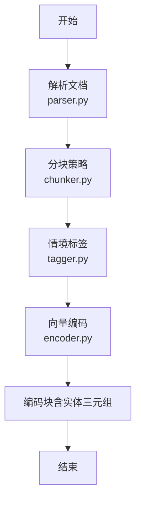
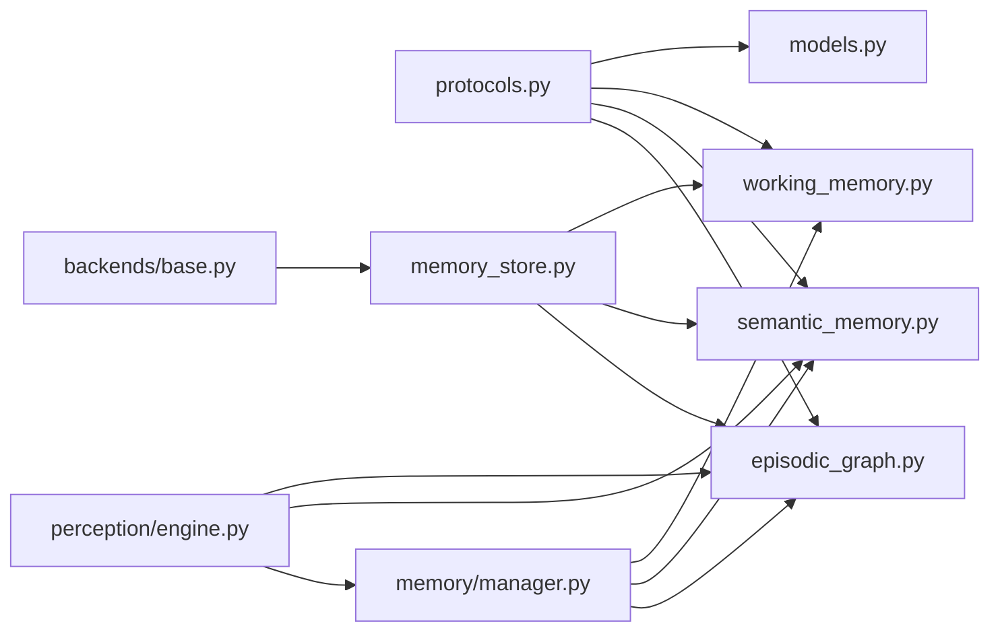

# 情景图谱 (L3)

<cite>
**本文引用的文件**
- [episodic_graph.py](file://src/memory/episodic_graph.py)
- [models.py](file://src/memory/models.py)
- [manager.py](file://src/memory/manager.py)
- [semantic_memory.py](file://src/memory/semantic_memory.py)
- [working_memory.py](file://src/memory/working_memory.py)
- [decay.py](file://src/memory/decay.py)
- [engine.py](file://src/perception/engine.py)
- [chunker.py](file://src/perception/chunker.py)
- [tagger.py](file://src/perception/tagger.py)
- [parser.py](file://src/perception/parser.py)
- [encoder.py](file://src/perception/encoder.py)
- [protocols.py](file://src/core/protocols.py)
- [base.py](file://src/memory/backends/base.py)
- [memory_store.py](file://src/memory/backends/memory_store.py)
</cite>

## 目录
1. [简介](#简介)
2. [项目结构](#项目结构)
3. [核心组件](#核心组件)
4. [架构总览](#架构总览)
5. [详细组件分析](#详细组件分析)
6. [依赖关系分析](#依赖关系分析)
7. [性能考量](#性能考量)
8. [故障排查指南](#故障排查指南)
9. [结论](#结论)
10. [附录](#附录)

## 简介
本文件面向 NecoRAG 的 L3 情景图谱（基于内存的图存储与推理），系统化阐述“关系推理系统”的架构设计与实现要点，覆盖以下关键主题：
- 图数据库的节点与边结构（实体与关系）
- 实体关系建模方法与三元组抽取
- 情景图谱构建流程、实体识别与关系抽取机制
- 图遍历与路径查找算法（BFS/DFS）
- 图查询接口、关系推理能力与性能优化方案
- 具体的图谱构建示例与复杂关系查询的最佳实践

## 项目结构
围绕 L3 情景图谱，核心代码分布在以下模块：
- 记忆层：工作记忆（L1）、语义记忆（L2）、情景图谱（L3）
- 感知层：文档解析、分块策略、情境标签、向量编码与实体抽取
- 协议层：统一的数据模型与枚举（实体、关系、记忆层等）

图表来源
- [engine.py:20-195](file://src/perception/engine.py#L20-L195)
- [manager.py:20-212](file://src/memory/manager.py#L20-L212)
- [episodic_graph.py:10-194](file://src/memory/episodic_graph.py#L10-L194)
- [semantic_memory.py:21-179](file://src/memory/semantic_memory.py#L21-L179)
- [working_memory.py:11-120](file://src/memory/working_memory.py#L11-L120)
- [protocols.py:180-200](file://src/core/protocols.py#L180-L200)
- [base.py:20-314](file://src/memory/backends/base.py#L20-L314)
- [memory_store.py:143-381](file://src/memory/backends/memory_store.py#L143-L381)

章节来源
- [engine.py:20-195](file://src/perception/engine.py#L20-L195)
- [manager.py:20-212](file://src/memory/manager.py#L20-L212)
- [episodic_graph.py:10-194](file://src/memory/episodic_graph.py#L10-L194)
- [semantic_memory.py:21-179](file://src/memory/semantic_memory.py#L21-L179)
- [working_memory.py:11-120](file://src/memory/working_memory.py#L11-L120)
- [protocols.py:180-200](file://src/core/protocols.py#L180-L200)
- [base.py:20-314](file://src/memory/backends/base.py#L20-L314)
- [memory_store.py:143-381](file://src/memory/backends/memory_store.py#L143-L381)

## 核心组件
- 情景图谱 EpisodicGraph：以内存字典与邻接表为核心的数据结构，支持实体添加、关系添加、多跳查询、因果链条追踪、相关实体检索与实体获取。
- 记忆管理器 MemoryManager：统一编排 L1/L2/L3，负责将感知层产出的实体三元组写入 L3 图谱，并协调语义记忆与工作记忆。
- 语义记忆 SemanticMemory：内存向量存储，提供向量检索与混合检索接口（当前为最小实现）。
- 工作记忆 WorkingMemory：内存会话上下文与意图轨迹存储（最小实现）。
- 记忆衰减 MemoryDecay：基于时间与访问频率的权重衰减与归档策略。
- 感知引擎 PerceptionEngine：文档解析、分块、情境标签与向量编码的流水线。
- 存储抽象与内存实现：BaseVectorStore/BaseGraphStore 抽象与 InMemoryVectorStore/InMemoryGraphStore 内存实现。

章节来源
- [episodic_graph.py:10-194](file://src/memory/episodic_graph.py#L10-L194)
- [manager.py:20-212](file://src/memory/manager.py#L20-L212)
- [semantic_memory.py:21-179](file://src/memory/semantic_memory.py#L21-L179)
- [working_memory.py:11-120](file://src/memory/working_memory.py#L11-L120)
- [decay.py:11-155](file://src/memory/decay.py#L11-L155)
- [engine.py:20-195](file://src/perception/engine.py#L20-L195)
- [base.py:61-314](file://src/memory/backends/base.py#L61-L314)
- [memory_store.py:20-381](file://src/memory/backends/memory_store.py#L20-L381)

## 架构总览
情景图谱（L3）在整体系统中的定位与交互如下：

图表来源
- [engine.py:96-154](file://src/perception/engine.py#L96-L154)
- [manager.py:52-123](file://src/memory/manager.py#L52-L123)
- [semantic_memory.py:50-118](file://src/memory/semantic_memory.py#L50-L118)
- [episodic_graph.py:33-113](file://src/memory/episodic_graph.py#L33-L113)
- [decay.py:120-142](file://src/memory/decay.py#L120-L142)

## 详细组件分析

### 情景图谱 EpisodicGraph（L3）
- 数据结构
  - 实体映射：实体 ID → 实体对象
  - 关系邻接：源实体 ID → 关系列表（出边）
- 核心能力
  - 添加实体与关系
  - 多跳查询（BFS，支持关系类型过滤）
  - 因果链条追踪（基于关系类型集合）
  - 相关实体检索（带深度限制的遍历）
  - 实体获取
- 设计要点
  - 使用邻接表组织关系，便于快速遍历与路径查找
  - GraphPath 用于封装路径节点与边序列
  - 提供扩展点（TODO 标记）以接入外部图数据库（Neo4j/NebulaGraph）

图表来源
- [episodic_graph.py:10-194](file://src/memory/episodic_graph.py#L10-L194)
- [models.py:14-43](file://src/memory/models.py#L14-L43)
- [protocols.py:180-200](file://src/core/protocols.py#L180-L200)

章节来源
- [episodic_graph.py:10-194](file://src/memory/episodic_graph.py#L10-L194)
- [models.py:28-43](file://src/memory/models.py#L28-L43)
- [protocols.py:180-200](file://src/core/protocols.py#L180-L200)

### 记忆管理器 MemoryManager（统一编排）
- 职责
  - 将感知层的编码块写入 L2 语义记忆与 L3 情景图谱
  - 统一检索与衰减控制
- 关键流程
  - 存储：创建 MemoryItem，写入语义向量，解析实体三元组并写入图谱
  - 检索：向量检索并强化访问记忆权重
  - 巩固/遗忘：应用衰减、归档低权重记忆

图表来源
- [manager.py:52-123](file://src/memory/manager.py#L52-L123)
- [semantic_memory.py:50-78](file://src/memory/semantic_memory.py#L50-L78)
- [episodic_graph.py:33-113](file://src/memory/episodic_graph.py#L33-L113)

章节来源
- [manager.py:52-123](file://src/memory/manager.py#L52-L123)
- [semantic_memory.py:50-78](file://src/memory/semantic_memory.py#L50-L78)
- [episodic_graph.py:33-113](file://src/memory/episodic_graph.py#L33-L113)

### 语义记忆 SemanticMemory（L2）
- 能力
  - 存储向量与元数据
  - 向量检索（余弦相似度）
  - 混合检索接口（预留）
- 设计
  - 内存字典模拟向量数据库
  - 提供元数据更新与删除

章节来源
- [semantic_memory.py:21-179](file://src/memory/semantic_memory.py#L21-L179)

### 工作记忆 WorkingMemory（L1）
- 能力
  - 会话上下文存储与获取
  - 用户意图轨迹跟踪
  - 会话清理与存在性检查
- 设计
  - 内存字典模拟 Redis 行为（最小实现）

章节来源
- [working_memory.py:11-120](file://src/memory/working_memory.py#L11-L120)

### 记忆衰减 MemoryDecay
- 能力
  - 权重衰减计算（指数衰减 × 访问频率）
  - 批量应用衰减
  - 归档低权重记忆
  - 强化访问记忆
- 设计
  - 可配置衰减速率与归档阈值

章节来源
- [decay.py:11-155](file://src/memory/decay.py#L11-L155)

### 感知引擎 PerceptionEngine 与数据管线
- 能力
  - 文档解析、分块、情境标签、向量编码
  - 统一处理入口（文件/文本）
- 关键点
  - 分块策略支持弹性/语义/固定/结构化/句子级
  - 情境标签包含时间、情感、重要性、主题
  - 向量编码同时产出稠密向量、稀疏向量与实体三元组

图表来源
- [engine.py:77-154](file://src/perception/engine.py#L77-L154)
- [parser.py:28-60](file://src/perception/parser.py#L28-L60)
- [chunker.py:49-85](file://src/perception/chunker.py#L49-L85)
- [tagger.py:33-66](file://src/perception/tagger.py#L33-L66)
- [encoder.py:73-87](file://src/perception/encoder.py#L73-L87)

章节来源
- [engine.py:20-195](file://src/perception/engine.py#L20-L195)
- [parser.py:12-113](file://src/perception/parser.py#L12-L113)
- [chunker.py:12-567](file://src/perception/chunker.py#L12-L567)
- [tagger.py:11-163](file://src/perception/tagger.py#L11-L163)
- [encoder.py:25-255](file://src/perception/encoder.py#L25-L255)

### 存储抽象与内存实现
- 抽象基类
  - BaseVectorStore：upsert/search/get/delete/count
  - BaseGraphStore：add_node/add_edge/get_node/get_neighbors/traverse/find_path/delete_node/delete_edge/node_count/edge_count/search_nodes
- 内存实现
  - InMemoryVectorStore：余弦相似度、元数据过滤、阈值筛选
  - InMemoryGraphStore：邻接表、BFS 遍历、BFS 路径查找、节点/边增删

章节来源
- [base.py:61-314](file://src/memory/backends/base.py#L61-L314)
- [memory_store.py:20-381](file://src/memory/backends/memory_store.py#L20-L381)

## 依赖关系分析
- 模块耦合
  - MemoryManager 依赖感知层产物（EncodedChunk）与三层记忆组件
  - EpisodicGraph 依赖统一协议层的 Entity/Relation/GraphPath
  - SemanticMemory/WorkingMemory 依赖 MemoryItem/协议层枚举
  - 感知层各组件通过统一模型（Chunk/EncodedChunk/ContextTag）解耦
- 外部依赖
  - 可插拔 LLM 客户端（Mock 实现可用）
  - 存储层可替换（当前为内存实现，抽象清晰）

图表来源
- [protocols.py:180-200](file://src/core/protocols.py#L180-L200)
- [models.py:14-43](file://src/memory/models.py#L14-L43)
- [engine.py:20-195](file://src/perception/engine.py#L20-L195)
- [manager.py:20-212](file://src/memory/manager.py#L20-L212)
- [episodic_graph.py:10-194](file://src/memory/episodic_graph.py#L10-L194)
- [semantic_memory.py:21-179](file://src/memory/semantic_memory.py#L21-L179)
- [working_memory.py:11-120](file://src/memory/working_memory.py#L11-L120)
- [base.py:61-314](file://src/memory/backends/base.py#L61-L314)
- [memory_store.py:143-381](file://src/memory/backends/memory_store.py#L143-L381)

章节来源
- [protocols.py:180-200](file://src/core/protocols.py#L180-L200)
- [models.py:14-43](file://src/memory/models.py#L14-L43)
- [engine.py:20-195](file://src/perception/engine.py#L20-L195)
- [manager.py:20-212](file://src/memory/manager.py#L20-L212)
- [episodic_graph.py:10-194](file://src/memory/episodic_graph.py#L10-L194)
- [semantic_memory.py:21-179](file://src/memory/semantic_memory.py#L21-L179)
- [working_memory.py:11-120](file://src/memory/working_memory.py#L11-L120)
- [base.py:61-314](file://src/memory/backends/base.py#L61-L314)
- [memory_store.py:143-381](file://src/memory/backends/memory_store.py#L143-L381)

## 性能考量
- 存储层
  - 内存向量/图存储适合小规模与开发测试；生产建议接入外部向量库（如 Qdrant/Milvus）与图数据库（Neo4j/NebulaGraph），以获得更高吞吐与持久化能力。
- 检索与遍历
  - 向量检索采用余弦相似度，建议在大规模场景引入近似最近邻索引（如 HNSW）与向量压缩技术。
  - 图遍历与路径查找采用 BFS，建议设置最大深度与剪枝策略，避免组合爆炸。
- 记忆衰减
  - 衰减与强化策略可降低无效检索开销，提升热点知识召回效率。
- 分块与标签
  - 弹性分块与语义边界有助于提升检索质量；建议结合领域特征调整边界优先级与重叠策略。

## 故障排查指南
- 图谱构建异常
  - 检查实体三元组是否正确生成（编码器实体抽取规则较为简单，必要时接入更强的 NLP 模块）。
  - 确认实体 ID 唯一性与关系方向（source/target）。
- 检索结果为空
  - 检查向量维度与查询向量维度一致。
  - 调整相似度阈值与 top_k。
- 图遍历/路径查找超时
  - 降低最大深度或增加关系类型过滤。
  - 对大型图谱考虑索引与缓存策略。
- 记忆归档过多
  - 调整衰减速率与归档阈值，或减少强化因子。

章节来源
- [semantic_memory.py:80-118](file://src/memory/semantic_memory.py#L80-L118)
- [memory_store.py:55-91](file://src/memory/backends/memory_store.py#L55-L91)
- [episodic_graph.py:71-125](file://src/memory/episodic_graph.py#L71-L125)
- [memory_store.py:215-278](file://src/memory/backends/memory_store.py#L215-L278)
- [decay.py:96-118](file://src/memory/decay.py#L96-L118)

## 结论
NecoRAG 的 L3 情景图谱以“内存图存储 + 统一协议 + 分层记忆”为核心，实现了从感知到记忆再到推理的闭环。其优势在于：
- 明确的三层记忆分工与统一协议，便于扩展与替换存储后端
- 清晰的实体关系建模与图遍历算法，满足多跳推理与因果链条追踪
- 可插拔的感知与存储实现，兼顾开发效率与生产可用性

建议后续重点：
- 接入外部图数据库与向量库，提升可扩展性
- 增强实体抽取与关系抽取的准确性与领域适配
- 引入图索引与缓存策略，优化大规模图谱的查询性能

## 附录

### 图谱构建示例（步骤说明）
- 输入：一段文本或解析后的文档
- 步骤：
  1) 文档解析与分块
  2) 情境标签生成
  3) 向量编码（稠密/稀疏）
  4) 实体三元组抽取
  5) 写入语义记忆（L2）
  6) 写入情景图谱（L3）：添加实体与关系
- 输出：可检索的向量与可推理的图谱

章节来源
- [engine.py:96-154](file://src/perception/engine.py#L96-L154)
- [manager.py:83-113](file://src/memory/manager.py#L83-L113)
- [semantic_memory.py:50-78](file://src/memory/semantic_memory.py#L50-L78)
- [episodic_graph.py:33-113](file://src/memory/episodic_graph.py#L33-L113)

### 复杂关系查询最佳实践
- 多跳查询
  - 明确起始实体与跳数上限，按需过滤关系类型
  - 对路径结果进行强度聚合与去重
- 因果链条
  - 基于预定义关系类型集合（如 causes/leads_to/results_in）进行追踪
  - 结合时间标签与上下文标签，提升因果链可信度
- 图遍历
  - 设置最大深度与访问去重，避免无限循环
  - 按方向（入边/出边/双向）与边类型过滤，缩小搜索空间

章节来源
- [episodic_graph.py:71-147](file://src/memory/episodic_graph.py#L71-L147)
- [memory_store.py:215-246](file://src/memory/backends/memory_store.py#L215-L246)