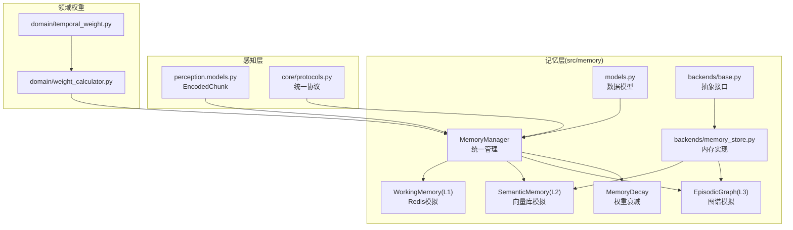
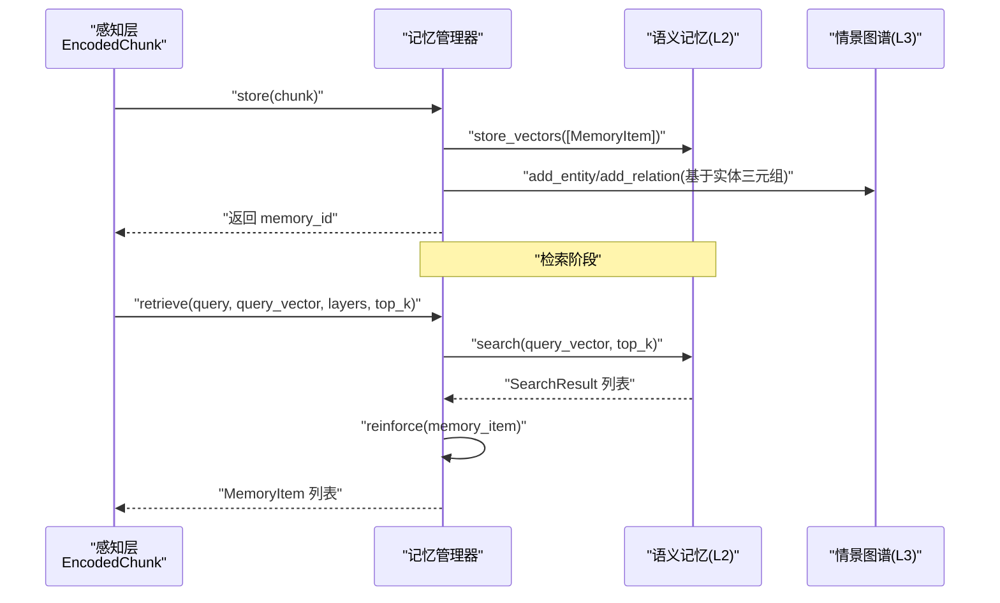
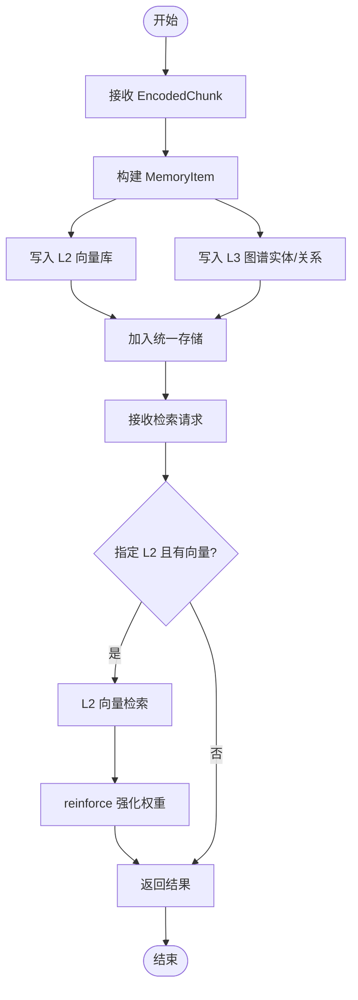
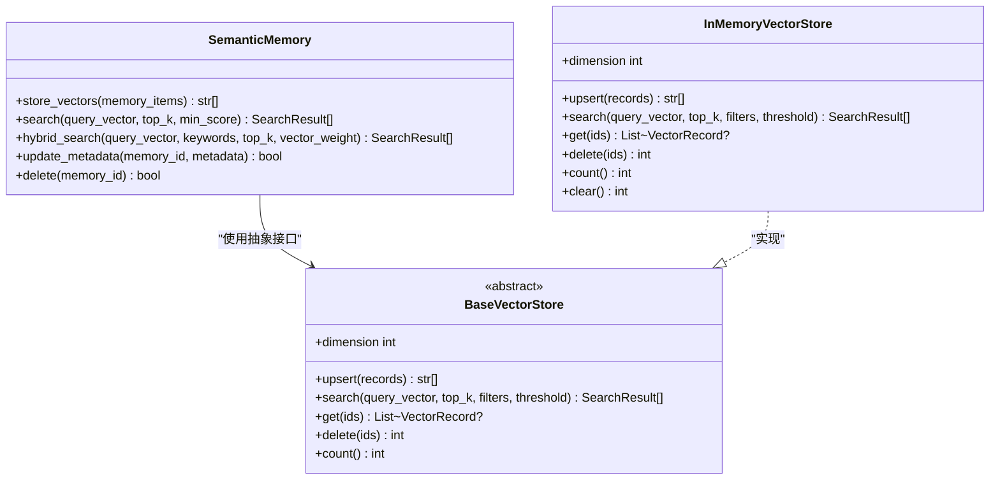
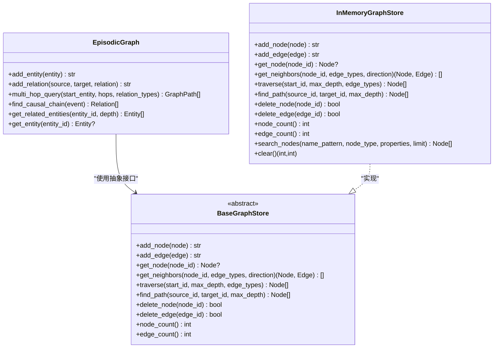
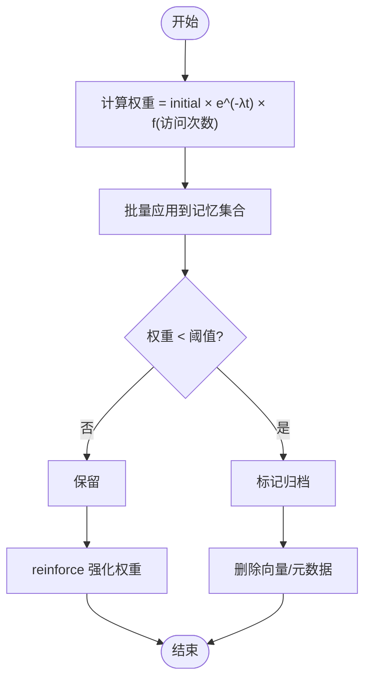
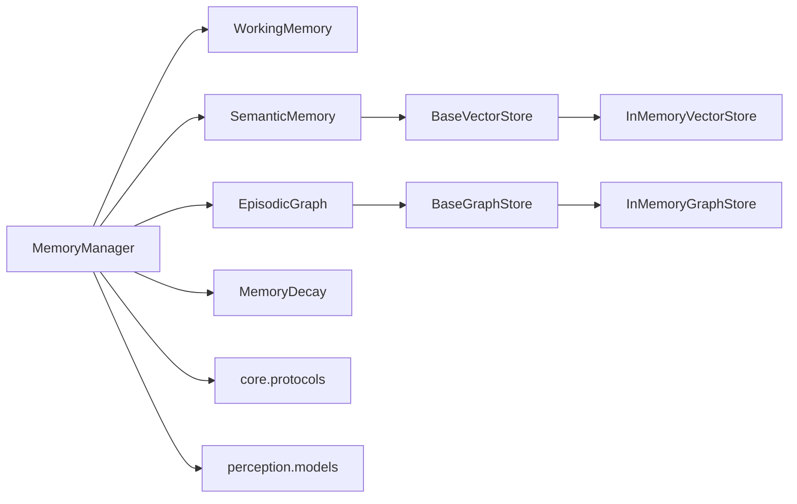

# 记忆层 (L2)

<cite>
**本文引用的文件**
- [src/memory/__init__.py](file://src/memory/__init__.py)
- [src/memory/manager.py](file://src/memory/manager.py)
- [src/memory/models.py](file://src/memory/models.py)
- [src/memory/semantic_memory.py](file://src/memory/semantic_memory.py)
- [src/memory/working_memory.py](file://src/memory/working_memory.py)
- [src/memory/episodic_graph.py](file://src/memory/episodic_graph.py)
- [src/memory/decay.py](file://src/memory/decay.py)
- [src/memory/backends/base.py](file://src/memory/backends/base.py)
- [src/memory/backends/memory_store.py](file://src/memory/backends/memory_store.py)
- [src/core/protocols.py](file://src/core/protocols.py)
- [src/perception/models.py](file://src/perception/models.py)
- [src/domain/weight_calculator.py](file://src/domain/weight_calculator.py)
- [src/domain/temporal_weight.py](file://src/domain/temporal_weight.py)
- [src/memory/README.md](file://src/memory/README.md)
- [example/example_usage.py](file://example/example_usage.py)
- [example/domain_weight_example.py](file://example/domain_weight_example.py)
</cite>

## 目录
1. [简介](#简介)
2. [项目结构](#项目结构)
3. [核心组件](#核心组件)
4. [架构总览](#架构总览)
5. [详细组件分析](#详细组件分析)
6. [依赖分析](#依赖分析)
7. [性能考虑](#性能考虑)
8. [故障排查指南](#故障排查指南)
9. [结论](#结论)
10. [附录](#附录)

## 简介
本文件聚焦 NecoRAG 记忆层（L2）的完整设计与实现，围绕三层记忆架构中的 L2 语义记忆展开，系统阐述其数据模型、检索接口、与上层感知与下层图谱的协作关系，以及动态权重衰减机制如何模拟人类记忆的巩固与遗忘。同时给出性能调优建议、使用示例与最佳实践。

## 项目结构
记忆层位于 src/memory 目录，包含管理器、L1/L2/L3 三类记忆实现、衰减机制、以及与感知层的统一数据协议。backends 提供抽象接口与内存实现，便于替换为真实外部存储（Redis/Qdrant/Neo4j 等）。

**图表来源**
- [src/memory/manager.py:20-212](file://src/memory/manager.py#L20-L212)
- [src/memory/working_memory.py:11-120](file://src/memory/working_memory.py#L11-L120)
- [src/memory/semantic_memory.py:21-179](file://src/memory/semantic_memory.py#L21-L179)
- [src/memory/episodic_graph.py:10-194](file://src/memory/episodic_graph.py#L10-L194)
- [src/memory/decay.py:11-155](file://src/memory/decay.py#L11-L155)
- [src/memory/models.py:14-43](file://src/memory/models.py#L14-L43)
- [src/memory/backends/base.py:61-314](file://src/memory/backends/base.py#L61-L314)
- [src/memory/backends/memory_store.py:20-381](file://src/memory/backends/memory_store.py#L20-L381)
- [src/perception/models.py:14-62](file://src/perception/models.py#L14-L62)
- [src/core/protocols.py:36-200](file://src/core/protocols.py#L36-L200)
- [src/domain/weight_calculator.py:56-318](file://src/domain/weight_calculator.py#L56-L318)
- [src/domain/temporal_weight.py:47-271](file://src/domain/temporal_weight.py#L47-L271)

**章节来源**
- [src/memory/README.md:1-244](file://src/memory/README.md#L1-L244)
- [src/memory/__init__.py:1-29](file://src/memory/__init__.py#L1-L29)

## 核心组件
- 记忆管理器 MemoryManager：统一编排 L1/L2/L3，协调存储、检索、巩固与遗忘。
- L1 工作记忆 WorkingMemory：会话上下文与意图轨迹的高速缓存（模拟 Redis）。
- L2 语义记忆 SemanticMemory：向量检索与元数据管理（模拟 Qdrant/Milvus）。
- L3 情景图谱 EpisodicGraph：实体关系网络与多跳推理（模拟 Neo4j/NebulaGraph）。
- 动态权重衰减 MemoryDecay：基于时间与访问频率的权重计算与归档。
- 数据模型与协议：MemoryItem、Entity/Relation、MemoryLayer 等统一类型。
- 后端抽象与内存实现：BaseVectorStore/BaseGraphStore 与 InMemoryVectorStore/InMemoryGraphStore。
- 领域权重系统：关键字、时间、领域相关性的综合加权与重排序。

**章节来源**
- [src/memory/manager.py:20-212](file://src/memory/manager.py#L20-L212)
- [src/memory/working_memory.py:11-120](file://src/memory/working_memory.py#L11-L120)
- [src/memory/semantic_memory.py:21-179](file://src/memory/semantic_memory.py#L21-L179)
- [src/memory/episodic_graph.py:10-194](file://src/memory/episodic_graph.py#L10-L194)
- [src/memory/decay.py:11-155](file://src/memory/decay.py#L11-L155)
- [src/memory/models.py:14-43](file://src/memory/models.py#L14-L43)
- [src/memory/backends/base.py:61-314](file://src/memory/backends/base.py#L61-L314)
- [src/memory/backends/memory_store.py:20-381](file://src/memory/backends/memory_store.py#L20-L381)
- [src/core/protocols.py:36-200](file://src/core/protocols.py#L36-L200)
- [src/domain/weight_calculator.py:56-318](file://src/domain/weight_calculator.py#L56-L318)
- [src/domain/temporal_weight.py:47-271](file://src/domain/temporal_weight.py#L47-L271)

## 架构总览
L2 语义记忆作为“模糊匹配与直觉检索”的中枢，接收感知层编码后的 EncodedChunk，提取稠密向量与元数据，写入向量存储；同时从实体三元组构建图谱实体与关系，形成结构化知识的补充。检索阶段，MemoryManager 将查询向量交由 L2 进行相似性搜索，结合访问次数强化权重，再返回统一的 MemoryItem 列表。

**图表来源**
- [src/memory/manager.py:52-159](file://src/memory/manager.py#L52-L159)
- [src/memory/semantic_memory.py:50-118](file://src/memory/semantic_memory.py#L50-L118)
- [src/memory/episodic_graph.py:33-69](file://src/memory/episodic_graph.py#L33-L69)
- [src/memory/decay.py:120-142](file://src/memory/decay.py#L120-L142)
- [src/perception/models.py:14-62](file://src/perception/models.py#L14-L62)

## 详细组件分析

### 记忆管理器（协调 L1/L2/L3）
- 职责：初始化各层、统一存储、跨层检索、巩固与遗忘。
- 存储流程：将 EncodedChunk 转为 MemoryItem，写入 L2 向量库；根据实体三元组写入 L3 图谱；维护统一内存字典以支持跨层检索与权重强化。
- 检索流程：当指定 L2 且提供查询向量时，调用 L2 向量检索，命中后通过 MemoryDecay.reinforce 强化权重，再合并返回。
- 巩固与遗忘：应用衰减、识别低权重并归档删除，支持主动遗忘阈值控制。

**图表来源**
- [src/memory/manager.py:52-159](file://src/memory/manager.py#L52-L159)
- [src/memory/semantic_memory.py:80-118](file://src/memory/semantic_memory.py#L80-L118)
- [src/memory/decay.py:120-142](file://src/memory/decay.py#L120-L142)

**章节来源**
- [src/memory/manager.py:20-212](file://src/memory/manager.py#L20-L212)

### L1 工作记忆（Redis 模拟）
- 特性：会话上下文、意图轨迹、TTL 过期、LRU 淘汰（当前为内存模拟，未实现 TTL）。
- 接口：添加/获取上下文、跟踪意图、清除会话、检查存在性。
- 设计要点：与 L2/L3 解耦，仅承载瞬时上下文，避免长期内存压力。

**章节来源**
- [src/memory/working_memory.py:11-120](file://src/memory/working_memory.py#L11-L120)

### L2 语义记忆（向量库模拟）
- 存储：内存字典保存向量与元数据，支持批量写入。
- 检索：余弦相似度计算，返回带分数的 SearchResult 列表，支持最小分数过滤与 top_k 截断。
- 混合检索：预留接口（当前最小实现为纯向量检索）。
- 元数据更新与删除：按 memory_id 更新/删除。
- 后端抽象：BaseVectorStore 定义 upsert/search/get/delete/count/dimension 等接口；InMemoryVectorStore 提供内存实现。

**图表来源**
- [src/memory/semantic_memory.py:21-179](file://src/memory/semantic_memory.py#L21-L179)
- [src/memory/backends/base.py:61-148](file://src/memory/backends/base.py#L61-L148)
- [src/memory/backends/memory_store.py:20-141](file://src/memory/backends/memory_store.py#L20-L141)

**章节来源**
- [src/memory/semantic_memory.py:21-179](file://src/memory/semantic_memory.py#L21-L179)
- [src/memory/backends/base.py:61-148](file://src/memory/backends/base.py#L61-L148)
- [src/memory/backends/memory_store.py:20-141](file://src/memory/backends/memory_store.py#L20-L141)

### L3 情景图谱（图谱模拟）
- 存储：内存字典保存实体与邻接关系，支持节点与边的增删查改。
- 查询：BFS 多跳查询、因果关系链查找、相关实体发现。
- 设计要点：为后续集成 Neo4j/NebulaGraph 做准备，当前以邻接表与简单遍历实现。

**图表来源**
- [src/memory/episodic_graph.py:10-194](file://src/memory/episodic_graph.py#L10-L194)
- [src/memory/backends/base.py:150-314](file://src/memory/backends/base.py#L150-L314)
- [src/memory/backends/memory_store.py:143-381](file://src/memory/backends/memory_store.py#L143-L381)

**章节来源**
- [src/memory/episodic_graph.py:10-194](file://src/memory/episodic_graph.py#L10-L194)
- [src/memory/backends/base.py:150-314](file://src/memory/backends/base.py#L150-L314)
- [src/memory/backends/memory_store.py:143-381](file://src/memory/backends/memory_store.py#L143-L381)

### 动态权重衰减（模拟人类记忆）
- 权重公式：initial_weight × e^(-λt) × log10(access_count+1)，并限制最大权重。
- 功能：批量衰减、识别低权重归档、强化访问记忆、判断是否归档。
- 与检索联动：L2 检索命中后通过 reinforce 强化权重，提升后续命中概率。

**图表来源**
- [src/memory/decay.py:39-142](file://src/memory/decay.py#L39-L142)

**章节来源**
- [src/memory/decay.py:11-155](file://src/memory/decay.py#L11-L155)

### 数据模型与协议
- MemoryItem：统一记忆条目，含 content、layer、vector、metadata、权重与访问统计。
- Entity/Relation：图谱实体与关系，支持属性与权重。
- MemoryLayer：枚举 L1/L2/L3。
- EncodedChunk：感知层输出，包含稠密/稀疏向量、实体三元组、上下文标签等。

**章节来源**
- [src/memory/models.py:14-43](file://src/memory/models.py#L14-L43)
- [src/core/protocols.py:36-200](file://src/core/protocols.py#L36-L200)
- [src/perception/models.py:14-62](file://src/perception/models.py#L14-L62)

### 领域权重与时间衰减（与 L2 检索的协同）
- 综合权重计算器：整合关键字相关性、时间衰减、领域权重与自定义权重，计算最终分数并支持重排序。
- 时间权重计算器：按时间层级与指数衰减计算权重，支持快速变化/正常/缓慢变化/常青等预设。
- 使用场景：在 L2 检索后，可用领域权重进一步重排序，提升相关性与时效性。

**章节来源**
- [src/domain/weight_calculator.py:56-318](file://src/domain/weight_calculator.py#L56-L318)
- [src/domain/temporal_weight.py:47-271](file://src/domain/temporal_weight.py#L47-L271)

## 依赖分析
- 组件耦合：MemoryManager 对 L1/L2/L3 为组合关系；L2/L3 通过抽象接口与内存实现解耦。
- 外部依赖：当前以内存实现为主，预留替换为 Redis/Qdrant/Neo4j 的扩展点。
- 协议一致性：统一使用 core.protocols 的 MemoryLayer、Entity、Relation 等类型，确保跨模块数据交换一致。

**图表来源**
- [src/memory/manager.py:9-13](file://src/memory/manager.py#L9-L13)
- [src/memory/backends/base.py:61-314](file://src/memory/backends/base.py#L61-L314)
- [src/memory/backends/memory_store.py:13-17](file://src/memory/backends/memory_store.py#L13-L17)
- [src/core/protocols.py:36-200](file://src/core/protocols.py#L36-L200)
- [src/perception/models.py:11-11](file://src/perception/models.py#L11-L11)

**章节来源**
- [src/memory/manager.py:9-13](file://src/memory/manager.py#L9-L13)
- [src/memory/backends/base.py:61-314](file://src/memory/backends/base.py#L61-L314)
- [src/memory/backends/memory_store.py:13-17](file://src/memory/backends/memory_store.py#L13-L17)
- [src/core/protocols.py:36-200](file://src/core/protocols.py#L36-L200)
- [src/perception/models.py:11-11](file://src/perception/models.py#L11-L11)

## 性能考虑
- L1：内存字典模拟，读写 O(1)；建议在生产环境接入 Redis，开启 TTL 与淘汰策略，控制单会话条目上限。
- L2：当前内存实现相似度计算为 O(n×d)，适合中小规模；建议集成 Qdrant/Milvus，启用 HNSW 索引与向量压缩，按需设置 top_k 与过滤条件。
- L3：邻接表 + BFS/DFS，复杂度取决于图规模；建议在生产环境接入 Neo4j，使用 Cypher 查询与索引优化。
- 衰减与归档：定期 consolidate，批量 apply_decay，降低无效数据占用；合理设置 archive_threshold 与 decay_rate。
- 领域权重：在 L2 检索后进行 rerank，注意计算成本与排序开销。

[本节为通用性能建议，不直接分析具体文件]

## 故障排查指南
- 存储失败：检查 EncodedChunk 的向量维度与元数据完整性；确认 MemoryManager._memory_store 正常写入。
- 检索无结果：确认 query_vector 非空且与 L2 维度一致；检查最小分数阈值与 top_k 设置。
- 图谱查询异常：确认实体 ID 与关系类型正确；检查 BFS 深度限制与关系类型过滤。
- 权重异常：核对 created_at、access_count 与 decay_rate；必要时调低 archive_threshold 或提高 reinforce boost_factor。
- 领域权重不生效：确认 DomainConfig 与权重因子配置；检查是否在检索后进行了 rerank。

**章节来源**
- [src/memory/manager.py:52-123](file://src/memory/manager.py#L52-L123)
- [src/memory/semantic_memory.py:80-118](file://src/memory/semantic_memory.py#L80-L118)
- [src/memory/episodic_graph.py:71-126](file://src/memory/episodic_graph.py#L71-L126)
- [src/memory/decay.py:96-142](file://src/memory/decay.py#L96-L142)
- [src/domain/weight_calculator.py:81-146](file://src/domain/weight_calculator.py#L81-L146)

## 结论
L2 语义记忆通过向量检索与元数据管理，实现了对知识的模糊匹配与直觉检索；配合动态权重衰减机制，模拟人类记忆的巩固与遗忘，提升长期知识的有效性与稳定性。通过抽象接口与内存实现，系统具备良好的扩展性，可平滑迁移到 Redis/Qdrant/Neo4j 等生产级存储。结合领域权重与时间衰减，可在检索后进一步提升相关性与时效性。

[本节为总结性内容，不直接分析具体文件]

## 附录

### 使用示例与最佳实践
- 完整流程示例：从感知编码到记忆存储、检索、巩固与响应生成的端到端演示。
- 领域权重示例：展示如何配置领域、计算时间权重、相关性评分与综合加权重排序。
- 最佳实践：
  - L1：仅存放会话上下文与短期意图，设置合理 TTL 与最大条目。
  - L2：使用高质量向量模型，合理设置 top_k 与过滤条件；定期 consolidate。
  - L3：规范实体命名与关系类型，限制多跳深度，使用索引优化查询。
  - 权重：根据业务调整 decay_rate 与 archive_threshold；在检索后进行 rerank。

**章节来源**
- [example/example_usage.py:12-252](file://example/example_usage.py#L12-L252)
- [example/domain_weight_example.py:22-267](file://example/domain_weight_example.py#L22-L267)