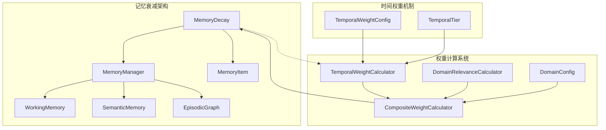
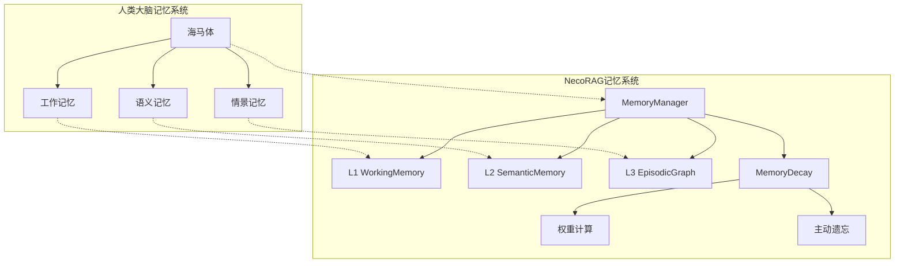
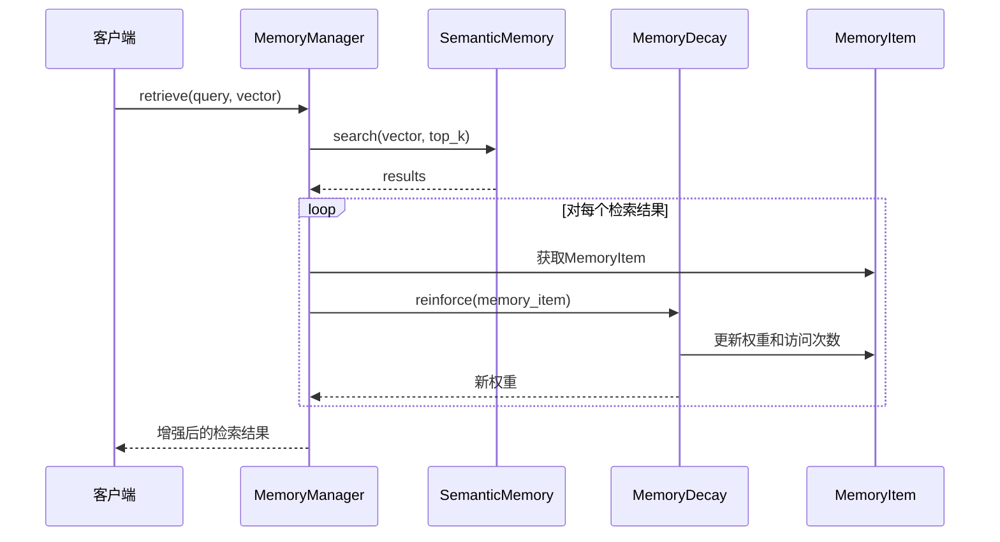
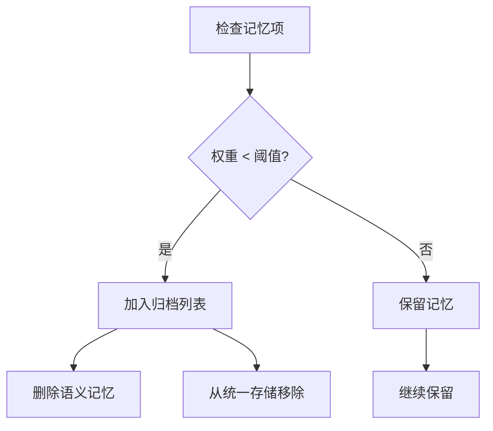
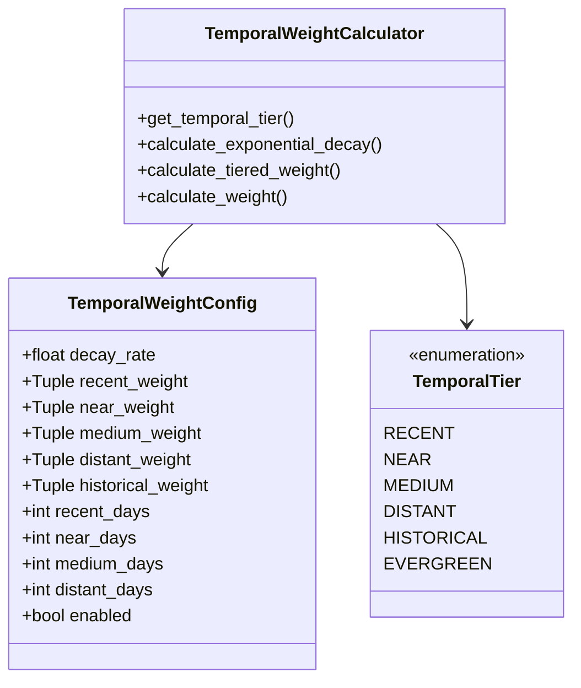
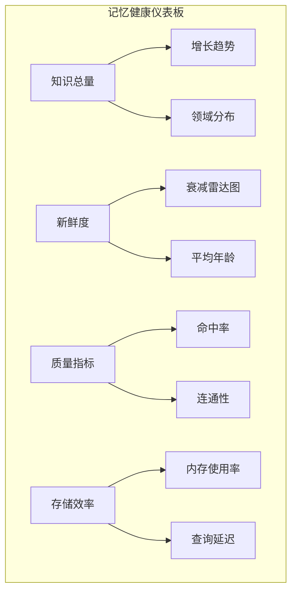
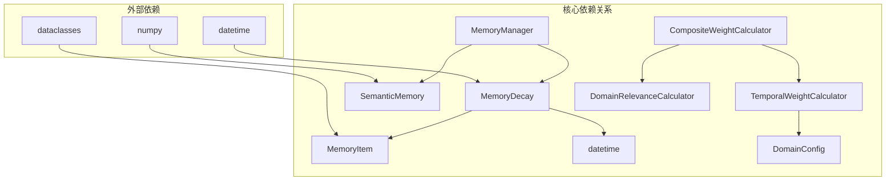
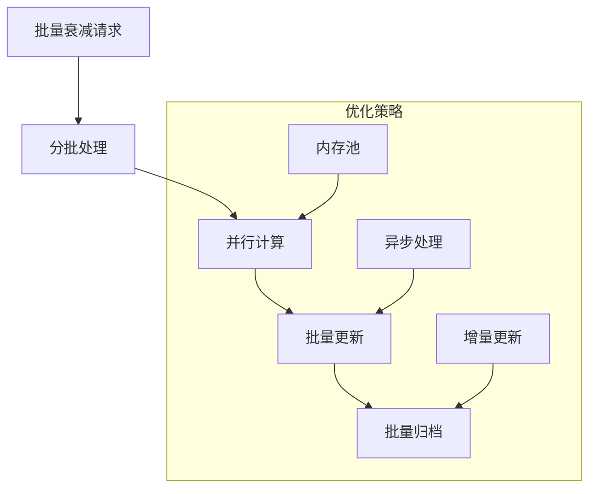

# 记忆衰减机制

<cite>
**本文档引用的文件**
- [src/memory/decay.py](file://src/memory/decay.py)
- [src/memory/manager.py](file://src/memory/manager.py)
- [src/memory/models.py](file://src/memory/models.py)
- [src/domain/temporal_weight.py](file://src/domain/temporal_weight.py)
- [src/domain/weight_calculator.py](file://src/domain/weight_calculator.py)
- [src/domain/config.py](file://src/domain/config.py)
- [src/domain/relevance.py](file://src/domain/relevance.py)
- [design/design.md](file://design/design.md)
- [tests/test_memory/test_decay.py](file://tests/test_memory/test_decay.py)
</cite>

## 目录
1. [简介](#简介)
2. [项目结构](#项目结构)
3. [核心组件](#核心组件)
4. [架构概览](#架构概览)
5. [详细组件分析](#详细组件分析)
6. [依赖关系分析](#依赖关系分析)
7. [性能考量](#性能考量)
8. [故障排除指南](#故障排除指南)
9. [结论](#结论)

## 简介

NecoRAG的记忆衰减机制是模拟人类大脑记忆巩固和遗忘过程的核心组件。该机制借鉴了认知科学理论，实现了基于时间的指数衰减、访问频率强化、以及主动遗忘的完整记忆管理系统。

记忆衰减机制的设计理念源于海马体在记忆形成中的核心作用，通过模拟人类大脑的记忆四阶段模型（编码→存储→巩固→检索），为NecoRAG提供了智能化的记忆管理能力。

## 项目结构

NecoRAG的记忆衰减机制分布在多个核心模块中，形成了完整的记忆管理体系：



**图表来源**
- [src/memory/decay.py:11-155](file://src/memory/decay.py#L11-L155)
- [src/memory/manager.py:20-212](file://src/memory/manager.py#L20-L212)
- [src/domain/weight_calculator.py:56-223](file://src/domain/weight_calculator.py#L56-L223)

**章节来源**
- [src/memory/decay.py:1-155](file://src/memory/decay.py#L1-L155)
- [src/memory/manager.py:1-212](file://src/memory/manager.py#L1-L212)
- [src/domain/weight_calculator.py:1-318](file://src/domain/weight_calculator.py#L1-L318)

## 核心组件

### MemoryDecay类

MemoryDecay是记忆衰减机制的核心实现，提供了完整的权重计算、衰减应用和主动遗忘功能。

**主要功能特性：**
- **指数衰减计算**：基于时间的指数衰减模型
- **访问频率强化**：通过log10(1 + 访问次数)因子增强高频访问记忆
- **批量衰减应用**：支持对大量记忆项进行批量权重更新
- **主动遗忘**：根据阈值自动识别并归档低价值记忆

**数学模型：**
```
weight(t) = initial_weight × e^(-λt) × access_frequency
access_frequency = 1 + log10(1 + access_count)
```

其中：
- λ：衰减系数（天级）
- t：距离创建时间的天数
- access_count：累计访问次数

**章节来源**
- [src/memory/decay.py:11-155](file://src/memory/decay.py#L11-L155)

### MemoryItem数据模型

MemoryItem是记忆的基本数据结构，包含了衰减机制所需的所有关键字段。

**核心字段：**
- `memory_id`：记忆唯一标识符
- `weight`：当前权重值（1.0为初始值）
- `access_count`：累计访问次数
- `created_at`：创建时间
- `last_accessed`：最后访问时间

**章节来源**
- [src/memory/models.py:14-26](file://src/memory/models.py#L14-L26)

### MemoryManager协调器

MemoryManager作为记忆系统的协调器，负责在整个系统中集成和应用记忆衰减机制。

**主要职责：**
- 统一管理三层记忆（工作记忆、语义记忆、情景图谱）
- 在检索过程中强化高频访问的记忆
- 执行定期的记忆巩固和主动遗忘
- 维护记忆项的生命周期管理

**章节来源**
- [src/memory/manager.py:20-212](file://src/memory/manager.py#L20-L212)

## 架构概览

NecoRAG的记忆衰减机制采用了多层次的架构设计，模拟人类大脑的记忆系统：



**图表来源**
- [design/design.md:32-215](file://design/design.md#L32-L215)
- [src/memory/manager.py:20-51](file://src/memory/manager.py#L20-L51)

### 时间权重计算系统

除了MemoryDecay的实时衰减外，NecoRAG还实现了基于时间的权重计算系统，提供了更精细的时间衰减控制：

```mermaid
flowchart TD
A[文档时间] --> B[时间层级判断]
B --> C{时间范围}
C --> |最近期| D[1.0-1.2]
C --> |近期| E[0.8-1.0]
C --> |中期| F[0.5-0.8]
C --> |远期| G[0.3-0.5]
C --> |历史| H[0.1-0.3]
C --> |常青| I[1.0]
J[指数衰减] --> K[e^(-λ×days)]
L[分层权重] --> M[线性插值]
N[混合方法] --> O[(分层+指数)/2]
```

**图表来源**
- [src/domain/temporal_weight.py:47-195](file://src/domain/temporal_weight.py#L47-L195)

**章节来源**
- [src/domain/temporal_weight.py:1-271](file://src/domain/temporal_weight.py#L1-L271)

## 详细组件分析

### 衰减算法数学模型

NecoRAG的记忆衰减算法基于严格的数学模型，模拟人类记忆的自然衰减过程：

#### 基础衰减模型

**指数衰减公式：**
```
W(t) = W₀ × e^(-λt)
```

其中：
- W(t)：时间t时的权重
- W₀：初始权重（默认1.0）
- λ：衰减系数（天级）
- t：距离创建时间的天数

**访问频率强化因子：**
```
frequency_factor = 1 + log₁₀(1 + access_count)
```

#### 综合权重计算

MemoryManager在检索过程中会应用综合权重计算：



**图表来源**
- [src/memory/manager.py:124-159](file://src/memory/manager.py#L124-L159)
- [src/memory/decay.py:120-142](file://src/memory/decay.py#L120-L142)

**章节来源**
- [src/memory/decay.py:39-70](file://src/memory/decay.py#L39-L70)

### 主动遗忘触发条件

主动遗忘是记忆衰减机制的重要组成部分，通过设定阈值来识别和归档低价值记忆：

#### 归档阈值判断



**图表来源**
- [src/memory/decay.py:96-118](file://src/memory/decay.py#L96-L118)
- [src/memory/manager.py:161-182](file://src/memory/manager.py#L161-L182)

#### 阈值参数调优

| 阈值范围 | 记忆保留策略 | 适用场景 |
|---------|-------------|----------|
| 0.0-0.1 | 极度保守 | 高价值知识库，如法律条文 |
| 0.1-0.3 | 适度保守 | 一般知识库，平衡保留与效率 |
| 0.3-0.5 | 适中 | 动态知识库，平衡新鲜度 |
| 0.5-0.8 | 适度激进 | 快速变化领域，如新闻 |
| 0.8-1.0 | 极度激进 | 临时信息，如会话上下文 |

**章节来源**
- [src/memory/decay.py:96-155](file://src/memory/decay.py#L96-L155)

### 记忆强度量化方法

NecoRAG实现了多层次的记忆强度量化系统：

#### 时间因素影响

| 时间跨度 | 权重衰减系数 | 访问频率因子 | 说明 |
|---------|-------------|-------------|------|
| 0-1天 | e^(-λ×0) = 1.0 | 1 + log₁₀(1) = 1.0 | 刚创建的记忆 |
| 1天 | e^(-λ×1) | 1 + log₁₀(1) | 初期衰减 |
| 7天 | e^(-λ×7) | 1 + log₁₀(1) | 一周后 |
| 30天 | e^(-λ×30) | 1 + log₁₀(1) | 一个月后 |
| 90天 | e^(-λ×90) | 1 + log₁₀(1) | 一个季度后 |
| 365天 | e^(-λ×365) | 1 + log₁₀(1) | 一年后 |

#### 访问频率强化效果

```mermaid
graph LR
A[访问次数] --> B[log₁₀(1 + 访问次数)]
B --> C[频率强化因子]
C --> D[权重增强]
subgraph "频率因子计算"
E[0次] --> F[1.0]
G[10次] --> H[2.0]
I[100次] --> J[3.0]
K[1000次] --> L[4.0]
M[10000次] --> N[5.0]
end
```

**图表来源**
- [src/memory/decay.py:68-70](file://src/memory/decay.py#L68-L70)

**章节来源**
- [src/memory/decay.py:68-70](file://src/memory/decay.py#L68-L70)

### 不同记忆类型的衰减速率差异

NecoRAG根据不同领域的知识特性，提供了差异化的衰减速率：

#### 领域预设配置

| 领域类型 | 衰减系数λ | 说明 | 适用场景 |
|---------|----------|------|----------|
| 快速变化领域 | 0.01/day | 高衰减率 | 新闻、科技、社交媒体 |
| 正常变化领域 | 0.001/day | 标准衰减率 | 学术、技术文档 |
| 缓慢变化领域 | 0.0001/day | 低衰减率 | 历史、法律、经典理论 |
| 常青领域 | 0.0/day | 无时间衰减 | 基础科学定律、数学定理 |

#### 时间权重配置



**图表来源**
- [src/domain/temporal_weight.py:24-45](file://src/domain/temporal_weight.py#L24-L45)
- [src/domain/temporal_weight.py:14-22](file://src/domain/temporal_weight.py#L14-L22)

**章节来源**
- [src/domain/temporal_weight.py:231-271](file://src/domain/temporal_weight.py#L231-L271)

### 衰减参数调优指南

#### 衰减系数λ调优

**调优原则：**
1. **领域特性**：快速变化领域使用更高λ值
2. **知识重要性**：核心知识使用更低λ值
3. **存储成本**：存储成本高时使用更高λ值
4. **检索质量**：对检索质量要求高时使用更低λ值

**调优步骤：**
1. **基线测试**：使用默认λ值进行基准测试
2. **A/B测试**：对比不同λ值的检索效果
3. **成本效益分析**：评估存储成本与检索质量的平衡
4. **用户反馈**：根据用户满意度调整参数

#### 归档阈值调优

**调优策略：**
1. **渐进式调整**：从小到大逐步调整阈值
2. **分层测试**：对不同类型的知识分别测试
3. **业务影响评估**：评估阈值调整对业务的影响
4. **自动化监控**：建立阈值调整的自动化监控机制

**章节来源**
- [src/domain/temporal_weight.py:231-271](file://src/domain/temporal_weight.py#L231-L271)

### 记忆健康监控方法

NecoRAG提供了全面的记忆健康监控体系：

#### 健康指标体系

| 指标类别 | 指标名称 | 计算方式 | 说明 |
|---------|---------|---------|------|
| 规模指标 | 知识条目总数 | COUNT(entries) | 各层级的知识数量 |
| 规模指标 | 向量覆盖率 | 已向量化/总条目 | 向量索引完整度 |
| 新鲜度指标 | 平均知识年龄 | AVG(now - created_at) | 知识库整体时效性 |
| 新鲜度指标 | 最近更新率 | 近7天更新/总数 | 知识活跃程度 |
| 质量指标 | 检索命中率 | 命中次数/总查询 | 知识覆盖充分度 |
| 质量指标 | 知识碎片率 | 孤立节点数/总节点 | 图谱连通性 |
| 健康度指标 | 知识衰减分布 | 各权重区间的分布 | 知识老化程度 |
| 健康度指标 | 冗余度 | 高相似度对数/总数 | 知识重复程度 |

#### 监控仪表板



**图表来源**
- [design/design.md:435-485](file://design/design.md#L435-L485)

**章节来源**
- [design/design.md:435-485](file://design/design.md#L435-L485)

### 记忆保留与存储效率平衡

#### 存储效率优化策略

1. **分层存储**：不同层级采用不同的保留策略
2. **智能归档**：基于权重和访问频率的智能归档
3. **压缩存储**：对低价值知识进行压缩存储
4. **增量更新**：只更新发生变化的知识

#### 保留策略配置

| 策略类型 | 配置参数 | 适用场景 | 效果 |
|---------|---------|----------|------|
| 严格保留 | λ=0.0001, 阈值=0.8 | 法律法规 | 高保留率，低效率 |
| 标准保留 | λ=0.001, 阈值=0.3 | 技术文档 | 平衡保留与效率 |
| 激进保留 | λ=0.01, 阈值=0.1 | 新闻资讯 | 低保留率，高效率 |
| 临时保留 | λ=0.1, 阈值=0.05 | 会话上下文 | 极低保留率，极高效率 |

**章节来源**
- [src/memory/manager.py:161-202](file://src/memory/manager.py#L161-L202)

## 依赖关系分析

NecoRAG的记忆衰减机制涉及多个模块之间的复杂依赖关系：



**图表来源**
- [src/memory/decay.py:6-8](file://src/memory/decay.py#L6-L8)
- [src/memory/manager.py:9-13](file://src/memory/manager.py#L9-L13)
- [src/domain/weight_calculator.py:11-13](file://src/domain/weight_calculator.py#L11-L13)

### 模块耦合度分析

| 模块 | 内聚性 | 耦合度 | 依赖关系 |
|------|-------|--------|----------|
| MemoryDecay | 高 | 低 | 仅依赖MemoryItem和datetime |
| MemoryManager | 中 | 中 | 依赖MemoryDecay和各种记忆层 |
| TemporalWeightCalculator | 高 | 低 | 依赖DomainConfig和datetime |
| CompositeWeightCalculator | 中 | 中 | 依赖多个权重计算模块 |

**章节来源**
- [src/memory/decay.py:1-155](file://src/memory/decay.py#L1-L155)
- [src/memory/manager.py:1-212](file://src/memory/manager.py#L1-L212)
- [src/domain/weight_calculator.py:1-318](file://src/domain/weight_calculator.py#L1-L318)

## 性能考量

### 计算复杂度分析

#### 时间复杂度

| 操作类型 | 复杂度 | 说明 |
|---------|--------|------|
| 单个记忆衰减计算 | O(1) | 指数计算和对数计算 |
| 批量衰减应用 | O(n) | n为记忆项数量 |
| 主动遗忘识别 | O(n) | 遍历所有记忆项 |
| 权重更新 | O(1) | 简单的乘法和加法运算 |

#### 空间复杂度

| 组件 | 复杂度 | 说明 |
|------|--------|------|
| MemoryItem | O(1) | 固定字段数量 |
| MemoryDecay | O(1) | 常量参数存储 |
| MemoryManager | O(n) | n为活跃记忆项数量 |
| TemporalWeightCalculator | O(k) | k为关键字数量 |

### 性能优化策略

#### 缓存机制

1. **权重缓存**：缓存最近使用的权重计算结果
2. **时间戳缓存**：缓存时间计算结果
3. **访问频率缓存**：缓存访问频率因子

#### 批量处理优化



#### 内存管理

1. **垃圾回收**：及时清理归档的记忆项
2. **内存池**：复用频繁创建的对象
3. **延迟加载**：按需加载大型数据结构

**章节来源**
- [src/memory/decay.py:72-94](file://src/memory/decay.py#L72-L94)
- [src/memory/manager.py:161-182](file://src/memory/manager.py#L161-L182)

## 故障排除指南

### 常见问题诊断

#### 权重异常问题

**问题现象：**
- 权重值异常增大或减小
- 权重计算结果不稳定
- 访问频率对权重影响异常

**诊断步骤：**
1. 检查时间计算是否正确
2. 验证访问次数统计
3. 确认衰减系数设置
4. 验证数学计算精度

**解决方案：**
- 使用测试用例验证计算逻辑
- 检查datetime对象的时区设置
- 验证numpy数组的数据类型

#### 主动遗忘问题

**问题现象：**
- 重要记忆被误归档
- 低价值记忆未被及时遗忘
- 归档速度异常

**诊断步骤：**
1. 检查归档阈值设置
2. 验证权重计算准确性
3. 确认归档触发条件
4. 检查存储层操作

**解决方案：**
- 调整归档阈值参数
- 优化权重计算逻辑
- 实施归档确认机制

### 性能问题排查

#### 计算性能问题

**问题症状：**
- 衰减计算响应时间过长
- 批量处理超时
- 内存使用量异常增长

**排查方法：**
1. 分析计算热点
2. 检查数据结构效率
3. 验证算法复杂度
4. 监控系统资源使用

**优化建议：**
- 实施计算结果缓存
- 优化批量处理策略
- 使用更高效的数据结构
- 实施异步处理机制

**章节来源**
- [tests/test_memory/test_decay.py:37-543](file://tests/test_memory/test_decay.py#L37-L543)

## 结论

NecoRAG的记忆衰减机制通过模拟人类大脑的记忆系统，实现了智能化的记忆管理。该机制不仅能够有效管理知识的生命周期，还能根据领域特性和业务需求进行灵活调优。

### 核心优势

1. **生物学合理性**：基于认知科学理论，模拟真实的人类记忆过程
2. **灵活性**：支持多种衰减模型和参数调优
3. **可扩展性**：模块化设计，易于扩展和维护
4. **性能优化**：高效的算法实现和内存管理

### 应用前景

随着AI技术的发展，记忆衰减机制将在以下方面发挥重要作用：

1. **智能助手**：帮助AI助手更好地管理对话历史和用户偏好
2. **知识管理**：为企业提供智能化的知识库管理解决方案
3. **教育系统**：辅助个性化学习路径的制定和调整
4. **研究工具**：为研究人员提供智能的知识整理和检索工具

通过持续的优化和完善，NecoRAG的记忆衰减机制将成为构建真正智能系统的基础设施之一。