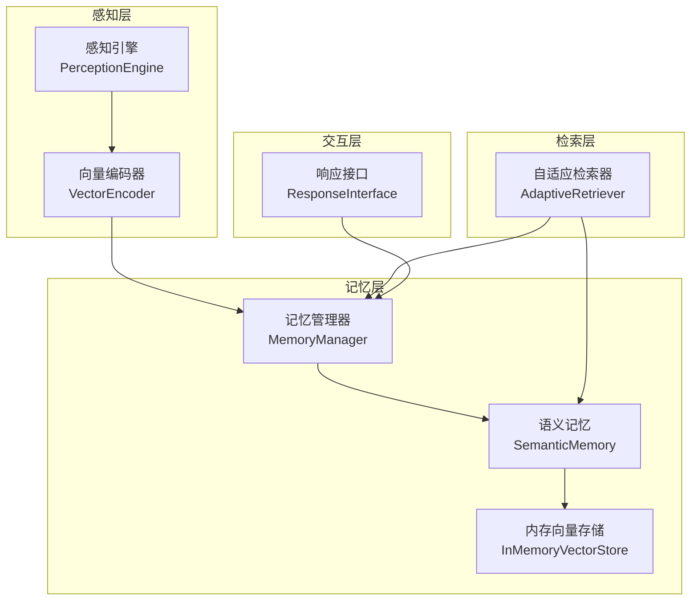
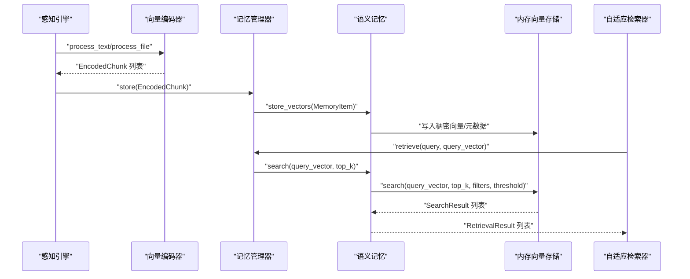
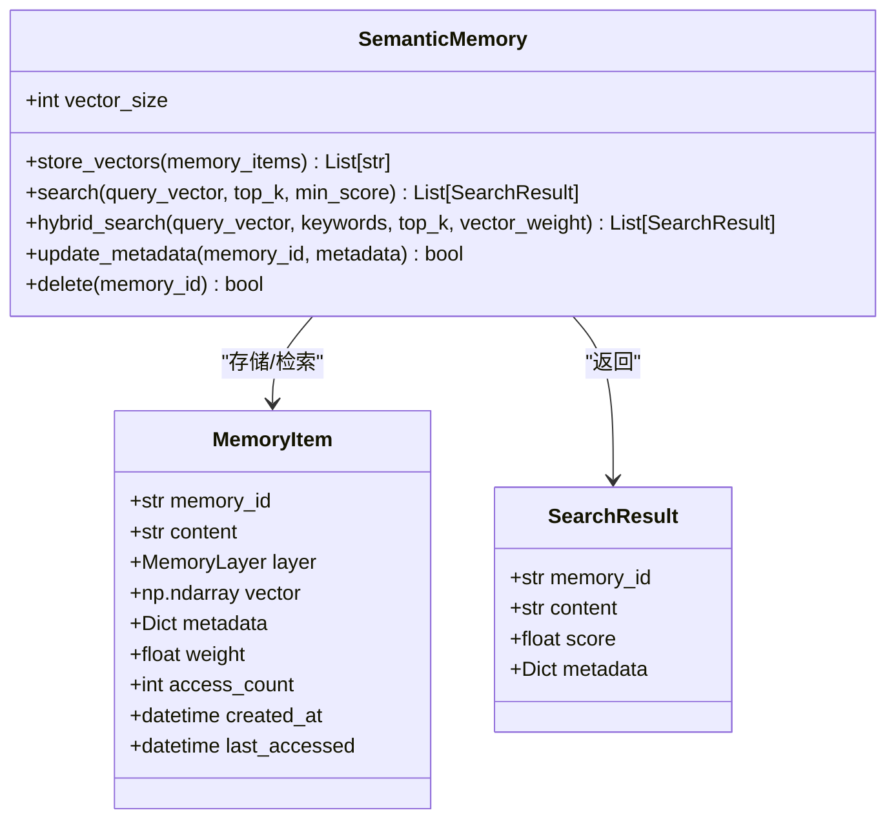
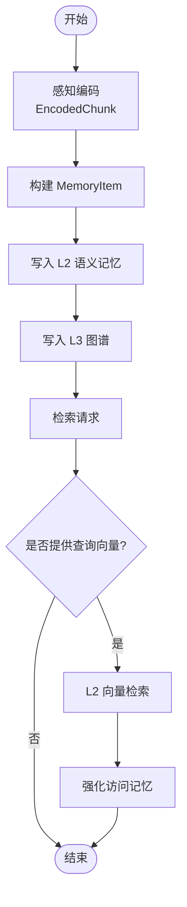
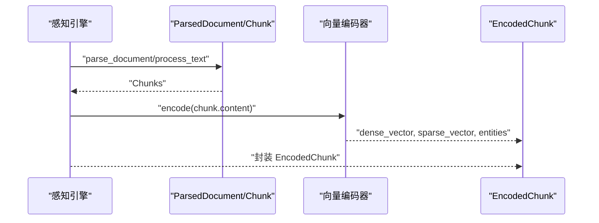
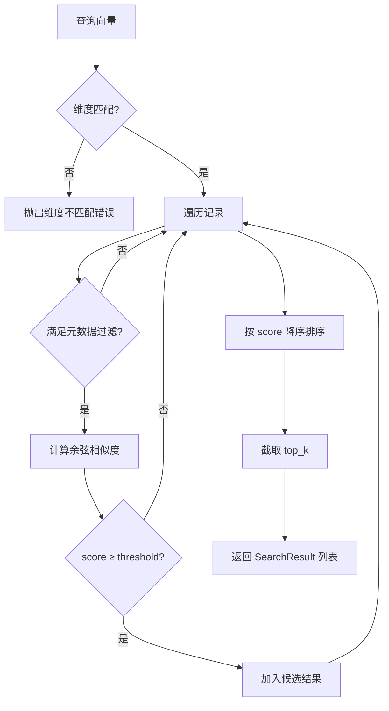
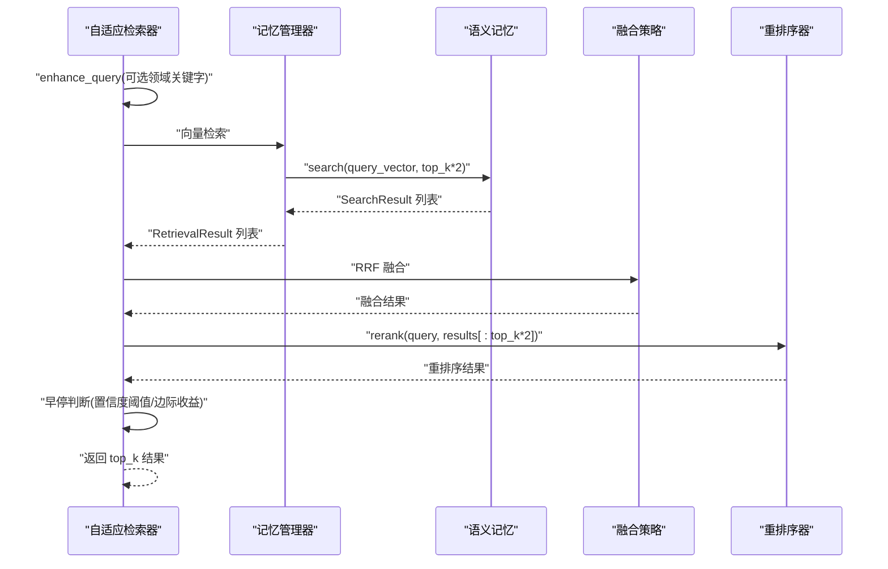
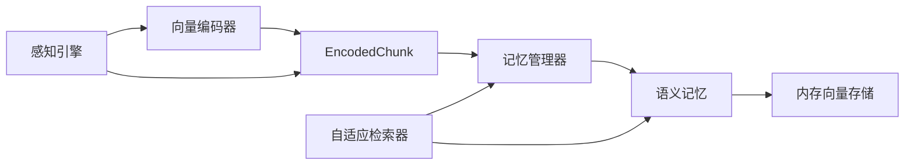

# 语义记忆 (L2)

<cite>
**本文引用的文件**
- [semantic_memory.py](file://src/memory/semantic_memory.py)
- [models.py](file://src/memory/models.py)
- [engine.py](file://src/perception/engine.py)
- [encoder.py](file://src/perception/encoder.py)
- [manager.py](file://src/memory/manager.py)
- [retriever.py](file://src/retrieval/retriever.py)
- [memory_store.py](file://src/memory/backends/memory_store.py)
- [README.md](file://src/memory/README.md)
- [README.md](file://README.md)
- [example_usage.py](file://example/example_usage.py)
</cite>

## 目录
1. [简介](#简介)
2. [项目结构](#项目结构)
3. [核心组件](#核心组件)
4. [架构总览](#架构总览)
5. [详细组件分析](#详细组件分析)
6. [依赖关系分析](#依赖关系分析)
7. [性能考量](#性能考量)
8. [故障排查指南](#故障排查指南)
9. [结论](#结论)
10. [附录](#附录)

## 简介
本节面向语义记忆（L2）的设计理念与实现，重点阐述其作为长期存储的知识库如何通过高维向量数据库实现模糊匹配与直觉检索，并结合感知引擎的编码结果，完成从“感知-记忆-检索-生成”的闭环。文档将覆盖：
- 向量数据库的相似性检索机制（余弦相似度）
- 混合存储策略（稠密向量与稀疏向量）
- 语义理解与概念关联（实体抽取、图谱连接）
- 向量索引构建、相似度计算与与感知编码的匹配过程
- 查询接口、性能调优与向量维度选择指南
- 使用示例与向量搜索优化策略

## 项目结构
围绕 L2 语义记忆，系统主要由以下模块协作：
- 感知引擎：负责文档解析、分块、向量化（稠密/稀疏）、实体抽取与情境标签生成
- 记忆管理器：统一调度 L1/L2/L3 三层记忆，负责存储与检索
- 语义记忆：L2 的向量存储与检索实现（当前以内存模拟，预留与 Qdrant/Milvus 集成）
- 自适应检索器：多路检索、融合、重排序与早停控制
- 后端存储：内存向量/图存储实现（InMemoryVectorStore/InMemoryGraphStore）

图表来源
- [engine.py:20-195](file://src/perception/engine.py#L20-L195)
- [encoder.py:25-255](file://src/perception/encoder.py#L25-L255)
- [manager.py:20-212](file://src/memory/manager.py#L20-L212)
- [semantic_memory.py:21-179](file://src/memory/semantic_memory.py#L21-L179)
- [memory_store.py:20-381](file://src/memory/backends/memory_store.py#L20-L381)
- [retriever.py:128-458](file://src/retrieval/retriever.py#L128-L458)

章节来源
- [README.md:35-85](file://README.md#L35-L85)
- [README.md:198-243](file://README.md#L198-L243)

## 核心组件
- 语义记忆（SemanticMemory）：负责向量存储、相似度检索、混合检索与元数据更新/删除
- 记忆管理器（MemoryManager）：将感知编码结果写入 L2，并在检索时触发 L2 搜索
- 感知引擎（PerceptionEngine）：提供文档解析、分块与向量化（稠密/稀疏/实体）
- 向量编码器（VectorEncoder）：生成稠密向量、稀疏向量与实体三元组
- 内存向量存储（InMemoryVectorStore）：提供余弦相似度搜索与过滤能力
- 自适应检索器（AdaptiveRetriever）：多路检索、融合、重排序与早停

章节来源
- [semantic_memory.py:21-179](file://src/memory/semantic_memory.py#L21-L179)
- [manager.py:20-212](file://src/memory/manager.py#L20-L212)
- [engine.py:20-195](file://src/perception/engine.py#L20-L195)
- [encoder.py:25-255](file://src/perception/encoder.py#L25-L255)
- [memory_store.py:20-381](file://src/memory/backends/memory_store.py#L20-L381)
- [retriever.py:128-458](file://src/retrieval/retriever.py#L128-L458)

## 架构总览
L2 语义记忆在整体架构中的定位与职责如下：
- 输入：感知引擎产出的 EncodedChunk（含稠密向量、稀疏向量、实体、情境标签）
- 存储：MemoryManager 将 EncodedChunk 转换为 MemoryItem 并写入 L2（SemanticMemory）
- 检索：AdaptiveRetriever 调用 MemoryManager 与 SemanticMemory，执行向量检索与后续处理
- 输出：检索结果（含内容、分数、元数据）供上层生成与交互使用

图表来源
- [engine.py:77-154](file://src/perception/engine.py#L77-L154)
- [manager.py:52-122](file://src/memory/manager.py#L52-L122)
- [semantic_memory.py:50-118](file://src/memory/semantic_memory.py#L50-L118)
- [memory_store.py:55-91](file://src/memory/backends/memory_store.py#L55-L91)
- [retriever.py:183-267](file://src/retrieval/retriever.py#L183-L267)

## 详细组件分析

### 语义记忆（SemanticMemory）
- 设计目标：高维向量存储、模糊匹配与直觉检索；支持混合搜索（向量+关键词）
- 当前实现：内存字典存储向量与元数据，提供余弦相似度检索与基础混合检索占位
- 关键方法：
  - store_vectors：将 MemoryItem 写入内部存储
  - search：计算余弦相似度并返回 top_k 结果
  - hybrid_search：混合检索占位（当前仅向量检索）
  - update_metadata/delete：元数据更新与删除

图表来源
- [semantic_memory.py:21-179](file://src/memory/semantic_memory.py#L21-L179)
- [models.py:14-26](file://src/memory/models.py#L14-L26)

章节来源
- [semantic_memory.py:21-179](file://src/memory/semantic_memory.py#L21-L179)
- [models.py:14-26](file://src/memory/models.py#L14-L26)

### 记忆管理器（MemoryManager）
- 职责：统一调度三层记忆；将感知编码结果写入 L2；在检索时触发 L2 搜索
- 关键流程：
  - store：将 EncodedChunk 转为 MemoryItem，写入 L2；同时将实体写入 L3 图谱
  - retrieve：若提供 query_vector，则调用 L2 搜索并返回 MemoryItem 列表
  - consolidate/forget：基于衰减机制进行记忆巩固与主动遗忘

图表来源
- [manager.py:52-122](file://src/memory/manager.py#L52-L122)
- [manager.py:124-159](file://src/memory/manager.py#L124-L159)

章节来源
- [manager.py:20-212](file://src/memory/manager.py#L20-L212)

### 感知引擎与向量编码器
- 感知引擎：解析文档、分块、打标、编码；输出 EncodedChunk（含稠密向量、稀疏向量、实体、情境标签）
- 向量编码器：生成稠密向量（可依赖 LLM 客户端或内置实现）、稀疏向量（TF-IDF 风格词频归一化）、实体三元组（基于规则抽取）

图表来源
- [engine.py:77-154](file://src/perception/engine.py#L77-L154)
- [encoder.py:73-191](file://src/perception/encoder.py#L73-L191)

章节来源
- [engine.py:20-195](file://src/perception/engine.py#L20-L195)
- [encoder.py:25-255](file://src/perception/encoder.py#L25-L255)

### 内存向量存储（InMemoryVectorStore）
- 提供余弦相似度搜索、元数据过滤、阈值筛选与 top_k 截断
- 适合开发/测试场景，便于快速验证检索流程

图表来源
- [memory_store.py:55-91](file://src/memory/backends/memory_store.py#L55-L91)
- [memory_store.py:116-125](file://src/memory/backends/memory_store.py#L116-L125)

章节来源
- [memory_store.py:20-381](file://src/memory/backends/memory_store.py#L20-L381)

### 自适应检索器（AdaptiveRetriever）
- 多路检索：向量检索、图谱检索（占位）、HyDE 增强（占位）
- 融合策略：RRF（Reciprocal Rank Fusion）
- 重排序：基于 reranker 模型
- 早停机制：基于置信度阈值与边际收益递减策略
- 领域权重：可选应用领域权重计算与时间权重

图表来源
- [retriever.py:183-267](file://src/retrieval/retriever.py#L183-L267)
- [retriever.py:321-347](file://src/retrieval/retriever.py#L321-L347)
- [retriever.py:411-439](file://src/retrieval/retriever.py#L411-L439)

章节来源
- [retriever.py:128-458](file://src/retrieval/retriever.py#L128-L458)

## 依赖关系分析
- 语义记忆依赖 MemoryItem 数据模型与 MemoryLayer 枚举
- 记忆管理器依赖感知模型 EncodedChunk 与 MemoryItem，并协调 L2/L3
- 感知引擎依赖编码器与分块策略，输出 EncodedChunk
- 自适应检索器依赖 MemoryManager 与 SemanticMemory，调用 search 接口
- 内存向量存储提供通用的向量检索能力

图表来源
- [encoder.py:73-87](file://src/perception/encoder.py#L73-L87)
- [engine.py:111-138](file://src/perception/engine.py#L111-L138)
- [manager.py:67-81](file://src/memory/manager.py#L67-L81)
- [semantic_memory.py:50-78](file://src/memory/semantic_memory.py#L50-L78)
- [memory_store.py:41-53](file://src/memory/backends/memory_store.py#L41-L53)
- [retriever.py:426-439](file://src/retrieval/retriever.py#L426-L439)

章节来源
- [models.py:14-26](file://src/memory/models.py#L14-L26)
- [README.md:82-147](file://src/memory/README.md#L82-L147)

## 性能考量
- 相似度计算
  - 余弦相似度：O(d) 每条记录，d 为向量维度；在内存实现中线性扫描，适合中小规模
  - 优化建议：引入 HNSW 索引（当前 TODO），支持近似最近邻检索，显著降低查询复杂度
- 向量维度选择
  - 常见维度：256/512/768/1024/1536；维度越高表达能力越强但存储与计算成本更高
  - 建议：先以 768/1024 进行实验，再根据召回质量与延迟调优
- 过滤与阈值
  - 元数据过滤与阈值筛选可减少无效计算，提升检索效率
- 早停机制
  - 基于置信度阈值与边际收益递减策略，避免冗余检索，显著降低端到端延迟
- 批量处理
  - 向量编码器支持 batch 接口，可减少模型调用开销

章节来源
- [memory_store.py:116-125](file://src/memory/backends/memory_store.py#L116-L125)
- [retriever.py:36-126](file://src/retrieval/retriever.py#L36-L126)
- [encoder.py:106-119](file://src/perception/encoder.py#L106-L119)

## 故障排查指南
- 向量维度不匹配
  - 现象：写入/查询时报维度不一致错误
  - 处理：确认编码器输出维度与存储/检索期望维度一致
- 相似度异常
  - 现象：返回分数异常或全零
  - 处理：检查向量归一化与零向量情况；确保输入非零向量
- 检索结果为空
  - 现象：返回空列表
  - 处理：降低 min_score/threshold；检查元数据过滤条件；确认已写入数据
- 早停过早
  - 现象：置信度未达阈值即返回
  - 处理：适当提高阈值或放宽早停策略；检查融合与重排序效果
- 混合检索未生效
  - 现象：hybrid_search 仅返回向量检索
  - 处理：当前实现为占位，需实现关键词权重融合后再启用

章节来源
- [memory_store.py:45-50](file://src/memory/backends/memory_store.py#L45-L50)
- [semantic_memory.py:104-118](file://src/memory/semantic_memory.py#L104-L118)
- [retriever.py:87-107](file://src/retrieval/retriever.py#L87-L107)

## 结论
L2 语义记忆通过高维向量与模糊匹配，为系统提供了强大的长期知识存储与直觉检索能力。感知引擎产出的稠密/稀疏向量与实体三元组，经由记忆管理器写入 L2，并在检索阶段由自适应检索器进行多路融合与重排序，配合早停机制实现高效稳定的端到端体验。当前实现以内存存储为基础，预留与 Qdrant/Milvus 的集成路径；未来可在索引优化、混合检索与领域权重方面进一步增强。

## 附录

### 查询接口与使用示例
- 基础检索流程
  - 感知编码：PerceptionEngine.process_text/process_file
  - 存储知识：MemoryManager.store
  - 检索：AdaptiveRetriever.retrieve
  - 可选：MemoryManager.consolidate/forget
- 示例参考
  - 完整工作流示例：[example_usage.py:12-252](file://example/example_usage.py#L12-L252)

章节来源
- [example_usage.py:12-252](file://example/example_usage.py#L12-L252)

### 向量维度选择指南
- 选择原则
  - 表达力与资源平衡：维度越高，表达能力越强，但存储与计算成本上升
  - 实验驱动：先以 768/1024 维度进行基准测试，再根据召回质量与延迟微调
  - 模型限制：确保所选维度与嵌入模型输出一致
- 常见维度对比
  - 256/512：轻量场景，适合资源受限或原型验证
  - 768/1024：主流选择，兼顾召回与性能
  - 1536+：高精度场景，如长文本或多模态

章节来源
- [README.md:465-474](file://README.md#L465-L474)
- [encoder.py:68-71](file://src/perception/encoder.py#L68-L71)

### 向量搜索优化策略
- 索引优化
  - HNSW 近似最近邻：显著降低查询复杂度，适合大规模向量库
  - IVF/PQ：进一步压缩存储与加速检索（需评估精度损失）
- 过滤与阈值
  - 元数据过滤：按来源、时间、标签等条件缩小候选集
  - 分数阈值：剔除低相关片段，减少下游负担
- 早停与重排序
  - 早停：置信度阈值与边际收益策略，避免无效计算
  - 重排序：基于 reranker 模型提升排序质量
- 批量与缓存
  - 批量编码：减少模型调用次数
  - 热点缓存：对高频查询结果进行缓存（注意时效性）

章节来源
- [semantic_memory.py:97-118](file://src/memory/semantic_memory.py#L97-L118)
- [memory_store.py:55-91](file://src/memory/backends/memory_store.py#L55-L91)
- [retriever.py:36-126](file://src/retrieval/retriever.py#L36-L126)