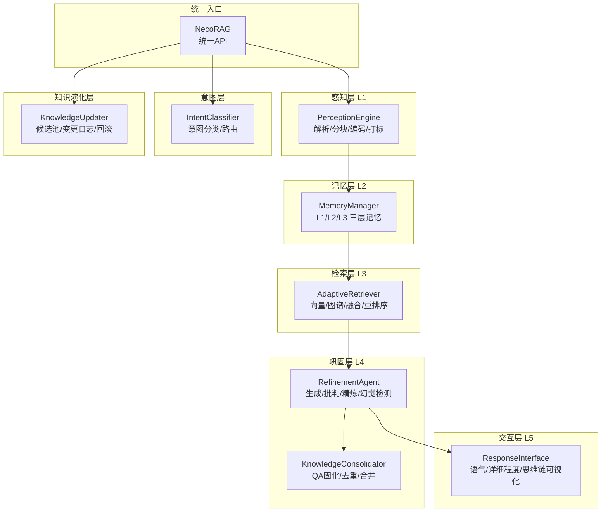
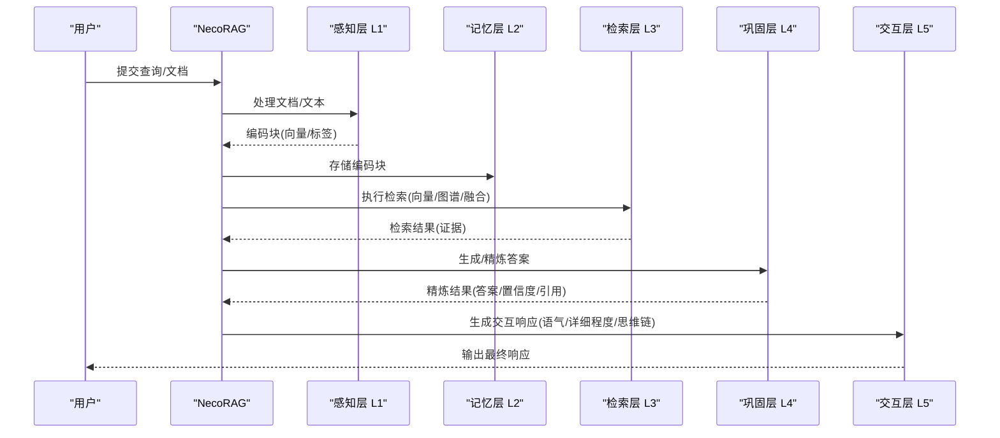
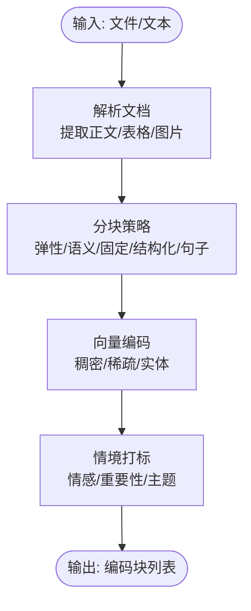
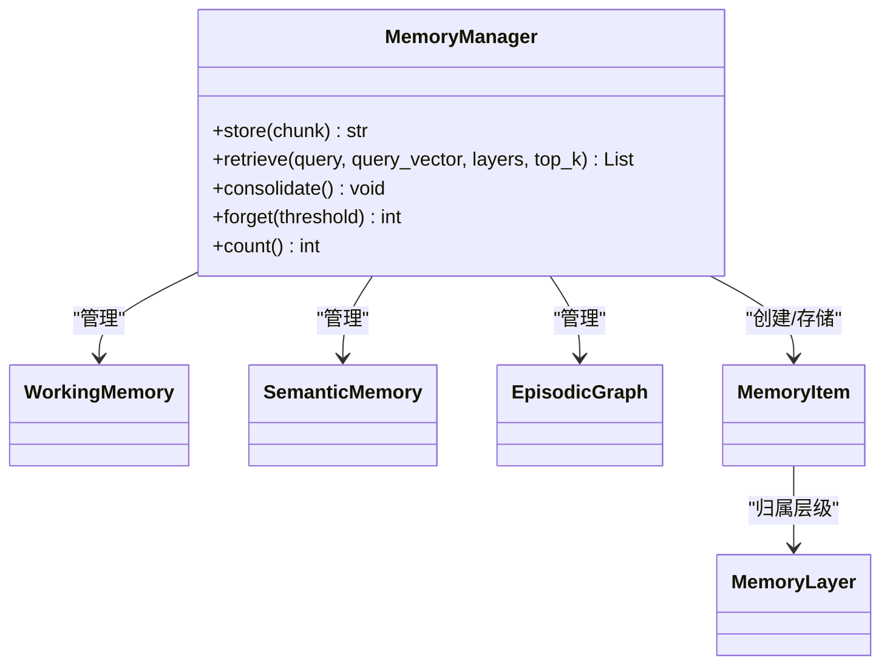
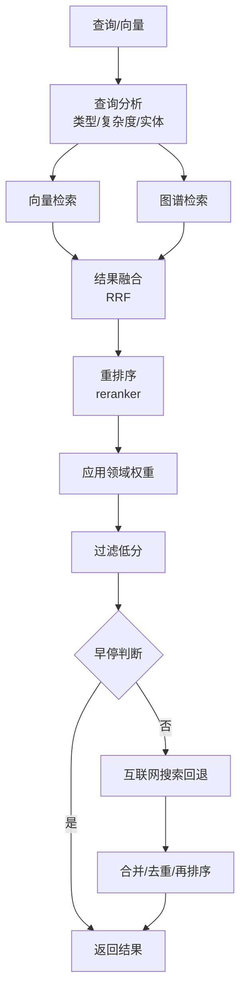
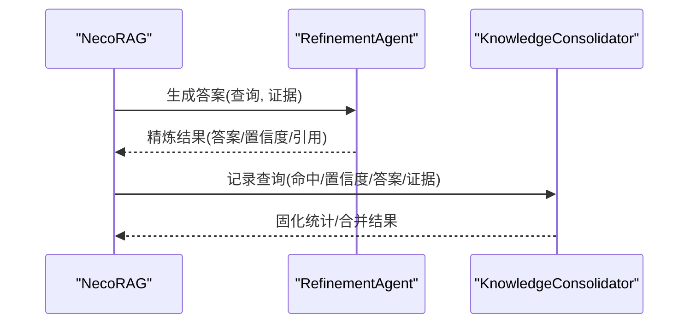
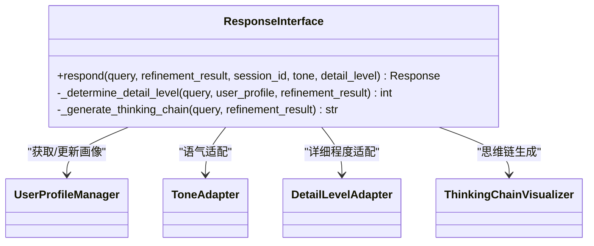
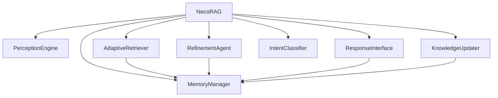

# 五层认知架构详解

<cite>
**本文档引用的文件**
- [necorag.py](file://src/necorag.py)
- [engine.py](file://src/perception/engine.py)
- [manager.py](file://src/memory/manager.py)
- [retriever.py](file://src/retrieval/retriever.py)
- [consolidator.py](file://src/refinement/consolidator.py)
- [interface.py](file://src/response/interface.py)
- [base.py](file://src/core/base.py)
- [classifier.py](file://src/intent/classifier.py)
- [knowledge_base.py](file://src/domain/knowledge_base.py)
- [updater.py](file://src/knowledge_evolution/updater.py)
- [example_usage.py](file://example/example_usage.py)
- [models.py](file://src/perception/models.py)
- [models.py](file://src/memory/models.py)
- [models.py](file://src/refinement/models.py)
- [models.py](file://src/response/models.py)
</cite>

## 目录
1. [简介](#简介)
2. [项目结构](#项目结构)
3. [核心组件](#核心组件)
4. [架构总览](#架构总览)
5. [详细组件分析](#详细组件分析)
6. [依赖关系分析](#依赖关系分析)
7. [性能考量](#性能考量)
8. [故障排除指南](#故障排除指南)
9. [结论](#结论)
10. [附录](#附录)

## 简介
本文件面向开发者与架构师，系统化阐述 NecoRAG 五层认知架构的设计与实现，逐层解析感知层(L1)、记忆层(L2)、检索层(L3)、巩固层(L4)、交互层(L5)的职责、组件、数据流与相互依赖关系。文档同时给出代码级的使用示例路径、接口契约与通信协议说明，并通过多种图示帮助读者建立整体认知。

## 项目结构
NecoRAG 采用模块化分层组织，核心位于 src 目录下，围绕统一入口类 NecoRAG 协同各层组件完成从感知到交互的完整认知闭环。

**图表来源**
- [necorag.py:51-148](file://src/necorag.py#L51-L148)
- [engine.py:20-76](file://src/perception/engine.py#L20-L76)
- [manager.py:20-51](file://src/memory/manager.py#L20-L51)
- [retriever.py:135-182](file://src/retrieval/retriever.py#L135-L182)
- [consolidator.py:41-86](file://src/refinement/consolidator.py#L41-L86)
- [interface.py:20-58](file://src/response/interface.py#L20-L58)
- [classifier.py:20-59](file://src/intent/classifier.py#L20-L59)
- [updater.py:24-78](file://src/knowledge_evolution/updater.py#L24-L78)

**章节来源**
- [necorag.py:51-148](file://src/necorag.py#L51-L148)
- [engine.py:20-76](file://src/perception/engine.py#L20-L76)
- [manager.py:20-51](file://src/memory/manager.py#L20-L51)
- [retriever.py:135-182](file://src/retrieval/retriever.py#L135-L182)
- [consolidator.py:41-86](file://src/refinement/consolidator.py#L41-L86)
- [interface.py:20-58](file://src/response/interface.py#L20-L58)
- [classifier.py:20-59](file://src/intent/classifier.py#L20-L59)
- [updater.py:24-78](file://src/knowledge_evolution/updater.py#L24-L78)

## 核心组件
- 统一入口 NecoRAG：负责组件初始化、文档导入、查询处理、知识演化与自适应学习的协调。
- 感知层 L1：PerceptionEngine，完成文档解析、分块、向量编码与情境标签生成。
- 记忆层 L2：MemoryManager，统一管理 L1/L2/L3 三层记忆，提供存储、检索、巩固与遗忘。
- 检索层 L3：AdaptiveRetriever，多路检索、结果融合、重排序、早停控制、领域权重与互联网搜索回退。
- 巩固层 L4：RefinementAgent + KnowledgeConsolidator，QA 对生成、批判与精炼，知识缺口识别与固化。
- 交互层 L5：ResponseInterface，响应内容适配、思维链可视化、用户画像与偏好管理。
- 意图层：IntentClassifier，查询意图分类与路由，指导检索参数与策略。
- 知识演化层：KnowledgeUpdater，候选池管理、变更日志、回滚、查询驱动的知识积累。

**章节来源**
- [necorag.py:123-148](file://src/necorag.py#L123-L148)
- [engine.py:20-76](file://src/perception/engine.py#L20-L76)
- [manager.py:20-51](file://src/memory/manager.py#L20-L51)
- [retriever.py:135-182](file://src/retrieval/retriever.py#L135-L182)
- [consolidator.py:41-86](file://src/refinement/consolidator.py#L41-L86)
- [interface.py:20-58](file://src/response/interface.py#L20-L58)
- [classifier.py:20-59](file://src/intent/classifier.py#L20-L59)
- [updater.py:24-78](file://src/knowledge_evolution/updater.py#L24-L78)

## 架构总览
五层架构遵循“感知-记忆-检索-巩固-交互”的闭环流程：感知层接收外部输入并编码为向量与标签；记忆层持久化存储；检索层在多源信息间融合与排序；巩固层对答案进行生成、批判与精炼；交互层输出情境化响应。意图层贯穿其中，为检索与响应提供上下文引导。

**图表来源**
- [necorag.py:390-513](file://src/necorag.py#L390-L513)
- [engine.py:140-195](file://src/perception/engine.py#L140-L195)
- [manager.py:52-123](file://src/memory/manager.py#L52-L123)
- [retriever.py:224-308](file://src/retrieval/retriever.py#L224-L308)
- [consolidator.py:105-160](file://src/refinement/consolidator.py#L105-L160)
- [interface.py:59-140](file://src/response/interface.py#L59-L140)

## 详细组件分析

### 感知层 L1：PerceptionEngine
- 核心职责
  - 文档解析：支持多种格式，抽取正文、表格、图片等。
  - 文本分块：弹性/语义/固定/结构化/句子级策略，兼顾语义完整性与性能。
  - 向量编码：稠密/稀疏向量与实体抽取，便于后续检索与图谱构建。
  - 情境打标：情感、重要性、主题等标签，辅助检索与排序。
- 数据流
  - 输入：文件路径或纯文本
  - 输出：编码块列表（含向量、标签、实体、元数据）
- 关键实现路径
  - [PerceptionEngine.__init__:28-76](file://src/perception/engine.py#L28-L76)
  - [PerceptionEngine.process_file:140-154](file://src/perception/engine.py#L140-L154)
  - [PerceptionEngine.process_text:156-195](file://src/perception/engine.py#L156-L195)
  - [PerceptionEngine.process:96-138](file://src/perception/engine.py#L96-L138)

**图表来源**
- [engine.py:77-138](file://src/perception/engine.py#L77-L138)

**章节来源**
- [engine.py:20-195](file://src/perception/engine.py#L20-L195)
- [models.py:14-62](file://src/perception/models.py#L14-L62)

### 记忆层 L2：MemoryManager
- 核心职责
  - 统一管理三层记忆：L1 工作记忆、L2 语义记忆（向量）、L3 情景图谱（实体/关系）。
  - 存储：将编码块持久化为记忆项，同时抽取实体并写入图谱。
  - 检索：基于向量相似度检索，结合衰减强化访问记忆。
  - 巩固：应用衰减策略，识别并归档低价值记忆。
- 数据流
  - 输入：编码块
  - 输出：记忆 ID、检索结果、图谱实体/关系
- 关键实现路径
  - [MemoryManager.store:52-123](file://src/memory/manager.py#L52-L123)
  - [MemoryManager.retrieve:124-159](file://src/memory/manager.py#L124-L159)
  - [MemoryManager.consolidate:161-182](file://src/memory/manager.py#L161-L182)

**图表来源**
- [manager.py:20-212](file://src/memory/manager.py#L20-L212)
- [models.py:14-43](file://src/memory/models.py#L14-L43)

**章节来源**
- [manager.py:20-212](file://src/memory/manager.py#L20-L212)
- [models.py:14-43](file://src/memory/models.py#L14-L43)

### 检索层 L3：AdaptiveRetriever
- 核心职责
  - 多路检索：向量检索与图谱检索并行。
  - 结果融合：倒数秩融合（Reciprocal Rank Fusion）。
  - 重排序：基于 BGE-Reranker 的语义重排。
  - 领域权重：结合关键词、时效性与领域权重动态调整分数。
  - 早停控制：基于置信度阈值与边际收益递减策略提前终止。
  - 互联网搜索回退：在本地检索不足时触发网络搜索。
- 数据流
  - 输入：查询文本/向量、top_k、min_score、是否应用领域权重
  - 输出：排序后的检索结果
- 关键实现路径
  - [AdaptiveRetriever.retrieve:224-308](file://src/retrieval/retriever.py#L224-L308)
  - [EarlyTerminationController.evaluate_confidence:68-92](file://src/retrieval/retriever.py#L68-L92)
  - [AdaptiveRetriever._apply_domain_weights:310-360](file://src/retrieval/retriever.py#L310-L360)

**图表来源**
- [retriever.py:224-308](file://src/retrieval/retriever.py#L224-L308)
- [retriever.py:43-133](file://src/retrieval/retriever.py#L43-L133)

**章节来源**
- [retriever.py:135-644](file://src/retrieval/retriever.py#L135-L644)

### 巩固层 L4：RefinementAgent 与 KnowledgeConsolidator
- 核心职责
  - RefinementAgent：基于证据生成答案，进行批判与精炼，支持幻觉检测。
  - KnowledgeConsolidator：分析查询模式，识别知识缺口，合并碎片化知识，去重与持久化 QA 对。
- 数据流
  - 输入：查询、证据列表
  - 输出：精炼答案、置信度、引用、幻觉报告；固化统计与合并结果
- 关键实现路径
  - [KnowledgeConsolidator.run_consolidation_cycle:105-160](file://src/refinement/consolidator.py#L105-L160)
  - [KnowledgeConsolidator.analyze_query_patterns:162-215](file://src/refinement/consolidator.py#L162-L215)
  - [KnowledgeConsolidator.identify_knowledge_gaps:217-248](file://src/refinement/consolidator.py#L217-L248)
  - [KnowledgeConsolidator.merge_fragments:282-321](file://src/refinement/consolidator.py#L282-L321)

**图表来源**
- [consolidator.py:105-160](file://src/refinement/consolidator.py#L105-L160)
- [consolidator.py:282-321](file://src/refinement/consolidator.py#L282-L321)

**章节来源**
- [consolidator.py:41-659](file://src/refinement/consolidator.py#L41-L659)
- [models.py:9-66](file://src/refinement/models.py#L9-L66)

### 交互层 L5：ResponseInterface
- 核心职责
  - 用户画像适配：根据用户偏好与交互历史调整语气与详细程度。
  - 思维链可视化：生成检索路径、证据来源与推理过程的可视化文本。
  - 响应内容适配：语气与详细程度的动态调整。
- 数据流
  - 输入：查询、精炼结果、会话 ID、语气/详细程度
  - 输出：响应对象（内容、思维链、引用、元数据）
- 关键实现路径
  - [ResponseInterface.respond:59-140](file://src/response/interface.py#L59-L140)
  - [ResponseInterface._generate_thinking_chain:175-219](file://src/response/interface.py#L175-L219)

**图表来源**
- [interface.py:20-140](file://src/response/interface.py#L20-L140)
- [models.py:13-31](file://src/response/models.py#L13-L31)

**章节来源**
- [interface.py:20-232](file://src/response/interface.py#L20-L232)
- [models.py:13-31](file://src/response/models.py#L13-L31)

### 意图层：IntentClassifier
- 核心职责
  - 基于规则/词表的意图分类，支持多意图与置信度。
  - 关键词与实体提取，为检索参数与路由提供依据。
- 关键实现路径
  - [IntentClassifier.classify:85-206](file://src/intent/classifier.py#L85-L206)
  - [IntentClassifier._rule_based_classify:114-206](file://src/intent/classifier.py#L114-L206)

**章节来源**
- [classifier.py:20-493](file://src/intent/classifier.py#L20-L493)

### 知识演化层：KnowledgeUpdater
- 核心职责
  - 候选池管理：质量评估、自动/手动审批、池容量清理。
  - 变更日志：插入/更新/删除的审计与回滚支持。
  - 查询驱动积累：未命中查询的知识缺口记录与候选生成。
  - 批量更新：定时任务与增量更新（L2/L3）。
- 关键实现路径
  - [KnowledgeUpdater.realtime_update:361-405](file://src/knowledge_evolution/updater.py#L361-L405)
  - [KnowledgeUpdater.execute_batch_update:442-497](file://src/knowledge_evolution/updater.py#L442-L497)
  - [KnowledgeUpdater.on_query_completed:697-756](file://src/knowledge_evolution/updater.py#L697-L756)

**章节来源**
- [updater.py:24-864](file://src/knowledge_evolution/updater.py#L24-L864)

### 领域知识库：Domain Knowledge Base
- 核心职责
  - 关键字与 FAQ 管理，支持导入/导出与自动扩展。
  - 从语料中提取与建议新关键字，记录知识扩充历史。
- 关键实现路径
  - [KnowledgeBase.add_keyword:76-97](file://src/domain/knowledge_base.py#L76-L97)
  - [KnowledgeBase.expand_from_corpus:440-494](file://src/domain/knowledge_base.py#L440-L494)

**章节来源**
- [knowledge_base.py:64-564](file://src/domain/knowledge_base.py#L64-L564)

## 依赖关系分析
- 组件耦合
  - NecoRAG 作为统一入口，依赖感知、记忆、检索、巩固、交互、意图与知识演化组件。
  - 检索层依赖记忆层的向量与图谱能力；巩固层依赖记忆层的存储接口。
  - 交互层依赖记忆层的工作记忆与用户画像；意图层贯穿检索与响应阶段。
- 外部依赖
  - LLM 客户端（Mock/可扩展），用于生成与嵌入。
  - 向量数据库（Qdrant）、图数据库（Neo4j）、缓存（Redis）等后端（通过 MemoryManager 抽象接入）。
- 接口契约
  - 所有核心组件均实现 src/core/base.py 中的抽象基类，保证可替换性与一致性。

**图表来源**
- [necorag.py:123-148](file://src/necorag.py#L123-L148)
- [base.py:30-800](file://src/core/base.py#L30-L800)

**章节来源**
- [necorag.py:123-148](file://src/necorag.py#L123-L148)
- [base.py:30-800](file://src/core/base.py#L30-L800)

## 性能考量
- 感知层
  - 分块策略选择影响吞吐与语义完整性，建议根据文档类型与查询需求选择弹性/语义策略。
  - 向量编码与标签生成可并行化，注意批处理与内存占用。
- 记忆层
  - 向量检索需配合索引与过滤；定期巩固与主动遗忘降低存储与查询开销。
- 检索层
  - 早停阈值与最小边际收益参数需结合业务场景调优；融合与重排序成本较高，建议按 top_k 动态调整。
- 巩固层
  - 幻觉检测与去重/合并可异步执行，避免阻塞主流程。
- 交互层
  - 语气与详细程度适配可缓存用户画像，减少重复计算。

## 故障排除指南
- 常见问题
  - 检索结果为空：检查感知层分块是否过细、编码质量是否达标；确认记忆层是否正确存储。
  - 置信度偏低：调整早停阈值、增加领域权重或启用 HyDE 增强；检查检索融合与重排序参数。
  - 响应不符合预期：核对用户画像与偏好设置；检查语气/详细程度适配逻辑。
  - 知识未更新：检查候选池质量阈值、自动审批开关与批量任务执行状态。
- 排查路径
  - 日志定位：各组件均使用 Python logging，关注 INFO/DEBUG 级别输出。
  - 统计信息：通过 NecoRAG.get_stats() 获取导入/查询统计与知识演化指标。
  - 回滚与审计：利用变更日志与回滚接口恢复异常变更。

**章节来源**
- [necorag.py:577-592](file://src/necorag.py#L577-L592)
- [updater.py:588-625](file://src/knowledge_evolution/updater.py#L588-L625)

## 结论
NecoRAG 五层认知架构以统一入口为核心，通过感知-记忆-检索-巩固-交互的闭环流程，实现了从多模态输入到情境化输出的完整认知过程。各层职责清晰、接口一致、可扩展性强，既满足工程化落地，又具备持续学习与演化的潜力。建议在生产环境中结合业务场景对参数与策略进行精细化调优，并充分利用知识演化与意图分析能力提升系统智能水平。

## 附录

### 使用示例路径
- 完整工作流演示：[example_usage.py:218-252](file://example/example_usage.py#L218-L252)
- 感知层示例：[example_usage.py:12-47](file://example/example_usage.py#L12-L47)
- 记忆层示例：[example_usage.py:50-91](file://example/example_usage.py#L50-L91)
- 检索层示例：[example_usage.py:94-136](file://example/example_usage.py#L94-L136)
- 巩固层示例：[example_usage.py:139-173](file://example/example_usage.py#L139-L173)
- 交互层示例：[example_usage.py:176-215](file://example/example_usage.py#L176-L215)

### 接口契约与通信协议
- 统一抽象基类：[base.py:30-800](file://src/core/base.py#L30-L800)
- 数据模型：感知层、记忆层、巩固层、交互层的数据模型分别位于
  - [perception/models.py:14-62](file://src/perception/models.py#L14-L62)
  - [memory/models.py:14-43](file://src/memory/models.py#L14-L43)
  - [refinement/models.py:9-66](file://src/refinement/models.py#L9-L66)
  - [response/models.py:13-31](file://src/response/models.py#L13-L31)