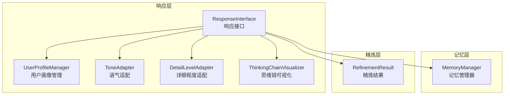
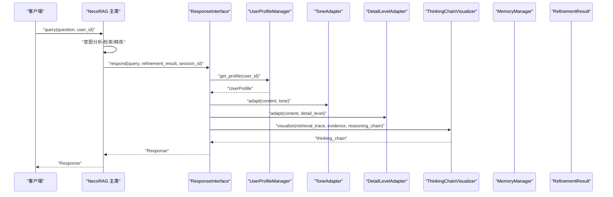
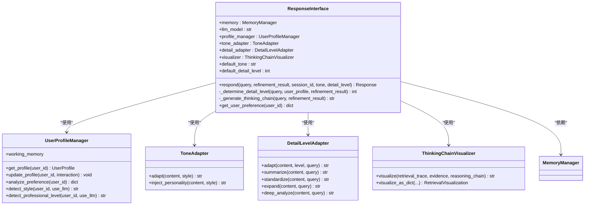
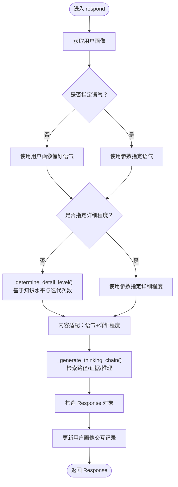
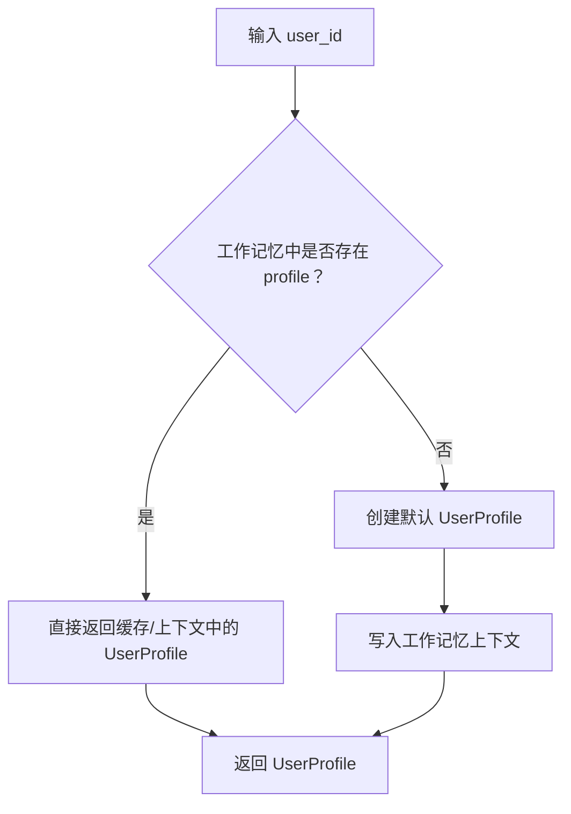
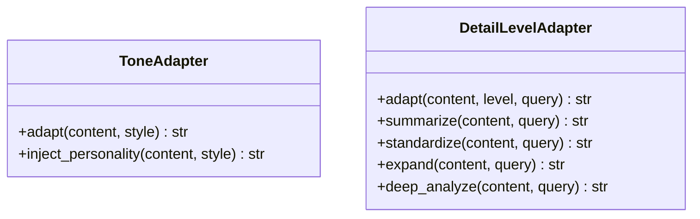
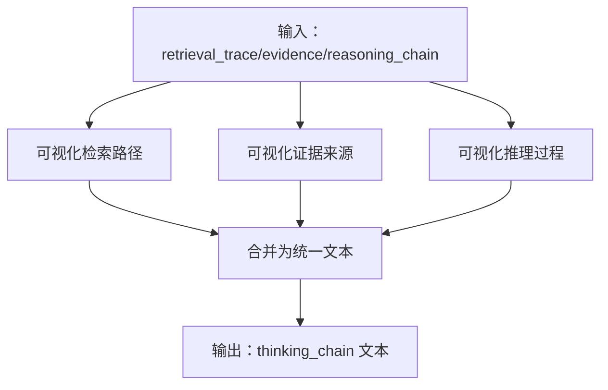
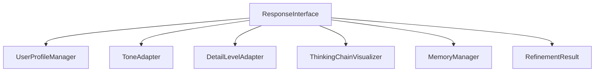

# 响应接口核心

<cite>
**本文引用的文件**
- [src/response/interface.py](file://src/response/interface.py)
- [src/response/profile_manager.py](file://src/response/profile_manager.py)
- [src/response/detail_adapter.py](file://src/response/detail_adapter.py)
- [src/response/tone_adapter.py](file://src/response/tone_adapter.py)
- [src/response/visualizer.py](file://src/response/visualizer.py)
- [src/response/models.py](file://src/response/models.py)
- [src/refinement/models.py](file://src/refinement/models.py)
- [src/core/protocols.py](file://src/core/protocols.py)
- [src/memory/manager.py](file://src/memory/manager.py)
- [src/necorag.py](file://src/necorag.py)
- [example/example_usage.py](file://example/example_usage.py)
</cite>

## 目录
1. [简介](#简介)
2. [项目结构](#项目结构)
3. [核心组件](#核心组件)
4. [架构总览](#架构总览)
5. [详细组件分析](#详细组件分析)
6. [依赖关系分析](#依赖关系分析)
7. [性能考量](#性能考量)
8. [故障排查指南](#故障排查指南)
9. [结论](#结论)
10. [附录](#附录)

## 简介
本文件聚焦 NecoRAG 交互层的“响应接口核心”，系统性阐述 ResponseInterface 类的设计架构与核心能力，包括情境自适应生成、用户画像适配、思维链可视化以及多模态输出等。文档将详细拆解 respond 方法从查询处理到最终响应生成的完整流程，并解释用户画像管理机制如何影响响应生成（知识水平、偏好语气等个性化因素）。同时提供响应接口的初始化、配置与使用示例路径，说明其与记忆管理器、LLM 模型的集成方式，并给出响应质量评估指标与性能优化建议。

## 项目结构
响应接口位于 src/response 目录，围绕 ResponseInterface 核心类组织，配套子组件包括：
- 用户画像管理：UserProfileManager
- 语气适配：ToneAdapter
- 详细程度适配：DetailLevelAdapter
- 思维链可视化：ThinkingChainVisualizer
- 数据模型：UserProfile、Response、Interaction 等

图表来源
- [src/response/interface.py:20-140](file://src/response/interface.py#L20-L140)
- [src/response/profile_manager.py:20-141](file://src/response/profile_manager.py#L20-L141)
- [src/response/tone_adapter.py:8-76](file://src/response/tone_adapter.py#L8-L76)
- [src/response/detail_adapter.py:18-94](file://src/response/detail_adapter.py#L18-L94)
- [src/response/visualizer.py:9-71](file://src/response/visualizer.py#L9-L71)
- [src/memory/manager.py:20-51](file://src/memory/manager.py#L20-L51)
- [src/refinement/models.py:38-47](file://src/refinement/models.py#L38-L47)

章节来源
- [src/response/interface.py:1-232](file://src/response/interface.py#L1-L232)
- [src/response/profile_manager.py:1-505](file://src/response/profile_manager.py#L1-L505)
- [src/response/detail_adapter.py:1-417](file://src/response/detail_adapter.py#L1-L417)
- [src/response/tone_adapter.py:1-138](file://src/response/tone_adapter.py#L1-L138)
- [src/response/visualizer.py:1-150](file://src/response/visualizer.py#L1-L150)
- [src/memory/manager.py:1-212](file://src/memory/manager.py#L1-L212)
- [src/refinement/models.py:1-66](file://src/refinement/models.py#L1-L66)

## 核心组件
- ResponseInterface：交互层核心，负责整合用户画像、语气与详细程度适配、思维链可视化与响应生成。
- UserProfileManager：用户画像管理与偏好分析，支持规则与 LLM 增强两种检测模式。
- ToneAdapter：语气风格适配（正式、友好、幽默），并注入个性化连接词。
- DetailLevelAdapter：详细程度适配（Level 1-4），支持 LLM 增强与退化模式。
- ThinkingChainVisualizer：将检索路径、证据来源与推理过程结构化可视化。
- MemoryManager：三层记忆统一管理，为用户画像与上下文提供持久化与检索能力。
- RefinementResult：精炼结果载体，包含答案、置信度、引用与迭代次数等。

章节来源
- [src/response/interface.py:20-140](file://src/response/interface.py#L20-L140)
- [src/response/profile_manager.py:20-141](file://src/response/profile_manager.py#L20-L141)
- [src/response/tone_adapter.py:8-76](file://src/response/tone_adapter.py#L8-L76)
- [src/response/detail_adapter.py:18-94](file://src/response/detail_adapter.py#L18-L94)
- [src/response/visualizer.py:9-71](file://src/response/visualizer.py#L9-L71)
- [src/memory/manager.py:20-51](file://src/memory/manager.py#L20-L51)
- [src/refinement/models.py:38-47](file://src/refinement/models.py#L38-L47)

## 架构总览
响应接口在 NecoRAG 五层认知架构中处于交互层（L5），承接感知层、记忆层、检索层与巩固层的输出，面向用户生成情境自适应的响应。其与记忆管理器协作维护用户画像，与精炼结果对接生成最终响应，并通过思维链可视化提升可解释性。

图表来源
- [src/necorag.py:390-513](file://src/necorag.py#L390-L513)
- [src/response/interface.py:59-140](file://src/response/interface.py#L59-L140)
- [src/response/profile_manager.py:115-141](file://src/response/profile_manager.py#L115-L141)
- [src/response/tone_adapter.py:49-76](file://src/response/tone_adapter.py#L49-L76)
- [src/response/detail_adapter.py:64-94](file://src/response/detail_adapter.py#L64-L94)
- [src/response/visualizer.py:37-71](file://src/response/visualizer.py#L37-L71)

## 详细组件分析

### ResponseInterface 设计与流程
- 角色定位：整合用户画像、语气与详细程度适配、思维链可视化与响应生成。
- 关键职责：
  - 从 MemoryManager 获取工作记忆上下文，加载/更新用户画像。
  - 基于用户画像与精炼结果确定语气与详细程度。
  - 通过 ToneAdapter 与 DetailLevelAdapter 生成最终内容。
  - 生成思维链可视化，作为响应元数据的一部分。
  - 更新用户画像交互记录，驱动个性化持续优化。

图表来源
- [src/response/interface.py:20-140](file://src/response/interface.py#L20-L140)
- [src/response/profile_manager.py:20-141](file://src/response/profile_manager.py#L20-L141)
- [src/response/tone_adapter.py:8-76](file://src/response/tone_adapter.py#L8-L76)
- [src/response/detail_adapter.py:18-94](file://src/response/detail_adapter.py#L18-L94)
- [src/response/visualizer.py:9-71](file://src/response/visualizer.py#L9-L71)

章节来源
- [src/response/interface.py:20-140](file://src/response/interface.py#L20-L140)

#### respond 方法工作流程
- 输入：查询文本、精炼结果、会话 ID、语气与详细程度（可选）。
- 步骤：
  1) 获取用户画像：若 session_id 为空则回退为匿名用户。
  2) 确定语气：优先使用显式参数，否则回退至用户画像偏好。
  3) 确定详细程度：若未指定，则基于用户知识水平与精炼迭代次数综合判定。
  4) 内容适配：先语气适配，再详细程度适配。
  5) 生成思维链可视化：基于查询理解、证据条目与推理指标。
  6) 构造响应对象：包含内容、思维链、语气、详细程度、引用与元数据。
  7) 更新用户画像：记录交互记录，写回工作记忆上下文。
- 输出：Response 对象，包含内容、思维链与元数据。

图表来源
- [src/response/interface.py:59-140](file://src/response/interface.py#L59-L140)
- [src/response/interface.py:142-174](file://src/response/interface.py#L142-L174)
- [src/response/interface.py:175-220](file://src/response/interface.py#L175-L220)

章节来源
- [src/response/interface.py:59-140](file://src/response/interface.py#L59-L140)

### 用户画像管理机制
- 用户画像数据结构：包含知识水平、偏好语气、兴趣领域、查询历史、交互计数与元数据等。
- 画像来源：
  - 工作记忆上下文：UserProfile 由 MemoryManager 的 working_memory 提供。
  - 交互记录：每次响应后写回工作记忆，形成闭环。
- 偏好分析：
  - 专业水平检测：基于关键词匹配与查询复杂度，支持规则与 LLM 两种模式。
  - 交互风格检测：简洁/详细/技术性/通俗化，同样支持规则与 LLM 模式。
  - 关键词统计：分析用户查询高频词，辅助偏好识别。
- 默认值与退化：
  - 当 LLM 不可用或检测失败时，自动退化为规则模式或默认值。

图表来源
- [src/response/profile_manager.py:115-141](file://src/response/profile_manager.py#L115-L141)

章节来源
- [src/response/profile_manager.py:115-141](file://src/response/profile_manager.py#L115-L141)
- [src/response/profile_manager.py:210-332](file://src/response/profile_manager.py#L210-L332)
- [src/response/profile_manager.py:340-467](file://src/response/profile_manager.py#L340-L467)
- [src/response/models.py:13-31](file://src/response/models.py#L13-L31)

### 语气适配与详细程度适配
- 语气适配（ToneAdapter）：
  - 支持 formal/friendly/humorous 三种风格，注入个性化连接词与前后缀。
  - 可选择移除 emoji，满足正式场景需求。
- 详细程度适配（DetailLevelAdapter）：
  - Level 1：简洁摘要（1-2 句话）
  - Level 2：标准回答（要点归纳）
  - Level 3：详细解释（扩展背景与示例）
  - Level 4：深度分析（完整报告框架）
  - LLM 增强与退化：当无 LLM 时采用规则退化策略。

图表来源
- [src/response/tone_adapter.py:8-76](file://src/response/tone_adapter.py#L8-L76)
- [src/response/detail_adapter.py:18-94](file://src/response/detail_adapter.py#L18-L94)

章节来源
- [src/response/tone_adapter.py:49-109](file://src/response/tone_adapter.py#L49-L109)
- [src/response/detail_adapter.py:64-94](file://src/response/detail_adapter.py#L64-L94)

### 思维链可视化
- 可视化内容：
  - 检索路径：查询理解、语义检索、证据条目数量等。
  - 证据来源：证据 ID 与相关度评分。
  - 推理过程：置信度、迭代次数、幻觉检测结果等。
- 输出形式：文本格式与结构化对象（RetrievalVisualization）。

图表来源
- [src/response/visualizer.py:37-71](file://src/response/visualizer.py#L37-L71)
- [src/response/visualizer.py:73-126](file://src/response/visualizer.py#L73-L126)
- [src/response/visualizer.py:127-150](file://src/response/visualizer.py#L127-L150)

章节来源
- [src/response/visualizer.py:37-150](file://src/response/visualizer.py#L37-L150)

### 与记忆管理器、LLM 模型的集成
- 与 MemoryManager 的集成：
  - ResponseInterface 依赖 MemoryManager 的 working_memory 提供用户画像上下文。
  - UserProfileManager 通过 working_memory.add_context 与 get_context 读写用户画像。
- 与 LLM 的集成：
  - UserProfileManager、DetailLevelAdapter、ThinkingChainVisualizer 在初始化时可注入 LLM 客户端，实现 LLM 增强模式。
  - 当 LLM 不可用或调用失败时，自动退化为规则模式，保证系统鲁棒性。
- 与精炼结果的集成：
  - ResponseInterface 接收 RefinementResult，其中包含答案、置信度、引用与迭代次数，作为响应生成的重要依据。

章节来源
- [src/response/interface.py:31-58](file://src/response/interface.py#L31-L58)
- [src/response/profile_manager.py:77-96](file://src/response/profile_manager.py#L77-L96)
- [src/response/detail_adapter.py:35-48](file://src/response/detail_adapter.py#L35-L48)
- [src/response/visualizer.py:19-35](file://src/response/visualizer.py#L19-L35)
- [src/refinement/models.py:38-47](file://src/refinement/models.py#L38-L47)
- [src/memory/manager.py:44-50](file://src/memory/manager.py#L44-L50)

### 响应质量评估指标与性能优化建议
- 响应质量评估指标（可从 Response 与 RefinementResult 中提取）：
  - 置信度（confidence）：衡量答案可信度。
  - 迭代次数（iterations）：反映精炼过程复杂度。
  - 引用数量（citations）：体现证据支撑强度。
  - 幻觉检测报告（hallucination_report）：事实一致性、逻辑连贯性与证据支撑度。
- 性能优化建议：
  - 画像缓存：UserProfileManager 内部缓存用户画像，减少重复计算。
  - LLM 调用降级：在 LLM 不可用时自动切换规则模式，避免阻塞。
  - 详细程度动态调整：根据查询复杂度与迭代次数动态选择 Level，平衡质量与速度。
  - 思维链按需生成：可视化的检索路径、证据与推理过程可按配置开关，减少不必要的文本生成。

章节来源
- [src/response/interface.py:116-127](file://src/response/interface.py#L116-L127)
- [src/response/interface.py:169-173](file://src/response/interface.py#L169-L173)
- [src/refinement/models.py:38-47](file://src/refinement/models.py#L38-L47)

## 依赖关系分析
- 模块耦合与内聚：
  - ResponseInterface 与 UserProfileManager、ToneAdapter、DetailLevelAdapter、ThinkingChainVisualizer 耦合度适中，职责清晰。
  - 与 MemoryManager 的耦合体现在用户画像的读写，属于弱耦合（通过 working_memory 接口）。
- 外部依赖：
  - LLM 客户端为可选依赖，通过注入方式支持 LLM 增强与退化。
  - RefinementResult 作为外部输入，保证响应接口与精炼层解耦。

图表来源
- [src/response/interface.py:20-58](file://src/response/interface.py#L20-L58)
- [src/response/profile_manager.py:20-141](file://src/response/profile_manager.py#L20-L141)
- [src/response/tone_adapter.py:8-76](file://src/response/tone_adapter.py#L8-L76)
- [src/response/detail_adapter.py:18-94](file://src/response/detail_adapter.py#L18-L94)
- [src/response/visualizer.py:9-71](file://src/response/visualizer.py#L9-L71)
- [src/memory/manager.py:20-51](file://src/memory/manager.py#L20-L51)
- [src/refinement/models.py:38-47](file://src/refinement/models.py#L38-L47)

章节来源
- [src/response/interface.py:20-58](file://src/response/interface.py#L20-L58)

## 性能考量
- 画像与上下文访问：UserProfileManager 通过 working_memory 提供上下文，建议合理设置缓存与 TTL，避免频繁 IO。
- LLM 调用成本：在高并发场景下，建议开启 LLM 客户端连接池与超时控制，必要时启用退化模式。
- 文本生成开销：详细程度适配与思维链可视化可能产生较大文本输出，建议按需启用与限制最大输出长度。
- 响应生成流水线：在 NecoRAG 主类中，query 流程已内置意图分析、检索与精炼，响应接口仅负责最终适配与可视化，整体性能可控。

## 故障排查指南
- 用户画像为空或默认值：
  - 检查 MemoryManager 的 working_memory 是否正确写入上下文。
  - 确认 session_id 是否传递，否则回退为匿名用户。
- LLM 调用失败：
  - 检查 LLM 客户端初始化与可用性。
  - 观察 UserProfileManager、DetailLevelAdapter 的 LLM 增强是否触发退化。
- 语气/详细程度不符合预期：
  - 确认参数传入顺序与优先级（显式参数优先于用户画像）。
  - 检查用户画像偏好是否被正确更新。
- 思维链可视化缺失：
  - 确认 _generate_thinking_chain 的输入参数是否完整。
  - 检查 ThinkingChainVisualizer 的开关配置。

章节来源
- [src/response/profile_manager.py:115-141](file://src/response/profile_manager.py#L115-L141)
- [src/response/interface.py:82-84](file://src/response/interface.py#L82-L84)
- [src/response/detail_adapter.py:117-144](file://src/response/detail_adapter.py#L117-L144)
- [src/response/visualizer.py:37-71](file://src/response/visualizer.py#L37-L71)

## 结论
ResponseInterface 通过用户画像、语气与详细程度适配、思维链可视化与记忆管理器的协同，实现了情境自适应的交互响应。其设计兼顾 LLM 增强与规则退化，具备良好的可解释性与鲁棒性。配合 NecoRAG 主类的端到端工作流，响应接口能够稳定地输出高质量、个性化的响应。

## 附录

### 响应接口初始化与使用示例路径
- 完整工作流示例（包含响应接口）：
  - [example/example_usage.py:176-216](file://example/example_usage.py#L176-L216)
- NecoRAG 主类中响应接口的使用：
  - [src/necorag.py:458-470](file://src/necorag.py#L458-L470)

章节来源
- [example/example_usage.py:176-216](file://example/example_usage.py#L176-L216)
- [src/necorag.py:458-470](file://src/necorag.py#L458-L470)