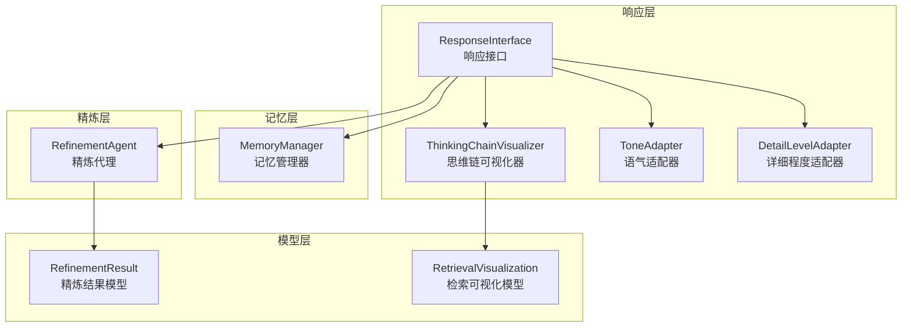
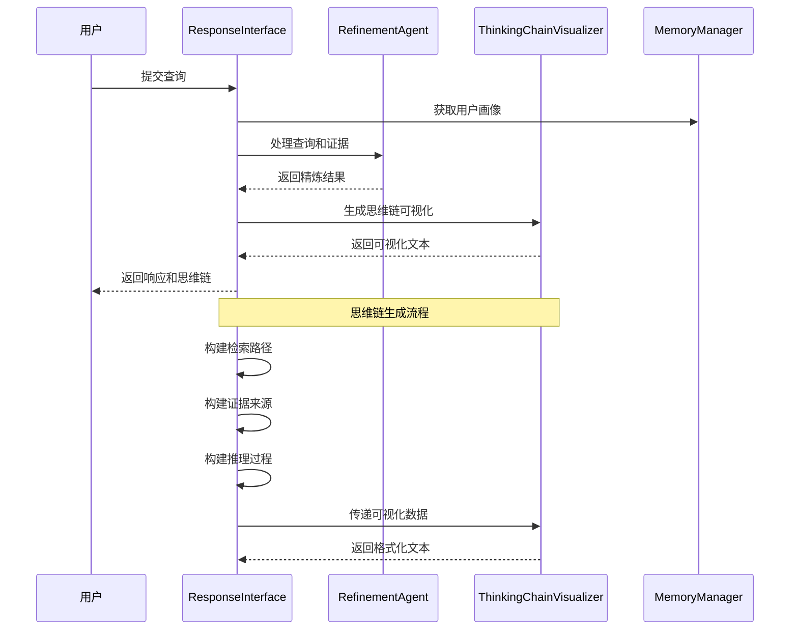
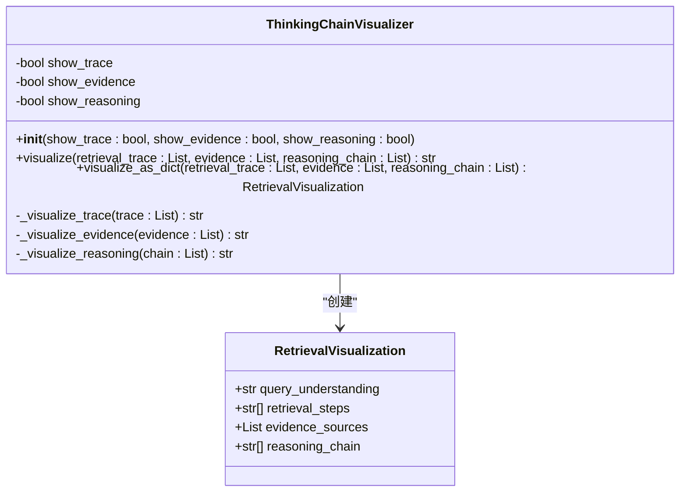
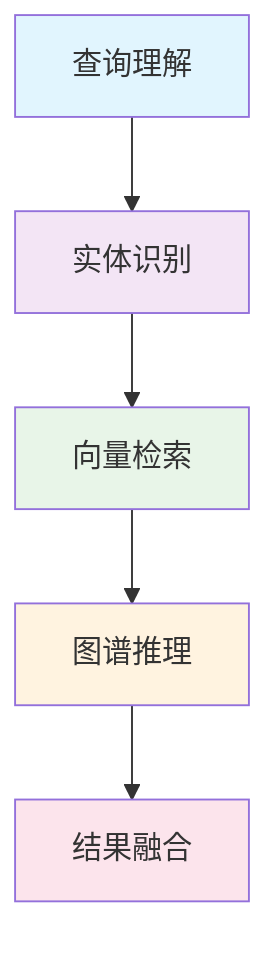
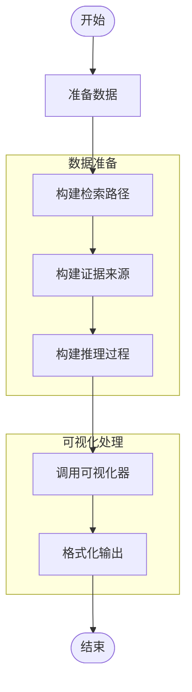
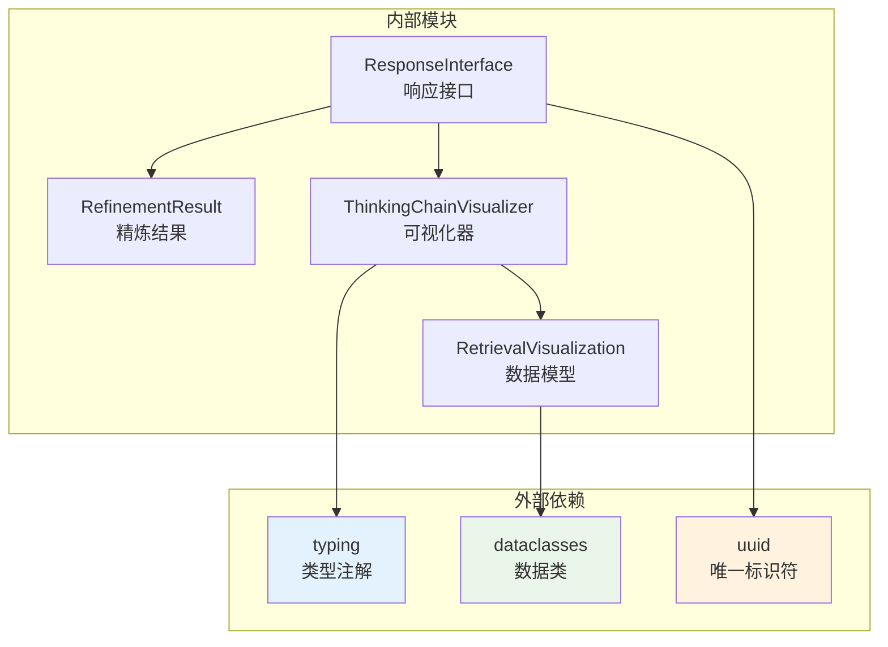

# 思维链可视化器

<cite>
**本文档引用的文件**
- [src/response/visualizer.py](file://src/response/visualizer.py)
- [src/response/models.py](file://src/response/models.py)
- [src/response/interface.py](file://src/response/interface.py)
- [src/refinement/models.py](file://src/refinement/models.py)
- [src/response/README.md](file://src/response/README.md)
- [wiki/wiki/交互层模块/思维链可视化.md](file://wiki/wiki/交互层模块/思维链可视化.md)
- [wiki/wiki/核心架构设计/五层认知架构/交互层 (L5)/思维链可视化器.md](file://wiki/wiki/核心架构设计/五层认知架构/交互层 (L5)/思维链可视化器.md)
- [example/example_usage.py](file://example/example_usage.py)
</cite>

## 目录
1. [简介](#简介)
2. [项目结构](#项目结构)
3. [核心组件](#核心组件)
4. [架构概览](#架构概览)
5. [详细组件分析](#详细组件分析)
6. [依赖关系分析](#依赖关系分析)
7. [性能考虑](#性能考虑)
8. [故障排除指南](#故障排除指南)
9. [结论](#结论)
10. [附录](#附录)

## 简介
思维链可视化器（ThinkingChainVisualizer）是 NecoRAG 交互层中的可解释性组件，负责将复杂的 AI 推理过程转化为用户可理解的可视化文本。该模块通过三个核心维度展示推理过程：
- 检索路径：从查询理解到最终答案的完整信息检索流程
- 证据来源：每个断言的证据支持与相关度评分
- 推理过程：多跳推理的逻辑链条与关键指标（置信度、迭代次数、幻觉检测）

该模块的设计理念是“让 AI 思考过程可见化”，帮助用户理解 AI 如何从输入查询到最终答案的完整思考路径，从而提升系统的可解释性与用户信任度。

## 项目结构
思维链可视化模块位于响应层，与记忆管理、检索、精炼等核心模块紧密集成。整个系统采用分层架构设计，确保各模块职责清晰且耦合度适中。



**图表来源**
- [src/response/interface.py:16-53](file://src/response/interface.py#L16-L53)
- [src/response/visualizer.py:9-35](file://src/response/visualizer.py#L9-L35)
- [src/refinement/models.py:38-46](file://src/refinement/models.py#L38-L46)

**章节来源**
- [src/response/visualizer.py:1-150](file://src/response/visualizer.py#L1-L150)
- [src/response/interface.py:1-224](file://src/response/interface.py#L1-L224)

## 核心组件
思维链可视化模块由三个核心组件构成，每个组件都有明确的职责和接口定义：

### ThinkingChainVisualizer 类
这是模块的核心类，负责将检索路径、证据来源和推理过程转换为用户友好的可视化文本。该类提供了灵活的配置选项，允许用户控制不同部分的显示。

### RetrievalVisualization 数据模型
这是一个结构化的数据模型，用于存储和传输思维链可视化的结构化信息。该模型确保了数据的一致性和完整性。

### ResponseInterface 集成层
响应接口负责协调整个思维链生成流程，从获取用户画像到最终生成可解释的响应。

**章节来源**
- [src/response/visualizer.py:9-149](file://src/response/visualizer.py#L9-L149)
- [src/response/models.py:24-31](file://src/response/models.py#L24-L31)
- [src/response/interface.py:16-132](file://src/response/interface.py#L16-L132)

## 架构概览
思维链可视化模块在整个 NecoRAG 框架中扮演着关键角色，作为可解释性输出的核心组件。其架构设计体现了模块化和可扩展性的原则。



**图表来源**
- [src/response/interface.py:55-211](file://src/response/interface.py#L55-L211)
- [src/response/visualizer.py:37-71](file://src/response/visualizer.py#L37-L71)

## 详细组件分析

### ThinkingChainVisualizer 类设计
ThinkingChainVisualizer 类采用了简洁而高效的设计模式，通过三个私有方法分别处理不同的可视化任务。



**图表来源**
- [src/response/visualizer.py:9-149](file://src/response/visualizer.py#L9-L149)
- [src/response/models.py:24-31](file://src/response/models.py#L24-L31)

#### 可视化格式规范
思维链可视化遵循一套标准化的格式规范，确保输出的一致性和可读性：

**检索路径格式**
- 使用 🔍 符号标识
- 每个步骤按序号排列
- 步骤描述简洁明了

**证据来源格式**
- 使用 📚 符号标识
- 最多显示前5条证据
- 包含证据编号、来源和相关度评分

**推理过程格式**
- 使用 🧠 符号标识
- 步骤按序号排列
- 包含置信度、迭代次数等关键指标

**章节来源**
- [src/response/visualizer.py:73-125](file://src/response/visualizer.py#L73-L125)

### 思维链构成要素分析

#### 检索路径 (Retrieval Trace)
检索路径展示了 AI 如何从原始查询逐步构建到最终答案的完整信息检索流程。每个步骤都代表了推理过程中的一个重要决策点。



**图表来源**
- [src/response/visualizer.py:13-16](file://src/response/visualizer.py#L13-L16)

#### 证据来源 (Evidence)
证据来源模块为每个断言提供可追溯的支持信息，增强了回答的可信度和可验证性。

**证据格式规范**
- 源头标识：使用统一的证据编号格式
- 相关度评分：数值范围 0-1，精确到小数点后两位
- 限制显示数量：最多显示前5条证据，避免信息过载

#### 推理过程 (Reasoning Chain)
推理过程展示了多跳推理的逻辑链条，帮助用户理解 AI 的决策依据和思维轨迹。

**推理指标**
- 置信度：反映答案的可靠性
- 迭代次数：显示推理的复杂程度
- 幻觉检测：提供答案质量评估

**章节来源**
- [src/response/interface.py:167-211](file://src/response/interface.py#L167-L211)

### 可视化生成流程
思维链可视化生成是一个多步骤的过程，涉及数据准备、格式化和最终输出。



**图表来源**
- [src/response/interface.py:167-211](file://src/response/interface.py#L167-L211)
- [src/response/visualizer.py:37-71](file://src/response/visualizer.py#L37-L71)

**章节来源**
- [src/response/interface.py:167-211](file://src/response/interface.py#L167-L211)
- [src/response/visualizer.py:37-125](file://src/response/visualizer.py#L37-L125)

## 依赖关系分析
思维链可视化模块的依赖关系相对简单，主要依赖于响应层的数据模型和精炼层的结果。



**图表来源**
- [src/response/visualizer.py:5-6](file://src/response/visualizer.py#L5-L6)
- [src/response/models.py:5-7](file://src/response/models.py#L5-L7)
- [src/response/interface.py:6-12](file://src/response/interface.py#L6-L12)

**章节来源**
- [src/response/visualizer.py:5-6](file://src/response/visualizer.py#L5-L6)
- [src/response/models.py:5-7](file://src/response/models.py#L5-L7)
- [src/response/interface.py:6-12](file://src/response/interface.py#L6-L12)

## 性能考虑
思维链可视化模块在设计时充分考虑了性能因素，确保在提供丰富信息的同时保持高效的执行速度。

### 时间复杂度分析
- **可视化生成**：O(n + m + k)，其中 n、m、k 分别为检索路径、证据来源和推理过程的长度
- **内存使用**：与输出内容大小成正比，通常为 O(n + m + k)
- **字符串操作**：主要为简单的格式化和连接操作，时间复杂度较低

### 优化策略
1. **证据数量限制**：最多显示前5条证据，避免大量数据影响性能
2. **条件渲染**：根据配置参数决定是否显示特定部分
3. **字符串缓存**：对重复使用的格式化模板进行缓存

### 性能基准
根据项目文档，思维链可视化模块的性能指标要求：
- **响应延迟**：< 200ms（适配和可视化）
- **用户满意度**：> 85%（主观评价）
- **风格匹配度**：> 80%（自动评估）
- **可解释性评分**：> 90%（用户反馈）

**章节来源**
- [src/response/README.md:376-383](file://src/response/README.md#L376-L383)

## 故障排除指南
### 常见问题及解决方案

#### 1. 可视化输出为空
**症状**：思维链可视化返回空字符串或只有部分输出

**可能原因**：
- 配置参数设置为不显示相应部分
- 输入数据为空或格式不正确
- 可视ization 方法参数缺失

**解决方法**：
- 检查 `show_trace`、`show_evidence`、`show_reasoning` 参数
- 验证输入数据的完整性和正确性
- 确保所有必需参数都已提供

#### 2. 证据显示异常
**症状**：证据来源显示不正确或数量超出预期

**可能原因**：
- 证据数据格式不符合预期
- 证据数量超过限制
- 字段名称不匹配

**解决方法**：
- 确保证据数据包含 `source` 和 `score` 字段
- 检查证据数量是否超过5条限制
- 验证字段名称和数据类型

#### 3. 性能问题
**症状**：思维链生成速度慢或内存占用过高

**可能原因**：
- 处理大量证据数据
- 频繁调用可视化方法
- 字符串操作过多

**解决方法**：
- 优化证据数据结构
- 减少不必要的可视化调用
- 考虑使用结构化输出替代

**章节来源**
- [src/response/visualizer.py:37-71](file://src/response/visualizer.py#L37-L71)
- [src/response/visualizer.py:90-108](file://src/response/visualizer.py#L90-L108)

## 结论
思维链可视化模块是 NecoRAG 框架中一个重要的创新性组件，它成功地将复杂的 AI 推理过程转化为用户可理解的可视化文本。该模块的设计体现了以下特点：

### 设计优势
1. **模块化设计**：清晰的职责分离和接口定义
2. **可配置性**：灵活的显示选项满足不同用户需求
3. **标准化格式**：统一的输出格式提升用户体验
4. **性能优化**：合理的限制和优化策略确保高效运行

### 技术特色
- **三层次可视化**：检索路径、证据来源、推理过程的完整展示
- **结构化输出**：支持文本和结构化两种输出格式
- **用户适应性**：与用户画像和查询复杂度动态适配
- **质量保证**：包含幻觉检测和置信度评估

### 应用价值
该模块为 NecoRAG 框架提供了强大的可解释性能力，有助于：
- 提升用户信任度和满意度
- 支持教育和培训场景
- 促进人机协作和决策制定
- 为 AI 系统的调试和优化提供支持

## 附录

### 使用示例

#### 基本使用方法
```python
# 初始化可视化器
visualizer = ThinkingChainVisualizer()

# 准备数据
retrieval_trace = ["查询理解：深度学习应用", "向量检索：相关文档", "结果融合：综合答案"]
evidence = [{"source": "文档1", "score": 0.95}, {"source": "文档2", "score": 0.87}]
reasoning_chain = ["置信度：0.91", "迭代次数：2"]

# 生成可视化
thinking_chain = visualizer.visualize(
    retrieval_trace=retrieval_trace,
    evidence=evidence,
    reasoning_chain=reasoning_chain
)
```

#### 高级配置
```python
# 自定义显示选项
visualizer = ThinkingChainVisualizer(
    show_trace=True,
    show_evidence=True,
    show_reasoning=False
)

# 获取结构化数据
structured_data = visualizer.visualize_as_dict(
    retrieval_trace=retrieval_trace,
    evidence=evidence,
    reasoning_chain=reasoning_chain
)
```

### 配置参数参考
| 参数名 | 类型 | 默认值 | 说明 |
|--------|------|--------|------|
| `show_trace` | bool | True | 是否显示检索路径 |
| `show_evidence` | bool | True | 是否显示证据来源 |
| `show_reasoning` | bool | True | 是否显示推理过程 |

### 数据模型说明

#### RetrievalVisualization 字段
| 字段名 | 类型 | 描述 |
|--------|------|------|
| `query_understanding` | str | 查询理解结果 |
| `retrieval_steps` | List[str] | 检索步骤列表 |
| `evidence_sources` | List[Dict] | 证据来源列表 |
| `reasoning_chain` | List[str] | 推理过程列表 |

### 可视化模板设计与格式规范
- **检索路径（retrieval_trace）**
  - 形式：有序步骤列表，强调"查询理解—检索—融合"的时间线
  - 建议：每步描述尽量简洁明确，突出关键动作与结果

- **证据来源（evidence）**
  - 形式：列表，每条包含来源标识与相关度评分（浮点数，保留两位小数）
  - 建议：控制展示数量（默认最多 5 条），优先展示高相关度证据

- **推理链条（reasoning_chain）**
  - 形式：指标与结论列表，包含置信度、迭代次数、幻觉检测等
  - 建议：使用统一的标签与数值格式，便于快速扫描与理解

### 可视化输出解读指南
- **检索路径**
  - 用于理解 AI 如何从查询出发，逐步定位与融合证据
  
- **证据来源**
  - 用于判断答案依据的可靠性与覆盖面，关注相关度评分
  
- **推理过程**
  - 用于评估答案的可信度与生成过程的合理性，关注置信度与迭代次数

### 自定义模板实现方法
- **方法一：继承与覆盖**
  - 继承 ThinkingChainVisualizer，重写 `_visualize_trace`、`_visualize_evidence`、`_visualize_reasoning`，以适配特定格式

- **方法二：策略模式**
  - 将各部分渲染逻辑抽象为策略，通过配置切换不同模板风格

- **方法三：结构化对象扩展**
  - 使用 `visualize_as_dict` 返回的 `RetrievalVisualization`，配合前端渲染器实现多样化展示

**章节来源**
- [src/response/visualizer.py:127-149](file://src/response/visualizer.py#L127-L149)
- [src/response/models.py:24-31](file://src/response/models.py#L24-L31)
- [src/response/README.md:174-195](file://src/response/README.md#L174-L195)