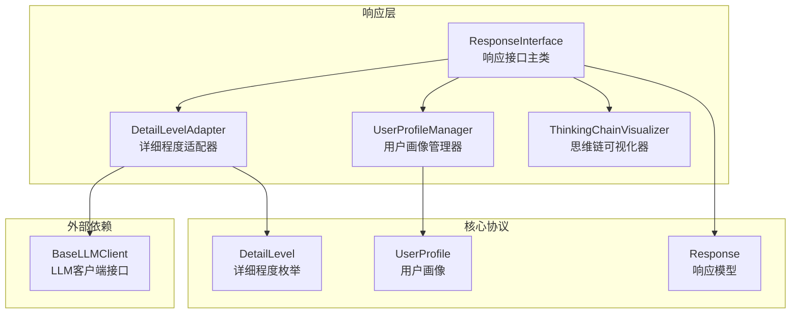
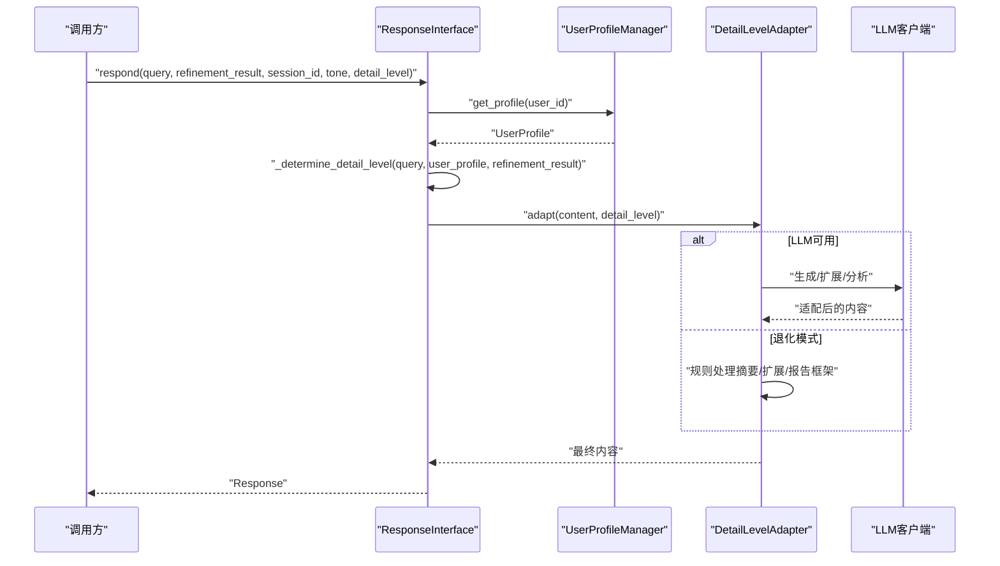
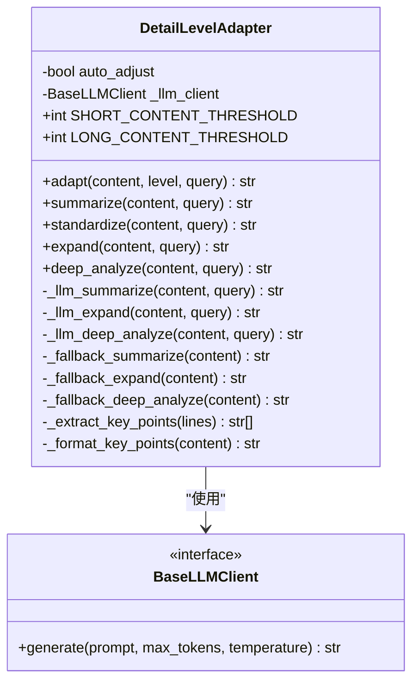
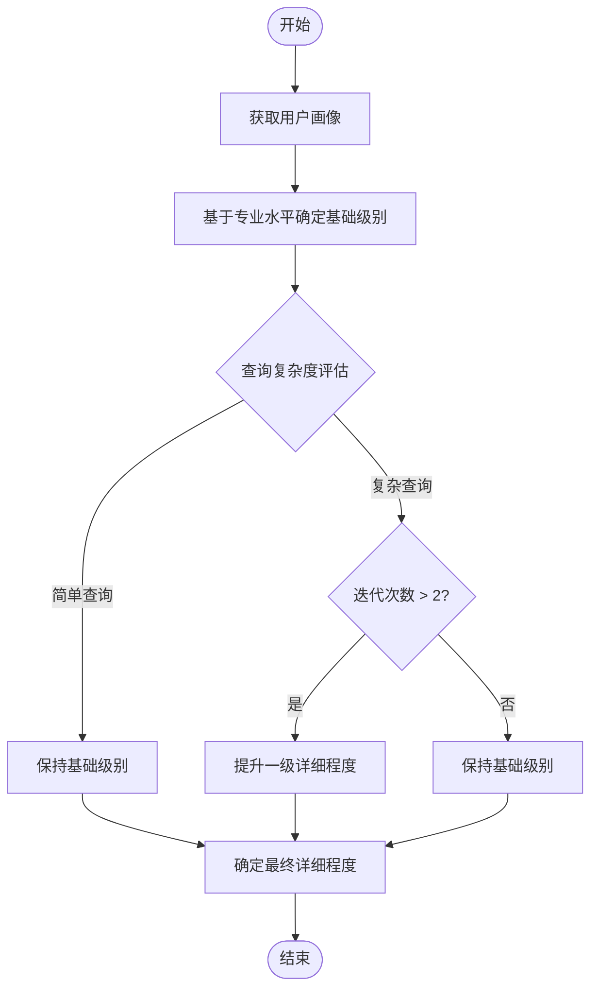
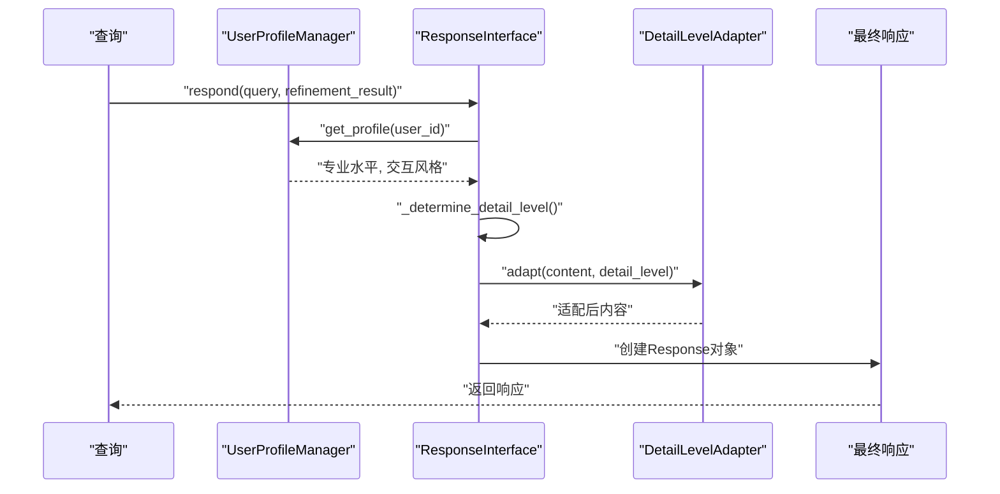
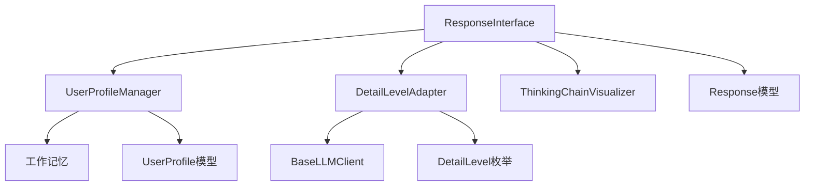

# 详细程度适配器

<cite>
**本文引用的文件**
- [src/response/detail_adapter.py](file://src/response/detail_adapter.py)
- [src/response/interface.py](file://src/response/interface.py)
- [src/response/profile_manager.py](file://src/response/profile_manager.py)
- [src/response/models.py](file://src/response/models.py)
- [src/core/protocols.py](file://src/core/protocols.py)
- [src/core/config.py](file://src/core/config.py)
- [example/example_usage.py](file://example/example_usage.py)
- [wiki/wiki/交互层模块/响应接口核心.md](file://wiki/wiki/交互层模块/响应接口核心.md)
- [wiki/wiki/核心架构设计/五层认知架构/交互层 (L5)/详细程度控制器.md](file://wiki/wiki/核心架构设计/五层认知架构/交互层 (L5)/详细程度控制器.md)
</cite>

## 目录
1. [简介](#简介)
2. [项目结构](#项目结构)
3. [核心组件](#核心组件)
4. [架构总览](#架构总览)
5. [详细组件分析](#详细组件分析)
6. [依赖关系分析](#依赖关系分析)
7. [性能考量](#性能考量)
8. [故障排除指南](#故障排除指南)
9. [结论](#结论)
10. [附录](#附录)

## 简介
本文件面向NecoRAG交互层的详细程度适配器（DetailLevelAdapter）进行深入技术说明，系统阐述其如何实现自适应的详细程度控制功能。文档覆盖以下重点：
- 四级详细程度（Level 1-4）的语义、适用场景与输出形态
- 详细程度确定算法：基于用户知识水平、查询复杂度与精炼迭代次数的动态调整
- 适配器的LLM增强模式与退化模式（规则处理）机制
- 与响应接口、用户画像管理器的协作流程
- 平衡信息完整性与用户体验的设计原则
- 优化策略与用户反馈收集机制的建议

## 项目结构
详细程度适配器位于响应层（src/response），与用户画像管理器、响应接口、思维链可视化器共同组成交互层的核心组件。其直接依赖包括：
- 用户画像管理器（UserProfileManager）：提供用户专业水平与偏好分析
- 响应接口（ResponseInterface）：协调语气、详细程度与思维链生成
- LLM客户端接口：用于增强模式下的内容生成与扩展
- 协议与模型：DetailLevel枚举、Response与UserProfile数据结构

**图表来源**
- [src/response/interface.py:20-58](file://src/response/interface.py#L20-L58)
- [src/response/detail_adapter.py:18-29](file://src/response/detail_adapter.py#L18-L29)
- [src/response/profile_manager.py:20-31](file://src/response/profile_manager.py#L20-L31)
- [src/core/protocols.py:58-64](file://src/core/protocols.py#L58-L64)
- [src/response/models.py:13-31](file://src/response/models.py#L13-L31)

**章节来源**
- [src/response/interface.py:20-58](file://src/response/interface.py#L20-L58)
- [src/response/detail_adapter.py:18-29](file://src/response/detail_adapter.py#L18-L29)
- [src/response/profile_manager.py:20-31](file://src/response/profile_manager.py#L20-L31)
- [src/core/protocols.py:58-64](file://src/core/protocols.py#L58-L64)
- [src/response/models.py:13-31](file://src/response/models.py#L13-L31)

## 核心组件
- DetailLevelAdapter：四层级详细程度适配器，支持简洁摘要、标准回答、详细解释与深度分析，并具备LLM增强与退化模式。
- UserProfileManager：分析用户画像，检测专业水平与交互风格，为详细程度决策提供依据。
- ResponseInterface：协调用户画像获取、详细程度计算、内容适配与思维链生成，封装最终响应。
- 协议与模型：DetailLevel枚举（BRIEF/STANDARD/DETAILED/COMPREHENSIVE）、Response与UserProfile数据结构。

**章节来源**
- [src/response/detail_adapter.py:18-94](file://src/response/detail_adapter.py#L18-L94)
- [src/response/profile_manager.py:20-141](file://src/response/profile_manager.py#L20-L141)
- [src/response/interface.py:20-173](file://src/response/interface.py#L20-L173)
- [src/core/protocols.py:58-64](file://src/core/protocols.py#L58-L64)
- [src/response/models.py:13-31](file://src/response/models.py#L13-L31)

## 架构总览
详细程度适配器在响应接口的协调下，完成从用户画像到最终响应的完整流程。其核心序列如下：

**图表来源**
- [src/response/interface.py:59-140](file://src/response/interface.py#L59-L140)
- [src/response/detail_adapter.py:64-94](file://src/response/detail_adapter.py#L64-L94)

**章节来源**
- [src/response/interface.py:59-140](file://src/response/interface.py#L59-L140)
- [src/response/detail_adapter.py:64-94](file://src/response/detail_adapter.py#L64-L94)

## 详细组件分析

### DetailLevelAdapter类详解
DetailLevelAdapter提供四层级详细程度的适配能力，支持LLM增强与退化模式，核心方法包括：
- adapt：根据level路由到对应适配方法
- summarize/standardize/expand/deep_analyze：分别生成简洁摘要、标准回答、详细解释与深度分析
- _llm_*与_fallback_*：LLM增强与规则退化两套实现
- _extract_key_points/_format_key_points：关键要点抽取与格式化

**图表来源**
- [src/response/detail_adapter.py:18-417](file://src/response/detail_adapter.py#L18-L417)

#### 四级详细程度与适用场景
- Level 1：简洁摘要（1-2句话）
  - 适用场景：快速信息获取、移动端浏览、紧急查询
  - 特点：高度概括，去除冗余信息，保留核心要点
  - 实现策略：内容长度阈值判断 + LLM摘要生成 + 退化模式处理
- Level 2：标准回答（1段话 + 要点）
  - 适用场景：日常咨询、一般性问题、平衡信息密度
  - 特点：完整但不过度详细，包含关键要点列表
  - 实现策略：内容分析 + 要点提取 + 结构化组织
- Level 3：详细解释（多段落 + 案例）
  - 适用场景：学习场景、需要理解背景、复杂概念解释
  - 特点：包含背景说明、具体示例、注意事项
  - 实现策略：LLM扩展 + 结构化框架 + 补充说明
- Level 4：深度分析（完整报告）
  - 适用场景：研究分析、决策支持、学术探讨
  - 特点：多角度分析、潜在问题识别、延伸思考
  - 实现策略：完整分析框架 + 多维度思考 + 结构化报告

**章节来源**
- [src/response/detail_adapter.py:95-417](file://src/response/detail_adapter.py#L95-L417)
- [wiki/wiki/核心架构设计/五层认知架构/交互层 (L5)/详细程度控制器.md:173-194](file://wiki/wiki/核心架构设计/五层认知架构/交互层 (L5)/详细程度控制器.md#L173-L194)

#### 详细程度确定算法
算法基于用户画像与查询复杂度动态调整，核心流程如下：

算法核心要素：
- 用户专业水平映射：初学者→Level 3，中级→Level 2，专家→Level 1
- 查询复杂度评估：基于精炼迭代次数和查询长度
- 迭代次数影响因子：每次迭代增加0.5级详细程度，最多+1级

**图表来源**
- [src/response/interface.py:142-173](file://src/response/interface.py#L142-L173)

**章节来源**
- [src/response/interface.py:142-173](file://src/response/interface.py#L142-L173)
- [wiki/wiki/核心架构设计/五层认知架构/交互层 (L5)/详细程度控制器.md:195-219](file://wiki/wiki/核心架构设计/五层认知架构/交互层 (L5)/详细程度控制器.md#L195-L219)

#### 适配器的LLM增强与退化模式
- LLM增强模式：在有可用LLM客户端时，通过专门prompt调用生成摘要、扩展与深度分析内容，保证输出质量与一致性。
- 退化模式：当LLM不可用或调用失败时，自动降级为规则处理（如提取首句、添加结构化框架、生成报告框架），确保系统可用性与基本体验。

**章节来源**
- [src/response/detail_adapter.py:117-144](file://src/response/detail_adapter.py#L117-L144)
- [src/response/detail_adapter.py:218-247](file://src/response/detail_adapter.py#L218-L247)
- [src/response/detail_adapter.py:294-330](file://src/response/detail_adapter.py#L294-L330)

### UserProfileManager与ResponseInterface集成
- UserProfileManager：分析用户查询历史，检测专业水平（beginner/intermediate/expert）与交互风格，支持规则与LLM两种检测模式。
- ResponseInterface：在respond主流程中获取用户画像，调用_determine_detail_level计算最终详细程度，随后进行语气与详细程度适配，并生成思维链可视化。

**图表来源**
- [src/response/interface.py:59-140](file://src/response/interface.py#L59-L140)
- [src/response/profile_manager.py:115-141](file://src/response/profile_manager.py#L115-L141)

**章节来源**
- [src/response/interface.py:59-140](file://src/response/interface.py#L59-L140)
- [src/response/profile_manager.py:115-141](file://src/response/profile_manager.py#L115-L141)

### 数据模型与协议
- DetailLevel枚举：BRIEF（简洁）、STANDARD（标准）、DETAILED（详细）、COMPREHENSIVE（全面）
- Response模型：包含content、thinking_chain、tone、detail_level、citations、metadata等字段
- UserProfile模型：包含knowledge_level、preferred_tone、preferred_detail等字段

**章节来源**
- [src/core/protocols.py:58-64](file://src/core/protocols.py#L58-L64)
- [src/response/models.py:13-31](file://src/response/models.py#L13-L31)
- [src/core/protocols.py:265-298](file://src/core/protocols.py#L265-L298)

## 依赖关系分析
- 组件耦合：ResponseInterface与DetailLevelAdapter松耦合，通过方法调用协作；UserProfileManager独立提供画像与偏好分析。
- 外部依赖：DetailLevelAdapter依赖LLM客户端接口；UserProfileManager依赖工作记忆；ResponseInterface依赖记忆管理器与精炼结果。
- 潜在循环依赖：当前实现未发现循环依赖，模块边界清晰。

**图表来源**
- [src/response/detail_adapter.py:12-16](file://src/response/detail_adapter.py#L12-L16)
- [src/response/profile_manager.py:14-17](file://src/response/profile_manager.py#L14-L17)
- [src/response/interface.py:7-14](file://src/response/interface.py#L7-L14)

**章节来源**
- [src/core/protocols.py:58-64](file://src/core/protocols.py#L58-L64)
- [src/response/models.py:13-31](file://src/response/models.py#L13-L31)

## 性能考量
- 计算复杂度：Level 1为O(n)简单字符串处理；Level 2为O(n)内容分析+要点提取；Level 3/4为O(n log n)，主要由LLM调用决定。
- 内存使用：内容适配按需处理，内存占用与内容长度线性相关；用户画像缓存支持TTL过期。
- 优化建议：
  - 合理设置内容长度阈值（SHORT/LONG），减少不必要的LLM调用
  - 增加用户画像与LLM响应缓存，降低重复计算
  - 在LLM不可用时实施退化模式，避免阻塞主线程
  - 对长文本进行分段处理，避免一次性处理超长字符串

**章节来源**
- [wiki/wiki/核心架构设计/五层认知架构/交互层 (L5)/详细程度控制器.md:336-355](file://wiki/wiki/核心架构设计/五层认知架构/交互层 (L5)/详细程度控制器.md#L336-L355)

## 故障排除指南
- LLM调用失败：检查LLM客户端连接状态、API密钥与权限；实施退化模式处理
- 用户画像为空：确认用户ID正确传递、工作记忆配置正常、查询历史记录有效
- 详细程度不匹配：调整默认详细程度参数、优化专业水平检测算法、增加用户反馈机制
- 异常处理建议：在respond中增加try-except包裹关键步骤，捕获与记录异常详情；对外部依赖调用使用统一异常类型

**章节来源**
- [src/response/detail_adapter.py:142-144](file://src/response/detail_adapter.py#L142-L144)
- [src/response/profile_manager.py:329-331](file://src/response/profile_manager.py#L329-L331)
- [wiki/wiki/交互层模块/响应接口核心.md:412-422](file://wiki/wiki/交互层模块/响应接口核心.md#L412-L422)

## 结论
详细程度适配器通过智能化的四层级内容适配机制，为NecoRAG系统提供了强大的个性化响应能力。其核心优势包括：
- 智能适应性：基于用户画像与查询复杂度的动态调整
- 多层级策略：从简洁到深度的完整内容层次覆盖
- 鲁棒性设计：LLM增强与退化模式的双重保障
- 可扩展性：模块化设计便于功能扩展与维护

该控制器不仅提升了用户体验，还为后续的功能扩展与优化奠定了坚实基础。

## 附录

### 不同用户群体的详细程度配置建议
- 初学者用户：推荐Level 3-4，降低专业水平映射，增加详细程度，启用详细解释与背景说明
- 中级用户：推荐Level 2-3，平衡信息密度与可读性，标准回答+关键要点
- 专家用户：推荐Level 1-2，提高专业水平映射，减少冗余信息，简洁摘要直达核心

**章节来源**
- [wiki/wiki/核心架构设计/五层认知架构/交互层 (L5)/详细程度控制器.md:398-414](file://wiki/wiki/核心架构设计/五层认知架构/交互层 (L5)/详细程度控制器.md#L398-L414)

### 个性化设置指导
- 用户画像配置：定期更新查询历史、监控用户对不同类型回答的反馈、基于满意度动态调整推荐策略
- 系统参数优化：根据内容类型调整长短内容阈值、控制LLM输出温度参数、平衡最大令牌数与响应速度

**章节来源**
- [wiki/wiki/核心架构设计/五层认知架构/交互层 (L5)/详细程度控制器.md:415-426](file://wiki/wiki/核心架构设计/五层认知架构/交互层 (L5)/详细程度控制器.md#L415-L426)

### 详细程度适配器的配置与使用示例
- 响应接口初始化与使用：参考示例文件中的ResponseInterface初始化与respond调用方式
- 默认详细程度配置：可在响应配置中设置默认详细程度（1-4）
- 详细程度枚举：通过DetailLevel枚举在协议层定义与传递

**章节来源**
- [example/example_usage.py:176-215](file://example/example_usage.py#L176-L215)
- [src/core/config.py:220-234](file://src/core/config.py#L220-L234)
- [src/core/protocols.py:58-64](file://src/core/protocols.py#L58-L64)