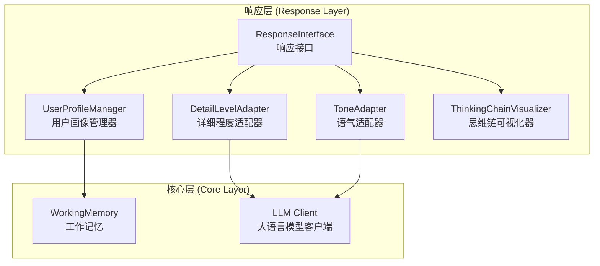
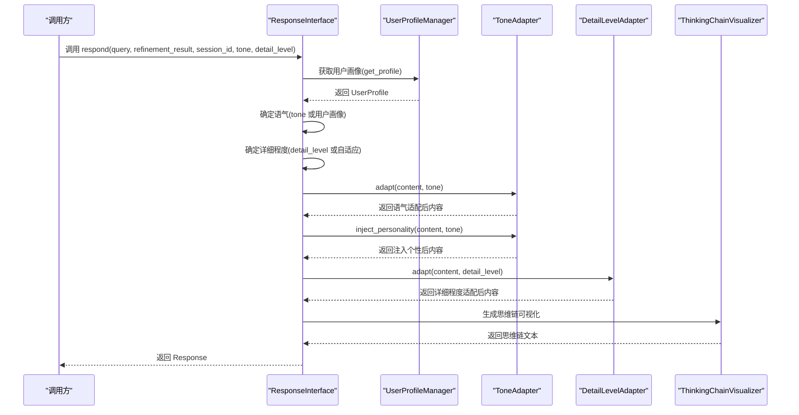
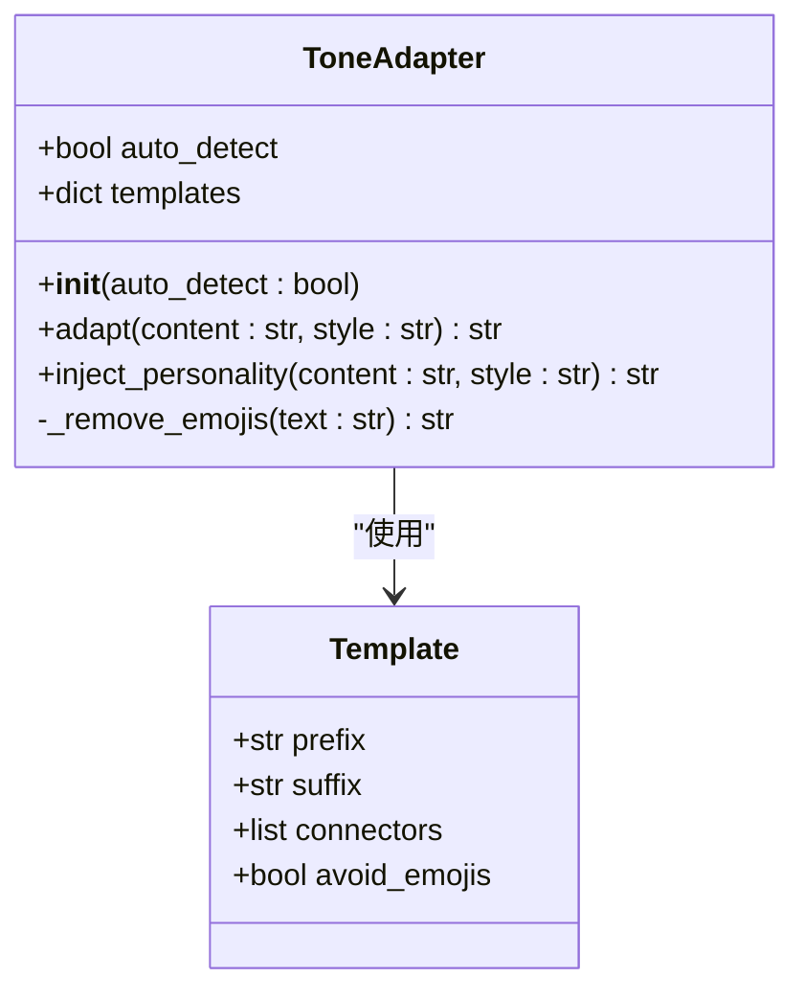
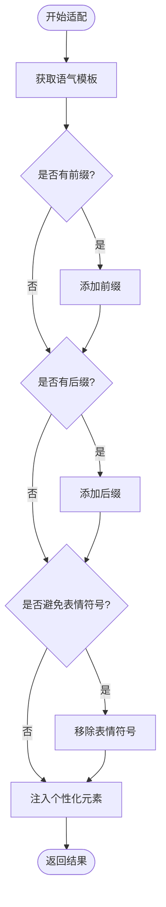
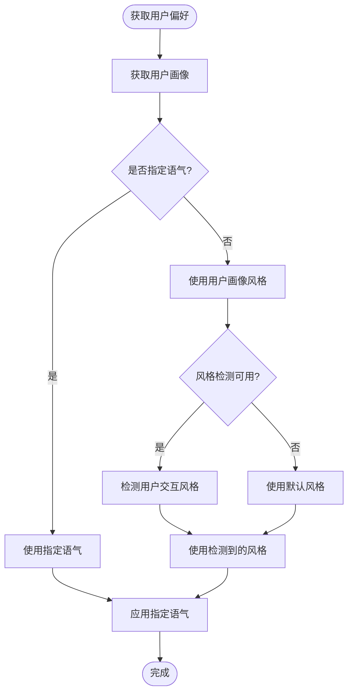
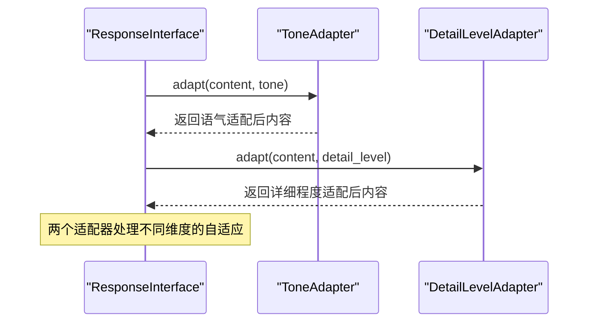
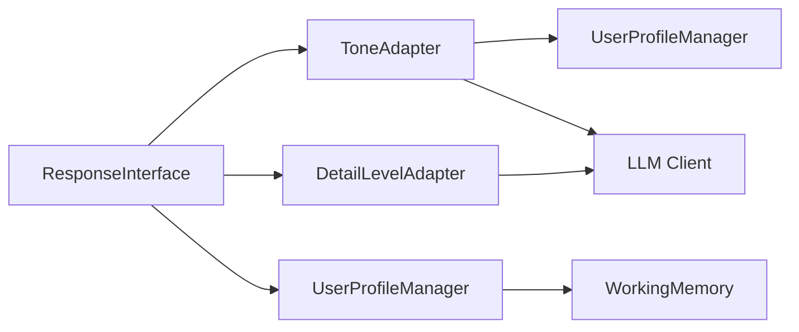

# 语气适配器

<cite>
**本文档引用的文件**
- [tone_adapter.py](file://src/response/tone_adapter.py)
- [interface.py](file://src/response/interface.py)
- [profile_manager.py](file://src/response/profile_manager.py)
- [models.py](file://src/response/models.py)
- [protocols.py](file://src/core/protocols.py)
- [detail_adapter.py](file://src/response/detail_adapter.py)
- [__init__.py](file://src/response/__init__.py)
- [example_usage.py](file://example/example_usage.py)
</cite>

## 目录
1. [简介](#简介)
2. [项目结构](#项目结构)
3. [核心组件](#核心组件)
4. [架构概览](#架构概览)
5. [详细组件分析](#详细组件分析)
6. [依赖关系分析](#依赖关系分析)
7. [性能考量](#性能考量)
8. [故障排除指南](#故障排除指南)
9. [结论](#结论)
10. [附录](#附录)

## 简介

NecoRAG语气适配器（ToneAdapter）是交互层响应接口的核心组件之一，负责实现情境自适应的语气调整功能。该组件能够根据用户画像、查询内容和上下文动态调整回答的正式程度和情感色彩，为用户提供个性化的人工智能交互体验。

语气适配器支持多种预定义的语气风格，包括专业严谨的正式风格、亲切友好的友好风格以及幽默轻松的幽默风格。通过模板驱动的设计模式，该组件能够灵活地注入个性化的语言元素，增强回答的人性化特征和可读性。

## 项目结构

NecoRAG项目采用模块化架构设计，语气适配器位于响应层（Response Layer），与用户画像管理器、详细程度适配器和思维链可视化器协同工作。



**图表来源**
- [interface.py:31-58](file://src/response/interface.py#L31-L58)
- [profile_manager.py:77-96](file://src/response/profile_manager.py#L77-L96)
- [tone_adapter.py:18-25](file://src/response/tone_adapter.py#L18-L25)

**章节来源**
- [interface.py:20-140](file://src/response/interface.py#L20-L140)
- [profile_manager.py:20-31](file://src/response/profile_manager.py#L20-L31)

## 核心组件

### ToneAdapter类

ToneAdapter是语气适配器的核心实现类，采用模板驱动的设计模式，支持三种预定义的语气风格：

#### 支持的语气类型

1. **正式风格 (Formal)**：专业严谨，适合商务场合和学术环境
   - 特征：避免表情符号，使用正式连接词
   - 适用场景：商业报告、学术论文、官方文档

2. **友好风格 (Friendly)**：亲切友好，适合日常交流
   - 特征：允许表情符号，使用温和连接词
   - 适用场景：客户服务、教育辅导、技术支持

3. **幽默风格 (Humorous)**：幽默轻松，适合娱乐和创意场景
   - 特征：包含幽默前缀和表情符号，使用趣味连接词
   - 适用场景：娱乐应用、创意写作、社交平台

#### 核心功能

- **语气适配** (`adapt`方法)：根据指定风格调整内容格式
- **个性化注入** (`inject_personality`方法)：在段落间注入连接词增强连贯性
- **表情符号控制**：根据语气风格自动处理表情符号

**章节来源**
- [tone_adapter.py:8-138](file://src/response/tone_adapter.py#L8-L138)

## 架构概览

语气适配器在整个NecoRAG架构中扮演着重要的角色，作为响应接口的子组件参与完整的响应生成流程。



**图表来源**
- [interface.py:59-140](file://src/response/interface.py#L59-L140)
- [tone_adapter.py:49-109](file://src/response/tone_adapter.py#L49-L109)

**章节来源**
- [interface.py:59-140](file://src/response/interface.py#L59-L140)

## 详细组件分析

### ToneAdapter类设计

ToneAdapter采用面向对象的设计模式，通过模板字典实现可扩展的语气适配功能。



**图表来源**
- [tone_adapter.py:8-138](file://src/response/tone_adapter.py#L8-L138)

#### 语气模板系统

每个语气风格都配置了相应的模板参数：

| 模板参数 | 正式风格 | 友好风格 | 幽默风格 |
|---------|---------|---------|---------|
| 前缀 | "" | "" | "哈哈，" |
| 后缀 | "" | "~" | " 😸" |
| 连接词 | ["因此","综上所述","根据分析"] | ["所以","这样看来","简单来说"] | ["有趣的是","惊喜吧","猜猜看"] |
| 表情符号 | True | False | False |

#### 适配算法逻辑

语气适配过程包含两个主要步骤：

1. **基础适配** (`adapt`方法)
   - 应用前缀和后缀模板
   - 根据风格设置移除表情符号
   - 返回基础语气调整后的内容

2. **个性化注入** (`inject_personality`方法)
   - 分割文本为段落
   - 在段落间注入连接词
   - 保持原文本结构完整性



**图表来源**
- [tone_adapter.py:49-109](file://src/response/tone_adapter.py#L49-L109)

**章节来源**
- [tone_adapter.py:49-138](file://src/response/tone_adapter.py#L49-L138)

### 与用户画像的集成

语气适配器与用户画像管理器紧密集成，能够根据用户的历史行为和偏好自动调整语气。



**图表来源**
- [interface.py:86-96](file://src/response/interface.py#L86-L96)
- [profile_manager.py:210-284](file://src/response/profile_manager.py#L210-L284)

**章节来源**
- [interface.py:86-96](file://src/response/interface.py#L86-L96)
- [profile_manager.py:210-284](file://src/response/profile_manager.py#L210-L284)

### 与详细程度适配器的协作

在响应生成过程中，语气适配器与详细程度适配器协同工作，共同实现情境自适应的输出。



**图表来源**
- [interface.py:102-107](file://src/response/interface.py#L102-L107)
- [detail_adapter.py:64-94](file://src/response/detail_adapter.py#L64-L94)

**章节来源**
- [interface.py:102-107](file://src/response/interface.py#L102-L107)

## 依赖关系分析

语气适配器与其他组件之间的依赖关系体现了模块化设计的优势。



**图表来源**
- [interface.py:31-58](file://src/response/interface.py#L31-L58)
- [profile_manager.py:77-96](file://src/response/profile_manager.py#L77-L96)
- [tone_adapter.py:18-25](file://src/response/tone_adapter.py#L18-L25)

### 外部依赖

- **LLM客户端**：可选依赖，用于高级风格检测和内容增强
- **工作记忆**：用于用户画像的持久化存储
- **类型系统**：使用Python枚举类型定义标准化的语气和详细程度

**章节来源**
- [protocols.py:51-64](file://src/core/protocols.py#L51-L64)
- [profile_manager.py:102-104](file://src/response/profile_manager.py#L102-L104)

## 性能考量

### 时间复杂度分析

- **基础适配** (`adapt`方法)：O(n)，其中n为内容长度
- **个性化注入** (`inject_personality`方法)：O(m)，其中m为段落数
- **表情符号移除**：O(k)，其中k为字符总数

### 空间复杂度分析

- **模板存储**：O(1)，固定大小的模板字典
- **文本处理**：O(n)，需要额外空间存储处理后的内容

### 优化策略

1. **模板复用**：预编译的表情符号范围列表减少重复计算
2. **惰性处理**：仅在需要时进行表情符号移除
3. **内存优化**：使用生成器模式处理大型文本内容

## 故障排除指南

### 常见问题及解决方案

1. **语气适配无效**
   - 检查输入的语气风格是否在支持范围内
   - 验证用户画像中是否正确设置了首选语气

2. **表情符号处理异常**
   - 确认表情符号范围列表是否正确配置
   - 检查文本编码格式是否兼容

3. **连接词注入效果不佳**
   - 验证文本是否包含多个段落
   - 检查连接词模板是否正确配置

**章节来源**
- [tone_adapter.py:111-138](file://src/response/tone_adapter.py#L111-L138)

## 结论

NecoRAG语气适配器通过其模块化设计和模板驱动的实现方式，成功地实现了情境自适应的语气调整功能。该组件不仅支持多种预定义的语气风格，还能够根据用户画像和上下文动态调整输出的正式程度和情感色彩。

通过与用户画像管理器、详细程度适配器和思维链可视化器的协同工作，语气适配器为用户提供了更加人性化和个性化的AI交互体验。其简洁的API设计和清晰的职责分离使其成为NecoRAG架构中不可或缺的重要组成部分。

## 附录

### 配置选项

| 参数名 | 类型 | 默认值 | 描述 |
|-------|------|--------|------|
| `auto_detect` | bool | True | 是否启用自动检测功能 |
| `templates` | dict | 内置模板 | 语气风格模板配置 |

### 使用示例

```python
# 基本使用
from src.response.tone_adapter import ToneAdapter

adapter = ToneAdapter()
content = "这是一个测试内容"
result = adapter.adapt(content, "friendly")

# 注入个性化元素
personalized = adapter.inject_personality(content, "humorous")
```

### 最佳实践

1. **风格选择**：根据应用场景选择合适的语气风格
2. **用户画像**：充分利用用户画像信息进行个性化适配
3. **渐进式调整**：从友好风格开始，根据用户反馈逐步调整
4. **测试验证**：定期测试不同风格的效果和用户接受度