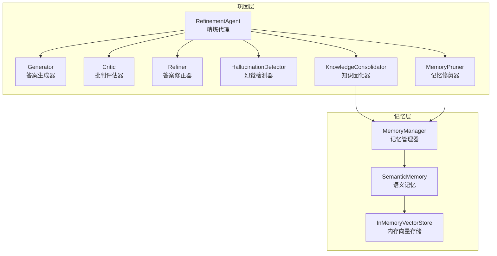
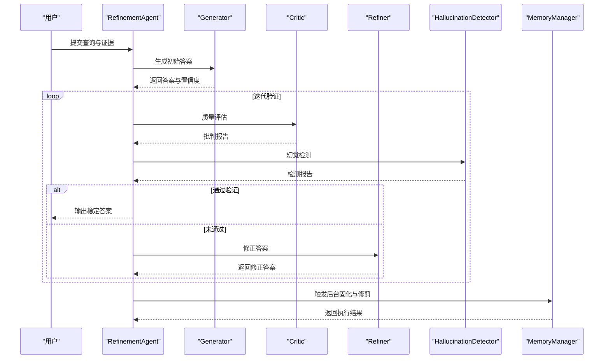
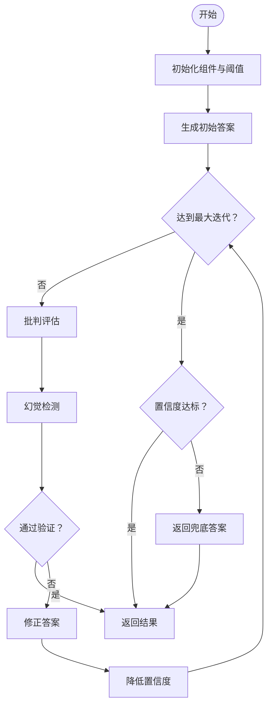
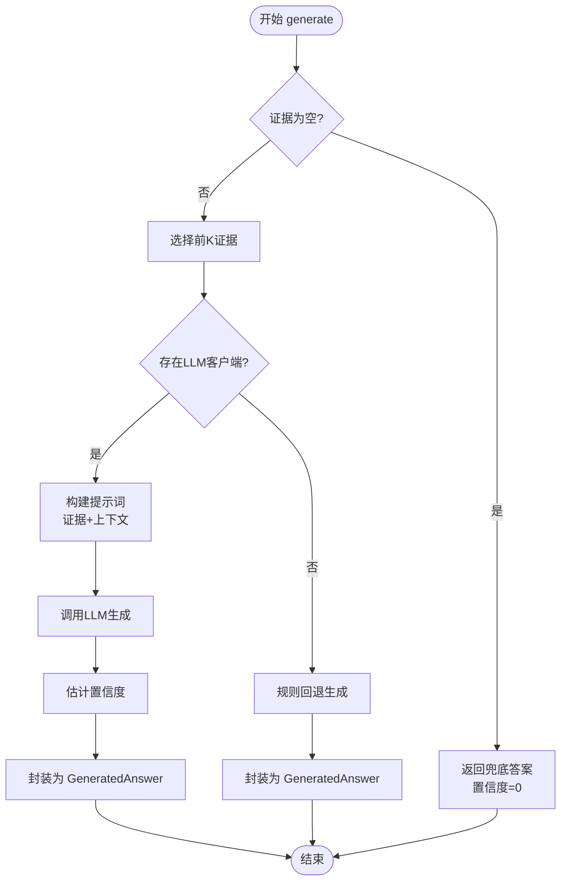
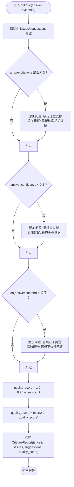
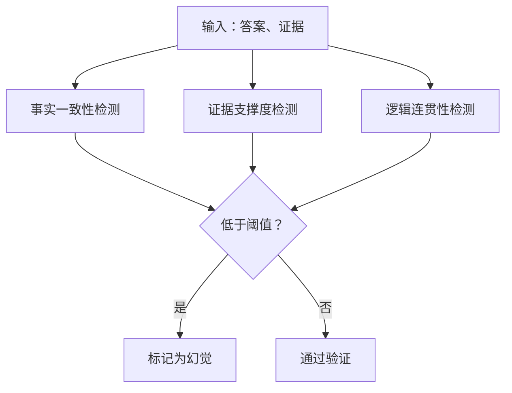
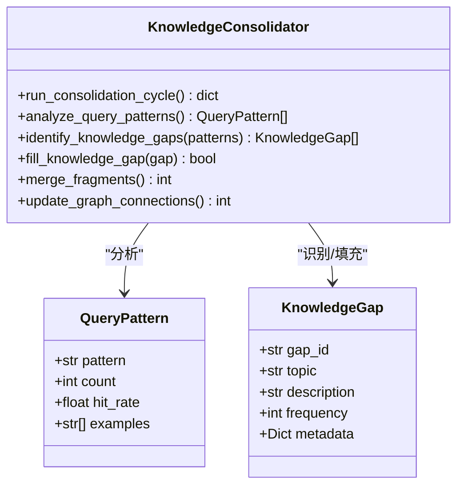
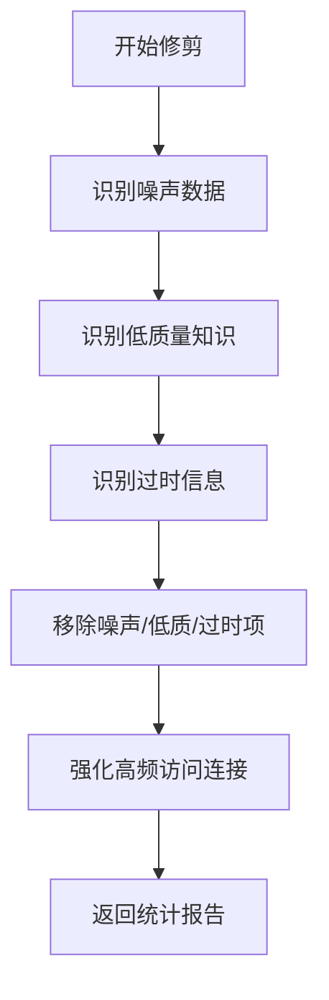
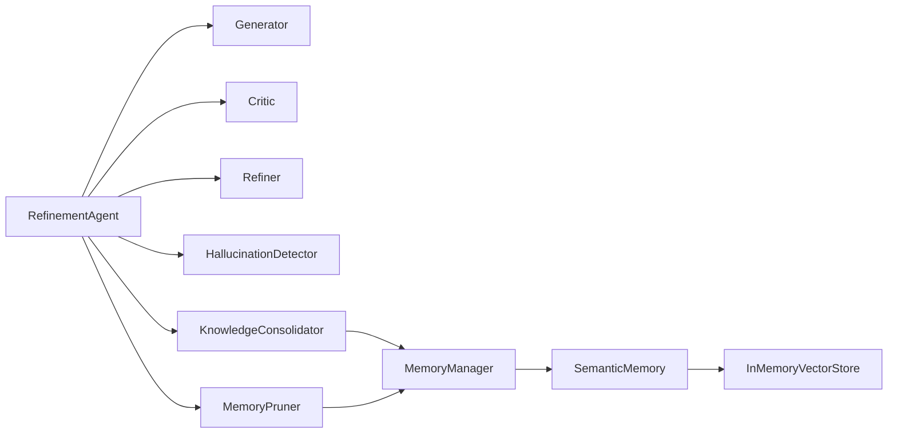

# 巩固层 (L4) - 知识处理与优化

<cite>
**本文引用的文件**
- [src/refinement/agent.py](file://src/refinement/agent.py)
- [src/refinement/generator.py](file://src/refinement/generator.py)
- [src/refinement/critic.py](file://src/refinement/critic.py)
- [src/refinement/refiner.py](file://src/refinement/refiner.py)
- [src/refinement/hallucination.py](file://src/refinement/hallucination.py)
- [src/refinement/consolidator.py](file://src/refinement/consolidator.py)
- [src/refinement/pruner.py](file://src/refinement/pruner.py)
- [src/refinement/models.py](file://src/refinement/models.py)
- [src/memory/manager.py](file://src/memory/manager.py)
- [src/memory/semantic_memory.py](file://src/memory/semantic_memory.py)
- [src/memory/backends/memory_store.py](file://src/memory/backends/memory_store.py)
- [src/core/base.py](file://src/core/base.py)
- [src/core/protocols.py](file://src/core/protocols.py)
- [src/core/llm/base.py](file://src/core/llm/base.py)
- [src/core/llm/mock.py](file://src/core/llm/mock.py)
- [src/core/config.py](file://src/core/config.py)
- [example/example_usage.py](file://example/example_usage.py)
- [wiki/wiki/巩固层模块/巩固层模块.md](file://wiki/wiki/巩固层模块/巩固层模块.md)
- [wiki/wiki/巩固层模块/精炼代理核心.md](file://wiki/wiki/巩固层模块/精炼代理核心.md)
- [wiki/wiki/巩固层模块/生成器组件.md](file://wiki/wiki/巩固层模块/生成器组件.md)
- [wiki/wiki/巩固层模块/批评者组件.md](file://wiki/wiki/巩固层模块/批评者组件.md)
- [wiki/wiki/巩固层模块/幻觉检测系统.md](file://wiki/wiki/巩固层模块/幻觉检测系统.md)
</cite>

## 目录
1. [简介](#简介)
2. [项目结构](#项目结构)
3. [核心组件](#核心组件)
4. [架构总览](#架构总览)
5. [详细组件分析](#详细组件分析)
6. [依赖关系分析](#依赖关系分析)
7. [性能考量](#性能考量)
8. [故障排查指南](#故障排查指南)
9. [结论](#结论)
10. [附录](#附录)

## 简介

巩固层（L4）是 NecoRAG 五层认知架构中的关键环节，负责"知识固化、幻觉自检与记忆修剪"。该层以"生成-批判-修正-验证"闭环为核心，结合三重验证体系（事实一致性、证据支撑度、逻辑连贯性），在输出稳定可靠答案的同时，持续优化知识库存与记忆结构。模块还提供异步知识固化与记忆修剪能力，保障长期运行的知识质量与系统性能。

巩固层的设计理念模拟人类大脑对信息的深度加工过程：通过多轮迭代验证、幻觉检测自检、知识固化沉淀和记忆修剪优化，实现从检索证据到高质量回答的深度处理与优化。

## 项目结构

巩固层模块位于 `src/refinement` 目录，围绕精炼代理 RefinementAgent 组织核心组件，并与记忆层（MemoryManager、SemanticMemory、MemoryStore）紧密协作，形成"检索-生成-验证-固化-修剪"的完整链路。

**图表来源**
- [src/refinement/agent.py:16-60](file://src/refinement/agent.py#L16-L60)
- [src/refinement/consolidator.py:9-34](file://src/refinement/consolidator.py#L9-L34)
- [src/refinement/pruner.py:10-40](file://src/refinement/pruner.py#L10-L40)
- [src/memory/manager.py:16-47](file://src/memory/manager.py#L16-L47)
- [src/memory/semantic_memory.py:21-49](file://src/memory/semantic_memory.py#L21-L49)
- [src/memory/backends/memory_store.py:20-41](file://src/memory/backends/memory_store.py#L20-L41)

## 核心组件

巩固层包含七个核心组件，每个组件都有明确的职责分工：

- **精炼代理 RefinementAgent**：协调生成、批判、修正与验证流程，驱动三重验证与迭代优化；支持异步知识固化与记忆修剪。
- **答案生成器 Generator**：基于检索证据生成答案，支持 LLM 客户端注入与规则回退，内置置信度评估。
- **批判评估器 Critic**：对答案进行质量评估，给出问题清单与改进建议，输出质量分数。
- **答案修正器 Refiner**：依据批判意见修正答案，动态调整置信度与引用。
- **幻觉检测器 HallucinationDetector**：三重验证（事实一致性、证据支撑度、逻辑连贯性）检测幻觉风险。
- **知识固化器 KnowledgeConsolidator**：分析高频未命中查询，自动补充知识缺口，合并碎片化知识，更新图谱连接。
- **记忆修剪器 MemoryPruner**：模拟"猫舔毛"行为，清理噪声、强化重要连接、维持知识时效性。

**章节来源**
- [src/refinement/agent.py:16-60](file://src/refinement/agent.py#L16-L60)
- [src/refinement/generator.py:15-50](file://src/refinement/generator.py#L15-L50)
- [src/refinement/critic.py:9-24](file://src/refinement/critic.py#L9-L24)
- [src/refinement/refiner.py:8-23](file://src/refinement/refiner.py#L8-L23)
- [src/refinement/hallucination.py:9-33](file://src/refinement/hallucination.py#L9-L33)
- [src/refinement/consolidator.py:9-34](file://src/refinement/consolidator.py#L9-L34)
- [src/refinement/pruner.py:10-40](file://src/refinement/pruner.py#L10-L40)

## 架构总览

巩固层采用"生成-批判-修正-验证"闭环，配合三重验证与迭代控制，确保输出质量与可靠性。同时，通过记忆管理器与语义记忆实现与检索层的数据互通，支持异步知识固化与记忆修剪。

**图表来源**
- [src/refinement/agent.py:61-129](file://src/refinement/agent.py#L61-L129)
- [src/refinement/generator.py:67-101](file://src/refinement/generator.py#L67-L101)
- [src/refinement/critic.py:25-72](file://src/refinement/critic.py#L25-L72)
- [src/refinement/refiner.py:24-64](file://src/refinement/refiner.py#L24-L64)
- [src/refinement/hallucination.py:34-75](file://src/refinement/hallucination.py#L34-L75)
- [src/memory/manager.py:114-147](file://src/memory/manager.py#L114-L147)

## 详细组件分析

### 精炼代理 RefinementAgent

精炼代理是巩固层的主控制器，负责协调整个精炼流程。其核心职责包括：

- **组件编排**：初始化并协调 Generator、Critic、Refiner、HallucinationDetector 组件
- **迭代控制**：管理最大迭代次数和最低置信度阈值
- **验证循环**：执行"生成-批判-修正-幻觉检测"的完整闭环
- **异步任务**：运行知识固化与记忆修剪后台任务

精炼代理的处理流程采用"生成-批判-修正-验证"的迭代模式，通过三重验证确保答案质量：

**图表来源**
- [src/refinement/agent.py:61-129](file://src/refinement/agent.py#L61-L129)

**章节来源**
- [src/refinement/agent.py:16-60](file://src/refinement/agent.py#L16-L60)
- [src/refinement/agent.py:61-129](file://src/refinement/agent.py#L61-L129)
- [src/refinement/agent.py:130-151](file://src/refinement/agent.py#L130-L151)

### 答案生成器 Generator

答案生成器负责基于检索证据生成高质量答案，具有以下特点：

- **双路径设计**：支持 LLM 客户端注入与规则回退
- **证据管理**：限制最大证据数量，避免上下文过长
- **置信度评估**：综合证据数量、答案长度、关键词覆盖度
- **引用标注**：为每个证据分配引用 ID

生成器的核心算法包括证据选择、提示词构建、LLM 调用和置信度估计：

**图表来源**
- [src/refinement/generator.py:67-101](file://src/refinement/generator.py#L67-L101)
- [src/refinement/generator.py:102-141](file://src/refinement/generator.py#L102-L141)
- [src/refinement/generator.py:142-174](file://src/refinement/generator.py#L142-L174)
- [src/refinement/generator.py:176-208](file://src/refinement/generator.py#L176-L208)

**章节来源**
- [src/refinement/generator.py:15-50](file://src/refinement/generator.py#L15-L50)
- [src/refinement/generator.py:67-101](file://src/refinement/generator.py#L67-L101)
- [src/refinement/generator.py:102-175](file://src/refinement/generator.py#L102-L175)
- [src/refinement/generator.py:176-208](file://src/refinement/generator.py#L176-L208)

### 批判评估器 Critic

批判评估器对生成的答案进行全面质量评估，提供多维度的反馈：

- **评估维度**：事实性、完整性、相关性
- **评分机制**：加权计算质量分数
- **问题识别**：发现证据缺失、置信度过低、答案不完整等问题
- **改进建议**：提供具体的修正建议

批判评估器的算法流程：

**图表来源**
- [src/refinement/critic.py:25-71](file://src/refinement/critic.py#L25-L71)

**章节来源**
- [src/refinement/critic.py:9-24](file://src/refinement/critic.py#L9-L24)
- [src/refinement/critic.py:25-72](file://src/refinement/critic.py#L25-L72)
- [src/refinement/models.py:28-35](file://src/refinement/models.py#L28-L35)

### 答案修正器 Refiner

答案修正器根据批判报告对答案进行精确修正，具有以下特点：

- **迭代修正**：支持多次迭代直到质量达标
- **证据融合**：将补充证据自然融入到答案中
- **置信度调整**：基于原始置信度和批判评分动态调整
- **规则回退**：在无 LLM 时提供规则化修正方案

修正器的核心流程包括问题分析、证据整合和答案重构。

**章节来源**
- [src/refinement/refiner.py:8-23](file://src/refinement/refiner.py#L8-L23)
- [src/refinement/refiner.py:24-64](file://src/refinement/refiner.py#L24-L64)
- [src/refinement/models.py:19-26](file://src/refinement/models.py#L19-L26)

### 幻觉检测器 HallucinationDetector

幻觉检测器是巩固层的核心质量保障组件，采用三重验证机制：

- **事实一致性检测**：基于关键词重叠分析答案与证据的一致性
- **逻辑连贯性检测**：评估答案的推理链条完整性和语言表达合理性  
- **证据支撑度检测**：分析可用证据对答案的支持程度

检测器的算法原理：

**图表来源**
- [src/refinement/hallucination.py:34-75](file://src/refinement/hallucination.py#L34-L75)
- [src/refinement/hallucination.py:77-108](file://src/refinement/hallucination.py#L77-L108)
- [src/refinement/hallucination.py:131-154](file://src/refinement/hallucination.py#L131-L154)

**章节来源**
- [src/refinement/hallucination.py:9-33](file://src/refinement/hallucination.py#L9-L33)
- [src/refinement/hallucination.py:34-75](file://src/refinement/hallucination.py#L34-L75)
- [src/refinement/hallucination.py:77-108](file://src/refinement/hallucination.py#L77-L108)
- [src/refinement/hallucination.py:109-154](file://src/refinement/hallucination.py#L109-L154)

### 知识固化器 KnowledgeConsolidator

知识固化器负责将高质量的问答对固化到知识库中，具有以下功能：

- **查询模式分析**：识别高频未命中查询模式
- **知识缺口识别**：基于查询模式识别知识空白
- **碎片知识合并**：将相似的知识片段合并为完整知识条目
- **图谱连接更新**：基于新固化知识更新知识图谱关系

固化器的工作流程：

**图表来源**
- [src/refinement/consolidator.py:9-34](file://src/refinement/consolidator.py#L9-L34)
- [src/refinement/consolidator.py:35-62](file://src/refinement/consolidator.py#L35-L62)
- [src/refinement/consolidator.py:63-102](file://src/refinement/consolidator.py#L63-L102)
- [src/refinement/consolidator.py:104-142](file://src/refinement/consolidator.py#L104-L142)
- [src/refinement/models.py:60-66](file://src/refinement/models.py#L60-L66)
- [src/refinement/models.py:50-57](file://src/refinement/models.py#L50-L57)

**章节来源**
- [src/refinement/consolidator.py:9-34](file://src/refinement/consolidator.py#L9-L34)
- [src/refinement/consolidator.py:35-62](file://src/refinement/consolidator.py#L35-L62)
- [src/refinement/consolidator.py:63-102](file://src/refinement/consolidator.py#L63-L102)
- [src/refinement/consolidator.py:104-142](file://src/refinement/consolidator.py#L104-L142)
- [src/refinement/models.py:50-66](file://src/refinement/models.py#L50-L66)

### 记忆修剪器 MemoryPruner

记忆修剪器模拟"猫舔毛"行为，维护知识库的整洁和有效性：

- **噪声识别**：识别低权重且低访问次数的噪声数据
- **低质量清理**：删除短内容且低权重的低质量知识
- **过时清理**：移除超过设定天数未访问的过时信息
- **重要连接强化**：提升高频访问记忆的权重

修剪器的算法流程：

**图表来源**
- [src/refinement/pruner.py:41-69](file://src/refinement/pruner.py#L41-L69)
- [src/refinement/pruner.py:71-101](file://src/refinement/pruner.py#L71-L101)
- [src/refinement/pruner.py:103-118](file://src/refinement/pruner.py#L103-L118)
- [src/refinement/pruner.py:120-137](file://src/refinement/pruner.py#L120-L137)
- [src/refinement/pruner.py:139-157](file://src/refinement/pruner.py#L139-L157)

**章节来源**
- [src/refinement/pruner.py:10-40](file://src/refinement/pruner.py#L10-L40)
- [src/refinement/pruner.py:41-69](file://src/refinement/pruner.py#L41-L69)
- [src/refinement/pruner.py:71-157](file://src/refinement/pruner.py#L71-L157)

## 依赖关系分析

巩固层的组件耦合关系体现了清晰的分层架构设计：

**图表来源**
- [src/refinement/agent.py:48-60](file://src/refinement/agent.py#L48-L60)
- [src/refinement/consolidator.py:32-33](file://src/refinement/consolidator.py#L32-L33)
- [src/refinement/pruner.py:36-39](file://src/refinement/pruner.py#L36-L39)
- [src/memory/manager.py:40-43](file://src/memory/manager.py#L40-L43)
- [src/memory/semantic_memory.py:21-49](file://src/memory/semantic_memory.py#L21-L49)
- [src/memory/backends/memory_store.py:20-41](file://src/memory/backends/memory_store.py#L20-L41)

### 外部依赖

- **LLM 客户端注入**：Generator 默认回退到 Mock 实现，支持多种 LLM 提供商
- **记忆层接口抽象**：统一的 MemoryManager、SemanticMemory 接口
- **配置管理**：通过 core/config.py 集中管理 LLM 参数和阈值设置

**章节来源**
- [src/refinement/agent.py:48-60](file://src/refinement/agent.py#L48-L60)
- [src/memory/manager.py:40-43](file://src/memory/manager.py#L40-L43)

## 性能考量

巩固层在设计时充分考虑了性能优化：

### 生成阶段优化
- **证据数量控制**：通过 max_evidence 参数限制上下文长度，避免 LLM 输入过长导致延迟与成本上升
- **置信度评估**：轻量计算减少额外开销
- **规则回退**：在无 LLM 客户端时快速返回，但置信度较低

### 评估与修正优化
- **启发式规则**：批判与修正采用启发式规则，复杂度低
- **阈值控制**：通过配置参数平衡严格性与召回率

### 记忆层优化
- **语义检索**：使用余弦相似度，复杂度与向量维度、样本量相关
- **内存存储**：适合小规模场景，生产环境建议集成外部向量库

### 异步任务优化
- **后台执行**：知识固化与记忆修剪在后台执行，避免阻塞主线程
- **任务调度**：支持定时任务和事件驱动的异步处理

## 故障排查指南

### 幻觉检测问题
- **频繁误报**：检查证据数量与质量，适当增加检索 top_k 或优化检索策略；调整事实一致性与证据支撑度阈值
- **漏报问题**：提高检测阈值，增强检测算法，收集更多相关证据

### 答案质量优化
- **置信度过低**：增加证据数量或提升证据相关性；优化提示词与上下文注入
- **答案过短**：提升生成长度或引导模型提供更详细回答

### 迭代控制问题
- **迭代次数过多**：检查批判报告中的问题与建议，针对性补充证据；适当放宽最低置信度阈值

### 记忆修剪问题
- **误删重要知识**：调整噪声、低质量与过时阈值；增加访问计数与权重阈值
- **修剪效果不佳**：优化修剪策略，定期执行修剪任务

### LLM 客户端问题
- **客户端不可用**：确认客户端注入与 Mock 回退逻辑；检查网络与认证配置

**章节来源**
- [src/refinement/hallucination.py:19-33](file://src/refinement/hallucination.py#L19-L33)
- [src/refinement/generator.py:25-50](file://src/refinement/generator.py#L25-L50)
- [src/refinement/agent.py:27-47](file://src/refinement/agent.py#L27-L47)
- [src/refinement/pruner.py:20-40](file://src/refinement/pruner.py#L20-L40)

## 结论

巩固层模块通过"生成-批判-修正-验证"闭环与三重验证体系，有效提升了答案的可靠性与一致性；结合异步知识固化与记忆修剪，持续优化知识质量与系统性能。该模块的设计理念模拟人类大脑对信息的深度加工过程，通过多轮迭代验证、幻觉检测自检、知识固化沉淀和记忆修剪优化，实现从检索证据到高质量回答的深度处理与优化。

建议在实际部署中逐步完善各组件的启发式规则，引入 LLM 评估与修正，并结合外部向量库与图数据库，以满足更大规模与更高精度的需求。通过合理的参数配置、监控告警和任务调度，巩固层能够为 NecoRAG 系统提供稳定可靠的知识处理与优化能力。

## 附录

### 三重验证体系实现细节

巩固层采用的三重验证体系包括：

- **事实一致性**：基于关键词重叠比例衡量答案与证据的一致程度
- **证据支撑度**：基于证据数量进行粗略估计，证据越多支撑越强  
- **逻辑连贯性**：基于答案长度与常见逻辑连接词出现概率进行评估

### 幻觉检测算法原理

- **事实一致性**：统计答案词汇与证据词汇的交集占答案词汇的比例
- **证据支撑度**：线性映射证据数量到 0-1 区间
- **逻辑连贯性**：基于答案长度与逻辑连接词存在性进行评分

### 知识修剪策略

- **噪声识别**：低权重且低访问次数
- **低质量识别**：短内容且低权重  
- **过时识别**：超过设定天数未访问
- **强化策略**：高频访问记忆权重提升

### 使用示例与最佳实践

巩固层提供了完整的使用示例和最佳实践：

- **基础使用**：初始化 RefinementAgent，准备 evidence，调用 process 获取 RefinementResult
- **异步知识固化**：调用 run_background_tasks 获取固化与修剪结果
- **配置优化**：通过 core/config.py 集中管理 LLM 提供商、温度、最大 token 等参数

**章节来源**
- [example/example_usage.py:139-173](file://example/example_usage.py#L139-L173)
- [src/core/config.py:389-396](file://src/core/config.py#L389-L396)