# 幻觉检测器

<cite>
**本文档引用的文件**
- [hallucination.py](file://src/refinement/hallucination.py)
- [models.py](file://src/refinement/models.py)
- [base.py](file://src/core/base.py)
- [mock.py](file://src/core/llm/mock.py)
- [agent.py](file://src/refinement/agent.py)
- [critic.py](file://src/refinement/critic.py)
- [example_usage.py](file://example/example_usage.py)
</cite>

## 目录
1. [简介](#简介)
2. [项目结构](#项目结构)
3. [核心组件](#核心组件)
4. [架构概览](#架构概览)
5. [详细组件分析](#详细组件分析)
6. [依赖关系分析](#依赖关系分析)
7. [性能考虑](#性能考虑)
8. [故障排除指南](#故障排除指南)
9. [结论](#结论)

## 简介
NecoRAG 幻觉检测器（HallucinationDetector）是 NecoRAG 框架中的关键质量保障组件，专门用于检测和识别生成答案中的虚假信息和不准确陈述。该检测器采用多维度评估方法，结合大语言模型（LLM）和规则引擎，能够有效区分已知知识和未知假设，避免生成包含幻觉内容的答案。

幻觉检测器主要关注三个核心维度：
- **事实一致性**：检查答案是否与提供的证据事实一致
- **逻辑连贯性**：评估答案内部逻辑是否自洽
- **证据支撑度**：验证每个声明是否有充分的证据支撑

## 项目结构
NecoRAG 采用模块化的架构设计，幻觉检测器位于精炼层（Refinement Layer）中，与生成器、批判器、修正器等组件协同工作。

```mermaid
graph TB
subgraph "NecoRAG 架构"
subgraph "感知层"
Perception[Perception Engine]
end
subgraph "记忆层"
Memory[Memory Manager]
end
subgraph "检索层"
Retriever[Adaptive Retriever]
end
subgraph "巩固层"
Generator[Generator]
Critic[Critic]
Refiner[Refiner]
HallucinationDetector[HallucinationDetector]
KnowledgeConsolidator[KnowledgeConsolidator]
MemoryPruner[MemoryPruner]
end
subgraph "响应层"
ResponseInterface[Response Interface]
end
end
Perception --> Memory
Memory --> Retriever
Retriever --> Generator
Generator --> Critic
Critic --> HallucinationDetector
HallucinationDetector --> Refiner
Refiner --> KnowledgeConsolidator
KnowledgeConsolidator --> MemoryPruner
MemoryPruner --> ResponseInterface
```

**图表来源**
- [agent.py:20-64](file://src/refinement/agent.py#L20-L64)
- [hallucination.py:18-26](file://src/refinement/hallucination.py#L18-L26)

## 核心组件

### 幻觉检测器类结构

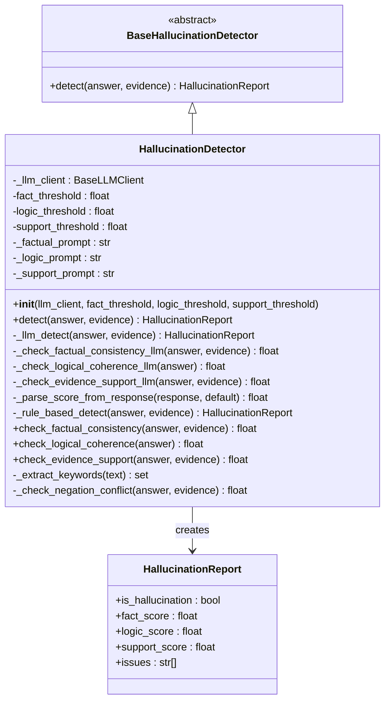

**图表来源**
- [base.py:518-537](file://src/core/base.py#L518-L537)
- [hallucination.py:18-507](file://src/refinement/hallucination.py#L18-L507)
- [models.py:9-17](file://src/refinement/models.py#L9-L17)

**章节来源**
- [base.py:518-537](file://src/core/base.py#L518-L537)
- [hallucination.py:18-507](file://src/refinement/hallucination.py#L18-L507)
- [models.py:9-17](file://src/refinement/models.py#L9-L17)

## 架构概览
幻觉检测器在整个 NecoRAG 框架中扮演着质量控制中心的角色，与精炼代理（RefinementAgent）紧密集成。

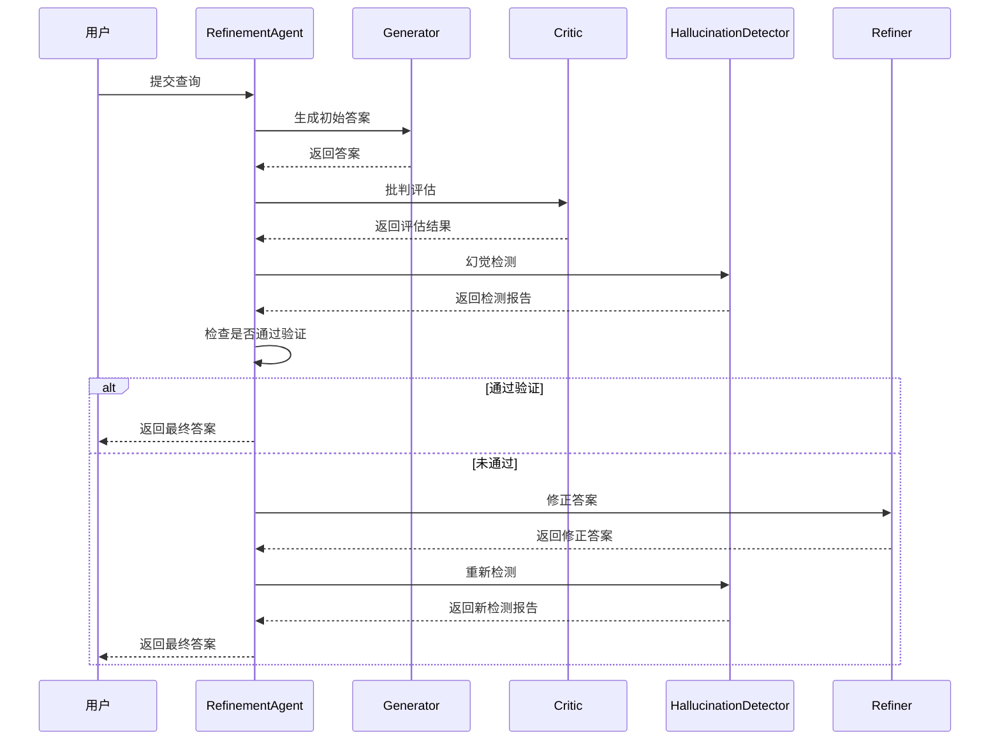

**图表来源**
- [agent.py:65-141](file://src/refinement/agent.py#L65-L141)
- [hallucination.py:136-193](file://src/refinement/hallucination.py#L136-L193)

**章节来源**
- [agent.py:65-141](file://src/refinement/agent.py#L65-L141)
- [hallucination.py:136-193](file://src/refinement/hallucination.py#L136-L193)

## 详细组件分析

### 检测流程控制
幻觉检测器采用双模式检测策略，既支持基于 LLM 的智能检测，也提供基于规则的降级方案。

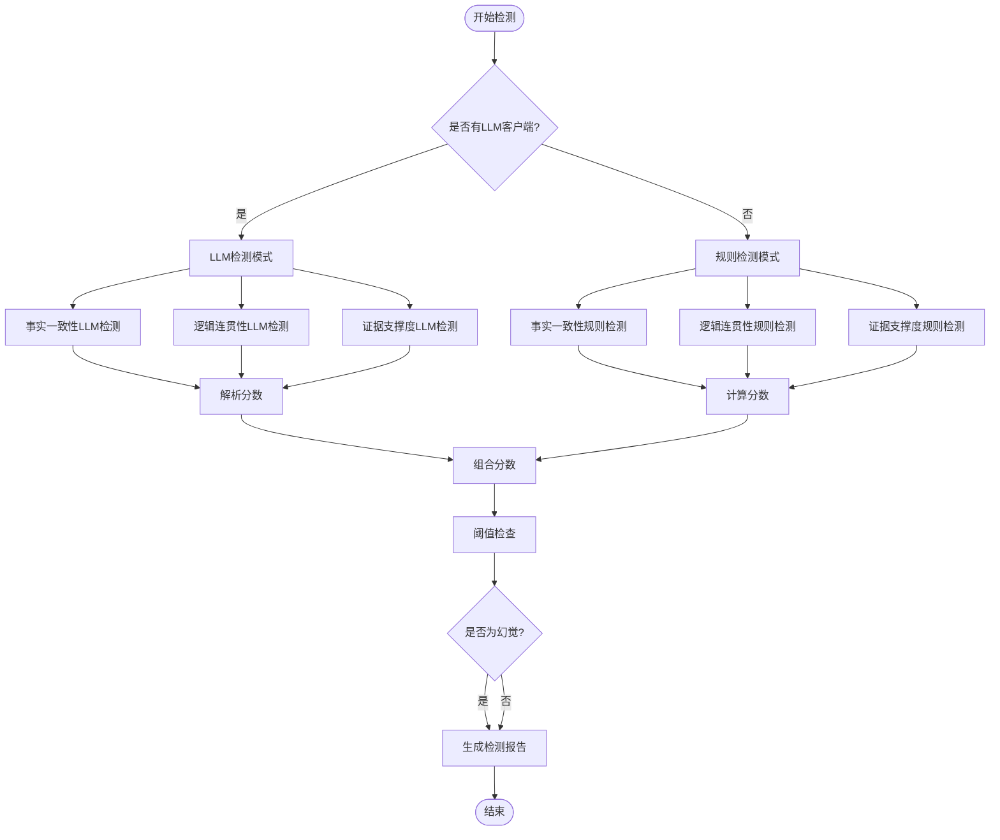

**图表来源**
- [hallucination.py:136-193](file://src/refinement/hallucination.py#L136-L193)
- [hallucination.py:308-339](file://src/refinement/hallucination.py#L308-L339)

**章节来源**
- [hallucination.py:136-193](file://src/refinement/hallucination.py#L136-L193)
- [hallucination.py:308-339](file://src/refinement/hallucination.py#L308-L339)

### 分数解析机制
当使用 LLM 进行检测时，幻觉检测器具备强大的分数解析能力，能够从多种格式的响应中提取准确的分数。

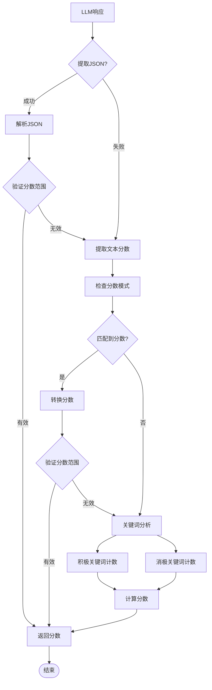

**图表来源**
- [hallucination.py:259-306](file://src/refinement/hallucination.py#L259-L306)

**章节来源**
- [hallucination.py:259-306](file://src/refinement/hallucination.py#L259-L306)

### 算法原理与技术实现

#### 多维度检测算法
幻觉检测器实现了三种核心检测算法，每种算法都有其独特的技术实现和适用场景。

##### 1. 事实一致性检测算法
事实一致性检测通过分析答案与证据之间的词汇重叠度来评估事实准确性。

**算法复杂度分析：**
- 时间复杂度：O(n*m*k)，其中 n 为答案词数，m 为证据数量，k 为平均证据词数
- 空间复杂度：O(n+m*k)

**关键技术实现：**
- 关键词提取：使用正则表达式进行中英文混合文本的词法分析
- 词汇重叠计算：通过集合运算计算答案与证据的交集
- 否定冲突检测：识别并惩罚与证据矛盾的否定表述

##### 2. 逻辑连贯性检测算法
逻辑连贯性检测评估答案内部的逻辑结构和推理过程。

**算法特点：**
- 基于逻辑连接词的统计分析
- 句子结构复杂度评估
- 自相矛盾检测机制

**检测指标：**
- 逻辑连接词密度
- 句子数量和质量
- 关键概念的前后一致性

##### 3. 证据支撑度检测算法
证据支撑度检测评估答案中每个声明的证据覆盖情况。

**算法流程：**
1. 将答案分解为独立的声明
2. 对每个声明提取关键词
3. 在证据库中查找匹配的支撑证据
4. 计算支撑率和证据影响因子

**章节来源**
- [hallucination.py:341-456](file://src/refinement/hallucination.py#L341-L456)

### 检测方法详解

#### LLM 检测方法
当提供有效的 LLM 客户端时，幻觉检测器会使用精心设计的提示词模板进行智能检测。

##### 事实一致性检测提示词设计
事实一致性检测使用专门的提示词模板，要求 LLM：
- 识别答案中的每个事实性陈述
- 检查每个陈述是否能在证据中找到支持
- 识别任何与证据矛盾的内容

##### 逻辑连贯性检测提示词设计
逻辑连贯性检测提示词要求 LLM：
- 检查论证链条是否完整
- 识别逻辑跳跃或断裂
- 检查是否存在自相矛盾

##### 证据支撑度检测提示词设计
证据支撑度检测提示词要求 LLM：
- 识别答案中的所有声明
- 为每个声明找到对应的证据支撑
- 标记没有证据支撑的声明

#### 规则检测方法
当 LLM 客户端不可用时，幻觉检测器自动切换到基于规则的检测方法。

##### 关键词提取与过滤
规则检测使用高效的关键词提取算法：
- 移除标点符号和停用词
- 支持中英文混合文本处理
- 过滤短词和常见虚词

##### 重叠度计算
通过计算答案关键词与证据关键词的重叠度来评估事实一致性：
- 使用集合运算进行高效计算
- 应用否定冲突惩罚机制
- 考虑词汇相似度的模糊匹配

**章节来源**
- [hallucination.py:458-506](file://src/refinement/hallucination.py#L458-L506)

### 置信度计算机制

#### 分数合成策略
幻觉检测器采用多维度分数合成策略，综合评估答案质量。

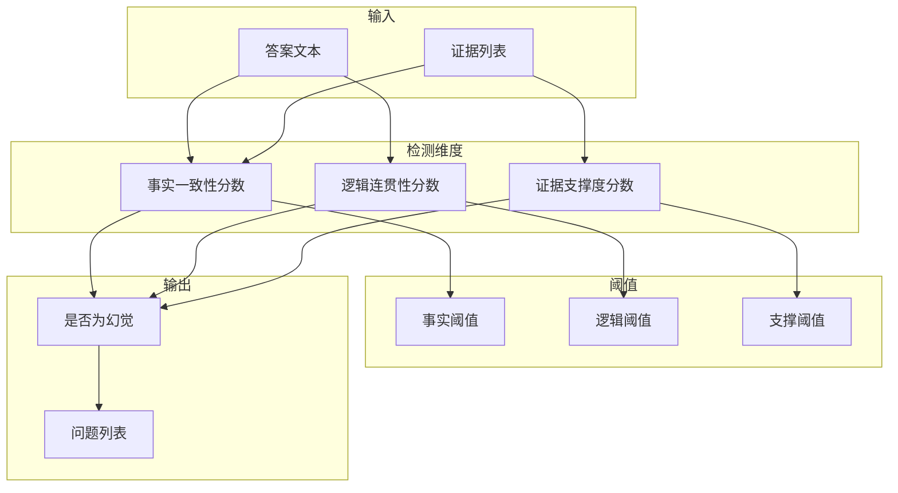

**图表来源**
- [hallucination.py:171-193](file://src/refinement/hallucination.py#L171-L193)

#### 置信度调整机制
当检测到幻觉时，系统会自动调整答案的置信度：

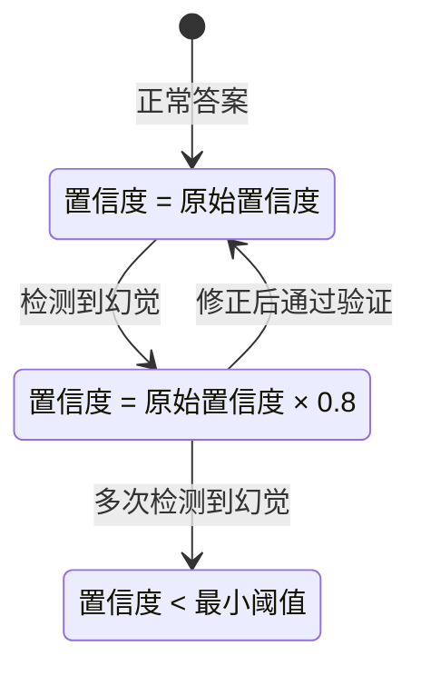

**图表来源**
- [agent.py:127-130](file://src/refinement/agent.py#L127-L130)

**章节来源**
- [agent.py:127-130](file://src/refinement/agent.py#L127-L130)

### 错误类型识别

#### 幻觉类型分类
幻觉检测器能够识别和分类多种类型的幻觉错误：

##### 1. 事实性幻觉
- **定义**：答案包含与证据矛盾的事实性陈述
- **特征**：明确的真伪对立，可通过事实核查发现
- **检测方法**：关键词重叠分析和否定冲突检测

##### 2. 推理性幻觉  
- **定义**：答案内部逻辑不一致或推理链条断裂
- **特征**：看似合理的推论但存在逻辑漏洞
- **检测方法**：逻辑连接词分析和推理完整性检查

##### 3. 支撑性幻觉
- **定义**：答案中的某些声明缺乏证据支撑
- **特征**：表述模糊或过于绝对化
- **检测方法**：声明分解和证据匹配分析

#### 错误严重程度评估
系统根据检测到的问题严重程度进行分级：

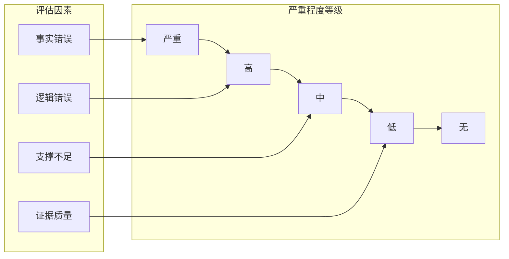

**章节来源**
- [hallucination.py:171-193](file://src/refinement/hallucination.py#L171-L193)

### 阈值配置与参数调优

#### 配置参数说明
| 参数名称 | 类型 | 默认值 | 作用 | 调优建议 |
|---------|------|--------|------|----------|
| fact_threshold | float | 0.7 | 事实一致性阈值 | 0.6-0.8，越严格越少误报 |
| logic_threshold | float | 0.6 | 逻辑连贯性阈值 | 0.5-0.7，平衡准确性与灵活性 |
| support_threshold | float | 0.5 | 证据支撑度阈值 | 0.4-0.6，影响检测敏感度 |

#### 阈值调优策略

##### 1. 误报控制策略
- 提高阈值（如 fact_threshold=0.8）
- 增加证据数量要求
- 加强否定冲突检测

##### 2. 漏报控制策略  
- 降低阈值（如 logic_threshold=0.5）
- 放宽关键词匹配要求
- 增加规则检测权重

##### 3. 平衡策略
- 根据应用场景调整权重分配
- 结合历史检测数据进行统计分析
- 定期评估和调整阈值

**章节来源**
- [hallucination.py:28-47](file://src/refinement/hallucination.py#L28-L47)

### 误报处理策略

#### 误报识别与处理
幻觉检测器采用多层次的误报防护机制：

##### 1. 上下文感知检测
- 考虑查询语境和领域知识
- 识别领域内的常见表述模式
- 避免对专业术语的过度敏感

##### 2. 证据质量评估
- 评估证据的相关性和权威性
- 考虑证据数量和多样性
- 排除过时或不准确的证据

##### 3. 动态阈值调整
- 根据证据质量和数量调整阈值
- 对高质量证据提供更宽松的检测
- 对低质量证据实施更严格的检测

#### 误报缓解机制

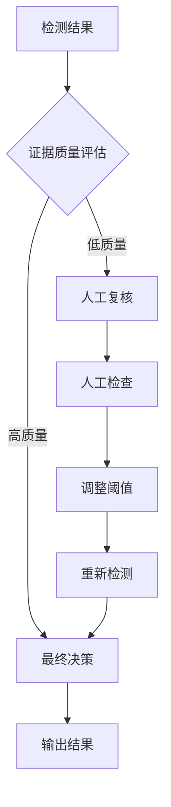

**图表来源**
- [hallucination.py:215-219](file://src/refinement/hallucination.py#L215-L219)

**章节来源**
- [hallucination.py:215-219](file://src/refinement/hallucination.py#L215-L219)

## 依赖关系分析

### 组件依赖图

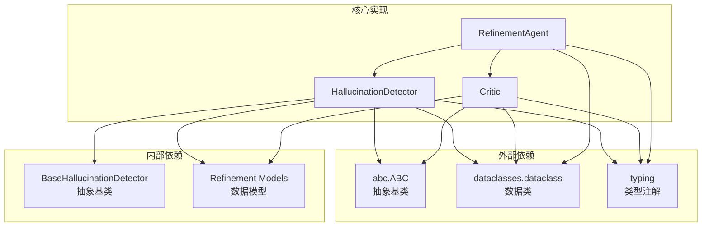

**图表来源**
- [hallucination.py:5-7](file://src/refinement/hallucination.py#L5-L7)
- [critic.py:5-7](file://src/refinement/critic.py#L5-L7)
- [agent.py:5-13](file://src/refinement/agent.py#L5-L13)

### 接口契约
系统遵循严格的接口契约设计：

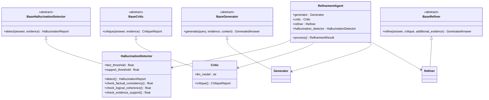

**图表来源**
- [base.py:508-528](file://src/core/base.py#L508-L528)
- [base.py:462-482](file://src/core/base.py#L462-L482)
- [base.py:438-460](file://src/core/base.py#L438-L460)
- [base.py:484-506](file://src/core/base.py#L484-L506)

**章节来源**
- [base.py:508-528](file://src/core/base.py#L508-L528)
- [base.py:462-482](file://src/core/base.py#L462-L482)

## 性能考虑

### 算法复杂度分析
| 检测方法 | 时间复杂度 | 空间复杂度 | 优化建议 |
|---------|-----------|-----------|----------|
| 事实一致性 | O(n+m) | O(n+m) | 使用集合操作优化 |
| 逻辑连贯性 | O(k) | O(1) | 预编译关键词列表 |
| 证据支撑度 | O(p) | O(1) | 简单计数操作 |

### 性能优化策略
1. **缓存机制**：对常用关键词和逻辑连接词进行缓存
2. **批量处理**：支持批量证据处理以提高效率
3. **阈值优化**：根据场景调整阈值以平衡精度和速度
4. **异步处理**：在高并发场景下支持异步检测

### 内存使用优化
- 使用生成器模式处理大量证据
- 实施内存池管理减少垃圾回收
- 优化字符串处理避免不必要的复制

## 故障排除指南

### 常见问题诊断

#### 1. LLM 客户端异常
**症状**：检测失败或返回错误
**解决方案**：
- 检查 LLM 客户端配置
- 验证 API 密钥和权限
- 确认网络连接状态

#### 2. 分数解析失败
**症状**：无法从 LLM 响应中提取分数
**解决方案**：
- 检查提示词格式是否正确
- 验证 LLM 输出格式
- 启用规则检测降级方案

#### 3. 性能问题
**症状**：检测速度慢或内存占用过高
**解决方案**：
- 优化关键词提取算法
- 实现结果缓存机制
- 调整阈值参数

### 调试技巧

#### 1. 日志分析
启用详细的日志记录，跟踪检测过程：
- 记录每个检测维度的分数
- 跟踪阈值比较过程
- 记录误报和漏报案例

#### 2. 性能监控
监控关键性能指标：
- 检测响应时间
- 内存使用情况
- LLM 调用频率

**章节来源**
- [hallucination.py:215-219](file://src/refinement/hallucination.py#L215-L219)

## 结论
NecoRAG 幻觉检测器通过其先进的多维度检测算法和灵活的实现策略，为大语言模型应用提供了可靠的幻觉防护机制。该检测器不仅能够在 LLM 模式下提供智能化的检测能力，还能在规则模式下保证基本的检测功能，确保系统的鲁棒性和可靠性。

### 核心优势
1. **多维度检测**：同时评估事实一致性、逻辑连贯性和证据支撑度
2. **双模式实现**：支持 LLM 智能检测和规则引擎降级
3. **灵活配置**：可调的阈值参数适应不同的应用场景
4. **性能优化**：高效的算法实现确保实时检测能力
5. **误报控制**：多层次的误报防护机制

### 应用前景
随着大语言模型在各领域的广泛应用，幻觉检测技术将成为确保 AI 系统可靠性和可信度的关键技术。NecoRAG 幻觉检测器为构建安全、可靠的 AI 应用提供了坚实的技术基础。