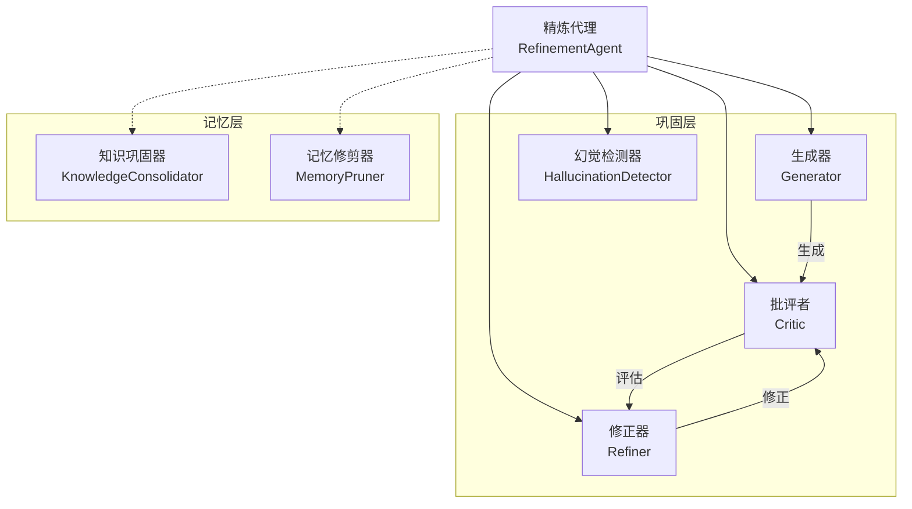
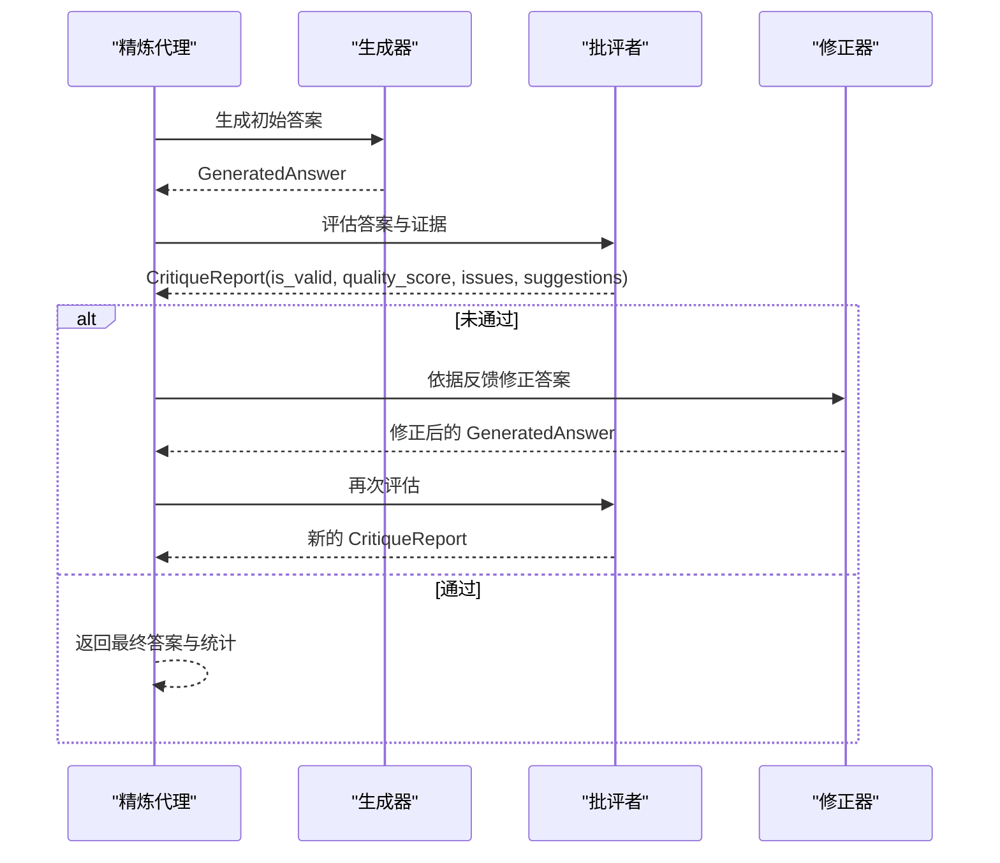
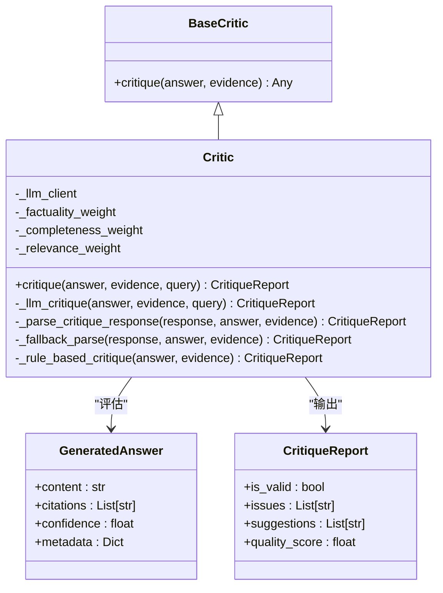
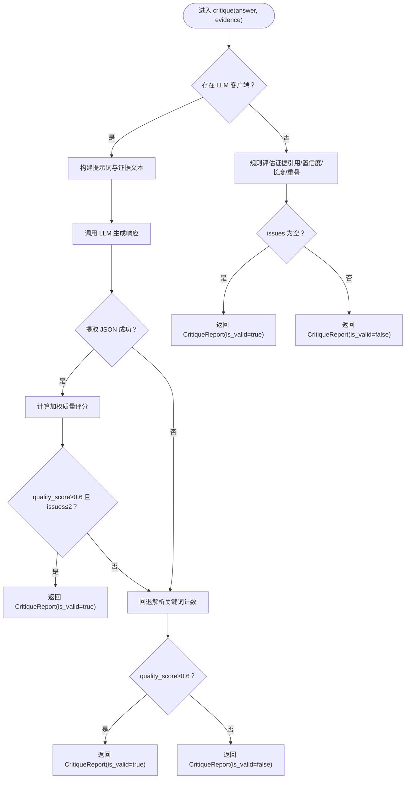
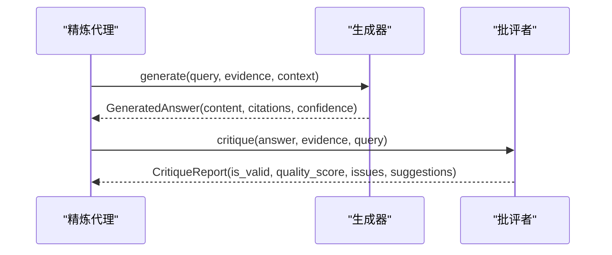
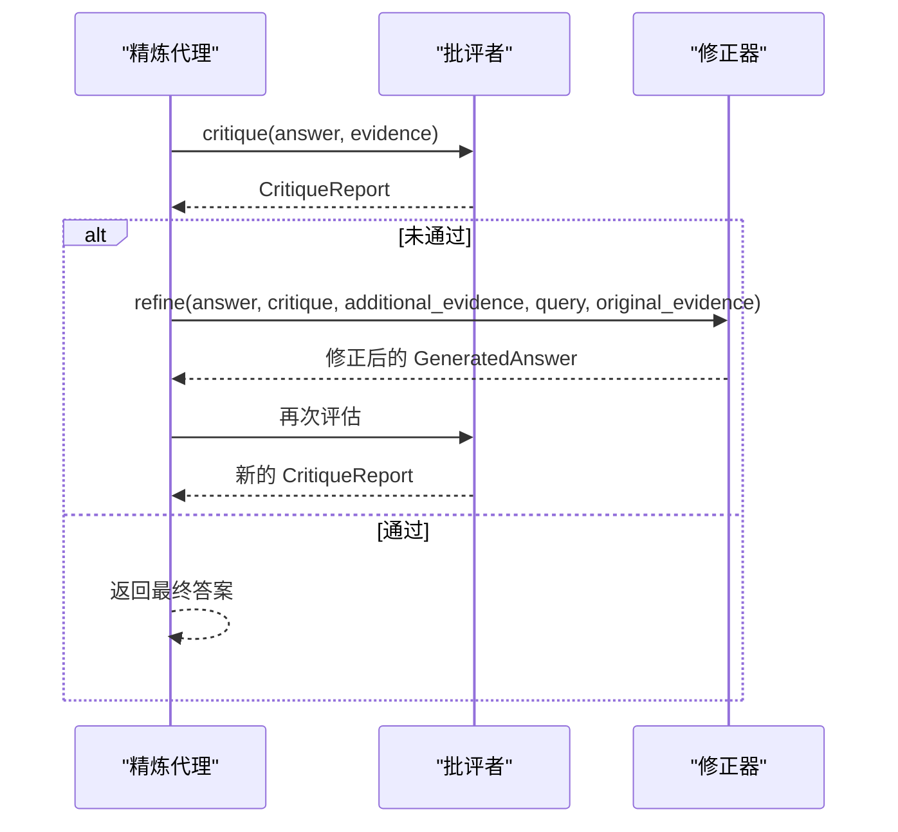
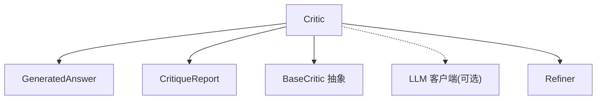

# 批评者组件

<cite>
**本文引用的文件**
- [src/refinement/critic.py](file://src/refinement/critic.py)
- [src/refinement/models.py](file://src/refinement/models.py)
- [src/refinement/generator.py](file://src/refinement/generator.py)
- [src/refinement/refiner.py](file://src/refinement/refiner.py)
- [src/refinement/agent.py](file://src/refinement/agent.py)
- [src/core/base.py](file://src/core/base.py)
</cite>

## 目录
1. [引言](#引言)
2. [项目结构](#项目结构)
3. [核心组件](#核心组件)
4. [架构总览](#架构总览)
5. [详细组件分析](#详细组件分析)
6. [依赖分析](#依赖分析)
7. [性能考量](#性能考量)
8. [故障排查指南](#故障排查指南)
9. [结论](#结论)
10. [附录](#附录)

## 引言
本文件面向“批评者组件”（Critic），系统性阐述其在答案质量评估与逻辑审查中的职责、评估标准与维度、推理机制与判断逻辑、is_valid 标志的生成规则及其影响因素，并给出与生成器（Generator）、修正器（Refiner）的协作机制与反馈循环。文档同时提供配置与使用指引、常见问题识别与改进建议，以及与整体精炼代理（RefinementAgent）的工作流关系。

## 项目结构
批评者组件位于“巩固层”，与生成器、修正器、幻觉检测器共同构成答案质量闭环。其核心文件与角色如下：
- 批评者（Critic）：负责对 GeneratedAnswer 进行多维度质量评估，产出 CritiqueReport，包含 is_valid、质量评分、问题列表与改进建议。
- 生成器（Generator）：基于检索证据生成答案，提供 GeneratedAnswer（含内容、引用、置信度等）。
- 修正器（Refiner）：依据 CritiqueReport 对答案进行迭代修正，融合补充证据并调整置信度。
- 精炼代理（RefinementAgent）：编排 Generator -> Critic -> Refiner 的反馈循环，结合幻觉检测与知识固化/修剪。

图表来源
- [src/refinement/agent.py:20-164](file://src/refinement/agent.py#L20-L164)
- [src/refinement/generator.py:16-209](file://src/refinement/generator.py#L16-L209)
- [src/refinement/critic.py:18-309](file://src/refinement/critic.py#L18-L309)
- [src/refinement/refiner.py:18-371](file://src/refinement/refiner.py#L18-L371)

章节来源
- [src/refinement/agent.py:20-164](file://src/refinement/agent.py#L20-L164)
- [src/refinement/generator.py:16-209](file://src/refinement/generator.py#L16-L209)
- [src/refinement/critic.py:18-309](file://src/refinement/critic.py#L18-L309)
- [src/refinement/refiner.py:18-371](file://src/refinement/refiner.py#L18-L371)

## 核心组件
- 批评者（Critic）：实现 BaseCritic 接口，支持 LLM 驱动与规则驱动两种评估路径；输出 CritiqueReport，包含 is_valid、quality_score、issues、suggestions。
- 生成答案（GeneratedAnswer）：包含 content、citations、confidence、metadata 等字段，供 Critic 评估。
- 批判报告（CritiqueReport）：包含 is_valid、issues、suggestions、quality_score。
- 精炼结果（RefinementResult）：封装最终答案、置信度、引用、迭代次数、幻觉报告等。

章节来源
- [src/refinement/critic.py:18-309](file://src/refinement/critic.py#L18-L309)
- [src/refinement/models.py:19-66](file://src/refinement/models.py#L19-L66)

## 架构总览
Critic 在精炼代理的反馈循环中承担“质量门禁”的角色：生成器产出答案，Critic 评估并给出 is_valid 与质量评分；若未通过，Refiner 基于反馈修正答案并再次送入 Critic，直至满足阈值或达到最大迭代次数。

图表来源
- [src/refinement/agent.py:65-141](file://src/refinement/agent.py#L65-L141)
- [src/refinement/critic.py:90-113](file://src/refinement/critic.py#L90-L113)
- [src/refinement/refiner.py:98-175](file://src/refinement/refiner.py#L98-L175)

## 详细组件分析

### 批评者（Critic）类详解
- 角色定位：对 GeneratedAnswer 进行多维度质量评估，输出 CritiqueReport。
- 评估维度与权重：
  - 事实性（factuality）：答案与证据是否一致，是否存在错误或矛盾。
  - 完整性（completeness）：是否完整回答问题，有无关键信息遗漏。
  - 相关性（relevance）：答案与问题的相关程度，避免跑题或冗余。
- 评估路径：
  - LLM 驱动：构造提示词，调用 LLM 生成 JSON 格式的评估结果，解析后计算加权质量评分与 is_valid。
  - 规则驱动：当无 LLM 客户端或 LLM 调用失败时，退化为基于证据引用、置信度、答案长度与关键词重叠的启发式评估。
- is_valid 生成规则：
  - LLM 路径：quality_score ≥ 0.6 且 issues 数量 ≤ 2。
  - 规则路径：issues 为空。
- 输出字段：
  - is_valid：是否通过质量门禁。
  - issues：发现的问题列表。
  - suggestions：改进建议列表。
  - quality_score：加权综合质量评分（范围 0~1）。

图表来源
- [src/core/base.py:472-491](file://src/core/base.py#L472-L491)
- [src/refinement/critic.py:18-309](file://src/refinement/critic.py#L18-L309)
- [src/refinement/models.py:19-66](file://src/refinement/models.py#L19-L66)

章节来源
- [src/refinement/critic.py:18-309](file://src/refinement/critic.py#L18-L309)
- [src/core/base.py:472-491](file://src/core/base.py#L472-L491)
- [src/refinement/models.py:19-66](file://src/refinement/models.py#L19-L66)

### 评估流程与判断逻辑
- LLM 评估流程：
  - 格式化证据与提示词，调用 LLM。
  - 从响应中提取 JSON，解析 factuality/completeness/relevance 评分与问题/建议。
  - 计算加权质量评分，按规则判定 is_valid。
- 回退解析（Fallback）：
  - 若 JSON 解析失败，基于响应中的正负面关键词计数估算质量评分并判定 is_valid。
- 规则评估（Rule-based）：
  - 检查证据引用、置信度、答案长度、与证据的关键词重叠比例，据此扣分并计算质量评分，最终以 issues 数量判定 is_valid。

图表来源
- [src/refinement/critic.py:90-113](file://src/refinement/critic.py#L90-L113)
- [src/refinement/critic.py:114-193](file://src/refinement/critic.py#L114-L193)
- [src/refinement/critic.py:194-231](file://src/refinement/critic.py#L194-L231)
- [src/refinement/critic.py:232-309](file://src/refinement/critic.py#L232-L309)

章节来源
- [src/refinement/critic.py:90-113](file://src/refinement/critic.py#L90-L113)
- [src/refinement/critic.py:114-193](file://src/refinement/critic.py#L114-L193)
- [src/refinement/critic.py:194-231](file://src/refinement/critic.py#L194-L231)
- [src/refinement/critic.py:232-309](file://src/refinement/critic.py#L232-L309)

### 与生成器（Generator）的协作
- 生成器负责产出 GeneratedAnswer（包含 content、citations、confidence），供 Critic 评估。
- 生成器还负责估算置信度（基于证据数量、答案长度、关键词覆盖），为后续 Refiner 的置信度调整提供基础。

图表来源
- [src/refinement/agent.py:65-141](file://src/refinement/agent.py#L65-L141)
- [src/refinement/generator.py:68-102](file://src/refinement/generator.py#L68-L102)
- [src/refinement/critic.py:90-113](file://src/refinement/critic.py#L90-L113)

章节来源
- [src/refinement/agent.py:65-141](file://src/refinement/agent.py#L65-L141)
- [src/refinement/generator.py:68-102](file://src/refinement/generator.py#L68-L102)
- [src/refinement/critic.py:90-113](file://src/refinement/critic.py#L90-L113)

### 与修正器（Refiner）的协作与反馈循环
- 若 Critic 判定未通过（is_valid=false），Refiner 基于 issues 与 suggestions 对答案进行修正，必要时融合补充证据，并重新评估。
- Refiner 在 LLM 路径下会清理响应格式、计算新的置信度，并更新引用与元数据。

图表来源
- [src/refinement/agent.py:94-131](file://src/refinement/agent.py#L94-L131)
- [src/refinement/refiner.py:98-175](file://src/refinement/refiner.py#L98-L175)
- [src/refinement/critic.py:90-113](file://src/refinement/critic.py#L90-L113)

章节来源
- [src/refinement/agent.py:94-131](file://src/refinement/agent.py#L94-L131)
- [src/refinement/refiner.py:98-175](file://src/refinement/refiner.py#L98-L175)
- [src/refinement/critic.py:90-113](file://src/refinement/critic.py#L90-L113)

### is_valid 标志的生成规则与影响因素
- LLM 路径：
  - 质量阈值：quality_score ≥ 0.6
  - 问题数量阈值：issues 数量 ≤ 2
- 规则路径：
  - 无问题：issues 为空
- 影响因素：
  - 证据引用：缺乏引用会降低事实性得分。
  - 置信度：过低会降低完整性得分。
  - 答案长度：过短或过长均不利。
  - 与证据的关键词重叠：重叠比例过低会降低相关性得分。
  - LLM 调用失败：触发回退解析或规则评估。

章节来源
- [src/refinement/critic.py:164-187](file://src/refinement/critic.py#L164-L187)
- [src/refinement/critic.py:232-309](file://src/refinement/critic.py#L232-L309)

### 评估标准与维度详解
- 事实性（factuality）：检查答案与证据一致性，识别错误或矛盾。
- 完整性（completeness）：检查是否完整回答问题，关注关键信息遗漏。
- 相关性（relevance）：检查答案与问题的相关程度，避免跑题或冗余。
- 加权计算：quality_score = w1·f + w2·c + w3·r，其中 w1+w2+w3=1。

章节来源
- [src/refinement/critic.py:22-26](file://src/refinement/critic.py#L22-L26)
- [src/refinement/critic.py:164-169](file://src/refinement/critic.py#L164-L169)

### 配置与使用示例（路径指引）
- 初始化与依赖注入：
  - 可通过 llm_client 注入 LLM 客户端；若未提供，将使用 Mock 实现。
  - 权重参数：factuality_weight、completeness_weight、relevance_weight。
- 在精炼代理中使用：
  - RefinementAgent 内部创建 Critic 实例，参与迭代评估与修正。
- 与生成器协作：
  - 生成器先产出 GeneratedAnswer，再由 Critic 评估，随后可能被 Refiner 修正。

章节来源
- [src/refinement/critic.py:28-56](file://src/refinement/critic.py#L28-L56)
- [src/refinement/agent.py:31-64](file://src/refinement/agent.py#L31-L64)

## 依赖分析
- 组件耦合：
  - Critic 依赖 GeneratedAnswer 与 CritiqueReport，遵循抽象接口 BaseCritic。
  - 与 Refiner 协作时，依赖 Refiner 的提示词模板与修正流程。
- 外部依赖：
  - LLM 客户端（可选）：用于 JSON 结构化评估与回退解析。
  - Mock 实现：在无 LLM 客户端时自动降级。

图表来源
- [src/core/base.py:472-491](file://src/core/base.py#L472-L491)
- [src/refinement/critic.py:18-309](file://src/refinement/critic.py#L18-L309)
- [src/refinement/refiner.py:18-371](file://src/refinement/refiner.py#L18-L371)

章节来源
- [src/core/base.py:472-491](file://src/core/base.py#L472-L491)
- [src/refinement/critic.py:18-309](file://src/refinement/critic.py#L18-L309)
- [src/refinement/refiner.py:18-371](file://src/refinement/refiner.py#L18-L371)

## 性能考量
- LLM 调用成本：JSON 解析与提示词构造会增加开销；建议在批处理或缓存场景中复用证据与提示词。
- 规则评估优势：在无 LLM 或 LLM 失败时，规则评估可快速给出近似质量评分，保证系统可用性。
- 迭代上限：Refiner 的最大迭代次数与质量阈值可控制收敛速度与资源消耗。

## 故障排查指南
- LLM 调用失败：
  - 现象：Critic 回退到规则评估或回退解析。
  - 建议：检查 LLM 客户端配置、网络连接与模型可用性；必要时提供 Mock 实现。
- JSON 解析失败：
  - 现象：响应中未包含预期 JSON 结构。
  - 建议：调整提示词格式、温度参数或启用回退解析；确保 LLM 输出稳定。
- is_valid 始终为 false：
  - 现象：quality_score 偏低或 issues 过多。
  - 建议：提升证据质量与数量、优化生成器提示词、增加 Refiner 的迭代次数与阈值。
- 答案过短或相关性不足：
  - 现象：规则评估扣分。
  - 建议：扩展答案长度、增强与证据的关键词重叠、补充证据。

章节来源
- [src/refinement/critic.py:136-141](file://src/refinement/critic.py#L136-L141)
- [src/refinement/critic.py:152-192](file://src/refinement/critic.py#L152-L192)
- [src/refinement/critic.py:253-294](file://src/refinement/critic.py#L253-L294)

## 结论
Critic 通过多维度评估与加权质量评分，为答案质量提供可靠的门禁；在 LLM 与规则双路径下兼顾准确性与鲁棒性。与生成器、修正器的协作形成闭环反馈，持续提升答案的准确性、完整性与相关性。合理配置权重与迭代策略，可有效平衡质量与性能。

## 附录
- 关键数据模型
  - GeneratedAnswer：content、citations、confidence、metadata。
  - CritiqueReport：is_valid、issues、suggestions、quality_score。
- 评估提示词与规则要点
  - LLM 路径：要求 JSON 输出，包含三个维度评分与问题/建议。
  - 规则路径：基于证据引用、置信度、长度与关键词重叠进行评分与扣分。

章节来源
- [src/refinement/models.py:19-66](file://src/refinement/models.py#L19-L66)
- [src/refinement/critic.py:58-88](file://src/refinement/critic.py#L58-L88)
- [src/refinement/critic.py:240-294](file://src/refinement/critic.py#L240-L294)