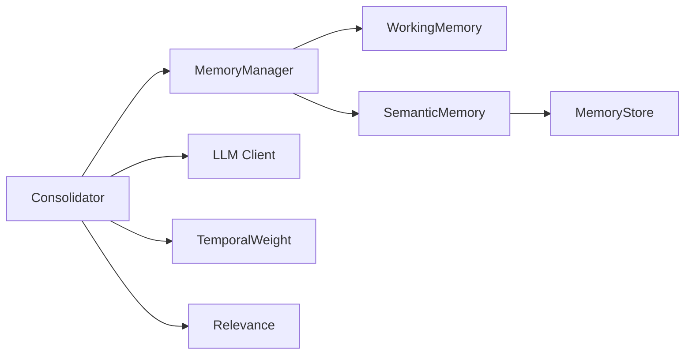
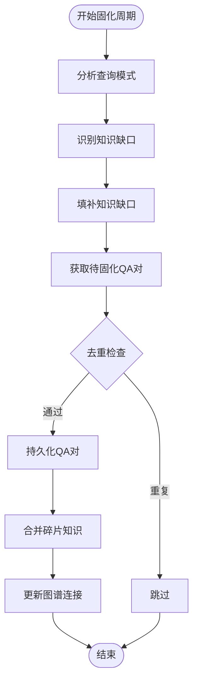
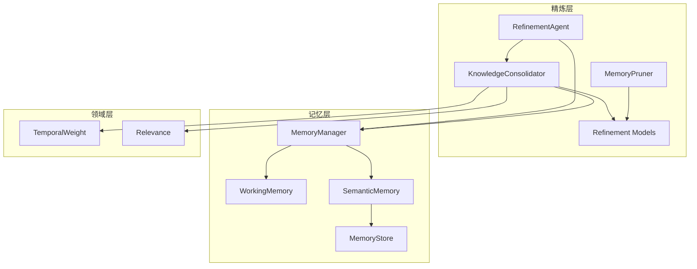

# 知识固化器

<cite>
**本文档引用的文件**
- [consolidator.py](file://src/refinement/consolidator.py)
- [models.py（精炼）](file://src/refinement/models.py)
- [manager.py](file://src/memory/manager.py)
- [memory_store.py](file://src/memory/backends/memory_store.py)
- [config.py（核心配置）](file://src/core/config.py)
- [temporal_weight.py](file://src/domain/temporal_weight.py)
- [relevance.py](file://src/domain/relevance.py)
- [pruner.py](file://src/refinement/pruner.py)
- [working_memory.py](file://src/memory/working_memory.py)
- [semantic_memory.py](file://src/memory/semantic_memory.py)
- [example_usage.py](file://example/example_usage.py)
- [scheduler.py](file://src/knowledge_evolution/scheduler.py)
- [metrics.py](file://src/monitoring/metrics.py)
</cite>

## 目录
1. [简介](#简介)
2. [项目结构](#项目结构)
3. [核心组件](#核心组件)
4. [架构总览](#架构总览)
5. [详细组件分析](#详细组件分析)
6. [依赖关系分析](#依赖关系分析)
7. [性能考量](#性能考量)
8. [故障排查指南](#故障排查指南)
9. [结论](#结论)
10. [附录](#附录)

## 简介
知识固化器（KnowledgeConsolidator）是 NecoRAG 精炼层的核心组件之一，负责将高质量问答对（QA）进行持久化、去重与合并，识别知识缺口并自动补充，同时维护知识图谱的连接关系。其目标是将临时信息转化为长期稳定的知识，并建立知识之间的关联，从而提升检索与推理的准确性与时效性。

## 项目结构
围绕知识固化器的相关模块分布如下：
- 精炼层：consolidator.py、models.py、agent.py、pruner.py
- 记忆层：manager.py、working_memory.py、semantic_memory.py、backends/memory_store.py
- 领域层：temporal_weight.py、relevance.py
- 配置层：core/config.py
- 示例：example/example_usage.py
- 知识演化：knowledge_evolution/scheduler.py
- 监控：monitoring/metrics.py

## 核心组件
- 知识巩固器（KnowledgeConsolidator）
  - 负责分析高频未命中查询、识别知识缺口、补充缺口、去重与合并碎片化知识、更新图谱连接。
  - 关键参数：最小查询频率、质量阈值、相似度阈值；支持异步运行固化周期。
- 精炼数据模型（Refinement Models）
  - 定义 QA 对、查询模式、知识缺口等数据结构，支撑巩固器的数据流转。
- 记忆管理器（MemoryManager）
  - 统一管理 L1/L2/L3 三层记忆，提供向量检索、图谱存储与记忆巩固/遗忘能力。
- 时间权重与领域相关性
  - 时间权重用于控制知识的时效性衰减；领域相关性用于评估文本与领域的契合度，辅助知识筛选与排序。
- 记忆修剪器（MemoryPruner）
  - 与巩固器配合，清理噪声、低质量与过时知识，强化重要连接，维持知识库健康度。

## 架构总览

**图表来源**
- [consolidator.py:53-84](file://src/refinement/consolidator.py#L53-L84)
- [manager.py:44-47](file://src/memory/manager.py#L44-L47)
- [semantic_memory.py:21-49](file://src/memory/semantic_memory.py#L21-L49)
- [memory_store.py:20-38](file://src/memory/backends/memory_store.py#L20-L38)
- [temporal_weight.py:47-52](file://src/domain/temporal_weight.py#L47-L52)
- [relevance.py:29-41](file://src/domain/relevance.py#L29-L41)

## 详细组件分析

### 知识巩固器（KnowledgeConsolidator）

#### 主要职责
- 分析查询模式：统计查询频率与命中率，提取模式并排序。
- 识别知识缺口：对低命中率且高频的模式标记缺口。
- 填补知识缺口：将缺口记录持久化，便于后续处理。
- 去重与合并：基于缓存与相似度阈值去重，对相似片段进行合并。
- 更新图谱连接：从答案中抽取实体，更新图谱连接强度。

#### 关键流程
- 运行固化周期：串行执行模式分析、缺口识别、QA固化、碎片合并、图谱更新。
- 记录查询：将命中且高置信度的回答加入待固化队列。
- 存储QA对：若满足质量阈值且非重复，则持久化。

#### 算法要点
- 查询模式提取：去除停用词与标点，提取关键词组合作为模式。
- 去重策略：以查询哈希为键，缓存中保留更高置信度的版本。
- 合并策略：优先使用 LLM 合并，失败时采用规则合并（保留高置信度内容并附加补充信息）。
- 实体抽取：中文连续汉字与英文首字母大写短语作为候选实体。

**图表来源**
- [consolidator.py:105-160](file://src/refinement/consolidator.py#L105-L160)
- [consolidator.py:162-216](file://src/refinement/consolidator.py#L162-L216)
- [consolidator.py:217-248](file://src/refinement/consolidator.py#L217-L248)
- [consolidator.py:250-281](file://src/refinement/consolidator.py#L250-L281)
- [consolidator.py:401-441](file://src/refinement/consolidator.py#L401-L441)
- [consolidator.py:282-322](file://src/refinement/consolidator.py#L282-L322)
- [consolidator.py:323-357](file://src/refinement/consolidator.py#L323-L357)

**章节来源**
- [consolidator.py:41-160](file://src/refinement/consolidator.py#L41-L160)
- [consolidator.py:162-216](file://src/refinement/consolidator.py#L162-L216)
- [consolidator.py:217-248](file://src/refinement/consolidator.py#L217-L248)
- [consolidator.py:250-281](file://src/refinement/consolidator.py#L250-L281)
- [consolidator.py:282-322](file://src/refinement/consolidator.py#L282-L322)
- [consolidator.py:323-357](file://src/refinement/consolidator.py#L323-L357)
- [consolidator.py:401-441](file://src/refinement/consolidator.py#L401-L441)

### 时间权重与领域相关性
- 时间权重（TemporalWeight）
  - 提供指数衰减、分层权重与混合方法，支持常青内容与不同领域的时间衰减策略。
  - 与巩固器结合，用于评估知识的时效性与优先级。
- 领域相关性（DomainRelevance）
  - 基于关键字与密度评分，判定文本所属领域等级并给出权重乘数。
  - 与巩固器结合，辅助筛选与排序高质量知识。

**章节来源**
- [temporal_weight.py:47-52](file://src/domain/temporal_weight.py#L47-L52)
- [temporal_weight.py:160-196](file://src/domain/temporal_weight.py#L160-L196)
- [relevance.py:29-41](file://src/domain/relevance.py#L29-L41)
- [relevance.py:198-242](file://src/domain/relevance.py#L198-L242)

### 记忆修剪器（MemoryPruner）
- 与巩固器互补，负责清理噪声、低质量与过时知识，强化重要连接。
- 关键指标
  - 噪声阈值、质量阈值、过时天数。
- 与巩固器的协作
  - 巩固器专注于高质量知识的固化与合并，修剪器负责知识库的整体健康度维护。

**章节来源**
- [pruner.py:10-70](file://src/refinement/pruner.py#L10-L70)
- [pruner.py:41-69](file://src/refinement/pruner.py#L41-L69)

## 依赖关系分析
- 组件耦合
  - 巩固器依赖记忆管理器进行持久化与图谱更新；依赖 LLM 客户端进行知识合并（可选）。
  - 记忆管理器内部依赖工作记忆与语义记忆，语义记忆依赖内存存储后端。
  - 时间权重与领域相关性为巩固过程提供时效性与领域权重支持。
- 外部依赖
  - LLM 客户端（可为 Mock 实现）。
  - 向量存储与图存储后端（内存实现用于开发测试）。

**图表来源**
- [consolidator.py:53-84](file://src/refinement/consolidator.py#L53-L84)
- [manager.py:44-47](file://src/memory/manager.py#L44-L47)
- [semantic_memory.py:21-49](file://src/memory/semantic_memory.py#L21-L49)
- [memory_store.py:20-38](file://src/memory/backends/memory_store.py#L20-L38)
- [temporal_weight.py:47-52](file://src/domain/temporal_weight.py#L47-L52)
- [relevance.py:29-41](file://src/domain/relevance.py#L29-L41)

**章节来源**
- [consolidator.py:53-84](file://src/refinement/consolidator.py#L53-L84)
- [manager.py:44-47](file://src/memory/manager.py#L44-L47)
- [semantic_memory.py:21-49](file://src/memory/semantic_memory.py#L21-L49)
- [memory_store.py:20-38](file://src/memory/backends/memory_store.py#L20-L38)
- [temporal_weight.py:47-52](file://src/domain/temporal_weight.py#L47-L52)
- [relevance.py:29-41](file://src/domain/relevance.py#L29-L41)

## 性能考量
- 缓存与内存
  - 巩固器内置 QA 缓存，限制缓存大小并淘汰低置信度条目，减少重复处理与存储压力。
- 检索与存储
  - 记忆管理器的语义记忆采用内存向量存储，适合小规模场景；生产环境建议替换为外部向量数据库。
- 时间权重
  - 合理设置衰减率与分层权重，平衡知识时效性与稳定性。
- 并发与异步
  - 巩固器支持异步运行固化周期，可在后台任务中执行，避免阻塞主线程。

## 故障排查指南
- 固化周期异常
  - 检查记忆管理器是否正确初始化，确认存储接口可用性。
  - 验证 LLM 客户端配置，确保合并功能正常。
- 去重失效
  - 确认查询哈希计算逻辑，检查缓存大小限制与淘汰策略。
  - 验证置信度比较逻辑，确保更高置信度版本能够替换旧版本。
- 合并失败
  - 检查 LLM 客户端连接状态，确认提示词格式正确。
  - 验证规则合并逻辑，确保高置信度内容优先保留。
- 图谱更新问题
  - 确认实体抽取算法的有效性，检查图谱存储接口。
  - 验证连接更新的事务处理，防止部分更新导致的数据不一致。

**章节来源**
- [consolidator.py:53-84](file://src/refinement/consolidator.py#L53-L84)
- [consolidator.py:466-502](file://src/refinement/consolidator.py#L466-L502)
- [consolidator.py:567-617](file://src/refinement/consolidator.py#L567-L617)
- [consolidator.py:340-357](file://src/refinement/consolidator.py#L340-L357)

## 结论
知识固化器通过系统化的算法机制实现了高质量知识的自动提取、去重与合并，建立了完善的知识缺口识别与补充机制。其与记忆管理器的紧密集成确保了知识的持久化存储与图谱连接的动态更新。通过合理配置参数与监控指标，可以在保证知识质量的同时提升系统的整体性能与稳定性。

## 附录

### 巩固器配置参数与策略
- 巩固器初始化参数
  - memory_manager：记忆管理器实例（可选）
  - llm_client：LLM 客户端（可选，无则使用 Mock）
  - min_query_frequency：最小查询频率阈值
  - quality_threshold：质量阈值（高于此值的 QA 才会被固化）
  - similarity_threshold：相似度阈值（用于去重）
- 存储策略
  - QA 对持久化：调用记忆管理器的存储接口。
  - 合并知识持久化：调用记忆管理器的合并存储接口。
  - 图谱连接更新：调用记忆管理器的实体连接更新接口。
- 性能监控
  - 固化周期耗时（毫秒）、存储数量、去重数量、合并数量、识别缺口数等指标可通过 ConsolidationResult 获取。

**章节来源**
- [consolidator.py:53-84](file://src/refinement/consolidator.py#L53-L84)
- [consolidator.py:150-160](file://src/refinement/consolidator.py#L150-L160)
- [manager.py:52-123](file://src/memory/manager.py#L52-L123)

### 使用示例与集成
- 示例脚本展示了从感知层到记忆层、检索层、精炼层与交互层的完整流程，巩固器作为精炼层的一部分参与答案生成与验证，并在后台执行固化任务。

**章节来源**
- [example_usage.py:1-252](file://example/example_usage.py#L1-L252)

### 异步任务调度与监控
- 知识演化调度器支持定时批量更新任务的调度执行，可配置间隔调度和定时调度两种模式。
- 监控系统提供系统级与应用级指标收集，支持 Prometheus 格式导出。

**章节来源**
- [scheduler.py:124-394](file://src/knowledge_evolution/scheduler.py#L124-L394)
- [metrics.py:177-207](file://src/monitoring/metrics.py#L177-L207)