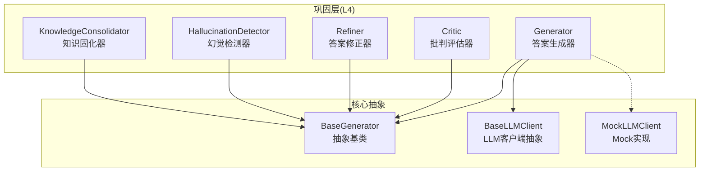
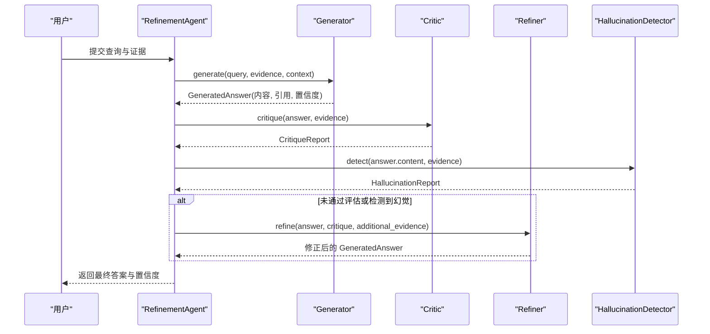
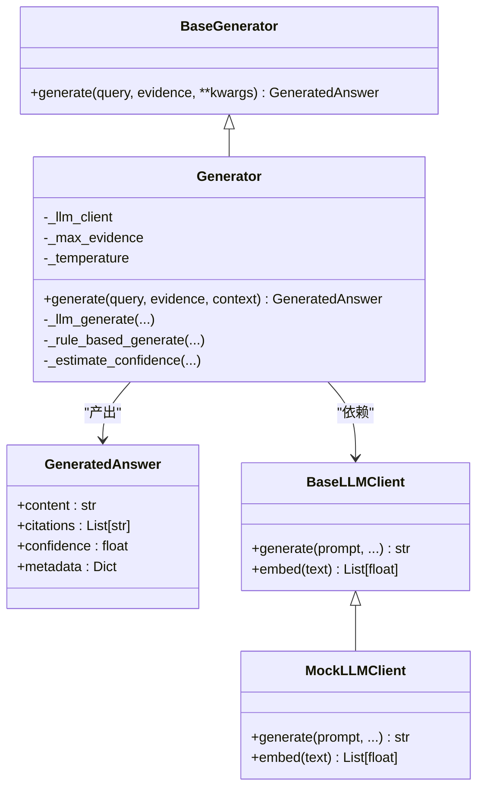
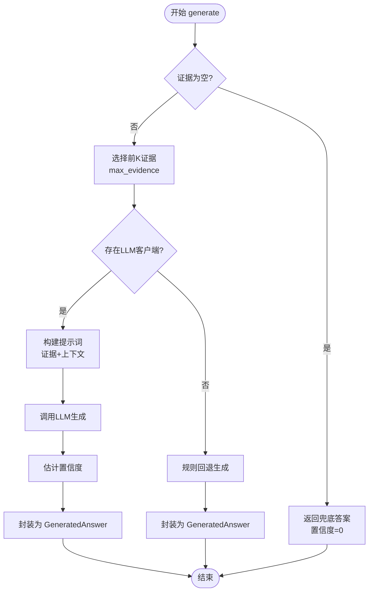

# 答案生成器

<cite>
**本文引用的文件**
- [src/refinement/generator.py](file://src/refinement/generator.py)
- [src/refinement/models.py](file://src/refinement/models.py)
- [src/core/base.py](file://src/core/base.py)
- [src/core/llm/mock.py](file://src/core/llm/mock.py)
- [src/refinement/agent.py](file://src/refinement/agent.py)
- [src/refinement/critic.py](file://src/refinement/critic.py)
- [src/refinement/hallucination.py](file://src/refinement/hallucination.py)
- [src/refinement/refiner.py](file://src/refinement/refiner.py)
- [src/refinement/consolidator.py](file://src/refinement/consolidator.py)
- [src/retrieval/fusion.py](file://src/retrieval/fusion.py)
- [src/retrieval/smart_routing/strategy_fusion.py](file://src/retrieval/smart_routing/strategy_fusion.py)
- [example/example_usage.py](file://example/example_usage.py)
</cite>

## 目录
1. [简介](#简介)
2. [项目结构](#项目结构)
3. [核心组件](#核心组件)
4. [架构总览](#架构总览)
5. [详细组件分析](#详细组件分析)
6. [依赖关系分析](#依赖关系分析)
7. [性能考量](#性能考量)
8. [故障排查指南](#故障排查指南)
9. [结论](#结论)
10. [附录](#附录)

## 简介
本文件面向答案生成器组件（Generator）的技术文档，系统阐述其如何基于检索证据生成高质量初始答案，涵盖提示工程技巧、证据融合策略、置信度计算机制、引用标注生成、调用方式与配置选项，以及在不同场景下的最佳实践与性能优化建议。文档同时结合巩固层（Refinement）的闭环流程，说明生成器与批判、修正、幻觉检测的协作关系，帮助读者在理解代码实现的同时掌握工程化落地方法。

## 项目结构
答案生成器位于巩固层（L4），与批判器（Critic）、修正器（Refiner）、幻觉检测器（HallucinationDetector）共同构成“生成-评估-修正-验证”的闭环。生成器负责将检索到的证据转化为结构化、可追溯、可评估的答案，并提供置信度与引用标注；其余组件在生成后进行质量评估与幻觉检测，必要时驱动修正器迭代改进答案。

图表来源
- [src/refinement/generator.py](file://src/refinement/generator.py)
- [src/core/base.py](file://src/core/base.py)
- [src/core/llm/mock.py](file://src/core/llm/mock.py)

章节来源
- [src/refinement/generator.py:16-51](file://src/refinement/generator.py#L16-L51)
- [src/core/base.py:448-469](file://src/core/base.py#L448-L469)
- [src/core/llm/mock.py:16-313](file://src/core/llm/mock.py#L16-L313)

## 核心组件
- 答案生成器（Generator）：基于检索证据生成答案，支持 LLM 客户端依赖注入与规则回退；内置提示词模板、证据选择、置信度估计与引用标注。
- 抽象基类（BaseGenerator）：统一生成接口，确保实现一致性与可替换性。
- LLM 客户端（BaseLLMClient/MockLLMClient）：提供文本生成与嵌入能力，Mock 实现用于开发/演示。
- 数据模型（GeneratedAnswer）：封装生成答案的结构化输出（内容、引用、置信度、元数据）。
- 评估与修正（Critic/Refiner/HallucinationDetector/KnowledgeConsolidator）：在生成后进行质量评估、幻觉检测与知识固化，必要时驱动迭代修正。

章节来源
- [src/refinement/generator.py:16-209](file://src/refinement/generator.py#L16-L209)
- [src/core/base.py:448-469](file://src/core/base.py#L448-L469)
- [src/core/llm/mock.py:16-313](file://src/core/llm/mock.py#L16-L313)
- [src/refinement/models.py:19-26](file://src/refinement/models.py#L19-L26)

## 架构总览
生成器在整体流程中的位置与交互如下：

图表来源
- [src/refinement/agent.py:65-141](file://src/refinement/agent.py#L65-L141)
- [src/refinement/generator.py:68-101](file://src/refinement/generator.py#L68-L101)
- [src/refinement/critic.py:90-113](file://src/refinement/critic.py#L90-L113)
- [src/refinement/hallucination.py:136-157](file://src/refinement/hallucination.py#L136-L157)
- [src/refinement/refiner.py:98-131](file://src/refinement/refiner.py#L98-L131)

## 详细组件分析

### 生成器（Generator）类
- 职责
  - 基于检索证据生成答案，支持 LLM 客户端依赖注入与规则回退。
  - 限制最大证据数量，避免上下文过载与成本上升。
  - 估算置信度并生成引用标注，封装为 GeneratedAnswer。
- 关键属性
  - llm_client：LLM 客户端实例（可选），未提供时自动注入 Mock 实现。
  - max_evidence：最大使用证据数量，默认 5。
  - temperature：生成温度，默认 0.7。
- 核心方法
  - generate：主入口，处理无证据、证据截断、LLM 生成与规则回退。
  - _llm_generate：构建提示词模板、拼接证据与上下文、调用 LLM、置信度估计与引用标注。
  - _rule_based_generate：无 LLM 时的规则化生成，结构化输出与置信度估算。
  - _estimate_confidence：综合证据数量、答案长度、关键词覆盖度估算置信度。

图表来源
- [src/core/base.py:448-469](file://src/core/base.py#L448-L469)
- [src/refinement/generator.py:16-209](file://src/refinement/generator.py#L16-L209)
- [src/refinement/models.py:19-26](file://src/refinement/models.py#L19-L26)
- [src/core/llm/mock.py:16-313](file://src/core/llm/mock.py#L16-L313)

章节来源
- [src/refinement/generator.py:26-51](file://src/refinement/generator.py#L26-L51)
- [src/refinement/generator.py:68-101](file://src/refinement/generator.py#L68-L101)
- [src/refinement/generator.py:103-141](file://src/refinement/generator.py#L103-L141)
- [src/refinement/generator.py:143-175](file://src/refinement/generator.py#L143-L175)
- [src/refinement/generator.py:177-209](file://src/refinement/generator.py#L177-L209)

### 提示工程与提示词模板
- 模板设计原则
  - 明确角色定位：强调“基于证据回答”“清晰专业语言”“引用证据”等约束。
  - 结构化格式：证据段落编号、问题字段、引导性指令，减少 LLM 的歧义。
  - 上下文前置：当提供 context 时，先拼接上下文信息，再放置证据与问题。
- 模板路径
  - 生成提示词模板：[src/refinement/generator.py:53-66](file://src/refinement/generator.py#L53-L66)
  - LLM 生成路径：[src/refinement/generator.py:103-141](file://src/refinement/generator.py#L103-L141)
- 建议
  - 针对不同领域可定制模板，例如法律/医疗/技术领域的术语与规范。
  - 通过上下文注入（context）传递用户身份、领域背景、历史对话等，提升答案个性化与一致性。

章节来源
- [src/refinement/generator.py:53-66](file://src/refinement/generator.py#L53-L66)
- [src/refinement/generator.py:117-127](file://src/refinement/generator.py#L117-L127)

### 证据融合策略
- 证据选择
  - 通过 max_evidence 限制输入证据数量，避免上下文过载与生成成本上升。
  - 证据顺序通常由检索器决定，生成器不做二次排序，仅做截断。
- 融合与整合
  - 生成器内部将证据格式化为带编号的证据段，拼接到模板中，便于 LLM 引用与溯源。
  - 与检索层融合策略（如 RRF、加权融合）解耦，生成器不参与检索阶段的融合计算。
- 相关实现
  - 证据截断与格式化：[src/refinement/generator.py:94](file://src/refinement/generator.py#L94)
  - 证据格式化与提示词拼接：[src/refinement/generator.py:113-121](file://src/refinement/generator.py#L113-L121)
  - 检索层融合策略（RRF/加权融合）：[src/retrieval/fusion.py:18-56](file://src/retrieval/fusion.py#L18-L56)

图表来源
- [src/refinement/generator.py:85-101](file://src/refinement/generator.py#L85-L101)
- [src/refinement/generator.py:103-141](file://src/refinement/generator.py#L103-L141)
- [src/refinement/generator.py:143-175](file://src/refinement/generator.py#L143-L175)

章节来源
- [src/refinement/generator.py:94](file://src/refinement/generator.py#L94)
- [src/refinement/generator.py:113-121](file://src/refinement/generator.py#L113-L121)
- [src/retrieval/fusion.py:18-56](file://src/retrieval/fusion.py#L18-L56)

### 置信度计算机制
- 计算要素
  - 证据数量因子：证据越多，置信度越高，上限控制。
  - 答案长度因子：适中的答案长度（如 100-500 字）提升置信度，过短或过长降低。
  - 关键词覆盖因子：查询词与答案词的交集比例，反映相关性与完整性。
- 上限裁剪：最终置信度不超过 0.95，防止过度乐观。
- 规则回退：无 LLM 时，基于证据数量粗略估计置信度（上限 0.9）。
- 参考实现
  - 置信度估计：[src/refinement/generator.py:177-209](file://src/refinement/generator.py#L177-L209)
  - 规则回退置信度：[src/refinement/generator.py:169](file://src/refinement/generator.py#L169)

章节来源
- [src/refinement/generator.py:177-209](file://src/refinement/generator.py#L177-L209)
- [src/refinement/generator.py:169](file://src/refinement/generator.py#L169)

### 引用标注生成
- 生成器为每个证据分配引用 ID（如 evidence_0、evidence_1…），并在最终答案中体现证据来源。
- 引用策略
  - LLM 生成路径：引用 ID 与证据数量一致，便于溯源。
  - 规则回退路径：同样生成对应引用 ID，保持一致性。
- 参考实现
  - 引用生成与封装：[src/refinement/generator.py:137-141](file://src/refinement/generator.py#L137-L141)
  - 规则回退引用生成：[src/refinement/generator.py:171-175](file://src/refinement/generator.py#L171-L175)

章节来源
- [src/refinement/generator.py:137-141](file://src/refinement/generator.py#L137-L141)
- [src/refinement/generator.py:171-175](file://src/refinement/generator.py#L171-L175)

### 调用方式与配置选项
- 初始化参数
  - llm_client：可选，未提供时自动注入 Mock 实现。
  - max_evidence：默认 5，控制证据数量上限。
  - temperature：默认 0.7，控制生成多样性。
- 调用示例（参考）
  - RefinementAgent 中的生成调用：[src/refinement/agent.py:88](file://src/refinement/agent.py#L88)
  - 完整使用示例（含证据准备与生成）：[example/example_usage.py:139-173](file://example/example_usage.py#L139-L173)
- 代码片段路径
  - 生成器初始化与生成入口：[src/refinement/generator.py:26-31](file://src/refinement/generator.py#L26-L31), [src/refinement/generator.py:68-73](file://src/refinement/generator.py#L68-L73)

章节来源
- [src/refinement/generator.py:26-31](file://src/refinement/generator.py#L26-L31)
- [src/refinement/generator.py:68-73](file://src/refinement/generator.py#L68-L73)
- [src/refinement/agent.py:88](file://src/refinement/agent.py#L88)
- [example/example_usage.py:139-173](file://example/example_usage.py#L139-L173)

### 与巩固层其他组件的协作
- 生成-评估-修正-验证闭环
  - 生成器生成初始答案与置信度。
  - 批判器（Critic）评估事实性、完整性、相关性，输出质量评分与建议。
  - 幻觉检测器（HallucinationDetector）检测事实一致性、逻辑连贯性、证据支撑度。
  - 修正器（Refiner）根据评估反馈迭代改进答案，必要时融合补充证据。
  - 知识固化器（KnowledgeConsolidator）将高质量 QA 对持久化、去重、合并与图谱更新。
- 参考实现
  - 生成器与评估器协作：[src/refinement/agent.py:88-116](file://src/refinement/agent.py#L88-L116)
  - 批判评估器：[src/refinement/critic.py:90-113](file://src/refinement/critic.py#L90-L113)
  - 幻觉检测器：[src/refinement/hallucination.py:136-157](file://src/refinement/hallucination.py#L136-L157)
  - 修正器：[src/refinement/refiner.py:98-131](file://src/refinement/refiner.py#L98-L131)
  - 知识固化器：[src/refinement/consolidator.py:105-160](file://src/refinement/consolidator.py#L105-L160)

章节来源
- [src/refinement/agent.py:88-116](file://src/refinement/agent.py#L88-L116)
- [src/refinement/critic.py:90-113](file://src/refinement/critic.py#L90-L113)
- [src/refinement/hallucination.py:136-157](file://src/refinement/hallucination.py#L136-L157)
- [src/refinement/refiner.py:98-131](file://src/refinement/refiner.py#L98-L131)
- [src/refinement/consolidator.py:105-160](file://src/refinement/consolidator.py#L105-L160)

## 依赖关系分析
- 组件耦合
  - 生成器依赖 BaseGenerator 抽象，确保可替换性；依赖 LLM 客户端（可选）与 GeneratedAnswer 数据模型。
  - 与批判、修正、幻觉检测器通过统一的数据结构（GeneratedAnswer/CritiqueReport/HallucinationReport）协作。
- 外部依赖
  - LLM 客户端（BaseLLMClient/MockLLMClient）：提供文本生成与嵌入能力。
  - 检索层融合策略（RRF/加权融合）：在生成器之前完成证据层面的融合，生成器仅做截断与格式化。

图表来源
- [src/core/base.py:448-469](file://src/core/base.py#L448-L469)
- [src/refinement/generator.py:16-209](file://src/refinement/generator.py#L16-L209)
- [src/refinement/models.py:19-26](file://src/refinement/models.py#L19-L26)
- [src/core/llm/mock.py:16-313](file://src/core/llm/mock.py#L16-L313)

章节来源
- [src/core/base.py:448-469](file://src/core/base.py#L448-L469)
- [src/refinement/generator.py:16-209](file://src/refinement/generator.py#L16-L209)
- [src/refinement/models.py:19-26](file://src/refinement/models.py#L19-L26)
- [src/core/llm/mock.py:16-313](file://src/core/llm/mock.py#L16-L313)

## 性能考量
- 证据数量控制：通过 max_evidence 限制输入证据数量，避免上下文过载与生成成本上升。
- 温度参数：temperature 控制生成多样性，较低温度提升一致性，适合问答场景。
- 规则回退：在 LLM 不可用时仍可生成结构化答案，保障系统可用性。
- 置信度裁剪：防止过度乐观的置信度影响后续决策。
- 检索层融合：在生成器之前完成证据层面的融合，减少重复证据带来的上下文冗余。

章节来源
- [src/refinement/generator.py:29-30](file://src/refinement/generator.py#L29-L30)
- [src/refinement/generator.py:177-209](file://src/refinement/generator.py#L177-L209)
- [src/retrieval/fusion.py:18-56](file://src/retrieval/fusion.py#L18-L56)

## 故障排查指南
- 无证据场景
  - 现象：直接返回兜底答案，置信度为 0。
  - 处理：确认检索阶段是否正确返回证据；必要时放宽检索阈值。
- 答案过短或过长
  - 现象：置信度偏低。
  - 处理：调整证据数量与长度，或优化提示词引导答案结构。
- 关键词覆盖不足
  - 现象：查询词未充分体现在答案中。
  - 处理：优化检索与证据组织，确保关键信息完整呈现。
- 幻觉检测触发
  - 现象：事实一致性或证据支撑度不足。
  - 处理：增加证据数量与来源多样性，必要时开启重排序与 HyDE。
- LLM 客户端缺失
  - 现象：回退到规则回退路径。
  - 处理：注入真实 LLM 客户端或检查依赖安装。

章节来源
- [src/refinement/generator.py:85-91](file://src/refinement/generator.py#L85-L91)
- [src/refinement/hallucination.py:172-176](file://src/refinement/hallucination.py#L172-L176)
- [src/refinement/critic.py:232-308](file://src/refinement/critic.py#L232-L308)

## 结论
答案生成器通过“证据选择-提示工程-LLM 生成-置信度估计-引用标注”的完整流程，实现了可控、可追溯、可评估的答案生成。其与批判、修正、幻觉检测的闭环配合，进一步提升了答案质量与可靠性。通过合理的配置与性能优化策略，可在不同场景下取得稳定而高效的问答效果。

## 附录
- 完整使用示例（含证据准备与生成）：[example/example_usage.py:139-173](file://example/example_usage.py#L139-L173)
- 检索层融合策略（RRF/加权融合）：[src/retrieval/fusion.py:18-56](file://src/retrieval/fusion.py#L18-L56)
- 策略融合引擎（多策略并行与多样性控制）：[src/retrieval/smart_routing/strategy_fusion.py:13-40](file://src/retrieval/smart_routing/strategy_fusion.py#L13-L40)