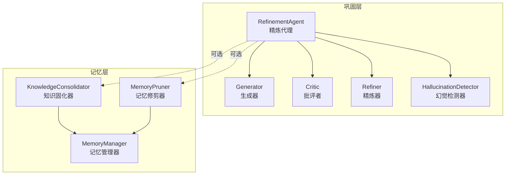
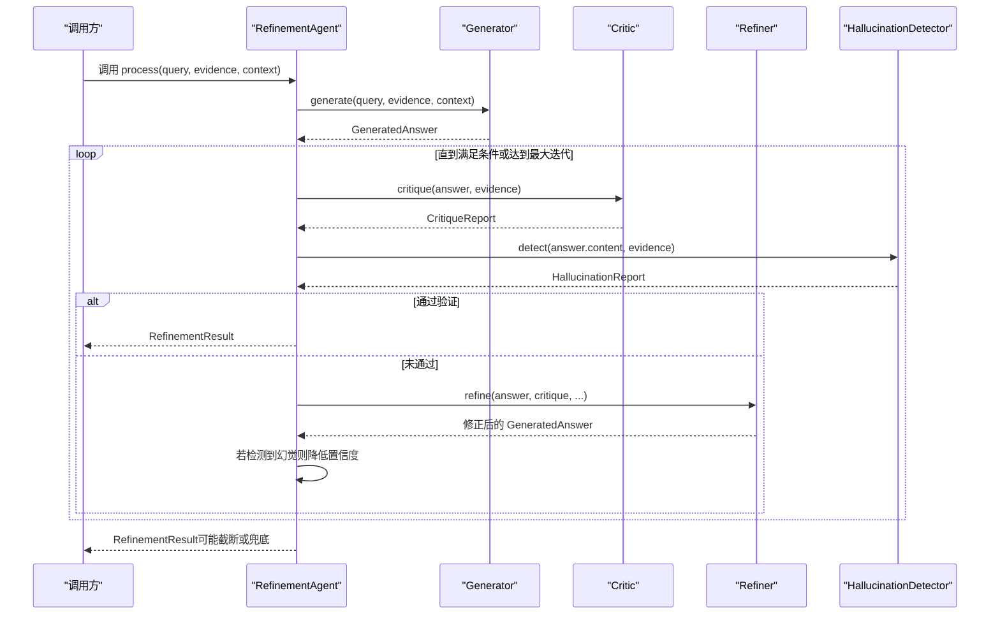
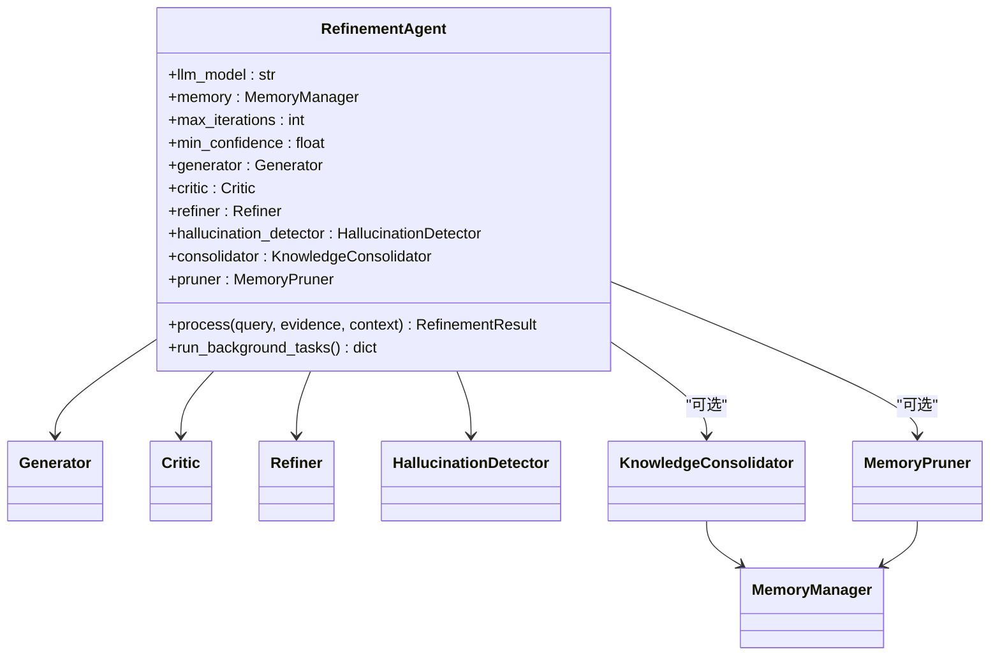
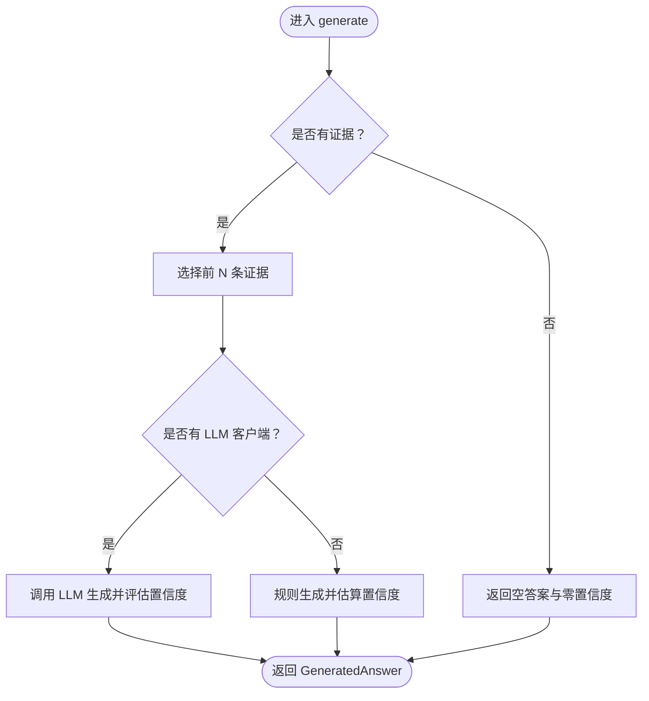
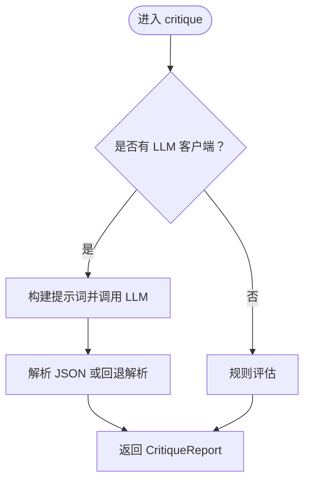
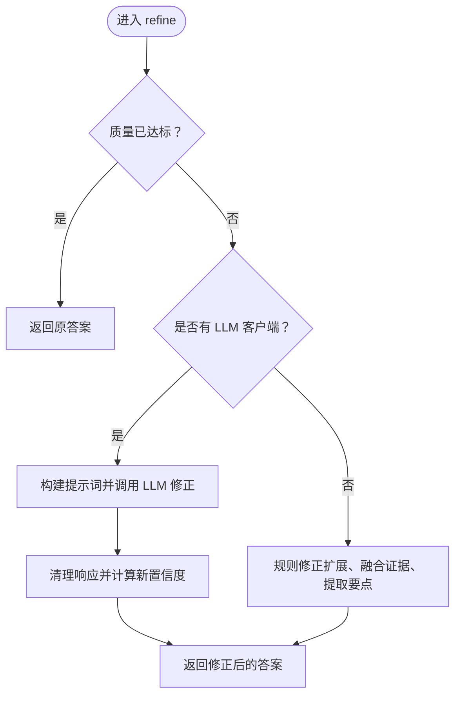
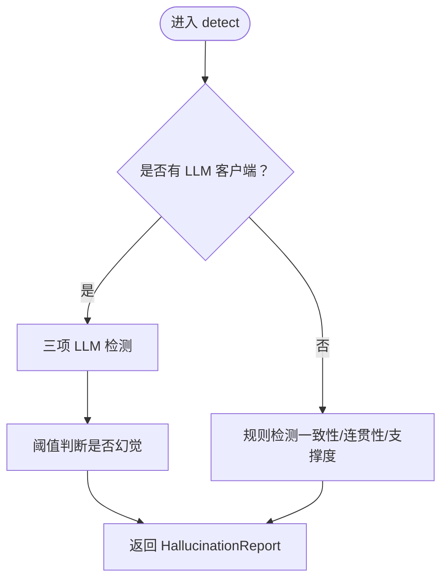
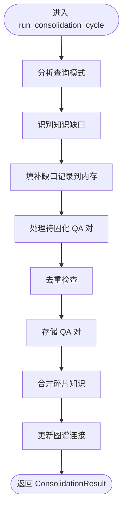
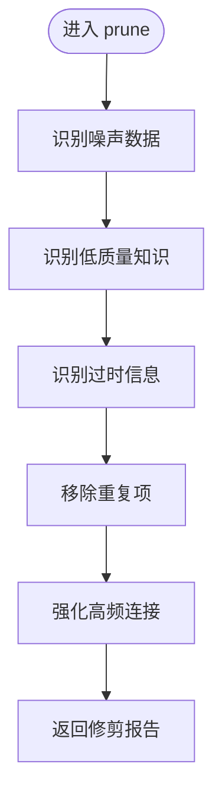
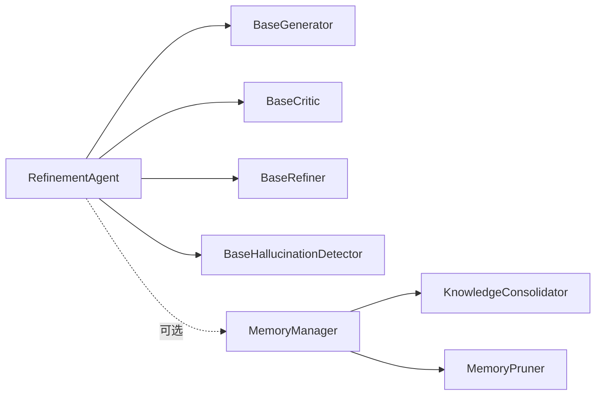

# 精炼代理核心

<cite>
**本文引用的文件**
- [src/refinement/agent.py](file://src/refinement/agent.py)
- [src/refinement/generator.py](file://src/refinement/generator.py)
- [src/refinement/critic.py](file://src/refinement/critic.py)
- [src/refinement/refiner.py](file://src/refinement/refiner.py)
- [src/refinement/hallucination.py](file://src/refinement/hallucination.py)
- [src/refinement/consolidator.py](file://src/refinement/consolidator.py)
- [src/refinement/pruner.py](file://src/refinement/pruner.py)
- [src/refinement/models.py](file://src/refinement/models.py)
- [src/core/base.py](file://src/core/base.py)
- [src/memory/manager.py](file://src/memory/manager.py)
- [example/example_usage.py](file://example/example_usage.py)
- [src/core/config.py](file://src/core/config.py)
</cite>

## 目录
1. [引言](#引言)
2. [项目结构](#项目结构)
3. [核心组件](#核心组件)
4. [架构总览](#架构总览)
5. [详细组件分析](#详细组件分析)
6. [依赖分析](#依赖分析)
7. [性能考虑](#性能考虑)
8. [故障排查指南](#故障排查指南)
9. [结论](#结论)
10. [附录](#附录)

## 引言
本文件面向“精炼代理核心”组件，系统化解析 RefinementAgent 的设计与实现，重点覆盖：
- 作为协调器如何组织生成器、批评者、精炼器、幻觉检测器的闭环流程
- 初始化阶段的组件装配与依赖注入
- process 方法的完整工作流：初始答案生成、批判评估、幻觉检测、迭代优化
- 最大迭代次数与最低置信度阈值的作用机制
- 异步后台任务的知识固化与记忆修剪协调机制
- 配置与使用示例路径

## 项目结构
精炼代理位于 src/refinement 目录，围绕 RefinementAgent 协调各子组件，形成“生成-评估-修正-检测”的闭环，并通过记忆管理器与知识固化/修剪器实现长期知识的沉淀与维护。

图表来源
- [src/refinement/agent.py:20-164](file://src/refinement/agent.py#L20-L164)
- [src/refinement/generator.py:16-209](file://src/refinement/generator.py#L16-L209)
- [src/refinement/critic.py:18-309](file://src/refinement/critic.py#L18-L309)
- [src/refinement/refiner.py:18-371](file://src/refinement/refiner.py#L18-L371)
- [src/refinement/hallucination.py:18-507](file://src/refinement/hallucination.py#L18-L507)
- [src/refinement/consolidator.py:41-659](file://src/refinement/consolidator.py#L41-L659)
- [src/refinement/pruner.py:10-157](file://src/refinement/pruner.py#L10-L157)
- [src/memory/manager.py:20-212](file://src/memory/manager.py#L20-L212)

章节来源
- [src/refinement/agent.py:20-164](file://src/refinement/agent.py#L20-L164)
- [src/refinement/generator.py:16-209](file://src/refinement/generator.py#L16-L209)
- [src/refinement/critic.py:18-309](file://src/refinement/critic.py#L18-L309)
- [src/refinement/refiner.py:18-371](file://src/refinement/refiner.py#L18-L371)
- [src/refinement/hallucination.py:18-507](file://src/refinement/hallucination.py#L18-L507)
- [src/refinement/consolidator.py:41-659](file://src/refinement/consolidator.py#L41-L659)
- [src/refinement/pruner.py:10-157](file://src/refinement/pruner.py#L10-L157)
- [src/memory/manager.py:20-212](file://src/memory/manager.py#L20-L212)

## 核心组件
- RefinementAgent：协调器，编排生成、评估、修正、检测与后台任务
- Generator：基于证据生成答案，支持 LLM 与规则回退
- Critic：多维度质量评估（事实性、完整性、相关性）
- Refiner：基于反馈迭代修正答案，支持 LLM 与规则回退
- HallucinationDetector：事实一致性、逻辑连贯性、证据支撑度检测
- KnowledgeConsolidator：高质量 QA 对的持久化、去重、合并与知识图谱更新
- MemoryPruner：噪声、低质量、过时知识的修剪与连接强化

章节来源
- [src/refinement/agent.py:20-164](file://src/refinement/agent.py#L20-L164)
- [src/refinement/generator.py:16-209](file://src/refinement/generator.py#L16-L209)
- [src/refinement/critic.py:18-309](file://src/refinement/critic.py#L18-L309)
- [src/refinement/refiner.py:18-371](file://src/refinement/refiner.py#L18-L371)
- [src/refinement/hallucination.py:18-507](file://src/refinement/hallucination.py#L18-L507)
- [src/refinement/consolidator.py:41-659](file://src/refinement/consolidator.py#L41-L659)
- [src/refinement/pruner.py:10-157](file://src/refinement/pruner.py#L10-L157)

## 架构总览
RefinementAgent 作为中枢，负责：
- 初始化子组件并注入 LLM 客户端
- 在每次迭代中依次执行：生成答案、批判评估、幻觉检测、必要时修正
- 达到最大迭代次数或满足通过条件后返回结果
- 可选地异步运行知识固化与记忆修剪任务

图表来源
- [src/refinement/agent.py:65-141](file://src/refinement/agent.py#L65-L141)
- [src/refinement/generator.py:68-101](file://src/refinement/generator.py#L68-L101)
- [src/refinement/critic.py:90-112](file://src/refinement/critic.py#L90-L112)
- [src/refinement/refiner.py:98-130](file://src/refinement/refiner.py#L98-L130)
- [src/refinement/hallucination.py:136-156](file://src/refinement/hallucination.py#L136-L156)

章节来源
- [src/refinement/agent.py:65-141](file://src/refinement/agent.py#L65-L141)

## 详细组件分析

### RefinementAgent 类
- 职责：协调生成、评估、修正、检测与后台任务
- 关键字段：llm_model、memory、max_iterations、min_confidence
- 子组件装配：Generator、Critic、Refiner、HallucinationDetector；若提供 memory，则装配 KnowledgeConsolidator 与 MemoryPruner
- process 流程：生成初始答案 → 批判评估 → 幻觉检测 → 未通过则修正 → 重复直至通过或达上限 → 返回结果
- 异步后台任务：run_background_tasks 并行运行知识固化与记忆修剪

图表来源
- [src/refinement/agent.py:31-63](file://src/refinement/agent.py#L31-L63)
- [src/refinement/consolidator.py:53-83](file://src/refinement/consolidator.py#L53-L83)
- [src/refinement/pruner.py:20-39](file://src/refinement/pruner.py#L20-L39)
- [src/memory/manager.py:20-47](file://src/memory/manager.py#L20-L47)

章节来源
- [src/refinement/agent.py:31-63](file://src/refinement/agent.py#L31-L63)
- [src/refinement/agent.py:143-163](file://src/refinement/agent.py#L143-L163)

### 生成器（Generator）
- 功能：基于证据生成答案，支持 LLM 与规则回退；估算置信度
- 关键点：证据截断、提示词构造、温度控制、置信度估计

图表来源
- [src/refinement/generator.py:68-101](file://src/refinement/generator.py#L68-L101)
- [src/refinement/generator.py:103-141](file://src/refinement/generator.py#L103-L141)
- [src/refinement/generator.py:143-175](file://src/refinement/generator.py#L143-L175)
- [src/refinement/generator.py:177-208](file://src/refinement/generator.py#L177-L208)

章节来源
- [src/refinement/generator.py:68-101](file://src/refinement/generator.py#L68-L101)
- [src/refinement/generator.py:103-141](file://src/refinement/generator.py#L103-L141)
- [src/refinement/generator.py:143-175](file://src/refinement/generator.py#L143-L175)
- [src/refinement/generator.py:177-208](file://src/refinement/generator.py#L177-L208)

### 批评者（Critic）
- 功能：多维度评估答案质量（事实性、完整性、相关性），支持 LLM 与规则回退
- 关键点：JSON 解析、回退解析、规则评估逻辑

图表来源
- [src/refinement/critic.py:90-112](file://src/refinement/critic.py#L90-L112)
- [src/refinement/critic.py:114-142](file://src/refinement/critic.py#L114-L142)
- [src/refinement/critic.py:143-193](file://src/refinement/critic.py#L143-L193)
- [src/refinement/critic.py:232-308](file://src/refinement/critic.py#L232-L308)

章节来源
- [src/refinement/critic.py:90-112](file://src/refinement/critic.py#L90-L112)
- [src/refinement/critic.py:114-142](file://src/refinement/critic.py#L114-L142)
- [src/refinement/critic.py:143-193](file://src/refinement/critic.py#L143-L193)
- [src/refinement/critic.py:232-308](file://src/refinement/critic.py#L232-L308)

### 精炼器（Refiner）
- 功能：根据批判反馈修正答案，支持 LLM 与规则回退；可迭代修正
- 关键点：提示词构造、证据融合、置信度调整、响应清理

图表来源
- [src/refinement/refiner.py:98-130](file://src/refinement/refiner.py#L98-L130)
- [src/refinement/refiner.py:177-244](file://src/refinement/refiner.py#L177-L244)
- [src/refinement/refiner.py:246-296](file://src/refinement/refiner.py#L246-L296)

章节来源
- [src/refinement/refiner.py:98-130](file://src/refinement/refiner.py#L98-L130)
- [src/refinement/refiner.py:177-244](file://src/refinement/refiner.py#L177-L244)
- [src/refinement/refiner.py:246-296](file://src/refinement/refiner.py#L246-L296)

### 幻觉检测器（HallucinationDetector）
- 功能：事实一致性、逻辑连贯性、证据支撑度检测；支持 LLM 与规则回退
- 关键点：三项检测、阈值判断、关键词与正则解析

图表来源
- [src/refinement/hallucination.py:136-156](file://src/refinement/hallucination.py#L136-L156)
- [src/refinement/hallucination.py:158-193](file://src/refinement/hallucination.py#L158-L193)
- [src/refinement/hallucination.py:308-339](file://src/refinement/hallucination.py#L308-L339)

章节来源
- [src/refinement/hallucination.py:136-156](file://src/refinement/hallucination.py#L136-L156)
- [src/refinement/hallucination.py:158-193](file://src/refinement/hallucination.py#L158-L193)
- [src/refinement/hallucination.py:308-339](file://src/refinement/hallucination.py#L308-L339)

### 知识固化器（KnowledgeConsolidator）
- 功能：分析查询模式、识别知识缺口、填补缺口、去重、合并碎片、更新图谱连接
- 关键点：查询日志记录、QA 对缓存、相似度阈值、LLM 合并回退

图表来源
- [src/refinement/consolidator.py:105-160](file://src/refinement/consolidator.py#L105-L160)
- [src/refinement/consolidator.py:217-248](file://src/refinement/consolidator.py#L217-L248)
- [src/refinement/consolidator.py:282-321](file://src/refinement/consolidator.py#L282-L321)
- [src/refinement/consolidator.py:323-357](file://src/refinement/consolidator.py#L323-L357)

章节来源
- [src/refinement/consolidator.py:105-160](file://src/refinement/consolidator.py#L105-L160)
- [src/refinement/consolidator.py:217-248](file://src/refinement/consolidator.py#L217-L248)
- [src/refinement/consolidator.py:282-321](file://src/refinement/consolidator.py#L282-L321)
- [src/refinement/consolidator.py:323-357](file://src/refinement/consolidator.py#L323-L357)

### 记忆修剪器（MemoryPruner）
- 功能：识别噪声、低质量、过时知识并删除，强化高频连接
- 关键点：权重、访问次数、最后访问时间、阈值

图表来源
- [src/refinement/pruner.py:41-69](file://src/refinement/pruner.py#L41-L69)
- [src/refinement/pruner.py:71-85](file://src/refinement/pruner.py#L71-L85)
- [src/refinement/pruner.py:87-101](file://src/refinement/pruner.py#L87-L101)
- [src/refinement/pruner.py:103-118](file://src/refinement/pruner.py#L103-L118)
- [src/refinement/pruner.py:120-137](file://src/refinement/pruner.py#L120-L137)
- [src/refinement/pruner.py:139-156](file://src/refinement/pruner.py#L139-L156)

章节来源
- [src/refinement/pruner.py:41-69](file://src/refinement/pruner.py#L41-L69)
- [src/refinement/pruner.py:71-85](file://src/refinement/pruner.py#L71-L85)
- [src/refinement/pruner.py:87-101](file://src/refinement/pruner.py#L87-L101)
- [src/refinement/pruner.py:103-118](file://src/refinement/pruner.py#L103-L118)
- [src/refinement/pruner.py:120-137](file://src/refinement/pruner.py#L120-L137)
- [src/refinement/pruner.py:139-156](file://src/refinement/pruner.py#L139-L156)

## 依赖分析
- RefinementAgent 依赖抽象基类（BaseGenerator/BaseCritic/BaseRefiner/BaseHallucinationDetector）以实现组件解耦
- 记忆管理器 MemoryManager 为可选依赖，用于知识固化与修剪
- 各组件均支持 LLM 与规则回退双路径，提升鲁棒性

图表来源
- [src/core/base.py:448-537](file://src/core/base.py#L448-L537)
- [src/refinement/agent.py:52-63](file://src/refinement/agent.py#L52-L63)
- [src/memory/manager.py:20-47](file://src/memory/manager.py#L20-L47)

章节来源
- [src/core/base.py:448-537](file://src/core/base.py#L448-L537)
- [src/refinement/agent.py:52-63](file://src/refinement/agent.py#L52-L63)
- [src/memory/manager.py:20-47](file://src/memory/manager.py#L20-L47)

## 性能考虑
- 证据截断：生成器限制最大证据数量，减少上下文长度与推理成本
- 温度参数：生成与修正阶段采用不同温度，平衡创造性与稳定性
- 迭代上限：process 中 max_iterations 控制最坏情况下的调用次数
- 规则回退：在 LLM 不可用时保证基本能力
- 异步固化：run_background_tasks 并行执行，避免阻塞主线程

## 故障排查指南
- LLM 调用异常：各组件均具备规则回退路径，若 LLM 客户端不可用，将自动降级
- 幻觉检测误报：可通过调整阈值（事实一致性、逻辑连贯性、证据支撑度）与提示词模板优化
- 精炼停滞：检查 max_iterations 是否过小，或质量阈值过高导致无法收敛
- 置信度异常：关注幻觉检测对置信度的折扣（每次检测到幻觉时乘以系数）

章节来源
- [src/refinement/critic.py:136-141](file://src/refinement/critic.py#L136-L141)
- [src/refinement/refiner.py:242-244](file://src/refinement/refiner.py#L242-L244)
- [src/refinement/hallucination.py:171-176](file://src/refinement/hallucination.py#L171-L176)
- [src/refinement/agent.py:127-130](file://src/refinement/agent.py#L127-L130)

## 结论
RefinementAgent 通过“生成-评估-修正-检测”的闭环，结合幻觉检测与可选的记忆管理，实现了高质量、可解释、可演进的答案生成流程。其模块化设计与规则回退机制提升了系统的鲁棒性，异步后台任务进一步完善了知识的沉淀与维护。

## 附录

### 配置与使用示例
- 使用示例路径：[example/example_usage.py:139-173](file://example/example_usage.py#L139-L173)
- 配置参考：[src/core/config.py:195-216](file://src/core/config.py#L195-L216)
- 数据模型：[src/refinement/models.py:9-66](file://src/refinement/models.py#L9-L66)

章节来源
- [example/example_usage.py:139-173](file://example/example_usage.py#L139-L173)
- [src/core/config.py:195-216](file://src/core/config.py#L195-L216)
- [src/refinement/models.py:9-66](file://src/refinement/models.py#L9-L66)